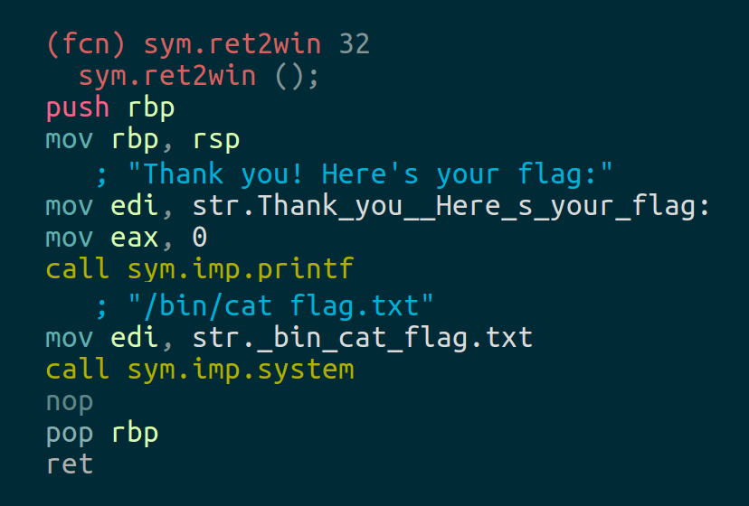

# ROP系列 2 第一个ROP链

> 内容来自：https://ropemporium.com/challenge/ret2win.html

在要调用的二进制文件中找到一个方法，通过覆盖已经保存在堆栈中的返回地址完成这个题目。

These challenges use the usual CTF objective of retrieving the contents of a file named "flag.txt" from a remote machine by exploiting a given binary. The two most common courses of action are to somehow read flag.txt back to us directly or drop a shell and read it yourself. Let's see if ret2win has an easy way to do either of these by doing our due diligence on the x86_64 version of the challenge. We'll use the following nm one-liner to check method names. nm ret2win|grep ' t ' will tell us that the suspiciously named function 'ret2win' is present and radare2 confirms that it will cat the flag back to us:

Double check
For a quick and dirty confirmation of how many bytes are needed to cause an overflow in the 64bit binary you can use sudo dmesg -C to clear the kernel ring buffer, run the program and type 40 characters followed by 5 capital Xs (why let the As have all the fun) then type dmesg -t to see output that hopefully looks similar to the sample below:

ret2win[14987]: segfault at a5858585858 ip 00000a5858585858 sp 00007ffe8c93d4e0 error 14 in libc-2.24.so[7fef0e075000+195000]
It's worth confirming this before each challenge but typically you'll need 40 bytes of garbage to reach the saved return address in the 64bit binaries, 44 bytes in the 32bit binaries and around 36 bytes in the ARMv5 & MIPS binaries.

Let's do this
You can solve this challenge with a variety of tools, even the echo command will work, although pwntools is suggested. If you decided to go for a more complex exploit than a ret2win then be aware that input is truncated for these simpler challenges. Find out how many bytes you have to construct your chain in each challenge using ltrace <binary> and looking at the call to read(). If your ROP chain seems perfect but the binary is crashing before printing the flag see the common pitfalls section of the beginner's guide, especially if you're using Ubuntu 18.04