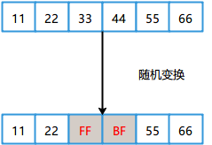

# FUZZ 基础

> 主要参考：
> - https://mp.weixin.qq.com/s/Bw8xoaeeqrRdvK2ZZisC1A

## 基本概念
模糊测试（fuzz testing）是一种安全测试方法，他介于完全的手工测试和完全的自动化测试之间。Fuzz测试通过不断地让被测程序处理各种畸形测试数据来挖掘软件漏洞。一个Fuzz工具由三个基础模块组成，分别是：
- 测试用例生成模块
- 程序执行模块
- 异常检测模块


各个模块的作用以及模块间的交互如下：
- 测试用例生成模块，它负责不断的生成测试用例，然后会把测试用例交给程序执行模块。
- 程序执行模块，它根据被测程序接收数据的方式启动程序并把测试用例交给目标程序处理。
- 异常检测模块，负责监控程序在处理测试用例时是否发生异常，如果发生了异常就保存异常信息。


Fuzz工具按照生成测试数据的方式可以分为：
- 基于生成的Fuzz工具(Generation Based Fuzzer)
- 基于变异的Fuzz工具(Mutation Based Fuzzer)
- 基于覆盖率引导的Fuzz工具（Coverage Guided Fuzzer）

### 基于生成的Fuzz工具

Generation Based Fuzzer通过用户提供的数据格式描述文档(比如peach的pit文件)来生成测试数据，如下所示是一个c语言表示的结构体：

```c
struct{
  int ID;
  int Size;  // data 的长度
  data[Size]; // data数组
}
```

该结构体用 pit 文件描述如下:

```xml
<DataModel name="Chunk">
    <Number name="ID" size="32" value="0x12345678" />
    <Number name="Size" size="32" >
        <Relation type="size" of="Data" />
    </Number>
    <Blob name="Data" valueType="hex" value="aa bb cc dd ee ff 11 22"/>
</DataModel>
```

pit文件写好后用peach解析就可以生成示例数据，比如该pit文件生成的测试数据如下:


可以看到生成的数据和我们在pit文件中描述的默认值符合。

```
ID: 78 56 34 12  // 0x12345678的小端表示
Size: 08 00 00 00 // 4字节，表示Data的长度
Data: aa bb cc dd ee ff 11 22 // 8 个字节的Data数据
```

### 基于变异的fuzz工具

Mutation-Based Fuzzer通过对用户提供的初始数据进行一系列变换（比如Bit翻转，随机插入数据等）来生成测试数据，一个简单数据变异示例图如下:



### 基于覆盖引导的fuzz工具

为了提升Fuzz的测试效率，基于覆盖率引导的Fuzz工具（Coverage Guided Fuzzer）应运而生。

Coverage Guided Fuzzer会在Fuzz的过程中为Fuzzer提供覆盖率信息，之后Fuzzer会将能够产生新代码覆盖率的用例保存下来用于后续的Fuzz，通过这种方式可以逐步提升Fuzzing测试的覆盖率，此时的Fuzzing流程图如下所示：


当Fuzz时生成的测试用例产生了新的路径时，就把该用例添加到样本池用于后续的测试。

对于Fuzz测试而言**有两个非常关键的因素：Fuzz的样本集和速度**。一个比较好的样本集可以让程序在Fuzz的一开始就达到很高的覆盖率，一般来说覆盖率越高，挖出漏洞的概率也就越大。Fuzz的速度对漏洞挖掘的影响也是类似，Fuzz的速度越快，相同时间内Fuzz的次数也就越多，也就能测试更多的代码，一样可以提升挖出漏洞的概率。所以在Fuzz的过程中，我们始终要想办法提升Fuzz的速度和覆盖率。

为了获取到一个高质量的初始样本集首先我们需要获取到足够数量的样本，常见的样本获取途径有以下几种：
- 从一些提供样本集的在线站点获取
- 通过搜索引擎的语法爬取大量的样本文件
- 一些开源项目会带一些测试用例来测试程序
- Fuzz其他类似软件时生成的样本文件
- 目标程序或者类似程序的bug提交页面
- 用格式转换工具生成


一些常用的在线样本集获取网址:
- https://files.fuzzing-project.org/
- http://samples.ffmpeg.org/
- http://lcamtuf.coredump.cx/afl/demo/
- https://github.com/MozillaSecurity/fuzzdata
- https://github.com/strongcourage/fuzzing-corpus
- https://github.com/Cisco-Talos/clamav-fuzz-corpus
- https://github.com/mozilla/pdf.js/tree/master/test/pdfs
- https://github.com/codelibs/fess-testdata
- https://github.com/google/honggfuzz/tree/master/examples/apache-httpd


在获取到大量的测试样本后还需要对样本集进行精简，因为其中的很多样本能触发的路径是一样的，这样会导致Fuzzer可能花了大量的时间在测试同一块代码，从而降低Fuzzing效率。

常见的精简样本集的思路是让程序逐个处理样本，然后把能够产生新路径的样本保留下来，这样就能在保留代码覆盖率的前提下大大减少样本集的数量，如下图所示，初始样本有5个，其中样本A、B、E可以覆盖5个样本的总覆盖路径，那么样本精简后的结果就是A、B、E。


提升Fuzz测试的速度有很多种，其中比较通用的方法有:
- 内存磁盘
- 并行执行多个Fuzz任务
- 对AFL以及其衍生的Fuzz工具而言还可以通过延时初始化forkserver来提升Fuzz的速度

这些方式的具体应用我们在本章的后面逐一介绍。

## 文件 Fuzz

Honeyview是一款流行的图片浏览器，支持多种图片文件格式，本节以Honeyview为例来介绍两种常见的文件Fuzz方式：Generation Based Fuzzing 和 Mutation Based Fuzzing。