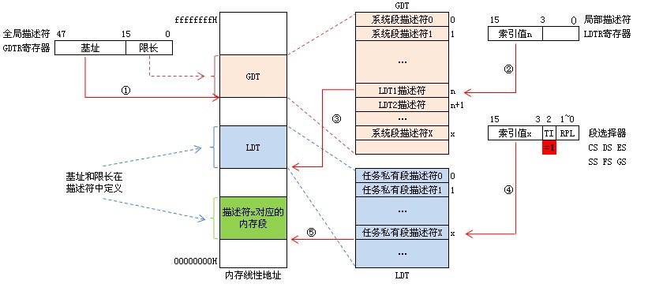

# 32位保护模式
在80286以及更高系列的PC中，即使A20 Gate被打开，在实模式下所能够访问的内存最大也只能为10FFEFH，尽管它们的地址总线所能够访问的能力都大大超过这个限制。为了能够访问10FFEFH以上的内存，则必须进入保护模式。


- 保护什么？
  - 分清楚各个程序使用的存储区域，不允许随便跨界访问。
- 怎么保护？
  - 为内存里的每段地址空间定义一些安全上的属性，比如：可以被多少优先级的代码写入，是不是允许执行等。

## 寻址方式

在16位实模式下，物理地址=段基址 * 16 + 偏移地址EA。 

在保护模式下，段寄存器远远不能满足要求了。原因有二：段寄存器只有32位，保存不了这么多信息；段寄存器个数有限，不能保存内存中所有段的信息。

Intel的工程师们就想出了用64位的段描述符表（descriptor table）来存储所有的段信息，段描述符表存放在内存的某个位置。段寄存器不再表示段首地址了，而是表示这个段在段描述符表的索引信息。通过段寄存器在段描述符表里找到关于这个段的所有信息。

段描述符表不止一个：
- 有一个全局段描述符表，简称GDT
- 每个程序都有自己的段描述符表，简称LDT。

相应的，80386里面引入了两个新的寄存器：
- 一个是48位的全局描述符表寄存器GDTR，指向全局描述符表GDT的首地址，
- 一个是16位的局部描述符表寄存器LDTR，它的值随时变化，总是指向CPU当时正在执行的那个程序的局部描述符表LDT。

GDT和LDT的关系如图所示：


注意，这里不说指向LDT的首地址，是因为LDTR和CS、DS等段寄存器一样，存放的也是在GDT中的索引值，而不是实际地址。

那么段寄存器里的索引到底是GDT的索引还是LDT得索引呢？下面是实模式下段寄存器的结构：```13位的描述符索引 + 1位的TI + 2位的特权级```。

- 当 TI = 0 时，表示从GDT中查找段信息


- 当 TI = 1 时，表示从LDT中查找段信息



以保护模式下的虚拟地址形式 xxxx:yyyyyyyy（即16位段寄存器值，32位偏移地址）为例，查找虚拟内存地址：
- 先看xxxx中的TI位
  - 若为0，则找GDT中偏移位置为xxxx高13位的内容，此内容为段描述符，可从中获得段基址、段限长、优先级等信息；
  - 若为1，则找LDTR中得到当前程序的LDT索引，按此索引在GDT表中找到LDT，然后以此LDT首地址+xxxx高13位的偏移地址找到段描述符，可从中获得段基址、段限长、优先级等信息；

- xxxx称为段选择子，是段描述符在GDT或LDT中的偏移地址（字节数）

GDTR寄存器的结构（共48位）：```32位GDT在内存中的起始地址 +  16位的GDT长度```


各属性位作用：
- G 段限长属性, G=0时，段限长的20位为实际段限长，最大限长2的20次幂=1MB；G=1时，则实际段限长为20位段限长乘以2^12=4KB，最大限长达到4GB
- D/B ：当描述符指向的是可执行代码段时，这一位叫做D位，D=1使用32位地址和32/8位操作数；D=0使用16位地址和16/8位操作数。如果指向的是向下扩展的数据段，这一位叫做B位，B=1时段的上界为4GB，B=0时段的上界为64KB。如果指向的是堆栈段，这一位叫做B位，B=1使用32位操作数，堆栈指针用ESP，B=0时使用16位操作数，堆栈指针用SP。
- AVL：available and reserved bit 通常为0
- P：存在位，P=1表示段在内存中
- DPL：特权级，0为最高特权级，3为最低，表示访问该段时CPU所需处于的最低特权级
- S：S=1表示该描述符指向的是代码段或数据段；S=0表示系统端（TSS、LDT）和门描述符
- TYPE：类型，和S结合使用
- S=1且TYPE<8时，为数据段描述符。数据段都是可读的，但不一定可写。


- S=1且TYPE>=8时，为代码段描述符。代码段都是可执行的，一定不可写，不一定可读


- S=0时，描述符可能为TSS、LDT和4种门描述符


