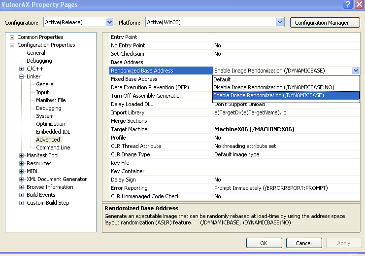
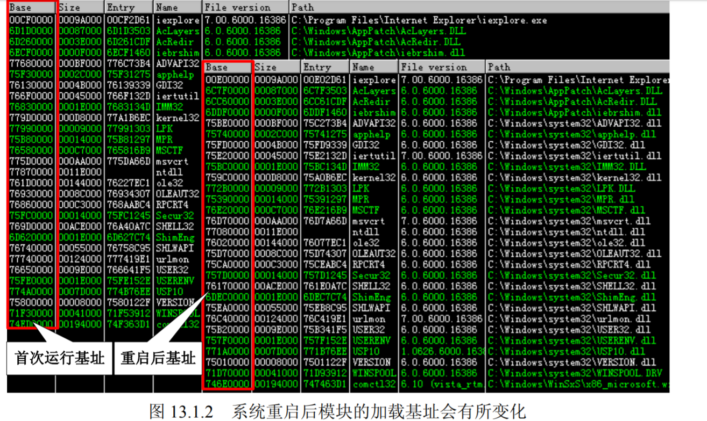
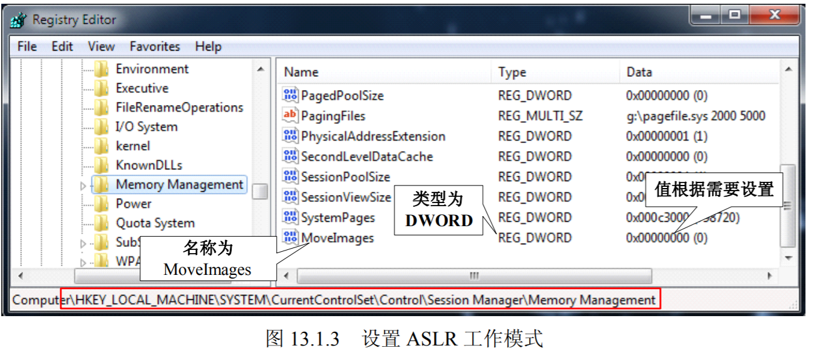
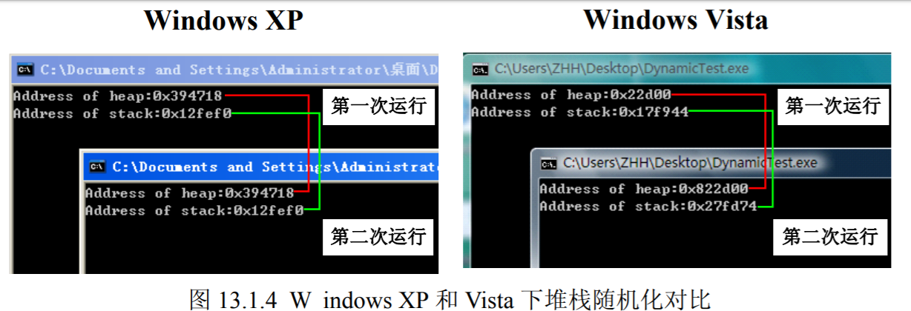
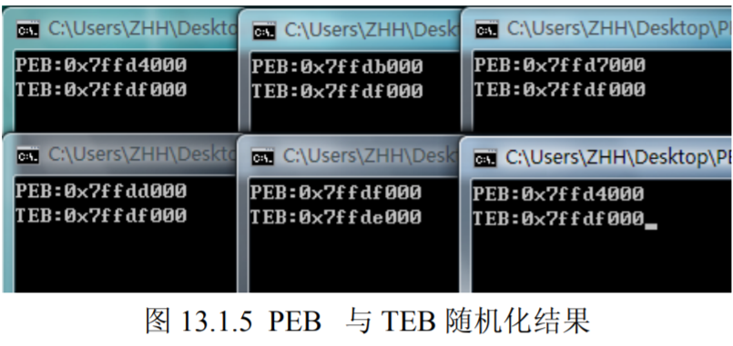

# 第10讲 Windows安全机制3——ASLR

## 内存随机化保护机制的原理 

纵观前面介绍的所有漏洞利用方法都有着一个共同的特征：都需要确定一个明确的跳转地址。无论是 JMP ESP 等通用跳板指令还是 Ret2Libc 使用的各指令，我们都要先确定这条指令的入口点。所谓惹不起躲得起，微软的 ASLR（Address Space Layout Randomization）技术就是通过加载程序的时候不再使用固定的基址加载，从而干扰 shellcode 定位的一种保护机制。

实际上 ASLR 的概念在 Windows XP 时代就已经提出来了，只不过 XP 上面的 ASLR 功能很有限，只是对 PEB 和 TEB 进行了简单的随机化处理，而对于模块的加载基址没有进行随机化处理，直到 Windows Vista 出现后，ASLR 才真正开始发挥作用。

与 SafeSEH 类似 ASLR 的实现也需要程序自身的支持和操作系统的双重支持，其中程序的支持不是必需的，稍后我们会说明。支持ASLR的程序在它的PE头中会设置```IMAGE_DLL_CHARACTERISTICS_ DYNAMIC_BASE```标识来说明其支持 ASLR。微软从 Visual Studio 2005 SP1 开始加入了/dynamicbase 链接选项来帮我们完成这个任务，我们只需要在编译程序的时候启用/dynmicbase 链接选项，编译好的程序就支持 ASLR 了。

Visual Studio 2008 (VS 9.0)中，可以在通过菜单中的 Project→project Properties→Configuration Pr operties→Linker→Advanced→Randomized Base Address 选项对 /dynmicbase 链接选项进行设置，如图。



我们前面提到 ASLR 在 Windows Vista 之后的操作系统上才真正的发挥作用，它包含了映像随机化、堆栈随机化、PEB 与 TEB 随机化，接下来我们看看每一项的细节。

### 映像随机化（Image Randomize）
映像随机化是在 PE 文件映射到内存时，对其加载的虚拟地址进行随机化处理，这个地址是在系统启动时确定的，系统重启后这个地址会变化。我们以 IE 为例来看看 Windows Vista 开启 ASLR 后各模块加载的微妙之处。我们用 OllyDbg 加载 IE 并记录其加载模块的地址，然后重启系统后再记录一次，如下图所示 IE 的各加载模块基址在系统重启会是变化的。



可能是出于兼容性的考虑，微软在系统中设置了映像随机化的开关，用户可以通过设置注册表中 ```HKEY_LOCAL_MACHINE\SYSTEM\CurrentControlSet\Control\Session Manager\Memory Management\MoveImages``` 的键值来设定映像随机化的工作模式。
- 设置为 0 时映像随机化将禁用。
- 设置为 −1 时强制对可随机化的映像进行处理，无论是否设置 ```IMAGE_DLL_CHARACTERISTICS_DYNAMIC_BASE``` 标识。
- 设置为其他值时为正常工作模式，只对具有随机化处理标识的映像进行处理。

如果注册表中不存在 MoveImages，大家可以手工建立名称为 MoveImages，类型为 DWORD 的值，并根据需要设置它的值，如图 13.1.3 所示。



### 堆栈随机化

这项措施是在程序运行时随机的选择堆栈的基址，与映像基址随机化不同的是堆栈的基址不是在系统启动的时候确定的，而是在打开程序的时候确定的，也就是说同一个程序任意两次运行时的堆栈基址都是不同的，进而各变量在内存中的位置也就是不确定的。

我们通过如下代码简单的测试一下堆栈随机化对变量在内存位置的影响，我们分别在堆和栈上各申请 100 个字节的空间，然后在 Windows XP 和 Windows Vista 下面各运行两次，来比较变量在内存中起始位置的情况。

```c
int_t main(int argc, _TCHAR* argv[])
{
    char * heap=(char *)malloc(100);
    char stack[100];
    printf("Address of heap:%#0.4x\nAddress of stack:%#0.4x",heap, stack);
    getchar();
    return 0;
} 
```
运行结果如下图所示，在不具备堆栈随机化的 XP 上面两次申请空间的起始地址完全相同，而在 Vista 上面两次申请空间的起始地址相差甚远。



### PEB 与 TEB 随机化
PEB 与 TEB 随机化在 Windows XP SP2 中就已经引入了，微软在 XP SP2 之后不再使用固定的 PEB 基址 0x7FFDF000 和 TEB 基址 0x7FFDE000，而是使用具有一定随机性的基址，这就增加了攻击 PEB 中的函数指针的难度。覆盖 PEB 中函数指针的利用方式请参见“堆溢出利用（下）”中的实验的相关介绍。

获取当前进程的 TEB 和 PEB 很简单，TEB 存放在 FS:0 和 FS:[0x18]处，PEB 存放在 TEB 偏移 0x30 的位置，可以通过如下代码来获取当前进程的 TEB 和 PEB。

编译好程序后，运行多次以查看 PEB 和 TEB 的情况，运行结果如下图所示。从图中我们不难看出 PEB 和 TEB 的随机效果不是很好。



ASLR 的出现使得 shellcode 中的关键跳转只能在系统重启前，甚至只有程序的本次运行时才能执行，这使得 exploit 的难度大大增加。道高一尺，魔高一丈，任何一种保护技术都有一些自身的弱点，攻击者已经用事实告诉人们 ASLR 不是不可以突破的。

首先我们来看看 ASLR 中最重要的部分——映像随机化。由于 ASLR 将所有受保护模块的加载基址都做了随机化处理，我们**以前找到的通用跳板指令的地址也就不再固定**，这些指令也就失去了意义。但这个随机过程是不是完美无疵的呢？答案是否定的，细心的读者在看基址加载地址不同的图片时候会发现一个现象，虽然模块的加载基址变化了，但是各模块的入口点（Entry 那列）地址的低位 2 个字节是不变的，也就是说**映像随机化只是对加载基址的前 2 个字节做了随机处理**。

例如，某个模块的入口地址为 0x12345678，那么系统重启的它的入口地址可能会变为0x43215678，地址的前 2 个字节是随机的，而后两个字节 0x5678 是固定的。这就给我们留下了一点点机会，此处暂且按住不表，带到稍后在“利用部分覆盖定位内存地址”一节中再详细说明。

然后再来看看ASLR中的堆栈随机化。**堆栈随机化将每个线程的堆栈基址都做了随机化处理，使得程序每次运行时变量的地址都不相同**。这样处理之后的好处是可以防止精准攻击，例如我们需要根据 shellcode 的起始地址直接跳转到 shellcode 执行，**但是自从 JMP ESP 跳板指令开始使用后溢出时很少直接跳到 shellcode 中执行了；另外在浏览器攻击方面很流行的 heap spray 等技术，这些技术也是不需要精准跳转的，只需要跳转到一个大概的位置即可。所以这项措施对于目前的溢出手段影响有限**。

最后我们来看看 PEB 和 TEB 的随机化。如前所述，**PEB 和 TEB 的随机化随机化程度实在不敢恭维，而且即便做到了完全随机，依然还是可以通过其他方法获取到当前进程的 PEB 和 TEB**。

## 攻击未启用 ASLR 的模块 

ASLR 仅仅是项安全机制，不是什么行业标准，不支持 ASLR 的软件有很多。不支持 ASLR 意味着加载基址固定，如果我们能够在当前进程空间中找到一个这样的模块，就可以利用它里边的指令来做跳板了，直接无视 ASLR。
这样的模块还不难找，就有一个摆在我们面前，这个模块就是大名鼎鼎的 Adobe Flash Player ActiveX。

>在 IE 广泛启用安全机制后的相当一段时间，Flash Player ActiveX 并未支持SafeSEH，ASLR 等新特性，作为浏览器应用最为广泛的插件之一，为广大黑客及技术爱好者们提供了一个不错的切入点，可谓人见人爱，花见花开。Adobe 在 Flash Player 10 以后的版本中开始全面支持微软的安全特性。

本次实验我们使用 Flash Player ActiveX 9.0.262 做演示，我们先来确定一下这个 Flash Player 是不是真的不支持 ASLR。首先我们用 IE 打开一个含有 Flash 的 Web 页面，然后用 OllyDbg 附加 IE 的进程，通过 OllyFindAddr 插件中的 Unprotected m odules->Without ASLR 来查找当前进程中未启用 ASLR 的模块。通过搜索结果可以看到 Flash Player 确实没有启用 ASLR，如图 13.2.1 所示。