# 第1讲 漏洞利用基本原理

## 基础知识

### 漏洞概述

#### 定义

随着“软件定义一切”这一概念的提出，让人联想到的是当今世界上软件似乎已无所不在。软件的规模越来越大，其复杂度越来越高，应用场景不断变化，使得开发人员很难保持软件质量的一致性，不少企业为减少软件中的缺陷而耗费大量资源，但从没有谁能彻底消灭软件中的问题——漏洞。

通常把这类能够引起软件做一些“超出设计范围的事情”的 bug 称为漏洞（vulnerability）。而我们讨论的是漏洞中的安全性逻辑缺陷，即安全漏洞。

> 安全漏洞是计算机信息系统在需求、设计、实现、配置、运行等过程中，有意或无意产生的缺陷。这些缺陷以不同形式存在于计算机信息系统的各个层次和环节之中，一旦被恶意主体所利用，就会对计算机信息系统的安全造成损害，从而影响计算机信息系统的正常运行。[选自GB/T28458-2012，定义3.2]

##### Zero Day
Zero Day 漏洞常指未被公众所知的漏洞。0 day 漏洞是危害最大的漏洞，当然对攻击者来说也是最有价值的漏洞。
0 day 曝光属于严重的安全事件，一般情况下，软件厂商都会进入应急响应处理流程，以最快的速度修复漏洞，保护用户的合法权利。
公布漏洞的权威机构有两个。
- CVE (Common Vulnerabilities and Exposures) http://cve.mitre.org/ 截至目前，这里收录
了两万多个漏洞。CVE 会对每个公布的漏洞进行编号、审查。CVE 编号通常也是引用漏洞的
标准方式。
- CERT(Computer Emergency Response Team)http://www.cert.org/ 计算机应急响应组往往会在第一时间跟进当前的严重漏洞，包括描述信息、POC 的发布链接、厂商的安全响应进度、用户应该采取的临时性防范措施等。
- 微软的安全中心所公布的漏洞也是所有安全工作者和黑客们最感兴趣的地方
- 
#### 现实中的漏洞利用

如果你对漏洞很陌生，那么请下面几个问题的答案将帮助你理解：
- 从不运行任何来历不明的软件，为什么还会中病毒？
  - 如果病毒利用重量级的系统漏洞进行传播，您将在劫难逃。因为系统漏洞可以引起计算机被远程控制，更何况传播病毒。横扫世界的冲击波蠕虫、slammer 蠕虫等就是这种类型的病毒。如果服务器软件存在安全漏洞，或者系统中可以被 RPC 远程调用的函数中存在缓冲区溢出漏洞，攻击者也可以发起“主动”进攻。在这种情况下，您的计算机会轻易沦为所谓的“肉鸡”。
- 我只是点击了一个 URL 链接，并没有执行任何其他操作，为什么会中木马？
  - 如果您的浏览器在解析 HTML 文件时存在缓冲区溢出漏洞，那么攻击者就可以精心构造一个承载着恶意代码的 HTML 文件，并把其链接发给您。当您点击这种链接时，漏洞被触发，从而导致 HTML 中所承载的恶意代码（shellcode）被执行。这段代码通常是在没有任何提示的情况下去指定的地方下载木马客户端并运行。此外，第三方软件所加载的 ActiveX 控件中的漏洞也是被“网马”所经常利用的对象。所以千万不要忽视 URL 链接。
- Word 文档、Power Point 文档、Excel 表格文档并非可执行文件，它们会导致恶意代码的执行吗？
  - 和 html 文件一样，这类文档本身虽然是数据文件，但是如果 Office 软件在解析这些数据文件的特定数据结构时存在缓冲区溢出漏洞的话，攻击者就可以通过一个精心构造的 Word 文档来触发并利用漏洞。当您在用 Office 软件打开这个 Word 文档的时候，一段恶意代码可能已经悄无声息地被执行过了。
- 上网时，我总是使用高强度的密码注册账户，我的账户安全吗？
  - 高强度的密码只能抵抗密码暴力猜解的攻击，具体安全与否还取决于很多其他因素：密码存在哪里，例如，存本地计算机还是远程服务器。密码怎样存，例如，明文存放还是加密存放，什么强度的加密算法等。密码怎样传递，例如，密钥交换的过程是否安全，网络通讯是否使用 SSL 等。这些过程中如果有任何一处失误，都有可能引起密码泄漏。例如，一个网站存在 SQL 注入漏洞，而您的账号密码又以明文形式存在 Web 服务器的数据库中，那么无论您的密码多长，包含多少奇怪的字符，最终仍将为脚本注入攻击者获取。此外，如果密码存在本地，即使使用高强度的 Hash 算法进行加密，如果没有考虑到 CRACK攻击，验证机制也很可能被轻易突破。

#### 漏洞利用攻击过程

利用漏洞进行攻击大致可分为3个步骤：
- 漏洞挖掘
  - 普通QA不能发现安全漏洞。
  - 攻击测试Penetration test用于发现漏洞。
  - 漏洞发现方法通常称为Fuzz，灰盒测试。
- 漏洞分析
  - 发现软件异常时，需要漏洞分析能力，即调试二进制代码能力。
  - 可以尝试搜索厂家漏洞描述和POC，补丁比较器（比较补丁）帮助我们理解漏洞。
  - 需要扎实的逆向和调试技术，还要精通不同场景下的漏洞利用方法。
- 漏洞利用
  - 常见的包括内存漏洞和web应用漏洞利用等等

以上3个步骤所用的技术需要系统底层知识、逆向分析。

### 二进制文件概述
#### PE文件

PE（portable executable）是win32平台下可执行文件遵循的数据格式，常见的扩展名为exe、dll。可执行文件包含了代码及其它信息，例如：字符串数据、菜单、图标、位图、字体等。PE格式就是规定这些信息如何组织和解释的一种规范。文件格式规定了所有的这些信息在可执行文件中如何组织。在程序被执行时，操作系统会按照 PE 文件格式的约定去相应的地方准确地定位各种类型的资源，并分别装入内存的不同区域。

PE文件格式把一个可执行文件分为若干节（section），不同的资源放在不同节中。典型的PE文件有以下节：
- .text  由编译器产生，存放二进制机器代码，是反汇编和调试的对象。
- .data  初始化的数据节，如宏定义、全局变量、静态变量。
- .idata  该PE文件所用的DLL等外来函数和文件信息。
- .rsrc  存放程序的资源，如图标、菜单。
- .reloc  
- .edata
- .tls
- .rdata

正常编译的标准PE文件，内部节信息基本相同，但名字不是绝对固定唯一。Microsoft Visual C++中的编译指示符#pragma data_seg()可以把代码中的任意部分编译到 PE 的任意节中，节名也可以自己定义。

> ```#pragma data_seg()```是C++ 预处理器中的一个命令，与#include类似。它指示编译器在实际编译之前所需完成的预处理。具体可以参考 https://docs.microsoft.com/en-us/cpp/preprocessor/data-seg?view=vs-2019

如果可执行文件加了壳，那么PE节的信息会变得古怪，crack和病毒分析中需要处理这些问题。

#### 虚拟内存

Windows的内存可分为两个层面：
- 物理内存，windows内核（ring 0 ）可见；
- 虚拟内存，用户模式（ring 3）可见，调试器看到的都是虚拟内存。

windows 令所有进程觉得自己拥有独立的4GB内存空间，这显然就是通过虚拟内存管理/映射做到的。

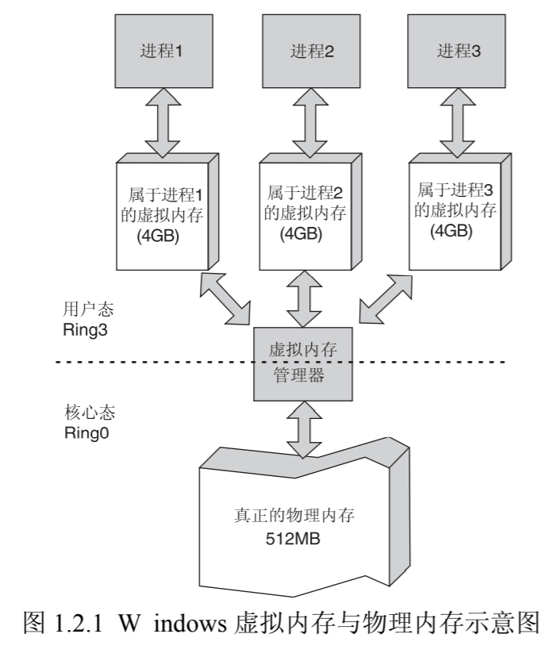

虽然每个进程都“相信”自己拥有 4GB 的空间，但实际上它们运行时真正能用到的空间根本没有那么多。内存管理器只是分给进程了一片“假地址”，或者说是“虚拟地址”，让进程们“认为”这些“虚拟地址”都是可以访问的。如果进程不使用这些“虚拟地址”，它们对进程来说就只是一笔“无形的数字财富”；当需要进行实际的内存操作时，内存管理器才会把“虚拟地址”和“物理地址”联系起来。

可以把虚拟内存管理相像成一个银行的存款管理：
- 进程 vs 储户
- 内存管理 vs 银行存款管理
- 物理内存 vs 银行内现金
- 虚拟内存 vs 储户存单
- 虚拟内存很大，似乎全部可用 vs 存单很大，似乎全部可取
- 存取数据时，虚拟内存会与物理内存发生映射关系，但现代OS的映射是随机的（不好猜测） vs 某用户取钱时可能用了别的储户存放在银行的钱
-  操作系统的实际物理内存空间可以远远小于进程的虚拟内存空间之和，仍能正常调度。 vs 社会上实际流通的钞票也可以远远小于社会的财富总额。

**请不要将用硬盘充当内存的“虚拟内存”与这里介绍的“虚拟内存”相混淆。此外，课程其余所述之“内存”均指 Windows 用户态内存映射机制下的虚拟内存。**

#### PE 文件与虚拟内存之间的映射 

调试漏洞时经常遇到2类操作：
- 使用静态反汇编工具查看PE中指令，可以看到指令的地址，这个地址是相对于磁盘上存放的该文件的相对位置，即“文件偏移地址”，执行时，这个文件被加载到内存中，其“文件偏移地址”会改变未虚拟内存地址VA。
- 使用动态调试工具，看到的某指令地址是VA，我们常常需要找到它在静态分析中的“文件偏移地址”。

为此，我们需要弄清楚 PE 文件地址和虚拟内存地址之间的映射关系。首先，我们先看几个重要的概念。
- 文件偏移地址（File Offset）：数据在 PE 文件中的地址叫文件偏移地址，这是文件在磁盘上存放时相对于文件开头的偏移。
- 装载基址（Image Base）：PE 装入内存时的基地址。**默认情况下，EXE文件在内存中的基地址0x00400000，DLL文件是 0x10000000。这些位置可以通过修改编译选项更改。**
- 虚拟内存地址（Virtual Address，VA）：PE 文件中的指令被装入内存后的地址。
- 相对虚拟地址（Relative Virtual Address，RVA）：相对虚拟地址是内存地址相对于映射基址的偏移量。

虚拟内存地址、映射基址、相对虚拟内存地址三者之间有关系：$VA = Image Base + RVA$。

在默认情况下，一般 PE 文件的 0 字节将对映到虚拟内存的 0x00400000 位置，这个地址就是所谓的装载基址(Image Base)。


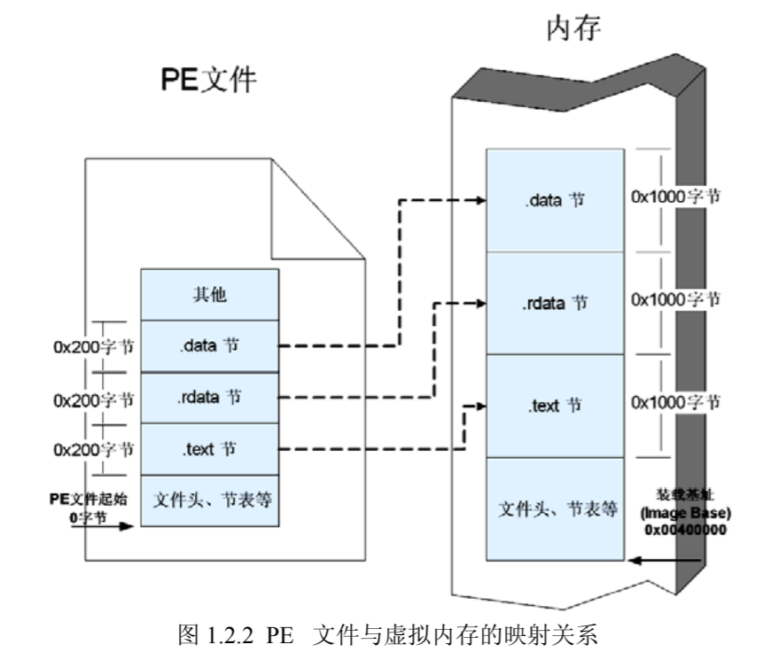

文件偏移是相对于文件开始处 0 字节的偏移，RVA（相对虚拟地址）则是相对于装载基址（即0x00400000 ）的偏移。由于操作系统在进行装载时“基本”上保持 PE 中的各种数据结构，所以文件偏移地址和 RVA 有很大的一致性。之所以说“基本”上一致是因为还有一些细微的差异。这些差异是由于文件数据的存放单位与内存数据存放单位不同而造成的。

区别在于：
- PE 文件中的数据按照磁盘数据标准存放，以 0x200 字节（512字节）或4KB 为一簇进行组织。当一个数据节（section）不足簇大小时，不足的地方将被 0x00 填充；当一个数据节超过簇大小时，下一个簇将分配给这个节使用。因此 PE 数据节的大小永远是簇的整数倍。NTFS目前常见簇大小为4KB. 可以查看：https://support.microsoft.com/zh-cn/help/140365/default-cluster-size-for-ntfs-fat-and-exfat。 本教程以512字节为一簇进行介绍。
- 当代码装入内存后，将按照内存数据标准存放，并以 0x1000 字节（在不同的windows版本下可能不同）为基本单位进行组织。类似的，不足将被补全，若超出将分配下一个 0x1000 为其所用。因此，内存中的节总是0x1000 的整数倍。

由于内存中数据节相对于装载基址的偏移量和文件中数据节的偏移量有上述差异，所以进行文件偏移到虚拟内存地址之间的换算时，还要看所转换的地址位于第几个节内。我们把这种由存储单位差异引起的节基址差称做节偏移（Section Offset）。文件偏移地址与虚拟内存地址之间的换算关系可以用下面的公式来计算：

$File offset = VA - ImageBase - Section Offset = RVA - Section Offset$

一些 PE 工具提供了这类地址转换，Lord PE 就是其中出色的一款。
### 漏洞分析必备工具
- OllyDbg
- SoftICE
- WinDbg
- IDA pro
- 二进制编辑器：ultraedit、hex workshop、winhex 、010editor
- vmware
- python

还有一些其它的工具：
- Cheat Engine:Cheat Engine is an open source tool designed to help you with modifying single player games running under window so you can make them harder or easier depending on your preference
#### OllyDbg
常用快捷键：
- F2 设置断点，即INT 3软中断，机器码为CC
- F7 Step into
- F8 Step over
- F4 运行到光标指定行
- Ctrl+F9 运行程序直到一个返回指令（ret指令）
- Ctrl+G 查看指定内存地址的内容

#### WinDbg

常见命令：
- t 或 F11 ：单步STEP INTO
- p 或 F10： STEP OVER
- SHIFT + F11： 跳出当前函数
- g 地址或函数名： 执行到指定位置
- gh 地址或函数名 ：执行到指定位置，若遇到异常则中断
- gn 地址或函数名 ：执行到指定位置，遇到异常忽略
- bl 列出已有断点
- be 断点id ：激活断点
- bd 断点id ：禁用断点
- bc 断点id ：清除断点
- bp 地址|函数名 ：设置断点
- d 地址： 显示内存数据
- db 地址 ：按字节显示内容
- dd 地址： 按双字显示内容
- dD 按双精度显示内存
- da 按ASCII码显示
- du 按Unicode显示
- ds 按字符串方式显示
- dt 套用已知模板显示内存
- e 地址 数据：修改任意内存地址的值
- Eb ：以字节形式写入
- ed 地址 数据：以双字形式写入
- ea 地址 数据：以ASCII形式写入
- eu 地址 数据：以Unicode形式写入
- k [x]：由栈顶开始列出当前线程的堆栈，x为需要回溯的栈顶数
- kb[x]: 栈顶回溯命令带上'b'后，可以额外显示3个传递给函数的参数
- r [寄存器名]：显示当前所有寄存器值
- lm ：列出当前已经读入的所有模块，如dll
- u ： 反汇编当前指令后的几条指令
- u [起始地址]： 反汇编从指定的地址开始
- - u [起始地址] [终止地址]： 反汇编从指定的地址开始到终止地址

### 练习

破解一个简单小程序。

## 栈溢出原理与实践

### Windows 系统栈的工作原理

你一定听过缓冲区溢出这个词吧？

简单说来，缓冲区溢出就是在大缓冲区中的数据向小缓冲区复制的过程中，由于没有注意小缓冲区的边界，“撑爆”了较小的缓冲区，从而冲掉了和小缓冲区相邻内存区域的其他数据而引起的内存问题。缓冲溢出是最常见的内存错误之一，也是攻击者入侵系统时所用到的最强大、最经典的一类漏洞利用方式。

成功地利用缓冲区溢出漏洞可以修改内存中变量的值，甚至可以劫持进程，执行恶意代码，最终获得主机的控制权。要透彻地理解这种攻击方式，我们需要回顾一些计算机体系架构方面的基础知识，搞清楚 CPU、寄存器、内存是怎样协同工作而让程序流畅执行的。根据不同的操作系统，一个进程可能被分配到不同的内存区域去执行。但是不管什么样的操作系统、什么样的计算机架构，进程使用的内存都可以按照功能大致分成以下 4 个部分。

- 代码区：这个区域存储着被装入执行的二进制机器代码，处理器会到这个区域取指并
执行。
- 数据区：用于存储全局变量等。
- 堆区：进程可以在堆区动态地请求一定大小的内存，并在用完之后归还给堆区。动态分配和回收是堆区的特点。
- 栈区：用于动态地存储函数之间的调用关系，以保证被调用函数在返回时恢复到母函数中继续执行。

在 Windows 平台下，高级语言写出的程序经过编译链接，转变为 PE 文件。当 PE 文件被装载运行后，就成了所谓的进程。PE 文件代码段中包含的二进制级别的机器代码会被装入内存的代码区（.text），处理器将
到内存的这个区域一条一条地取出指令和操作数，并送入算术逻辑单元进行运算；如果代码中请求开辟动态内存，则会在内存的堆区分配一块大小合适的区域返回给代码区的代码使用；当函数调用发生时，函数的调用关系等信息会动态地保存在内存的栈区，以供处理器在执行完被调用函数的代码时，返回母函数。

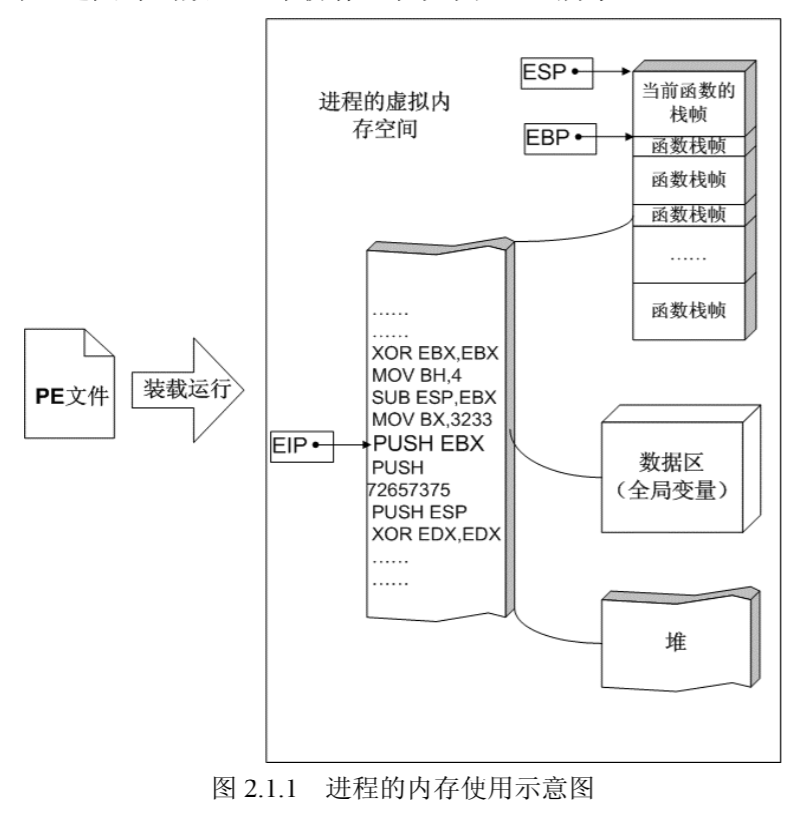

程序中所使用的缓冲区可以是堆区、栈区和存放静态变量的数据区。缓冲区溢出的利用方法和缓冲区到底属于上面哪个内存区域密不可分，本章主要介绍在系统栈中发生溢出的情形。

#### 栈与系统栈 

从计算机科学的角度来看，栈指的是一种数据结构，是一种先进后出的数据表。栈的最常见操作有两种：压栈（PUSH）、弹栈（POP）；用于标识栈的属性也有两个：栈顶（TOP）、栈底（BASE）。

内存的栈区实际上指的就是系统栈。系统栈由系统自动维护，它用于实现高级语言中函数的调用。对于类似 C 语言这样的高级语言，系统栈的 PUSH、POP 等堆栈平衡细节是透明的。一般说来，只有在使用汇编语言开发程序的时候，才需要和它直接打交道。

注意：系统栈在其他文献中可能曾被叫做运行栈、调用栈等。如果不加特别说明，我们所涉及的栈都是指系统栈这个概念。请您注意将其与编写非递归函数求解“八皇后”问题时，在自己程序中所实现的数据结构区分开来。

#### 函数调用时发生了什么？

下面就来探究一下高级语言中函数的调用和递归等性质是怎样通过系统栈巧妙实现的。请看如下代码：
```c
intfunc_B(int arg_B1, int arg_B2)
{
    int var_B1, var_B2;
    var_B1=arg_B1+arg_B2;
    var_B2=arg_B1-arg_B2;
    return var_B1*var_B2;
}
intfunc_A(int arg_A1, int arg_A2)
{
    int var_A;
    var_A = func_B(arg_A1,arg_A2) + arg_A1 ;
    return var_A;
}
int main(int argc, char **argv, char **envp)
{
    int var_main;
    var_main=func_A(4,3); 
    return var_main;
} 
```

这段代码经过编译器编译后，各个函数对应的机器指令在代码区中可能是这样分布的，如图 2.1.2 所示。

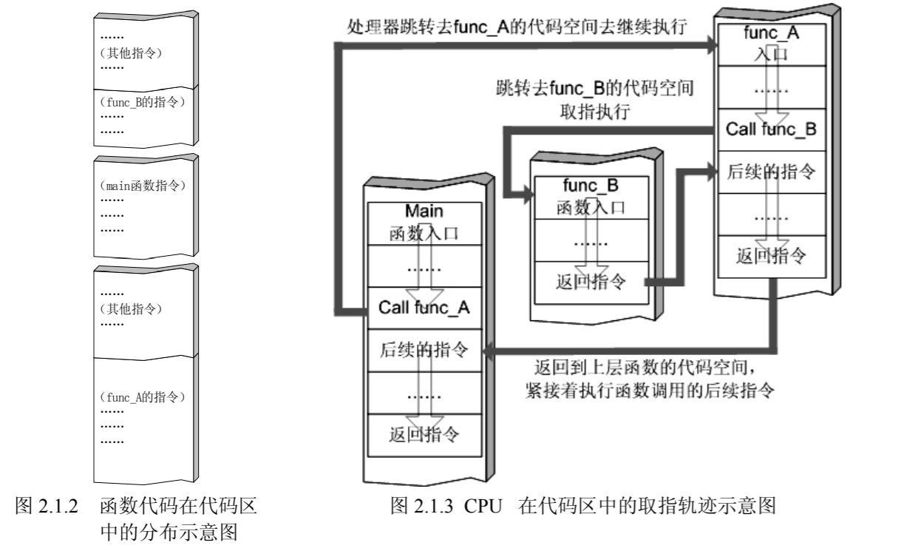

根据操作系统的不同、编译器和编译选项的不同，同一文件不同函数的代码在内存代码区中的分布可能相邻，也可能相离甚远，可能先后有序，也可能无序；但它们都在同一个 PE 文件的代码所映射的一个“节”里。我们可以简单地把它们在内存代码区中的分布位置理解成是散乱无关的。

那么 CPU 是怎么知道要去 func_A 的代码区取指，在执行完 func_A 后又是怎么知道跳回到 main 函数（而不是 func_B 的代码区）的呢？这些跳转地址我们在 C 语言中并没有直接说明，CPU 是从哪里获得这些函数的调用及返回的信息的呢？

原来，这些代码区中精确的跳转都是在与系统栈巧妙地配合过程中完成的。当函数被调用时，系统栈会为这个函数开辟一个新的栈帧，并把它压入栈中。这个栈帧中的内存空间被它所属的函数独占，正常情况下是不会和别的函数共享的。当函数返回时，系统栈会弹出该函数所对应的栈帧。

如图 2.1.4 所示，在函数调用的过程中，伴随的系统栈中的操作如下。

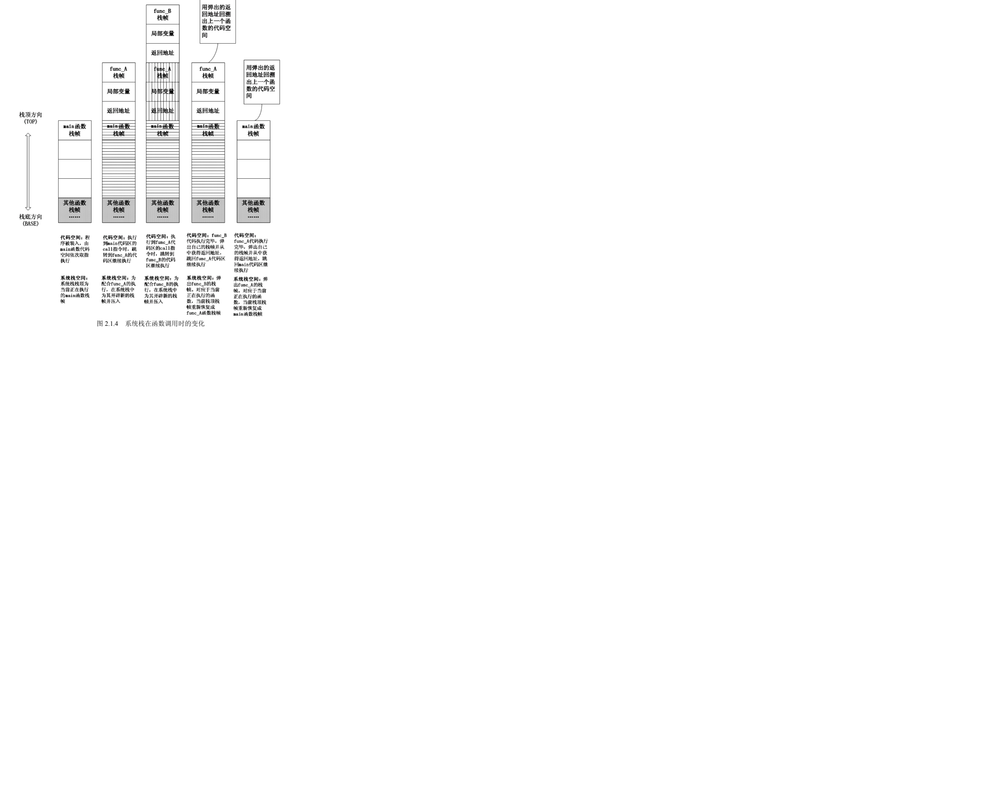

- 在 main 函数调用 func_A 的时候，首先在自己的栈帧中压入函数返回地址，然后为func_A 创建新栈帧并压入系统栈。
- 在 func_A 调用 func_B 的时候，同样先在自己的栈帧中压入函数返回地址，然后为func_B 创建新栈帧并压入系统栈。
- 在 func_B 返回时，func_B 的栈帧被弹出系统栈，func_A 栈帧中的返回地址被“露”在栈顶，此时处理器按照这个返回地址重新跳到 func_A 代码区中执行。
- 在 func_A 返回时，func_A 的栈帧被弹出系统栈，main 函数栈帧中的返回地址被“露”在栈顶，此时处理器按照这个返回地址跳到 main 函数代码区中执行。

注意：：在实际运行中，main 函数并不是第一个被调用的函数，程序被装入内存前还有一些其他操作。

#### 寄存器与函数栈帧

每一个函数独占自己的栈帧空间。当前正在运行的函数的栈帧总是在栈顶。Win32 系统使用两个特殊的寄存器用于标识位于系统栈顶端的栈帧。它们是Intel x86 cpu中的：
- ESP：栈指针寄存器(extended stack po inter)，其内存放着一个指针，该指针永远指向系统栈最上面一个栈帧的栈顶。
- EBP：基址指针寄存器(extended base pointer)，其内存放着一个指针，该指针永远指向系统栈最上面一个栈帧的底部。

注意：EBP 指向当前位于系统栈最上边一个栈帧的底部，而不是系统栈的底部。严格说来，“栈帧底部”和“栈底”是不同的概念。通常Intel x86CPU 会使用 ESS来指向堆栈区的底部。本书在叙述中将坚持使用“栈帧底部”这一提法以示区别；ESP 所指的栈帧顶部和系统栈的顶部是同一个位置，所以后面叙述中并不严格区分“栈帧顶部”和“栈顶”的概念。请您注意这里的差异，不要产生概念混淆。

寄存器对栈帧的标识作用如图 2.1.5 所示。

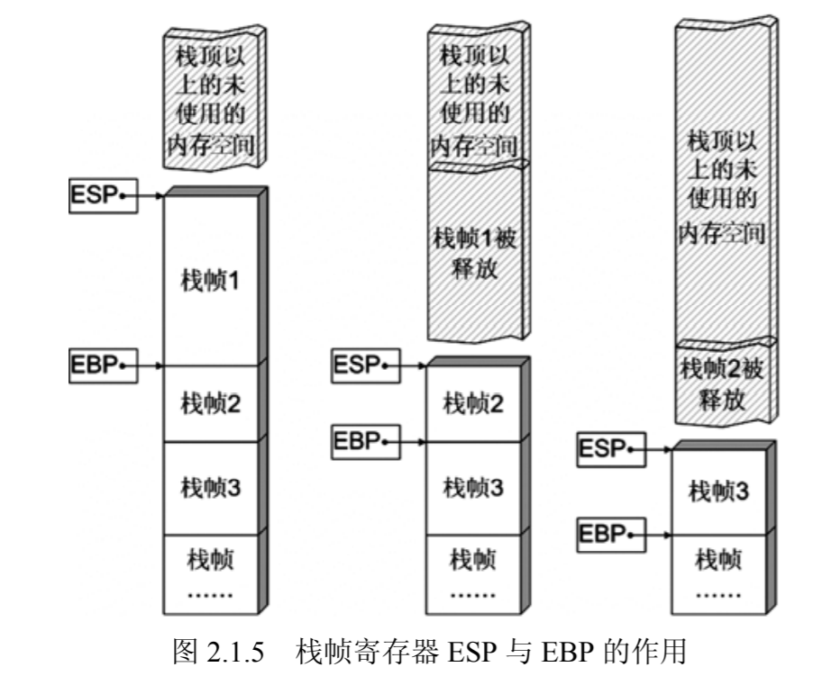

函数栈帧：ESP 和 EBP 之间的内存空间为当前栈帧，EBP 标识了当前栈帧的底部，ESP 标识了当前栈帧的顶部。

在函数栈帧中，一般包含以下几类信息：
- 局部变量：函数内的局部变量。例如参数。
- 栈帧状态值：即上一个栈帧的顶部和底部，实际上只保存前栈帧的底部，前栈帧的顶部可以通过计算得到。这个值用于在本栈帧被弹出后恢复上一个栈帧。
- 函数返回地址：保存了当前函数调用前的“调用点”。即调用此函数处的指令地址，以便函数返回时能够恢复到前面调用者处执行。

函数栈帧的大小并不固定，一般与其对应函数的局部变量多少有关。在后面调试实验中您会发现，函数运行过程中，其栈帧大小也是在不停变化的。

EIP：指令寄存器(Extended Instruction Pointer)，其内存放着一个指针，该指针永远指向下一条等待执行的指令地址。可以说如果控制了 EIP 寄存器的内容，就控制了进程——我们让 EIP 指向哪里，CPU 就会去执行哪里的指令。在本章第 4 节中我们会介绍控制 EIP 劫持进程的原理及实验。

#### 函数调用约定与相关指令 

函数调用约定描述了函数传递参数方式和栈协同工作的技术细节。不同的操作系统、不同的语言、不同的编译器在实现函数调用时的原理虽然基本相同，但具体的调用约定还是有差别的。这包括：
- 参数传递方式
- 参数入栈顺序是从右向左还是从左向右
- 函数返回时恢复堆栈平衡的操作在子函数中进行还是在母函数中进行。


表 2-1-1 列出了几种调用方式之间的差异。

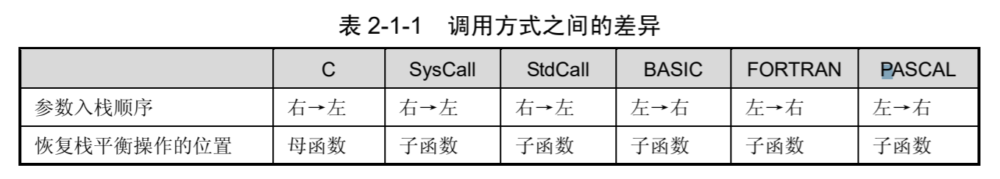

具体的，对于 Visual C++来说，可支持以下 3 种函数调用约定，如表 2-1-2 所示。

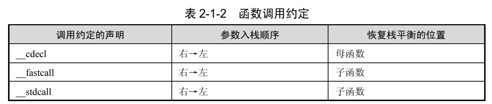

如果要明确使用某一种调用约定，只需要在函数前加上调用约定的声明即可，否则默认情况下，VC 会使用__stdcall 的调用方式。本篇中所讨论的技术在不加额外说明的情况下，都是指这种默认的__stdcall 调用方式。

除了上边的参数入栈方向和恢复栈平衡操作位置的不同之外，参数传递有时也会有所不同。例如，每一个 C++类成员函数都有一个 this 指针，在 Windows 平台中，这个指针一般是用ECX 寄存器来传递的，但如果用 GCC 编译器编译，这个指针会作为最后一个参数压入栈中。

同一段代码用不同的编译选项、不同的编译器编译链接后，得到的可执行文件会有很多不同。因此，请您在进行后续实验前务必注意实验环境的描述，否则所得结果可能会与实验指导有所差异。

函数调用大致包括以下几个步骤：
- （1）参数入栈：将参数从右向左依次压入系统栈中。
- （2）返回地址入栈：将当前代码区调用指令的下一条指令地址压入栈中，供函数返回时继续执行。
- （3）代码区跳转：处理器从当前代码区跳转到被调用函数的入口处。
- （4）栈帧调整：具体包括：
  - 保存当前栈帧状态值，已备后面恢复本栈帧时使用（EBP 入栈）；
  - 将当前栈帧切换到新栈帧（将 ESP 值装入 EBP，更新栈帧底部）；
  - 给新栈帧分配空间（把 ESP 减去所需空间的大小，抬高栈顶）；

对于__stdcall 调用约定，函数调用时用到的指令序列大致如下：
```masm
;调用前
push 参数3
push 参数2
push 参数1
call 函数地址  ; call 指令完成两项工作：先向栈中压入当前指令在内存中的位置，即保存返回地址；
              ; 然后跳转到调用函数的入口地址处
push ebp      ; 保存旧栈帧的底部
mov ebp, esp  ; 设置新栈帧的底部
sub esp, xxx  ; 设置新栈帧的顶部
push ebx
push esi
push edi
...
```

关于栈帧的划分，不同参考书中有不同的约定。有的参考文献中把返回地址和前栈帧 EBP 值做为一个栈帧的顶部元素，而有的则将其做为栈帧的底部进行划分。在后面的调试中，您会发现 OllyDbg 在栈区标示出的栈帧是按照前栈帧 EBP 值进行分界的，也就是说，前栈帧 EBP 值既属于上一个栈帧，也属于下一个栈帧，这样划分栈帧后，返回地址就成为了栈帧顶部的数据。出于前后概念一致的目的，在本书中将坚持按照 EBP 与 ESP 之间的部分做为一个栈帧的原则进行划分。这样划分出的栈帧如图 2.1.7 最后一幅图所示，栈帧的底部存放着前栈帧 EBP，栈帧的顶部存放着返回地址。划分栈帧只是为了更清晰地了解系统栈的运作过程，并不会影响它实际的工作。
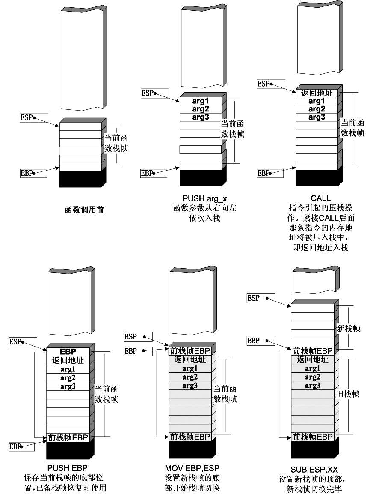

函数返回过程：
- （1）保存返回值：通常将函数的返回值保存在寄存器 EAX 中。
- （2）弹出当前栈帧，恢复上一个栈帧。
具体包括：
  - 在堆栈平衡的基础上，给 ESP 加上栈帧的大小，降低栈顶，回收当前栈帧的空间。
  - 将当前栈帧底部保存的前栈帧 EBP 值弹入 EBP 寄存器，恢复出上一个栈帧。
  - 将函数返回地址弹给 EIP 寄存器。
- （3）跳转：按照函数返回地址跳回母函数中继续执行。

还是以C语言和Win32平台为例，函数返回时的相关指令序列如下：
```masm
add esp, xxx ;降低栈顶，回收当前的栈顶
pop ebp,     ;将上一个栈帧底部位置恢复到ebp
retn         ;两个功能，弹出当前栈顶元素，即弹出当前函数执行后应返回的地址，并将其送至EIP。至此当前栈帧恢复工作完成，即当前栈帧无用了。
             ;第二个功能时让处理器跳转到返回地址，恢复调用前的代码区。
```

按照这样的函数调用约定组织起来的系统栈结构如下图所示。

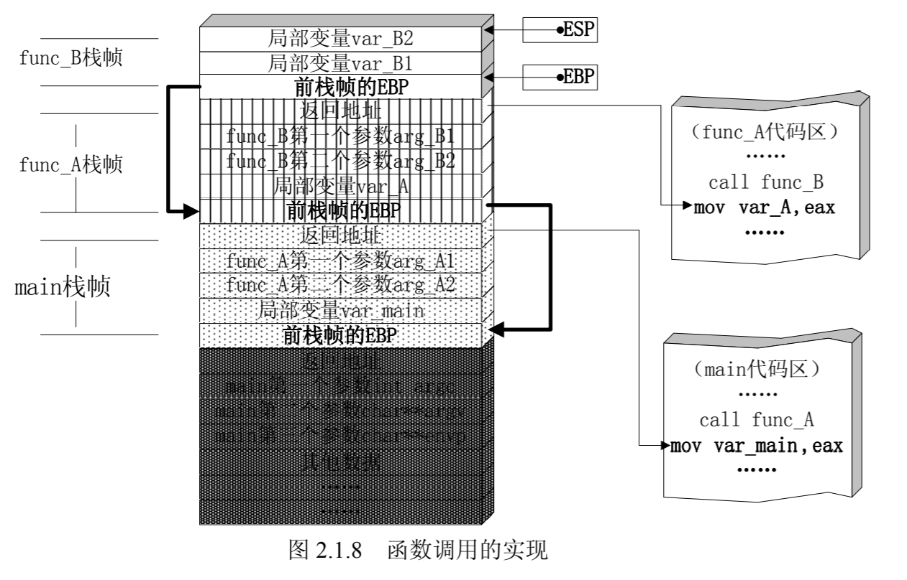

### 修改邻接变量

函数的局部变量在栈中时一个一个邻接排列的。如果局部变量中有数组类的缓冲区，并且程序中存在数组越界的缺陷，那么越界的数组元素就有可能破坏栈中相邻变量的值，甚至破坏栈中所保存的EBP值、返回地址等重要数据。

> 注意：大多数情况下，局部变量在栈中的分布是相邻的，但也有可能出于编译优化等需要而有所例外。

我们将用一个非常简单的例子来说明破坏栈内局部变量对程序的安全性有何种影响。
```c
#include <stdio.h>
#define PASSWORD "1234567"
#pragma warning(disable:4996)

int verify_password(char* password)
{
    int authenticated;
    char buffer[8];// add local buffto be overflowed
    authenticated = strcmp(password, PASSWORD);
    strcpy(buffer, password);//over flowed here!
    return authenticated;
}

int main()
{
    int valid_flag = 0;
    char password[1024];
    while (1)
    {
        printf("please input password: ");
        scanf("%s", password);
        valid_flag = verify_password(password);
        if (valid_flag)
        {
            printf("incorrect password!\n\n");
        }
        else
        {
            printf("Congratulation! You have passed the verification!\n");
            break;
        }
    }
}
```

其注意以下两处修改：
- （1）verify_password()函数中的局部变量 char buffer[8]的声明位置。
- （2）字符串比较之后的 strcpy(buffer,password)。

这两处修改实际上对程序的密码验证功能并没有额外作用，这里加上它们只是为了人为制造一个栈溢出漏洞。

按照前面对系统栈工作原理的了解，我们不难想象出这段代码执行到 int verify_password(char *password)时的栈帧状态如图 2.2.1 所示:

可以看到，在 verify_password 函数的栈帧中，局部变量 int authenticated 恰好位于缓冲区char buffer[8]的“下方”。
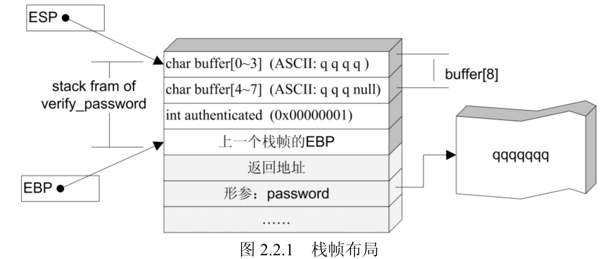

authenticated 为 int 类型，在内存中是一个 DWORD，占 4 个字节。所以，如果能够让 buffer
数组越界，buffer[8]、buffer[9]、buffer[10]、buffer[11]将写入相邻的变量 authenticated 中。

观察一下源代码不难发现，authenticated 变量的值来源于 strcmp 函数的返回值，之后会返回给 main 函数作为密码验证成功与否的标志变量：当 authenticated 为 0 时，表示验证成功；反之，验证不成功。

如果我们输入的密码超过了 7 个字符（注意：字符串截断符 NULL 将占用一个字节），则越界字符的 ASCII 码会修改掉 authenticated 的值。如果这段溢出数据恰好把 authenticated 改为0，则程序流程将被改变。本节实验要做的就是研究怎样用非法的超长密码去修改 buffer 的邻接变量 authenticated 从而绕过密码验证程序这样一件有趣的事情。

如果想使上述溢出生效那么要在下列环境下编译：
- window xp 
- visual c++ 6.0
- 默认编译选项。注意vs中的GS编译选项会使溢出失败。
- 使用debug版本

如果以上条件满足，将精准复现结果。

在观察内存的时候应当注意“内存数据”与“数值数据”的区别。在我们的调试环境中，内存由低到高分布，您可以简单地把这种情形理解成 Win32 系统在内存中由低位向高位存储一个 4 字节的双字（DWORD），但在作为“数值”应用的时候，却是按照由高位字节向低位字节进行解释。这样一来，在我们的调试环境中，“内存数据”中的 DWORD 和我们逻辑上使用的“数值数据”是按字节序逆序过的。

例如，变量 authenticated 在内存中存储为 0x 01 00 00 00，这个“内存数据”的双字会被计算机由高位向低位按字节解释成“数值数据” 0x 00 00 00 01。出于便于阅读的目的，OllyDbg在栈区显示的时候已经将内存中双字的字节序反转了，也就是说，栈区栏显示的是“数值数据”，而不是原始的“内存数据”，所以，在栈内看数据时，从左向右对于左边地址的偏移依次为 3、
2、1、0。请您在实验中注意这一细节。

下面我们试试输入超过 7 个字符，看看超过 buffer[8]边界的数据能不能写进 authenticated变量的数据区。为了便于区分溢出的数据，这次我们输入的密码为“qqqqqqqqrst”(‘q’、‘r’、‘s’、‘t’的 ASCII 码相差 1)，结果如图 2.2.4 所示。

栈中的情况和我们分析的一样，从输入的第 9 个字符开始，将依次写入 authenticated 变量。按照我们的输入“qqqqqqqqrst”，最终 authenticated 的值应该是字符‘r’、‘s’、‘t’和用于截断字符串的 null 所对应的 ASCII 码 0x00747372。

我们已经知道越过数组 buffer[8]的边界的后续数据可以改写变量 authenticated，那么如果我们用这段溢出数据恰好把 authenticated 改为 0，是不是就可以直接通过验证了呢？
字符串数据最后都有作为结束标志的 NULL(0)，当我们输入 8 个‘q’的时候，按照前边的分析，buffer 所拥有的 8 个字节将全部被‘q’的 ASCII 码 0x71 填满，而字符串的第 9 个字符——作为结尾的 NULL 将刚好写入内存 0x0012FB20 处，即下一个双字的低位字节，恰好将authenticated 从 0x 00 00 00 01 改成 0x 00 00 00 00，如图 2.2.5 所示。

题外话：严格说来，并不是任何 8 个字符的字符串都能冲破上述验证程序。由代码中的 authenticated=strcmp(password,PASSWORD)，我们知道 authenticated 的值来源于字符串比较函数 strcmp 的返回值。按照字符串的序关系，当输入的字符串大于“1234567”时，返回 1，这时 authenticated在内存中的值为 0x00000001，可以用字串的截断符 NULL 淹没 authenticated 的低位字节而突破验证；当输入字符串小于“1234567”时（例如，“0123”等字符串），函数返回-1，这时 authenticated 在内存中的值按照双字-1 的补码存放，为 0xFFFFFFFF，如果这时也输入 8 个字符的字符串，截断符淹没 authenticated低字节后，其值变为 0xFFFFFF00，所以这时是不能冲破验证程序的。图 2.2.6 所示的“01234567”输入就属于这种情形。如果您感兴趣，可以尝试进一步调试研究这种情况。

### 修改函数返回地址
#### 返回地址与程序流程
上节实验介绍的改写邻接变量的方法是很有用的，但这种漏洞利用对代码环境的要求相对比较苛刻。更通用、更强大的攻击通过缓冲区溢出改写的目标往往不是某一个变量，而是瞄准栈帧最下方的 EBP 和函数返回地址等栈帧状态值。

> 略去书中一部分内容，大家可以自学。

#### 控制程序的执行流程
我们在原来比较拷贝密码的基础上修改代码为：

```C
#include <stdio.h>
#include <string.h>
#include <stdlib.h>
#define PASSWORD "1234567"

int verify_password (char *password)
{
	int authenticated;
	char buffer[8];
	authenticated=strcmp(password,PASSWORD);
	strcpy(buffer,password);//over flowed here!
	return authenticated;
}
int main()
{
	int valid_flag=0;
	char password[1024];
	FILE * fp;
	if(!(fp=fopen("password.txt","rw+")))
	{
		exit(0);
	}
	fscanf(fp,"%s",password);
	valid_flag = verify_password(password);
	if(valid_flag)
	{
		printf("incorrect password!\n");
	}
	else
	{
		printf("Congratulation! You have passed the verification!\n");
	}
	fclose(fp);
	return 0;
} 
```
用键盘输入字符的 ASCII 表示范围有限，很多值（如 0x11、0x12 等符号）无法直接用键盘输入，所以我们把用于实验的代码稍作改动，将程序的输入由键盘改为从文件中读取字符串。

以上节实验中的代码为基础，稍作修改后得到上述代码。程序的基本逻辑和上一节中的代码大体相同，只是现在将从同目录下的 password.txt 文件中读取字符串，而不是用键盘输入。我们可以用十六进制的编辑器把我们想写入但不能直接键入的 ASCII 字符写进这个password.txt 文件。

如果完全采用实验指导所推荐的实验环境，将精确地重现指导中所有的细节，否则需要根据具体情况重新调试。用 VC6.0 将上述代码编译链接（使用默认编译选项，Build 成 debug 版本），在与 PE 文件同目录下建立 password.txt 并写入测试用的密码之后，就可以用 OllyDbg 加载调试了。

开始动手之前，我们先理清思路，看看要达到实验目的我们都需要做哪些工作：
- 弄清栈中的变化情况，例如函数地址距离缓冲区的偏移量等，推荐使用Ollydbg去发现证实。
- 得到程序中密码验证通过的指令地址，以便程序直接跳到这个分支去执行。
- 要在password.txt文件中相应位置偏移处填上这个地址。

### 代码植入
#### 代码植入的原理
前面依次展示了淹没相邻变量，改变程序流程和淹没返回地址，改变程序流程的方法。本节将给您介绍一个更有意思的实验——通过栈溢出让进程执行输入数据中植入的代码。

在上节实验中，我们让函数返回到 main 函数的验证通过分支的指令。试想一下，如果我们在 buffer 里包含我们自己想要执行的代码，然后通过返回地址让程序跳转到系统栈里执行，我们岂不是可以让进程去执行本来没有的代码，直接去做其他事情了！

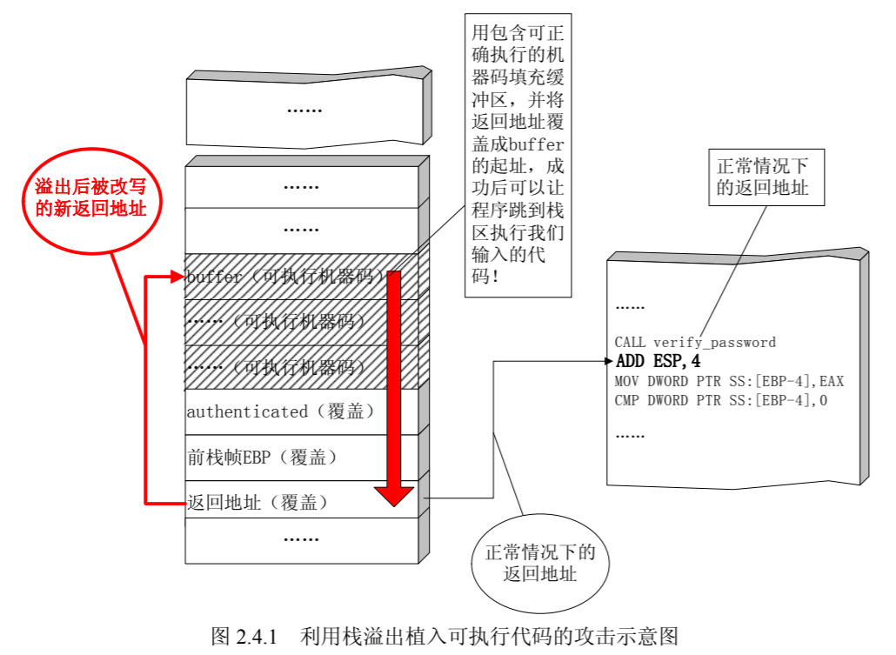

在本节实验中，我们准备向 password.txt 文件里植入二进制的机器码，并用这段机器码来调用 Windows 的一个 API 函数 MessageBoxA，最终在桌面上弹出一个消息框并显示“failwest”字样。

向进程中植入代码为了完成在栈区植入代码并执行，我们在上节的密码验证程序的基础上稍加修改，使用如下的实验代码。

```C
#include <stdio.h>
#include <string.h>
#include <windows.h>
#define PASSWORD "1234567"
int verify_password (char *password)
{
	int authenticated;
	char buffer[44];
	authenticated = strcmp(password,PASSWORD);
	strcpy(buffer,password);//over flowed here!
	return authenticated;
}

int main()
{
	int valid_flag=0;
	char password[1024];
	FILE * fp;
	LoadLibrary("user32.dll");//prepare for messagebox
	if(!(fp=fopen("password.txt","rw+")))
	{
		exit(0);
	}
	fscanf(fp,"%s",password);
	valid_flag = verify_password(password);
	if(valid_flag)
	{
		printf("incorrect password!\n");
	}
	else
	{
		printf("Congratulation! You have passed the verification!\n");
	}
	fclose(fp);
} 
```

这段代码在 2.3 节溢出代码的基础上修改了 3 处。
- （1）增加了头文件 windows.h，以便程序能够顺利调用 LoadLibrary 函数去装载 user32.dll。
- （2）verify_password 函数的局部变量 buffer 由 8 字节增加到 44 字节，这样做是为了有足够的空间来“承载”我们植入的代码。
- （3）main 函数中增加了 LoadLibrary("user32.dll")用于初始化装载 user32.dll，以便在植入代码中调用 MessageBox。

实验环境：
- windows xp
- visual c++ 6.0
- 默认编译选项
- debug版本

用 VC6.0 将上述代码编译（默认编译选项，编译成 debug 版本），得到有栈溢出的可执行文件。在同目录下创建 password.txt 文件用于程序调试。我们准备在 password.txt 文件中植入二进制的机器码，在 password.txt 攻击成功时，密码验证程序应该执行植入的代码，并在桌面上弹出一个消息框显示“failwest”字样。

让我们在动手之前回顾一下我们需要完成的几项工作。
- 分析并调试漏洞程序，获得淹没返回地址的偏移；
- 获得buffer的起始地址，并将其写入password.txt的相应偏移处，用来替换返回地址；
- 向password.txt写入可执行的机器代码，用来调用API弹出一个消息框。

本节验证程序里 verify_password 中的缓冲区为 44 个字节，按照前边实验中对栈结构的分析，我们不难得出栈帧中的状态。如果在 password.txt 中写入恰好 44 个字符，那么第 45 个隐藏的截断符 null 将冲掉authenticated 低字节中的 1，从而突破密码验证的限制。我们不妨就用 44 个字节作为输入来进行动态调试。

出于字节对齐、容易辨认的目的，我们把“4321”作为一个输入单元。buffer[44]共需要 11 个这样的单元。第 12 个输入单元将 authenticated 覆盖；第 13 个输入单元将前栈帧 EBP 值覆盖；第 14 个输入单元将返回地址覆盖。分析过后，我们需要进行调试验证分析的正确性。首先，在 password.txt 中写入 11 组“4321”，共 44 个字符。authenticated 被冲刷后，程序将进入验证通过的分支。用OllyDbg加载这个生成的PE文件进行动态调试。

动态调试的结果证明了前边分析的正确性。从这次调试中，我们可以得到以下信息。
- （1）buffer 数组的起始地址为 0x0012FAF0。
- （2）password.txt 文件中第 53～56 个字符的 ASCII 码值将写入栈帧中的返回地址，成为函数返回后执行的指令地址。
也就是说，将 buffer 的起始地址 0x0012FAF0 写入 password.txt 文件中的第 53～56 个字节，
在 verify_password 函数返回时会跳到我们输入的字串开始取指执行。

我们下面还需要给 password.txt 中植入机器代码。让程序弹出一个消息框只需要调用 Windows 的 API 函数 MessageBox。MSDN 对这个[函数的解释](https://docs.microsoft.com/en-us/windows/win32/api/winuser/nf-winuser-messagebox)如下。

```C
int MessageBox(
  HWND    hWnd,
  LPCTSTR lpText,
  LPCTSTR lpCaption,
  UINT    uType
);
```

我们将给出调用这个 API 的汇编代码，然后翻译成机器代码，用十六进制编辑工具填入password.txt 文件。

> 熟悉 MFC 的程序员一定知道，其实系统中并不存在真正的 MessagBox 函数，对 MessageBox 这类 API 的调用最终都将由系统按照参数中字符串的类型选择“A”类函数（ASCII）或者“W”类函数（UNICODE）调用。因此，我们在汇编语言中调用的函数应该是 MessageBoxA。多说一句，其实 MessageBoxA 的实现只是在设置了几个不常用参数后直接调用 MessageBoxExA。探究 API 的细节超出了本书所讨论的范围，有兴趣的读者可以参阅其他书籍。

使用汇编语言调用MessageBoxA函数需要3个步骤：
- 装载动态链接库user32.dll。因为MessageBoxA是其中的export 函数（导出函数）。大多数图形化界面程序都会装载，但纯命令行程序一般不使用。
- 在汇编中调用这个函数需要知道此函数的入口地址。
- 调用前，要从右向左在堆栈中压入4个参数

为了让植入代码简洁，我们在构造漏洞的代码中已经加载了user32.dll。MessageBoxA的入口参数可以通过user32.dll在系统中加载的基址和MessageBoxA在库中的偏移相加得到。我们使用VC6.0中的小工具Dependency Walker获得这些信息。

运行 Depends 后，随便拖拽一个有图形界面的 PE 文件进去，就可以看到它所使用的库文件了。在左栏中找到并选中 user32.dll 后，右栏中会列出这个库文件的所有导出函数及偏移地址；下栏中则列出了 PE 文件用到的所有的库的基地址。

如图 2.4.6 所示，user32.dll 的基地址为 0x77D40000，MessageBoxA 的偏移地址为0x000404EA。基地址加上偏移地址就得到了 MessageBoxA 在内存中的入口地址 0x77D804EA。

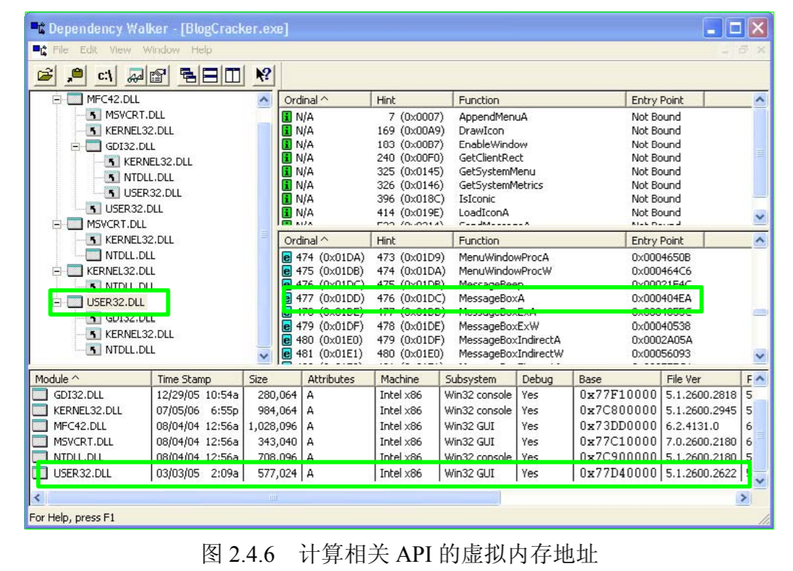

注：不同的系统中这个值不一样，例如我的系统中得到USER32.DLL 的BASE 是 7E410000，MessageBoxA的入口点是 0x000407EA，加起来是0x7E4507EA。算出来后可以使用Ollydbg的ctrl+G查看这个地址，确认是否找对了。

user32.dll 的基地址和其中导出函数的偏移地址与操作系统版本号、补丁版本号等诸多因素相关，故您用于实验的计算机上的函数入口地址很可能与这里不一致。请您一定注意要在当前实验的计算机上重新计算函数入口地址，否则后面的函数调用会出错。能够适应于各种操作系统版本的通用的代码植入方法将在第5章进行详细介绍。

有了这个入口地址，就可以编写进行函数调用的汇编代码了。这里我们先把字符串“failwest”压入栈区，消息框的文本和标题都显示为“failwest”，只要重复压入指向这个字符串的指针即可；第 1 个和第 4 个参数这里都将设置为 NULL。写出的汇编代码：

```MASM
XOR EBX, EBX  ;清0
PUSH EBX      ;代替PUSH 0指令
PUSH 74736577 ;存入字符串 fail
PUSH 6C696166 ;存入字符串 west
MOV EAX,ESP   ;将failwest字符串的地址存入EAX
PUSH EBX      ;第4个参数入栈
PUSH EAX      ;第3个参数入栈
PUSH EAX      ;第2个参数入栈
PUSH EBX      ;第1个参数入栈
MOV EAX,0x7E4507EA    ;存入函数入口地址
CALL EAX              ;调用MessageBoxA
```

从汇编指令到机器码的转换可以有很多种方法。调试汇编指令，从汇编指令中提取出二进制机器代码的方法将在第 5 章集中讨论。由于这里仅仅用了 11 条指令和对应的 26 个字节的机器代码，如果您一定要现在就弄明白指令到机器码是如何对应的话，直接查阅 Intel 的指令集手工翻译也是可以的。

上述汇编代码经过OllyDbg逐行转换得到下列机器码：
```
31DB
53
68 77657374
68 6661696C
89E0
53
50
50
53
B8 EA07457E
FFD0
```
将上述汇编指令对应的机器代码按照上一节介绍的方法以十六进制形式逐字写入password.txt，第 53～56 字节填入 buffer 的起址 0x0012FAF0，其余的字节用 0x90(nop 指令)填充，如下图所示：

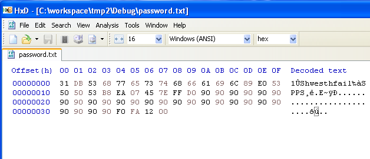

这样构造了 password.txt 之后再运行验证程序，程序执行的流程将如图 2.4.9 所示。

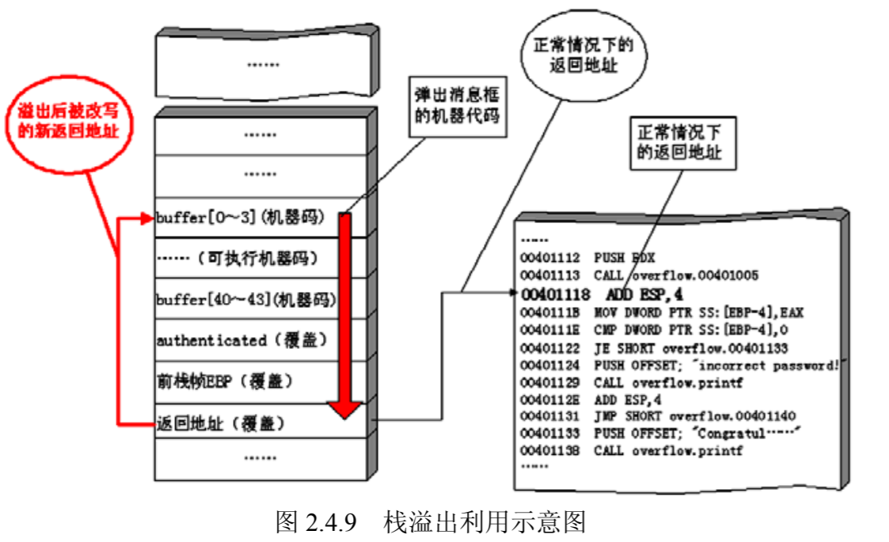

程序运行情况如图 2.4.10 所示。

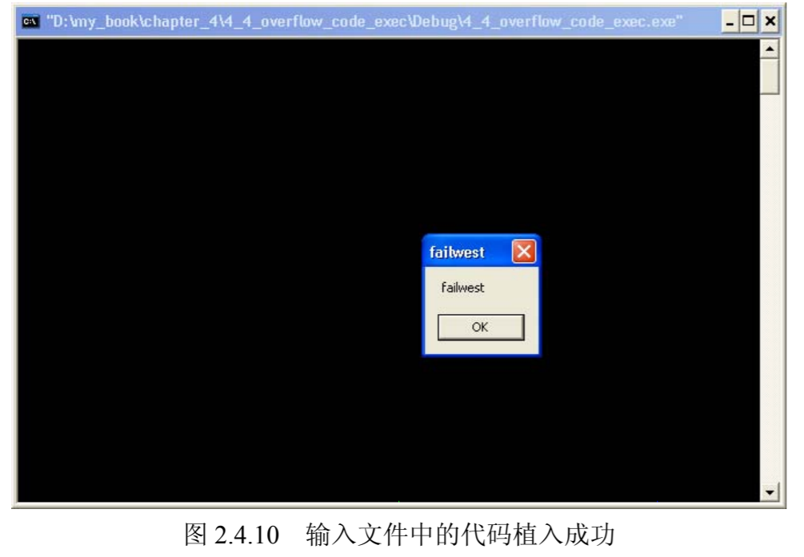

成功地弹出了我们植入的代码。
但是在单击“OK”按钮之后，程序会崩溃。这是因为 MessageBoxA 调用的代码执行完成后，我们没有写用于安全退出的代码的缘故。您会在后面的章节中见到更深入的代码植入讨论，包括编写通用的植入代码，在植入代码中安全地退出，甚至在植入代码结束后修复堆栈和寄存器，让程序重新回到正常的执行流程。
