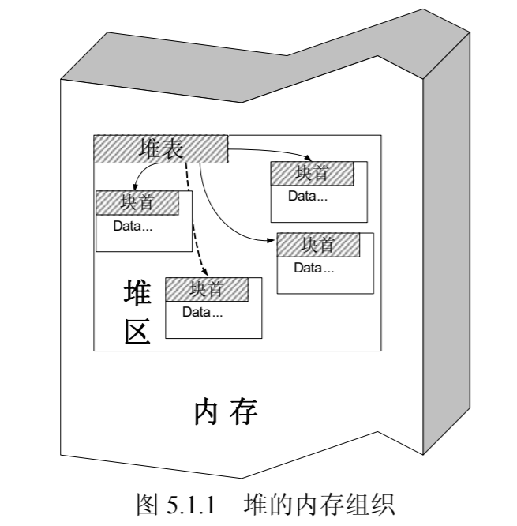
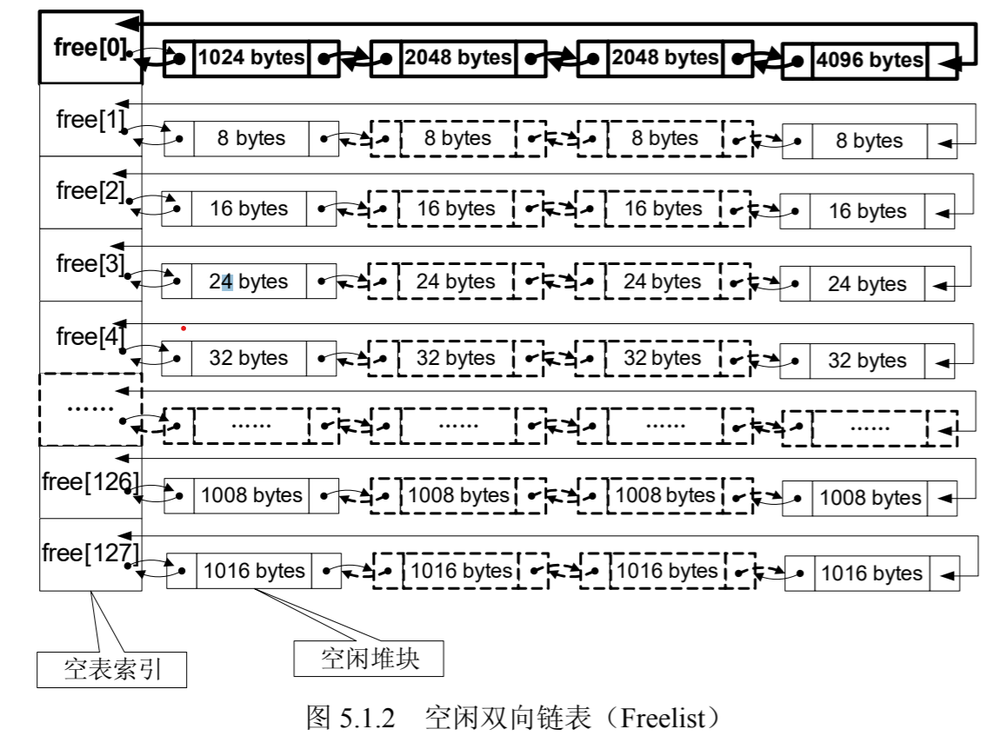
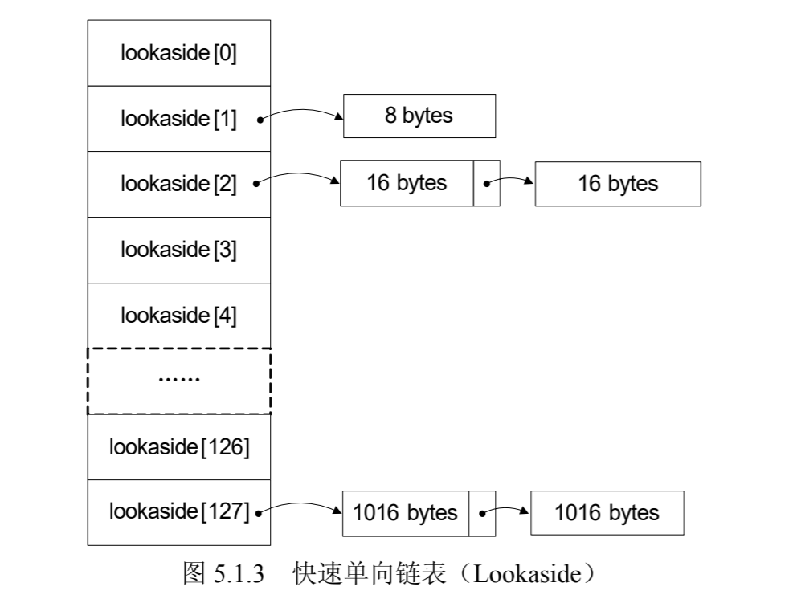
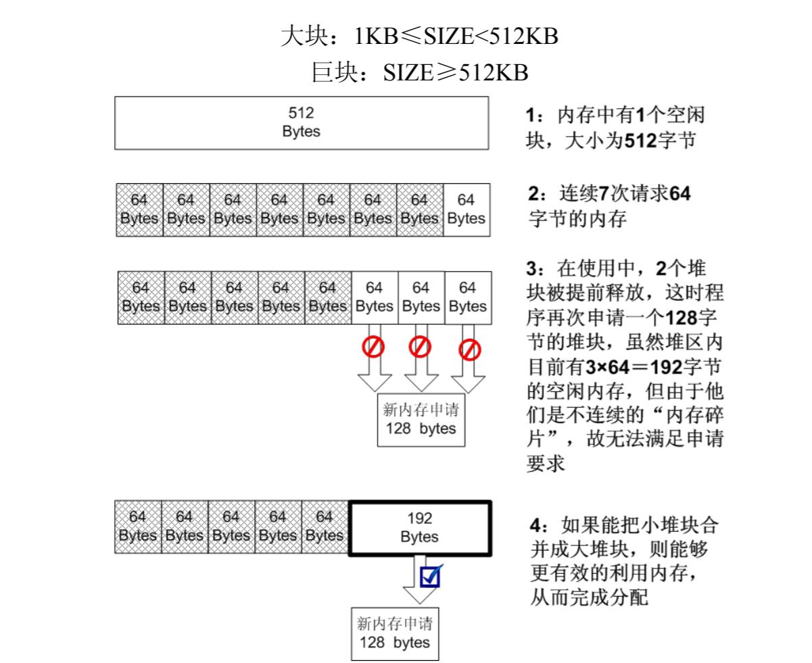
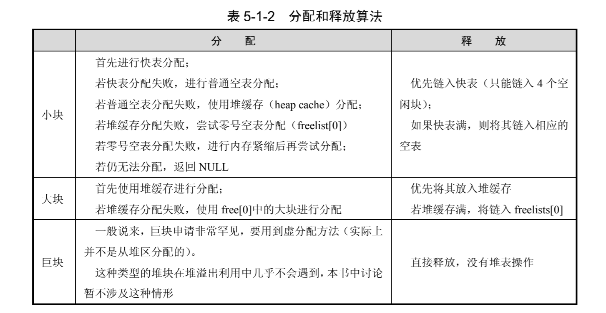
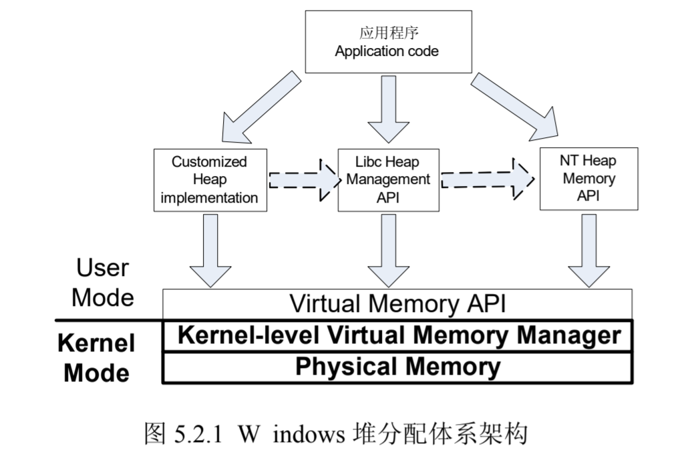
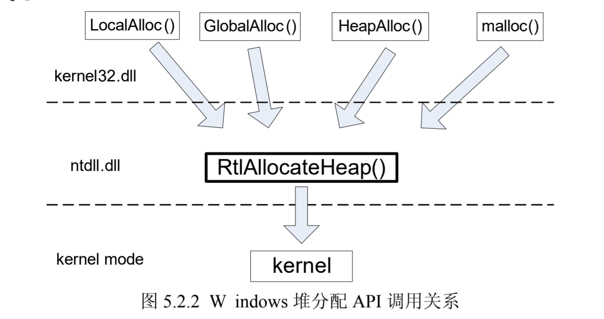
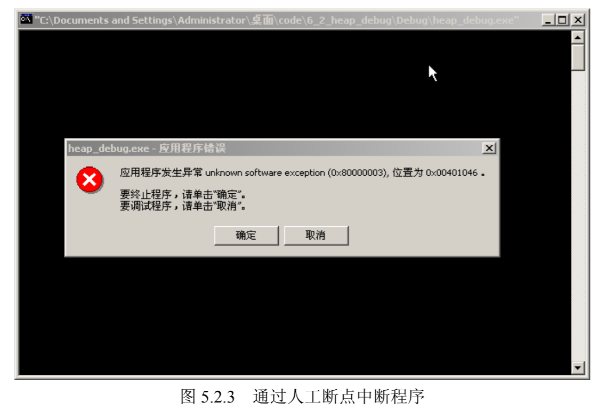

# 第4讲 堆溢出利用

Windows缓冲区溢出中难度最大的一部分就是堆溢出利用。但学习它的意义却很重大。

## 堆的工作原理

### Windows 堆探索历史
Windows的堆神秘且耐人寻味。Windows并不完全公开器操作系统堆管理的细节，对其的了解主要基于各路技术专家的个人研究成果，没有充足的官方资料。成果有两点：
- Windows NT4 \ win2k\ 的对管理基本清楚（指数据结构和算法）。这方面专家有：
  - Halvar Flake , 2002 blackhat “Third Generation Exploitation”
  - David Litchfield, NGS(Next  Generation Security) 2004 年 black hat 上演讲的“Windows Heap Overflows” 演讲的白皮书是必读。
的创始人。
  - Matt Conover：“XP SP2 Heap Exploitation”
- 64位还有差距

本章内容来源于这些前辈们关于 Windows 堆管理机制研究成果的总结与整理。了解这些精髓的知识除了对理解堆溢出利用至关重要外，对研究操作系统、文件系统的实现等也会有很大的帮助。

现代操作系统在经过了若干年的演变后，目前使用的堆管理机制兼顾了内存有效利用、分配决策速度、健壮性、安全性等因素，这使得堆管理变得异常复杂。本书关注的主要是 Win32 平台的堆管理策略。微软操作系统堆管理机制的发展大致可以分为多个阶段。

- windows 2000——Windows sp1
- Windows xp2 — windows sp3
- Windows vista-windows 7
- windows7-windows 8
- Windows8 -Windows10

### 堆与栈的区别

程序在执行时需要两种不同类型的内存来协同使用。一种是栈，另一种是堆。

#### 栈
- 存放函数内部局部变量、数组。
- 使用时不需要额外的申请操作，系统栈会根据函数的变量声明自动在函数栈帧中给其预留空间。
- 栈空间由系统维护，它的分配和回收都由系统完成，达到栈平衡，对程序员是透明的。
- 只有pop和push操作，总是线性变化，管理简单。

#### 堆
- 一种在程序运行中动态分配的内存。其大小在开发时不能确定，而是在实际运行中才能根据实际反馈确定大小。
- 堆在使用时需要程序员用专门的函数进行申请，例如C语言用```malloc```等，C++使用```new```。堆内存申请有可能成功或失败，这与内存大小、机器性能、当前运行环境有关。
- 一般用一个堆指针来使用申请得到的内存。读、写、释放都需要这个指针来完成。
- 使用完毕后，需要把堆指针传给堆释放函数回收这片内存，否则会造成内存泄露。典型的有free，delete。
- 堆管理不是“线性的”，对于堆的利用技术是长久安全话题。

### 堆的数据结构与管理策略

操作系统一般会提供一套API把复杂的堆管理机制屏蔽，因此普通程序员是无法了解或有必要知道堆分配细节的。但若要进行堆溢出利用就必须了解堆的知识。

先从宏观上了解一下堆的知识。

程序员使用堆一般需要做3件事：
- 申请一定大小的内存
- 使用内存
- 释放内存

堆管理机制的设计者是怎样为程序员提供透明的使用堆的API呢？他要从经反复申请、释放而变得不连续的“杂乱”内存中，正确辨别哪些内存区域是正在被程序使用的占用块？哪些是可以返回给请求者的空闲块？从而“恰当”地经济、高效的分配空闲内存块，返回这个内存区的地址为指针。

为了完成上述任务，需要设计一套高效的数据结构来配合算法。现代OS的堆数据结构一般包括：
- 堆块
- 堆表

#### 堆块
堆块：出于性能考虑，堆区的内存按不同大小组织成块，以堆块为单位进行标识，而不是以字节标识。一个堆块包括两个部分：
- 块首：堆块头部若干字节，标识了堆块自身信息，如大小、空闲状态等；堆管理返回的指针一般指向块首起始位置。
- 块身：紧随块首，最终分配给用户使用的数据区。

注意：堆管理系统所返回的指针一般指向块身的起始位置，在程序中是感觉不到块首的存在的。然而，连续地进行内存申请时，如果您够细心，可能会发现返回的内存之间存在“空隙”，那就是块首！

#### 堆表
堆表一般位于堆区的起始位置，用于索引堆区中所有堆块的重要信息，包括：
- 堆块位置
- 堆块大小
- 空闲状态

堆表的数据结构决定了整个堆区的组织方式，是快速检索空闲块、保证堆分配效率的关键。在设计时，可能会采用平衡二叉树等高级数据结构来优化查找效率。现代OS的堆表一般不只一种数据结构。

堆的内存组织如下图所示



在 Windows 中，占用态的堆块被使用它的程序索引，而堆表只索引所有空闲态的堆块。其中，最重要的堆表有两种：
- 空闲双向链表 Freelist（以下简称空表，如图 5.1.2 所示）
- 快速单向链表 Lookaside（以下简称快表，如图 5.1.3 所示）。

##### 空表

空闲堆块的块首中包含一对重要的指针，这对指针用于讲空闲堆块组织成双向链表。按照堆块的大小不同，空表总共被分为128条。

堆区一开始的堆表区有一个128项的指针数组，被称作空表索引（Freelist array）。该数组的每一项包括两个指针，用于标识一条空表。



如上表所示，空表索引的第二项 free[1] 标识了堆中所有大小为8字节的空闲堆块，之后每个索引项指示的空闲块递增8字节。例如，free[2]标识大小为16字节的空闲堆块、free[3]标识大小为24字节的空闲堆块...

因此有：$空闲堆块的大小 = 索引项ID \times 8 Bytes$

把空闲堆块按照大小的不同链如同的空表，可以方便堆管理系统高效检索指定大小的空闲堆块。注意：空表索引的第一项free[0] 所标识的空表相对特殊，这条双向链表链入了所有大于等于1024字节的堆块（小于512KB）。这些堆块按照各自的大小在零号表中升序地依次排列下去。稍后你会发现这样的好处。

##### 快表

快表是Windows用来加速堆块分配而采用的一种堆表。叫他快表是因为这类单向链表中从来不会发生堆块合并（其中的空闲块首被设置为占用态，用来防止堆块合并）。

快表也有128条，组织结构与空表类似，只是其中的堆块按照单链表组织。快表总是被初始化为空，而且每条快表最多只有4个结点，故很快就会被填满。

堆中的操作可以分为三种：
- 堆块分配
- 堆块释放
- 堆块合并

分配和释放是程序提交申请和执行的，而堆块合并则是由堆管理系统自动完成的。



#### 堆块分配

堆块分配分为三类：
- 快表分配
- 普通空表分配
- 零号表free[0]分配

##### 快表分配
快表分配堆块比较简单，包括：
- 寻找到大小匹配的空闲堆块
- 将其状态修改为占用态
- 把它从堆表中卸下
- 返回一个指向堆块块身的指针给程序用。

##### 普通表分配堆块

- 首先找最优的空闲块分配
- 若失败，则寻找次优的空闲块分配，即最小的能够满足要求的空闲块；
- 将其状态修改为占用态
- 把它从堆表中卸下
- 返回一个指向堆块块身的指针给程序用。


##### 零号空表分配堆块

- 按照大小升序链着大小不同的空闲块，故分配时先从free[0]反向查找最后一个块（即最大块）
- 如果能满足要求，则正向搜素最小能够满足要求的空闲块进行分配。这就是为什么要按升序排列。
- 将其状态修改为占用态
- 把它从堆表中卸下
- 返回一个指向堆块块身的指针给程序用。

##### “找零钱”现象
堆块分配中的“找零钱”现象，即当空表中无法找到匹配的“最优”堆块时，一个稍大些的块会被用于分配。这种次优分配发生时：
- 会先从大块中按请求的大小精确地“割”出一块进行分配；
- 然后给剩下的部分重新标注块首，链入空表。
- 这里体现的就是堆管理系统的“节约”原则：买东西的时候用最合适的钞票，如果没有，就要找零钱，决不会玩大方。
- 由于快表只有在精确匹配时才会分配，故不存在“找钱”现象。

注意：：这里没有讨论堆缓存（heap cache）、低碎片堆（LFH）和虚分配。

#### 堆块释放

这个操作包括讲堆块状态修改为空闲，链入相应的堆表。所有的释放块都链入堆表的末尾，分配时也先从堆表末尾拿。注意，快表最多4项。

#### 堆块合并

经过反复的申请与释放操作，堆区很可能变得“千疮百孔”，产生很多内存碎片。为了合理有效地利用内存，堆管理系统还要能够进行堆块合并操作，如图 ：




当堆管理系统发现两个空闲堆块彼此相邻的时候，就会进行堆块合并操作。堆块合并包括将两个块从空闲链表中“卸下”、合并堆块、调整合并后大块的块首信息（如大小等）、将新块重新链入空闲链表。

题外话：实际上，堆区还有一种操作叫做内存紧缩（shrink the compact），由RtlCompactHeap 执行，这个操作的效果与磁盘碎片整理差不多，会对整个堆进行调整，尽量合并可用的碎片。

在具体进行堆块分配和释放时，根据操作内存大小的不同，Windows 采取的策略也会有所不同。可以把内存块按照大小分为三类：
- 小块：SIZE<1KB 
- 大块：1KB <= size < 512KB
- 巨块：size >= 512KB

对应的分配和释放算法也有三类，可以通过下表来理解Windows的堆管理策略。



#### Windows 堆管理要点

- 快表中的空闲块被设置为占用态，故不会发生堆块合并操作。
- 快表只有精确匹配时才会分配，不存在“搜素次优解”和“找零钱”现象。
- 快表是单链表，操作比双向链表简单，插入删除都少用很多指令。
- 综上，快表很快，股灾分配和释放时总是优先使用，失败时采用空表freelist。
- 快表只有4项，容易被填满，所以空表也频繁被使用。
- windows的堆管理兼顾了内存合理使用、分配效率等多方面因素。

## 在堆中漫游

### 堆分配函数之间的调用关系

Windows 平台下的堆管理架构可以用下图来概括。



Windows 中提供了许多类型的堆分配函数，您可以在 MSDN 中找到这些函数的详细说明。它们之间的关系如下图：

所有的堆分配函数最终都将使用位于```ntdll.dll```中的```RtlAllocateHeap()```函数进行分配，这个函数也是在用户态能够看到的最底层的堆分配函数。万变不离其宗，研究windows堆，只要研究这个函数就行了。



### 堆的调试方法

想写漂亮的堆溢出exploit，仅知道堆的分配策略远远不够，需要对堆中的重要数据结构掌握到字节级别。

下面通过一小段程序，教会你调试堆的方法，消除神秘感，验证上节所学的堆分配策略。

```c++
#include <windows.h>
main()
{
    HLOCAL h1,h2,h3,h4,h5,h6;
    HANDLE hp;
    hp = HeapCreate(0,0x1000,0x10000);
    _asm int 3
    h1 = HeapAlloc(hp,HEAP_ZERO_MEMORY,3);
    h2 = HeapAlloc(hp,HEAP_ZERO_MEMORY,5);
    h3 = HeapAlloc(hp,HEAP_ZERO_MEMORY,6);
    h4 = HeapAlloc(hp,HEAP_ZERO_MEMORY,8);
    h5 = HeapAlloc(hp,HEAP_ZERO_MEMORY,19);
    h6 = HeapAlloc(hp,HEAP_ZERO_MEMORY,24);
    //free block and prevent coaleses
    HeapFree(hp,0,h1); //free to freelist[2]
    HeapFree(hp,0,h3); //free to freelist[2]
    HeapFree(hp,0,h5); //free to freelist[4]
    HeapFree(hp,0,h4); //coalese h3,h4,h5,link the large block to freelist[8]
    return 0;
} 
```

实验环境：
- 操作系统 Windows 2000 虚拟机 请注意分配策略对操作系统非常敏感
- 编译器 Visual C++ 6.0
- 编译选项 默认编译选项 VS2003、VS2005 的 GS 编译选项将使实验失败
- build 版本： release 版本， 如果使用 debug 版本实验将会失败
- 堆分配算法依赖于操作系统版本、编译器版本、编译选项、build 类型等因素，甚至还与虚拟机版本有关。

调试堆与调试栈不同，不能直接用调试器 Ollydbg、Windbg 来加载程序，否则堆管理函数会检测到当前进程处于调试状态，而使用调试态堆管理策略。

调试态堆管理策略和常态堆管理策略有很大差异，集中体现在：
- 调试堆不使用快表，只用空表分配。
- 所有堆块都被加上了多余的 16 字节尾部用来防止溢出（防止程序溢出而不是堆溢出攻击），这包括 8 个字节的 0xAB 和 8 个字节的 0x00。
- 块首的标志位不同。

调试态的堆和常态堆的区别就好像 debug 版本的 PE 和 release 版本的 PE 一样。如果您做堆溢出实验，发现在调试器中能够正常执行 shellcode，但单独运行程序却发生错误，那很可能就是因为调试堆和常态堆之间的差异造成的。

为了避免程序检测出调试器而使用调试堆管理策略，我们可以在创建堆之后加入一个人工断点：```_asm int 3```，然后让程序单独执行。当程序把堆初始化完后，断点会中断程序，这时再用调试器 attach 进程，就能看到真实的堆了。

在 Windows 2000 平台下，使用 VC6.0 编译器的默认选项将上述代码 build 成 release 版本。直接运行，程序会自动中断，报告异常。



现在您可以用调试器 attach 运行中的进程。如果您的默认调试器是 Ollydbg，那么直接单击“取消”按钮将自动打开 Ollydbg 并 attatch 进程，并在断点处停下。

将 Ollydbg 设置成默认调试器的方法如下：在 Olldbg 的“options”菜单中选 “Just-in-time debugging”, 单击“Make OllyDbg just-in-time debugger”按钮后，再单击“Done”按钮确认操作，这样，您的默认调试器就会从 VC6.0 改成 OllyDbg 了。

如果您偏爱使用 VC6.0 调试，那也无妨。现在单击程序弹出来的“取消”按钮，Ollydbg 将自动 attach 进程并停止在位于 0x0040101D 处的_asm int3 指令上。

所有的堆块分配函数都需要指明堆区的句柄，然后在堆区内进行堆表修改等操作，最后完成分配工作。

注意：malloc 虽然在使用时不用程序员明确指出使用哪个堆区进行分配，但如果您逆向了malloc的实现，您会发现这是因为它已经使用HeapCreate()函数为自己创建了堆区。
