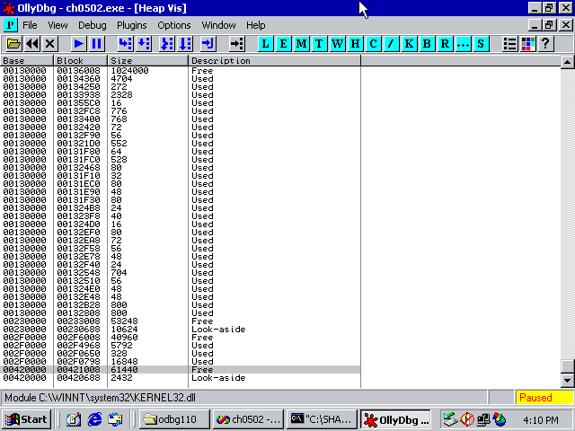
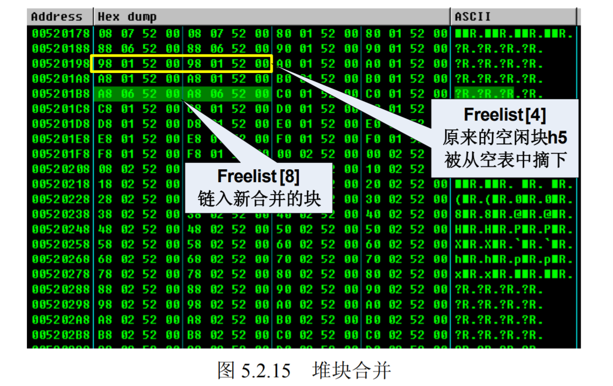

# 第4讲 堆溢出利用

Windows缓冲区溢出中难度最大的一部分就是堆溢出利用。但学习它的意义却很重大。

## 堆的工作原理

### Windows 堆探索历史
Windows的堆神秘且耐人寻味。Windows并不完全公开器操作系统堆管理的细节，对其的了解主要基于各路技术专家的个人研究成果，没有充足的官方资料。成果有两点：
- Windows NT4 \ win2k\ 的对管理基本清楚（指数据结构和算法）。这方面专家有：
  - Halvar Flake , 2002 blackhat “Third Generation Exploitation”
  - David Litchfield, NGS(Next  Generation Security) 2004 年 black hat 上演讲的“Windows Heap Overflows” 演讲的白皮书是必读。
的创始人。
  - Matt Conover：“XP SP2 Heap Exploitation”
- 64位还有差距

本章内容来源于这些前辈们关于 Windows 堆管理机制研究成果的总结与整理。了解这些精髓的知识除了对理解堆溢出利用至关重要外，对研究操作系统、文件系统的实现等也会有很大的帮助。

现代操作系统在经过了若干年的演变后，目前使用的堆管理机制兼顾了内存有效利用、分配决策速度、健壮性、安全性等因素，这使得堆管理变得异常复杂。本书关注的主要是 Win32 平台的堆管理策略。微软操作系统堆管理机制的发展大致可以分为多个阶段。

- windows 2000——Windows sp1
- Windows xp2 — windows sp3
- Windows vista-windows 7
- windows7-windows 8
- Windows8 -Windows10

### 堆与栈的区别

程序在执行时需要两种不同类型的内存来协同使用。一种是栈，另一种是堆。

#### 栈
- 存放函数内部局部变量、数组。
- 使用时不需要额外的申请操作，系统栈会根据函数的变量声明自动在函数栈帧中给其预留空间。
- 栈空间由系统维护，它的分配和回收都由系统完成，达到栈平衡，对程序员是透明的。
- 只有pop和push操作，总是线性变化，管理简单。

#### 堆
- 一种在程序运行中动态分配的内存。其大小在开发时不能确定，而是在实际运行中才能根据实际反馈确定大小。
- 堆在使用时需要程序员用专门的函数进行申请，例如C语言用```malloc```等，C++使用```new```。堆内存申请有可能成功或失败，这与内存大小、机器性能、当前运行环境有关。
- 一般用一个堆指针来使用申请得到的内存。读、写、释放都需要这个指针来完成。
- 使用完毕后，需要把堆指针传给堆释放函数回收这片内存，否则会造成内存泄露。典型的有free，delete。
- 堆管理不是“线性的”，对于堆的利用技术是长久安全话题。

### 堆的数据结构与管理策略

操作系统一般会提供一套API把复杂的堆管理机制屏蔽，因此普通程序员是无法了解或有必要知道堆分配细节的。但若要进行堆溢出利用就必须了解堆的知识。

先从宏观上了解一下堆的知识。

程序员使用堆一般需要做3件事：
- 申请一定大小的内存
- 使用内存
- 释放内存

堆管理机制的设计者是怎样为程序员提供透明的使用堆的API呢？他要从经反复申请、释放而变得不连续的“杂乱”内存中，正确辨别哪些内存区域是正在被程序使用的占用块？哪些是可以返回给请求者的空闲块？从而“恰当”地经济、高效的分配空闲内存块，返回这个内存区的地址为指针。

为了完成上述任务，需要设计一套高效的数据结构来配合算法。现代OS的堆数据结构一般包括：
- 堆块
- 堆表

#### 堆块
堆块：出于性能考虑，堆区的内存按不同大小组织成块，以堆块为单位进行标识，而不是以字节标识。一个堆块包括两个部分：
- 块首：堆块头部若干字节，标识了堆块自身信息，如大小、空闲状态等；堆管理返回的指针一般指向块首起始位置。
- 块身：紧随块首，最终分配给用户使用的数据区。

注意：堆管理系统所返回的指针一般指向块身的起始位置，在程序中是感觉不到块首的存在的。然而，连续地进行内存申请时，如果您够细心，可能会发现返回的内存之间存在“空隙”，那就是块首！

#### 堆表
堆表一般位于堆区的起始位置，用于索引堆区中所有堆块的重要信息，包括：
- 堆块位置
- 堆块大小
- 空闲状态

堆表的数据结构决定了整个堆区的组织方式，是快速检索空闲块、保证堆分配效率的关键。在设计时，可能会采用平衡二叉树等高级数据结构来优化查找效率。现代OS的堆表一般不只一种数据结构。

堆的内存组织如下图所示


在 Windows 中，占用态的堆块被使用它的程序索引，而堆表只索引所有空闲态的堆块。其中，最重要的堆表有两种：
- 空闲双向链表 Freelist（以下简称空表，如图 5.1.2 所示）
- 快速单向链表 Lookaside（以下简称快表，如图 5.1.3 所示）。

##### 空表

空闲堆块的块首中包含一对重要的指针，这对指针用于讲空闲堆块组织成双向链表。按照堆块的大小不同，空表总共被分为128条。

堆区一开始的堆表区有一个128项的指针数组，被称作空表索引（Freelist array）。该数组的每一项包括两个指针，用于标识一条空表。


如上表所示，空表索引的第二项 free[1] 标识了堆中所有大小为8字节的空闲堆块，之后每个索引项指示的空闲块递增8字节。例如，free[2]标识大小为16字节的空闲堆块、free[3]标识大小为24字节的空闲堆块...

因此有：$空闲堆块的大小 = 索引项ID \times 8 Bytes$

把空闲堆块按照大小的不同链如同的空表，可以方便堆管理系统高效检索指定大小的空闲堆块。注意：空表索引的第一项free[0] 所标识的空表相对特殊，这条双向链表链入了所有大于等于1024字节的堆块（小于512KB）。这些堆块按照各自的大小在零号表中升序地依次排列下去。稍后你会发现这样的好处。

##### 快表

快表是Windows用来加速堆块分配而采用的一种堆表。叫他快表是因为这类单向链表中从来不会发生堆块合并（其中的空闲块首被设置为占用态，用来防止堆块合并）。

快表也有128条，组织结构与空表类似，只是其中的堆块按照单链表组织。快表总是被初始化为空，而且每条快表最多只有4个结点，故很快就会被填满。

堆中的操作可以分为三种：
- 堆块分配
- 堆块释放
- 堆块合并

分配和释放是程序提交申请和执行的，而堆块合并则是由堆管理系统自动完成的。


#### 堆块分配

堆块分配分为三类：
- 快表分配
- 普通空表分配
- 零号表free[0]分配

##### 快表分配
快表分配堆块比较简单，包括：
- 寻找到大小匹配的空闲堆块
- 将其状态修改为占用态
- 把它从堆表中卸下
- 返回一个指向堆块块身的指针给程序用。

##### 普通表分配堆块

- 首先找最优的空闲块分配
- 若失败，则寻找次优的空闲块分配，即最小的能够满足要求的空闲块；
- 将其状态修改为占用态
- 把它从堆表中卸下
- 返回一个指向堆块块身的指针给程序用。


##### 零号空表分配堆块

- 按照大小升序链着大小不同的空闲块，故分配时先从free[0]反向查找最后一个块（即最大块）
- 如果能满足要求，则正向搜素最小能够满足要求的空闲块进行分配。这就是为什么要按升序排列。
- 将其状态修改为占用态
- 把它从堆表中卸下
- 返回一个指向堆块块身的指针给程序用。

##### “找零钱”现象
堆块分配中的“找零钱”现象，即当空表中无法找到匹配的“最优”堆块时，一个稍大些的块会被用于分配。这种次优分配发生时：
- 会先从大块中按请求的大小精确地“割”出一块进行分配；
- 然后给剩下的部分重新标注块首，链入空表。
- 这里体现的就是堆管理系统的“节约”原则：买东西的时候用最合适的钞票，如果没有，就要找零钱，决不会玩大方。
- 由于快表只有在精确匹配时才会分配，故不存在“找钱”现象。

注意：：这里没有讨论堆缓存（heap cache）、低碎片堆（LFH）和虚分配。

#### 堆块释放

这个操作包括讲堆块状态修改为空闲，链入相应的堆表。所有的释放块都链入堆表的末尾，分配时也先从堆表末尾拿。注意，快表最多4项。

#### 堆块合并

经过反复的申请与释放操作，堆区很可能变得“千疮百孔”，产生很多内存碎片。为了合理有效地利用内存，堆管理系统还要能够进行堆块合并操作，如图 ：


当堆管理系统发现两个空闲堆块彼此相邻的时候，就会进行堆块合并操作。堆块合并包括将两个块从空闲链表中“卸下”、合并堆块、调整合并后大块的块首信息（如大小等）、将新块重新链入空闲链表。

题外话：实际上，堆区还有一种操作叫做内存紧缩（shrink the compact），由RtlCompactHeap 执行，这个操作的效果与磁盘碎片整理差不多，会对整个堆进行调整，尽量合并可用的碎片。

在具体进行堆块分配和释放时，根据操作内存大小的不同，Windows 采取的策略也会有所不同。可以把内存块按照大小分为三类：
- 小块：SIZE<1KB 
- 大块：1KB <= size < 512KB
- 巨块：size >= 512KB

对应的分配和释放算法也有三类，可以通过下表来理解Windows的堆管理策略。


#### Windows 堆管理要点

- 快表中的空闲块被设置为占用态，故不会发生堆块合并操作。
- 快表只有精确匹配时才会分配，不存在“搜素次优解”和“找零钱”现象。
- 快表是单链表，操作比双向链表简单，插入删除都少用很多指令。
- 综上，快表很快，股灾分配和释放时总是优先使用，失败时采用空表freelist。
- 快表只有4项，容易被填满，所以空表也频繁被使用。
- windows的堆管理兼顾了内存合理使用、分配效率等多方面因素。

## 在堆中漫游

### 堆分配函数之间的调用关系

Windows 平台下的堆管理架构可以用下图来概括。


Windows 中提供了许多类型的堆分配函数，您可以在 MSDN 中找到这些函数的详细说明。它们之间的关系如下图：

所有的堆分配函数最终都将使用位于```ntdll.dll```中的```RtlAllocateHeap()```函数进行分配，这个函数也是在用户态能够看到的最底层的堆分配函数。万变不离其宗，研究windows堆，只要研究这个函数就行了。


### 堆的调试方法

想写漂亮的堆溢出exploit，仅知道堆的分配策略远远不够，需要对堆中的重要数据结构掌握到字节级别。

下面通过一小段程序，教会你调试堆的方法，消除神秘感，验证上节所学的堆分配策略。

```c++
#include <windows.h>
main()
{
    HLOCAL h1,h2,h3,h4,h5,h6;
    HANDLE hp;
    hp = HeapCreate(0,0x1000,0x10000); // kernel32.HeapCreate(0,初始size，最大size)
    _asm int 3
    h1 = HeapAlloc(hp,HEAP_ZERO_MEMORY,3);//ntdll.RtlAllocateHeap(堆句柄,dwFlags 指示了堆allocation选项，dwBytes分配的字节数量)
    h2 = HeapAlloc(hp,HEAP_ZERO_MEMORY,5);//HEAP_ZERO_MEMORY指初始化内容为0.
    h3 = HeapAlloc(hp,HEAP_ZERO_MEMORY,6);
    h4 = HeapAlloc(hp,HEAP_ZERO_MEMORY,8);
    h5 = HeapAlloc(hp,HEAP_ZERO_MEMORY,19);
    h6 = HeapAlloc(hp,HEAP_ZERO_MEMORY,24);
    //free block and prevent coaleses
    HeapFree(hp,0,h1); //free to freelist[2]
    HeapFree(hp,0,h3); //free to freelist[2]
    HeapFree(hp,0,h5); //free to freelist[4]
    HeapFree(hp,0,h4); //coalese h3,h4,h5,link the large block to freelist[8]
    return 0;
} 
```
代码中HeapCreate函数相关信息，参考https://docs.microsoft.com/en-us/windows/win32/api/heapapi/nf-heapapi-heapcreate，有关heapalloc函数，参考https://docs.microsoft.com/en-us/windows/win32/api/heapapi/nf-heapapi-heapalloc


实验环境：
- 操作系统 Windows 2000 虚拟机 请注意分配策略对操作系统非常敏感
- 编译器 Visual C++ 6.0
- 编译选项 默认编译选项 VS2003、VS2005 的 GS 编译选项将使实验失败
- build 版本： release 版本， 如果使用 debug 版本实验将会失败
- 堆分配算法依赖于操作系统版本、编译器版本、编译选项、build 类型等因素，甚至还与虚拟机版本有关。

调试堆与调试栈不同，不能直接用调试器 Ollydbg、Windbg 来加载程序，否则堆管理函数会检测到当前进程处于调试状态，而使用调试态堆管理策略。

调试态堆管理策略和常态堆管理策略有很大差异，集中体现在：
- 调试堆不使用快表，只用空表分配。
- 所有堆块都被加上了多余的 16 字节尾部用来防止溢出（防止程序溢出而不是堆溢出攻击），这包括 8 个字节的 0xAB 和 8 个字节的 0x00。
- 块首的标志位不同。

调试态的堆和常态堆的区别就好像 debug 版本的 PE 和 release 版本的 PE 一样。如果您做堆溢出实验，发现在调试器中能够正常执行 shellcode，但单独运行程序却发生错误，那很可能就是因为调试堆和常态堆之间的差异造成的。

为了避免程序检测出调试器而使用调试堆管理策略，我们可以在创建堆之后加入一个人工断点：```_asm int 3```，然后让程序单独执行。当程序把堆初始化完后，断点会中断程序，这时再用调试器 attach 进程，就能看到真实的堆了。

在 Windows 2000 平台下，使用 VC6.0 编译器的默认选项将上述代码 build 成 release 版本。直接运行，程序会自动中断，报告异常。


现在您可以用调试器 attach 运行中的进程。如果您的默认调试器是 Ollydbg，那么直接单击“取消”按钮将自动打开 Ollydbg 并 attatch 进程，并在断点处停下。

将 Ollydbg 设置成默认调试器的方法如下：在 Olldbg 的“options”菜单中选 “Just-in-time debugging”, 单击“Make OllyDbg just-in-time debugger”按钮后，再单击“Done”按钮确认操作，这样，您的默认调试器就会从 VC6.0 改成 OllyDbg 了。注意：如果使用ollydbg调试，上述设置是必须的，否则无法听到int 3处。

如果您偏爱使用 VC6.0 调试，那也无妨。现在单击程序弹出来的“取消”按钮，Ollydbg 将自动 attach 进程并停止在位于 0x0040101D 处的_asm int3 指令上。

所有的堆块分配函数都需要指明堆区的句柄，然后在堆区内进行堆表修改等操作，最后完成分配工作。

注意：malloc 虽然在使用时不用程序员明确指出使用哪个堆区进行分配，但如果您逆向了malloc的实现，您会发现这是因为它已经使用HeapCreate()函数为自己创建了堆区。

通常情况下，进程中会同时存在若干个堆区。其中包括：
- 开始于 0x00130000 的大小为 0x4000的进程堆，可以通过 GetProcessHeap()函数获得这个堆的句柄并使用；
- 另外，我们熟悉的内存分配函数 malloc()也有属于自己的堆区，大多数情况下（本例中为 0x00410000），这是一个紧接着 PE 镜像处 0x00430000 的大小为 0x8000 字节的堆。

单击 Ollydbg 中的“M”按钮，可以得到当前的内存映射状态，如图 5.2.5 所示


我做实验时的截图如下：


### 识别堆表

在程序初始化过程中，malloc 使用的堆和进程堆都已经经过了若干次分配和释放操作，里边的堆块相对比较“凌乱”。因此，我们在程序中使用 HeapCreate()函数创建一个新的堆，通过调试这个比较“整齐”的堆来理解前边介绍的堆管理策略。

当 HeapCreate()成功地创建了堆区之后，会把整个堆区的起始地址返回给 EAX，在这里是 0x00520000。（实验结果因环境而异，我这里是0x00420000）。

Pedram Amini 曾经为 OllyDbg 写过一个用于查看堆块的插件 heap_vis，您可以在本章的附带电子资料中找到这个插件。或参考 http://www.woodmann.com/collaborative/tools/index.php/Category:RCE_Tools


将“olly_heap_vis.dll”复制到 OllyDbg 的plugin 目录下，重新启动 OllyDbg 后，在“Plugins”菜单下就可以使用这个插件了，如下图所示。


自己做实验可见：


heap_vis 能够显示出当前内存中的所有堆块及其状态，但似乎这个插件没有很好的区分freelist 和 lookaside 两种堆表。另外，heap_vis 似乎不很稳定，当我们在Windows XP SP2 下使用时总是存在问题。

我们建议还是直接参照数据结构来观察内存吧，不妨直接在内存区按快捷键 Ctrl+G 去0x00520000 （或自己实验环境的位置,如0x00420000）看看，如下图所示。


如上图所示，从0x520000开始，堆表中包含的信息依次是：
- 段表索引Segment List
- 虚表索引Virtual Allocation List
- 空表使用标识 freelist usage bitmap
- 空表索引区

我们最关心的是偏移为 0x178 的空表索引区，其余的堆表一般与堆溢出利用关系不大，这里暂不讨论。

当一个堆刚刚被初始化时，它的堆块状况是非常简单的。基本情况：
- 只有一个空闲块的大块，这个块被称为“尾块”。
- 位于堆偏移 0x0688 (启用快表后，这个位置将是快表)，这里算上堆基址就是 0x00520688（实际上该堆块的偏移位置是0x0688-8，因为隔过了表头8Byte）.
- Freelist[0] 指向尾块
- 除零号空表索引外，其余各项索引都指向自己，这意味着其余所有的空闲链表中都没有空闲块。

在观察堆块之前，要向大家介绍一下堆块的块首中数据的含义，这里要感谢 Matthew Conover 的共享精神和对我们研究的热情帮助。占用态堆块的结构如下图所示。


空闲态堆块和占用态堆块的块首结构基本一致，只是将块首后数据区的前 8 个字节用于存放空表指针了，如下图所示。这 8 个字节在变回占用态时将重新分回块身用于存放数据。


我们直接查看偏移为0x0688处的堆块。如下图所示：


通过观察可知：
- 实际上这个堆块开始于 0x00520680，一般引用堆块的指针都会跃过 8 字节的块首，直接指向数据区。
- 尾块目前的大小为 0x0130，计算单位是8个字节，也就是0x980字节。
- 堆块的大小是包含块首在内的。

如果你足够细心，会发现我们的调试中，快表始终为空。按照堆表数据结构的规定，**指向快表的指针位于偏移0x584字节**处，在本章所有的实验中，这个指针均为NULL。这似乎与之前的内容有出入，这是因为只有堆是可扩展的时候快表才会启用，要想启用快表我们我们在创建堆时就不能使用```HeapCreate(0,0x1000,0x10000)```来创建，而要使用```HeapCreate(0,0,0)```创建一个可扩展的堆。

### 堆块的分配

经过调试，对于堆块的分配，我们应该了解以下细节：
- 堆块的大小包括了块首在内，即如果请求了32字节，实际会分配的堆块为40 字节: 8 Bytes 块首 + 32 Bytes 块身。
- 堆块的单位是8字节，不足 8 字节的部分按 8字节分配。
- 初始状态下，快表和空表都是空的，不存在精确分配。请求将使用“次优块”进行分配，这个次优块就是位移偏移 0x688 的尾块。
- 由于次优分配的发生，分配函数会陆续从尾块中切走一些小块，并修改尾块块首中的信息，最后把freelist[0]指向新的尾块位置。

所以代码中的6次连续的内存请求，实际分配情况如下表：

|堆句柄|请求字节数|实际分配（堆单位）|实际分配（字节数）|
|-|-|-|-|
|H1|3|2|16|
|H2|5|2|16|
|H1|6|2|16|
|H1|8|2|16|
|H1|19|4|32|
|H1|24|4|32|

现在，在 OllyDbg 中单步运行到前 6 次分配结束，堆中情况如下图所示。


实际分配的情况和我们预料的完全一致。“找零钱”现象使得尾块的大小由 0x130 被削减为 0x120。如果您去 0x00520178 查看 freelist[0]中的空表指针，会发现现在已经指向新尾块的位置，而不是从前的 0x00520688 了。

### 堆块的释放

由于前3次释放的堆块在内存中不连续，因此不会发生合并。按照其大小，h1和h3所指向的堆块应该被链入freelist[2]的空表，h5的应该被链入freelist[4]的空表。

三次释放运行完毕后，堆区的状态如图所示：


看到了吗？现在已经产生了三条空闲链表了。根据块首的状态和空表索引的状态，聪明的读者朋友们，您能指出是哪三条空闲链表吗（尽管其中的两条只有一个结点）？

freelist[0]、freelist[2]、freelist[4]


### 堆块的合并

当第4次操作结束后，h3,h4,h5，这3个空闲块彼此相邻，这时会发生堆块合并操作。首先这 3 个空闲块都将从空表中摘下，然后重新计算合并后新堆块的大小，最后按照合并后的大小把新块链入空表。

在这里，h3、h4 的大小都是 2 个堆单位（8 字节），h5 是 4 个堆单位，合并后的新块为 8 个堆单位，将被链入 freelist[8]。最后一次释放操作执行完后的堆区状态如图 所示。


可以看到，合并只修改了块首的数据，原块的块身基本没有发生变化。注意合并后的新块大小已经被修改为 0x0008，其空表指针指向 0x005201B8，也就是 freelist[8]。

这时，在空表索引区观察一下，如图



可以看到：
- 在 0x00520188 处的 freelist[2]，原来标识的空表中有两个空闲块 h1 和 h3，而现在只剩下 h1，因为 h3 在合并时被摘下了。
- 在 0x00520198 处的 freelist[4]，原来标识的空表中有一个空闲块 h5，现在被改为指向自身，因为 h5 在合并时被摘下了。
- 在 0x005201B8 处的 freelist[8]，原来指向自身，现在则指向合并后的新空闲块 0x005206AB。

这就是堆块合并的过程。堆块合并可以更加有效地利用内存，但往往需要修改多处指针，也是一个费时的工作。因此，堆块合并只发生在空表中。在强调分配效率的快表中，堆块合并
一般会被禁止（通过设置堆块为占用态）。另外，空表中的第一个块不会向前合并，最后一个块不会向后合并。

### 快表的使用

通过前面的介绍，已经基本了解空表中的空间申请与释放过程，现在来看一下Lookaside表（快表）中的空间申请与释放。我们通过以下代码来观察分析一下快表中的空间申请与
释放。

```c++
#include <stdio.h>
#include <windows.h>

void main()
{
	HLOCAL h1,h2,h3,h4;
	HANDLE hp;
	hp = HeapCreate(0,0,0); //lookaside table is created 
	__asm int 3
	h1 = HeapAlloc(hp,HEAP_ZERO_MEMORY,8);
	h2 = HeapAlloc(hp,HEAP_ZERO_MEMORY,8);
	h3 = HeapAlloc(hp,HEAP_ZERO_MEMORY,16);
	h4 = HeapAlloc(hp,HEAP_ZERO_MEMORY,24);
	HeapFree(hp,0,h1);
	HeapFree(hp,0,h2);
	HeapFree(hp,0,h3);
	HeapFree(hp,0,h4);
	h2 = HeapAlloc(hp,HEAP_ZERO_MEMORY,16);
	HeapFree(hp,0,h2);
} 
```
实验环境如表:
- windows2000 server
- vc6
- release版

需要注意的是程序在使用快表之后堆结构也会发生一些变化，其中最为主要的变化是“尾块”不在位于堆 0x0688 偏移处了，这个位置被快表霸占。从偏移 0x0178 处的空表索引区也可以看出这一点，如下图所示。


现在我们到偏移 0x0688（本次实验为 0x00360688）处来见识一下传说的快表长什么样，如下图：


从图上看，快表起始的offset不是0688，而是06B8。即从offset 0x06B8处开始为 lookaside[0]、lookaside[1]、lookaside[2]...lookaside[127]的表项。每个表项占64Bytes。

可以看到堆刚初始化后快表是空的，这也是为什么代码中我们要反复的申请释放空间。首先我们从 FreeList[0]中依次申请 8、16、24 个字节的空间，然后再通过 HeapFree 操作将其释放到快表中（快表未满时优先释放到快表中）。根据三个堆块的大小我们可以知道 8 字节的会被插入到Lookaside[1]中、16 字节的会被插入到 Lookaside[2]中、24 字节的会被插入到 Lokkaside[3]中。执行完四次释放操作后快表区状态如下图所示：


我们再到 0x00361EA0 附近观察一下堆块的状态，大家可以发现快表中的堆块与空表中的堆块有着两个明显的区别。
- 0x00361EA0指的堆块事实上从 0x00361E99开始。
- 前8个字节为堆块首部，后面为堆块体部。
- 块首中的标识位为 0x01，也就是这个堆块是 Busy 状态，这也是为什么快表中的堆块不进行合并操作的原因，如下图所示。
- 块首只存指向下一堆块的指针，不存在指向前一堆块的指针，如下图所示。


经过前面的释放操作后，快表已经非空了，此时如果我们再申请 8、16 或 24 字节大小空间的时系统会从快表中给我们分配，所以程序中接下来申请 16 个字节空间时，系统会从Lookaside[2]中卸载一个堆块分配给程序，同时修改 Lookaside[2]表头，如下图所示。


接下来的释放指令又会将 16 字节的堆块插入到 Lookaside[2]中，这个过程和我们前面介绍的释放过程完全一致，在这我们就不重复介绍了。

## 堆溢出利用1 —— DWORD SHOOT

### 链表“拆卸”中的问题

堆管理系统的三类操作：堆块分配、堆块释放和堆块合并归根结底都是对链表的修改。例如，分配就是将堆块从空表中“卸下”；释放是把堆块“链入”空表；合并稍微复杂点，但也可以看成是把若干个堆块先从空表中“卸下”，修改块首信息（大小），之后把更新后的新块“链入”空表。

所有“卸下”和“链入”堆块的工作都发生在链表中，如果我们能伪造链表结点的指针，在“卸下”和“链入”的过程中就有可能获得一次读写内存的机会。

**堆溢出利用的精髓就是用精心构造的数据去溢出下一个堆块的块首，改写块首中的前向指针（flink）和后向指针（blink），然后在分配、释放、合并等操作发生时伺机获得一次向内存任意地址写入任意数据的机会。**

我们把这种能够向内存任意位置写入任意数据的机会称为“DWORD SHOOT”。注意：DWORD SHOOT 发生时，我们不但可以控制射击的目标（任意地址），还可以选用适当的子弹（4 字节恶意数据）。

题外话：“DWORD SHOOT”是本书的提法，在别的文献中可能会被叫做“arbitrary DWORD reset”。不管怎样，“DWORD SHOOT”更加形象地点出了这种技术的关键，我喜欢这样称呼它。在英文中，我喜欢把这种现象称为 DWORD shooting，听起来可能更加舒服一些。

通过 DWORD SHOOT，攻击者可以进而劫持进程，运行 shellcode，例如，下表中列出的几种情形。

|点射目标（Target）|子弹 (payload)|改写后的结果|
|-|-|-|
|栈帧中的函数返回地址 | shellcode 起始地址|函数返回时，跳去执行 shellcode|
|栈帧中的 S.E.H. 句柄| shellcode 起始地址|异常发生时，跳去执行 shellcode|
|重要函数调用地址| shellcode 起始地址| 函数调用时，跳去执行shellcode|

本节将重点讲解 DWORD SHOOT 发生的原理，下节将介绍怎样利用 DWORD SHOOT 劫持进程，执行 shellcode。

这里举一个例子来说明在链表操作中 DWORD SHOOT 究竟是怎样发生的。将一个结点从双向链表中“卸下”的函数很可能是类似这样的。

```c++
int remove (ListNode * node)
{
  node -> blink -> flink = node -> flink;
  node -> flink -> blink = node -> blink;
  return 0;
} 
```

按照这个函数的逻辑，正常拆卸过程中链表的变化过程如下图所示。


当堆溢出发生时，非法数据可以淹没下一个堆块的块首。这时，块首是可以被攻击者控制的，即块首中存放的前向指针（flink）和后向指针（blink）是可以被攻击者伪造的。当这个堆块被从双向链表中“卸下”时，```node -> blink -> flink = node -> flink``` 将把伪造的 flink 指针值写入伪造的 blink 所指的地址中去，从而发生 DWORD SHOOT。这个过程如下图所示。


### 在调试中体会“DWORD SHOOT" 

我们通过一个简单的调试过程来体会前面的DWORD SHOOT技术。用于调试的代码如下：
```c++
#include <windows.h>
main()
{
	HLOCAL h1, h2,h3,h4,h5,h6;
	HANDLE hp;
	hp = HeapCreate(0,0x1000,0x10000);
	h1 = HeapAlloc(hp,HEAP_ZERO_MEMORY,8);
	h2 = HeapAlloc(hp,HEAP_ZERO_MEMORY,8);
	h3 = HeapAlloc(hp,HEAP_ZERO_MEMORY,8);
	h4 = HeapAlloc(hp,HEAP_ZERO_MEMORY,8);
	h5 = HeapAlloc(hp,HEAP_ZERO_MEMORY,8);
	h6 = HeapAlloc(hp,HEAP_ZERO_MEMORY,8);
	_asm int 3 //used to break the process
	//free the odd blocks to prevent coalesing
	HeapFree(hp,0,h1);
	HeapFree(hp,0,h3);
	HeapFree(hp,0,h5); //now freelist[2] got 3 entries
	//will allocate from freelist[2] which means unlink the last entry
	//(h5)
	h1 = HeapAlloc(hp,HEAP_ZERO_MEMORY,8);
	return 0; 
}
```

实验环境如表:
- windows2000 server
- vc6
- release版

说明：堆分配算法依赖于操作系统版本、编译器版本、编译选项、build 类型等因素，请在实验前务必确定实验环境是否恰当，否则将得到不同的调试结果。本实验指导中的所有步骤是在一台 Windows 2000 的虚拟机上完成的。

上面代码的说明：
- 程序一开始创建了一个初始大小为 0x1000 的堆区；
- 然后连续申请了6个大小为 8 Byte 的堆块，事实上系统分配的是6个 16 Byte的堆块。它们都是从"初始堆块“上切下来的。
- 之后，程序释放了奇数次申请的堆块，同时防止了块合并；
- 三次释放后，freelist[2]所标识的的空表应该链入了3个空闲块，依次为h1,h3,h5；
- 再次申请8字节的堆块，系统会从freelist[2]所标识的空表中分配，这意味着最后一个堆块 h5 从空表中被“卸下”。
- 如果我们手动修改 h5 块首中的指针，应该能够观察到 DWORD SHOOT的发生。

用 VC 6.0 默认编译选项将其编译成 release 版本，在 Windows 2000 操作系统上运行。如上节所述，为了调试真正状态的堆，应该直接运行程序，让其在```_asm int 3``` 处自己中断，然后在附上调试器。三次内存释放操作结束后，直接在内存区按快捷键 Ctrl+G 观察 0x00520688 处的堆块状况如下图所示。


从 0x00520680 处开始，共有 9 个堆块。空表索引区的状况如下图所示。


除了 freelist[0]和 freelist[2]之外，所有的空表索引都为空（指向自身）。综上所述，整条 freelist[2]链表的组织情况如下图所示。


这时，最后一次 8 字节的内存请求会把 freelist[2]的最后一项（原来的 h5）分配出去，这意味着将最后一个结点从双向链表中“卸下”。

如果我们现在直接在内存中修改 h5 堆块中的空表指针（当然攻击发生时是由于溢出而改写的），那么应该能够观察到 DWORD SHOOT 现象。

直接在调试器中手动将 0x005206C8 处的前向指针改为 0x44444444，后向指针改为 0x00000000。当最后一个分配函数被调用后，调试器被异常中断，原因是无法将0x44444444 写入 0x00000000。当然，如果我们把射击目标定为合法地址，这条指令执行后，0x44444444 将会被写入目标。


以上只是引发 DWORD SHOOT 的一种情况。事实上，堆块的分配、释放、合并操作都能引发 DWORD SHOOT（因为都涉及链表操作），甚至快表也可以被用来制造 DWORD SHOOT。

由于其原理上基本一致，故不一一赘述，您可以利用本节的理论分析和调试技巧自己举一反三。

## 堆溢出利用2——代码植入

### DWORD SHOOT的利用方法

堆溢出的精髓是获得一个 DWORD SHOOT 的机会，所以，堆溢出利用的精髓也就是DWORD SHOOT 的利用。

与栈溢出中的“地毯式轰炸”不同，堆溢出更加精准，往往直接狙击重要目标。精准是 DWORD SHOOT 的优点，但“火力不足”有时也会限制堆溢出的利用，这样就需要选择最重要的目标用来“狙击”。

本节将首先介绍一些内存中常用的“狙击目标”，然后以修改 PEB 中的同步函数指针为例，给出一个完整的利用堆溢出执行 shellcode 的例子。

DWORD SHOOT 的常用目标（Windows XP SP1 之前的平台）大概可以概括为以下几类：
- 内存变量：修改能够影响程序执行的重要标志变量，往往可以改变程序流程。例如，更改身份验证函数的返回值就可以直接通过认证机制。在这种应用场景中，DWORD SHOOT要比栈溢出强大的多，因为栈溢出时溢出的数据必须连续。，而 DWORD SHOOT 可以更改内存中任意地址的数据。
- 代码逻辑：修改代码段重要函数的关键逻辑，有时可以达到一定攻击效果，例如，程序分支处的判断逻辑，或是把身份验证函数的调用指令覆盖为0x90（nop）。这种方法类似于软件破解技术中的爆破——通过更改一个字节而改变整个程序的流程。
- 函数返回地址：栈溢出通过修改函数返回地址能够劫持进程，堆溢出也可以利用 DWORD SHOOT 更改函数返回地址。但由于栈帧移位的原因，函数返回地址往往是不固定的，甚至在同一操作系统和补丁版本下连续运行两次栈状态都会有不同，故DWORD SHOOT在这种情况下有一定局限性，因为移动靶子不好瞄准。
- 攻击异常处理基址：当程序产生异常时，Windows会转入异常处理机制。堆溢出很容易引起异常，因此异常处理机制所使用的重要数据结构往往会成为 DWORD SHOOT 的上等目标。包括：
  - S.E.H(structure exception handler)
  - F.V.E.H(First Vectored Exception Handler)
  - 进程环境块（P.E.B)中的U.E.F(Unhandled Exception Filter)
  - 线程进程块TEB中存放的第一个SEH指针（TEH）

- 函数指针：系统有时会使用一些函数指针，比如调用动态链接库中的函数、C++中的虚函数调用等等。改写这些函数指针后，在函数调用发生后往往可以成功地劫持进程。但可惜的是，不是每一个漏洞都可以使用这项技术，这取决于软件的开发方式。
- P.E.B中线程同步函数的入口地址：天才的黑客们发现在每个进程的 P.E.B 中都存放着
一对同步函数指针，指向 RtlEnterCriticalSection()和 RtlLeaveCriticalSection()，并且在进程退出时会被 ExitProcess()调用。如果能够通过DWORD SHOOT 修改这对指针中的其中一个，那么在程序退出时 ExitProcess() 将会被骗去调用我们的 shellcode。由于 P.E.B 的位置始终不会变化，
这对指针在 P.E.B 中的偏移也始终不变，这使得利用堆溢出开发适用于不同操作系统版本和补
丁版本的 exploit 成为可能。这种方法一经提出就立刻成为了 Windows 平台下堆溢出利用的最经典方法之一，因为静止的靶子比活动的靶子好打得多，我们只需要把枪架好，闭着眼睛扣扳机就是了。

鉴于我们目前的知识体系还不完善，这里只是初步总结了堆溢出的利用方式。在学习完下一章关于异常处理方面的知识后，我们将重新总结内存狙击的利用方式。

### 狙击 P.E.B 中的 RtlEnterCritical-Section() 的函数指针

Windows 为了同步进程下的多个线程，使用了一些同步措施，如锁机制（lock）、信号量（semaphore）、临界区（critical section）等。许多操作都要用到这些同步机制。

当进程退出时，ExitProcess() 函数要做很多善后工作，其中必然需要用到临界区函数 ```RtlEnterCriticalSection()``` 和 ```RtlLeaveCriticalSection()```来同步线程防止“脏数据”的产生。

Windows 2000 中 ExitProcess() 调用临界区函数的方法比较独特，是通过进程环境块 P.E.B 中偏移 0x20 处和 0x24 处存放的函数指针来间接完成的。具体说来就是在 0x7FFDF020 处存放着指向 RtlEnterCriticalSection()的指针，在 0x7FFDF024 处存放着指
向 RtlLeaveCriticalSection()的指针。从 Windows 2003 Server 开始，微软已经修改了这里的实现。。在实验开始前，请您务必看清关于实验平台的说明。

这里，我们不妨以0x7FFDF024处的RtlEnterCriticalSection()指针为目标，联系一下DWORD SHOOT 后，劫持进程、植入代码的全套动作。

用于实验的shellcode：
```c++
#include <windows.h>

char shellcode[] = "\x90\x90\x90\x90\x90\x90\x90\x90\x90\x90\x90\x90\x90\x90\x90\x90\x90\x90\x90\x90\x90\x90\x90\x90\x90\x90\x90\x90\x90\x90\x90\x90\x90\x90\x90\x90\x90\x90\x90\x90\x90\x90\x90\x90\x90\x90\x90\x90\x90\x90\x90\x90\x90\x90\x90\x90\x90\x90\x90\x90\x90\x90\x90\x90\x90\x90\x90\x90\x90\x90\x90\x90\x90\x90\x90\x90\x90\x90\x90\x90\x90\x90\x90\x90\x90\x90\x90\x90\x90\x90\x90\x90\x90\x90\x90\x90\x90\x90\x90\x90"

main()
{
	HLOCAL h1 = 0,h2 = 0;
	HANDLE hp;
	hp = HeapCreate(0,0x1000,0x10000);
	h1 = HeapAlloc(hp,HEAP_ZERO_MEMORY,200);//三个参数：dest,src,bytes size
	_asm int 3 
	memcpy(h1,shellcode ,0x200) ;
	h2 = HeapAlloc(hp,HEAP_ZERO_MEMORY,8);
	return 0;

}
```

实验环境：
- Windows 2000
- 编译器 VC6
- 编译选项 默认
- build版本：release

上述程序的说明：
- h1 向堆中申请了 200 字节的空间。
- memcpy 的上限错误地写成了 0x200，这实际上是 512 字节，所以会产生溢出。
- h1 分配完之后，后边紧接着的是一个大空闲块（尾块）。
- 超过 200 字节的数据将覆盖尾块的块首。
- 用伪造的指针覆盖尾块块首中的空表指针，当 h2 分配时，将导致 DWORD SHOOT。
- DWORD SHOOT 的目标是 0x7FFDF020 处的 RtlEnterCriticalSection()函数指针，可以简单地将其直接修改为 shellcode 的位置。
- DWORD SHOOT 完毕后，堆溢出导致异常，最终将调用 ExitProcess()结束进程。
- ExitProcess()在结束进程时需要调用临界区函数来同步线程，但却从 P.E.B 中拿出了指向 shellcode 的指针，因此 shellcode 被执行。

依然是直接运行.exe 文件，在断点将进程中断时，再把调试器 attach 上。

不妨先向堆中复制 200 个 0x90 字节，看看堆中的情况和预料的是否一致，