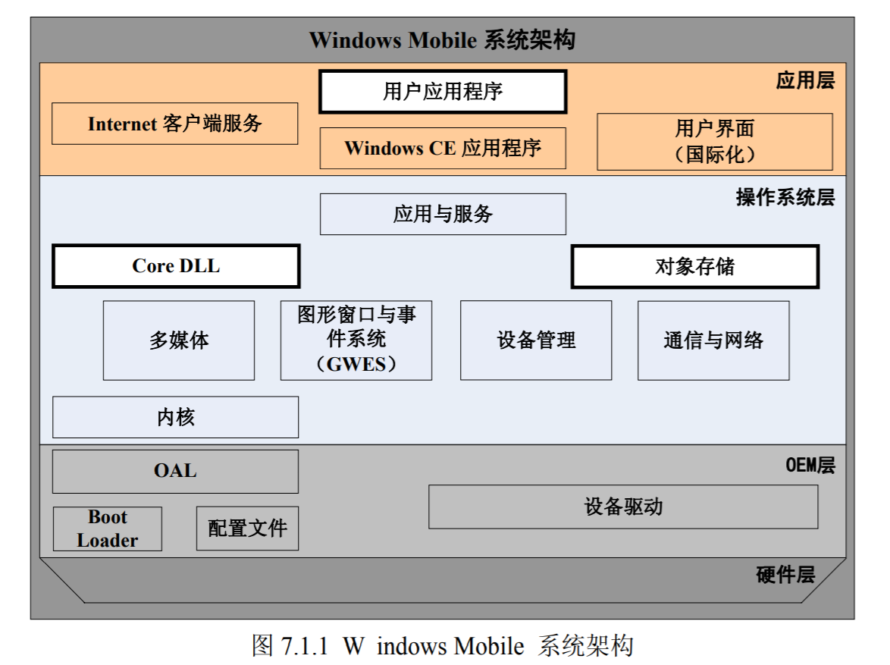
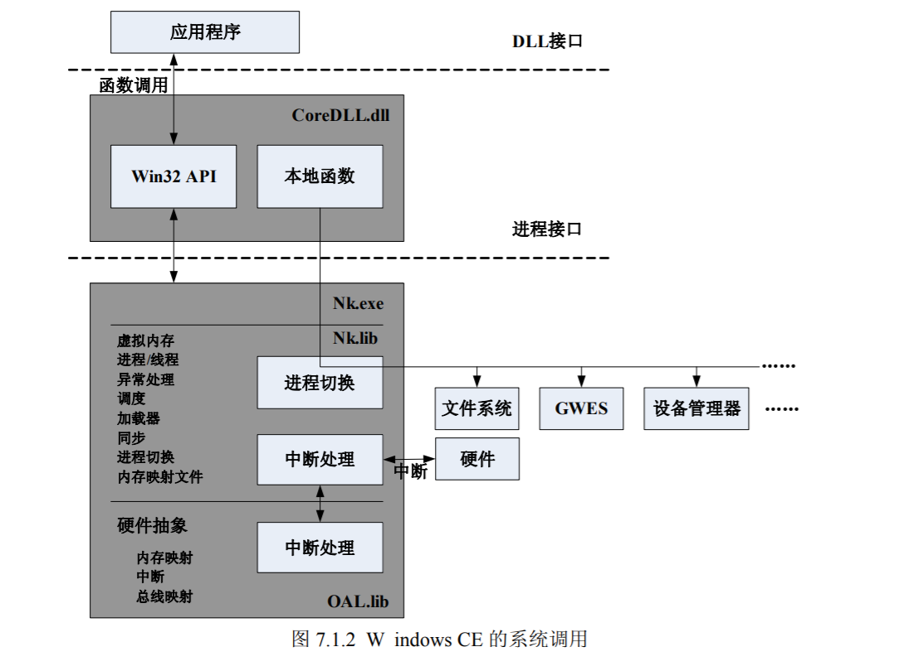
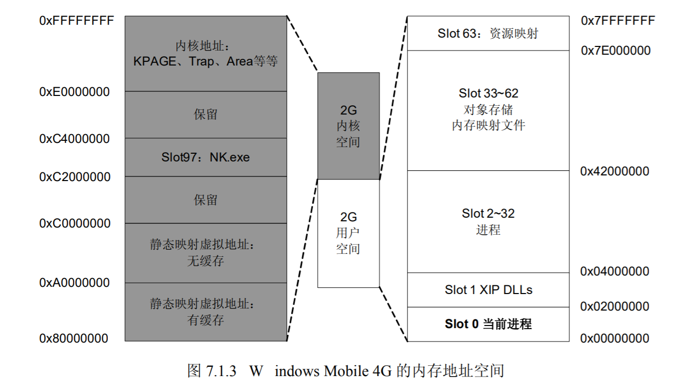
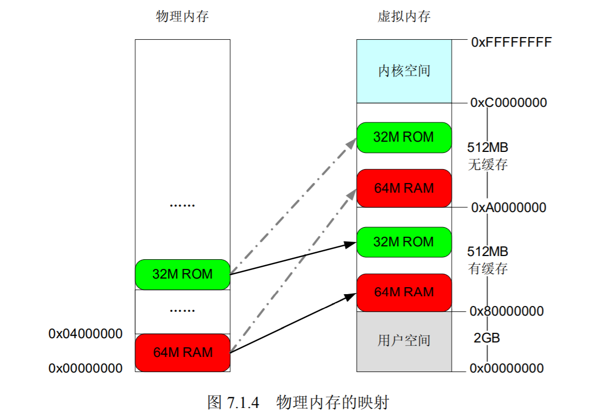
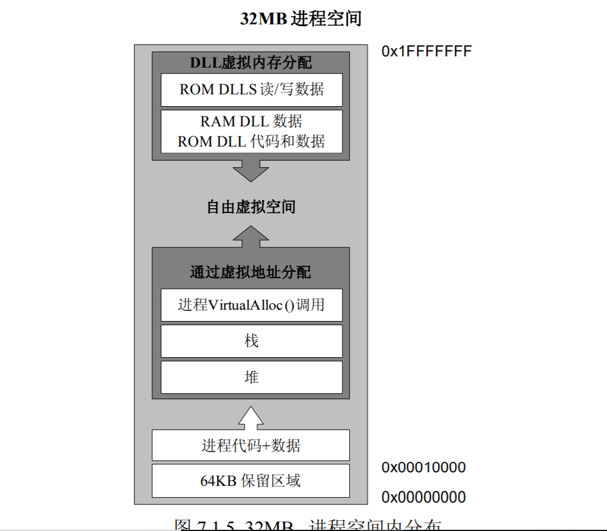
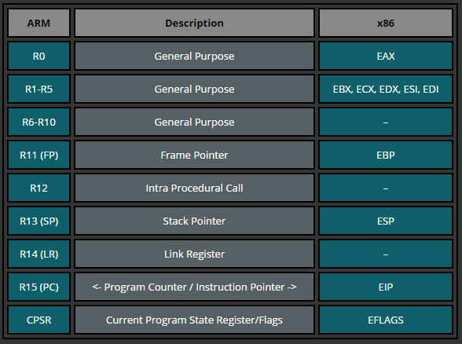
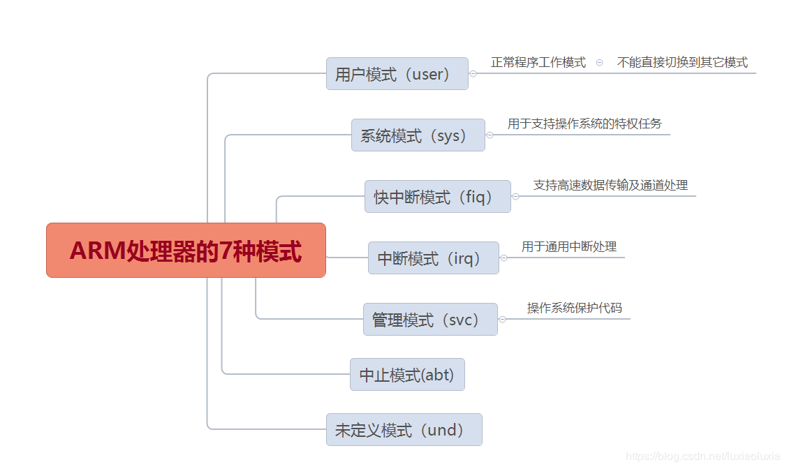
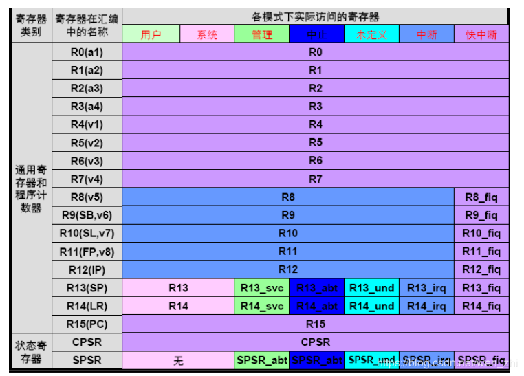
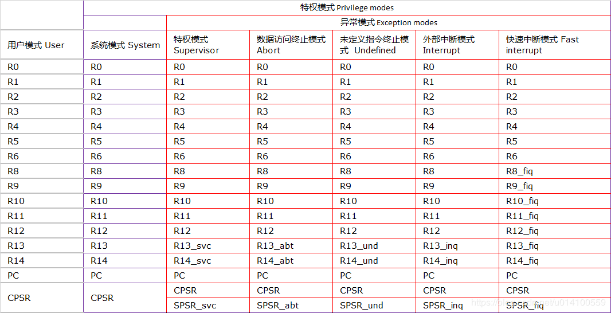

# 手机里的缓冲区溢出

## windows mobile

Windows Mobile 是 Microsoft 应用于 Pocket PC 和 Smartphone 的软件平台，它是从 Windows CE 的基础上发展而来的，其内核也是基于 Windows CE。Windows Mobile 的一大特色是将用户熟悉的桌面 Windows 扩展到了手机上，这使得 Windows Mob ile 的操作沿用了人们熟悉的Windows 操作，大多数用户都能很快上手。与 PC 上的 Windows 一样，手机上的 Windows Mobile系统同样包含开始菜单、资源管理器、IE、Windows Media Player 等功能，因此使得新手感到非常熟悉、很容易上手。Windows Mobile 也可以像桌面 PC 机那样安装第三方的软件、游戏，不断扩展它的功能，使之成为一款名副其实的移动 PC。由于都是微软的产品，桌面电脑系统与手机系统可以进行无缝结合，使得手机与电脑之间的交互异常简便。

### Windows Mobile 架构概述
由于 Windows Mobile 的核心为 Windows CE，因此其架构与 CE 的架构一脉相承。Windows Mobile 同样采用了经典的层次化设计，整个系统被划分为彼此相关的多个层次，每个层次由若干个模块构成，用以实现不同的功能。原则上每个层只需与其相邻的层进行交互，其他层对其呈透明状态，这种分层结构的好处是将硬件平台与软件、操作系统与应用程序进行了最大限度的分离，并且使系统有良好的扩展性、可移植性和可维护性。Windows Mobile 的系统架构分成了四个层次，由底向上分别为：硬件层、OEM 层、操作系统层和应用层。具体的层次化体系结构如图 7.1.1 所示。



接下来我们来看看各层次具体的作用。

#### （1）硬件层
硬件层是指由 CPU、存储器、I/O 等设备构成的硬件平台，Windows Mobile 系统所需的最低硬件配置包括支持 Windows C E 的 32 位处理器、用于线程调度的实时时钟、用于存储和运行操作系统的存储单元。根据实际需要可能还有其他外设，如：键盘、显示屏、GPRS 等。

#### （2）OEM 层
OEM 层是 Windows CE 内核与目标硬件之间的一个代码层，位于操作系统层与硬件层之间，用来抽象硬件，实现操作系统的可移植性。OEM 层可以分成 OEM 抽象层（OAL）、引导程序（Boot Loader）、配置文件和设备驱动四部分。

##### 1）OEM 抽象层（OAL）
OEM 抽象层又称 OEM 适配层（OAL，OEM Ad aptation Layer）。OAL 是整个 OEM 层的主体，包含了高度硬件相关的代码，主要负责 Windows CE 与硬件的通信。它与 CPU 、中断、内存、时钟和调试口等核心设备相关，用于屏蔽 CPU 平台的细节，保证操作系统内核的可移植性。OAL 的代码在物理上是内核的一部分，最终经过编译链接，成为内核的一部分。

题外话：我们平时使用的桌面版 Windows 操作系统与 PC 的硬件之间也存在一个类似的抽象层，称之为 HAL（Hardware Abstraction Layer）。

##### 2）引导程序（Boot Loader）
经常玩嵌入式的朋友对 Boot Loader 肯定不会陌生，它其实就是一小段引导程序，主要功能是初始化硬件，加载操作系统映像（OS Image）到内存，然后跳转到操作系统代码去执行。在这它的主要任务就是将 Windows CE 内核加载到手机硬件系统中并开始启动操作系统的执行。

##### 3）配置文件
配置文件顾名思义，就是一些包含配置信息的文本文件。这些配置信息通常与操作系统映像或源代码有关，映像配置文件用来指明最终操作系统运行时映像的创建方式，而源代码配置可以用来告诉编译系统如何编译某些源代码。

##### 4）设备驱动
设备驱动是对物理或虚拟设备功能的软件抽象，是操作系统与外部设备或虚拟设备之间的桥梁，应用程序只有通过驱动程序接口才能对物理设备或虚拟设备进行操作。在实际应用中，设备驱动程序的种类非常多，几乎每一种驱动都有不同的接口，例如电池驱动、显卡驱动、USB驱动、文件系统等等。

#### （3）操作系统层
操作系统层是 Windows CE 的核心层，既要为下层的 OEM 层提供接口和服务，又要为上层的应用层提供应用程序编程接口和服务。在这层中还集合了 Windows CE 的进程管理、线程管理、处理机管理、调度、物理内存和虚拟内存管理、文件系统、设备管理等功能。这些功能又是靠以下模块实现的。

##### 1）CoreDLL
CoreDLL 是最基本的操作系统模块，正如其名，CoreDLL 不是一个可执行文件，而是一个动态链接库。在 Windows CE 中所有的应用程序都不能直接与操作系统或硬件打交道，如果应用程序希望访问 Windows CE 所提供的服务，只能通过 Core DLL 进行。Core DLL 的主要功能是负责应用程序与 Windows CE 的通信以及完成 Windows CE 的系统调用（System Call）。系统调用是操作系统向应用程序提供的服务，一般以函数的形式提供，这些函数通常在应用程序之外的进程中实现。系统调用过程如图 7.1.2 所示。



接下来我们来看看系统调用的详细过程。
- 第一步，应用程序进行系统调用时，直接调用的是 CoreDLL.dll 中的一个包装（Wrapper）函数，这个包装函数为真正的系统调用准备所需要的参数。
- 第二步，CoreDLL 会抛出一个异常，NK.EXE 捕捉到这个异常后触发中断，这样进行系统调用的应用程序进程就挂起了，执行转入 NK.EXE。
- 第三步，NK.EXE 会根据系统调用的不同，找到具体实现该系统调用的进程，进而转入该进程继续执行。
- 第四步，执行结束后应用程序从 CoreDLL.dll 的调用处返回继续执行。
##### 2）内核
内核是 Windows CE 的核心，在 Windows CE 中内核表现为 Nk.exe 进程。作为核心进程，它实现了 Win32 API 中的进程创建加载、线程调度、中断处理和内存管理等核心功能。

Nk.exe 由 Nk.lib 与 OAL.lib 组成。Nk.lib 是微软提供的，代码与 CPU 指令体系结构相关而与具体的外设无关，这样设计可以做到使 OAL 尽可能的小。OAL.lib 就是 OEM 层中的 OAL 代码编译后的输出。
##### 3）图形窗口与事件系统
图形窗口与事件系统（GWES，Graphical Windowing and Event system）包括图形设备接口、窗口管理器和事件管理器。它是 Windows CE 系统中最为高度组件化的模块之一，由 USER 和 GDI 两部分组成，其中 USER 部分负责处理消息、用户输入（鼠标、键盘、触摸屏等）等任务，GDI 部分负责垃圾图像的显示输出等任务。

GWES 在 Windows CE 系统中表现为 GWES.exe 进程。GWES.exe 在 Windows CE 中的功能基本上是桌面版 Windows 中 USER32 和 GDI32 功能的集合。
##### 4）对象存储模块
对象存储是 Windows CE 保存应用程序及其相关数据的存储方式，其内容包括文件系统、数据库和注册表三部分。文件系统包括 RAM 和 ROM 两部分，为应用程序提供永久存储服务；

数据库是对流式文件的进一步抽象，它提供了结构化的数据存储，并以记录方式保存数据；注册表保存了系统和应用程序的配置信息，其结构类似于我们平时使用的桌面版 Windows 的注册表结构。系统中负责对象存储的进程是 Filesys.exe。
##### 5）设备管理模块
Windows CE 中的设备管理器表现为 Device.exe 进程。它负责基本的设备列表管理、即插即用管理、I/O 资源分配管理以及驱动的记载、卸载、跟踪。它还要管理所有不被 GWES.EXE 管理的驱动程序，同时向系统提供所有关于驱动的 API 的实现。
##### 6）通信与网络模块
通信服务与网络模块为 Windows CE 系统提供有线或者无线的通信能力，使 CE 能够与其他设备进行通信。为了实现这一功能，通信与网络模块提供了网络驱动接口、通信协议及网络应用程序编程接口。
##### 7）多媒体模块
现在的手机不再局限于通话这一基本功能，越来越多的手机具备了音频、视频播放能力，在 Windows Mobile 中实现这一功能的就是多媒体模块。它提供了丰富的多媒体编程所需的 API 和多媒体文件解码器，让用户可以体验丰富多彩的多媒体。
#### （4）应用层
应用层是应用程序的集合，包含了 Windows CE 应用程序、客户应用程序、互联网服务、用户接口等模块。在这一层中程序员编写的程序通过调用 Win32 API 来获得操作系统服务，但在编程时需要注意，由于硬件资源等限制某些在桌面版 Windows 中存在的 API 在这是不存在的，Windows CE 下的 API 是桌面版本 Win32 API 的一个子集；当然 Windows CE 还有许多特有的 API，例如 CE 数据库。这就需要大家在实际使用中慢慢的积累了。

### Windows Mobile 的内存管理
既然要讨论 Windows Mob ile 下的溢出问题，那么大家就必须对它的内存管理机制有所了解。虽然手机的内部可用存储都比较小，但 Windows Mobile 仍然具备了一套完善的内存管理机制。Windows Mobile 的内核 Windows CE 是一个 32 位的操作系统，因此它具备 32 位的寻址能力。

Windows Mobile 几乎实现了所有桌面版 Windows 的内存管理功能，包括我们熟悉的虚拟内存、使用堆栈等功能。同时还提供了类似桌面版 Windows 内存管理 API 函数，并针对嵌入式的特点对内存管理进行了特定的优化和改进。

与我们平时对内存的理解不同，Windows Mobile 上的内存不仅仅是 RAM，还包括 ROM、Flash Memory 等物理存储设备。其中 RAM 为操作系统和应用程序提供运行和缓冲空间，由于备用电池的存在，RAM 里边的内容在手机电池没电后仍然可以保存；ROM 就像我们的硬盘，数据永久保存，一般用来存放操作系统及与系统绑定的程序；Flash Memory 是 ROM 的替代品，既可以擦写，又可以永久保存，可以做为扩展存储设备。

Windows Mobile 是一个保护模式的操作系统，程序不能通过物理地址直接访问物理内存，必须通过虚拟内存才可以。由于 Windows Mobile 是 32 位的操作系统，寻址能力为 32 位，所以 Windows Mobile 的虚拟寻址能力可以达到 4GB，这与 32 位版的桌面版系统是一致的。但是
其中也有着不同，在桌面版的 Windows 中每个进程都具有独立的 4GB 虚拟地址空间，而在Windows Mobile 中所有的进程共享一个 4GB 的虚拟地址空间。而且这 4GB 的虚拟地址空间又被划分为两个 2GB 的区域：高址部分供系统内核使用；低址部分供用户使用，应用程序申请的空间都是从低址的部分划分。如图 7.1.3 所示。



用户空间部分又被划分为 64 个 Slot，每个 Slot 占 32MB 的空间。其中 Slot 0 到 Slot 32 用于存放进程的虚拟地址空间，每个进程占用一个 Slot，这也就是 Windows Mobile 最多支持 32个进程的由来。但是由于 Slot 0 用于映射当前处理器执行的进程，Slot 1 通常由 XIP 的 DLL 占用，一些其他必须的进程也需要占用 Slot，所以在实际使用中用户可用的进程数是少于 32 个的。

用户空间中的 Slot 33 到 Slot 63 是由所有进程共享的，由于每个进程只有 32MB 的虚拟地址空间，如果应用程序希望使用更多的虚拟内存，就可以在这个范围内申请。这个范围包括对象存储和内存映射文件。需要注意的是 Slot 63 是用来存放纯资源 DLL，如果某个 DLL 里面只有资源信息（例如图标，位图，菜单，对话框，字符串表等等），这个 DLL 就会被加载到这个空间内。

从 0x80000000 开始的高址空间就是 Windows Mobile 系统内核的专属领域了。其中虚拟地址 0x80000000 到 0x9FFFFFFF 一段用来静态映射所有的物理地址。也就是说系统会把所有的物理内存一比一地映射到这段虚拟地址上。这段地址一共有 512MB，这也就是 Windows Mobile 最大支持 512M 物理地址的由来。



0xA0000000 到 0xBFFFFFFF 会重复映射所有的物理内存，如图 7.1.4 所示。需要注意的是虽然这一段也是物理内存的映射，但是它与 0x80000000 处映射不同处在于这一段的映射是有缓冲的。什么意思？通常缓冲可以提高系统的 I/O 效率，但是对于一些 OAL 或者 Bootloader 中的设备驱动程序来说，使用缓冲有可能会造成灾难性后果，因为缓冲有可能会更改我们对设备的写操作顺序。因此在驱动程序中我们如果需要直接访问设备 I/O 或寄存器，这也就是无缓存映射存在的意义。

0xC2000000 到 0xC3FFFFFF 是 Slot 97 ，为核心进程 NK.exe 专用的。0xE0000000 到0xFFFFFFFF 一段最高的地址是内核使用的地址空间。对于不同的处理器体系结构这里保存着不同的东西。通常会放置一些供虚拟内存用的页表、中断向量表等等内核使用的数据结构。现在我们对 Windows Mob ile 的内存管理机制有了一个整体的认识，那么每个进程里面的内存又是什么样的呢？是不是和桌面版 Windows 的一致呢？接下来我们来看看进程里的内存。前面我们说过 Slot 0 为当前执行进程，所以我们就以它为例来看一下进程里面虚拟地址空间的使用情况。

在进入 Slot 0 之前我们再来普及一个小知识，Windows Mobile 中虚拟内存的申请最小单位为 64KB，也就是说每次申请到的虚拟内存大小都会是 64KB 的整数倍。这种取整的分配方式会影响到进程中 DLL 的加载，因为这意味着每个 DLL 都要占用至少 64KB 虚拟空间，那么对于32MB的Slot来说每个进程只能加载512个DLL。这就是为什么说Windows Mobile 中每个进程最多加载 512 的 DLL 了。

现在我们就在 Slot 0 来看看一个进程中虚拟内存的使用情况。在一个进程的 32MB 虚拟地址空间中，最低的 64KB 地址，即 0x00000000 到 0x00010000 为保留区域，在这 64KB 之上是进程的代码和数据，然后是一些堆和栈。

从空间的高址向下存放的是进程加载的 ROM DLL 的读写数据以及 RAM DLL 的数据；中间部分就是自由空间供进程再次申请空间使用，**值的注意的是这个空间是从低址向高址增长的**，这与桌面版 Windows 栈的增长方向是不同的。具体分布情况如下图所示。



## ARM 简介

介绍完 Windows Mobile 后我们来介绍一下与手机溢出密切相关的另外一部分 ARM。由于ARM 体系庞大，在这我们不可能一一介绍，我们只针对和溢出相关部分进行简单的介绍。如果大家对 ARM 感兴趣的话可以查阅相关书籍。

### ARM 是什么
ARM（Advanced RISC Machines），既可以认为是一个公司的名字，也可以认为是对一类微处理器的通称，还可以认为是一种技术的名字。

1991 年 ARM 公司成立于英国剑桥，主要出售芯片设计技术的授权。目前，采用 ARM 技术知识产权（IP）核的微处理器，即我们通常所说的 ARM 微处理器，已遍及工业控制、消费类电子产品、通信系统、网络系统、无线系统等各类产品市场，基于 ARM 技术的微处理器应用约占据了 32 位 RISC 微处理器 75％以上的市场份额，ARM 技术正在逐步渗入到我们生活的各个方面。

ARM 公司是专门从事基于 RISC 技术芯片设计开发的公司，作为知识产权供应商，本身不直接从事芯片生产，靠转让设计许可由合作公司生产各具特色的芯片，世界各大半导体生产商从 ARM 公司购买其设计的 ARM 微处理器核，根据各自不同的应用领域，加入适当的外围电路，从而形成自己的 ARM 微处理器芯片进入市场。目前，全世界有几十家大的半导体公司都使用 ARM 公司的授权，因此既使得 ARM 技术获得更多的第三方工具、制造、软件的支持，又使整个系统成本降低，使产品更容易进入市场被消费者所接受，更具有竞争力。

### ARM 寄存器结构
ARM 处理器共有 37 个寄存器，被分为若干个组，这些寄存器包括：
- 31 个通用寄存器，包括分组寄存器、未分组寄存器和程序计数器（PC 指针），均为 32 位的寄存器。
- 6 个状态寄存器，用以标识 CPU 的工作状态及程序的运行状态，均为 32 位，目前只使用了其中的一部分。



同时，ARM 处理器又有 7 种不同的处理器模式。



在每一种处理器模式下均有一组相应的寄存器与之对应,即在任意一种处理器模式下，可访问的寄存器包括 15 个通用寄存器（R0～R14）、一至二个状态寄存器和程序计数器（PC 指针）。在所有的寄存器中，有些是在 7 种处理器模式下共用的同一个物理寄存器，而有些寄存器则是在不同的处理器模式下有不同的物理寄存器，如表 7-2-1 所示。接下来我们来看看各寄存器的主要作用。





#### 未分组寄存器 R0~R7

对于未分组寄存器，它们没有被系统用于特别的用途，因此任何可采用通用寄存器的应用场合都可以使用未分组寄存器。但有一点要注意，未分组寄存器不会因为处理器模式的改变而更改指向的寄存器，因此在所有的处理器模式下未分组寄存器都指向同一个寄存器，当中断或异常处理造成处理器模式转换的时候，由于不同的处理器模式使用了相同的物理寄存器，这就有可能造成寄存器中的数据被破坏。

#### 分组寄存器R8~R14

对于分组寄存器，他们每一次所访问的物理寄存器与处理器当前的运行模式有关。例如在快速中断模式下R8~R12访问寄存器R8_fiq~R12_fiq；而在其它模式下R8~R12又访问寄存器R8_usr~R12_usr。因此它们每个对应着两个不同的物理寄存器。

对于R13、R14来说，每个寄存器对应6个不同的物理寄存器，其中的一个是用户模式与系统模式共用，另外5个物理寄存器对应于其它5中不同的运行模式。采用以下记号来区分不同物理寄存器：
- R13_mode
- R14_mode

其中，ARM cpu 的工作 mode为以下几种之一：
- usr 用户模式，用于正常执行程序；
- fiq 快速中断模式，用于高速数据传输；
- irq 外部中断模式，用于通常的中断处理；
- svc 管理模式，操作系统使用的保护模式；
- abt 数据访问终止模式，当数据或指令预取终止时进入该模式，可用于虚拟存储以及存储保护；
- sys 系统模式，运行具有特权的操作系统任务；
- und 未定义指令中止模式，当未定义的指令执行时进入该模式，可用于支持其它硬件。

**寄存器R13在ARM指令还有一个非常重要的作用，通常它被用做堆栈指针，当然这只是一种习惯用法，用户也可以用其他的做堆栈指针，但在Thumb指令集中，某些指令强制性地要求使用R13作为堆栈指针**。由于处理器的每种运行模式均有自己独立的物理寄存器R13，在用户应用程序的初始化部分，一般都要初始化每种模式下的R13，使其指向该运行模式的栈空间，这样，当程序的运行进入异常模式时，可以将需要保护的寄存器放入R13所指向的堆栈，而当程序从异常模式返回时，则从对应的堆栈中恢复，采用这种方式可以保证异常发生后程序的正常运行。

R14 也称做子程序连接寄存器（Subroutine Link Reg ister）或连接寄存器 LR。当执行 BL 子程序调用指令时，R14 中得到 R15（程序计数器 PC）的备份。其他情况下，R14 用做通用寄存器。与之类似，当发生中断或异常时，对应的分组寄存器 R14_svc、R14_irq、R14_fiq、R14_abt 和 R14_und 用来保存 R15 的返回值。
每一种处理器模式在自己的物理 R14 中存放当前子程序的返回地址。当通过 BL 或者 BLX 指令调用子程序时，R14 被设置成该子程序的返回地址。在子程序中，当把 R14 的值复制到程序计数器 PC 中时，就实现了子程序返回。该功能可以靠以下指令来完成：
- 1．执行以下任意一条指令：

```
MOV PC，LR
BX LR 
```

- 2．在子程序入口处使用以下指令将 R14 存入堆栈：
```STMFD SP！,{<Regs>,LR}```
对应地，使用以下指令可以完成子程序返回：
```LDMFD SP！,{<Regs>,PC}```
当发生异常中断的时候，该模式下的特定物理 R14 被设置成该异常模式将要返回的地址。

- 3．程序计数器（PC 指针）R15
  
由于 ARM 处理器采用的是流水线机制，当正确地读取了 PC 值时，该值为当前指令地址值加 8 字节。也就是说对于 ARM 指令来说，PC 指向当前指令的下两条指令的地址，由于 ARM 指令是字对齐的，PC 值的第 0 位和第 1 位总是为 0。当成功地向 PC 写入一个地址数值时，程序将跳转到该地址执行。**在 ARM 系统进行代码级调试时对于 R13、R14 及 R15 的跟踪很重要，可以用来分析系统堆栈及 PC 指针值的变化等**。

R15 虽然也可用做通用寄存器，但一般不这么使用，因为对 R15 的使用有一些特殊的限制，当违反了这些限制时，程序的执行结果是未知的。

- 4．寄存器 R16

寄存器 R16 用做当前程序状态寄存器（Current Program Status Register），可在任何运行模式下被访问，它包括条件标志位、中断禁止位、当前处理器模式标志位，以及其他一些相关的控制和状态位。

每一种运行模式下又都有一个专用的物理状态寄存器，称为备份的程序状态寄存器（Saved Program StatusRegister），当异常发生时，SPSR 用于保存 CPSR 的当前值，从异常退出时则可由 SPSR 来恢复 CPSR。

由于用户模式和系统模式不属于异常模式，他们没有 SPSR，当在这两种模式下访问 SPSR，结果是未知的。

### ARM 汇编指令结构
ARM 微处理器的在较新的体系结构中支持两种指令集：
- ARM 指令集
- Thumb 指令集。

其中，ARM 指令为 32 位的长度，Thumb 指令为 16 位长度。Thumb 指令集为 ARM 指令集的功能子集，但与等价的 ARM 代码相比较，可节省 30％～40％以上的存储空间，同时具备 32 位代码的所有优点。

ARM 指令由操作码字段和操作数字段两部分组成。
- 操作码字段指示处理器所要执行的操作；
- 操作数字段则指出在指令执行操作的过程中所需要的操作数。


ARM 指令的基本格式如下：
```<opcode> {cond} {S}  <Rd>,<Rn>{,operand2}```

其中：
- opcode 指令助记符
- cond 执行条件，如 EQ, NE
- S 是否影响CPSR寄存器的值
- Rd 目标寄存器
- Rn 第一个操作数的寄存器
- operand2 第二个操作数
- <>符号内的项是必须的，{}符号内的项时可选的。

ARM 的指令集可以分为存储器访问指令、数据处理指令、跳转指令、协处理器指令、杂项指令和伪指令六大类。接下来我们简单介绍一下这六大类指令。

#### 1．存储器访问指令
存储器访问指令用于在寄存器和存储器之间传送数据，它可以分为加载和存储两类指令，其中加载指令用于将存储器中的数据传送到寄存器，存储指令则完成相反的操作。

|助记符 |指令功能描述 |格 式| 示 例|
|-|-|-|-|
|LDM |批量加载 |LDM{cond}{mode} Rn{!}, Reg 列表 |LDMIA R0!, {R3-R9}；将存储器地址为 R0 的数据加载到 R3~R9 中|
|LDR |加载字数据| LDR{cond} Rd, 地址| LDR  R0,[R1]；将存储器地址为 R1 的字数据读入寄存器 R0|
|LDRB |加载字节数据 | LDR{cond}B Rd, 地址|
LDRB R0,[R1]；将存储器地址为 R1 的字节数据读入寄存器 R0，并将 R0 的高24 位清零|
|LDRH | 加载半字数据 | LDR{cond}H Rd, 地址
|LDRH R0 ,[R1] ；将存储器地址为 R1 的半字数据读入寄存器 R0，并将 R0 的高16 位清零|
|STR |存储字数据 |STR{cond} R d, 地址| STRR0,[R1]；将 R0 中的字数据写入以R1 为地址的存储器中|
|STRB| 存储字节数据 |STR{cond}B Rd, 地址| STRB R0,[R1]；将寄存器 R0 中的字节数据写入以 R1 为地址的存储器中|
|STRH |存储半字数据 |STR{cond}H Rd, 地址| STRH R0,[R1]；将寄存器 R0 中的半字数据写入以 R1 为地址的存储器中|
|STM |批量存储 |STM{cond} {mode} Rn{!}, Reg 列表| STMIA R0 !, {R3 -R9}；将 R3~R9 中数据存储到地址为 R0 的存储器中|
|SWP|寄存器和存储器字数据交换| SWP{cond}  Rd,Rm,Rn| SWP R0，R1，[R2]；将 R2 所指向的存储器中的字数据传送到 R0，同时将 R1 中
的字数据传送到 R2 所指向的存储单元|
|SWPB|寄存器和存储器字节数据交换 |SWP{cond} B Rd,Rm,Rn |SWPB R0,R1,[R2]；将 R2 所指向的存储器中的字节数据传送到 R0，R0 的高 24 位清零，同时将 R1 中的低 8 位数据传送到 R2 所指向的存储单元|


#### 2．数据处理指令
数据处理指令可分为数据传送指令、算术逻辑运算指令、乘法指令和比较指令。数据传送指令用于在寄存器和存储器之间进行数据的双向传输；算术逻辑运算指令完成常用的算术与逻辑的运算，该类指令不但将运算结果保存在目的寄存器中，同时更新 CPSR 中的相应条件标志位；乘法指令来计算乘法与乘加运算；比较指令不保存运算结果，只更新 CPSR 中相应的条件标志位。这些指令如

|助记符| 指令功能描述 |格 式 |示 例|
|-|-|-|-|
|MOV |数据传送 |MOV{cond}{S} Rd,operand2| MOV R0,R1；将 R1 值赋给 R0|
|MVN| 数据非传送 |MVN{cond}{S} Rd,operand2|MVN R0 ,R1；将 R1 取反，结果赋给 R0|
|ADC |带进位加法 |ADC{cond}{S} Rd,Rn,operand2|ADC R0,R0,R1；将 R0+R1+C 标志位的值赋给 R0 中|
|ADD| 加法| ADD{cond}{S} Rd,Rn,operand2|ADD R0 ,R0,R1；将 R0+R1 的值赋给 R0 中|
|AND| 逻辑与 |AND{cond}{S} Rd,Rn,operand2|AND R0,R1,R2；将 R1 和 R2 相与，结果赋给 R0 中|
|BIC |位清除 BIC{cond}{S} Rd,Rn,operand2|BIC R0 ,R1,R2；将 R2 的反码和 R1相与，结果赋给 R0 中|
|EOR| 逻辑异或 |EOR{cond}{S} Rd,Rn,operand2|EOR R0,R1,R2；将 R1 和 R2 异或，结果赋给 R0 中|
|ORR |逻辑或| ORR{cond}{S} Rd,Rn,operand2|ORR R0,R1,R2；将 R1 和 R2 相或，结果赋给 R0 中|
|RSB |逆向减法 |RSB{cond}{S} Rd,Rn,operand2|RSB R0,R1,R2；将 R2-R1 的结果赋给 R0 中|
|RSC| 带进位逆向减法 |RSC{cond}{S} Rd,Rn,operand2|RSC R0,R1,R2；将 R2-R1-C 标志位的结果赋给 R0 中|
|SBC| 带进位减法|SBC{cond}{S} Rd,Rn,operand2|RSC R0,R1,R2；将 R1-R2-C 标志位的结果赋给 R0 中|
|SUB |减法|SUB{cond}{S} Rd,Rn,operand2|RSC R0,R1,R2；将 R1-R2 结果赋给R0 中|
|MLA |乘加| MLA{cond}{S} Rd,Rm,Rs,Rn|MLA R0 ,R1,R2,R3；将 R1*R2+R3赋给 R0|
|MUL| 乘法 |MUL{cond}{S} Rd,Rm,Rs |MUL R0,R1,R2；将 R1*R2 赋给 R0|
|SMLAL|64位有符号乘加| SMLAL{cond}{S}RdL,RdH,Rm,Rs|SMLAL R0,R1,R3,R4；将 R3*R4 作为有符号 64 值，然后加上（R1,R0），最后将结果中高 32 位放入 R1，低 32位放入 R0|
|SMULL| 64 位有符号乘| SMULL{cond}{S}RdL,RdH,Rm,Rs| SMULL R0,R1,R3,R4；将 R3*R4 作为有符号 64 值，将结果中高 32 位放入 R1，低 32 位放入 R0|
|UMLAL | 64 位无符号乘加| UMLAL{cond}{S}RdL,RdH,Rm,Rs|UMLAL R0,R1,R3,R4；将 R3*R4 作为无符号 64 值，然后加上（R1,R0），最后将结果中高 32 位放入 R1，低 32位放入 R0|
|UMULL |64 位无符号乘 |UMULL{cond}{S}RdL,RdH,Rm,Rs|SMULL R0,R1,R3,R4；将 R3*R4 作为无符号 64 值，将结果中高 32 位放入 R1，低 32 位放入 R0|
|CMN |负数比较| CMN{cond}{S} Rn,operand2|CMN R0,#1；判断 R0 是否为 1 的补码，若是则 Z 标志位置位|
|CMP |比较指令 |CMP{cond}{S} Rn,operand2|CMP R0,R1；比较 R1,R2，并设置相关标志位|
|TEQ |相等测试| TEQ{cond}{S} Rn,operand2| TEQ R0,R1；比较 R0 与 R1 是否相等|
|TST| 位测试 |TST{cond}{S} Rn,operand2 |TST R0,#0x01；判断 R0 最低位是否为 0 |


#### 3．跳转指令
跳转指令用于实现程序流程的跳转，ARM 指令集中的跳转指令可以完成从当前指令向前或向后的 32MB 的地址空间的跳转，跳转指令如下表所示。

|助记符 |指令功能描述| 格 式 |示 例|
|-|-|-|-|
|B| 跳转| B{cond} 目标 |B 0x1234；跳转到 0x1234|
|BL |带链接跳转| BL{cond} 目标 |BL 0x1234；下一指令保存到 R14 并跳转|
|BX |带状态切换跳转| BX{cond} Rm|BX R0 ；跳转到 R0 指向地址，并根据 R0最低位切换处理器状态|

#### 4．协处理器指令
协处理器指令主要用于初始化 ARM 协处理器的数据处理、在 ARM 处理器的寄存器和协处理器的寄存器之间传送数据，以及在 ARM 协处理器的寄存器和存储器之间传送数据。这些指令如下表所示。

|助记符 |指令功能描述| 格 式 |示 例|
|-|-|-|-|
|CDP| 数据操作指令 |CDP{cond} c oproc, opc odel, CRd, CRn,CRm {,opcode2}| CDP P 6,1,C3,C4,C5；协处理器 6 操作，操作码为 1|
|LDC |数据读取指令 |LDC{cond} coproc, CRd,地址|LDC P6, C2,[R1]；读取 R1 指向的内存数据，并传递到 P6 协处理器的 C2 寄存器中|
|MCR|寄存器到协处理器数据传送|MCR{cond} c oproc, opc odel,Rd, CRn,CRm {,opcode2}|MCR P3,3,R0,C4,C5,6；将 R0 中的数据传送到协处理器 P3 的 C4 和 C5 寄存器中|
|MRC|协处理器到寄存器数据传送|MRC{cond} c oproc, opc odel,Rd, CRn,CRm {,opcode2}|MRC P 3,3,R0,C4,C5,6；将协处理器P3 的寄存器中的数据传送到 R0 中|
|STC |数据写入指令 |STC{cond} coproc, CRs,地址 |STC P3, C4,[R0]；将协处理器 P3 的寄存器 C4 中的字数据传送到 R0 所指向的空间中|

#### 5．杂项指令
ARM 微处理器的杂项指令包括中断指令、读写状态寄存器指令等，如下表所示。

|助记符| 指令功能描述 |格 式| 示 例|
|-|-|-|-|
|SWI |软中断指令| SWI{cond} 随机数 |SWI 0；软中断，中断立即数 0|
|MRS |读状态寄存器指令| MRS{cond} Rd,psr |MRS R1,CPSR；将 CPSR 状态值放入 R1|
|MSR |写状态寄存器指令| MRS{cond} psr,Rm |MRS CPSR_cxsf,R3；将 R3 值赋给 CPSR|

#### 6．伪指令
实际上 ARM 微处理器的伪指令并不属于 ARM 指令集，它是为了方便编程而定义的，在编译时编译器会自动将其替换为等效的 ARM 指令。这些指令如下表所示。

|助记符| 指令功能描述| 格 式| 示 例|
|-|-|-|-|
|ADR |小范围地址读取| ADR{cond} Rd, 表达式|```LOOP MOV R1,#1 ……ADR R1,LOOP；``` 将 LOOP 值放入 R1 中|
|ADRL |中等范围地址读取 |ADRL{cond} Rd, 表达式 |类似 ADR|
|LDR| 大等范围地址读取| LDR{cond} Rd, 表达式 |类似 ADR|
|NOP|空指令| NOP| NOP|


ARM 的执行条件与 x86 下面的标识位有些类似，系统通过对这些标识位的判断来确定是否满足执行条件。几乎所有的 ARM 指令都包含一个 4 位的条件码，位于指令的最高 4 位。条件码共有 16 种，每种条件码可用两个字符表示，这两个字符可以添加在指令助记符的后面和指令同时使用。例如，跳转指令 B 可以加上后缀 EQ 变为 BEQ 表示“相等则跳转”，即当 CPSR 中的 Z 标志置位时发生跳转。在 16 种条件标志码中，只有 15 种可以使用，如下表所示。第 16 种（1111）为系统保留，暂时不能使用。

指令条件码表

|编 码| 条件助记符 |标 志 位| 含 义|
|-|-|-|-|
|0000 |EQ |Z=1 |相等|
|0001| NE |Z=0 |不相等|
|0010 |CS |C=1 |无符号大于或等于|
|0011| CC |C=0 |无符号小于|
|0100| MI |N=1 |负值|
|0101 |PL |N=0 |正值或 0|
|0110 |VS |V=1 |溢出|
|0111| VC |V=0 |无溢出|
|1000| HI |C=1 且 Z=0 |无符号大于|
|1001 |LS |C=0 且 Z=1 |无符号小于或等于|
|1010 |GE |N 和 V 相同 |有符号大于或等于|
|1011 |LT | N 和 V 不相同 |有符号小于|
|1100 |GT |Z=0 且 N 等于 V| 有符号大于|
|1101 |LE |Z=1 且 N 不等于 V |有符号小于或等于|
|1110 |AL |任意 |无条件执行（不推荐使用）|
|1111 |NV |任意 |从不执行（不要使用）|


### ARM 指令寻址方式
所谓寻址方式就是处理器根据指令中给出的地址码来寻找物理地址的方式。根据地址码段的不同 ARM 的寻址方式也有所不同，但对 x86 汇编有所了解的朋友们对这些寻址方式应该都不陌生，接下来我们对这些寻址方式进行简单的介绍。

#### 1．立即寻址
立即寻址也叫立即数寻址，这是一种特殊的寻址方式，立即寻址指令中的操作码字段后面的地址码部分就是操作数本身，也就是说，数据就包含在指令当中，取出指令也就取出了可以立即使用的操作数（立即数）。例如以下指令：

```
ADD R0，R0，#1 ；R0←R0＋1
ADD R0，R0，#0x3f；R0←R0＋0x3f
```

在以上两条指令中，第二个源操作数即为立即数，要求以“＃”为前缀，对于以十六进制表示的立即数，还要求在“＃”后加上“0x”或“&”。

#### 2．寄存器寻址
操作数的值在寄存器中，指令中的地址码字段指出的是寄存器编号，指令执行时直接取出寄存器值操作。这种寻址方式是各类微处理器经常采用的一种方式，也是一种执行效率较高的寻址方式。以下指令：
```
ADD R0，R1，R2 ；R0←R1＋R2
```
该指令的执行效果是将寄存器 R1 和 R2 的内容相加，其结果存放在寄存器R0 中。
#### 3．寄存器间接寻址
寄存器间接寻址指令中的地址码给出的是一个通用寄存器编号，所需要的操作数保存在寄存器指定地址的存储单元中，即寄存器为操作数的地址指针。例如，以下指令：
```
LDR R1,[R2] [R1]←R2
STR R0，[R1] ；[R1]←R0
```

在第一条指令中，将 R2 中的数值作为地址，取出此地址中的数据保存在 R1 中。第二条指令将 R0 的值传送到以 R1 的值为地址的存储器中。
#### 4．基址变址寻址

基址寻址是将基址寄存器的内容与指令中给出的偏移量相加，形成操作数的有效地址，基址寻址用于访问基址附近的存储单元，常用于查表，数组操作，功能部件寄存器访问等。采用变址寻址方式的指令常见有以下几种形式，如下所示：
```
LDR R0，[R1，＃4] ；R0←[R1＋4]
LDR R0，[R1] ，＃4 ；R0←[R1]、R1←R1＋4
```

第一条指令将寄存器 R1 的内容加上 4 形成操作数的有效地址，从而取得操作数存入寄存器 R0 中。

第二条指令以寄存器 R1 的内容作为操作数的有效地址，从而取得操作数存入寄存器 R0中，然后，R1 的内容自增 4 个字节。

#### 5．寄存器偏移寻址
寄存器偏移寻址是 ARM 指令集特有的寻址方式，当第 2 操作数是寄存器偏移方式时，第 2 个寄存器操作数在与第 1 个操作数结合之前，选择进行移位操作。寄存器偏移寻址方式指令举例如下：

```
MOV R0,R2,LSL #3 ;R2 的值左移 3 位，结果放入 R0，即 R0 = R2 * 8
ANDS R1,R1,R2,LSL R3 ;R2 的值左移 R3 位，然后和 R1 相与操作，结果放入 R1
```

#### 6．多寄存器寻址

多寄存器寻址就是一次可以传送几个寄存器值，允许一条指令传送 16 个寄存器的任何子集或所有寄存器。例如以下指令：

```
LDMIA R0，{R1，R2，R3，R4} ；R1←[R0]R2←[R0＋4]R3←[R0＋8]R4←[R0＋12]
```

该指令可将连续存储单元的值传送到 R1～R4。

#### 7．相对寻址
相对寻址是基址寻址的一种变通，相对寻址以程序计数器 PC 的当前值为基地址，指令中的地址标号作为偏移量，将两者相加之后得到操作数的有效地址。以下程序段完成子程序的调用和返回，跳转指令 BL 采用了相对寻址方式：
```
BL NEXT ；跳转到子程序 NEXT 处执行
……
NEXT
……
MOV PC，LR ；从子程序返回
```
#### 8．堆栈寻址
堆栈是特定顺序进行存取的存储区，操作顺序分为“后进先出”和“先进后出”，堆栈寻址是隐含的，它使用一个专门的寄存器（堆栈指针）指向一块存储区域（堆栈），指针所指向的存储单元就是堆栈的栈顶。存储器堆栈可分为两种。
- 向上生长：向高地址方向生长，称为递增堆栈
- 向下生长：向低地址方向生长，称为递减堆栈

堆栈指针指向最后压入的堆栈的有效数据项，称为满堆栈（Full Stack）；堆栈指针指向下一个要放入的空位置，称为空堆栈（Empty Stack）。这样就有 4 种类型的堆栈表示递增和递减的满堆栈和空堆栈的各种组合。

- 满递增：堆栈通过增大存储器的地址向上增长，堆栈指针指向内含有效数据项的最高地址。指令如 LDMFA，STMFA 等。
- 空递增：堆栈通过增大存储器的地址向上增长，堆栈指针指向堆栈上的第一个空位置。指令如 LDMEA，STMEA 等。
- 满递减：堆栈通过减小存储器的地址向下增长，堆栈指针指向内含有效数据项的最低地址。指令如 LDMFD，STMFD 等。
- 空递减：堆栈通过减小存储器的地址向下增长，堆栈指针指向堆栈下的第一个空位置。指令如 LDMED，STMED 等。


堆栈寻址指令举例如下：
```
STMFD SP!,{R1-R7,LR} ; 将 R1～R7，LR 入栈。满递减堆栈。
LDMFD SP!,{R1-R7,LR} ;数据出栈，放入 R1～R7，LR 寄存器。满递减堆栈。
```

### ARM 的函数调用与返回

ARM 下面的函数调用与 x86 下面函数的调用有着相似之处，例如都要保护返回地址、进入子函数执行、执行完成后根据返回地址返回等一系列操作，但是它们有着许多的不同。

ARM属于 RISC 指令集，不同于 x86 的 CISC 指令集，ARM 在函数调用时倾向于寄存器传参数，这一点与 x86 的堆栈传参是不同的。一般情况下当参数不超过 4 个时，系统会使用 R0~R4 寄存器进行参数传递，而当参数超过 4 个时才会借助堆栈进行传递。例如，存在一个函数如下所示。

```
int test(int a, int b, int c, int d, int e)
{
 int f=a+b+c+d+e;
 return f;
}
```

当我们通过 test(1,2,3,4,5)方式调用它时，前 4 个参数会分别通过R0~R4 传递，第 5 个参数会通过堆栈传递，这个调用过程的反汇编代码如下所示。

```
//test(1,2,3,4,5);
mov r3, #5
str r3, [sp]
mov r3, #4
mov r2, #3
mov r1, #2 
mov r0, #1
bl |test ( 11364h )|
```

通过上面的反汇编代码我们还可以看到一点特殊之处，就是在调用子函数的时候它不是使用的 CALL 指令，而是使用了 BL 指令，这也是 ARM 的一个特点。在执行 BL 指令后，R15的值（即函数返回地址）会保存在 R14 中，进入函数后程序会将 R14 的值入栈保存。

当函数具有返回值时，返回值的传递与 x86 下也略有区别。我们知道 x86 下面是使用 EAX 寄存器传递返回值的，但在 ARM 下面是没有这个寄存器的。不过不要担心，我们还有很多寄存器可以使用的，在 ARM 中返回值是靠 R0 传递的。依然以前面的 test 函数为例，函数返回前会将返回值放入 R0 寄存器中，反汇编代码如下所示。

```
//int f=a+b+c+d+e;
ldr r2, a, #0x10
ldr r3, b, #0x14
add r2, r2, r3
ldr r3, c, #0x18
add r2, r2, r3
ldr r3, d, #0x1C
add r2, r2, r3
ldr r3, e, #0x20
add r3, r2, r3
str r3, f
//return f;
ldr r3, f
str r3, [sp, #4]
ldr r0, [sp, #4]
add sp, sp, #8
ldmia sp, {sp, pc}
```

弄好返回值后，CPU 就会从栈中取出先前保存的返回地址并赋给 R15，进而完成函数的调用。

## Android 逆向环境构建

### 基本概念

#### Bootloader 锁

Bootloader 是引导系统启动的引导程序。

Bootloader 锁是厂商为了普通用户的安全考虑而设下的一个门槛（比如被奸商塞了后门再卖、被恶意诱导进行一些高危操作等），它会在Bootloader引导启动时检测即将被启动的东西（recovery.img / boot.img）的签名是否是厂商的，如果不是的话就拒绝启动。

不解了这个锁，是无法进行刷机操作的。

提示：如果是日常用机，并且你担心出现安全问题的话，完全可以在准备完环境之后再把BL锁给锁上，只要你不怕出现突然需要改东西之类的情况或者后面直接就解不了BL锁的情况（此处点名批评华为）。

#### Recovery
Recovery 相当于是以前Windows PE u盘，我们可以通过它像使用 ghost 进行系统重装一样刷机。

Recovery一般是读取SD卡中内容进行刷机，所以此时称为卡刷。

每个厂商都会自己搞一套Recovery，而部分厂商会为自己的用户中不懂技术的用户将Recovery制作成傻瓜式工具。这时，多半不能使用它刷一些第三方东西进去，只能替换掉。

第三方Recovery （如TWRP）通常功能特别多，能做到原厂Recovery做不到的事情。

手机的OTA功能也是通过Recovery进行安装更新包的。

#### Fastboot

Fastboot是一个与Bootloader进行通信的工具，它与ADB类似，但比ADB更底层。它相当于一些主板上较为高级的UEFI。它也可以用来进行刷机。

因为Fastboot是需要连接电脑，让电脑提供刷机包的，所以这里的刷机被称为线刷。

它也可以用来替换Recovery，即使Recovery坏了也没关系，只要能进Fastboot还是可以救回来。如果Fastboot坏了，那就只能指望高通9008模式这类的东西。而如果你的手机没有这种东西的话...那就只能送回厂重刷闪存，或者...当砖头砸核桃用了。

#### 高通9008模式
9008模式学名叫Qualcomm HS-USB QDLoader 9008，是一个SoC级的调试接口。即使你的系统挂了、Recovery和Fastboot也都挂了，你也还是可以通过它来将手机恢复到正常状态；即使你没有解BL锁，你也能把System分区换个底朝天。

但是这种SoC级的调试接口属于大杀器，不到万不得已时尽量不要使用，以免手贱。

#### OTA 

OTA 更新系统工具。

#### System 分区

系统分区，里面包含了操作系统本身（官方Androi框架）和系统应用。即这里面跟系统运行的都是具有高权限的。

像Magisk、xposed等，都需要安装到System分区去。

System分区在解BL锁获取高权限前无法进行操作，同样也是为了安全考虑。

这里再扩展一下，有些手机的系统应用特别多，而且正常无法删除，这种情况下别人通常会告诉你获取ROOT权限后再进行卸载。这其实就是前面讲的权限问题，用户的正常权限比系统要低，所以自然就无法进行卸载操作了。

#### A/B分区
A/B分区会有两份系统和引导程序的分区，一份给你使用，一份作为备用。这个功能主要是为了OTA更新时能做到在手机开机状态下后台安装系统更新，使用户只需要重启一下手机就能直接进入新版本的系统，可以极大地提升用户体验。

同时，A/B分区还可以防止出现用户误操作破坏系统的情况。有了A/B区，即便破坏了也还是有另一个分区的系统可以使用，稳定性更高。

但是这玩意对搞机来说就有点烦人了，有些使用了A/B分区的手机（比如essential phone），你在准备环境或刷ROM时需要对两个分区都操作一次，否则就会出现OTA一下环境全没了的情况。

意思是，要全局一致。
#### 全盘加密 / 加密分区
全盘加密是一个能让用户在手机遗失的情况下不泄露数据的功能，现在高版本的Android都是默认开启了全盘加密的。

如果你已经进入过一次系统并设置了锁屏密码，那么你可能会在后续进入Recovery时看到一个“分区已加密，请输入密码”之类的提示，这时候你只需要输入锁屏密码就可以解锁了。
#### ADB
ADB全名叫Android调试桥，是一个系统级的命令行工具，需要进入系统后才能使用。

ADB的功能非常多，像常用的复制文件、重启/关机、打开手机的shell、查看activity、安装/卸载app、开启/关闭设备管理员功能、截屏、录屏、模拟点击/滑动等操作都可以通过ADB来实现。

一般来说，如果是日常用机，并且没有特殊需求的话，建议平时将ADB关闭掉，以免出现插了什么奇怪的设备导致设备被黑掉之类的情况。

#### Xposed
Xposed是一个Hook框架，简单来说就是可以在不修改APP本身的情况下影响程序的运行效果。它有一个模块的概念，你可以通过Xposed实现一些魔改，达到各种高度定制化和一些APP原本无法做到的效果。

Xposed原作者Rovo89目前已经弃坑，不过没关系，开源社区中继承原版Xposed大任的各种框架目前可以说是百花齐放的状态，像比较知名的EdXposed、XPatch、太极（太极本身是闭源的，但它的Hook框架Epic是开源的）之类的都可以选择使用。

#### Magisk
Magisk是一个类似于Xposed但功能和实现方式与Xposed截然不同的框架，它自带ROOT功能，并且可以让APP检测不了你的手机是否有被魔改。

碰到有检测ROOT、检测系统完整性、检测是否通过Google的SafetyNet认证的情况时，只需要使用Magisk的Hide功能就能轻松将你手机已被魔改的事实隐藏起来，对某些银行类APP有奇效。

Magisk与Xposed一样，也有模块的概念，你也可以通过它实现一些魔改，达到各种高度定制化和原本无法做到的效果。 

#### SafetyNet
SafetyNet是Google搞的一个用来检测设备是否ROOT过，设备运行环境是否安全等东西的功能，或者说...服务？在Google Play的设置中有个Play保护机制认证，这东西有一部分检测就是依靠SafetyNet来做的。

有些第三方APP也会通过SafetyNet来做到增强反作弊、反盗版功能的效果，虽然其实没什么卵用...像Netflix、Pokémon Go如果检测到SafetyNet不通过，就直接不让你用了；Google Play如果检测到SafetyNet不通过，部分APP就不让你搜到和下载了（比如Netflix）。

#### 双清/三清/四清
双清就是清除Data、Cache两个分区，这个操作会导致你在系统刷好后安装的普通APP通通被清空，但并不会清空sdcard中的数据（也就是你日常存文件的那个目录），相当于恢复出厂设置。

三清就是在双清的基础上把Dalvik Cache也给清了，某些特定场景下可以解决程序崩溃的问题。

四清通常指的是在三清的基础上连System分区也给清了，这会导致你的系统彻底消失，类似于在电脑上把系统盘格式化了一样，通常并不需要进行这个操作。
#### 引导循环（卡LOGO）
有时候你刷了一些不兼容的包到手机上时，可能会出现开机时一直卡在LOGO界面，或是LOGO动画过了之后黑屏一下又一直重复前面的动画的情况。

这其实是因为无法正常引导进入系统导致的，这种情况通常我们可以通过Recovery刷入卸载包或手动删除指定文件的方式来解决。

实际碰到这种情况时，得具体问题具体分析，没有通用的解决办法。

### Magisk（root）+ xposed环境搭建

### 使用高权限强化体验

