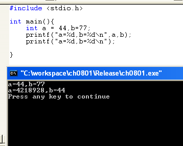
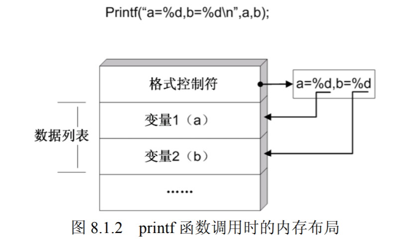
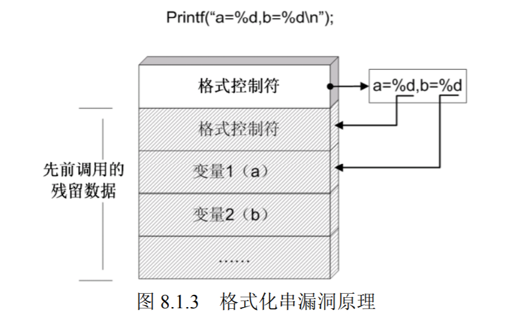
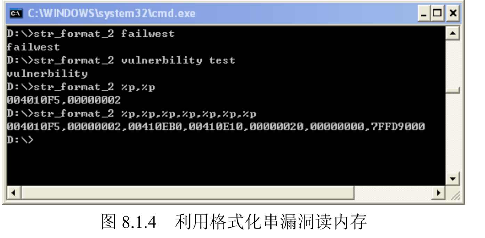

# 第7讲 其它类型的软件漏洞

## 格式化串漏洞

### printf中的缺陷

格式化串漏洞产生于数据输出函数中对输出格式解析的缺陷。以最熟悉的 printf 函数为例，其参数应该含有两部分：格式控制符和待输出的数据列表。

```c
#include "stdio.h"
main()
{
    int a=44,b=77;
    printf("a=%d,b=%d\n",a,b);
    printf("a=%d,b=%d\n");
} 
```

对于上述代码，第一个 printf 调用是正确的，第二个调用中则缺少了输出数据的变量列表。那么第二个调用将引起编译错误还是照常输出数据？如果输出数据又将是什么类型的数据呢？

按照实验环境将上述代码编译运行，实验环境如下：
- windows xp sp3
- vc6
- 默认编译选项
- release版build

运行结果如下：



第二次调用没有引起编译错误，程序正常执行，只是输出的数据有点出乎预料。使用OllyDbg 调试一下，得到“a=4218928,b=44”的原因就真相大白了。

第一次调用 printf 的时候，参数按照从右向左的顺序入栈，栈中状态如下图所示。


当第二次调用发生时，由于参数中少了输入数据列表部分，故只压入格式控制符参数，这时栈中状态如图。



虽然函数调用时没有给出“输出数据列表”，但系统仍然按照“格式控制符”所指明的方式输出了栈中紧随其后的两个 DWORD。现在应该明白输出“a=4218928,b=44”的原因了：
4218928 的十六进制形式为 0x00406030，是指向格式控制符“a=%d,b=%d\n”的指针；44 是残留下来的变量 a 的值。

### 用 printf 读取内存数据
到此为止，这个问题还只是一个 bug，算不上漏洞。但如果 printf 函数参数中的“格式控制符”可以被外界输入影响，那就是所谓的格式化串漏洞了。对于如下代码：

```c
#include "stdio.h"
int main(int argc, char ** argv)
{
    printf(argv[1]);
} 
```

当我们向程序传入普通字符串（如“failwest”）时，将得到简单的反馈。但如果传入的字符串中带有格式控制符时，printf 就会打印出栈中“莫须有”的数据。例如，输入“%p,%p,%p……”，实际上可以读出栈中的数据，如下图所示。



### 用 printf 向内存中写数据

只是允许读数据还不算很糟糕，但是如果配合上修改内存数据，就有可能引起进程劫持和shellcode 植入了。

在格式化控制符中，有一种鲜为人知的控制符%n。这个控制符用于把当前输出的所有数据的长度写回一个变量中去，下面这段代码展示了这种用法。

```c

#include "stdio.h"
int main(int argc, char ** argv)
{
    int len_print=0;
    printf("before write: length=%d\n",len_print);
    printf("failwest:%d%n\n",len_print,&len_print);
    printf("after write: length=%d\n",len_print); 
}
```

第二次 printf 调用中使用了%n 控制符，它会将这次调用最终输出的字符串长度写入变量len_print 中。“failwest:0”长度为 10，所以这次调用后 len_print 将被修改为 10。

### 格式化串漏洞的检测与防范
当输入输出函数的格式化控制符能够被外界影响时，攻击者可以综合利用前面介绍的读内存和写内存的方法修改函数返回地址，劫持进程，从而使 shellcode 得到执行。

比起大量使用命令和脚本的 UNIX 系统，Windows 操作系统中命令解析和文本解析的操作并不是很多，再加上这种类型的漏洞发生的条件比较苛刻，使得格式化串漏洞的实际案例非常罕见。

堆栈溢出漏洞往往被复杂的程序逻辑所掩盖，给漏洞检测造成一定困难。相对而言，格式化串漏洞的起因非常简单，只要检测相关函数的参数配置是否恰当就行。通常能够引起这种漏洞的函数包括：
```c
int printf(const char* format [,argument]...)
int wprintf(const wchar_t* format [,argument]...)
int fprintf( FILE* stream, const char* format [, argument ]...);
int fwprintf( FILE* stream, const wchar_t* format [, argument ]...);
int sprintf( char *buffer, const char *format [, argument] ... );
int swprintf( wchar_t *buffer, const wchar_t *format
[, argument] ... ); 
int vprintf( const char *format, va_list argptr );
int vwprintf( const wchar_t *format, va_list argptr );
int vfprintf( FILE *stream, const char *format, va_list argptr );
int vfwprintf( FILE *stream, const wchar_t *format, va_list argptr );
int vsprintf( char *buffer, const char *format, va_list argptr );
int vswprintf( wchar_t *buffer, const wchar_t *format, va_list argptr ); 
```

所以，通过简单的静态代码扫描，一般可以比较容易地发现这类漏洞。此外，VS2005 中在编译级别对参数做了更好的检查，而且默认情况下关闭了对“%n”控制符的使用。


