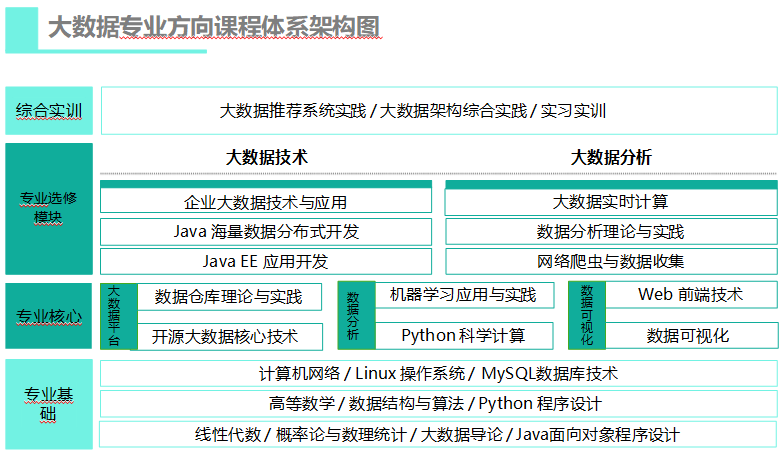
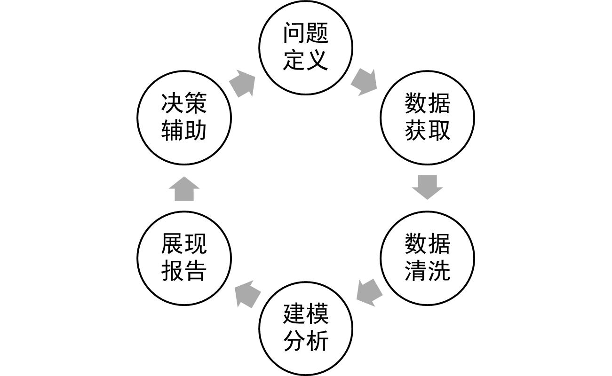

# “网络爬虫与数据采集” 课程

# 第1章 网络数据采集概述

## 课前引导

“网络数据采集”是面向大数据技术与应用方向硕士生的一门专业技术课程。在大数据技术与应用的学科方向中占据重要位置。

### 课程目标

我们这门课的总目标有以下三点：

- 了解网络数据获取的基本方式、基本要求和技术要点；
- 掌握Web信息爬取、内容解析、数据存储的基本技能；
- 理解“website is the API”这一理念。

### 课程内容

- 1 网络数据采集概述
- 2 网络爬取相关的Web技术
- 3 Web页面爬取
- 4 Web页面解析
- 5 跨越身份认证
- 6 RIA网站数据爬取
- 7 构建健壮的爬虫系统
- 8 构建高性能的爬虫系统

## 本节课程主要内容

内容列表：

- 数据的来源与采集方法
- 网络爬虫的基本概念
- 网络爬虫的工作原理
- 网络爬虫的需求分析
- 网络爬虫的发展历程
- 学习建议
- 本节总结
- 课后练习

### 本节目标

- 使学生理解网络数据采集的基本概念、基本原理和基本方法。
- 重点：
  - 爬虫的工作原理
  - 爬虫的需求分析
  - 爬虫的发展历程
- 难点：
  - 爬虫的需求分析

### 数据的来源与采集方法

数据科学是一个跨学科的领域，它使用科学的方法、过程、算法和系统，从各种形式的数据中提取知识和信息。数据科学类似于数据挖掘，但也与传统的数据挖掘有差异。事实上，数据科学是一个将统计学、数据分析、机器学习及其相关方法相统一的概念和学科，它的目的是“用数据理解和分析客观现象”。

#### 知识讲解
图灵奖得主吉姆•格雷认为数据科学将成为科学的“第四个范式”，即经验、理论、计算和数据驱动，并且断言“在信息技术和数据泛滥的影响下，有关科学的一切正在发生改变”。2012年，《哈佛商业评论》杂志将数据科学称为“21世纪最性感的职业“，随后“数据科学”这个词变得流行起来。与此同时，与数据科学相关的工作岗位也快速增多，薪资水平也逐年攀升。

大数据相关的工作岗位，一般被称为数据工程师或数据科学家，数据工程师的要求是利用数据工具做出新东西，而科学家主要是利用数据和工具解释数据说明了什么，为什么会这样。

无论是数据工程师或是数据科学家，从事数据科学工作时的基本业务流程大致是相同的。数据科学的业务流程可被描述成一个迭代模型，如图所示：

数据科学的基本业务流程依次是：问题定义、数据获取、数据清洗、建模分析、展现报告、决策辅助。之后可能会出现新的问题，或是老问题的重新定义，经过多次迭代，知识会不断更新，对事物本质认识呈螺旋型上升。从中我们可以发现，数据获取是基础环节。所谓数据获取就是通过各种技术手段和人类活动，感知能反映事物状态和变化发展的数据，并将它们收集起来，为后续基于数据的分析奠定基础。

从就业市场上的反馈来看，数据科学从业者往往被要求有多项技能，而数据获取能力往往是不可或缺的一部分。那么如何获取数据呢？ 

现实中，可供我们使用的数据，主要来自4个方面：
- 数据的第1种来源，是单位自有的历史数据，包括文档、数据库、表格等格式；
- 数据的第2种来源，是定量/定性的市场调研，例如：通过网络、街头、电话方式进行问卷调查而得到的数据。
- 数据的第3种来源，是专业机构的长期积累：许多互联网公司、咨询机构都非常擅于收集数据。随着大数据时代的来临，数据的获取与供给成为一门大生意，有从事这类业务的机构：
  + 第1种专业机构是互联网企业：例如：百度指数、阿里指数、TBI腾讯浏览指数、新浪微博指数；
  + 第2种专业机构是数据交易平台：例如：数据堂、国云数据市场、贵阳大数据交易平台；
  + 第3种专业机构，是政府统计机构，例如：国家统计局数据、世界银行公开数据、联合国数据、纳斯达克等；
  + 第4种专业机构，是数据管理咨询公司：麦肯锡、埃森哲、艾瑞咨询等。

单位自有数据、市场调研数据、专业机构数据，这3种数据来源，为我们提供了许多权威又丰富的数据，但是获取的方式不够自由，有时还要缴纳不菲的费用，此外，这些数据的格式由提供者给定，在使用前往往需要进行格式转换。而且，数据更新速度往往不够及时，所以，我们需要更加自由、迭代速度更快的第4种获取数据的方式。

- 数据的第4种来源，是网络爬取，我们常说“自己动手、丰衣足食”。互联网上的资源很丰富，根据自身所需，定制专用的网络爬虫程序，爬取特定的网络资源，输出特定格式的数据内容，是获取最新数据的最佳方式，也是现在许多数据技术公司每天都在进行工作。

利用网络爬虫实现网络数据采集是我们这门课的主命题。

#### 模块练习与答案

**练习**

1. 数据科学的基本业务流程有几步？各有什么特点？

**答案**

1.答：总的来看有6步：问题定义、数据获取、数据清洗、建模分析、展现报告、决策辅助。所谓数据获取就是通过各种技术手段和人类活动，感知能反映事物状态和变化发展的数据，并将它们收集起来，为后续基于数据的分析奠定基础。

#### 内容小结

本节主要介绍了数据科学的基本业务流程：

- 问题定义
- 数据获取
- 数据清洗
- 建模分析
- 展现报告
- 决策辅助。

### 网络爬虫的基本概念

#### 知识讲解

网络爬虫技术是一项不断发展演变的技术，所以国际上并没有网络爬虫的严格定义。在这里，我们给出一个通俗的描述，以便大家理解。

**网络爬虫是一种根据特定爬取规则，自动抓取网页，提取网页内容，输出特定数据的应用程序。**

它诞生于上世纪90年代初。人们为网络爬虫起了很多名字，特别是英文名称。例如：Crawler、Spider、Robot、Bot、Web agent、Wanderer、Worm等等。在国内，我们常称它为网络爬虫、网络蜘蛛、网络机器人等。

网络爬虫能做什么呢？或者说，它的主要功能有哪些呢？

总的来看，主要包括以下4类功能：

1. 广泛收集网页信息，形成web检索，例如：google或baidu搜索引擎系统中的网络爬虫；

2. 根据兴趣需求，聚焦具体内容，面向主题进行数据采集；这将是我们课程中要重点讨论的话题。

3. 针对特定web应用系统或处理流程，实现自动化测试或模型检测；

4. 针对web系统可能存在的风险或漏洞，实现自动化安全测试和漏洞检测。

#### 案例与应用

见《网络数据采集》第一章_案例_爬虫软件爬取公开网络数据案例.

#### 模块练习与答案

见《网络数据采集》习题集

#### 内容小结

本节主要介绍了：

- 网络爬虫的概念；
- 网络爬虫4项的功能。

### 网络爬虫的工作原理

#### 知识讲解

事实上，针对不同的任务，网络爬虫程序有不同的实现方法和实现细节。但是，当我们以较为抽象的视角来观察各种网络爬虫程序时，它们通常是由以下部分构成的：

1. 需要爬取的网页地址，由于万维网上网页地址由网页的URL指定，所以我们也称这部分为“待爬取的URLs队列”。
2. 执行爬取策略的任务调度器
3. 访问页面或下载数据的下载器
4. 分析和提取页面内容的解析器
5. 保存爬得数据结果的存储器

由以上5个部分组成的网络爬虫，它是如何工作的呢？或者说它的基本工作原理是怎样的呢？

一般地，网络爬虫的基本工作流程有以下步骤：

1. 由用户给定一组网页URLs，作为爬虫程序的输入，爬虫程序会将它们存放在待爬取队列中；

2. 调度器（Scheduler）会从待爬取URL队列中逐一取出URL，判断该URL是否已经被爬取过，即执行去重判断，之后，按照一定的遍历策略或负载策略，对URL发起网络爬取任务，也就是执行相应的HTTP请求；

3. 下载器将逐一执行调度器产生的每个HTTP请求，下载对应的Web内容，返回结果包括：HTML网页、CSS文件、JavaScript、图片等等；

4. 解析器对下载器获得的HTML页面内容进行解析，提取出用户关心的部分内容，这其中，既包括用户感兴趣的关键数据；也包括有待下一步爬取的新的URLs；

5. 存储器负责按照一定的存储模式，将解析器提取得到的用户兴趣数据存储到文件、或数据库中，以供后续数据分析和处理使用；

6. 解析器提取的需要进一步爬取的的新URLs,会被送往待爬取URLs队列。

之后，爬虫程序将重复上述步骤1至步骤6，直至队列中没有新的URL为止。当然用户也可以根据需要，随时中断爬取过程。

我们下面介绍网络爬虫的分类。根据网络爬虫程序功能和目标的不同，网络爬虫系统可以分为：通用爬虫和主题爬虫（或称聚焦爬虫）两类：通用爬虫和主题爬虫（或称聚焦爬虫）两类。

通用爬虫，指不针对某个特定主题，在网络上广泛收集网络链接和网页内容的爬虫，google或baidu搜索引擎中就集成着这类网络爬虫程序。它们的目标是形成互联网规模的网站地图。

主题爬虫是自定义的、面向特定主题需求的网络爬虫程序。与通用爬虫相比，主题爬虫仅爬取用户指定的少量网页，从中提取与主题相关的网页内容，其返回结果也更加定制化，这将有利于用户进行后续数据分析。

在我们的课程中，网络数据采集任务主要借助主题网络爬虫程序来实现，所以后面的课程将主要介绍主题网络爬虫的设计与实现。

#### 案例与应用

见《网络数据采集》第一章案例爬虫软件爬取公开网络数据案例.

#### 模块练习与答案

见《网络数据采集》习题集

#### 内容小结

本节主要介绍了：

- 网络爬虫的基本组成（5部分）
- 网络爬虫的工作原理（6步骤）
- 网络爬虫的分类（2种）

### 需求分析

为了使我们的学习目标更加明确，我们有必要分析一下用户对主题网络爬虫的功能需求和性能需求。

#### 知识讲解

**功能需求：**

- 首先，爬虫程序应当像浏览器一样，能够向网站服务器发出请求，获得web网页。

- 其次，爬虫程序应当能够将web网页中，有关主题的信息进行定位，然后提取出来。

- 第三，爬虫程序应当能够将提取出的信息进行组织，有序存储到文件或数据库中。

- 第四，爬虫程序应当能够发现新的与主题相关的网页，自动完成进一步的主题爬取。

以上4点，是主题爬虫的一般功能需求。

**性能需求：**

下面，我们分析一下，人们对网络爬虫程序的性能需求。

根据赛义德等人的研究，衡量网络爬虫程序性能的指标有很多：

- 覆盖度

覆盖度这一性能指的是网络爬虫程序已访问的网页数量与所需访问的网页数量的比值。覆盖度相当于查全率，体现了网络爬虫能否自动跟踪所有主题相关网页，完整爬取兴趣内容的能力。

通常，人们启动主题网络爬虫时，会提供一些URL链接作为输入，它们所指向的web页面里，会包含大量新的URL，网络爬虫需要自动跟踪新的URL链接，不断获取用户兴趣数据。我们知道每个web页面中都包含着大量的URL链接，那么如何完整遍历这些URL指向的网页呢？换句话说，我们希望爬虫能够尽可能多地获取主题相关信息，而且希望它能够工作的有效率。那么这个愿望该如何实现呢？

这时，我们需要抽象思维。可以将每一个URL指向的web页面抽象地看作一个点，而将页面内包含的，指向其它页面的URL链接，看作是这一点指向另一点的有向边。 这样，我们就将完整覆盖问题，转换为有向图的遍历问题。大家如果学过数据结构等相关课程，应该了解基础的图遍历算法有深度优先和广度优先两种，它们各有特点，都可以应用在网络爬虫程序中。衡量网络爬虫程序性能的众多指标中，不仅有从数量角度考量的覆盖度，还有考虑从时间角度考量的新鲜度和时效性。

- 新鲜度

新鲜度，指的是当前时间与爬虫程序最新爬得内容时间的差值。差值越小，信息越新鲜。新鲜度反映了网络爬虫程序及时发现和获取最新发布的信息的能力。

- 礼貌性

时效性，指的是网络爬虫程序完成一次有效爬取所需要耗费的时间。显然，爬取过程耗费的时间越短，说明爬虫程序的时效性越好。网络爬虫在爬取网络资源时，爬虫程序会向服务器发送请求并下载资源，这会给服务器增加负载压力。

爬虫程序的礼貌性，反映了爬虫程序对服务器产生压力大小。在设计爬虫程序时，应当尽量避免对服务器进行密集访问，减小服务器的访问压力。

- 陷阱绕过能力

网页间的链接关系往往是循环往复的，一些网站还会专门设计的链接陷阱，欺骗和阻止网络爬虫。陷阱绕过能力，是指网络爬虫的自动识别重复链接、避开爬虫陷阱的能力。

- 扩展性

网络爬虫的扩展性，指的是爬虫程序爬取和下载数据量的大小。

根据中国互联网协会2018 年7月发布《中国互联网发展报告2018》，中国网页数目达到了2604亿个，年增长率10.3%。面对海量的网页信息，网络爬虫程序应当具备分布式计算和分布式存储的能力，才能满足大数据时代的数据采集工作。

衡量网络爬虫性能的指标还有不少，例如衡量爬虫成功提交web页面表单能力的“提交效率”，以及反映爬虫程序正确感知网页DOM状态更新能力的“状态敏感度”。这些指标反映了网络爬虫在爬取动态web页面，以及由JavaScript Action驱动的富互联网应用系统时的工作性能。
有关细节，我们将在后续课程中进一步讨论。

上面，我们对面向主题的网络爬虫程序进行了需求分析，分析了一般情况下，人们对爬虫程序的功能需求和性能度量。了解这些内容将为我们设计和实现优秀的爬虫程序指明方向。

#### 案例与应用

暂无

#### 模块练习与答案

见《网络数据采集》习题集

#### 内容小结

本节主要介绍了开展网络爬虫系统设计时，需要考虑的：

- 4点功能需求

- 5点性能需求

理解这些需求，有利于理解后续课程中介绍的方法，做到有的放矢的学习。

### 网络爬虫的发展历程

事实上，人们对网络爬虫在功能和性能上的需求，并不是一开始就如此丰富的。网络爬虫程序如同其他技术一样，是随着爬取对象web网页技术的演变而发展的。之后随着互联网上网页内容的急剧增多，网络爬虫技术和产品的发展也非常快。在网络爬虫的发展过程中，出现了功能、性能各不相同的爬虫系统。

#### 知识讲解

最早的网络爬虫WebCrawler是1994年美国华盛顿大学的Brian Pinkerton设计实现的。Seyed 等在其论文《A Brief Histroy of Web Crawlers》之中，对网络爬虫的发展历程进行总结，我们可以由此了解这项技术的发展脉络，理解其本质和面临的问题。Seyed 等认为网络爬虫经历了3个阶段：

**第一阶段：静态网页爬虫。**

时间大约在1994年至2000年，1994年诞生的第一个网络爬虫WebCrawler。

1998年Google公司推出的第一代Google bot，以及2001年IBM推出的Web Fountain是这类爬虫的代表。

这些网络爬虫的基本组成如图所示。

前端部分集成了URLs队列管理和调度器，主要目的是对URLs进行排队和分派，采样器负责访问URLs获得响应结果，链接提取器负责提取页面中的新URLs，页面过滤器用于解析页面内容，查找主题相关部分，存储处理负责存储有关内容；URL去重负责判别URL是否与队列中的有重复，降低负载。

**第二阶段：动态 WEB 爬取。**

2000年前后，互联网上出现了动态网页；ASP、PHP、JSP、表单、数据库等技术成为组建网站的主流技术和关键部件。

这一时期，网络爬虫的基本组成如所示。
用户将URLs集合作为输入传递给可过滤选择器，这个模块将分析HTML元素并判断是否有可填写的表单。域发现器将对已发现的表单进行专业领域类型判断（例如判断当前表单属于认证类型，或是查询类型等）、数据类型或域的检查和确定（例如分析页面上是否存在单选框、多选框、文本输入框等），之后根据一定的策略决定适当的填充内容（例如可以利用已下载内容中可用的信息）。填写后的表单将交给提交器，它将使用适当的网络协议参数和编码将内容提交给服务器。响应分析器将分析结果是否获得了新的、有价值的内容，如果有就存到数据库，否则重新提交给选择器或域发现器处理。

这一类型的网络爬虫的典型代表有：2001年发布的HiWe项目、2003年Liddle等人的研究成果、2004年发布的barbosa、2005年恩图拉斯(Ntoulas)等人的研究成果等。

**第三阶段：富互联网应用 WEB 爬取。**

2008年后富互联网应用开设大量出现，富互联网应用简称RIA,这些程序通常由Flash、Siverlight、javaFX、ActiveX和HTML5构成。

使用这些技术加载新的页面内容时，大多不更新页面URL，而是通过AJAX或称为Javascript Action的动作，改变页面的DOM状态，状态改变后页面内容也随之改变。
应对RIA系统的网络爬虫结构如图所示

其中，Javascript引擎根据用户的初始输入启动爬取过程，对于下载到的Javascript脚本启动一个虚拟的浏览器来运行JavaScript。

之后利用虚拟浏览器发起对指定URL的访问，并获取页面内容。JS-Engine获得响应后会将响应结果的页面DOM送给DOM-Seen模块，这一模块将判断当前DOM状态实例是否已经获取过，对于新的DOM将提交给事件提取器，之后会抽取Javascript Action（JS事件），而事件则会被策略分析模块处理，即决定事件是否需要在虚拟浏览器里执行，以驱动DOM状态的改变，获取新的页面内容。JS事件的具体执行由JS引擎完成。如果发现兴趣数据，事件提取器和策略分析器会将它们存储到Model中。

RIA网络爬虫的相关研究有2007年Duda等人发布的研究成果，2008年Meshbah等人发布的基于DFS算法的研究项目，2010年发布的CrawlRIA系统；2013年发布的Feedex系统等等。有兴趣的同学可以阅读相关论文，深入研究一下。

#### 案例与应用

暂无

#### 模块练习与答案

见《网络数据采集》习题集

#### 内容小结

本节主要介绍了网络爬虫随web技术进步而不断发展的三个主要阶段：

- 1999年-2002年，静态网页爬虫。
- 2003年-2009年，动态 WEB 爬取。
- 2010年后。富互联网应用 WEB 爬取。

### 学习建议

以上我们介绍了网络爬虫的基本概念、工作原理、需求分析和发展历程。为了使大家能够由浅入深的学习后续知识，下面我们给出一些学习建议。

#### 知识讲解

1. 建议1，请大家要掌握一定的Web技术，例如HTTP工作原理、HTML语言、Javascript技术等等。

2. 建议2，掌握一定程序化方法,将爬虫程序从设计变为现实。计算机编程语言有上百种，哪一种适合编写网络爬虫程序呢？

很多同学，学习过C语言或C++语言，它们适合编写网络爬虫程序么？

C语言是一门通用计算机编程语言，广泛应用于底层开发。C语言的设计目标是提供一种能以简易的方式编译、处理低级存储器、产生少量的机器码以及不需要任何运行环境支持便能运行的编程语言。但是C语言开发爬虫系统较为复杂，相关支持库较少，需要较高的编程水平和较多的代码量才能完成网络信息获取和解析。

C++是C语言的继承，它既可以进行C语言的过程化程序设计，又可以进行以抽象数据类型为特点的基于对象的程序设计，还可以进行以继承和多态为特点的面向对象的程序设计。C++不仅拥有计算机高效运行的实用性特征，同时还致力于提高大规模程序的编程质量与程序设计语言的问题描述能力，但是C++语言的学习曲线较为陡峭，较少有人使用C++语言设计网络爬虫程序。

除了C和C++语言，很多同学还接触过JAVA语言。Java作为一门面向对象编程语言，不仅吸收了C++语言的各种优点，还摒弃了C++里难以理解的多继承、指针等概念，因此Java语言具有功能强大和简单易用两个特征。Java语言作为静态面向对象编程语言的代表，极好地实现了面向对象理论，允许程序员以优雅的思维方式进行复杂的编程。此外，Java相关的网络爬虫库较为丰富，其生态圈和社区完善，适合编写网络爬虫程序。但Java程序的编程代码量较大，代码重复性高，重构成本较高。所以在本门课程中，java语言也不是我们的选择。

我们的选择将Python语言。Python是一种动态的、面向对象的脚本语言，最初被设计用于编写自动化脚本，随着版本的不断更新和语言新功能的添加，越来越多被用于独立的、大型项目的开发。Python被认为是语法优美、代码简洁、开发效率高的胶水语言，而且用Python编写网络爬虫时，有许多简单易用的支持库和框架，非常适合编写网络爬虫程序，所以在我们的课程中，将介绍Python语言实现网络爬虫的方法和技巧。选择Python语言，掌握使用它实现爬虫程序，是我们的第二条建议。

3. 建议3，要确定好兴趣主题，找好爬取目标，由简入深，开展实践。

例如：可以先尝试编写简单爬虫，并尝试建立存储数据库与存储模式；如果有大量待爬取的URLs，需要设定遍历策略，防止URL重复；如果待访问的网页中含有表单，且需要自动化填写和提交，就要考虑表达自动处理程序。

4. 建议4，要逐步优化程序，建立模型，爬向深网。

迈克尔·伯格曼将当今互联网上的搜索服务比喻为像在地球的海洋表面的拉起一个大网的搜索，巨量的表面信息固然可以通过这种方式被查找得到，可是还有相当大量的信息由于隐藏在深处而被搜索引擎错失掉。绝大部分这些隐藏的信息是须通过动态请求产生的网页信息，而标准的搜索引擎却无法对其进行查找。传统的网络爬虫无法获取这些存在于深网的内容。高级的网络爬虫系统应当能够对深网中的隐藏信息进行发现，进而获取有价值的信息。

#### 案例与应用

暂无

#### 模块练习与答案

见《网络数据采集》习题集

#### 内容小结

本节的主要内容包括4点学习建议，这些建议对学好本门课程意义重大。特别是：

- 建议2，掌握一定程序化方法,将爬虫程序从设计变为现实。
- 建议3，要确定好兴趣主题，找好爬取目标，由简入深，开展实践。

同时，我们建议大家采用python语言实现程序，python语言的开发速度是有目共睹的，便捷的第三方库有利于实现目标。

## 本节总结

数据的来源与采集方法、网络爬虫的基本概念、网络爬虫的工作原理、网络爬虫的需求分析、以及网络爬虫的发展历程等5个方面的内容。之后我们还推荐了一套学习网络爬虫程序的方法。这些内容将有助于大家建立对网络数据采集与网络爬虫的基本认知，希望大家能有所收获。

主要内容列表：

- 数据的来源与采集方法
- 网络爬虫的基本概念
- 网络爬虫的工作原理
- 网络爬虫的需求分析
- 网络爬虫的发展历程

- 重点：
  - 爬虫的工作原理
  - 爬虫的需求分析
  - 爬虫的发展历程
- 难点：
  - 爬虫的需求分析

## 课后练习

见《网络数据采集》习题集

