# 网络爬虫与数据采集课程

# 第2章 网络爬取相关的Web技术

## 1 课前引导

上节课我们介绍了网络爬虫的基本概念、发展历程、需求分析等内容。

本节课我们将一起学习网络数据收集中经常遇到的web信息系统，了解它的技术构成。这有助于我们后面开发爬虫程序，对信息进行自动收集。

## 2 上节回顾
- 数据科学基本流程
- 数据的来源
- 网络爬虫的工作原理
- 网络爬虫的功能
- 网络爬虫的性能指标
- 网络爬虫的发展历程

## 3 本节课程主要内容

内容列表：
- 本节目标
- 相关web技术概述
- 网络爬取的入口
- 网页下载的原理
- 内容解析的对象
- 存储数据的仓库
- 本节总结
- 课后练习

### 3.1 本节目标

使学生理解Web技术组成，掌握http、html等重点内容。

重点内容：

- 熟悉URL的组成
- 理解http协议，结合爬虫工作过程，掌握网页下载原理
- 理解html语法，结合爬虫下载内容，掌握html的组成方式
- 掌握使用http协议访问web页面的基本过程

难点内容：

- http协议工作过程
- https协议工作过程

### 3.2 相关web技术概述

#### 3.2.1 知识讲解

Web是一种基于HTML和HTTP的全球性的分布式图形信息系统，它是建立在Internet上的一种网络服务。有了Web，用户可以通过浏览器以图形方式浏览Internet上的的信息。来自不同站点的文档以链接的方式组织在一起。

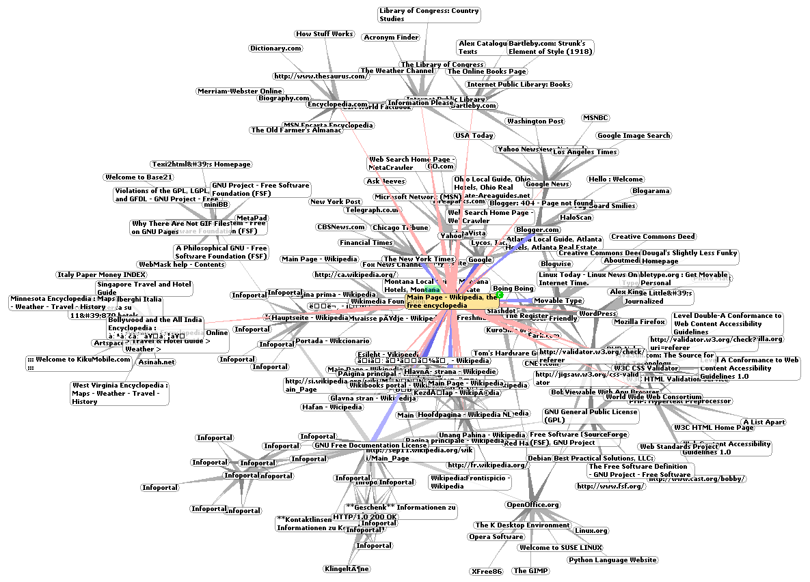

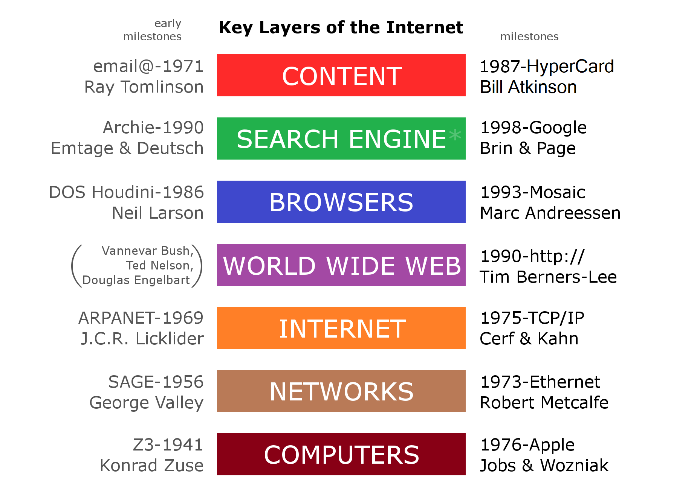

---


通常，Web系统有五大要素：
- web页面的统一资源定位符（URL）
- 超文本传输协议（HTTP）
- 超文本标记语言（HTML）
- Web服务器
- Web浏览器

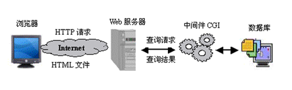

网络爬虫事实上模拟了人操作web浏览器的行为，它通常以定位web页面的统一资源定位符URL作为输入量，构造HTTP请求，然后提交给Web服务器，随后服务器会将响应结果以HTML或其他形式返回，而网络爬虫需要对这些结果进行解析和内容提取。

除了URL、HTTP、HTML等这些基本知识，近十年来Web技术的发展十分迅速，这些技术不同程度地影响着网络爬虫的工作过程与爬取结果。
例如：Ajax、Open auth、 Json、 NodeJS、HTML5、CSS3等。


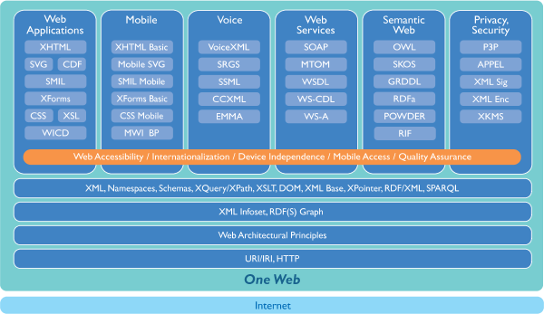

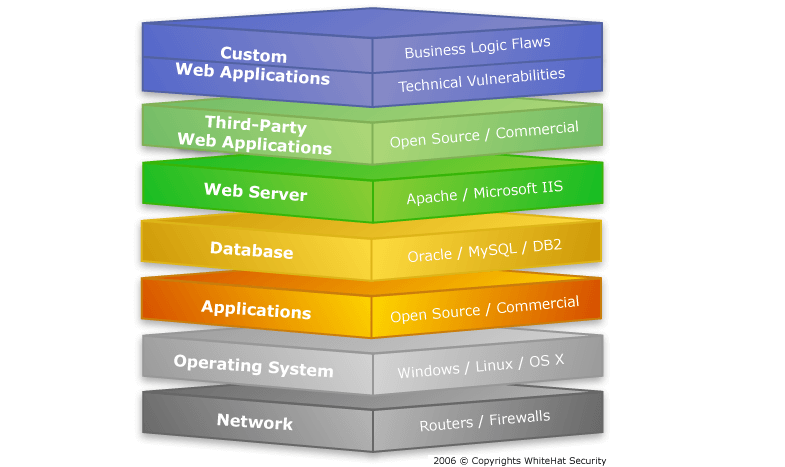

由于网络爬虫的工作过程与URL、HTTP、HTML、Javascript等知识密不可分，熟悉这些web技术有助于设计和实现网络爬虫程序，所以我们有必要花一些时间来掌握这些技术。

#### 3.2.2 案例与应用

暂无

#### 3.2.3 模块练习与答案

见《网络数据采集》习题集

#### 3.2.4 内容小结

本节主要介绍了Web技术的组成（5大要素）：

- 统一资源定位符（URL）
- 超文本传输协议（HTTP）
- 超文本标记语言（HTML）
- Web服务器
- Web浏览器

下面详细讨论各个部分内容。

### 3.3 网络爬取的入口：URL

#### 3.3.1 知识讲解

网络爬取过程的第一步，往往是根据人们指定的某个URL，去访问web页面。所以，我们常称URL是网络爬取的入口。

URL是Uniform Resource Locator的缩写，意为统一资源定位符。URL由伟大的蒂姆.伯纳斯.李发明，它作为WWW中任何一项信息资源的唯一地址，以方便人们在互联网中能找到这一资源。

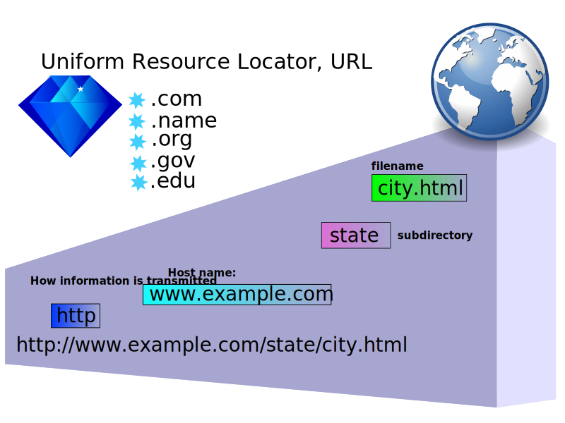

URL具有唯一性和通用性。

唯一性指的是Internet上的每一个URL都作为某一文档在互联网上的唯一标识，而互联网任意两个不相同的文档的URL一定是不相同的。

通用性指的是URL的构成遵循一定格式。URL的格式分为7个部分：

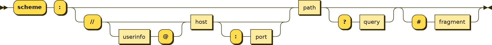

这7个部分依次是：
- 1.访问模式（或称通信协议）
- 2.用户信息
- 3.主机名称（或IP地址）
- 4.访问端口
- 5.路径
- 6.查询
- 7.片段。

简要说明一下构成URL的7个部分的具体含义：

**第1个部分. 访问模式或协议**

它指示服务器采用哪种协议或应用服务，来接收来自客户端的请求，并给予响应。

例如常见的http、ftp等。在协议关键字后，要加上一个冒号和两个斜杠作为间隔符。

**第2个部分是用户信息**

这部分不是必填项。但如果服务器仅对授权用户开放，那么就需要有这部分内容。用户信息通常表现为一个用户名。用户信息后要跟一个@符作间隔符。

**第3个部分是主机名称或IP地址**

即web网页所在服务器的域名或是IP地址。

域名是由一串用点分隔的名字组成的Internet上某一台计算机或计算机组的名称，而IP地址是Internet主机的作为路由寻址用的数字体标识。

目前，有IPv4和IPv6两个版本的IP地址， IPv4 地址更为常见。由于人们不容易记忆数字式的IP地址，而容易记忆有含义的字符串，所以产生了域名这一种字符型标识。

总的来说，域名和IP地址都是用来指定网络上某台服务器的标识。

**第4个部分是端口号**

端口号是服务器上某个正在运行的网络服务程序的访问地址。

IP地址用于在互联网中标识服务器，而端口地址则在某个服务器内标识网络应用程序。

端口号以整数形式标识，范围是0~65535。端口号在URL中不是必填部分。缺省时，表示使用访问模式的默认端口。

例如:
- http的默认端口为80。
- ftp的默认端口号为21
- ssh的默认端口号为22
- mysql的默认端口号为3306


有时出于安全或其他考虑，人们会改变某些服务的默认端口，这时就不能再省略端口号了。例如将http的默认端口改为8080.

**第5部分是路径**

路径由1个或多个“/”符号隔开的字符串组成，一般用来表示主机上的一个web访问目录或具体的文件路径。

**第6部分是查询**

查询常用于向网站服务器传递参数,特别是使用CGI、PHP/JSP/ASP/ASP.NET等技术制作的网站。

查询通常由？开始，查询参数使用参数名=参数值的格式，有多个参数时，中间用&（and）符号隔开。

**第7部分是片断(fragment）**

片段通常以一个#号开启，用于辅助定位。

例如HTML文档由URL中的文件路径信息指定，而信息片段可以在此基础上，使用标签id，指定该文档中的某个标签id。包含片段信息的URL可以用于定位一篇文档中的某个章节。

注意：第6部分查询、第7部分片段都是URL中的可选项，而不是必须有的。


URL是网络爬取的入口，在今后的网络爬虫设计中，我们会见到各种各样的URL，有些会十分复杂，但只要牢记以上URL规则，就能正确理解它们。

当我们在程序文件中使用URL时，有绝对URL和相对URL之分。

- 绝对URL显示文件的完整路径，访问URL指向的目标时，不用考虑当前程序文件的位置。

- 相对URL以包含URL的程序文件位置为参考点，描述目标的位置。图中显示了URL的绝对路径和相对路径示例。


#### 3.3.2 案例与应用

下面给出了一些URL示例：

URL绝对路径示例：
```
http://www.baidu.com
http://localhost:8888/tree
ftp://192.168.1.105/words.txt
https://s.taobao.com/list?spm=a21bo&seller_type=taobao&sort=sale-desc&sort=biz30day&cat=50031728&sd=0&as=1&tid=0
```

URL相对路径示例：
```
//index.php
//g.alicdn.com/alilog/mlog/aplus_v2.js
//www.taobao.com/market/huwai/citiao/huwaijianshen.php
//atp.alicdn.com/tmse/15/dpl/??sm-nav-2014/v85/sm-nav-2014.css

```

#### 3.3.3 模块练习与答案

见《网络数据采集》习题集

#### 3.3.4 内容小结

本节主要介绍了URL的含义和组成。

URL的7个组成部分是本节学习要点。

### 3.4 网页下载的原理

#### 3.4.1 知识讲解

前面，曾经讲到网络爬虫在下载网页时，模拟了人们使用浏览器访问网页的行为。换句话说，就是网络爬虫使用了与浏览器访问服务器相同的工作机制，来获取网页内容。浏览器访问服务器时，主要采用超文本传输协议完成工作。网络爬虫在下载网页时，也是如此。下面，我们就来深入了解一下超文本传输协议。

超文本传输协议（HyperText Transfer Protocol， HTTP ）是因特网上应用最为广泛的一种网络传输协议，所有的WWW文件都必须遵守这个标准。HTTP基于TCP协议,可以实现HTML文件、 图片、音频、视频的传输。HTTP的工作原理是怎样的呢？

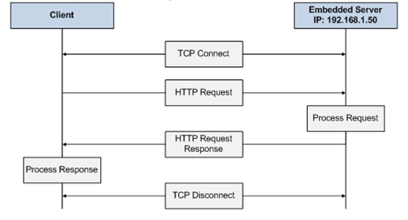

HTTP由请求和响应构成，采用客户端-服务器模式工作。


客户端也即浏览器或网络爬虫程序，发出HTTP请求，而服务器对请求进行响应具体地工作过程如下：


1. 用户输入URL，客户端程序在完成域名解析后，获得服务器IP地址；
2. 通过服务器上操作系统提供的TCP/IP协议栈程序，与服务器建立TCP连接，这就是大家熟悉的三次握手。
3. TCP连接建立后，客户端程序将HTTP请求封装为HTTP数据包，再封装为TCP数据包，发往服务器；
4. 服务器接收HTTP请求后，根据请求内容进行响应，响应数据也封装为HTTP数据包，然后再封装为TCP包，回复给客户端。
5. 服务器关闭这次TCP连接。等待新的请求。


无论浏览器与服务器，还是网络爬虫程序与服务器，都是参考以上方式进行交互通信的。

有关HTTP协议，有三点注意事项：

1. HTTP是无连接：无连接的含义是限制每次连接只处理一个请求。服务器处理完客户的请求，并收到客户的应答后，即断开连接。采用这种方式可以节省传输时间。

2. HTTP是媒体独立的：这意味着，只要客户端和服务器知道如何处理的数据内容，任何类型的数据都可以通过HTTP发送。客户端以及服务器指定使用适合的多用途互联网邮件扩展类型（MIME-type内容类型）。

3. HTTP是无状态：HTTP协议是无状态协议。无状态是指协议对于事务处理没有记忆能力。缺少状态意味着如果后续处理需要前面的信息，则它必须重传，这样可能导致每次连接传送的数据量增大。

以上，介绍的是HTTP协议的基本工作过程和协议特性。

下面我们将进一步阐述HTTP请求与响应。客户端发送一个HTTP请求到服务器的请求消息包括以下内容：请求行（request line）、请求头部（header）、空行和请求数据四个部分组成，下图给出了请求消息的一般格式。

HTTP请求示例：


图中我们看到的GET / HTTP/1.1，这是请求头的状态行，含义是使用HTTP的GET方法发送请求，版本号/1.1.从第二行开始是http request headers参数。

掌握HTTP请求头信息对设计网络爬虫程序有重要意义，所以我们下面进行重点介绍。

先介绍请求头第一行涉及的HTTP请求方法。我们先做一个小实验。在这个实验中，我们使用google chrome浏览器的开发者工具，查看访问百度搜索主页时的HTTP请求头部。

根据HTTP标准，在发送HTTP请求时，可以选择多种请求方法。不同的方法有不同的功能。HTTP1.0定义了三种请求方法： GET, POST 和 HEAD方法。

- GET方法，用于请求指定的页面信息，并返回实体主体。是最为常见的HTTP请求方法。
- POST方法，向指定资源提交数据进行处理请求（例如提交表单或者上传文件）。数据被包含在请求体中。POST请求可能会导致新的资源的建立和/或已有资源的修改。
- HEAD方法，类似于get请求，只不过返回的响应中没有具体的内容，而只用于获取HTTP协议的报文头部。常用于测试连接。

HTTP1.1新增了五种请求方法：分别是：OPTIONS, PUT, DELETE, TRACE 和 CONNECT等方法。

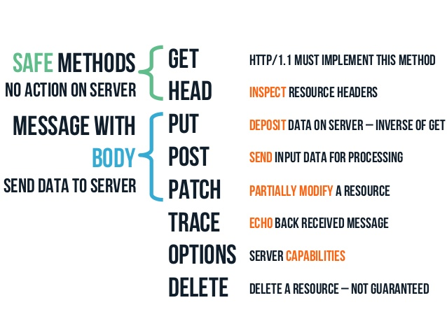

- PUT方法，从客户端向服务器传送数据，取代指定文档的内容，类似于更新操作。
- DELETE方法，用于请求服务器删除URL指定的资源。
- OPTIONS方法，用于客户端查看服务器性能参数。
- TRACE方法，用于回显服务器收到的请求，主要用于测试或诊断。
- CONNECT方法，是HTTP/1.1协议中预留给能够将连接改为管道方式的代理服务器的。

下面，我们介绍请求头部的参数内容，这部分内容在后续设计网络爬虫程序时也非常有用。

在请求头，即Request headers中，有以下细节：

```
Accept: text/html,application/xhtml+xml,application/xml;q=0.9,image/webp,image/apng,*/*;q=0.8,application/signed-exchange;v=b3
Accept-Encoding: gzip, deflate, br
Accept-Language: zh-CN,zh;q=0.9
Cache-Control: max-age=0
Connection: keep-alive
Cookie: BAIDUID=D73A87ACD18F92368CCC3A82DE4C4EFC:FG=1; BIDUPSID=D73A87ACD18F92368CCC3A82DE4C4EFC; PSTM=1563505836; BD_UPN=12314753; BDUSS=ZLVDhveTl-S1RabXNOcjlxVmxxR1NJSXkwWkx5Yk5SZXhDQjJDR1NITVdBTGxkRVFBQUFBJCQAAAAAAAAAAAEAAABz6UcBZmx5YXRvAAAAAAAAAAAAAAAAAAAAAAAAAAAAAAAAAAAAAAAAAAAAAAAAAAAAAAAAAAAAAAAAAAAAAAAAAAAAABZzkV0Wc5FdRT; ispeed_lsm=2; BDORZ=B490B5EBF6F3CD402E515D22BCDA1598; yjs_js_security_passport=795f5ee193a967695735fdbc79b83e73c0868cbd_1571024331_js; BD_HOME=1; H_PS_PSSID=1465_21117_18559_29568_29221; sugstore=0
Host: www.baidu.com
Sec-Fetch-Mode: navigate
Sec-Fetch-Site: none
Sec-Fetch-User: ?1
Upgrade-Insecure-Requests: 1
User-Agent: Mozilla/5.0 (Windows NT 10.0; WOW64) AppleWebKit/537.36 (KHTML, like Gecko) Chrome/77.0.3865.90 Safari/537.36
```

- Accept参数：用于向服务器申明客户端（浏览器）可以接受的媒体类型（MIME）的资源。 Accept参数最常见的赋值是 text/html、application/xhtml+xml、application/xml类型，表示客户端允许接收文本、HTML文件、XML文件等，如果客户端允许接收任意类型的文件，可以使用通配符*/* 。

- Accept-encoding参数：这个参数的作用是向服务器声明客户端（浏览器）允许接收的压缩编码算法。常见赋值为：gzip，deflate 或 br 等等。

- Accept-Language参数：这一参数用于向服务器申明客户端允许接收的语言。常见值为en-US, en 和 zh-CN 等。在这个参数中，我们还会看到有一个q，取值范围是从0到1，q表示了权重，en-US 的权重最高，为1，中文网站通常会将zh的权重q设为0.9.

- Cache-control参数：这个参数用于控制客户端的缓存，常见值为 private、no-cache、max-age、 must-revalidate ，默认为 private，意思是由浏览器自身决定缓存大小。如果指定cache-control的值为private、no-cache、must-revalidate，那么打开新窗口访问时都会重新访问服务器。而如果指定了max-age值，那么在此值内的时间里就不会重新访问服务器，例如：Cache-control: max-age=5表示当访问此网页后的5秒内再次访问不会去服务器。

- Connection参数：这个参数用于设置浏览器是否需要与服务器持久连接。常见取值为：keep-alive 和no；keep-alive表示需要持久连接，而no表示完成此次访问后即关闭连接。（HTTP 1.1默认进行持久连接）。

- Cookie参数：HTTP是无状态协议，不会记录之前的访问历史。但有些应用程序希望了解客户端的身份、访问历史等信息。Cookie就是为了解决这个问题而出现的。Cookie是网站服务器为了辨别用户身份、进行 会话跟踪而储存在用户本地终端上的数据（通常经过加密）。在HTTP请求头中设置这个参数，在向服务器发送请求时，就会将保存在该参数下的cookie值发送给web服务器，服务器根据这些值可以获得用户信息和访问历史。

- Host参数：这个参数用于指定请求发往的服务器的域名和端口号。例如：www.baidu.com

- Upgrade-insecure-Requests参数：这个参数被赋值为1时，用于声明浏览器支持从 http 请求自动升级为 https 请求，并且在以后发送请求的时候都使用 https，设置为0时则不允许升级为HTTPs。

- User-Agent参数：这个参数用于向服务器发送浏览器的版本、系统、应用程序的信息。这是向服务器表明客户端身份的参数，常见值为Mozilla/5.0 (Windows NT 10.0; WOW64) AppleWebKit/537.36 (KHTML, like Gecko) Chrome/72.0.3626.121 Safari/537.36。

- Refer参数：这个参数用于告诉服务器，客户端是通过哪个页面跟踪到当前页面的。也即客户端访问的上一页面地址。

上面介绍了10个常见的HTTP request headers参数，它们将在后续课程中经常用到，希望同学们能够掌握。


服务器在接收HTTP请求后，会根据请求向客户端进行响应。HTTP响应也由四个部分组成，分别是：状态行、消息报头、空行和响应正文。下面的图中显示了HTTP响应内容…

HTTP响应示例：


我们先来了解以下HTTP响应状态行，例如图中的HTTP/1.1 200 OK，它说明的HTTP协议版本为1.1，200是状态码，OK是对状态码的注释。HTTP响应状态码，也称为HTTP Status Code，它指示了当前网络访问的状态。


HTTP状态码由三个十进制数字组成，第一个十进制数字定义了状态码的类型，后两个数字没有分类的作用。HTTP状态码共分为5种类型：

- 从100到199，表示响应类型为“信息”，即服务器收到请求，提示客户端继续执行某项操作。

- 从200到299，响应类型为成功，表示客户端请求被服务器成功接收并处理；

- 从300到399，响应类型为重定向，表示客户端请求需要进一步的操作以完成请求；

- 从400到499，响应类型为客户端错误，表示请求包含语法错误或无法完成请求；

- 从500到599，响应类型为服务器错误，表示服务器在处理请求的过程中发生了错误.


下面举例说明一些常见的HTTP响应码：

- 状态码100：表示继续。客户端应继续其请求；

- 状态吗101：表示切换协议。服务器根据客户端的请求切换协议。

- 状态码200：表示请求成功。一般用于GET与POST请求的响应。

- 状态码201：表示已创建。请求成功并创建了新的资源。

- 状态码202：表示已接受。即服务器已经接受请求，但未处理完成。

- 状态码301：表示永久移动。请求的资源已被永久的移动到新URI，返回信息会包括新的URI，浏览器会自动定向到新URI。今后任何新的请求都应使用新的URI代替。

- 状态码302：表示临时移动。与301类似。但资源只是临时被移动。客户端应继续使用原有URI

- 状态码400：表示客户端请求的语法错误，服务器无法理解.

- 状态码401：表示请求要求用户的身份认证.

- 状态码403：表示服务器理解请求客户端的请求，但是拒绝执行此请求

- 状态码404：表示服务器无法根据客户端的请求找到资源（网页）

- 状态码500：表示服务器内部错误，无法完成请求

- 状态码501：表示服务器不支持请求的功能，无法完成请求

- 状态码502：表示作为网关或者代理工作的服务器尝试执行请求时，从远程服务器接收到了一个无效的响应.

HTTP响应的状态码就介绍到这里，其它状态码请同学们查阅RFC7230手册。

与HTTP请求头类似，HTTP响应头中也包含了不少参数。
```
Bdpagetype: 2
Bdqid: 0xe34326450000550e
Cache-Control: private
Connection: Keep-Alive
Content-Encoding: gzip
Content-Type: text/html;charset=utf-8
Date: Mon, 14 Oct 2019 08:02:20 GMT
Expires: Mon, 14 Oct 2019 08:02:20 GMT
Server: BWS/1.1
Set-Cookie: BDSVRTM=269; path=/
Set-Cookie: BD_HOME=1; path=/
Set-Cookie: H_PS_PSSID=1465_21117_18559_29568_29221; path=/; domain=.baidu.com
Strict-Transport-Security: max-age=172800
Transfer-Encoding: chunked
X-Ua-Compatible: IE=Edge,chrome=1
```

- Access-Control-Allow-Origin参数：这个参数，用于指定哪些网站可以跨域源资源共享。常见取值为“*”，表示允许所有网站跨域共享。

- Accept-Patch参数：用于指定服务器所支持的文档补丁格式。例如取值为 text/example;charset=utf-8，表示支持文本，编码格式为utf-8。

- Accept-Ranges参数：表示服务器所支持的内容范围。常见取值为bytes。

- Age参数：表示，响应对象在代理缓存中存在的时间，以秒为单位。

- Allow参数：用于指定对于特定资源的有效动作;常见值为：GET, HEAD等方法。

- Cache-Control参数，用于通知从服务器到客户端内的所有缓存机制，表示它们是否可以缓存这个对象及缓存有效时间。其单位为秒	。例如设置值为max-age=3600，表示缓存有效时间为1小时。

- Content-Disposition参数：表示对已知MIME类型资源的描述，浏览器可以根据这个响应头决定是对返回资源的动作。

- Content-Encoding参数：表示响应资源所使用的编码类型。常见取值为gzip等。

- Last-Modified参数：表示所请求的对象的最后修改日期。

- Set-cookie参数：用于设置HTTP cookie值。

- Date参数：用于指明响应发送时的日期和时间。

- Expires参数：用于指定一个日期/时间，超过该时间则认为此响应已经过期。

- Server参数：用于指明服务器名称。

- Transfer-Encoding参数：用于表示实体传输给用户的编码形式。

以上是一些较为常见的HTTP响应头参数，HTTP响应头中的参数还有许多，具体含义可以参考RFC2612、RFC7230文档或其中文说明。


#### 3.4.2 案例与应用

1. http request 分析


2. http response 分析


#### 3.4.3 模块练习与答案

见《网络数据采集》习题集

#### 3.4.4 内容小结

这一节，我们介绍了网页下载的原理，即依据http协议向web服务器发出请求，获得响应。

在课程中，我们介绍了HTTP协议的请求头和响应头的组成，这些知识对网络爬虫程序的实现有重要意义。

本节内容较多，希望大家能够较好的掌握。


### 3.5 内容解析的对象

通过前面的课程，我们已经清楚的知道，爬取网页的入口是网页的URL，下载网页的原理是就是HTTP协议的工作原理。当网络爬虫根据URL，利用HTTP方法发出请求后，它将得到某个web网页，为了获得其中数据，我们需要对它进行内容解析。


#### 3.5.1 知识讲解

在解析内容之前，我们需要了解web网页的内容有哪些？以及它们是如何组织在一起的？

Web网页的内容包括：文本、图片、音频、视频、样式、脚本等多种内容。所以，人们给网页起了个名字叫超文本。

网页中的各种资源，是通过超文本标记语言组织在一起的。超文本标记语言即（Hyper text markup language，简称HTML）。由HTML组织的web网页是爬虫程序进行内容解析的主要对象。下面我们对html进行重点介绍。

HTML它是用来描述网页的一种语言。HTML 不是一种编程语言，而是一种标记语言 (markup language)，HTML 使用一套标记标签 (markup tag)来描述网页中的组成内容。由HTML标签标记的内容，连同标签本身，被称为HTML元素。

图中显示的是一段简单的HTML语句示例:

```
<html>
<body>

<h1>我的第一个标题</h1>

<p>我的第一个段落。</p>

</body>
</html>

```
我们看到那些由尖括号包围的关键词，比如 <html>、<head>、<body>等，就是HTML标签。HTML 标签通常是成对出现的，比如 <head>和 </head>。标签对中的第一个标签是开始标签，第二个标签是结束标签。

HTML文档就是由许多的标签标记的元素组成的文件，文件的后缀名为.htm或.html.

我们可以尝试在浏览器中打开任何一个网页，然后在这个网页上点击鼠标右键，选择“查看网页源代码”，这时你将看到一个由HTML标签组成的文件。
现实中网页的HTML组成较为复杂，不仅使用了大量的标签，标签中还附有属性。


下面我们简单介绍一些在网络爬取过程中需要注意的标签。这对我们后续解析网页内容，提取兴趣数据很有帮助。

刚才示例中的各个标签名是有含义的，例如：

```<!DOCTYPE html> ```声明为 HTML5 文档；```<html> ```标签是 HTML 页面的根标签，每一个HTML文档的最外层都是```<html>```标签对。

**head 标签**

```<head>``` 标签用于定义HTML文档的头部，是所有头部元素的容器。

**title 标签**

HTML头部常含有```<title>``` 标签，它用于定义文档的标题。还有```<base>```标签，它为页面上的所有链接规定的默认地址或默认目标。

**link 标签**

还有```<link>``` 标签，用于定义文档与外部资源之间的关系。 ```<link>```最常用于连接样式表。

**style 标签**

```<style>``` 标签用于为 HTML 文档定义样式信息。您可以在 style 元素内规定 HTML 元素在浏览器中呈现的样式：

**meta 标签**

头部还含有```<meta>``` 标签，它提供关于 HTML 文档的元数据。典型的情况是，meta 元素被用于规定页面的描述、关键词、文档的作者、最后修改时间以及其他元数据。网络爬虫程序可以通过提取Meta元素，掌握该页面的关键词。

**body 标签**

```<body>``` 元素定义了可见的页面内容

**h 标签**

```<h1>``` -``` <h6>``` 等标签用于定义HTML中从1级到6级的标题。使用这类标签标记的内容，会以粗体或大号字体形式显示。网络爬虫在解析网页内容时，往往要先找到标题信息，确定当前网页的主题与用户兴趣有关。

**p 标签**
    
```<p>``` 标签，用于定义HTML文档中的段落。网络爬虫可以从中提取正文内容。

**a 标签**
    
```<a>```标签用于定义URL链接。URL链接通过标签中的属性给出。

属性总是以名称/值对的形式出现，并总在 HTML 元素的开始标签中规定。
    
每个html都可以设置属性，```<a>```标签中常见的属性是href。

这个属性对网络爬虫有特殊意义，因为在a标签的href属性值中，包含了新的URL，有待进一步爬取。爬虫程序需要将它们收集起来。

**img 标签**    

`````` 标签用来定义图像，标签img中，可以设置属性src，用于指定图片的路径位置；如果你希望爬虫程序下载某幅图片，就需要将它的src的属性值提取出来。

**table 标签**   

```<table>``` 标签用来定义表格。

每个表格均有若干行，行由 ```<tr>``` 标签定义，每行被分割为若干单元格，单元格由 ```<td>``` 标签定义。字母 td 指表格数据（table data），即数据单元格的内容。数据单元格可以包含文本、图片、列表、段落、表单、水平线、表格等等。

    
表格标签是网络爬虫程序经常要处理的HTML标签，因为很多网页数据是以表格形式组织的。
有的table标签中，含有表头标签，表格的表头使用 ```<th>``` 标签进行定义。

**列表 标签**  

列表与表格类似，也是我们经常用来组织数据的形式，列表分为无序列表和有序列表。

无序列表由 ```<ul>```标签指定 ，列表中的每个列表项使用```<li>```来指定。

有序列表由 ```<ol>```标签指定 ，列表中的每个列表项使用```<li>```来指定。

**块标签和内联标签**
    
我们还会经常见到DIV和span标签，它们是HTML中的块标签和内联标签。

```<div>```标签是可用于组合其他 HTML 元素的容器，本身没有特定的含义。它常与 CSS 一同使用，对大的内容块设置样式属性。


    
```<span>```标签可用作文本的容器，本身没有特定的含义。当与 CSS 一同使用时，```<span>``` 元素可用于为部分文本设置样式属性。
 
    
从HTML4开始，w3c标准化组织推荐使用块标签和内联标签代替table标签来组织web页面的布局，所以许多网页中含有大量的div标签和span标签。其中的内容是爬虫需求提取的。

**form 标签**

```<form>``` 标签用于定义 HTML 表单，  表单用于搜集不同类型的用户输入。表单元素指的是不同类型的 input 元素、复选框、单选按钮、提交按钮等等。

在2000年前后，web表单就已经成为动态web网页的构成要素。

    
很多信息都需要提交身份认证或信息查询表单后才能够获得，这也为网络爬虫程序获取数据造成了困难。
所以，一些网络爬虫程序，增加了表单发现与自动提交功能，以获取那些提交表单后才能获得的网页内容。


HTML中的框架、布局等标签，我们暂时不做介绍，因为这部分内容往往只会影响HTML的显示效果，而不会影响我们爬取数据。

**script 标签**

HTML的标签中有一类很特殊，那就是```<script>```标签。标签用于定义客户端脚本，比如 JavaScript。script 元素既可包含脚本语句，也可通过 src 属性指向外部脚本文件。必需的 type 属性规定脚本的 MIME 类型。JavaScript 最常用于图片操作、表单验证以及内容动态更新。

    
如今大多数网页，都集成了大量JAVASCRIPT脚本，JAVASCRIPT能做的事情很多，增强显示效果与加载数据都可以。特别是使用JavaScript实现的异步数据加载，即AJAX，将对网络爬虫程序获取数据造成挑战。


上面，我们介绍了不少HTML标签，这些标签在后续课程中还会经常遇到，希望大家能够认真掌握。
除了标签及使用标签组织的HTML文档元素，HTML中还经常包含样式.

**样式**

样式定义了如何显示 HTML 元素。HTML中的样式有3种情况：
外部样式表、内部样式表、内联样式。最常见的是将所有样式都放入样式表文件中。

**样式表CSS**
 
样式表，全称是层叠样式表 (Cascading Style Sheets)，简称CSS. 
单独组织样式，是为了解决内容与表现分离的问题。HTML文档本身组织内容，CSS样式表定义如何显示。这样可以极大提高工作效率。


HTML文档、CSS样式表、JavaSCRIPT脚本，是现代网页中最常见的3种资源。
上面我们重点介绍了HTML文档，绝大多数的数据都由被组织在HTML文档中，所以它是爬虫程序需要重点解析的对象。


CSS样式表、JavaScript脚本中较少出现有价值的数据，所以仅做了简要介绍。

#### 3.5.2 案例与应用

《网络数据采集》第一章_案例_HTML案例-以多列显示网站内容

#### 3.5.3 模块练习与答案

见《网络数据采集》习题集


#### 3.5.4 内容小结

本节主要介绍了HTML的基本构成要素：

- 描述元素类型的标签
- 描述元素特性的属性
- 描述元素显示风格的样式

内容比较多，但不少同学应该之前学习过，这里仅需归类复习。

### 3.6 存储数据的仓库

当网络爬虫根据用户指定的url，下载对应网页，解析出用户兴趣内容后，需要将结果妥善保存。


#### 3.6.1 知识讲解

存储数据的方式主要有两类：

- 一是以文本文件形式存储
- 二是以数据库形式存储。

我们先来看使用文本文件存储数据的情况。


我们这里所说的文本文件，不仅指后缀名为txt的纯文本文件，还包括csv文件、xml文件、json文件、yaml文件等。
这些文件都可以使用文本编辑器打开，但各有其格式要求。下面进行简要介绍。

**纯文本文件**

纯文本文件，是后缀名为txt的文件，这是最为普通的一类文本文件，使用简单，但缺少格式控制，也被称为无结构文本，机器可读性较差。

纯文本文件适合存放少量、简单数据。不适合存放大量、结构复杂的数据。

**CSV文件**

CSV文件的全称是逗号分隔值文件，因为分隔字符通常是逗号，当分割符不是逗号时，可以称其为字符分隔值文件 。


CSV文件由任意数目的记录组成，记录间以某种换行符分隔；每条记录由字段组成，字段间的分隔符是其它字符或字符串，最常见的是逗号或制表符。通常，所有记录都有完全相同的字段序列。
下面是一个csv文件的示例


CSV作为一种通用的、相对简单的文件格式，被商业和科学界广泛应用。完成程序之间的表格数据转储，常用于相互不兼容的系统间进行表格数据交换。

**XML文件**

XML文件被设计用来在互联网上传输和存储数据。 XML 指可扩展标记语言（EXtensible Markup Language）。XML文件中使用标签来组织数据，这与HTML有点像，但在大多数 web 应用程序中，XML 用于传输数据，而 HTML 用于格式化并显示数据。


按照W3C的说法，XML是独立于软件和硬件的信息传输工具。

下面的例子，给出了一个简单的XML文档。


- 第一行是 XML 声明。它定义 XML 的版本 (1.0) 和所使用的编码 (ISO-8859-1 = Latin-1/西欧字符集)。

- 第二行的<note>是描述文档的根元素（我们可以理解为“本文档是一个便签”）：
    
- 接下来 4 行描述根的 4 个子元素分别是to, from, heading 以及 body

- 最后一行的</note>定义根元素的结尾。

- 这个例子就是用XML组织的由 John 发给 George 的一张便签。


从上面的例子可以看出XML文档中的元素形成了一棵文档树。这棵树从根部开始，并扩展到树的最底端。各个标签呈现如下图所示的关系

XML文档的标签是自定义的，而不像HTML中那些标签各有含义。

使用XML存储和共享互联网上的数据有很多好处，例如实现数据与显示分离、简化共享与传输、使数据更具可用性等等。


这主要是因为XML 数据以纯文本格式进行存储，提供了一种独立于软件和硬件的数据存储方法。而这一格式较纯文本文件和csv文件，又具有良好的格式，这使完全不兼容的的应用程序之间，也可以容易的共享数据。  

**JSON**

JSON 文件，是另一种文本文件。 它使用JavaScript 对象表示法来组织数据。下面的文档是一个json格式的文件。


```
{ "employees": [ { "firstName":"Bill" , "lastName":"Gates" }, { "firstName":"George" , "lastName":"Bush" }, { "firstName":"Thomas" , "lastName":"Carter" } ] }

```

在这个例子中，记录了employee 对象，它是包含了 3 个员工记录（对象）的数组。
JSON是轻量级的文本数据交换格式比 XML 更小、更快，更易解析。


它类似于 XML，一方面它具有“自我描述性”和人类可读性；另一方面JSON 具有层级结构，此外JSON 可以通过 JavaScript 进行解析，JSON 数据可使用 AJAX 进行传输。


这使得JSON格式的数据成为当前网页实现异步加载数据的首选格式。这一点，在后面的课程中我们将会有更深的感受。

**YAML**

YAML文件是另外一种文本文件。
YAML是YAML Ain‘t Markup Language的外文缩写，YAML的开发者认为YAML是一种对人类友好可读的，面向所有编程语言的数据序列化标准。下面是一个YAML文件的示例。


从示例中可以看出，YAML很像许多编程语言一样，使用空白字符和分行来分隔信息。巧妙避开各种封闭符号，如：引号、各种括号等。它既适合用来表达阶层式的数据结构，也可以表示关联性。


目前，YAML文件常用做应用程序的配置文件。

**数据库管理系统**

以上我们简要介绍了5种文本文件形式，具体选用哪种来存储数据，需要具体情况具体分析。我们将在后续课程中，根据实际问题进行选用。

除了文本文件，还有一类存储数据的仓库，那就是各种类型的数据库管理系统。

**关系型数据库**

目前，常见的数据库管理系统，仍以传统的关系型数据库为主，而NO-SQL的非关系型数据库也占据了一定的市场。下面我们分别进行简要介绍。


关系型数据库是建立在关系模型基础上的数据库，借助于集合代数等数学概念和方法来处理数据库中的数据。现实世界中的各种实体以及实体之间的各种联系均可用关系模型来表示。关系模型是由埃德加·科德于1970年首先提出的。

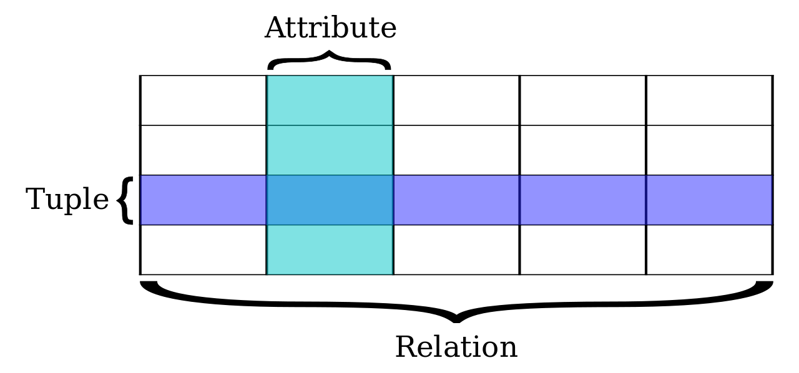

关系模型遵循ACID原则，ACID分别指Atomic原子性，Consistency一致性，Isolation隔离性，Durability持久性。


现如今虽然对此关系模型有一些批评意见，但它还是数据存储的传统标准。标准数据查询语言SQL就是一种基于关系数据库的语言，这种语言执行对关系数据库中数据的检索和操作。 


简单地讲，关系型数据库是由多张能互相联接的二维行列表格组成的数据库。

下面是一个关系数据库中的二维表示例

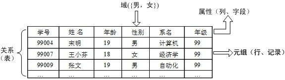

一个关系型数据库就是由二维表及其之间的联系组成的一个数据组织。当前主流的关系型数据库有Oracle、DB2、PostgreSQL、Microsoft SQL Server、Microsoft Access、MySQL等等。它们都支持标准SQL语句来控制和查询数据。


关系型数据库的优点：容易理解、使用方便、易于维护等等。

关系型数据库也存在一些问题：

关系数据表存放在硬盘上，当访问量非常大时，磁盘I/O是性能瓶颈，关系数据库的大表查询效率、多表关联查询，复杂SQL查询的效率较低,它的扩展性较差，不能简单通过添加更多的硬件和服务节点来扩展性能和负载能力。

**非关系型数据库**

正因为有以上一些问题，在面对海量互联网数据存储需求时，人们提出了非关系型数据库。

非关系型数据库指非关系型的，分布式的，且一般不保证遵循ACID原则的数据存储系统。


非关系型数据库以键值对存储，且结构不固定，每一个元组可以有不一样的字段，每个元组可以根据需要增加一些自己的键值对，不局限于固定的结构，可以减少一些时间和空间的开销。


- 非关系数据库的优点
  - 易于扩展
  - 适应大数据量查询，性能较高
  - 具有灵活的数据模型，用户可以随时自定义数据格式
  - 在不影响性能的情况下，可以方便地实现高可用架构。

- 非关系型数据库也存在一些问题
  - 它没有标准
  - 没有存储过程
  - 没有标准的查询语言(SQL)，因此进行数据库查询需要制定数据模型。
  - 许多NoSQL数据库都有REST式的数据接口或者查询AP。
  - 此外NO-SQL产品不够成熟。


常见的no-sql数据库产品有4类，

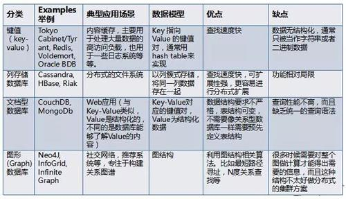

- 第一类是键值存储数据库。

这一类数据库主要会使用到哈希表，在这个表中有一个特定的键和一个指针指向特定的数据。Key/value模型对于IT系统来说优势在于简单、易部署。

键值类NO-SQL的典型产品有：TokyoCabinet、Tyrant、Redis、Voldemort、OracleBDB等

- 第二类NO-SQL是列存储数据库。

这部分数据库通常是用来应对分布式存储的海量数据。键仍然存在，但是它们的特点是指向了多个列。这些列是由列家族来安排的。

列存数据库的代表有cassandra、HBASE、Rlak等。

- 第三类no-sql是文档型数据库

文档型数据库的灵感来自于Lotus Notes办公软件，它同第一种键值存储相类似。


该类型的数据模型是版本化的文档，半结构化的文档以特定的格式存储，比如JSON。文档型数据库可以看作是键值数据库的升级版，允许之间嵌套键值。而且文档型数据库比键值数据库的查询效率更高。

文档数据库的典型代表有：CouchDB、MongoDB、SequoiaDB等。


- 第4类no-sql是 图形(Graph)数据库。

图形结构的数据库同其它行列以及刚性结构的SQL数据库不同，它是使用灵活的图形模型，并且能够扩展到多个服务器上。典型代表有Neo4J、InfoGrid、InfiniteGraph等


以上，是对数据库系统的简要介绍，这部分内容知识量较大，限于篇幅，只能做一般概述，具体操作和应用需要大家课下自习。

在后续的网络爬虫程序设计中，我们会结合现实需求，综合运用各类文件和数据库来存储爬得的兴趣数据。希望大家能及时掌握常见的文本文件语法格式和数据库产品使用方法。


#### 3.6.2 案例与应用

暂无

#### 3.6.3 模块练习与答案

见《网络数据采集》习题集

#### 3.6.4 内容小结

本节介绍了存储数据的多种格式文件，主要包括：

- 纯文本txt文件
- csv文件（用逗号或其它间隔符区别列的文本文件）
- xml文件
- json文件
- yaml文件
- 关系数据表
- 非关系数据文件

内容繁多，本节只是以点带面的介绍概要，这部分知识需要有其它课程支持（前置课）。


## 4 本节总结

这一讲，我们介绍了5个方面的内容，包括：

- 相关web技术概述
- 网络爬取的入口——url
- 网页下载的原理-http协议工作原理
- 内容解析的对象-html、css和JavaScript脚本、以及存储数据的仓库等知识。


这些基础知识将有力支撑我们后续的网络爬虫设计与实现，为实现网络数据采集奠定了基础。


## 5 课后练习

见《网络数据采集》习题集
