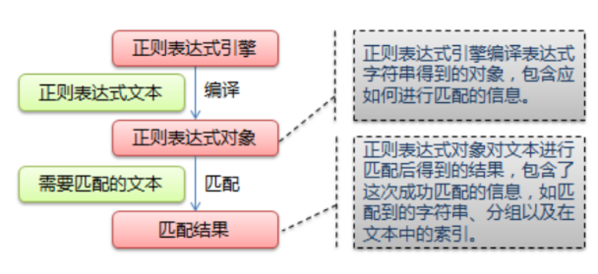
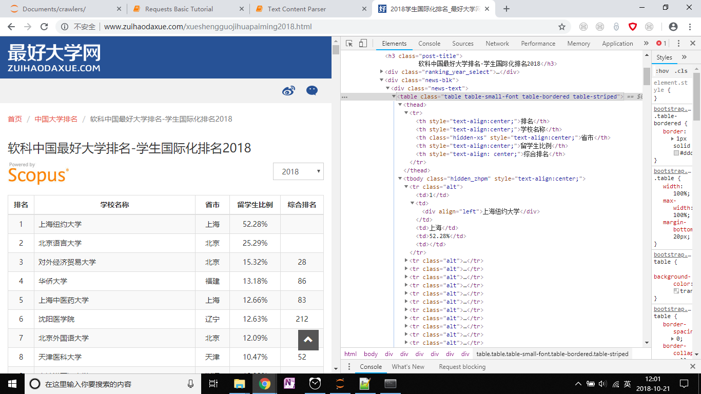

# 网络爬虫与数据采集课程

# 第4章 Web页面内容解析

## 1 课前引导

上一讲，我们介绍了简单网络爬虫的设计思路，以及如何根据URL获取web页面。

这一讲，我们将介绍如何实现Web页面内容的解析。


## 2 上节回顾

- 使用urllib获取页面内容
- 使用requests获取页面内容

## 3 本节课程主要内容

内容列表：
- 本节目标
- 实现Web页面内容解析的方法
- 文本内容的解析
- 类XML内容的解析
- JSON数据的解析
- OFFICE文档的解析
- 数据库文件的解析
- 本节总结
- 课后练习

### 3.1 本节目标

本节课的主要目标在于：

- 了解Web内容的三种类型
- 能够通过分析，针对不同类型选择合适的解析方法；
- 能够根据实际需要，写出正则表达式，构建匹配方法，能够从文本中获取兴趣信息；
- 能够根据实际需要，编写xpath查询字符串，从类xml中提取兴趣信息；
- 能够使用json、pandas、python-docx等库提取json、word、excel和数据库中的数据，将其转换为python数据结构数据。

重点内容：

- 文本内容的解析
- 类XML内容的解析

难点内容：

- 正则表达式解析文本

### 3.2 实现Web页面内容解析的方法

#### 3.2.1 知识讲解

当我们可以使用自定义的爬虫程序访问目标Web网页，获取Web页面内容之后，会发现其中仅有部分内容是用户兴趣数据。这时，我们需要使爬虫程序能够“去粗取精”，换句话说，就是要对页面内容组成进行解析，提取出用户兴趣数据。

如何实现内容解析呢？

在实践中，有3种基本思路：

**第一种，全局解析方法。**

这种方法根据构成Web文档树形标记结构，构建Web页面的全局DOM模型，将Web页面整体映射为内存中的DOM对象。

这种方式的优点是内容完整、元素内部关系准确；而缺点是占用较多内存，处理速度较慢。

**第二种方式，局部解析方法。**

这种方式不在内存中构建Web页面的全局DOM对象，而是利用逐步加载文本的流式读取程序，提取局部Web元素或文本。

这种方式比较适合处理较大Web文档，节约内存。

缺点是提取结果的准确性和完整性较第一种方式略弱。

**第三种方式，适应性方法。**

适应性方法是结合前两种方法的混合型方法。

在解析前先预判目标Web文档的大小，然后根据一定的阈值，确定处理方式。例如，文档大小超过1MB的Web页面，采用局部解析，而小于1MB这个阈值的Web页面，可以采用全局解析。

**处理流程**

刚才，我们介绍了解析Web页面的基本思路，那么在具体处理时，应该怎么做呢？

首先我们要了解待处理的数据类型，对不同类型的数据采用不同的解析方法。一般来说，网络爬虫需要解析的数据可以分为三类：

- 第一类是无结构的文本数据，例如常见的txt纯文本数据；
- 第二类是半结构化的标记型数据，例如HTML网页、Json数据、Xml文档、Yaml数据等等；
- 第三类是结构化的数据，例如关系数据库文件、Excel电子表格文件、Word文件等等；

针对不同类型的数据，需要不同的数据解析方法。这部分内容，我们将在下一小结重点介绍。

需要注意的是，我们这里讲的数据解析不是指对数据全局的理解，而是指在文档中找到用户兴趣内容并提取出来。这是因为网络爬虫程序的关键目标是获取有价值的数据，而不是完成文档的语义级分析。

#### 3.2.2 案例与应用

头条就是一个综合型的爬虫。

#### 3.2.3 模块练习与答案

**练习**

- 网络爬虫需要解析的内容类型有哪些？
- 其它见习题集。

**答案**

- 可以分为三类：
  - 第一类是无结构的文本数据，例如常见的txt纯文本数据；
  - 第二类是半结构化的标记型数据，例如HTML网页、Json数据、Xml文档、Yaml数据等等；
  - 第三类是结构化的数据，例如关系数据库文件、Excel电子表格文件、Word文件等等。

#### 3.2.4 内容小结

这一小结，我们主要讲解了解析web页面内容的三种方法，分别是：
- 全局法
- 局部法
- 适应性方法

我们还介绍了三种类型的内容，对应这三种类型的解析方式是不同的。
- 无结构
- 半结构
- 结构化数据

### 3.3 文本内容的解析

在这一小结，我们主要介绍如何使用正则表达式来解析文本内容，即使用正则表达式对兴趣文本进行定位和提取。

#### 3.3.1 知识讲解

正则表达式，又称规则表达式，通常被用来检索、替换那些符合某个模式(规则)的文本。正则表达式是对字符串操作的一种逻辑公式，就是用事先定义好的一些特定字符、及这些特定字符的组合，组成一个“规则字符串”，这个“规则字符串”用来表达对字符串的一种过滤逻辑。

给定一个正则表达式和另一个字符串，我们可以达到如下的目的：

- 一是给定的字符串是否符合正则表达式的过滤逻辑（这个过程可称为“匹配”）；
- 二是通过正则表达式，从文本字符串中获取我们想要的特定部分（这个过程可称为“过滤”）。

具体步骤，如下图所示：



有关正则表达式的一些语法规则，可以参考下表：


在python3中内置的正则表达式模块叫做re模块，包含了正则表达式的各个操作集。

**re模块简单介绍**

Module re支持了正则表达式的各种操作。

模块re提供了规则表达式匹配操作，近似于perl语言中的操作。

re模块支持：

- 8位和Unicode字符串；
- 支持pattern和字符串；
- 可以包含空字节和超出ASCII码的字符。

正则表达式可以包含特殊和普通字符串:

- 许多普通字符串，例如 "A", "a", or "0",是最简单的正则表达式；
- 特殊字符包含： "."、 "^"、"$"、"*"、"+" 、 "?"、" \d "、"\D"、"\s"、"\w" 、"\W"

**re模块中的主要功能函数**

- match，将一个正则表达式模式（pattern）与字符串头部进行匹配；
- fullmatch，将一个正则表达式模式与字符串全体进行匹配；
- sub，替换字符串中与pattern匹配的部分；
- subn，与sub函数类似，还能返回替换次数；
- search，在一个字符串中查找是否存在某个模式；
- split，若一个字符串中有匹配模式的部分，则将字符串按匹配内容为分割符分为若干子字符串；
- findall,找到字符串中所有与模式匹配的部分；
- finditer,返回一个Match对象迭代器；
- compile, 将一个正则表达式模式编译为Pattern对象；
- purge，清除正则表达式缓存（已编译模式、匹配结果等）；
- escape, Backslash all non-alphanumerics in a string.


```python
import re

help(re)
```
    

**re模块的一般使用步骤如下：**

- 第一步，编译正则表达式，即使用 compile() 函数将正则表达式的字符串形式编译为一个 Pattern 对象；
- 第二步，对目标字符串进行匹配，即通过 Pattern 对象提供的一系列方法对文本进行匹配查找，获得匹配结果（Match 对象）；
- 第三步，提取结果信息，即使用 Match 对象提供的属性和方法获得信息，还可根据需要进行其他的操作。

下面我们结合具体操作，做详细介绍。
 
**第一步 编译正则表达式**

使用python中re包，编译正则表达式的方法是使用 compile() 函数将正则表达式的字符串形式编译为一个 Pattern 对象.


```python
import re

# 目标字符串
text = 'Hello world, abcdefg, 1234567890@163.com,ABCDEFG.1+1=25678@126.com'

# 定义正则表达式,下列可以用于匹配目标字串中的电子邮件
pattern = re.compile('5\w+@\w+.com')

help(pattern)

```

**第二步 对目标字符串进行匹配**

通过 Pattern 对象提供的一系列方法对文本进行匹配查找，获得匹配结果（Match 对象）。

Pattern对象可用的方法，与re模块中的主要功能函数基本相同:

- findall(self, string, pos=0, endpos=9223372036854775807)

返回目标字符串中，所有匹配模式的项的列表。

- finditer(self, string, pos=0, endpos=9223372036854775807)

返回目标字符串中，所有匹配模式的项的迭代器；对于每个匹配项，迭代器返回一个match对象。

- fullmatch(self, string, pos=0, endpos=9223372036854775807)

如果整个字符串string都匹配pattern，就返回对应的match object；如果不匹配就返回None。

注意：返回长度为0与None的意义截然不同。

- match(self,string, pos=0, endpos=9223372036854775807)

从目标字符串的起始位开始，匹配0或多个字符。

- search(self,string, pos=0, endpos=9223372036854775807)

扫描目标字符串，查找一个匹配项并返回对应的match对象。如果在目标字符串中没有匹配项，则返回None。

- split(self, string, maxsplit=0)

按模式的出现位置，对目标字符串进行切片。

- sub(self, repl, string, count=0)

从左向右对目标字符串string进行无重叠的匹配，使用repl（指定的字符）替换已匹配部分，最终返回替换后的字符串。

- subn(self, repl, string, count=0)

功能与sub函数类似，返回一个元组（新字符串，匹配项被替换次数）。

**第三步 提取结果信息**

根据各方法返回值的不同，有多种提取结果的方法，常用的有以下几种：

- 以列表形式返回的，使用列表访问方法；
- 以迭代器（iterator）形式返回的，使用循环和group()方法；
- 以match对象形式返回的，使用group()方法访问内容。

下面，通过实例进行讲解:


```python
import re

# 目标字符串
text = 'Hello world, abcdefg, 1234567890@163.com,ABCDEFG.1+1=25678@126.com'

# 定义正则表达式,下列可以用于匹配目标字串中的电子邮件
pattern = re.compile('5\w+@\w+.com')

print("pattern.findall(text)的结果:")
match = pattern.findall(text)
print(match)

print("pattern.finditer(text)的结果:")
matchiter = pattern.finditer(text)
for i in matchiter:
    print(i)
    print(i.group())

print("pattern.fullmatch(text)的结果:")
match =pattern.fullmatch(text)
print(match)

print("pattern.match(text)的结果:")
match = pattern.match(text)
print(match)

print("pattern.search(text)的结果:")
match = pattern.search(text)
print(match)
print(match.group())

print("pattern.split(text)的结果:")
match =pattern.split(text)
print(match)

print("pattern.sub(text)的结果:")
match =pattern.sub('new-value',text)
print(match)
print("原字符串为：",text)

print("pattern.subn(text)的结果:")
match =pattern.subn('new-value',text)
print(match)
print("原字符串为：",text)
```

运行结果：
```
pattern.findall(text)的结果:
['567890@163.com', '5678@126.com']
pattern.finditer(text)的结果:
<re.Match object; span=(26, 40), match='567890@163.com'>
567890@163.com
<re.Match object; span=(54, 66), match='5678@126.com'>
5678@126.com
pattern.fullmatch(text)的结果:
None
pattern.match(text)的结果:
None
pattern.search(text)的结果:
<re.Match object; span=(26, 40), match='567890@163.com'>
567890@163.com
pattern.split(text)的结果:
['Hello world, abcdefg, 1234', ',ABCDEFG.1+1=2', '']
pattern.sub(text)的结果:
Hello world, abcdefg, 1234new-value,ABCDEFG.1+1=2new-value
原字符串为： Hello world, abcdefg, 1234567890@163.com,ABCDEFG.1+1=25678@126.com
pattern.subn(text)的结果:
('Hello world, abcdefg, 1234new-value,ABCDEFG.1+1=2new-value', 2)
原字符串为： Hello world, abcdefg, 1234567890@163.com,ABCDEFG.1+1=25678@126.com
```   

#### 3.3.2 案例与应用

以上是基本的函数使用，下面我们引入一个爬虫实例。

```python
import requests
import re

def fetchUrl(url,queryload = None):
    try:
        headers = {'Accept':'text/html,application/xhtml+xml,application/xml;q=0.9,image/webp,image/apng,*/*;q=0.8',
                   'User-Agent':'Mozilla/5.0 (Windows NT 10.0; WOW64) AppleWebKit/537.36 (KHTML, like Gecko) Chrome/69.0.3497.100 Safari/537.36',
                  }

        session = requests.Session()
        r = session.get(url,params = queryload,headers = headers)
        
        r.raise_for_status()
        r.encoding = r.apparent_encoding

        return r.text

    except requests.exceptions.HTTPError as e:
        print(e)       
        return "Some exceptions were raised."

def parseText(htmltext,pattern):
    rlist = pattern.findall(htmltext)
    return rlist

# 获取url指定页面
url = 'https://gupiao.baidu.com/'
htmltext = fetchUrl(url)

# 解析中文内容
pattern = re.compile(u'[\u4e00-\u9fa5]+')
r = parseText(htmltext,pattern)
print(r)     
```

运行结果：

```
['股市通', '股票', '证券', '股票吧', '贴吧', '证券社区', '股票推荐', '智能选股', '百度证券', '股票', '股市', '炒股', '炒股软件', '股票软件', '大盘', '股票行情', '股票入门', '股票怎么玩', '炒股入门知识', '赚钱', '新手炒股快速入门', '财经', '证券', '金融', '港股', '行情', '基金', '债券', '期货', '外汇', '保险', '银行', '博客', '股吧', '财迷', '论坛', '股票的行情趋势', '基本面情况', '机构面诊断', '基本面诊断', '技术面诊断', '股市通', '选股更轻松', '股市通是百度出品的一款简单易用的炒股软件', '通过股市通', '你可以快速获知市场上的投资热点', '了解这些热点背后的驱动事件以及与其最相关的个股', '查看沪深', '港股', '美股个股实时行情和各市场最新排行', '创建可在各终端间实时同步的自选股列表', '获取基于自选股定制的资讯', '股市通', '选股更轻松', '输入股票名称', '代码', '首字母', '搜', '索', '登录', '注册', '下载股市通', '添加到......

'股市通免责声明', '欢迎提出您在使用过程中遇到的问题或宝贵建议', '字以内', '感谢您对股市通的支持']

```

#### 模块练习与答案

**练习**

请浏览**交易所上市公司信息页面，尝试编写网络爬虫程序，获取页面内容并利用正则表达式解析出所有的股票代码以及公司的域名。

**答案**


```python
# 解析所有股票代码
url = 'TEST_URL_003'

htmltext = fetchUrl(url)
pattern = re.compile('\d{6}')
r = parseText(htmltext,pattern)
print(r) 

```

运行结果：
```
['000001', '000001', '000001', '000002', '000002', '000002', '000004', '000004', '000004', '000004', '000005', '000005', '000005', '000006', '000006', '000006', '000007', '000007', '000007', '000008', '000008', '000008', '000009', '000009', '000009', '000010', '000010', '000010', '000011', '000011', '000011', '000012', '000012', '000012', '000014', '000014', '000014', '000016', '000016', '000016', '000017', '000017', '000017', '000018', '000018', '000018', '000019', '000019', '000019', '000020', '000020', '000020', '000021', '000021', '000021', '000023', '000023', '000023', '000023', '000025', '000025', '000025']
```

```python

url = 'TEST_URL_003'
htmltext = fetchUrl(url)
pattern = re.compile(r"www\.\S+\.com")
r = parseText(htmltext,pattern)
print(r)  
```
运行结果：

```
['www.bank.pingan.com', 'www.vanke.com', 'www.fountain.com', 'www.zhenye.com', 'www.shenzhou-gaotie.com', 'www.chinabaoan.com', 'www.szwuye.com', 'www.csgholding.com', 'www.konka.com', 'www.cbc.com', 'www.sgwde.com', 'www.slkg1949.com', 'www.hwafa.com', 'www.kaifa.com']
```   

#### 3.3.3 内容小结

本节介绍了正则表达式的基本含义、匹配规则，以及使用re模块进行正则匹配的功能函数。


### 3.4 类XML内容的解析


以上就是利用正则表达式解析文本内容的方法和代码实现内容。下面我们来一起学习如何解析类XML文档内容。

#### 3.4.1 知识讲解

XML指可扩展标记语言,被设计用来传输和存储数据。有关XML的详细介绍，可参考W3School官方文档: http://www.w3school.com.cn/xml/

HTML指的是超文本标记语言 (Hyper Text Markup Language),是WWW上用于编写网页的主要工具，详细信息请参考http://www.w3school.com.cn/htm  

XML和HTML都是一种标记语言 (markup language)，使用标记标签来描述数据，这些标签可用于查找和定位数据。

HTML DOM 定义了访问和操作 HTML 文档的标准方法，以树结构方式表达 HTML 文档。


**XML的节点关系**

下面是xml文档的一个例子：

```
<?xml version="1.0" encoding="ISO-8859-1"?>

<bookstore>

    <book>
      <title lang="eng">Harry Potter</title>
      <price>29.99</price>
    </book>

    <book>
      <title lang="eng">Learning XML</title>
      <price>39.95</price>
    </book>

</bookstore>
```

- 父（Parent）每个元素以及属性都有一个父，上例中book 元素是 title、price 元素的父结点；
- 子（Children）元素节点可有零个、一个或多个子，上例中title、price 元素都是 book 元素的子结点；
- 同胞（Sibling）拥有相同的父的节点，上例中title、price 为同胞结点；
- 先辈（Ancestor）某节点的父、父的父等等，上例中title、price 的先辈结点是bookstore。
- 后代（Descendant）某个节点的子，子的子，上例中bookstore的后代结点为book、title、price。

**XPath语法**

XPath (XML Path Language) 是一门在 XML 文档中查找信息的语言，可用来在 XML 文档中对元素和属性进行遍历。细节可以参考W3School官方文档：http://www.w3school.com.cn/xpath/index.asp  

XPath 使用路径表达式来选取 XML 文档中的节点或节点集。节点是通过沿着路径 (path) 或者步 (steps) 来选取的。

XPath 开发工具有：

- 开源的XPath表达式编辑工具:XMLQuire(XML格式文件可用)
- Chrome插件 XPath Helper
- Firefox插件 XPath Checker

**使用XPATH选取节点**

XPath使用路径表达式来选取XML文档中的节点或者节点集。这些路径表达式与文件系统中的表达式非常相似。

下面列出了最常用的路径表达式：
    
|表达式|描述|
|:-|:-|
|nodename|选取此节点的所有子节点|
|/|从根节点选取|
|//|从匹配选择的当前节点选择文档中的节点，而不考虑它们的位置|
|.|选取当前节点|
|..|选取当前节点的父节点|
|@|选取属性|


在下面的表格中，我们已列出了一些路径表达式以及表达式的结果：

|路径表达式|结果|
|-|-|
|bookstore|选取 bookstore 元素的所有子节点|
|/bookstore	|选取根元素 bookstore  注释：假如路径起始于正斜杠( / )，则此路径始终代表到某元素的绝对路径！|
|bookstore/book|选取属于 bookstore 的子元素的所有 book 元素。|
|//book|选取所有 book 子元素，而不管它们在文档中的位置|
|bookstore//book|选择属于 bookstore 元素的后代的所有 book 元素，而不管它们位于 bookstore 之下的什么位置。|
|//@lang|选取名为 lang 的所有属性|

**XPATH 谓语**

XPATH中的谓语（Predicates）用来查找某个特定的节点或者包含某个指定的值的节点，被嵌在方括号中。


在下面的表格中，我们列出了带有谓语的一些路径表达式，以及表达式的结果：

|路径表达式|结果|
|:-|:-|
|/bookstore/book[1]	|选取属于 bookstore 子元素的第一个 book 元素。|
|/bookstore/book[last()]|选取属于 bookstore 子元素的最后一个 book 元素。|
|/bookstore/book[last()-1]|选取属于 bookstore 子元素的倒数第二个 book 元素。|
|/bookstore/book[position()<3]|选取最前面的两个属于 bookstore 元素的子元素的 book 元素。|
|//title[@lang]	|选取所有拥有名为 lang 的属性的 title 元素。|
|//title[@lang='eng']	|选取所有 title 元素，且这些元素拥有值为 eng 的 lang 属性。|
|/bookstore/book[price>35.00]	|选取 bookstore 元素的所有 book 元素，且其中的 price 元素的值须大于 35.00。|
|/bookstore/book[price>35.00]/title	|选取 bookstore 元素中的 book 元素的所有 title 元素，且其中的 price 元素的值须大于 35.00。|

**XPATH通配符**

XPath 通配符可用来选取未知的 XML 元素。

|通配符|描述|
|-|-|
|*	|匹配任何元素节点。|
|@*	|匹配任何属性节点。|
|node()	|匹配任何类型的节点。|


在下面的表格中，我们列出了一些路径表达式，以及这些表达式的结果：

|路径表达式|结果|
|-|-|
|/bookstore/*|选取 bookstore 元素的所有子元素。|
|//*|选取文档中的所有元素。|
|//title[@*] |选取所有带有属性的 title 元素。|

**“|”运算符**

通过在路径表达式中使用“|”运算符，您可以选取若干个路径。


在下面的表格中，我们列出了一些路径表达式，以及这些表达式的结果：

|路径表达式|结果|
|-|-|
|//book/title &#124; //book/price	|选取 book 元素的所有 title 和 price 元素。|
|//title &#124; //price	|选取文档中的所有 title 和 price 元素。|
|/bookstore/book/title &#124; //price	|选取属于 bookstore 元素的 book 元素的所有 title 元素，以及文档中所有的 price 元素。|

以上是有关XPATH的部分语法，通过XPATH可以简单定位XML中的信息。如果能将其他标签语言文本转换为XML文本，XPATH就可用于该文本的选取。

**lxml库**

lxml 是 一个HTML/XML的解析器，主要的功能是如何解析和提取 HTML/XML 数据。lxml和正则一样，也是用 C 实现的，是一款高性能的 Python HTML/XML 解析器，我们可以利用之前学习的XPath语法，来快速的定位特定元素以及节点信息。

使用前需要安装：

```pip install lxml```

#### 3.4.2 案例与应用

在下面的案例中，我们将使用lxml工具的xpath来解析XML。我们将完成以下尝试：

- 使用lxml库的etree模块加载类xml文档或字符串

假设我们的文档内容如下：

```
<html lang="en">
<head>
	<meta charset="UTF-8">
	<title>Test Document</title>
	<meta name="viewport" content="width=device-width, initial-scale=1" />
	<link rel="stylesheet" href="bootstrap/css/bootstrap.min.css">
</head>
<body>	
    <div><h1>测试文档</h1></div>
    <div class="collapse navbar-collapse" id="bs-example-navbar-collapse-1">
	      <ul class="nav navbar-nav">
            
	        <li>
	        	<a href="http://www.website1.com">Link 1 <span class="sr-only">(current)</span></a>
	        </li>
	        <li><a href="http://www.website2.com">Link 2</a></li>
	        <li><a href="http://www.website3.com">Link 3</a></li>
	       	<li><a href="http://www.website4.com">Link 4</a></li>
	       
	      </ul>
    </div>
    <div class="row products">
			<div  class="col-xs-12 col-sm-5 col-sm-offset-1 col-md-3 col-md-offset-0">
				
				<h3>Office 365</h3>
				<p>购买 Office 365，体验最新版本的 Word、Excel、PowerPoint 等常用应用。
				</p>
				<a href="http://www.office365.com">立即购买 </a>
				<span class="buy-icon">&gt;</span>				
			</div>
			<div class="col-xs-12 col-sm-5  col-md-3">
				
				<h3>wps office</h3>
				<p>购买wps Office，体验最新版本的 WPS office 应用。
				</p>
				<a href="https://www.wps.cn/">立即购买 </a>
				<span class="buy-icon">&gt;</span>
			</div>
    </div>
    <script src="bootstrap/js/bootstrap.min.js"></script>
</body>
</html>
```
上述文档保存在htmlsample.htm中。

- 尝试使用XPATH解析上述文档中的信息，具体完成以下任务：
  - 获取文档中的所有的 li 元素；
  - 获取 a 元素的所有属性；
  - 获取含有属性href且其值为 http://www.website1.com 的元素；
  - 获取倒数第一个元素的内容；
  - 获取倒数第二个元素的内容


**使用lxml库的etree模块加载类xml文档或字符串**

要使用lxml中的xpath解析功能，首先需要引入lxml中的etree模块，lxml.etree模块实现了XML的元素树API，可以很方便地获取和修改XML中的元素和属性。


```python
from lxml import etree

print(etree.__file__)

```
运行结果：
```

    D:\pythonspace\anaconda3\lib\site-packages\lxml\etree.cp37-win_amd64.pyd
```   

在使用etree模块时，如果要读取XML文件或文件类对象时，我们可以使用parse()方法，这个方法将返回ElementTree对象。

注意：使用etree解析类xml文档，要求文档的标签有良好的左右匹配，但很多html中的标签配对并不完整，所以在解析一些格式不严谨的类xml文档时有可能会报错。


```python
from lxml import etree 

et = etree.parse('samples\htmlsample.htm')
# 或 et = etree.parse(StringIO('samples\simplexml-ns.xml'))
print("Element tree 对象:")
print(et)
print("Element tree 内容:")
print(etree.tounicode(e))
```

运行结果：
```


Element tree 对象:
<lxml.etree._ElementTree object at 0x000001965FD877C8>
Element tree 内容:
<html lang="en">
<head>
    <meta charset="UTF-8"/>
    <title>Test Document</title>
    <meta name="viewport" content="width=device-width, initial-scale=1"/>
    <link rel="stylesheet" href="bootstrap/css/bootstrap.min.css"/>
</head>
<body>	
    <div><h1>&#27979;&#35797;&#25991;&#26723;</h1></div>
    <div class="collapse navbar-collapse" id="bs-example-navbar-collapse-1">
            <ul class="nav navbar-nav">
            
            <li>
                <a href="http://www.website1.com">Link 1 <span class="sr-only">(current)</span></a>
            </li>
            <li><a href="http://www.website2.com">Link 2</a></li>
            <li><a href="http://www.website3.com">Link 3</a></li>
            <li><a href="http://www.website4.com">Link 4</a></li>
            
            </ul>
    </div>
    <div class="row products">
            <div class="col-xs-12 col-sm-5 col-sm-offset-1 col-md-3 col-md-offset-0">
                
                <h3>Office 365</h3>
                <p>&#36141;&#20080; Office 365&#65292;&#20307;&#39564;&#26368;&#26032;&#29256;&#26412;&#30340; Word&#12289;Excel&#12289;PowerPoint &#31561;&#24120;&#29992;&#24212;&#29992;&#12290;</p>
                <a href="http://www.office365.com">&#31435;&#21363;&#36141;&#20080; </a>
                <span class="buy-icon">&gt;</span>				
            </div>
            <div class="col-xs-12 col-sm-5  col-md-3">
                
                <h3>wps office</h3>
                <p>&#36141;&#20080;wps Office&#65292;&#20307;&#39564;&#26368;&#26032;&#29256;&#26412;&#30340; WPS office &#24212;&#29992;&#12290;
                </p>
                <a href="https://www.wps.cn/">&#31435;&#21363;&#36141;&#20080; </a>
                <span class="buy-icon">&gt;</span>
            </div>
    </div>
    <script src="bootstrap/js/bootstrap.min.js"/>
</body>
</html>    
```
**获取文档中的所有的 li 元素**

下面我们尝试获取文档中的li元素


```python
from lxml import etree 

htmldoc = etree.parse('samples\htmlsample.htm')

result = htmldoc.xpath("//li")

for r in result:
    print("li 对象：")
    print(r)
    print("标签名：")
    print(r.tag)
    print("孩子节点：")
    print(r.getchildren()[0].text)

```

运行结果：
```


li 对象：
<Element li at 0x1966017a108>
标签名：
li
孩子节点：
Link 1 
li 对象：
<Element li at 0x1965fc44ec8>
标签名：
li
孩子节点：
Link 2
li 对象：
<Element li at 0x1966016da88>
标签名：
li
孩子节点：
Link 3
li 对象：
<Element li at 0x1966016d508>
标签名：
li
孩子节点：
Link 4
``` 

**获取 a 元素的属性值**


```python
from lxml import etree 

htmldoc = etree.parse('samples\htmlsample.htm')

result = htmldoc.xpath("//@href")
print(result)

```
```
运行结果：

    ['bootstrap/css/bootstrap.min.css', 'http://www.website1.com', 'http://www.website2.com', 'http://www.website3.com', 'http://www.website4.com', 'http://www.office365.com', 'https://www.wps.cn/']
```   

**获取含有属性href且其值为 http://www.website1.com 的元素**


```python
from lxml import etree 

htmldoc = etree.parse('samples\htmlsample.htm')

result = htmldoc.xpath('//a[@href="http://www.website1.com"]')

for i in result:
    print(i.tag)
    print(i.attrib)
    print(i.text)
```
```
运行结果：
    a
    {'href': 'http://www.website1.com'}
    Link 1 
```    

**获取倒数第一个元素的内容**


```python
from lxml import etree 

htmldoc = etree.parse('samples\htmlsample.htm')

result = htmldoc.xpath('//li[last()]/a/@href')

print(result)
```
```
运行结果：

    ['http://www.website4.com']
```   

**获取倒数第二个元素的内容**


```python
from lxml import etree 

htmldoc = etree.parse('samples\htmlsample.htm')

result = htmldoc.xpath('//li[last()-1]/a/text()')
print(result)
```
```
运行结果：
    ['Link 3']
```  

#### 模块练习与答案

**练习**

使用XPATH,对下列XML文档进行解析，提取所有book的name。
```
<?xml version="1.0" encoding="UTF-8"?>

<User name="test" age="18" marry="true">
    <Books>
        <Book name="java"/>
        <Book name="android"/>
        <Book name="XMLParser"/>
    </Books>
    <Phone number="110110110" type="home"/>
    <Phone number="221221221" type="company"/>
</User>
```


**答案**


```python
from lxml import etree
from io import StringIO, BytesIO

testtext = '''
<User name="test" age="18" marry="true">
    <Books>
        <Book name="java"/>
        <Book name="android"/>
        <Book name="XMLParser"/>
    </Books>
    <Phone number="110110110" type="home"/>
    <Phone number="221221221" type="company"/>
</User>
'''
parser = etree.XMLParser(ns_clean=True) 
et = etree.parse(StringIO(testtext),parser)

print(etree.tostring(et).decode('utf-8'))

print("提取所有book的name:")
result = et.xpath("//Book/@name")
print(result)
```

    <User name="test" age="18" marry="true">
        <Books>
            <Book name="java"/>
            <Book name="android"/>
            <Book name="XMLParser"/>
        </Books>
        <Phone number="110110110" type="home"/>
        <Phone number="221221221" type="company"/>
    </User>
    提取所有book的name:
    ['java', 'android', 'XMLParser']
    

#### 3.4.3 内容小结

本节主要讲解了XPATH的语法和应用。

### 3.5 使用BeautifulSoup解析XML类文档

与lxml库类似的工具还有很多，其中比较优秀的代表是

#### 3.5.1 知识讲解

Beautiful Soup 是一个可以从HTML或XML文件中提取数据的Python库，它能够通过你喜欢的parser实现文档导航、查找、修改文档的parser tree。BeautifulSoup在解析XML类文档时，默认采用的是html.parser,同时还支持lxml.html、lxml.xml、html5lib等解析器。

官方地址：https://www.crummy.com/software/BeautifulSoup/
中文文档：https://beautifulsoup.readthedocs.io/zh_CN/v4.4.0/

安装过程很简单，在安装python与pip工具后，运行下面语句：

```pip install beautifulsoup4```

#### 3.5.2 案例与应用

下面给出使用 BeautifulSoup 解析网页的实例。在实例中，重点说明以下问题：

- 引入BeautifulSoup，并加载待解析的html文档，构建BeautifulSoup对象；
- 利用Tag对象属性，获取Tag（html元素及属性）内容
- 对于html中重复出现的标签，使用使用findAll()方法获取所有同名元素；
- 通过标签对象.string属性，获取标签间的文本内容；
- 使用“标签名.attrs”方式获取元素内属性；


```python
"""BeautifulSoup示例"""
from bs4 import BeautifulSoup

htmlDoc = """
<html><head><title>The Dormouse's story</title></head>
<body>
<p class="title"><b>The Dormouse's story</b></p>

<p class="story">Once upon a time there were three little sisters; and their names were
<a href="http://example.com/elsie" class="sister" id="link1">Elsie</a>,
<a href="http://example.com/lacie" class="sister" id="link2">Lacie</a> and
<a href="http://example.com/tillie" class="sister" id="link3">Tillie</a>;
and they lived at the bottom of a well.</p>

<p class="story">...</p>
<div><!-- This is a comment --></div>
</body>
</html>
"""
#指定parser为html.parser
bs = BeautifulSoup(htmlDoc,'html.parser')# 也可以使用lxml解析器
print("BeautifulSoup 对象类型：")
print(type(bs))
print("BeautifulSoup的基类：")
print(BeautifulSoup.__bases__)
print("BeautifulSoup Tag对象内容：")
print(bs)

```
```
运行结果：

    BeautifulSoup 对象类型,以及其基类：
    <class 'bs4.BeautifulSoup'>
    (<class 'bs4.element.Tag'>,)
    BeautifulSoup Tag对象内容：
    
    <html><head><title>The Dormouse's story</title></head>
    <body>
    <p class="title"><b>The Dormouse's story</b></p>
    <p class="story">Once upon a time there were three little sisters; and their names were
    <a class="sister" href="http://example.com/elsie" id="link1">Elsie</a>,
    <a class="sister" href="http://example.com/lacie" id="link2">Lacie</a> and
    <a class="sister" href="http://example.com/tillie" id="link3">Tillie</a>;
    and they lived at the bottom of a well.</p>
    <p class="story">...</p>
    <div><!-- This is a comment --></div>
    </body>
    </html>
```    

**BeautifulSoup中常见对象**

使用BeautifulSoup解析文档，首先需要建立BeautifulSoup对象，这是一个复杂的树形对象，它有大量用于查找和修改文档的方法。常用的对象有：  

- BeautifulSoup对象：表示的是一个文档的全部内容，它与Tag对象很类似；

- 标签对象Tag：对象与XML或HTML原生文档中的tag（标签）相同。Tag有很多方法和属性,最重要的属性是：
    - name：Tag名，例如body、a；
    - attrs：Tag的属性；
    - 事实上，对于xml或html文档对象，也是Tag对象的特殊类型。

- 可遍历的字符串对象NavigableString，这类字符串通常被包围在一些标签中，通过标签对象.string属性访问；
    - 使用标签对象的string属性获得；
    - 可以跨越多个标签层次；
    
- 注释对象Comment：一个特殊类型的 NavigableString 对象。

下面的例子显示了如何利用Tag对象属性，获取Tag（html元素及属性）内容:

在爬虫程序中，最为常用的几个属性是：

- name 名称属性
- attrs
- text
 Get all child strings, concatenated using the given separator.
- string
 Convenience property to get the single string within this tag.
- strings
Yield all strings of certain classes, possibly stripping them.


```python
# 利用Tag对象获取标签及内部信息
print(bs.head)
print(bs.title)
print(bs.a)
```
```
运行结果

    <head><title>The Dormouse's story</title></head>
    <title>The Dormouse's story</title>
    <a class="sister" href="http://example.com/elsie" id="link1">Elsie</a>
```   

为了获得某个元素的属性，可以使用“标签名.attrs”方式获取：


```python
bsoup = BeautifulSoup(htmlDoc,'html.parser')

result = bsoup.a.attrs
print(result)
```
```
运行结果：

    {'href': 'http://example.com/elsie', 'class': ['sister'], 'id': 'link1'}
    
```

为了获得标签间的文本内容，可以使用string属性：


```python
result = bs.p.string
print(result)
```
```
运行结果：

    The Dormouse's story
```    

对于文档中的注释信息，可以使用comment属性获取：


```python
result = bs.div.string
print(result)
```
```
运行结果：

     This is a comment 
```

在爬虫程序中，最为常用的几个方法是：


- find(self, name=None, attrs={}, recursive=True, text=None, **kwargs)

Return only the first child of this Tag matching the given criteria.

- find_all(self, name=None, attrs={}, recursive=True, text=None, limit=None, **kwargs)

Extracts a list of Tag objects that match the given criteria.  You can specify the name of the Tag and any attributes you want the Tag to have. The value of a key-value pair in the 'attrs' map can be a string, a list of strings, a regular expression object, or a callable that takes a string and returns whether or not the string matches for some custom definition of 'matches'. The same is true of the tag name.
- decode， Returns a Unicode representation of this tag and its contents.
- encode，Renders the contents of this tag as a bytestring.


```python
result = bs.find(name = bs.a.name)
print(result)
```
```
运行结果

    <a class="sister" href="http://example.com/elsie" id="link1">Elsie</a>
    
```

```python
result = bs.findAll(name = bs.a.name)
for r in result:
    print(r)
```
```
运行结果

    <a class="sister" href="http://example.com/elsie" id="link1">Elsie</a>
    <a class="sister" href="http://example.com/lacie" id="link2">Lacie</a>
    <a class="sister" href="http://example.com/tillie" id="link3">Tillie</a>
```    

如果要根据属性值查询元素时，可以使用下列方法：


```python
"""BeautifulSoup示例"""
from bs4 import BeautifulSoup

htmlDoc = """
<User name="test" age="18" marry="true">
    <Books>
        <Book name="java"/>
        <Book name="android"/>
        <Book name="XMLParser"/>
    </Books>
    <Phone number="110110110" type="home"/>
    <Phone number="221221221" type="company"/>
</User>
"""
bsObj = BeautifulSoup(htmlDoc,'html.parser')
result = bsObj.findAll(name = 'book',attrs={'name':'android'})
print(result)
```
```
运行结果

    [<book name="android"></book>]
    
```
#### 3.5.3 模块练习与答案

设计网络爬虫，爬取大学排名。

上海交通大学设计了一个“最好大学网”，上面列出了当前的大学排名。我们要设计爬虫程序，爬取大学排名信息。

**爬虫功能要求：**

- 输入：大学排名URL链接
- 输出：大学排名信息的屏幕输出（排名，大学名称，总分）
- 工具：python3、requests、beautifulsoup

**程序设计思路：**

1. 研究大学排名网站网页URL
2. 设计fetchUrl函数，尝试获取页面；
3. 设计parseHtml函数，解析内容；
4. 设计output函数，组织列表形式输出；
5. 使用main函数调用程序。

**程序细节**

1. URL

urldict = {
   '生源质量': 'http://www.zuihaodaxue.com/shengyuanzhiliangpaiming2018.html',
   '培养结果': 'http://www.zuihaodaxue.com/biyeshengjiuyelv2018.html',
   '社会声誉': 'http://www.zuihaodaxue.com/shehuishengyupaiming2018.html',
   '科研规模': 'http://www.zuihaodaxue.com/keyanguimopaiming2018.html',
   '科研质量': 'http://www.zuihaodaxue.com/keyanzhiliangpaiming2018.html',
   '顶尖成果': 'http://www.zuihaodaxue.com/dingjianchengguopaiming2018.html',
   '顶尖人才': 'http://www.zuihaodaxue.com/dingjianrencaipaiming2018.html',
   '科技服务': 'http://www.zuihaodaxue.com/kejifuwupaiming2018.html',
   '成果转化': 'http://www.zuihaodaxue.com/chengguozhuanhuapaiming2018.html',
   '学生国际化': 'http://www.zuihaodaxue.com/xueshengguojihuapaiming2018.html',
}

2. 内容解析

需要爬取的内容在下列标签中：

```<table>......</table>```



**答案**

见第4章案例-爬取大学排名

#### 3.5.4 内容小结

本节介绍了两种工具来解析XML类文档。

- lxml.xpath()
- BeautifulSoup的封装方法

### 3.6 JSON数据的解析


#### 3.6.1 知识讲解

JSON(JavaScript Object Notation) 是一种轻量级的数据交换格式，它使得人们很容易的进行阅读和编写。同时也方便了机器进行解析和生成。适用于进行数据交互的场景，比如网站前台与后台之间的数据交互。

json简单说就是javascript中的对象和数组，所以这两种结构就是对象和数组两种结构，通过这两种结构可以表示各种复杂的结构。

> 对象：对象在js中表示为{ }括起来的内容，数据结构为 { key：value, key：value, ... }的键值对的结构，在面向对象的语言中，key为对象的属性，value为对应的属性值，所以很容易理解，取值方法为 对象.key 获取属性值，这个属性值的类型可以是数字、字符串、数组、对象这几种。

> 数组：数组在js中是中括号[ ]括起来的内容，数据结构为 ["Python", "javascript", "C++", ...]，取值方式和所有语言中一样，使用索引获取，字段值的类型可以是 数字、字符串、数组、对象几种。

**python 中的json模块**

Python3 中可以使用 json 模块来对 JSON 数据进行编解码，它包含了两个函数：

- json.dumps(): 对数据进行编码，即将python对象编码为json格式字符串；
- json.loads(): 对数据进行解码，即将json格式字符串解码为python内置对象。

在json的编解码过程中，python 的原始类型与json类型会相互转换，具体的转化对照如下：


|Json类型   |Python 类型  |
|-  |-  |
|object |dict|
|array|list|
|string|unicode|
|number|int, long|
|number(real)|float|
|true|True|
|false|False|
|null|None|


#### 3.6.2 案例与应用

下面，通过实例讲解两类问题：

- Python 数据结构与JSON字符串之间的相互转化；
- 读取json文件，获取兴趣数据内容。

首先来看，python内置对象与json字符串之间的转换，主要方法是dumps和loads。


```python
import json
 
# Python 字典类型转换为 JSON 对象
dict_data = {
    'no' : 1,
    'name' : 'zhangsan',
    'score' : 90.5
}
# 使用dumps 将python数据转换为 json字符串
json_str = json.dumps(dict_data)

print ("Python 字典数据：", dict_data)
for key,value in dict_data.items():
    print(key,':',value)
    
print ("JSON 字符串：", json_str)
```
```
运行结果

    Python 字典数据： {'no': 1, 'name': 'zhangsan', 'score': 90.5}
    no : 1
    name : zhangsan
    score : 90.5
    JSON 字符串： {"no": 1, "name": "zhangsan", "score": 90.5}
```

下面，将python列表转换为json字符串


```python
import json

alist = ['张三','李四','王五']

jsonstr = json.dumps(alist, sort_keys=True, indent=4,ensure_ascii=False)
print("jsonstr：")
print(jsonstr)

blist = json.loads(jsonstr)
print("blist：",blist)
```
```
运行结果

    jsonstr：
    [
        "张三",
        "李四",
        "王五"
    ]
    blist： ['张三', '李四', '王五']
```   

下面，将python 元组转换为json字符串（视与列表相同）。


```python
import json

atuple = ('张三','李四','王五',1,2,3)

jsonstr = json.dumps(atuple)
print("jsonstr：", jsonstr)

btuple = json.loads(jsonstr)
print("blist：",btuple)
```
```
运行结果
    jsonstr： ["\u5f20\u4e09", "\u674e\u56db", "\u738b\u4e94", 1, 2, 3]
    blist： ['张三', '李四', '王五', 1, 2, 3]
```  

下面，我们尝试读取json文件，获取兴趣数据内容。

例子中使用了json.load方法将文件fp (一个支持 .read() 并包含一个 JSON 文档的 text file 或者 binary file) 反序列化为一个 Python 对象。


```python
import json

filepath = "samples/jsonsample.json"

with open(filepath,'r',encoding='utf-8') as f:   
    adict = json.load(fp=f)

print(adict)
```
```
运行结果

    {'employees': [{'firstName': 'Bill', 'lastName': 'Gates'}, {'firstName': 'George', 'lastName': 'Bush'}, {'firstName': 'Thomas', 'lastName': 'Carter'}]}
```   


下面，我们尝试将python对象进行json编码，并写入json文件。

例子中使用了json.dump方法，这个方法可以将python对象编码并写入fp指定的文件（序列化一个 Python 对象）。

```python
import json
dict_data = {
    'no' : 1,
    'name' : 'zhangsan',
    'score' : 90.5
}
with open("samples/jsonsampl2.json",'w') as f:
    json.dump(dict_data,fp=f)
```

下面我们给出一个更有实际意义的例子，


```python
import requests
from bs4 import BeautifulSoup
import json


def getUrl(url,queryload = None):
    header = ""
    try:
        headers = {'Accept':'text/html,application/xhtml+xml,application/xml;q=0.9,image/webp,image/apng,*/*;q=0.8',
                   'User-Agent':'Mozilla/5.0 (Windows NT 10.0; WOW64) AppleWebKit/537.36 (KHTML, like Gecko) Chrome/69.0.3497.100 Safari/537.36',
                  }
        session = requests.Session()
        if not url:
            raise("必须提供要访问网页的url")
        if queryload:
            if not isinstance(queryload,dict):
                raise("Get方法的查询参数格式必须是字典形式：",queryload)
        
        r = session.get(url,params = queryload,headers = headers)        
        r.raise_for_status()
        r.encoding = r.apparent_encoding

        return r.text

    except requests.exceptions as e:
        print(e)       
        return "Some exceptions were raised."
    
url = 'http://vip.stock.finance.sina.com.cn/quotes_service/api/json_v2.php/Market_Center.getFundNetData?page=1&num=40&sort=symbol&asc=1&node=open_fund&_s_r_a=init'

# 转换字符串为标准json字符串

r = getUrl(url)
print(r)
# 将获取到的数据存为json文件
with open("samples/jsonsampl4.json",'w') as f:
    json.dump(r,fp=f,ensure_ascii=False)


   
```
```
运行结果

    [{symbol:"000001",name:"华夏成长混合",dwjz:"1.0940",ljdwjz:"3.5050",zrjz:1.095,jzzz:"-0.09132420",date:"2019-07-17",jjgm:"42.9359"},{symbol:"000003",name:"中海可转债债券A",dwjz:"0.7150",ljdwjz:"0.9250",zrjz:0.71,jzzz:"0.70422535",date:"2019-07-17",jjgm:"1.0990"},{symbol:"000004",name:"中海可转债债券C",dwjz:"0.7160",ljdwjz:"0.9260",zrjz:0.711,jzzz:"0.70323488",date:"2019-07-17",jjgm:"0.5892"},{symbol:"000005",name:"嘉实增强信用定期债券",dwjz:"1.0280",ljdwjz:"1.3150",zrjz:1.027,jzzz:"0.09737098",date:"2019-07-17",jjgm:"1.3118"},{symbol:"000006",name:"西部利得量化成长混合",dwjz:"0.9980",ljdwjz:"0.9980",zrjz:0.9995,jzzz:"-0.15007504",date:"2019-07-17",jjgm:"1.3808"},{symbol:"000008",name:"嘉实中证500ETF联接A",dwjz:"1.3313",ljdwjz:"1.3973",zrjz:1.3319,jzzz:"-0.04504843",date:"2019-07-17",jjgm:"12.4144"},{symbol:"000057",name:"中银消费主题混合",dwjz:"1.3940",ljdwjz:"1.3940",zrjz:1.401,
    ......
    jzzz:"-0.49964311",date:"2019-07-17",jjgm:"0.5955"},{symbol:"000058",name:"国联安安泰灵活配置混合",dwjz:"1.0741",ljdwjz:"1.2584",zrjz:1.0752,jzzz:"-0.10230655",date:"2019-07-17",jjgm:"1.7522"}]
```

#### 模块练习与答案

见习题集

#### 内容小结

本节主要介绍了json模块的4个函数：

- loads 和 dumps

- load 和 dump

### 6 OFFICE文档的解析


#### 知识讲解

网络上的一些数据是存储在某个excel或word文件中的，如果要从这些二进制文件中提取数据，需要借助专门的python库。

- 读取excel文件，可以使用 pandas。

#### 案例与应用

下面通过实例演示读取office excel文件内容


```python
import pandas as pd

df = pd.read_excel('samples/xlssample.xlsx')
df.head()
```


```python
df.loc[df['姓名']=='王亮']
```

```python
df.iloc[1,1]
```

```python
df.iloc[1,1] = '李梅丽'
print(df.head())
df.to_excel('samples/xlssample2.xlsx')
```


下面的例子演示了如何使用python-doc读取word文件：

- 首先要安装pip install python-docx
- 其次引入这个python 模块


```python
from docx import Document

document = Document('samples/wordsample.docx')

for p in document.paragraphs:
    if p.text:
        print(p.style)
        print(p.text)
        
table = []    
for t in document.tables:
    for i in t.rows:
        row = []
        for j in i.cells:
            row.append(j.text)
        table.append(row)
    print(table)
    table.clear()

    
```

#### 3.6.3 模块练习与答案

见习题集

#### 3.6.4 内容小结

本节主要介绍了：

- pandas中读取微软excel文档的方法；

- python-docx读取微软word文档的方法。


### 3.7 数据库文件的解析


#### 3.7.1 知识讲解

Python 标准数据库接口为 Python DB-API，Python DB-API为开发人员提供了数据库应用编程接口。

Python 数据库接口支持非常多的数据库，你可以选择适合你项目的数据库：

- GadFly
- mSQL
- MySQL
- PostgreSQL
- Microsoft SQL Server 2000
- Informix
- Interbase
- Oracle
- Sybase

你可以访问Python数据库接口及API查看详细的支持数据库列表。

不同的数据库你需要下载不同的DB API模块，例如你需要访问Oracle数据库和Mysql数据，你需要下载Oracle和MySQL数据库模块。

DB-API 是一个规范. 它定义了一系列必须的对象和数据库存取方式, 以便为各种各样的底层数据库系统和多种多样的数据库接口程序提供一致的访问接口 。

Python的DB-API，为大多数的数据库实现了接口，使用它连接各数据库后，就可以用相同的方式操作各数据库。

Python DB-API使用流程：

1. 引入 API 模块。
2. 获取与数据库的连接。
3. 执行SQL语句和存储过程。
4. 关闭数据库连接。

为了支持python操作mysql，我们需要安装mysql驱动和mysql server：

有两个mysql驱动：

- mysql-connector-python，是mysql官方提供的纯python驱动；
- PyMySQL, a pure-Python MySQL client library,based on PEP 249.
```pip install PyMySQL```

```easy_install mysql-connector-python```

为了实现关系表与python对象的转换，我们需要使用sqlalchemy这类ORM工具。

```pip install sqlalchemy```

#### 3.7.2 案例与应用

下面演示，使用pymysql连接数据库


```python
import pymysql.cursors

sql_create_table_usertest = '''CREATE TABLE `userstest` (
    `id` int(11) NOT NULL AUTO_INCREMENT,
    `email` varchar(255) COLLATE utf8_bin NOT NULL,
    `password` varchar(255) COLLATE utf8_bin NOT NULL,
    PRIMARY KEY (`id`)
) ENGINE=InnoDB DEFAULT CHARSET=utf8 COLLATE=utf8_bin
AUTO_INCREMENT=1 ;

'''

dbconnection = pymysql.connect(host='localhost',
                               user='root',
                               password='密码',
                               db='test',
                               charset='utf8mb4',
                               cursorclass=pymysql.cursors.DictCursor)
try:
    #查询
    with dbconnection.cursor() as cursor:
        # view table user
        sql = "SELECT * FROM user WHERE email = %s"
        cursor.execute(sql,('aaa@shop.com'))
        rlist = cursor.fetchall()
        for r in rlist:
            print(r)
    #插入        
    with dbconnection.cursor() as cursor:
        # insert a record
        sql_update = "UPDATE user SET email = %s WHERE email = %s"
        cursor.execute(sql_update,('bbb@shop.com','aaa@shop.com'))
        
    dbconnection.commit()
    with dbconnection.cursor() as cursor:
        # view table user
        sql = "SELECT * FROM user"
        cursor.execute(sql)
        rlist = cursor.fetchall()
        for r in rlist:
            print(r)
        
finally:
    dbconnection.close()
    
```
```
运行结果

    {'uid': 7, 'username': 'aaa', 'password': 'aaa', 'name': 'minsy', 'email': 'aaa@shop.com', 'phone': '15726607618', 'addr': '北京市西三旗中腾建华3楼', 'state': 1, 'code': None, 'birthday': None, 'gender': None}
    {'uid': 7, 'username': 'aaa', 'password': 'aaa', 'name': 'minsy', 'email': 'bbb@shop.com', 'phone': '15726607618', 'addr': '北京市西三旗中腾建华3楼', 'state': 1, 'code': None, 'birthday': None, 'gender': None}
   ......
    {'uid': 12, 'username': 'user001', 'password': '123456', 'name': '', 'email': '373053529@qq.com', 'phone': None, 'addr': '', 'state': 0, 'code': 'ye21', 'birthday': None, 'gender': None}
```   

#### 3.7.3 模块练习与答案

见习题集

#### 3.7.4 内容小结

本小节介绍了python操作数据库文件的若干第三方支持库。

重点介绍了PyMySQL的安装、使用。

虽然这部分知识在本章并非核心，但通过一个例子介绍了操作方法。

## 4 本章总结

本章主要介绍了下列内容：

- 待解析文档的三种类型；
- 使用正则表达式解析纯文本的方法
- 使用lxml和beautifulsoup库解析类xml文档的方法
- 使用json数据的json库的应用方法
- 使用pandas、python-docx解析微软excel和word的方法
- 使用pymysql库解析mysql数据库文件。

## 5 课后练习

见习题集。
