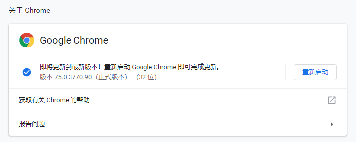

# 网络数据采集

# 第五章 RIA网站数据爬取

- 讲师姓名：
- 授课时间：
- 共32课时，第19-22课时

## 1 课前引导与上节回顾

前面介绍了爬取RIA网站的一些前置基础知识。下面，将介绍使用网络爬虫爬取RIA网站信息的具体方法。


## 2 本节课程主要内容

内容列表：
- 本节目标
- RIA网站的技术构成
- 使用Selenium爬取RIA网站信息
- 本节总结
- 课后练习

### 2.1 本节目标

- 掌握RIA型网站的技术构成，重点把握AJAX的技术特点；
- 掌握Selenium工具的使用方法，能够使用这一工具获取ajax驱动网页的页面信息。

### 2.2 RIA网站的技术构成


#### 2.2.1 知识讲解

这一讲，我们介绍RIA网站数据爬取技术。
	
RIA是Rich Internet Applications的缩写，指富互联网应用程序。RIA是一种特殊的Web应用程序，其用户界面比第一代和第二代Web应用程序具有更丰富的功能。它看起来和感觉更像桌面应用程序。

为了实现这些更高级的用户界面，RIA网站通常使用JavaScript、Flash、Google Web Toolkit、JavaFX或Silverlight在浏览器中执行。

**目前，HTML5+JavaScript +CSS3+JavaScript Frameworks是构建RIA前端的主流技术。**

常见的JavaScript框架有：
- JQuery
- AngularJS
- D3
- Sencha EXT-JS
- SmartClient
- Dart等。

例如：大家经常浏览的淘宝、京东、豆瓣等网站都应用了这一类技术。在我们的课程中，并不准备对这些技术进行逐一讨论，而是仅考虑与网络爬取相关的一部分技术构成。

在爬取RIA网页时，最大的问题在于：**RIA在加载数据时往往采用异步加载XML或JSON实现数据更新，而页面的URL并不改变。**

这使得**之前介绍的网络爬虫程序无法通过遍历URL链接来获取新数据，我们需要与以往不同的方法来应对这一变化**。

接下来，我们将首先介绍AJAX原理，而后介绍爬取基于AJAX的RIA网页的方法。


---

AJAX，指异步JavaScript 和 XML，它是一种用于创建快速动态网页的技术。通过在后台与服务器进行少量数据交换，AJAX 可以使网页实现异步更新。

这意味着可以在不重新加载整个网页的情况下，对网页的某部分进行更新。有很多使用 AJAX 的应用程序案例：
- 新浪微博
- Google 地图
- 京东
- 淘宝等

AJAX的工作原理如下图所示：


步骤解释如下：

1. 在浏览器端，当用户浏览一个RIA页面时，通过鼠标或键盘激发一个JavaScript事件；
2. 浏览器会生成一个XMLHttpRequest对象，然后将这个请求对象通过互联网送给服务器；
3. 在服务器端，服务器收到XMLHttpRequest对象后，会根据请求生成一个响应，并通过网络传递给浏览器。
4. 浏览器收到服务器响应后，会使用Javascript处理反馈数据，然后更新页面内容。

我们可以讲 AJAX 与 非AJAX 进行区别：


我们可以在很多网页的源文件中看到如下图所示的类似代码（[以w3cschool中的Ajax为例](https://www.w3school.com.cn/ajax/ajax_example.asp)）：

```
var xmlhttp;
if (window.XMLHttpRequest){
// code for IE7+, Firefox, Chrome, Opera, Safari
xmlhttp=new XMLHttpRequest();
}
else{// code for IE6, IE5
    xmlhttp=new ActiveXObject("Microsoft.XMLHTTP");
}

```

这就是在生成用于异步加载数据的XMLHttpRequest对象。在发送请求时，通常会使用下表所示的OPEN方法和send方法。


下面的代码是发送XMLHttpRequest对象xmlhttp的例子：

```
xmlhttp.open("GET","test1.txt",true);
xmlhttp.send();

```

服务器响应内容，可以通过XMLHttpRequest 对象的 responseText 或 responseXML 属性获取，例如下列代码是读取非XML类型响应的一个示例:

```
document.getElementById("myDiv").innerHTML=xmlhttp.responseText;
```
如果响应内容以XML格式返回，则需要使用responseXML属性。例如，要解析服务器返回的 books.xml 文件，可以使用下列代码：

```
xmlDoc=xmlhttp.responseXML;
txt="";
x=xmlDoc.getElementsByTagName("ARTIST");
for (i=0;i<x.length;i++)
{
  txt=txt + x[i].childNodes[0].nodeValue + "<br />";
}
document.getElementById("myDiv").innerHTML=txt;

```

当请求被发送到服务器时，需要执行一些基于响应的任务。每当 readyState 改变时，就会触发 onreadystatechange 事件。readyState 属性存有 XMLHttpRequest 的状态信息。

下图所示的是 XMLHttpRequest 对象的三个重要的属性：


上面这些知识，是我们利用网络爬虫爬取RIA网站前需要了解的基础知识，希望同学们能够通过自学了解更多的 AJAX技术细节，这将有利于我们爬取RIA型的网页。

#### 2.2.2 案例与应用

下面的例子是使用Ajax的网站实例。


点击按钮后：


**AJAX 实例解释**

上面的 AJAX 应用程序包含一个 div 和一个按钮。

div 部分用于显示来自服务器的信息。当按钮被点击时，它负责调用名为 loadXMLDoc() 的函数：


接下来，在页面的 head 部分添加一个 script 标签。该标签中包含了这个 loadXMLDoc() 函数：
    


中间的代码如下：

```
function loadXMLDoc()
{
    var xmlhttp;
    if (window.XMLHttpRequest)
    {// code for IE7+, Firefox, Chrome, Opera, Safari
       xmlhttp=new XMLHttpRequest();
    }
    else
    {// code for IE6, IE5
       xmlhttp=new ActiveXObject("Microsoft.XMLHTTP");
    }
    xmlhttp.onreadystatechange=function()
    {
       if (xmlhttp.readyState==4 && xmlhttp.status==200)
       {
          document.getElementById("myDiv").innerHTML=xmlhttp.responseText;
       }
    }
    xmlhttp.open("GET","/ajax/test1.txt",true);
    xmlhttp.send();
}

```

#### 2.2.3 模块练习与答案

见习题集。

#### 2.2.4 内容小结

本节主要介绍了RIA的概念和技术组成要素。

需要重点把握的是当前主流技术AJAX的工作原理：

1. 在浏览器端，当用户浏览一个RIA页面时，通过鼠标或键盘激发一个JavaScript事件；
2. 浏览器会生成一个XMLHttpRequest对象，然后将这个请求对象通过互联网送给服务器；
3. 在服务器端，服务器收到XMLHttpRequest对象后，会根据请求生成一个响应，并通过网络传递给浏览器。
4. 浏览器收到服务器响应后，会使用Javascript处理反馈数据，然后更新页面内容。

掌握这些知识有助于我们理解RIA网站的数据加载过程，有利于设计网络爬虫程序获取相关兴趣内容。

### 2.3 使用之前所学爬取 AJAX 页面

下面我们以爬取某条网站中新闻为例，学习获取ajax返回内容的方法。

首先我们尝试使用以前学习的方法来获取该网站内容。我们以爬取某条中的搜索内容为例。

具体内容参考实验案例。

### 2.4 使用Selenium爬取RIA网站信息

#### 2.4.1 知识讲解

在这里，我们采用模拟人操作行为的方法来爬取各类Javascript Action 或AJAX 加载的数据。

换句话说，我们并不是直接与JavaScript打交道，而是通过操纵鼠标和键盘，模拟人使用浏览器来触发Javascript Action，当页面数据被异步加载后，直接从页面内容中读取所需数据。这样就避免了运行各类JavaScript Action的麻烦。

为了操作键盘和鼠标，需要借助 selenium 库中的方法。

Selenium是一个Web的自动化测试工具，最初是为网站自动化测试而开发的，类型像我们玩游戏用的按键精灵，可以按指定的命令自动操作，不同是Selenium 可以直接运行在浏览器上，它支持所有主流的浏览器（包括PhantomJS这些无界面的浏览器）。


Selenium 可以根据我们的指令，让浏览器自动加载页面，获取需要的数据，甚至页面截屏，或者判断网站上某些动作是否发生。由于Selenium 自己不带浏览器，所以使用它进行浏览器操作时，需要将它与浏览器进行结合。Selenium可以与Chrome、IE、Firefox等多款浏览器有机结合，但需要事先安装相关库和程序。

下面介绍安装过程。

方法很简单，大家打开Anaconda 命令行，然后使用第三方管理器 pip用命令安装，具体命令如下：

```pip install selenium```

为了使Selenium能与浏览器有机结合起来，我们需要安装一个驱动浏览器的程序。

下面我们以chrome驱动为例介绍安装过程。

首先，请打开你自己的chrome浏览器，选择设置->帮助->关于chrome,查看自己浏览器的版本，例如我的chorme浏览器版本为75.0.3770.90。



然后，访问 http://npm.taobao.org/mirrors/chromedriver/ 这个链接，从中找到适配版本的chromedriver，并选择适合自己系统的压缩包进行下载，例如选择 chromedriver_win32.zip. 


下载、解压后，把其中的chromedriver.exe放到python爬虫所在目录下和chrome浏览器的安装目录下（windows中chrome的默认安装路径是C:\Program Files (x86)\Google\Chrome\Application）。这样我们就建立了使用selenium操作浏览器的驱动程序。

#### 2.4.2 案例与应用

下面，我们通过实际的代码操作进行详细介绍。

**先睹为快**

安装好基础运行环境后，我们使用jupyter notebook建立一个交互式python编程环境，然后在其中一个cell中，键入如下代码。

这段代码执行后，会打开百度网站，并键入selenium关键字，然后执行查询。我们可以从电脑中新打开的chrome页面观察到这一切。


```python
from selenium import webdriver
from selenium.common.exceptions import TimeoutException
from selenium.webdriver.support.ui import WebDriverWait # available since 2.4.0
from selenium.webdriver.support import expected_conditions as EC # available since 2.26.0
import time
# Create a new instance of the  driver
driver = webdriver.Chrome()

# go to the  home page
driver.get("http://www.baidu.com")

print(driver.title)

inputElement = driver.find_element_by_id("kw")

# type in the search
inputElement.send_keys("selenium")

# submit the form (although google automatically searches now without submitting)
inputElement.submit()
#或者使用：driver.find_element_by_id("su").click()

try:
    # we have to wait for the page to refresh, the last thing that seems to be updated is the title
    WebDriverWait(driver, 10).until(EC.title_contains("selenium"))

    # You should see "北京! - 百度 一下"
    print(driver.title)
    time.sleep(10)
finally:
    driver.quit()
```
结果为：

```
    百度一下，你就知道
    selenium_百度搜索
```    

下图是上面代码执行后的结果：


下面的代码演示了使用selenium解析文档中所有标题（title）内容:

**获取页面**

在上面的例子中，有很多细节，首先要做的是获取页面。为了使用WebDriver导航到页面，常规方法是调用“get”：

```
driver.get("http://www.baidu.com");
```
**定位UI元素（WebElements）**

WebDriver中的定位元素可以在WebDriver实例本身或WebElement上完成。每个语言绑定都公开“查找元素”和“查找元素”方法。前者返回与查询匹配的WebElement对象，如果找不到这样的元素，则抛出异常。后者返回WebElements列表，如果没有DOM元素与查询匹配，则可能为空。

“查找”方法采用名为“By”的定位器或查询对象。例如：

- By ID

下面的例子用于找到百度的关键字输入框：


```python
driver.get("http://www.baidu.com")

inputElement = driver.find_element_by_id("kw")

### 2.5 或者

from selenium.webdriver.common.by import By
element = driver.find_element(by=By.ID, value="kw")
```

- By Class Name

在这种情况下，“class”是指DOM元素上的属性。通常在实际使用中有许多具有相同类名的DOM元素，因此常用这个方法找到多个相同的元素。


```python
from selenium import webdriver
from selenium.common.exceptions import TimeoutException
from selenium.webdriver.support.ui import WebDriverWait # available since 2.4.0
from selenium.webdriver.support import expected_conditions as EC # available since 2.26.0
import time
# Create a new instance of the Firefox driver
driver = webdriver.Chrome()

# go to the google home page
driver.get("http://www.baidu.com")

# the page is ajaxy so the title is originally this:
print(driver.title)

# find the element that's name attribute is q (the wdgoogle search box)
inputElement = driver.find_element_by_id("kw")

# type in the search
inputElement.send_keys("selenium")

# submit the form (although google automatically searches now without submitting)
inputElement.submit()
#或者使用：driver.find_element_by_id("su").click()

try:
    # we have to wait for the page to refresh, the last thing that seems to be updated is the title
    WebDriverWait(driver, 10).until(EC.title_contains("selenium"))

    ret = driver.find_elements_by_class_name("t")

    ### 或者

    from selenium.webdriver.common.by import By
    ret = driver.find_elements(By.CLASS_NAME, "t")
    for r in ret:
        print(r.text)
finally:
    driver.quit()
    

```
结果：
```
    百度一下，你就知道
    selenium 80万学员选择
    北京 官方2019selenium 培训丨selenium 从入门到精通...
    Selenium - Web Browser Automation
    python爬虫从入门到放弃(八)之 Selenium库的使用 - pytho..._博客园
    Selenium(浏览器自动化测试框架)_百度百科
    以后再有人问你selenium是什么,你就把这篇文章给他 - T..._CSDN博客
    selenium中文网 | selenium安装、selenium使用、selenium中文、...
    selenium_百度翻译
    Selenium Documentation — Selenium Documentation
    selenium - 随笔分类 - 虫师 - 博客园
    selenium的基本使用和常用语法 - weixin_41931602的博客 - CSDN博客
    Selenium_百度百科
    selenium_小白到全栈的进阶之选
    selenium51testing全新系统课程上线_更多详情课程
```  

- By Tag Name

还可以使用DOM 标签名来定位元素。

```
frame = driver.find_element_by_tag_name("iframe")


from selenium.webdriver.common.by import By
frame = driver.find_element(By.TAG_NAME, "iframe")
```

- By Name

还可以使用元素标记内的属性name的赋值来查找：

```
cheese = driver.find_element_by_name("cheese")

or

from selenium.webdriver.common.by import By
cheese = driver.find_element(By.NAME, "cheese")
```

- By CSS

使用CSS选择器也可以定位元素。

```
cheese = driver.find_element_by_css_selector("#food span.dairy.aged")

or

from selenium.webdriver.common.by import By
cheese = driver.find_element(By.CSS_SELECTOR, "#food span.dairy.aged")
```

- By XPath

使用XPATH定位是更为一般性的方法，事实上之前介绍的方法都是基于XPATH而形成的。

```
inputs = driver.find_elements_by_xpath("//input")

or

from selenium.webdriver.common.by import By
inputs = driver.find_elements(By.XPATH, "//input")
```


**鼠标动作链**

有些时候，我们需要再页面上模拟一些鼠标操作，比如双击、右击、拖拽甚至按住不动等，我们可以通过导入 ActionChains 类来做到：


```python
#导入 ActionChains 类
from selenium.webdriver import ActionChains

# 鼠标移动到 ac 位置
ac = driver.find_element_by_xpath('element')
ActionChains(driver).move_to_element(ac).perform()


# 在 ac 位置单击
ac = driver.find_element_by_xpath("elementA")
ActionChains(driver).move_to_element(ac).click(ac).perform()

# 在 ac 位置双击
ac = driver.find_element_by_xpath("elementB")
ActionChains(driver).move_to_element(ac).double_click(ac).perform()

# 在 ac 位置右击
ac = driver.find_element_by_xpath("elementC")
ActionChains(driver).move_to_element(ac).context_click(ac).perform()

# 在 ac 位置左键单击hold住
ac = driver.find_element_by_xpath('elementF')
ActionChains(driver).move_to_element(ac).click_and_hold(ac).perform()

# 将 ac1 拖拽到 ac2 位置
ac1 = driver.find_element_by_xpath('elementD')
ac2 = driver.find_element_by_xpath('elementE')
ActionChains(driver).drag_and_drop(ac1, ac2).perform()
```

**执行 JavaScript**

我们可以使用selenium执行自定义的JavaScript脚本，来查找所需的页面元素。

下面的例子显示了使用方法：

```
element = driver.execute_script("return $('.cheese')[0]")
```

下面的例子用于找到页面中所有的输入框：


```python
from selenium import webdriver
from selenium.common.exceptions import TimeoutException
from selenium.webdriver.support.ui import WebDriverWait # available since 2.4.0
from selenium.webdriver.support import expected_conditions as EC # available since 2.26.0
import time
# Create a new instance of the Firefox driver
driver = webdriver.Chrome()

# go to the google home page
driver.get("https://ssl.zc.qq.com/v3/index-chs.html")

print(driver.title)

try:
    # 显示等待10s，直到出现“QQ注册”，否则返回超时错误。
    WebDriverWait(driver, 10).until(EC.title_contains("QQ注册"))


    inputs = driver.execute_script("var inputs = []; inputs.push(document.getElementsByTagName(\"input\")); return inputs;")

    for i in inputs[0]:
        print(i.get_attribute("id"))

except Exception as e:
    print(e)
finally:
    driver.quit()
```
结果：
```
    QQ注册
    lianghao-key
    nickname
    password
    phone
    
    code
    get_acc
    agree
    
```
**获取文本值**

在爬取网页时，获取其中的文本内容是我们一贯的需求。使用selenium获取text内容时，可以使用text属性。

这一点在之前的例子中已经演示过。

```
element = driver.find_element_by_id("element_id")
element.text
```

**填充表单**

之前的例子已经展示了如何使用selenium在文本框中键入文本，那么如果要勾选checkbox 或 radio，又或者是其它html可输入元素时应该如何做呢？


我们已经知道了怎样向文本框中输入文字，但是有时候我们会碰到```<select> </select>```标签的下拉框。直接点击下拉框中的选项不一定可行。

```
<select id="status" class="form-control valid" onchange="" name="status">
    <option value=""></option>
    <option value="0">未审核</option>
    <option value="1">初审通过</option>
    <option value="2">复审通过</option>
    <option value="3">审核不通过</option>
</select>
```

Selenium专门提供了Select类来处理下拉框。 其实 WebDriver 中提供了一个叫 Select 的方法，可以帮助我们完成这些事情：


```python
# 导入 Select 类
from selenium.webdriver.support.ui import Select

# 找到 name 的选项卡
select = Select(driver.find_element_by_name('status'))

# 
select.select_by_index(1)
select.select_by_value("0")
select.select_by_visible_text(u"未审核")
```

以上是三种选择下拉框的方式，它可以根据索引来选择，可以根据值来选择，可以根据文字来选择。注意：

- index 索引从 0 开始
- value是option标签的一个属性值，并不是显示在下拉框中的值
- visible_text是在option标签文本的值，是显示在下拉框的值
- 全部取消选择怎么办呢？很简单:

> select.deselect_all()


**在窗口和 frame框架间切换**

有的Web应用中包含多个frame框架，或者会弹出新的窗口。

WebDriver支持在这些frames和windows间进行切换。主要应用的方法是“switch”。
```
driver.switch_to.window("windowName")
```

上面的语句要求我们键入窗口的名字，这个名字如何获得呢？

- 一种方法是在原网页中查找类似下文的windows名

```
<a href="somewhere.html" target="windowName">Click here to open a new window</a>
```

- 另一种方法是，使用window handle来循环切换，即switchTo().window()：

```
for handle in driver.window_handles:
    driver.switch_to.window(handle)
```

同样，可以在frame间切换
```
driver.switch_to.frame("frameName")
```

下面给出一个实际例子：

```python
from selenium import webdriver
from selenium.common.exceptions import TimeoutException
from selenium.webdriver.support.ui import WebDriverWait # available since 2.4.0
from selenium.webdriver.support import expected_conditions as EC # available since 2.26.0
import time
from selenium.webdriver.common.by import By

try:
    driver = webdriver.Chrome()

    driver.get("http://www.xuetangx.com/")

    print(driver.title)
    # 显示等待10s，直到出现“QQ注册”，否则返回超时错误。
    WebDriverWait(driver, 10).until(EC.title_contains("学堂在线-国家精品课程在线学习平台"))
    
    loginlink = driver.find_element_by_id("header_login")
    loginlink.click()
    
    #等待登录modal出现
    WebDriverWait(driver, 10).until(EC.visibility_of(driver.find_element_by_id('g_modal')))
    
    driver.find_element_by_xpath("//a[@data-description=\"TOLOGIN#WEIBO\"]").click()
    
    # 等待微博登录界面出现
    WebDriverWait(driver, 10).until(EC.new_window_is_opened)

    
    for handle in driver.window_handles:
        driver.switch_to.window(handle)
        if driver.title.find("网站连接") > -1:
            print(driver.title)
            WebDriverWait(driver, 10).until(EC.title_contains("网站连接"))
            weibo_username = WebDriverWait(driver, 10).until(EC.presence_of_element_located((By.XPATH, '//input[@id="userId"]')))
            weibo_username.send_keys('13611112222')      
            
            weibo_passwd = WebDriverWait(driver, 10).until(EC.presence_of_element_located((By.XPATH, '//input[@id="passwd"]')))
            weibo_passwd.send_keys('asdfghjkl12345')
            
            weibo_submit = WebDriverWait(driver, 10).until(EC.presence_of_element_located((By.XPATH, "//a[@class=\"WB_btn_login formbtn_01\"]")))
            weibo_submit.click()
            
            time.sleep(10)
            break
except Exception as e:
    print(e)
finally:
    driver.quit()
```
结果如下

```
    学堂在线-国家精品课程在线学习平台
    网站连接 - 学堂在线xuetangX.com
```    

**处理弹出的对话框**

例如对于弹出的alert对话框，可以用swithTo进行切换：

```
alert = driver.switch_to.alert
```

返回值为当前alert对象。使用这个对象，你可以接收、忽略、读取他的内容，甚至进入一个命令行。

**实现网站导航：历史和定位**

在成功打开一个页面后，可以使用WebDriver的下列方法，进行如浏览器“前进”或“后退”工作：

- forword()
- back()

```
driver.get("http://www.example.com") 
driver.forward()
driver.back()

```

**Cookies**

登录、浏览网站后，服务设置的cookies往往是需要关注的信息，这些信息有关于用户状态和会话状态。

```python
from selenium import webdriver
from selenium.common.exceptions import TimeoutException
from selenium.webdriver.support.ui import WebDriverWait # available since 2.4.0
from selenium.webdriver.support import expected_conditions as EC # available since 2.26.0
import time
from selenium.webdriver.common.by import By

try:
    driver = webdriver.Chrome()

    driver.get("http://www.xuetangx.com")

    # Now set the cookie. Here's one for the entire domain
    # the cookie name here is 'key' and its value is 'value'
    driver.add_cookie(dict(csrftoken='p3SMD8WJ8AJ8pxNPDMXZt87PIobjO4Ui',
        gr_user_id='cd42ff56-c4bc-4f78-8838-88d13e01f14d',
        UM_distinctid='16c08bc03dd3d8-0fa27030f94d4d-3a65460c-100200-16c08bc03de108',
        ajs_group_id='null',
        ajs_anonymous_id='%226fe4d6ba-3a8a-4d5d-8d78-fd6693802fac%22',
        user_id='12491595',
        ajs_user_id='%2212491595%22',
        aliyungf_tc='AQAAAN9ktEqE9QsACr1aZ/gBSpQzA7kE',
        sessionid='7436a29e46eef0c9f07e8ab6c8d8b868',
        CNZZDATA1261596198='1379074737-1563513456-null%7C1563769205',
        frontendUserReferrer='http://www.xuetangx.com/',
        frontendUserTrack='52945',
        _log_user_id='eb64651356bf6a69adcf99519e8346ad',
        sharesessionid='7436a29e46eef0c9f07e8ab6c8d8b868',
        frontendUserTrackPrev='52945',
        sequence='16'))

    # And now output all the available cookies for the current URL
    for cookie in driver.get_cookies():
        print(cookie)


    driver.delete_all_cookies()
except Exception as e:
    print(e)
finally:
    driver.quit()
```
结果为：
```
    Message: invalid argument: missing 'name'
      (Session info: chrome=75.0.3770.142)
```    
    

**改变 User Agent**

```
profile = webdriver.FirefoxProfile()
profile.set_preference("general.useragent.override", "some UA string")
driver = webdriver.Firefox(profile)
```

**鼠标Drag And Drop**

```
from selenium.webdriver.common.action_chains import ActionChains
element = driver.find_element_by_name("source")
target =  driver.find_element_by_name("target")

ActionChains(driver).drag_and_drop(element, target).perform()
```

**指定WebDriver 的驱动**

使用Selenium时，有下列可选择的驱动

- Firefox Driver

指定方法：

```
driver = webdriver.Firefox()

# 定制firefox 特性，可以使用profile文件定义，然后用下列方法加载：
profile = webdriver.FirefoxProfile()
profile.native_events_enabled = True
driver = webdriver.Firefox(profile)
```

- HtmlUnit Driver

指定方法：

```
driver = webdriver.Remote("http://localhost:4444/wd/hub", webdriver.DesiredCapabilities.HTMLUNIT.copy())
# 为了使之能够允许JavaScript，需要执行下列语句
HtmlUnitDriver driver = new HtmlUnitDriver(true);
```

- Internet Explorer Driver

```
driver = webdriver.Ie()
```

- ChromeDriver Driver

```
driver = webdriver.Chrome()
```

- Opera Driver
- iOS Driver
- Android Driver

**页面等待**

注意：这是非常重要的一部分！！

现在的网页越来越多采用了 Ajax 技术，这样程序便不能确定何时某个元素完全加载出来了。如果实际页面等待时间过长导致某个dom元素还没出来，但是你的代码直接使用了这个WebElement，那么就会抛出NullPointer的异常。

为了避免这种元素定位困难而且会提高产生 ElementNotVisibleException 的概率。所以 Selenium 提供了两种等待方式，一种是隐式等待，一种是显式等待。

隐式等待是等待特定的时间，显式等待是指定某一条件直到这个条件成立时继续执行。

根据几个因素，包括操作系统/浏览器组合，WebDriver可能会也可能不会等待页面加载。在某些情况下，WebDriver可能会在页面完成甚至开始加载之前返回控件。为确保稳健性，您需要使用显式和隐式等待等待页面中存在的元素 。

**显示等待**

显式等待是您定义的代码，用于在继续执行代码之前等待某个条件发生。最糟糕的情况是Thread.sleep()，将条件设置为等待的确切时间段。有一些便利方法可以帮助您编写只需要等待的代码。 WebDriverWait结合使用ExpectedCondition是一种方法。

这会尝试在10秒内找到并返回元素。如果在此之后没有找到任何内容，则抛出``timesoutException``。默认情况下，每500毫秒WebDriverWait调用ExpectedCondition一次，直到成功返回。ExpectedCondition函数类型的成功返回值是布尔值true或非null对象。


```python
from selenium import webdriver
from selenium.webdriver.common.by import By
from selenium.webdriver.support.ui import WebDriverWait # available since 2.4.0
from selenium.webdriver.support import expected_conditions as EC # available since 2.26.0
import time
ff = webdriver.Chrome()
ff.get("https://www.kaggle.com/")
try:
    element = WebDriverWait(ff, 10).until(EC.presence_of_element_located((By.ID, "site-header-kernels__a")))
    print(element.tag_name)
    print(element.text)
    time.sleep(3)
finally:
    ff.quit()
```
结果为：
```
    a
    Kernels
```   

**Selenium 中内置的异常条件**

在自动化Web浏览器时，经常会遇到一些常见情况。下面列出了几个使用这些条件的例子。Selenium内置了许多常见的异常，因此不必ExpectedCondition自己编写类或为它们创建自己的实用程序包，下面的帮助显示了已有的情况：

- alert_is_present
- element_located_selection_state_to_be
- element_located_to_be_selected
- element_selection_state_to_be
- element_to_be_clickable
- element_to_be_selected
- frame_to_be_available_and_switch_to_it
- invisibility_of_element_located
- invisibility_of_element
- new_window_is_opened
- number_of_windows_to_be
- presence_of_all_elements_located
- presence_of_element_located
- staleness_of
- text_to_be_present_in_element
- text_to_be_present_in_element_value
- title_contains
- title_is
- url_changes
- url_contains
- url_matches
- url_to_be
- visibility_of
- visibility_of_all_elements_located
- visibility_of_any_elements_located
- visibility_of_element_located


```python
import selenium.webdriver.support.expected_conditions as EC

help(selenium.webdriver.support.expected_conditions)

```

**隐式等待**

隐式等待是指在尝试查找一个或多个元素（如果它们不是立即可用）时，WebDriver轮询DOM一段时间。默认设置为0。设置后，将为WebDriver对象实例的生命周期设置隐式等待。


```python
from selenium import webdriver

ff = webdriver.Chrome()
ff.implicitly_wait(10) # seconds
ff.get("http://somedomain/url_that_delays_loading")
myDynamicElement = ff.find_element_by_id("myDynamicElement")
```


```python
"""selenium 入门示例"""
import time
from selenium import webdriver

# 要想调用键盘按键操作需要引入keys包
from selenium.webdriver.common.keys import Keys

# 调用环境变量指定的PhantomJS浏览器创建浏览器对象
#chromeOptions = webdriver.ChromeOptions()
#chromeOptions.add_argument("headless")
#driver = webdriver.Chrome(chrome_options=chromeOptions)
driver = webdriver.Chrome()
# 下面方法被废止了，单还可以用
# driver = webdriver.PhantomJS(executable_path='./phantomjs/bin/phantomjs.exe')

# get方法会一直等到页面被完全加载，然后才会继续程序，通常测试会在这里选择 time.sleep(2)
driver.get("https://www.baidu.com/")
time.sleep(3)

# 生成当前页面快照并保存
driver.save_screenshot("baidu.png")

# id="kw"是百度搜索输入框，输入字符串"长城"
driver.find_element_by_id("kw").send_keys(u"长城")

# id="su"是百度搜索按钮，click() 是模拟点击
driver.find_element_by_id("su").click()
time.sleep(2)
# 获取新的页面快照
driver.save_screenshot("长城.png")

# 打印网页渲染后的源代码
print(driver.page_source[:1000])

# 获取当前页面Cookie
print(driver.get_cookies())

# ctrl+a 全选输入框内容
driver.find_element_by_id("kw").send_keys(Keys.CONTROL,'a')

# ctrl+x 剪切输入框内容
driver.find_element_by_id("kw").send_keys(Keys.CONTROL,'x')

# 输入框重新输入内容
driver.find_element_by_id("kw").send_keys("itcast")

# 模拟Enter回车键
driver.find_element_by_id("su").send_keys(Keys.RETURN)

# 清除输入框内容
driver.find_element_by_id("kw").clear()

# 生成新的页面快照
driver.save_screenshot("itcast.png")

# 获取当前url
print(driver.current_url)

# 关闭当前页面，如果只有一个页面，会关闭浏览器
# driver.close()

# 关闭浏览器
time.sleep(20)
driver.quit()
```
结果如下：
```
    <html><head><script type="text/javascript" charset="gb2312" src="//www.baidu.com/cache/aladdin/ui/tabs5/tabs5.js?v=20170208" data-for="A.ui"></script><script charset="utf-8" async="" src="https://ss0.bdstatic.com/-0U0bnSm1A5BphGlnYG/tam-ogel/a8707a09-4a93-403c-a661-53146c99a08e.js"></script><script charset="utf-8" async="" src="https://ecmb.bdimg.com/tam-ogel/1b75c740-2522-4324-9d2b-44154ee55093.js"></script>
        
        <meta http-equiv="content-type" content="text/html;charset=utf-8"><style data-for="result" id="css_result" type="text/css">body{color:#333;background:#fff;padding:6px 0 0;margin:0;position:relative;min-width:900px}body,th,td,.p1,.p2{font-family:arial}p,form,ol,ul,li,dl,dt,dd,h3{margin:0;padding:0;list-style:none}input{padding-top:0;padding-bottom:0;-moz-box-sizing:border-box;-webkit-box-sizing:border-box;box-sizing:border-box}table,img{border:0}td{font-size:9pt;line-height:18px}em{font-style:normal;color:#c00}a em{text-decoration:underline}cite{font-style:normal;color:gre
    [{'domain': 'www.baidu.com', 'expiry': 1595056910, 'httpOnly': False, 'name': 'COOKIE_SESSION', 'path': '/', 'secure': False, 'value': '0_0_1_0_0_1_0_0_0_1_3_0_0_0_0_0_0_0_1563520913%7C1%230_0_1563520913%7C1'}, {'domain': 'www.baidu.com', 'httpOnly': False, 'name': 'BDSVRTM', 'path': '/', 'secure': False, 'value': '140'}, {'domain': 'www.baidu.com', 'expiry': 1563523501, 'httpOnly': False, 'name': 'H_PS_645EC', 'path': '/', 'secure': False, 'value': '4816qXVk6srP9Gioe4VSQ1h0j%2BzWijrQcT8KLGQKbpfMhInM%2BCtCCnzklDk'}, {'domain': 'baidu.com', 'httpOnly': False, 'name': 'PSINO', 'path': '/', 'secure': False, 'value': '1'}, {'domain': 'baidu.com', 'expiry': 1563607310.022979, 'httpOnly': False, 'name': 'BDORZ', 'path': '/', 'secure': False, 'value': 'B490B5EBF6F3CD402E515D22BCDA1598'}, {'domain': 'baidu.com', 'httpOnly': False, 'name': 'delPer', 'path': '/', 'secure': False, 'value': '0'}, {'domain': 'www.baidu.com', 'httpOnly': False, 'name': 'BD_CK_SAM', 'path': '/', 'secure': False, 'value': '1'}, {'domain': 'www.baidu.com', 'httpOnly': False, 'name': 'BD_HOME', 'path': '/', 'secure': False, 'value': '0'}, {'domain': 'baidu.com', 'expiry': 3711004550.907747, 'httpOnly': False, 'name': 'PSTM', 'path': '/', 'secure': False, 'value': '1563520908'}, {'domain': 'www.baidu.com', 'expiry': 1564384904, 'httpOnly': False, 'name': 'BD_UPN', 'path': '/', 'secure': False, 'value': '12314753'}, {'domain': 'baidu.com', 'expiry': 3711004550.907693, 'httpOnly': False, 'name': 'BIDUPSID', 'path': '/', 'secure': False, 'value': '247079FE3CB7124E810BC64234C5EFC1'}, {'domain': 'baidu.com', 'httpOnly': False, 'name': 'H_PS_PSSID', 'path': '/', 'secure': False, 'value': '1440_21106_18559_29523_29521_28519_29099_28833_29220_26350'}, {'domain': 'baidu.com', 'expiry': 3711004550.907622, 'httpOnly': False, 'name': 'BAIDUID', 'path': '/', 'secure': False, 'value': '247079FE3CB7124E810BC64234C5EFC1:FG=1'}]
    https://www.baidu.com/s?ie=utf-8&f=8&rsv_bp=1&rsv_idx=1&tn=baidu&wd=itcast&oq=%25E9%2595%25BF%25E5%259F%258E&rsv_pq=ef7ff8fa00001ce0&rsv_t=4816qXVk6srP9Gioe4VSQ1h0j%2BzWijrQcT8KLGQKbpfMhInM%2BCtCCnzklDk&rqlang=cn&rsv_enter=0&rsv_dl=tb&inputT=231&rsv_sug3=9&rsv_sug1=2&rsv_sug7=001&rsv_sug4=232&rsv_sug=1
    
```

案例二：动态页面模拟点击

下面的例子中用到了python单元测试库unitest。Unitest is a Python language version of JUnit,封装了一些校验返回的结果方法和一些用例执行前的初始化操作。


```python
"""模拟滚动条滚动到底部"""

from selenium import webdriver
import time

driver = webdriver.Chrome()
driver.get("https://movie.douban.com/typerank?type_name=剧情&type=11&interval_id=100:90&action=")

# 向下滚动10000像素
js = "document.body.scrollTop=10000"
#js="var q=document.documentElement.scrollTop=10000"
time.sleep(3)

#查看页面快照
driver.save_screenshot("douban.png")

# 执行JS语句
driver.execute_script(js)
time.sleep(10)


#查看页面快照
driver.save_screenshot("newdouban.png")

#driver.quit()
```

#### 2.5.1 模块练习与答案

**练习**

作业1 淘宝商品比价

### 2.6 需求

- 获取淘宝搜索页面的信息，提取其中的商品名称和价格。
- 需要设置翻页

### 2.7 技术路线

综合使用前面所学的技术，例如requests、bs4、selenium等

### 2.8 程序设计

这个例子中，可以设计若干个功能函数，例如：
- fetch：获取URL指定的页面内容；
- parse：解析页面内容，查找所需信息；
- output：输出商品结果；
- main：调度函数，完成基本UI。


**答案**

```python
"""爬取淘宝网页，获取指定商品的比价信息列表"""
import requests
import re
 
def fetch(url):
    """
    功能: 用于根据参数url发起http request，访问指定网页。    
    
    参数：
        url：某个初始网页的URL
    
    返回：当响应码为200时返回HTTP Response对象；否则为None
        
    """
    headers = {
    'accept':'text/html,application/xhtml+xml,application/xml',
    'User-agent':'Mozilla/5.0 (Windows NT 10.0; WOW64) AppleWebKit/537.36 (KHTML, like Gecko) Chrome/69.0.3497.100 Safari/537.36',
    'cookie':'t=d016fa94babd2250eaff8a9498b118a2; cna=3dQxFOF5o3MCAS1N80+OQ9RM; v=0; cookie2=37762b60f6829a4dc0193c1fa56744fa; _tb_token_=0e7758fb7565; _m_h5_tk=eb49defdc350a31c834e7aa220b959b8_1540292680835; _m_h5_tk_enc=ac49058915beb661f460ed8f1c9f4202; hng=CN%7Czh-CN%7CCNY%7C156; thw=cn; unb=75965512; sg=m23; _l_g_=Ug%3D%3D; skt=928616aa5fa2bbb7; cookie1=BqJk9D7342ZkMXFfMykDvEYqmkiwE8r43rljzNeky5E%3D; csg=e56a1450; uc3=vt3=F8dByRmn8Tvmr6%2B3AeA%3D&id2=VASjULlFuZE%3D&nk2=DeSe0Q8ONA%3D%3D&lg2=UIHiLt3xD8xYTw%3D%3D; existShop=MTU0MDI4Mzk5OQ%3D%3D; tracknick=nchycom; lgc=nchycom; _cc_=UtASsssmfA%3D%3D; dnk=nchycom; _nk_=nchycom; cookie17=VASjULlFuZE%3D; tg=0; enc=z9qg0OeNSubO2nGWaKEA%2FuasjejLkVGYxRh1EkLqX6XSLoiWEBSMAAE0eX7T45F6fSfkmQb09WdC3gLEnn3IxQ%3D%3D; uc1=cookie16=VT5L2FSpNgq6fDudInPRgavC%2BQ%3D%3D&cookie21=U%2BGCWk%2F7p4mBoUyS4E9C&cookie15=Vq8l%2BKCLz3%2F65A%3D%3D&existShop=false&pas=0&cookie14=UoTYNkUdebPe%2BQ%3D%3D&tag=8&lng=zh_CN; mt=ci=120_1; JSESSIONID=32B49DB7295E05FF2833188C30514215; swfstore=226808; whl=-1%260%260%260; x=e%3D1%26p%3D*%26s%3D0%26c%3D0%26f%3D0%26g%3D0%26t%3D0%26__ll%3D-1%26_ato%3D0; isg=BImJ6O9SNvaJCMpjqv_nR8bimLUjfiievB5qRiv_KnCvcq2EVida2BngsBbhMRVA',
    }
    try:
        r = requests.get(url, headers = headers,timeout=30)
        r.raise_for_status()
        r.encoding = r.apparent_encoding
        print('    成功获取页面内容.')
        return r.text
    except:
        return None
     
def parse(recodlist, html):
    """
    功能：解析由参数html给定的HTML文档，利用正则表达式或XPath等方法从中找出价格、标题等信息。
    
    参数：
        html：待解析的HTML文档对象
        ilt：解析结果列表
        
    返回：None
    
    """
    try:
        plt = re.findall(r'\"view_price\"\:\"[\d\.]*\"',html)
        tlt = re.findall(r'\"raw_title\"\:\".*?\"',html)
        for i in range(len(plt)):
            price = eval(plt[i].split(':')[1])
            title = eval(tlt[i].split(':')[1])
            recodlist.append([price , title])
        print('    成功解析页面内容.')
    except:
        pass

def output(recodlist):
    """
    功能：根据参数recodlist中条目，在命令行中逐行输出内容
    参数：
        recordlist：解析后得到的内容列表。
    返回：None
    """
    # 设定输出字符串的格式
    recordfmt = "{:4}\t{:8}\t{:16}"
    print(recordfmt.format("序号", "价格", "商品名称"))
    count = 0
    for r in recodlist:
        count += 1
        print(recordfmt.format(count, r[0], r[1]))
         
def main():
    """
    功能：程序主函数，设定基本UI，调度各功能函数，完成淘宝网指定商品3页内信息的获取和比价。
    参数：None
    返回：None
    """
    goods = input('请输入要查找的淘宝网商品名称：')
    # 设定访问页面数量
    pages = 3
    start_url = 'https://s.taobao.com/search?q=' + goods
    recordlist = []
    
    for i in range(pages):
        try:
            url = start_url + '&s=' + str(44*i)
            print('开始访问URL:  %s' % url )
            html = fetch(url)
            parse(recordlist, html)
        except:
            continue
    print('======'*10)
    print('爬取与解析工作完成，结果如下：')
    output(recordlist)
    
if __name__ == '__main__':
    main()
```

#### 2.4.1 模块练习与答案

**练习**

作业2 股票信息获取

需求

- 获取 https://quote.eastmoney.com/stocklist.html 股票代码及其信息。
- 使用selenium完成数据获取。

技术路线

综合使用前面所学的技术，例如requests、bs4、selenium等。

程序设计

这个例子中，可以设计若干个功能函数，例如：

- fetchURL：获取URL指定的页面内容；
- getStockList：获取股票代码列表；
- getStockInfo：根据股票代码获取股票信息；
- output：输出商品结果；
- main：调度函数，完成基本UI。


```python
#CrawBaiduStocksB.py
import requests
from bs4 import BeautifulSoup
import traceback
import re
 
def fetchURL(url,code='uft-8'):
    """
    功能: 用于根据参数url发起http request，访问指定网页。    
    
    参数：
        url：某个初始网页的URL
    
    返回：当响应码为200时返回HTTP Response对象；否则为None
        
    """
    headers = {
        'accept':'text/html,application/xhtml+xml,application/xml',
        'User-agent':'Mozilla/5.0 (Windows NT 10.0; WOW64) AppleWebKit/537.36 (KHTML, like Gecko) Chrome/69.0.3497.100 Safari/537.36',
        'cookie':'t=d016fa94babd2250eaff8a9498b118a2; cna=3dQxFOF5o3MCAS1N80+OQ9RM; v=0; cookie2=37762b60f6829a4dc0193c1fa56744fa; _tb_token_=0e7758fb7565; _m_h5_tk=eb49defdc350a31c834e7aa220b959b8_1540292680835; _m_h5_tk_enc=ac49058915beb661f460ed8f1c9f4202; hng=CN%7Czh-CN%7CCNY%7C156; thw=cn; unb=75965512; sg=m23; _l_g_=Ug%3D%3D; skt=928616aa5fa2bbb7; cookie1=BqJk9D7342ZkMXFfMykDvEYqmkiwE8r43rljzNeky5E%3D; csg=e56a1450; uc3=vt3=F8dByRmn8Tvmr6%2B3AeA%3D&id2=VASjULlFuZE%3D&nk2=DeSe0Q8ONA%3D%3D&lg2=UIHiLt3xD8xYTw%3D%3D; existShop=MTU0MDI4Mzk5OQ%3D%3D; tracknick=nchycom; lgc=nchycom; _cc_=UtASsssmfA%3D%3D; dnk=nchycom; _nk_=nchycom; cookie17=VASjULlFuZE%3D; tg=0; enc=z9qg0OeNSubO2nGWaKEA%2FuasjejLkVGYxRh1EkLqX6XSLoiWEBSMAAE0eX7T45F6fSfkmQb09WdC3gLEnn3IxQ%3D%3D; uc1=cookie16=VT5L2FSpNgq6fDudInPRgavC%2BQ%3D%3D&cookie21=U%2BGCWk%2F7p4mBoUyS4E9C&cookie15=Vq8l%2BKCLz3%2F65A%3D%3D&existShop=false&pas=0&cookie14=UoTYNkUdebPe%2BQ%3D%3D&tag=8&lng=zh_CN; mt=ci=120_1; JSESSIONID=32B49DB7295E05FF2833188C30514215; swfstore=226808; whl=-1%260%260%260; x=e%3D1%26p%3D*%26s%3D0%26c%3D0%26f%3D0%26g%3D0%26t%3D0%26__ll%3D-1%26_ato%3D0; isg=BImJ6O9SNvaJCMpjqv_nR8bimLUjfiievB5qRiv_KnCvcq2EVida2BngsBbhMRVA',
    }
    try:
        r = requests.get(url)
        r.raise_for_status()
        r.encoding = code
        print('....股票代码页面%s获取成功.' % url)
        return r.text
    except:
        return None

def getStockList(html):
    """
    功能: 解析html提供的股票代码集，返回股票代码列表。    
    
    参数：
        html：某个包含大量股票代码的HTML文档
    
    返回：股票代码列表对象；否则为None

    """
    stocklist = []
    soup = BeautifulSoup(html, 'html.parser') 
    a = soup.find_all('a')
    for i in a:
        try:
            href = i.attrs['href']
            stocklist.append(re.findall(r"[sz][sh]\d{6}", href)[0])
            
        except:
            continue
    if stocklist:
        print('....股票代码列表解析成功.')
    else:
        print('....股票代码列表解析失败.')
    return stocklist

def getStockInfo(stocklist, stockinfoURL, filename):
    """
    功能: 对股票代码列表stocklist中条目，在stockinfoURL页面逐一查找信息，并将其存入文件filename。    
    
    参数：
        stocklist：股票代码列表；
        stockinfoURL：查询股票信息的url；
        filename：存放查询结果的文本文件。
    
    返回：None

    """
    count = 0
    for stock in stocklist:
        url = stockinfoURL + stock + ".html"
        html = fetchURL(url)
        try:
            if html is None:
                continue
            infoDict = {}
            soup = BeautifulSoup(html, 'html.parser')
            stockInfo = soup.find('div',attrs={'class':'stock-bets'})
 
            name = stockInfo.find_all(attrs={'class':'bets-name'})[0]
            infoDict.update({'股票名称': name.text.split()[0]})
             
            keyList = stockInfo.find_all('dt')
            valueList = stockInfo.find_all('dd')
            for i in range(len(keyList)):
                key = keyList[i].text
                val = valueList[i].text
                infoDict[key] = val
             
            with open(filename, 'a', encoding='utf-8') as f:
                f.write( str(infoDict) + '\n' )
                count = count + 1
                print("\r当前进度: {:.2f}%".format(count*100/len(stocklist)),end="")
        except:
            count = count + 1
            print("\r当前进度: {:.2f}%".format(count*100/len(stocklist)),end="")
            continue

def main():
    """
    功能：程序主函数，设定基本UI，调度各功能函数，完成淘宝网指定商品3页内信息的获取和比价。
    参数：None
    返回：None
    """
    #stock_list_url = 'https://quote.eastmoney.com/stocklist.html'
    stock_list_url = 'http://quote.eastmoney.com/stocklist.html'
    stock_info_url = 'https://gupiao.baidu.com/stock/'
    output_file = 'BaiduStockInfo.txt'
    
    print('尝试获取quote.eastmoney.com网站股票代码列表...')
    html = fetchURL(stock_list_url, 'gb2312')
    print('....尝试解析列表内容')
    stocklist = getStockList(html)
    #print(stocklist)
    getStockInfo(stocklist, stock_info_url, output_file)
    
if __name__ == '__main__':
    main()
```


#### 2.8.1 内容小结

## 3 本节总结

## 4 课后练习
