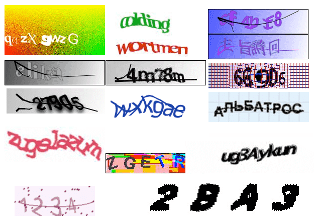
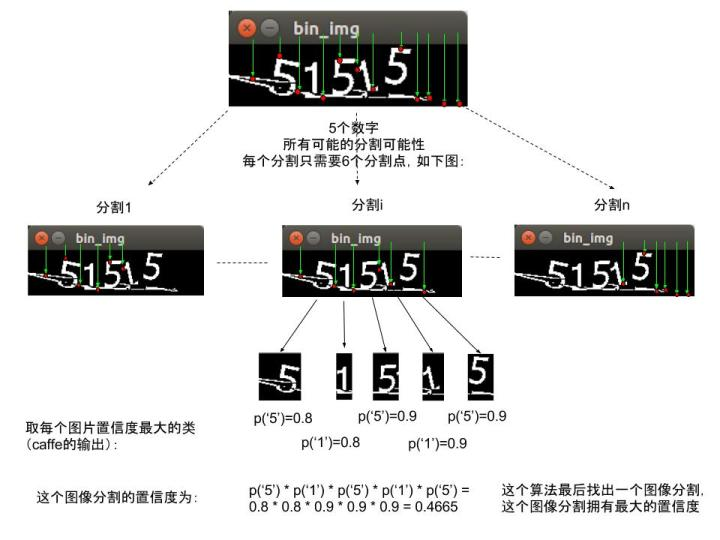
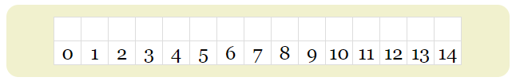
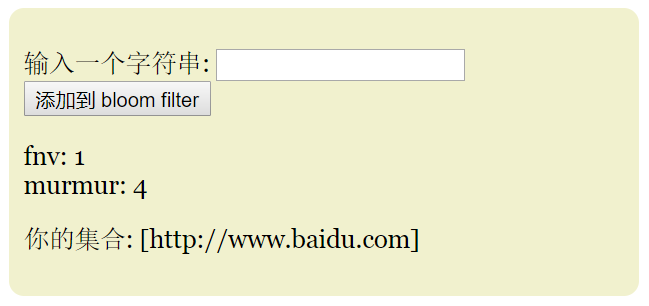
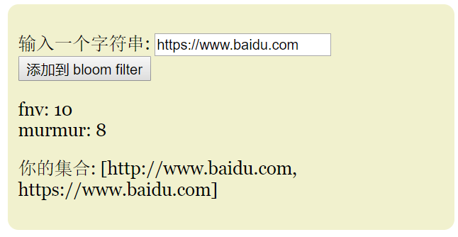
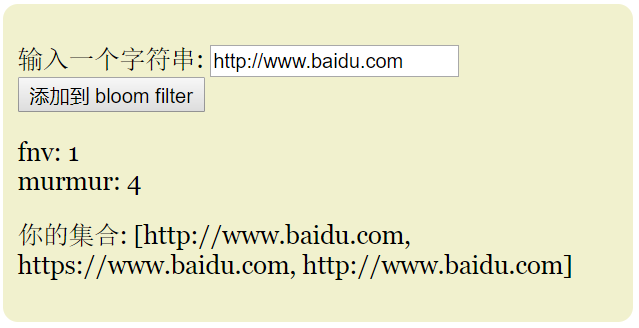

# 网络数据采集

# 第8章 网络数据采集中的问题与应对

本讲主要内容：
- Anti-Spider 与 Anti-Anti-Spider 
- URL去重

## 1 Anti-Spider 与 Anti-Anti-Spider 


### 1.1 Anti-Spider 技术介绍

常见的反爬虫技术主要有以下几种：
- 通过User-Agent来鉴别客户类型
- 通过封锁高频访问IP来防止机器行为
- 通过法律声明（robots.txt）来限制商业爬虫
- 通过页面技术（JS脚本、验证码、会话机制等）防止技术爬取
  - 使用动态或RIA技术，设置多阶段提交方式
  - 使用验证码
  - 使用会话密钥/token
  - 使用复杂登录访问机制

#### 1.1.1 应对“通过User-Agent来鉴别客户类型”

基本思路：在爬虫程序中，设置请求头参数“User-Agent”。

```python

headers = {
    'accept': "text/html,application/xhtml+xml,application/xml;q=0.9,image/webp,*/*;q=0.8",
    'accept-encoding': "gzip, deflate, sdch, br",
    'accept-language': "zh-CN,zh;q=0.8,en;q=0.6",
    'cache-control': "no-cache",
    'connection': "keep-alive",
    'host': "www.baidu.com",
    'pragma': "no-cache",
    'upgrade-insecure-requests': "1",
    'user-agent': "Mozilla/5.0 (Macintosh; Intel Mac OS X 10_12_4) AppleWebKit/537.36 (KHTML, like Gecko) Chrome/57.0.2987.133 Safari/537.36",
    'x-forwarded-for': "111.202.141.60",
    'postman-token': "3eed460d-872d-9df2-8362-4200cbe51645"
    }


```

#### 1.1.2 应对“封锁高频访问IP”

基本思路：设置代理，例如多个IP随机发起访问。

下面是一个从www.xicidaili.com网站采集代理信息并存入数据库例子：

```python
import requests,re,json
import sys,os,time,MySQLdb,MySQLdb

# --------------------------------------------------
# 中文编码设置
reload(sys)
sys.setdefaultencoding('utf-8')
Type = sys.getfilesystemencoding()

# 数据库设置
MYSQL_HOST = ''
MYSQL_DBNAME = ''
MYSQL_USER = ''
MYSQL_PASSWD = ''
MYSQL_PORT= 3306

# 此处修改数据库插入修改语句
install_str = '''
INSERT INTO proxy_xici( `proxy_ip`, `proxy_port`, `proxy_country`, `proxy_type`, `addtime`, `Last_test_time`, `proxy_status`, `Remarks`   )
VALUES (%s,%s,%s,%s,%s,%s,%s,%s)  '''

# 此处修改伪造的头字段,
headers = {
    'Host':"www.xicidaili.com",#需要修改为当前网站主域名
    "Accept": "text/html,application/xhtml+xml,application/xml;q=0.9,*/*;q=0.8",
    "Accept-Encoding": "gzip, deflate",
    "Accept-Language": "en-US,en;q=0.5",
    "Connection": "keep-alive",
    "User-Agent": "Mozilla/5.0 (X11; Ubuntu; Linux x86_64; rv:39.0) Gecko/20100101 Firefox/39.0",
	#"referer" : '123.123.123.123'#随意的伪造值
}


# 执行插入操作,导入插入语句,插入的数据,和数据库连接
def insert_ll(install_str,address_ll,conn,cur):
    mysql_str = install_str
    try:
        conn.ping()
        print 'ping ing '
    except Exception,e:
        print Exception,e
        conn = MySQLdb.connect(host=MYSQL_HOST,user=MYSQL_USER,passwd=MYSQL_PASSWD,db=MYSQL_DBNAME,port=MYSQL_PORT,charset='utf8')
        cur = conn.cursor()
    #print self.mysql_str % address_ll
    try:
        cur.execute(mysql_str,address_ll)
    except Exception,e:
        print Exception,e
    return None


#发起请求,
def get_request(url,headers):
    '''参数引入及头信息'''
    html=requests.get(url,headers=headers, timeout=20).text.decode('utf8')
    print html
    return html


# 将页面源代码正则匹配并解析,返回列表,其中每一项是json的数据
def re_html_code(html_code,proxy_list_json):

    # re正则取出数据
    try:
        re_list_ip = re.findall(r'<td>\d*\.\d*\.\d*\.\d*</td>',html_code)
        re_list_port = re.findall(r'<td>[\d]*</td>',html_code)
        re_list_live_time = re.findall(u'<td>\d*[小时分钟天]+</td>',html_code)
        print re_list_live_time
        #print type(html_code),type(r'<td>\d*[小时分钟天]+</td>')
        re_list_time = re.findall(r'<td>\d*-\d*-\d* \d*:\d*</td>',html_code)
        #print re_list_ip
        l = len(re_list_ip)
        for i in range(l):
            PROXY_IP = re_list_ip[i].replace('<td>','').replace('</td>',"")
            PROXY_PORT = re_list_port[i].replace('<td>','').replace('</td>',"")
            PROXY_COUNTRY = 'China'
            PROXY_TYPE= 'Elite'
            addtime = re_list_time[i].replace('<td>','').replace('</td>',"")
            Last_test_time = re_list_live_time[i].replace('<td>','').replace('</td>',"")
            #print Last_test_time
            #time.sleep(10)
            proxy_status = '1'
            Remarks = 'ly'
            # `id`, `proxy_ip`, `proxy_port`, `proxy_country`, `proxy_type`, `addtime`, `Last_test_time`, `proxy_status`, `Remarks`
            list_i = [PROXY_IP,PROXY_PORT,PROXY_COUNTRY,PROXY_TYPE,addtime,Last_test_time,proxy_status,Remarks]
            #print list_i
            proxy_list_json.append(list_i)

        print proxy_list_json
        return proxy_list_json

    except Exception,e:
        print Exception,e
#{'PROXY_STATUS': 'OK', 'PROXY_CITY': '', 'PROXY_TIME': '548', 'PROXY_STATE': '', 'PROXY_REFS': '', 'PROXY_TYPE': 'Transparent', 'PROXY_COUNTRY': 'China', 'PROXY_LAST_UPDATE': '1 59', 'PROXY_UPTIMELD': '105/16', 'PROXY_UID': '', 'PROXY_PORT': '1F90', 'PROXY_IP': '61.158.173.14'}


if __name__ == '__main__':
    try:
        conn = MySQLdb.connect(host=MYSQL_HOST,user=MYSQL_USER,passwd=MYSQL_PASSWD,db=MYSQL_DBNAME,port=MYSQL_PORT,charset='utf8')
        cur = conn.cursor()
    except Exception,e:
        print Exception,e

    for i in range(1,2):
        url = "http://www.xicidaili.com/nn/"+str(i)
        print 'begin',url
        try:
            #html_code = get_request(url,headers)
            html_code = get_request(url,headers)
            proxy_list_json = []
            now_url = url
            proxy_list_json = re_html_code(html_code,proxy_list_json)
            for i in proxy_list_json:
                print i
                insert_ll(install_str,i,conn,cur)
        except Exception,e:
            print Exception,e
```

#### 1.1.3 应对“多阶段提交”

基本思路：
- 使用复杂的脚本跟踪页面变化；
- 使用selenium WebDriver模拟浏览器行为；
- 使用phantomJS等模拟浏览器行为。


#### 1.1.4 应对“验证码”




基本思路：
- 获取验证码图片，返回给用户，请用户识别后输入
- 基于机器学习或深度学习进行验证码的自动生成和训练识别

目前常见的验证码识别方法：
- 使用Tensorflow，可以参考：https://cuiqingcai.com/5709.html
- 用百度的apistore的接口
- 使用tesseract，可以自己训练字库，智能识别特殊字体
- 使用pytorch

可以参考：https://github.com/ZYSzys/awesome-captcha




#### 1.1.5 应对“使用会话密钥/token”

因为网页js会传送到浏览器，所以无法真正隐藏secret key和token生成算法。

基本思路：逆向分析页面端JS生成密钥的方法，然后使用Python等实现密钥生成或token生成算法。

#### 1.1.6 应对“复杂登录访问机制"

基本思路：逆向分析登录过程代码，使用Python或其他脚本重现。


## 2 URL去重

URL去重的基本思路：
- 使用Python内置的集合数据类型
- 使用去重队列
- 使用具备一致性原则的数据库
- 使用布隆过滤器(BloomFilter)去重

### 2.1 布隆过滤器(BloomFilter)去重

Bloom filter 是由 Howard Bloom 在 1970 年提出的二进制向量数据结构，它具有很好的空间和时间效率，被用来检测一个元素是不是集合中的一个成员。如果检测结果为是，该元素不一定在集合中；但如果检测结果为否，该元素一定不在集合中。

Bloom filter 是一个数据结构，它可以用来判断某个元素是否在集合内，具有运行快速，内存占用小的特点。

而高效插入和查询的代价就是，Bloom Filter 是一个基于概率的数据结构：它只能告诉我们一个元素绝对不在集合内或可能在集合内。

Bloom filter 的基础数据结构是一个 比特向量。 下面是一个简单的示例：



表中的每一个空格表示一个比特, 空格下面的数字表示它的索引。只需要简单的对输入进行多次哈希操作，并把对应于其结果的比特置为1，就可以向 Bloom filter 添加一个元素。

例如：你可以输入一些字符串然后观察上方的向量变化。其中使用了 Fnv 和 Murmur 这两个简单的哈希函数：



当你往集合里添加一个字符串的时候, 你可以检查应用对应哈希函数的位置是否为1。这里用了绿色表示最新添加的元素对应位置，但是实际上你要知道，表格里的不同颜色都只代表了值为 1。


你可以简单的通过对字符串应用同样的哈希函数，然后看比特向量里对应的位置是否为1的方式来判断一个元素是否在集合里。如果是，这些对应位置有可能是由其他元素或者其他元素的组合所引起的。







Bloom filter 里的哈希函数需要是彼此独立且均匀分布。同时，它们也需要尽可能的快 (尽管 sha1 之类的加密哈希算法被广泛应用，但是在这一点上考虑并不是一个很好的选择)。常见选择为：
-  murmur
-  fnv
-  HashMix

当把 bloom filter 的实现从 md5 切换到 murmur 时，速度提升了 800%。

#### 2.1.1 Bloom filter 应该设计为多大？

Bloom filter 的一个优良特性就是可以修改过滤器的错误率。一个大的过滤器会拥有比一个小的过滤器更低的错误率。

假设在 Bloom filter 里面有 k 个哈希函数, m 个比特, 以及 n 个已插入元素。

错误率会近似于 $(1-e^{-\frac{kn}{m}})^k$, 所以你只需要先确定可能插入的数据集的容量大小 n, 然后再调整 k 和 m 来为你的应用配置过滤器。

#### 2.1.2 应该使用多少个哈希函数(k) ?

Bloom filter 使用的哈希函数越多运行速度就会越慢。但是如果哈希函数过少，又会遇到误判率高的问题。所以这个问题上需要认真考虑。

在创建一个 Bloom filter 的时候需要确定 k 的值，也就是说你需要提前圈定 n 的变动范围。而一旦你这样做了，你依然需要确定 m（总比特数）和 k (哈希函数的个数）的值。

似乎这是一个十分困难的优化问题，但幸运的是，对于给定的 m 和 n ，有一个函数可以帮我们确定最优的 k 值: $\frac{m}{n}ln(2) $

所以可以通过以下的步骤来确定 Bloom filter 的大小:

- 1.确定 n 的变动范围
- 2.选定 m 的值
- 3.计算 k 的最优值
- 4.对于给定的n, m, and k计算错误率。
- 5.如果第4步的错误率不能接受，那么回到第二步，否则结束。


#### 2.1.3 Bloom filter 的时间复杂度和空间复杂度?

对于一个 m 和 k 值确定的 Bloom filter，插入和测试操作的时间复杂度都是 O(k)。这意味着每次你想要插入一个元素或者查询一个元素是否在集合中，只需要使用 k 个哈希函数对这个元素求值，然后将对应的比特位标记或者检查对应的比特位。

相比之下，Bloom filter 的空间复杂度更难以概述，它取决于你可以忍受的错误率。同时也取决于输入元素的范围，如果这个范围是有限的，那么一个确定的比特向量就可以很好的解决问题。如果你甚至不能很好的估计输入元素的范围，那么你最好选择一个哈希表或者一个可拓展的 Bloom filter。

#### 2.1.4 具体实现

可以参考：
- https://github.com/seomoz/pyreBloom
- https://github.com/jaybaird/python-bloomfilter
- https://github.com/Python3WebSpider/ScrapyRedisBloomFilter