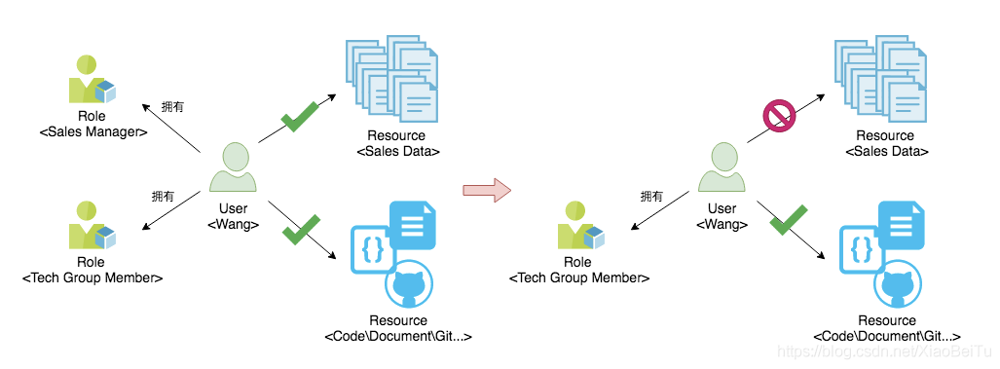
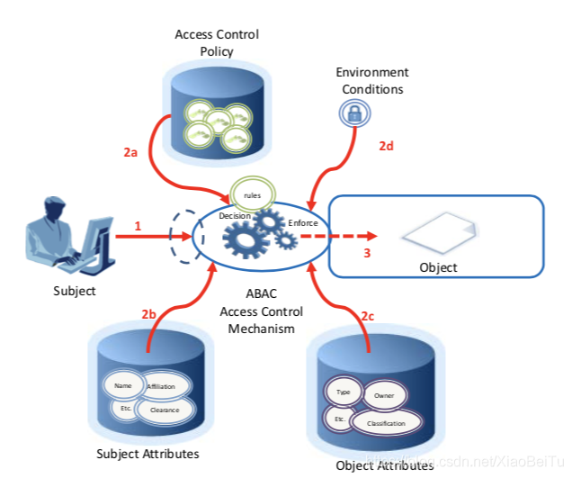
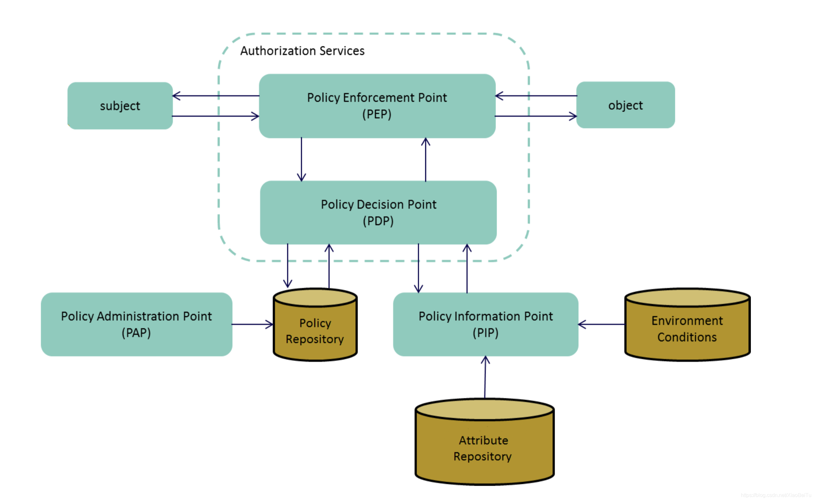

# 访问控制简明手册

## 介绍

本手册旨在为应用中构建简明、可操作的访问控制提供安全指南。目标读者是开发人员、安全审计人员、设计人员、架构设计人员。

### 什么是访问控制？或授权？
授权是一个当请求访问特定资源时予以批准或拒绝的过程。注意授权（Authorization）不等同于认证（Authentication），这两个词经常被混淆。

认证（Authentication）提供和验证身份。授权包括确定用户（或主体）可以访问哪些功能和数据的执行规则，以确保在认证成功后正确分配访问权限。

Web应用需要访问控制来允许拥有各种权利的用户来使用该应用。他们也需要管理员来管理应用访问控制规则，并授予用户和其它实体相应的许可或资格。有多种不同的访问控制设计方法论。选择最为合适的一种时，需要先进行风险评估以识别特定系统的威胁和脆弱性，以便正确的访问控制方法被采用。

### 访问控制策略

访问控制策略时保障烦请需求能够清楚的被描述，以便架构人员、设计人员、开发人员和支持人员能够准确的知悉，使访问控制功能能被完整一致的设计和实现。

## 基于角色的访问控制 RBAC

RBAC中，访问决策基于个人在组织或用户中的角色和责任。

定义角色的过程通常基于对基本目标和组织结构的分析，通常与安全策略相关联。例如，在医院里，用户的不同角色可能包括医生、护士、服务人员、病人等。这些成员要求不同级别的访问，以执行相应的功能，而且web事务的类型和他们被允许的上下文都将根据安全策略和相关的规则而改变。

RBAC访问控制框架应该使web应用程序安全管理员能够确定谁可以执行哪些操作、何时、从何处、以什么顺序执行，以及在什么关系环境下的特定情况。

使用这种方法的优势：
- 基于组织架构分配角色，可以基于组织安全策略加强安全性
- 简单易用
- 简化管理
- 许多框架内建了RBAC
- 与“职责分离”和“最小特权”等安全原则相符

使用这种方法的问题：
- 角色和访问的文档，必须被严格维护；
- 不能有效实现多租户（Multi-tenancy），除非有方法连接角色和多租户能力要求（例如：在Active Directory 中的 OU ）
- 很可能授予用户过多的权限，例如许多用户的访问权力可能比他需要的要多。或者一个用户可能有两个角色，这种情况应当在安全审计和后续变更中被纠正的。
- 不支持基于数据的访问控制

使用RBAC时的注意事项：
- 角色必须仅使用严格的签发和流程进行赋予或委派。
- 当一个用户改变原有角色为新角色时，管理员必须确保他原有角色已被取消，以便在任何给定的时刻，一个用户仅有一个他所应当具有的角色（知其所需）。
- 确保RBAC策略有严格的访问控制审计过程。

## 自主访问控制（Discretionary Access Control DAC）

自主访问控制（DAC）是一种基于用户身份和/或某些组的成员身份限制对信息访问的方法。访问决策通常基于用户在身份验证时提供的凭据（用户名、密码、硬件/软件令牌等）授予用户的授权。在大多数典型的DAC模型中，信息或任何资源的所有者都可以根据自己的判断更改其权限（即名称）。

DAC框架可以为web应用程序安全管理员提供实现细粒度访问控制的能力。该模型可以作为基于数据的访问控制实现的基础。

使用此模型的优点是：
- 易于使用
- 易于管理
- 符合最少特权原则。
- 对象所有者对授予的访问具有完全控制权

使用此方法时可能遇到的问题：
- 角色和访问的文档必须严格维护。
- 除非有一种方法可以将角色与多租户功能需求（例如activedirectory中的OU）相关联，否则多租户无法有效地实现
- 存在过多授权的可能，例如，可以授予比预期更多的访问和权限。

使用DAC时的注意事项包括：
- 授予信任
- 必须通过严格的访问控制审查来保证DAC。

## 强制访问控制（MAC）

强制访问控制（MAC）确保组织安全策略的执行不依赖于自愿的web应用程序用户遵从性。MAC通过在信息上分配敏感度标签并将其与用户操作时的敏感度级别进行比较来保护信息。MAC通常适用于非常安全的系统，包括多级安全的军事应用或任务关键的数据应用。

使用这种方法的优点是：

- 对对象的访问基于对象的敏感度
- 严格遵守基于需要知道的访问，范围蔓延的可能性最小
- 只有管理员可以授予访问权限

使用此方法时可能遇到的问题：
- 实施困难且成本高昂
- 不敏捷

使用MAC时需要注意的方面包括：
- 在适当和实用的水平上进行分类和敏感性分配
- 必须对MAC进行保证，以确保对象的分类处于适当的级别。

## 基于权限的访问控制

基于权限的访问控制的关键概念是将应用程序操作抽象为一组权限。权限可以简单地表示为基于字符串的名称，例如“READ”。访问决策是通过检查当前用户是否具有与请求的应用程序操作相关联的权限来做出的。

用户和权限之间的has关系可以通过在用户和权限之间创建直接关系（称为授权）或间接关系来满足。在间接模型中，权限授予给中间实体，如用户组。当且仅当用户从用户组继承权限时，用户才被视为用户组的成员。由于更改分配给用户组的权限会影响用户组的所有成员，因此间接模型使管理大量用户的权限变得更容易。

在一些提供细粒度域对象级访问控制的基于权限的访问控制系统中，权限可以分组到类中。在这个模型中，假设系统中的每个域对象都可以与一个类相关联，该类决定了适用于各个域对象的权限。在这样的系统中，“DOCUMENT”类可以定义为“READ”、“WRITE”和“DELETE”权限；“SERVER”类可以定义为“START”、“STOP”和“REBOOT”权限。

## 基于属性的访问控制 (Attribute Based Access Control)

ABAC 策略在判断一个用户是否能访问某项资源，是对其很多不同属性的计算而得到的。

### 基本概念
#### Attribute 属性

用于表示 subject、object 或者 environment conditions 的特点，attribute 使用 key-value 的形式来存储这些信息，比如我在公司的 role 是 developer，role 是 key，developer 是 value，而我的小组昵称袋熊，key 是 team，value 是 wombat。

#### Subject
常常指代使用系统的人或者其他使用者（non-person entity，NPE），比如说客户端程序，访问 API 的 client 或者移动设备等等。当然一个 subject 可以有多个的 attributes，就像用户属性这些我们曾经用过的名词一样。

#### Object
指代我们这个 ACM 需要管理的资源，比如文件，比如某项记录，比如某台机器或者某个网站，任何你需要进行访问控制的资源都可以称为 object，同样 object 也可以有多项属性，比如袋熊组的桌子，或者洛克组的线上实例，我们也常常使用 resource 来描述这些资源，但是在 ABAC 的环境下，我们称为 object。

#### Operation
有了 object 有了 subject，自然就有了 subject 需要做的事情，比如查看某条记录，登录某台服务器，使用某个 SaaS 服务进行报销或者查看候选人的作业。往往包括我们常说的读、写、修改、拷贝等等，一般 operation 是会表达在 request 中的，比如 HTTP method。

#### Policy
通过 subject、object 的 attribute 与 environment conditions 一起来判断 subject 的请求是否能够允许的关系表示，比如说：policy 可以用人类语言这样表达，只有袋熊组的人才能访问这几台服务器，或者只有在办公室才能访问这些资源，但对于机器来说，无非就是一个判断语句罢了。当然了，policy 可以是一堆这样 boolean 逻辑判断的组合，比如只有公司的正式员工、并且在公司的六楼区域的网络中，才能访问某个服务。你可以使用 Specification Pattern 来实现 policy，其实没那么复杂。

#### Environment Conditions
表示目前进行的访问请求发生时，的操作或情境的上下文。Environment conditions 常常用来描述环境特征，是独立于 subject 与 object 的，常用来描述系统的情况：比如时间，当前的安全等级，生产环境还是测试环境等等。

### ABAC 场景分析
一个典型的 ABAC 场景描述如下图，当 subject 需要去读取某一条记录时，我们的访问控制机制在请求发起后遍开始运作，该机制需要计算:来自 policy 中记录的规则、subject 的 attribute、object 的 attribute 以及 environment conditions，而最后会产生一个是否允许读取的结果。

在 NIST 的描述中，我们对 ACM 内部进行进一步的抽象，可以得出这两个核心模块：Policy Decision Point (PDP) 与 Policy Enforcement Point (PEP)，如下图：

### ABAC 实现

实现 ABAC 的核心机制是在请求发起后，subject attributes、object attributes 与 environment conditions 作为输入，PEP 获取规则，PDP 进行计算，最后确定是否有权进行请求。ABAC 的逻辑并不复杂，根据之前我们所画的基本场景与机制的图中，你可以很轻松的开始进行架构设计，往往最开始你需要定义出 subject、object 以及其相关的 attribute，同时你也需要思考，当去进行 object 访问时，你该如何表达 request 以及 operation。

RESTful 是我们常用的设计风格，RESTful 的流行是与 HTTP 协议密不可分的，其中我们很看重 HTTP 协议中的 methods，并且赋予了这些 methods 易于理解的语义，我们会很自然的认为 GET 是获取资源，而 POST 是创建新的资源，PUT 则是修改，使用这些 methods 是与控制资源联系在一起。但是，在 HTTP 协议中，并没有规定 GET 是否可以进行资源上的修改和更新，因为这只是个传输协议罢了，是我们在这个协议之上发明了新的东西，所以也没有“官方的、标准的” RESTful。之所以在这里提到 RESTful 与 HTTP 的关系，是想让大家理解在进行 ABAC 系统设计时，operation 是可以有很多种表达的，而重要的是定义这些 operation 与 request 的关系，你可以使用 SOAP 或者其他协议，或者在 RESTful 之上自己发明一些字段，或者加入进 HTTP header，但是一定需要有清楚的 operation 描述。

ABAC 落地:
- AWS IAM

### 参考
- [NIST  ABAC 的定义与实现考虑](https://nvlpubs.nist.gov/nistpubs/specialpublications/NIST.SP.800-162.pdf)
- AWS IAM ABAC 介绍
- ABAC 与 XACML 复杂性讨论
- Yet Another Authorization Language
- XACML
- Next Generation Access Controls NGAC