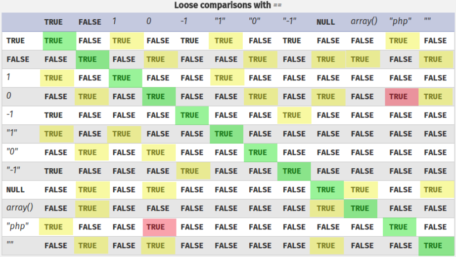

# PHP tricks

> 内容参考：https://book.hacktricks.xyz/pentesting/pentesting-web/php-tricks-esp#code-execution-via-httaccess

## PHP应用 Cookies 常见位置
cookies常以下列为key：
```
PHPSESSID
phpMyAdmin
```

位置：`/var/lib/php/sessions`

## Bypass PHP comparisons

### Loose comparisons / Type Juggling (==)

>https://www.php.net/manual/en/types.comparisons.php

在PHP中，使用“==”比较时，属于loose comparison，结果如下图所示：



有趣的地方在于：

- "string" == 0 结果为True，一个不以数字开始的字符串，等于一个数字。
- "0xAAAA" == "43690" 结果为True，以十进制、16进制数字组成的字符串，可以和别的数字或字符串比较，如果数字的值相同那么结果为True，即字符串中的数字会被解释为数字。
- "0e3264578" == 0 为True，以“0e”开头的字符串，后面跟任意数字都可以“==” 0。
- "0X3264578" == 0X --> True A string starting with "0" and followed by any letter (X can be any letter) and followed by anything will be equals to 0
- "0e12334" == "0" --> True This is very interesting because in some cases yo can control the string input of "0" and some content that is being hashed and compared to it. Therefore, if you can provide a value that will create a hash starting with "0e" and without any letter, you could bypass the comparison. You can find already hashed strings with this format here: https://github.com/spaze/hashes
- "X" == 0 --> True Any letter in a string is equals to int 0
