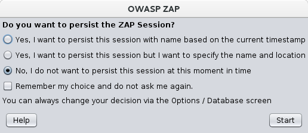

# OWASP ZAP 手册

## 安全测试基础
软件安全测试是一个评估和测试系统的过程，用于发现安全风险和系统与数据的漏洞。这里所谓的“评测”（assessments）指的是分析和发现漏洞，不涉及具体的渗透。我们所说的“测试”指的是发现和尝试渗透漏洞。

根据测试的漏洞类型或进行的测试类型，安全测试经常被改变。常见的：
- 漏洞评估 –扫描并分析系统中的安全问题。
- 渗透测试 –系统受到来自模拟恶意攻击者的分析和攻击。
- 运行时测试 –系统接受来自最终用户的分析和安全测试。
- 代码审查 –对系统代码进行详细的审查和分析，专门查找安全漏洞。

请注意，通常在安全测试中列出的风险评估未包含在此列表中。这是因为风险评估实际上不是测试，而是对不同风险（软件安全性，人员安全性，硬件安全性等）的感知严重性以及针对这些风险的任何缓解措施的分析。

### 有关渗透测试的更多信息
渗透测试（喷入）的执行就像测试者是恶意外部攻击者一样，目的是闯入系统并窃取数据或进行某种拒绝服务攻击。

渗透测试具有准确性更高的优点，因为它的误报率较低（结果报告的漏洞实际上并不存在），但是运行起来很耗时。

渗透测试还用于测试防御机制，验证响应计划并确认安全策略的遵循性。

自动化的渗透测试是持续集成验证的重要组成部分。它有助于发现新的漏洞以及在快速变化的环境中对于以前的漏洞的回归，并且在该环境中开发可能是高度协作和分布式的。

### 渗透测试过程
通常同时使用手动和自动渗透测试，以测试从服务器，网络，设备到端点的所有内容。本文档重点介绍Web应用程序或网站渗透测试。

渗透测试通常遵循以下阶段：
- 探索 –测试人员尝试了解被测系统。这包括尝试确定正在使用的软件，存在的端点，已安装的补丁程序等。它还包括在站点中搜索隐藏的内容，已知的漏洞以及其他弱点指示。
- 攻击 –测试人员尝试利用已知或怀疑的漏洞来证明它们存在。
- 报告 –测试人员报告测试结果，包括漏洞，漏洞利用方式，漏洞利用的难度以及漏洞的严重性。
### 渗透测试目标
渗透测试的最终目标是搜索漏洞，以便可以解决这些漏洞。它还可以验证系统不容易受到已知类别或特定缺陷的影响；或者，对于已报告为已修复的漏洞，请确认系统不再容易受到该缺陷的攻击。

## ZAP简介
Zed攻击代理（ZAP）是一个免费的开源渗透测试工具，由开放Web应用程序安全项目（OWASP）维护。ZAP专为测试Web应用程序而设计，并且既灵活又可扩展。

ZAP的核心是所谓的“中间人代理”。它位于测试仪的浏览器和Web应用程序之间，以便它可以拦截和检查在浏览器和Web应用程序之间发送的消息，根据需要修改内容，然后将这些数据包转发到目标位置。它可以用作独立应用程序，也可以用作守护进程。


如果在许多公司环境中已经使用了另一个网络代理，则可以将ZAP配置为连接到该代理。


ZAP提供了各种技能级别的功能-从开发人员到安全测试新手，再到安全测试专家。ZAP具有适用于每个主要操作系统和Docker的版本，因此您不必局限于单个操作系统。可以从ZAP市场中的各种附加组件免费获得其他功能，这些功能可以从ZAP客户端中访问。

由于ZAP是开源的，因此可以检查源代码以确切了解功能的实现方式。任何人都可以自愿从事ZAP的工作，修复错误，添加功能，创建将修复程序拉入项目的拉取请求以及编写附件以支持特殊情况。

## 安装和配置ZAP
ZAP具有适用于Windows，Linux和Mac OS / X的安装程序。下面列出的下载站点上还提供了Docker映像。

### 安装ZAP
首先要做的是在要执行渗透测试的系统上安装ZAP。从下载页面下载适当的安装程序。

请注意，ZAP需要Java 8+才能运行。Mac OS / X安装程序包含适当的Java版本，但您必须为Windows，Linux和跨平台版本分别安装Java 8+。Docker版本不需要您安装Java。

安装完成后，启动ZAP并阅读许可条款。如果您接受条款，请单击“ 同意 ”，ZAP将完成安装，然后ZAP将自动启动。

## 保存会话（Persisting a Session）

首次启动ZAP时，系统将询问您是否要保留ZAP会话。默认情况下，ZAP会话始终以默认名称和位置记录到HSQLDB数据库中的磁盘上。如果您不保留会话，则退出ZAP时将删除这些文件。

如果选择保留会话，则会话信息将保存在本地数据库中，以便以后可以访问它，并且将能够提供自定义名称和位置来保存文件。



## ZAP桌面用户界面

ZAP桌面用户界面由以下元素组成：

- 菜单栏 –提供对许多自动和手动工具的访问。
- 工具栏 –包括按钮，可让您轻松访问最常用的功能。
- 树形窗口 –显示“站点”树和“脚本”树。
- 工作区窗口 –显示请求，响应和脚本，并允许您对其进行编辑。
- 信息窗口 –显示自动和手动工具的详细信息。
- 页脚 -显示找到的警报的摘要以及主要自动化工具的状态。


使用ZAP时，可以单击菜单栏上的“ 帮助 ”或按F1键以访问《 ZAP桌面用户指南》中的上下文相关帮助。也可以在线获得。

有关UI的更多信息，请参见ZAP联机文档中的ZAP UI概述。

ZAP还支持强大的API和命令行功能，这两者均不在本指南的范围之内。

重要提示：您仅应使用ZAP来攻击您有权通过主动攻击进行测试的应用程序。因为这是一个像真实攻击一样的模拟，所以可以对站点的功能，数据等造成实际损坏。如果您担心使用ZAP，则可以防止它造成危害（尽管ZAP的功能将大大减少）通过切换到安全模式。

要将ZAP切换到安全模式，请单击主工具栏上的模式下拉菜单上的箭头以展开下拉列表，然后选择“ 安全模式”。

## 运行自动扫描

开始使用ZAP的最简单方法是通过“快速启动”选项卡。快速入门是ZAP加载项，在安装ZAP时会自动提供。

要运行快速入门自动扫描：
- 启动ZAP，然后单击“工作区”窗口的“ 快速启动”选项卡。
- 单击较大的自动扫描按钮。
- 在“ 要攻击的URL”文本框中，输入要攻击的Web应用程序的完整URL。
- 点击攻击


ZAP将继续使用其蜘蛛抓取Web应用程序，并被动扫描它找到的每个页面。然后，ZAP将使用活动的扫描程序来攻击所有发现的页面，功能和参数。

ZAP提供了2个蜘蛛来爬行Web应用程序，您可以在此屏幕中使用它们中的一个或两个。

传统的ZAP蜘蛛通过检查Web应用程序响应中的HTML来发现链接。这个蜘蛛速度很快，但是在探索使用JavaScript生成链接的AJAX Web应用程序时并不总是有效。

对于AJAX应用程序，ZAP的AJAX Spider可能更有效。该蜘蛛通过调用浏览器来浏览Web应用程序，然后浏览器将遵循已生成的链接。AJAX蜘蛛比传统蜘蛛慢，并且需要其他配置才能在“无头”环境中使用。

ZAP将被动扫描通过它代理的所有请求和响应。到目前为止，ZAP只对您的Web应用程序执行被动扫描。被动扫描不会以任何方式改变响应，因此被认为是安全的。扫描也在后台线程中执行，以不会减慢浏览速度。被动扫描擅长于发现一些漏洞，并且可以使您了解Web应用程序的基本安全状态并确定需要进行更多调查的位置。

但是，主动扫描尝试通过使用对选定目标的已知攻击来查找其他漏洞。主动扫描是对这些目标的真正攻击，并且可能使目标面临风险，因此请勿对没有权限测试的目标使用主动扫描。

解释测试结果
当ZAP抓取您的Web应用程序时，它会构建Web应用程序页面和用于呈现这些页面的资源的地图。然后，它记录发送到每个页面的请求和响应，并在请求或响应存在潜在问题时创建警报。

查看浏览页面
要检查浏览页面的树视图，请在树窗口中单击“ 站点”选项卡。您可以展开节点以查看访问的各个URL。

查看警报和警报详细信息
页脚的左侧包含在测试过程中发现的警报计数，并分为风险类别。这些风险类别为：
- high
- medium
- low
- information
- false positive

要查看测试期间创建的警报：

单击信息窗口中的警报选项卡。
单击该窗口中显示的每个警报，以显示URL和在“信息”窗口右侧检测到的漏洞。
在工作区Windows中，单击“ 响应”选项卡以查看响应标题和正文的内容。生成警报的响应部分将突出显示。

## 手动浏览应用程序
被动扫描和自动攻击功能是开始评估Web应用程序漏洞的好方法，但它有一些局限性。其中包括：
- 在被动扫描期间无法发现受登录页面保护的任何页面，因为除非配置了ZAP的身份验证功能，否则ZAP将不会处理所需的身份验证。
- 您对被动扫描中的探索顺序或自动攻击中执行的攻击类型没有太多控制权。ZAP确实为被动扫描之外的探索和攻击提供了许多其他选项。


蜘蛛是探索基本站点的好方法，但应与手动探索结合使用，以提高效率。例如，Spider只会将基本的默认数据输入到Web应用程序中的表单中，而用户可以输入更多相关信息，从而可以将更多Web应用程序暴露给ZAP。对于需要有效电子邮件地址的注册表格之类的情况尤其如此。蜘蛛可能会输入随机字符串，这将导致错误。用户将能够对该错误做出反应并提供正确格式的字符串，这可能会导致在提交和接受表单时暴露更多的应用程序。

您应该使用通过ZAP代理的浏览器浏览所有Web应用程序。执行此操作时，ZAP会被动扫描在探索期间发现的所有请求和响应中的漏洞，继续构建站点树，并记录有关在探索期间发现的潜在漏洞的警报。

ZAP浏览Web应用程序的每个页面（无论是否链接到另一个页面）是否存在漏洞很重要。模糊不是安全的，隐藏的页面有时会在没有警告或通知的情况下上线。因此，在浏览您的网站时，请尽其所能。

您可以通过“快速启动”选项卡快速轻松地启动预先配置为通过ZAP代理的浏览器。以这种方式启动的浏览器还将忽略否则将报告的所有证书验证警告。


手动浏览您的应用程序：
- 启动ZAP，然后单击“工作区”窗口的“ 快速启动”选项卡。
- 单击较大的“手动浏览”按钮。
- 在“ 要浏览的URL”文本框中，输入要浏览的Web应用程序的完整URL。
- 选择您要使用的浏览器
- 单击启动浏览器

此选项将启动使用新配置文件安装的所有最常见的浏览器。

如果要使用任何具有现有配置文件的浏览器（例如安装了其他浏览器附件），则需要手动配置浏览器以通过ZAP代理，并导入并信任ZAP根CA证书。有关更多详细信息，请参见《 ZAP桌面用户指南》。

默认情况下，将启用ZAP  Heads Up Display （HUD）。启动浏览器之前在此屏幕上取消选中相关选项将禁用HUD。

##  Heads Up Display (HUD)

（HUD）是一个创新的新界面，可直接在浏览器中访问ZAP功能。它是Web安全新手的理想选择，还使经验丰富的渗透测试人员可以专注于应用程序功能，同时提供关键的安全信息和功能。


通过“手动浏览”屏幕或工具栏选项启用时，HUD会覆盖在浏览器中目标应用程序的顶部。仅支持现代浏览器，例如Firefox和Chrome。

默认情况下，HUD会显示一个初始屏幕，其中包含一个教程的链接，该指南将带您了解HUD功能并说明如何使用它们。

## ZAP高级功能
### 先进的桌面功能
桌面具有大量功能，这些功能不会立即显现出来，因此不会使新用户不知所措。

默认情况下，有许多选项卡未显示。可以通过带有绿色“ +”图标的右侧选项卡来访问它们。您可以通过右键单击将您希望始终显示的任何标签固定。相关时会出现许多默认隐藏的选项卡。例如，如果您通过ZAP代理的应用程序开始使用Websockets，则将显示Websockets选项卡。

桌面还大量使用了上下文相关的右键单击选项，因此在习惯于用户界面的同时，可以在任何地方右键单击。

### ZAP市场
ZAP桌面具有插件架构，这意味着可以动态添加新功能。

一个在线市场提供了广泛的ZAP的附加组件里面添加了许多额外的功能，ZAP的。

可以通过ZAP内的工具栏上的“管理加载项”按钮访问市场：

市场上的所有附加组件都是完全免费的。

### 自动化
ZAP是与Java，Python，Node.js PHP，Ruby等库一起用于自动化的理想工具！

它可以在无头模式下运行，并具有强大的API，可让您控制通过ZAP桌面提供的几乎所有功能。

有关更多详细信息，请参见API文档。

### 了解有关ZAP的更多信息
现在您已熟悉ZAP的一些基本功能，您可以从ZAP的《桌面用户指南》中了解有关ZAP的功能以及如何使用它们的更多信息。用户指南提供了分步说明，API和命令行编程的参考，指导视频以及使用ZAP的技巧和窍门。

也可以通过“快速入门”顶部屏幕上的“了解更多”按钮获得其他链接.

## 扫描规则

ZAP支持 active 和 passive 扫描规则，所有的规则包含在 add-ons，以便更新。Scan polices 定义了规则如何运行和哪些规则会运行。

## 告警（Alerts）
告警是潜在的漏洞，与特定的某个请求相联系。一个请求可能有多于一个告警。

Alerts可能由各种ZAP 组件引发，包括但不限于：active scanning，passive scanning，scripts，addons, 或者手动使用"增加alert对话框“。

### 告警重载
ZAP发出的警报包括有关发出的警报的常规信息和特定信息。具体信息与发现的潜在问题直接相关，例如URL和受影响的参数。通用信息包括诸如描述之类的内容，以及指向相关在线资源的链接。

您可以使用 ‘alert override’ 配置文件替换或添加到常规信息。这使您可以包含特定于公司的信息，例如强制性策略，内部链接或针对所使用特定技术的建议。

警报替代配置文件是UTF-8属性文件，其中仅包含您要更改的信息。以“＃”开头的行被视为注释并被忽略。

```<alertid>.<property> = [ + | - ] <your information>```

支持属性包括：
- name
- description
- solution
- otherInfo
- reference

例如：
```
# 40012 = Reflected XSS
40012.solution = Follow our company specific guidelines at http://internet.example.com/xss.html
```

如果该值以“ +”开头，则将其附加到现有信息之后。
如果以“-”开头，则该前缀位于现有信息之前。
如果它不是以“ +”或“-”开头，则它将替换现有信息。

可以通过API，“ 选项警报”屏幕 或使用命令行选项来指定警报替代配置文件：

```-config alert.overridesFilename=<filename>```

## context
上下文(context)是将一组URL关联在一起的一种方式。
您可以定义自己喜欢的任何上下文，但是期望上下文将与Web应用程序相对应。
建议您为组成要测试的系统的每个Web应用程序定义一个新的上下文，并在测试每个Web应用程序时将它们设置为作用域。

上下文被定义为一组正则表达式（regexs），它们应用于“ 网站”标签中的所有URL 。
注意：正则表达式必须匹配整个URL。

您可以通过以下方式配置上下文：

在“网站”或“历史记录”选项卡中右键单击菜单项
该会话上下文对话。