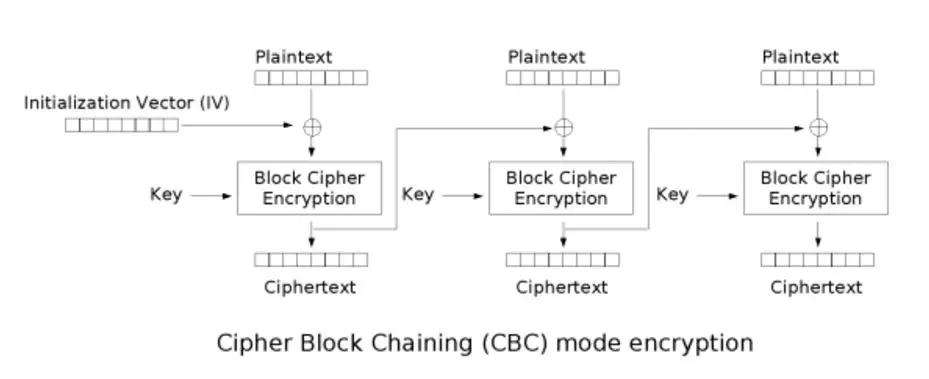
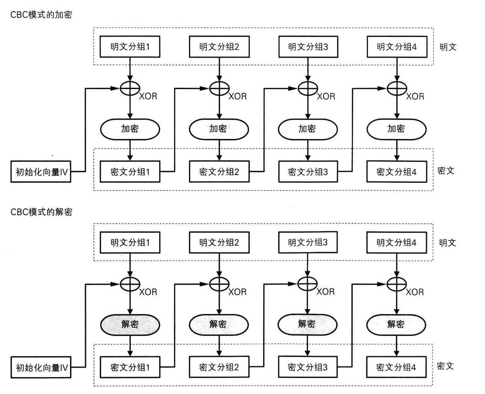
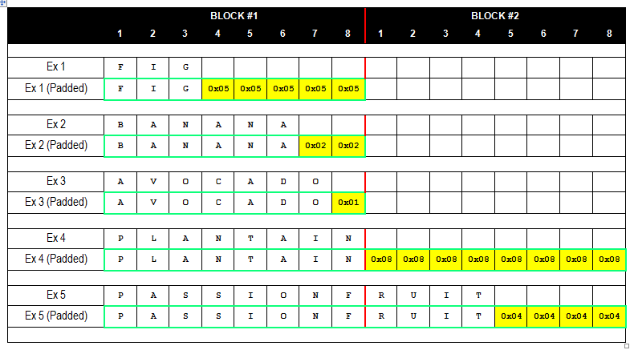
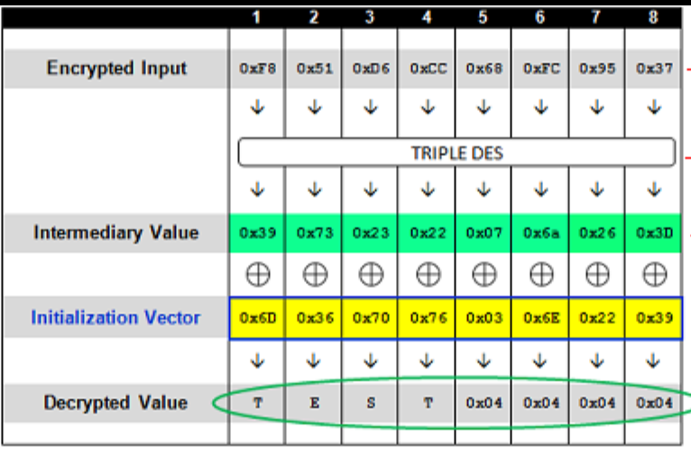
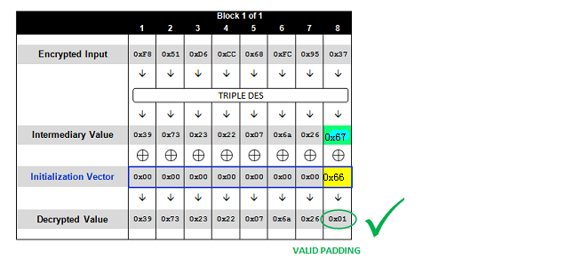
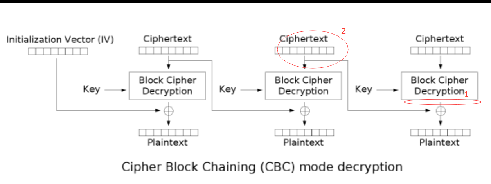

# 第10讲 弱加密测试

- Testing for Weak SSL TLS Ciphers Insufficient Transport Layer Protection
- Testing for Padding Oracle
- Testing for Sensitive Information Sent via Unencrypted Channels
- Testing for Weak Encryption

## SSL TLS弱密码、传输层保护不足类测试

ID ：WSTG-CRYP-01
### 摘要
通过网络传输敏感数据时，必须加以保护。例如：用户凭证和信用卡。根据经验，如果在存储数据时必须对其进行保护，则在传输过程中也必须对其进行保护。

HTTP是一种明文协议，通常通过SSL / TLS隧道进行保护，形成HTTPS通信。使用此协议不仅可以确保机密性，还可以确保身份验证。使用数字证书对服务器进行身份验证，也可以使用客户端证书进行相互身份验证。

即使现在支持并正常使用高级密码，服务器中的某些错误配置也可用于强制使用弱密码-或在最坏的情况下不使用加密-允许攻击者访问假定的安全通信信道。其他错误配置可用于拒绝服务攻击。

#### 常见问题
如果使用HTTP协议传输敏感信息（例如，通过HTTP传输的凭据），则会产生漏洞。使用SSL / TLS服务时虽然提供了安全性，但也增加了攻击面，并且存在以下问题：
- SSL/TLS、密码、密钥、重协商必须正确配置。
- 证书验证必须有效。

与此相关的其他问题是：
- 考虑到已知漏洞的存在，暴露的软件必须更新。
- 会话cookie的安全标志是否使用。例如：```Set-Cookie: user_session=P-TEEBUzmTkXW99KaFpMCEUF3C22zSsaHIN_NDREarzSwsyO; path=/; expires=Fri, 15 May 2020 09:16:28 GMT; secure; HttpOnly```
- HTTP严格传输安全性（HSTS）的使用。
- 同时存在HTTP和HTTPS，可以用来拦截流量。
- 同一页面中存在混合的HTTPS和HTTP内容，可用于泄漏信息。

#### 以明文形式传输敏感数据
应用程序不应通过未加密的通道传输敏感信息。通常，可以找到通过HTTP进行的基本身份验证，通过HTTP发送的输入密码或会话cookie，以及一般情况下通过法规，法律或组织策略考虑的其他信息。

#### 弱的 SSL/TLS 密码/协议/密钥
从历史上看，美国政府已经设置了限制，以允许仅针对最多40位的密钥大小导出密码系统，该密钥大小可能会被破坏并允许对通信进行解密。从那时起，放松了加密出口法规，最大密钥大小为128位。

重要的是要检查所使用的SSL配置，以避免放置容易被破解的加密支持。为了实现此目标，基于SSL的服务不应提供选择弱密码套件的可能性。密码套件由用于完整性检查的加密协议（例如DES，RC4，AES），加密密钥长度（例如40、56或128位）和哈希算法（例如SHA，MD5）指定。

简而言之，确定密码套件的要点如下：
- 客户端向服务器发送ClientHello消息，其中指定了它可以处理的协议和密码套件以及其他信息。请注意，客户端通常是Web浏览器（当今最受欢迎的SSL客户端），但不一定，因为它可以是任何启用SSL的应用程序；在服务器端，最常见的情况是服务器，但不一定是Web服务器。（另请参见：stunnel，一种为服务器和客户端增加TLS加密的代理。）
- 服务器以ServerHello消息作为响应，该消息包含将用于该会话的所选协议和密码套件（通常，服务器选择客户端和服务器均支持的最强协议和密码套件）。


可以指定服务器将使用的密码套件（例如，通过配置指令）。这样，您可以控制与客户端的对话是否仅支持40位加密。
1.服务器发送其证书消息，并且，如果需要客户端身份验证，还将向客户端发送一个CertificateRequest消息。
2.服务器发送ServerHelloDone消息并等待客户端响应。
2.收到ServerHelloDone消息后，客户端将验证服务器的数字证书的有效性。

#### 检查客户端和服务器确保TLS/SSL证书有效性

通过HTTPS协议访问Web应用程序时，将在客户端和服务器之间建立安全通道。然后，通过数字证书建立一个（服务器）或双方（客户端和服务器）的身份。因此，一旦确定了密码套件，“SSL握手”将接着进行证书交换：
- 服务器发送其证书消息，如果需要客户端身份验证还将向客户端发送一个CertificateRequest消息。
- 服务器发送ServerHelloDone消息并等待客户端响应。
- 一旦收到ServerHelloDone消息后，客户端将验证服务器的数字证书的有效性。

为了建立通信，必须通过一系列的证书检查。尽管讨论SSL和基于证书的身份验证不在本指南的范围内，但本节将重点介绍确定证书有效性所涉及的主要标准：
- 检查证书颁发机构（CA）是否为​​已知证书颁发机构（CA）；
- 检查证书当前有效；
- 检查站点名称和证书中报告的名称是否匹配。

让我们更详细地检查每项。
- 每个浏览器都带有一个预加载的受信任CA列表（可扩展），用于与证书签名CA进行比较。在与HTTPS服务器进行初始协商期间，如果与服务器证书相关的CA对浏览器来说是未知的，则浏览器通常会发出警告。这种情况最常见，因为很多Web应用程序有自建的CA签名证书。是否考虑这一点取决于几个因素。例如，这对于Intranet环境可能很可行的（考虑通过HTTPS提供公司Web电子邮件，显然所有用户都将内部CA识别为受信任的CA）。但是，当通过Internet向公众提供服务时，通常需要公众可信的CA，
- 证书具有有效期，因此它们可能会过期。因此，浏览器会警告我们某个证书过期了。公共服务需要临时有效的证书；否则，这意味着我们正在与一台证书过期的服务器进行通信。
- 如果证书名称和服务器名称不匹配怎么办？如果发生这种情况，听起来可能会令人怀疑。由于多种原因，这种情况并不罕见。系统可以托管多个基于名称的虚拟主机，这些主机共享相同的IP地址，并通过HTTP 1.1 Host：标头信息进行标识。在这种情况下，由于SSL握手会在处理HTTP请求之前检查服务器证书，因此无法为每个虚拟服务器分配不同的证书。因此，如果站点名称和证书中报告的名称不匹配，则我们通常会通过浏览器发出信号。为避免这种情况，必须使用基于IP的虚拟服务器。sslyze and RFC: TLS Extensions 描述了解决此问题的技术，并允许正确引用基于名称的虚拟主机。


#### 其他漏洞

如果软件不是最新的，新服务监听单独TCP端口时可能会引入脆弱性。此外，为了在传输过程中正确保护数据，会话Cookie必须使用```Secure```标志，并且某些指令应发送到浏览器以仅接受安全流量（例如HSTS，CSP）。

如果Web服务器发布的应用程序，HTTP和HTTPS同时可用，或者在同一页面中混合使用HTTP和HTTPS资源，则也可以使用某些攻击来拦截流量。

### 测试方法
#### 测试以明文形式传输的敏感数据

必须保护以明文形式传输的各种信息。可以检查此信息是否通过HTTP而不是HTTPS传输。

##### 例1.通过HTTP的基本认证
一个典型的示例是使用HTTP上的Basic Authentication，因为使用基本身份验证，登录后凭据将被编码（而不是加密）到HTTP标头中。
```
$ curl -kis http://example.com/restricted/
HTTP/1.1 401 Authorization Required
Date: Fri, 01 Aug 2013 00:00:00 GMT
WWW-Authenticate: Basic realm="Restricted Area"
Accept-Ranges: bytes
Vary: Accept-Encoding
Content-Length: 162
Content-Type: text/html

<html><head><title>401 Authorization Required</title></head>
<body bgcolor=white>
<h1>401 Authorization Required</h1>

Invalid login credentials!

</body></html>
```

#### Testing for Weak SSL/TLS Ciphers/Protocols/Keys Vulnerabilities

大量可用的密码套件以及密码分析的快速进展，使得测试SSL服务器成为一项艰巨的任务。

在撰写本文时，这些标准已被广泛认为是最低清单：
- 弱密码一定不能使用，至少使用128位密钥，不能没有加密组件，禁止匿名、禁止无身份认证
- 必须禁用弱协议，例如禁用SSLv2
- 必须正确配置重新协商协议。例如MiTM攻击，必须禁用不安全的重新协商，并且DoS漏洞，必须禁止用客户端启用重新协商。
- 由于没有出口级密码组件，很容易被破坏
- X.509证书密钥长度必须足够强，例如RSA 或 DSA密钥必须1024位
- X.509证书必须由加固的哈希签名算法签名，不要使用MD5，因为可能由碰撞攻击。
- 密钥必须有正确的熵值生成。

更完整的检查列表包括：
- Secure Renegotiation should be enabled.
- MD5 should not be used, due to known collision attacks.
- RC4 should not be used, due to crypto-analytical attacks.
- Server should be protected from BEAST Attack.
- Server should be protected from CRIME attack, TLS compression must be disabled.
- Server should support Forward Secrecy.

下面的评测标准可用于SSL服务器：
- PCI-DSS requires compliant parties to use “strong cryptography” without precisely defining key lengths and algorithms. Common interpretation, partially based on previous versions of the standard, is that at least 128 bit key cipher, no export strength algorithms and no SSLv2 should be used.
- Qualsys SSL Labs Server Rating Guide, Deployment best practice, and SSL Threat Model has been proposed to standardize SSL server assessment and configuration. But is less updated than the SSL Server tool.
- OWASP has a lot of resources about SSL/TLS Security:
  - Transport Layer Protection Cheat Sheet.
  - OWASP Top 10 2017 A3-Sensitive Data Exposure.
  - OWASP ASVS - Verification V9.
  - OWASP Application Security FAQ - Cryptography/SSL.

有不少免费或商用的工具可以评测SSL/TLS漏洞，例如： SSLAudit、SSLScan、Tenable Nessus。但是由于漏洞的演化，好的检查方法是参考OpenSSL手动检查它们，或使用相互结合的方法。

有时SSL/TLS enabled 服务不能直接访问，测试人员仅能通过HTTP proxy使用CONNECT方法访问它们。大多数工具使用标准SSL/TLS握手在希望的端口上简历连接，若通过代理则这个方法就不行了，因为代理使用了这个端口。测试人员可以使用socat之类的中继软件，规避这个问题。

##### 例1 通过Nmap识别TLS/SSL服务

第一步是识别使用SSL/TLS的服务，常见的Web用SSL端口和mail服务端口是：443 https, 465 ssmtp, 585 imap-4-ssl, 993 imaps , 995 ssl-pop

下面的例子用于使用```nmap -sV```搜索SSL服务。

```$ nmap -sV --reason -PN -n --top-ports 100 www.example.com```

结果：
```shell
Starting Nmap 6.25 ( http://nmap.org ) at 2013-01-01 00:00 CEST
Nmap scan report for www.example.com (127.0.0.1)
Host is up, received user-set (0.20s latency).
Not shown: 89 filtered ports
Reason: 89 no-responses
PORT    STATE SERVICE  REASON  VERSION
21/tcp  open  ftp      syn-ack Pure-FTPd
22/tcp  open  ssh      syn-ack OpenSSH 5.3 (protocol 2.0)
25/tcp  open  smtp     syn-ack Exim smtpd 4.80
26/tcp  open  smtp     syn-ack Exim smtpd 4.80
80/tcp  open  http     syn-ack
110/tcp open  pop3     syn-ack Dovecot pop3d
143/tcp open  imap     syn-ack Dovecot imapd
443/tcp open  ssl/http syn-ack Apache
465/tcp open  ssl/smtp syn-ack Exim smtpd 4.80
993/tcp open  ssl/imap syn-ack Dovecot imapd
995/tcp open  ssl/pop3 syn-ack Dovecot pop3d
Service Info: Hosts: example.com
Service detection performed. Please report any incorrect results at http://nmap.org/submit/ .
Nmap done: 1 IP address (1 host up) scanned in 131.38 seconds
```

##### 例2 检查证书信息，弱密码和SSLv2

Nmap有两个脚本可用来检查证书信息、弱密码和SSLv2：

```$ nmap --script ssl-cert,ssl-enum-ciphers -p 443,465,993,995 www.example.com```

结果：
```
Starting Nmap 6.25 ( http://nmap.org ) at 2013-01-01 00:00 CEST
Nmap scan report for www.example.com (127.0.0.1)
Host is up (0.090s latency).
rDNS record for 127.0.0.1: www.example.com
PORT    STATE SERVICE
443/tcp open  https
| ssl-cert: Subject: commonName=www.example.org
| Issuer: commonName=*******
| Public Key type: rsa
| Public Key bits: 1024
| Not valid before: 2010-01-23T00:00:00+00:00
| Not valid after:  2020-02-28T23:59:59+00:00
| MD5:   *******
|_SHA-1: *******
| ssl-enum-ciphers:
|   SSLv3:
|     ciphers:
|       TLS_RSA_WITH_CAMELLIA_128_CBC_SHA - strong
|       TLS_RSA_WITH_CAMELLIA_256_CBC_SHA - strong
|       TLS_RSA_WITH_RC4_128_SHA - strong
|     compressors:
|       NULL
|   TLSv1.0:
|     ciphers:
|       TLS_RSA_WITH_CAMELLIA_128_CBC_SHA - strong
|       TLS_RSA_WITH_CAMELLIA_256_CBC_SHA - strong
|       TLS_RSA_WITH_RC4_128_SHA - strong
|     compressors:
|       NULL
|_  least strength: strong
465/tcp open  smtps
| ssl-cert: Subject: commonName=*.exapmple.com
| Issuer: commonName=*******
| Public Key type: rsa
| Public Key bits: 2048
| Not valid before: 2010-01-23T00:00:00+00:00
| Not valid after:  2020-02-28T23:59:59+00:00
| MD5:   *******
|_SHA-1: *******
| ssl-enum-ciphers:
|   SSLv3:
|     ciphers:
|       TLS_RSA_WITH_CAMELLIA_128_CBC_SHA - strong
|       TLS_RSA_WITH_CAMELLIA_256_CBC_SHA - strong
|       TLS_RSA_WITH_RC4_128_SHA - strong
|     compressors:
|       NULL
|   TLSv1.0:
|     ciphers:
|       TLS_RSA_WITH_CAMELLIA_128_CBC_SHA - strong
|       TLS_RSA_WITH_CAMELLIA_256_CBC_SHA - strong
|       TLS_RSA_WITH_RC4_128_SHA - strong
|     compressors:
|       NULL
|_  least strength: strong
993/tcp open  imaps
| ssl-cert: Subject: commonName=*.exapmple.com
| Issuer: commonName=*******
| Public Key type: rsa
| Public Key bits: 2048
| Not valid before: 2010-01-23T00:00:00+00:00
| Not valid after:  2020-02-28T23:59:59+00:00
| MD5:   *******
|_SHA-1: *******
| ssl-enum-ciphers:
|   SSLv3:
|     ciphers:
|       TLS_RSA_WITH_CAMELLIA_128_CBC_SHA - strong
|       TLS_RSA_WITH_CAMELLIA_256_CBC_SHA - strong
|       TLS_RSA_WITH_RC4_128_SHA - strong
|     compressors:
|       NULL
|   TLSv1.0:
|     ciphers:
|       TLS_RSA_WITH_CAMELLIA_128_CBC_SHA - strong
|       TLS_RSA_WITH_CAMELLIA_256_CBC_SHA - strong
|       TLS_RSA_WITH_RC4_128_SHA - strong
|     compressors:
|       NULL
|_  least strength: strong
995/tcp open  pop3s
| ssl-cert: Subject: commonName=*.exapmple.com
| Issuer: commonName=*******
| Public Key type: rsa
| Public Key bits: 2048
| Not valid before: 2010-01-23T00:00:00+00:00
| Not valid after:  2020-02-28T23:59:59+00:00
| MD5:   *******
|_SHA-1: *******
| ssl-enum-ciphers:
|   SSLv3:
|     ciphers:
|       TLS_RSA_WITH_CAMELLIA_128_CBC_SHA - strong
|       TLS_RSA_WITH_CAMELLIA_256_CBC_SHA - strong
|       TLS_RSA_WITH_RC4_128_SHA - strong
|     compressors:
|       NULL
|   TLSv1.0:
|     ciphers:
|       TLS_RSA_WITH_CAMELLIA_128_CBC_SHA - strong
|       TLS_RSA_WITH_CAMELLIA_256_CBC_SHA - strong
|       TLS_RSA_WITH_RC4_128_SHA - strong
|     compressors:
|       NULL
|_  least strength: strong
Nmap done: 1 IP address (1 host up) scanned in 8.64 seconds
```

##### 例3 手动检查客户端发起的重协商和经OpenSSL的安全重协商

OpenSSL可用于手动检查SSL/TLS。这个例子中测试人员尝试通过客户端m发起一个协商，使用openssl连接到OpenSSL。测试者写了HTTP请求的第一行，然后在新一行打了R。它然后等待重协商和该HTTP请求的完成，检查是否安全重协商是被支持的，这一点通过查看服务器输出俩姐。使用手动请求可以看是否能为TLS压缩，检查CRIME

```$ openssl s_client -connect www2.example.com:443```

结果：
```
CONNECTED(00000003)
depth=2 ******
verify error:num=20:unable to get local issuer certificate
verify return:0
---
Certificate chain
 0 s:******
   i:******
 1 s:******
   i:******
 2 s:******
   i:******
---
Server certificate
-----BEGIN CERTIFICATE-----
******
-----END CERTIFICATE-----
subject=******
issuer=******
---
No client certificate CA names sent
---
SSL handshake has read 3558 bytes and written 640 bytes
---
New, TLSv1/SSLv3, Cipher is DES-CBC3-SHA
Server public key is 2048 bit
Secure Renegotiation IS NOT supported
Compression: NONE
Expansion: NONE
SSL-Session:
    Protocol  : TLSv1
    Cipher    : DES-CBC3-SHA
    Session-ID: ******
    Session-ID-ctx:
    Master-Key: ******
    Key-Arg   : None
    PSK identity: None
    PSK identity hint: None
    SRP username: None
    Start Time: ******
    Timeout   : 300 (sec)
    Verify return code: 20 (unable to get local issuer certificate)
---
```
现在，测试者可以写第一行HTTP请求，然后在新一行写R：
```
HEAD / HTTP/1.1
R
```

服务器正在协商：
```
RENEGOTIATING
depth=2 C******
verify error:num=20:unable to get local issuer certificate
verify return:0
```
或者只键入一行，完成我们的请求，检查响应：
```
HEAD / HTTP/1.1
```
响应：
```
HTTP/1.1 403 Forbidden ( The server denies the specified Uniform Resource Locator (URL). Contact the server administrator.  )
Connection: close
Pragma: no-cache
Cache-Control: no-cache
Content-Type: text/html
Content-Length: 1792  

read:errno=0
```

上面若HEAD方法不被允许，客户端发起的重协商往往是允许的。

##### 例4 使用TestSSLServer 测试支持的密码组件， BEAST 和 CRIME 攻击

TestSSLServer是一个允许测试者检查密码套件和BEAST、CRIME攻击的脚本工具。BEAST（Browser Exploit Against SSL/TLS）利用了在TLS 1.0中的CBC漏洞。CRIME（Compression Ratio Info-leak Made Easy）利用了TLS压缩漏洞（应当被禁止）。有趣的是，首次用于修复BEAST漏洞的是RC4，而它也被发现有[密码分析攻击漏洞](https://blog.qualys.com/ssllabs/2013/03/19/rc4-in-tls-is-broken-now-what)。

SSL Labs是在线工具检查这些攻击的工具，但仅用于互联网环境下。

```$ java -jar TestSSLServer.jar www3.example.com 443```

结果：
```
Supported versions: SSLv3 TLSv1.0 TLSv1.1 TLSv1.2
Deflate compression: no
Supported cipher suites (ORDER IS NOT SIGNIFICANT):
  SSLv3
     RSA_WITH_RC4_128_SHA
     RSA_WITH_3DES_EDE_CBC_SHA
     DHE_RSA_WITH_3DES_EDE_CBC_SHA
     RSA_WITH_AES_128_CBC_SHA
     DHE_RSA_WITH_AES_128_CBC_SHA
     RSA_WITH_AES_256_CBC_SHA
     DHE_RSA_WITH_AES_256_CBC_SHA
     RSA_WITH_CAMELLIA_128_CBC_SHA
     DHE_RSA_WITH_CAMELLIA_128_CBC_SHA
     RSA_WITH_CAMELLIA_256_CBC_SHA
     DHE_RSA_WITH_CAMELLIA_256_CBC_SHA
     TLS_RSA_WITH_SEED_CBC_SHA
     TLS_DHE_RSA_WITH_SEED_CBC_SHA
  (TLSv1.0: idem)
  (TLSv1.1: idem)
  TLSv1.2
     RSA_WITH_RC4_128_SHA
     RSA_WITH_3DES_EDE_CBC_SHA
     DHE_RSA_WITH_3DES_EDE_CBC_SHA
     RSA_WITH_AES_128_CBC_SHA
     DHE_RSA_WITH_AES_128_CBC_SHA
     RSA_WITH_AES_256_CBC_SHA
     DHE_RSA_WITH_AES_256_CBC_SHA
     RSA_WITH_AES_128_CBC_SHA256
     RSA_WITH_AES_256_CBC_SHA256
     RSA_WITH_CAMELLIA_128_CBC_SHA
     DHE_RSA_WITH_CAMELLIA_128_CBC_SHA
     DHE_RSA_WITH_AES_128_CBC_SHA256
     DHE_RSA_WITH_AES_256_CBC_SHA256
     RSA_WITH_CAMELLIA_256_CBC_SHA
     DHE_RSA_WITH_CAMELLIA_256_CBC_SHA
     TLS_RSA_WITH_SEED_CBC_SHA
     TLS_DHE_RSA_WITH_SEED_CBC_SHA
     TLS_RSA_WITH_AES_128_GCM_SHA256
     TLS_RSA_WITH_AES_256_GCM_SHA384
     TLS_DHE_RSA_WITH_AES_128_GCM_SHA256
     TLS_DHE_RSA_WITH_AES_256_GCM_SHA384
----------------------
Server certificate(s):
  ******
----------------------
Minimal encryption strength:     strong encryption (96-bit or more)
Achievable encryption strength:  strong encryption (96-bit or more)
BEAST status: vulnerable
CRIME status: protected
```
##### 例5 使用sslyze测试SSL/TLS漏洞

sslyze是一个python脚本工具，用于密集扫描，输出XML文档。下面的例子是一个常规扫描，它是非常完整的ssl/tls测试工具。

```$ ./sslyze.py --regular example.com:443```

```
REGISTERING AVAILABLE PLUGINS
-----------------------------

PluginHSTS
PluginSessionRenegotiation
PluginCertInfo
PluginSessionResumption
PluginOpenSSLCipherSuites
PluginCompression


CHECKING HOST(S) AVAILABILITY
-----------------------------

example.com:443                      => 127.0.0.1:443


SCAN RESULTS FOR EXAMPLE.COM:443 - 127.0.0.1:443
---------------------------------------------------

* Compression :
      Compression Support:      Disabled

* Session Renegotiation :
    Client-initiated Renegotiations:    Rejected
    Secure Renegotiation:               Supported

* Certificate :
    Validation w/ Mozilla's CA Store:  Certificate is NOT Trusted: unable to get local issuer certificate
    Hostname Validation:               MISMATCH
    SHA1 Fingerprint:                  ******

    Common Name:                       www.example.com
    Issuer:                            ******
    Serial Number:                     ****
    Not Before:                        Sep 26 00:00:00 2010 GMT
    Not After:                         Sep 26 23:59:59 2020 GMT

    Signature Algorithm:               sha1WithRSAEncryption
    Key Size:                          1024 bit
    X509v3 Subject Alternative Name:   {'othername': ['<unsupported>'], 'DNS': ['www.example.com']}

* OCSP Stapling :
    Server did not send back an OCSP response.

* Session Resumption :
    With Session IDs:           Supported (5 successful, 0 failed, 0 errors, 5 total attempts).
    With TLS Session Tickets:   Supported

* SSLV2 Cipher Suites :

    Rejected Cipher Suite(s): Hidden

    Preferred Cipher Suite: None

    Accepted Cipher Suite(s): None

    Undefined - An unexpected error happened: None

* SSLV3 Cipher Suites :

    Rejected Cipher Suite(s): Hidden

    Preferred Cipher Suite:
      RC4-SHA                       128 bits      HTTP 200 OK

    Accepted Cipher Suite(s):
      CAMELLIA256-SHA               256 bits      HTTP 200 OK
      RC4-SHA                       128 bits      HTTP 200 OK
      CAMELLIA128-SHA               128 bits      HTTP 200 OK

    Undefined - An unexpected error happened: None

* TLSV1_1 Cipher Suites :

    Rejected Cipher Suite(s): Hidden

    Preferred Cipher Suite: None

    Accepted Cipher Suite(s): None

    Undefined - An unexpected error happened:
      ECDH-RSA-AES256-SHA             socket.timeout - timed out
      ECDH-ECDSA-AES256-SHA           socket.timeout - timed out

* TLSV1_2 Cipher Suites :

    Rejected Cipher Suite(s): Hidden

    Preferred Cipher Suite: None

    Accepted Cipher Suite(s): None

    Undefined - An unexpected error happened:
      ECDH-RSA-AES256-GCM-SHA384      socket.timeout - timed out
      ECDH-ECDSA-AES256-GCM-SHA384    socket.timeout - timed out

* TLSV1 Cipher Suites :

    Rejected Cipher Suite(s): Hidden

    Preferred Cipher Suite:
      RC4-SHA                       128 bits      Timeout on HTTP GET

    Accepted Cipher Suite(s):
      CAMELLIA256-SHA               256 bits      HTTP 200 OK
      RC4-SHA                       128 bits      HTTP 200 OK
      CAMELLIA128-SHA               128 bits      HTTP 200 OK

    Undefined - An unexpected error happened:
      ADH-CAMELLIA256-SHA             socket.timeout - timed out


SCAN COMPLETED IN 9.68 S
------------------------
```

##### 例6 使用testssl.sh测试SSL/TLS

testssl.sh是一个linux shell脚本，提供了清晰的输出。它不仅能检查webservers，也能检查其它服务，指出STARTTLS, SNI, SPDY 和 部分HTTP头检查。

```$ testssl.sh owasp.org```

结果：
```
########################################################
testssl.sh v2.0rc3  (https://testssl.sh)
($Id: testssl.sh,v 1.97 2014/04/15 21:54:29 dirkw Exp $)

   This program is free software. Redistribution +
   modification under GPLv2 is permitted.
   USAGE w/o ANY WARRANTY. USE IT AT YOUR OWN RISK!

 Note you can only check the server against what is
 available (ciphers/protocols) locally on your machine
########################################################

Using "OpenSSL 1.0.2-beta1 24 Feb 2014" on
      "myhost:/<mypath>/bin/openssl64"


Testing now (2014-04-17 15:06) ---> owasp.org:443 <---
("owasp.org" resolves to "192.237.166.62 / 2001:4801:7821:77:cd2c:d9de:ff10:170e")


--> Testing Protocols

 SSLv2     NOT offered (ok)
 SSLv3     offered
 TLSv1     offered (ok)
 TLSv1.1   offered (ok)
 TLSv1.2   offered (ok)

 SPDY/NPN  not offered

--> Testing standard cipher lists

 Null Cipher              NOT offered (ok)
 Anonymous NULL Cipher    NOT offered (ok)
 Anonymous DH Cipher      NOT offered (ok)
 40 Bit encryption        NOT offered (ok)
 56 Bit encryption        NOT offered (ok)
 Export Cipher (general)  NOT offered (ok)
 Low (<=64 Bit)           NOT offered (ok)
 DES Cipher               NOT offered (ok)
 Triple DES Cipher        offered
 Medium grade encryption  offered
 High grade encryption    offered (ok)

--> Testing server defaults (Server Hello)

 Negotiated protocol       TLSv1.2
 Negotiated cipher         AES128-GCM-SHA256

 Server key size           2048 bit
 TLS server extensions:    server name, renegotiation info, session ticket, heartbeat
 Session Tickets RFC 5077  300 seconds

--> Testing specific vulnerabilities

 Heartbleed (CVE-2014-0160), experimental  NOT vulnerable (ok)
 Renegotiation (CVE 2009-3555)             NOT vulnerable (ok)
 CRIME, TLS (CVE-2012-4929)                NOT vulnerable (ok)  

--> Checking RC4 Ciphers

RC4 seems generally available. Now testing specific ciphers...

 Hexcode    Cipher Name                   KeyExch.  Encryption Bits
--------------------------------------------------------------------
 [0x05]     RC4-SHA                       RSA         RC4      128

RC4 is kind of broken, for e.g. IE6 consider 0x13 or 0x0a

--> Testing HTTP Header response

 HSTS        no
 Server      Apache
 Application (None)

--> Testing (Perfect) Forward Secrecy  (P)FS)

no PFS available

Done now (2014-04-17 15:07) ---> owasp.org:443 <---

user@myhost: %
```

测试STARTTLS，可以使用命令：```testssl.sh -t smtp.gmail.com:587 smtp``` 
测试每个密码可以使用：```testssl.sh -e <target>```
测试每个密钥配个协议可以使用：```testssl -E <target>```
为了显示Openssl本地密码可以使用```testssl -v```。

完整检查最好是导出支持的OPENSSL二进制文件

##### 例子7.使用SSL Breacher测试SSL / TLS
SSL Breacher是其他几种工具的组合，再加上一些其他检查，可以补充最全面的SSL测试。它支持以下检查：

- HeartBleed
- ChangeCipherSpec Injection
- BREACH
- BEAST
- Forward Secrecy support
- RC4 support
- CRIME & TIME (If CRIME is detected, TIME will also be reported)
- Lucky13
- HSTS: Check for implementation of HSTS header
- HSTS: Reasonable duration of MAX-AGE
- HSTS: Check for SubDomains support
- Certificate expiration
- Insufficient public key-length
- Host-name mismatch
- Weak/Insecure Hashing Algorithm (MD2, MD4, MD5, SHA1)
- SSLv2 support
- Weak ciphers check (Low, Anon, Null, Export)
- Null Prefix in certificate
- HTTPS Stripping
- Surf Jacking
- Non-SSL elements/contents embedded in SSL page
- Cache-Control

```$ breacher.sh https://localhost/login.php```

结果：
```
Host Info:
==============
Host : localhost
Port : 443
Path : /login.php


Certificate Info:
==================
Type: Domain Validation Certificate (i.e. NON-Extended Validation Certificate)
Expiration Date: Sat Nov 09 07:48:47 SGT 2019
Signature Hash Algorithm: SHA1withRSA
Public key: Sun RSA public key, 1024 bits
  modulus: 135632964843555009910164098161004086259135236815846778903941582882908611097021488277565732851712895057227849656364886898196239901879569635659861770850920241178222686670162318147175328086853962427921575656093414000691131757099663322369656756090030190369923050306668778534926124693591013220754558036175189121517
  public exponent: 65537
Signed for: CN=localhost
Signed by: CN=localhost
Total certificate chain: 1

(Use -Djavax.net.debug=ssl:handshake:verbose for debugged output.)

=====================================

Certificate Validation:
===============================
[!] Signed using Insufficient public key length 1024 bits
    (Refer to http://www.keylength.com/ for details)
[!] Certificate Signer: Self-signed/Untrusted CA  - verified with Firefox & Java ROOT CAs.

=====================================

Loading module: Hut3 Cardiac Arrest ...

Checking localhost:443 for Heartbleed bug (CVE-2014-0160) ...

[-] Connecting to 127.0.0.1:443 using SSLv3
[-] Sending ClientHello
[-] ServerHello received
[-] Sending Heartbeat
[Vulnerable] Heartbeat response was 16384 bytes instead of 3! 127.0.0.1:443 is vulnerable over SSLv3
[-] Displaying response (lines consisting entirely of null bytes are removed):

  0000: 02 FF FF 08 03 00 53 48 73 F0 7C CA C1 D9 02 04  ......SHs.|.....
  0010: F2 1D 2D 49 F5 12 BF 40 1B 94 D9 93 E4 C4 F4 F0  ..-I...@........
  0020: D0 42 CD 44 A2 59 00 02 96 00 00 00 01 00 02 00  .B.D.Y..........
  0060: 1B 00 1C 00 1D 00 1E 00 1F 00 20 00 21 00 22 00  .......... .!.".
  0070: 23 00 24 00 25 00 26 00 27 00 28 00 29 00 2A 00  #.$.%.&.'.(.).*.
  0080: 2B 00 2C 00 2D 00 2E 00 2F 00 30 00 31 00 32 00  +.,.-.../.0.1.2.
  0090: 33 00 34 00 35 00 36 00 37 00 38 00 39 00 3A 00  3.4.5.6.7.8.9.:.
  00a0: 3B 00 3C 00 3D 00 3E 00 3F 00 40 00 41 00 42 00  ;.<.=.>.?.@.A.B.
  00b0: 43 00 44 00 45 00 46 00 60 00 61 00 62 00 63 00  C.D.E.F.`.a.b.c.
  00c0: 64 00 65 00 66 00 67 00 68 00 69 00 6A 00 6B 00  d.e.f.g.h.i.j.k.
  00d0: 6C 00 6D 00 80 00 81 00 82 00 83 00 84 00 85 00  l.m.............
  01a0: 20 C0 21 C0 22 C0 23 C0 24 C0 25 C0 26 C0 27 C0   .!.".#.$.%.&.'.
  01b0: 28 C0 29 C0 2A C0 2B C0 2C C0 2D C0 2E C0 2F C0  (.).*.+.,.-.../.
  01c0: 30 C0 31 C0 32 C0 33 C0 34 C0 35 C0 36 C0 37 C0  0.1.2.3.4.5.6.7.
  01d0: 38 C0 39 C0 3A C0 3B C0 3C C0 3D C0 3E C0 3F C0  8.9.:.;.<.=.>.?.
  01e0: 40 C0 41 C0 42 C0 43 C0 44 C0 45 C0 46 C0 47 C0  @.A.B.C.D.E.F.G.
  01f0: 48 C0 49 C0 4A C0 4B C0 4C C0 4D C0 4E C0 4F C0  H.I.J.K.L.M.N.O.
  0200: 50 C0 51 C0 52 C0 53 C0 54 C0 55 C0 56 C0 57 C0  P.Q.R.S.T.U.V.W.
  0210: 58 C0 59 C0 5A C0 5B C0 5C C0 5D C0 5E C0 5F C0  X.Y.Z.[.\.].^._.
  0220: 60 C0 61 C0 62 C0 63 C0 64 C0 65 C0 66 C0 67 C0  `.a.b.c.d.e.f.g.
  0230: 68 C0 69 C0 6A C0 6B C0 6C C0 6D C0 6E C0 6F C0  h.i.j.k.l.m.n.o.
  0240: 70 C0 71 C0 72 C0 73 C0 74 C0 75 C0 76 C0 77 C0  p.q.r.s.t.u.v.w.
  0250: 78 C0 79 C0 7A C0 7B C0 7C C0 7D C0 7E C0 7F C0  x.y.z.{.|.}.~...
  02c0: 00 00 49 00 0B 00 04 03 00 01 02 00 0A 00 34 00  ..I...........4.
  02d0: 32 00 0E 00 0D 00 19 00 0B 00 0C 00 18 00 09 00  2...............
  0300: 10 00 11 00 23 00 00 00 0F 00 01 01 00 00 00 00  ....#...........
  0bd0: 00 00 00 00 00 00 00 00 00 12 7D 01 00 10 00 02  ..........}.....

[-] Closing connection

[-] Connecting to 127.0.0.1:443 using TLSv1.0
[-] Sending ClientHello
[-] ServerHello received
[-] Sending Heartbeat
[Vulnerable] Heartbeat response was 16384 bytes instead of 3! 127.0.0.1:443 is vulnerable over TLSv1.0
[-] Displaying response (lines consisting entirely of null bytes are removed):

  0000: 02 FF FF 08 03 01 53 48 73 F0 7C CA C1 D9 02 04  ......SHs.|.....
  0010: F2 1D 2D 49 F5 12 BF 40 1B 94 D9 93 E4 C4 F4 F0  ..-I...@........
  0020: D0 42 CD 44 A2 59 00 02 96 00 00 00 01 00 02 00  .B.D.Y..........
  0060: 1B 00 1C 00 1D 00 1E 00 1F 00 20 00 21 00 22 00  .......... .!.".
  0070: 23 00 24 00 25 00 26 00 27 00 28 00 29 00 2A 00  #.$.%.&.'.(.).*.
  0080: 2B 00 2C 00 2D 00 2E 00 2F 00 30 00 31 00 32 00  +.,.-.../.0.1.2.
  0090: 33 00 34 00 35 00 36 00 37 00 38 00 39 00 3A 00  3.4.5.6.7.8.9.:.
  00a0: 3B 00 3C 00 3D 00 3E 00 3F 00 40 00 41 00 42 00  ;.<.=.>.?.@.A.B.
  00b0: 43 00 44 00 45 00 46 00 60 00 61 00 62 00 63 00  C.D.E.F.`.a.b.c.
  00c0: 64 00 65 00 66 00 67 00 68 00 69 00 6A 00 6B 00  d.e.f.g.h.i.j.k.
  00d0: 6C 00 6D 00 80 00 81 00 82 00 83 00 84 00 85 00  l.m.............
  01a0: 20 C0 21 C0 22 C0 23 C0 24 C0 25 C0 26 C0 27 C0   .!.".#.$.%.&.'.
  01b0: 28 C0 29 C0 2A C0 2B C0 2C C0 2D C0 2E C0 2F C0  (.).*.+.,.-.../.
  01c0: 30 C0 31 C0 32 C0 33 C0 34 C0 35 C0 36 C0 37 C0  0.1.2.3.4.5.6.7.
  01d0: 38 C0 39 C0 3A C0 3B C0 3C C0 3D C0 3E C0 3F C0  8.9.:.;.<.=.>.?.
  01e0: 40 C0 41 C0 42 C0 43 C0 44 C0 45 C0 46 C0 47 C0  @.A.B.C.D.E.F.G.
  01f0: 48 C0 49 C0 4A C0 4B C0 4C C0 4D C0 4E C0 4F C0  H.I.J.K.L.M.N.O.
  0200: 50 C0 51 C0 52 C0 53 C0 54 C0 55 C0 56 C0 57 C0  P.Q.R.S.T.U.V.W.
  0210: 58 C0 59 C0 5A C0 5B C0 5C C0 5D C0 5E C0 5F C0  X.Y.Z.[.\.].^._.
  0220: 60 C0 61 C0 62 C0 63 C0 64 C0 65 C0 66 C0 67 C0  `.a.b.c.d.e.f.g.
  0230: 68 C0 69 C0 6A C0 6B C0 6C C0 6D C0 6E C0 6F C0  h.i.j.k.l.m.n.o.
  0240: 70 C0 71 C0 72 C0 73 C0 74 C0 75 C0 76 C0 77 C0  p.q.r.s.t.u.v.w.
  0250: 78 C0 79 C0 7A C0 7B C0 7C C0 7D C0 7E C0 7F C0  x.y.z.{.|.}.~...
  02c0: 00 00 49 00 0B 00 04 03 00 01 02 00 0A 00 34 00  ..I...........4.
  02d0: 32 00 0E 00 0D 00 19 00 0B 00 0C 00 18 00 09 00  2...............
  0300: 10 00 11 00 23 00 00 00 0F 00 01 01 00 00 00 00  ....#...........
  0bd0: 00 00 00 00 00 00 00 00 00 12 7D 01 00 10 00 02  ..........}.....

[-] Closing connection

[-] Connecting to 127.0.0.1:443 using TLSv1.1
[-] Sending ClientHello
[-] ServerHello received
[-] Sending Heartbeat
[Vulnerable] Heartbeat response was 16384 bytes instead of 3! 127.0.0.1:443 is vulnerable over TLSv1.1
[-] Displaying response (lines consisting entirely of null bytes are removed):

  0000: 02 FF FF 08 03 02 53 48 73 F0 7C CA C1 D9 02 04  ......SHs.|.....
  0010: F2 1D 2D 49 F5 12 BF 40 1B 94 D9 93 E4 C4 F4 F0  ..-I...@........
  0020: D0 42 CD 44 A2 59 00 02 96 00 00 00 01 00 02 00  .B.D.Y..........
  0060: 1B 00 1C 00 1D 00 1E 00 1F 00 20 00 21 00 22 00  .......... .!.".
  0070: 23 00 24 00 25 00 26 00 27 00 28 00 29 00 2A 00  #.$.%.&.'.(.).*.
  0080: 2B 00 2C 00 2D 00 2E 00 2F 00 30 00 31 00 32 00  +.,.-.../.0.1.2.
  0090: 33 00 34 00 35 00 36 00 37 00 38 00 39 00 3A 00  3.4.5.6.7.8.9.:.
  00a0: 3B 00 3C 00 3D 00 3E 00 3F 00 40 00 41 00 42 00  ;.<.=.>.?.@.A.B.
  00b0: 43 00 44 00 45 00 46 00 60 00 61 00 62 00 63 00  C.D.E.F.`.a.b.c.
  00c0: 64 00 65 00 66 00 67 00 68 00 69 00 6A 00 6B 00  d.e.f.g.h.i.j.k.
  00d0: 6C 00 6D 00 80 00 81 00 82 00 83 00 84 00 85 00  l.m.............
  01a0: 20 C0 21 C0 22 C0 23 C0 24 C0 25 C0 26 C0 27 C0   .!.".#.$.%.&.'.
  01b0: 28 C0 29 C0 2A C0 2B C0 2C C0 2D C0 2E C0 2F C0  (.).*.+.,.-.../.
  01c0: 30 C0 31 C0 32 C0 33 C0 34 C0 35 C0 36 C0 37 C0  0.1.2.3.4.5.6.7.
  01d0: 38 C0 39 C0 3A C0 3B C0 3C C0 3D C0 3E C0 3F C0  8.9.:.;.<.=.>.?.
  01e0: 40 C0 41 C0 42 C0 43 C0 44 C0 45 C0 46 C0 47 C0  @.A.B.C.D.E.F.G.
  01f0: 48 C0 49 C0 4A C0 4B C0 4C C0 4D C0 4E C0 4F C0  H.I.J.K.L.M.N.O.
  0200: 50 C0 51 C0 52 C0 53 C0 54 C0 55 C0 56 C0 57 C0  P.Q.R.S.T.U.V.W.
  0210: 58 C0 59 C0 5A C0 5B C0 5C C0 5D C0 5E C0 5F C0  X.Y.Z.[.\.].^._.
  0220: 60 C0 61 C0 62 C0 63 C0 64 C0 65 C0 66 C0 67 C0  `.a.b.c.d.e.f.g.
  0230: 68 C0 69 C0 6A C0 6B C0 6C C0 6D C0 6E C0 6F C0  h.i.j.k.l.m.n.o.
  0240: 70 C0 71 C0 72 C0 73 C0 74 C0 75 C0 76 C0 77 C0  p.q.r.s.t.u.v.w.
  0250: 78 C0 79 C0 7A C0 7B C0 7C C0 7D C0 7E C0 7F C0  x.y.z.{.|.}.~...
  02c0: 00 00 49 00 0B 00 04 03 00 01 02 00 0A 00 34 00  ..I...........4.
  02d0: 32 00 0E 00 0D 00 19 00 0B 00 0C 00 18 00 09 00  2...............
  0300: 10 00 11 00 23 00 00 00 0F 00 01 01 00 00 00 00  ....#...........
  0bd0: 00 00 00 00 00 00 00 00 00 12 7D 01 00 10 00 02  ..........}.....

[-] Closing connection

[-] Connecting to 127.0.0.1:443 using TLSv1.2
[-] Sending ClientHello
[-] ServerHello received
[-] Sending Heartbeat
[Vulnerable] Heartbeat response was 16384 bytes instead of 3! 127.0.0.1:443 is vulnerable over TLSv1.2
[-] Displaying response (lines consisting entirely of null bytes are removed):

  0000: 02 FF FF 08 03 03 53 48 73 F0 7C CA C1 D9 02 04  ......SHs.|.....
  0010: F2 1D 2D 49 F5 12 BF 40 1B 94 D9 93 E4 C4 F4 F0  ..-I...@........
  0020: D0 42 CD 44 A2 59 00 02 96 00 00 00 01 00 02 00  .B.D.Y..........
  0060: 1B 00 1C 00 1D 00 1E 00 1F 00 20 00 21 00 22 00  .......... .!.".
  0070: 23 00 24 00 25 00 26 00 27 00 28 00 29 00 2A 00  #.$.%.&.'.(.).*.
  0080: 2B 00 2C 00 2D 00 2E 00 2F 00 30 00 31 00 32 00  +.,.-.../.0.1.2.
  0090: 33 00 34 00 35 00 36 00 37 00 38 00 39 00 3A 00  3.4.5.6.7.8.9.:.
  00a0: 3B 00 3C 00 3D 00 3E 00 3F 00 40 00 41 00 42 00  ;.<.=.>.?.@.A.B.
  00b0: 43 00 44 00 45 00 46 00 60 00 61 00 62 00 63 00  C.D.E.F.`.a.b.c.
  00c0: 64 00 65 00 66 00 67 00 68 00 69 00 6A 00 6B 00  d.e.f.g.h.i.j.k.
  00d0: 6C 00 6D 00 80 00 81 00 82 00 83 00 84 00 85 00  l.m.............
  01a0: 20 C0 21 C0 22 C0 23 C0 24 C0 25 C0 26 C0 27 C0   .!.".#.$.%.&.'.
  01b0: 28 C0 29 C0 2A C0 2B C0 2C C0 2D C0 2E C0 2F C0  (.).*.+.,.-.../.
  01c0: 30 C0 31 C0 32 C0 33 C0 34 C0 35 C0 36 C0 37 C0  0.1.2.3.4.5.6.7.
  01d0: 38 C0 39 C0 3A C0 3B C0 3C C0 3D C0 3E C0 3F C0  8.9.:.;.<.=.>.?.
  01e0: 40 C0 41 C0 42 C0 43 C0 44 C0 45 C0 46 C0 47 C0  @.A.B.C.D.E.F.G.
  01f0: 48 C0 49 C0 4A C0 4B C0 4C C0 4D C0 4E C0 4F C0  H.I.J.K.L.M.N.O.
  0200: 50 C0 51 C0 52 C0 53 C0 54 C0 55 C0 56 C0 57 C0  P.Q.R.S.T.U.V.W.
  0210: 58 C0 59 C0 5A C0 5B C0 5C C0 5D C0 5E C0 5F C0  X.Y.Z.[.\.].^._.
  0220: 60 C0 61 C0 62 C0 63 C0 64 C0 65 C0 66 C0 67 C0  `.a.b.c.d.e.f.g.
  0230: 68 C0 69 C0 6A C0 6B C0 6C C0 6D C0 6E C0 6F C0  h.i.j.k.l.m.n.o.
  0240: 70 C0 71 C0 72 C0 73 C0 74 C0 75 C0 76 C0 77 C0  p.q.r.s.t.u.v.w.
  0250: 78 C0 79 C0 7A C0 7B C0 7C C0 7D C0 7E C0 7F C0  x.y.z.{.|.}.~...
  02c0: 00 00 49 00 0B 00 04 03 00 01 02 00 0A 00 34 00  ..I...........4.
  02d0: 32 00 0E 00 0D 00 19 00 0B 00 0C 00 18 00 09 00  2...............
  0300: 10 00 11 00 23 00 00 00 0F 00 01 01 00 00 00 00  ....#...........
  0bd0: 00 00 00 00 00 00 00 00 00 12 7D 01 00 10 00 02  ..........}.....

[-] Closing connection


[!] Vulnerable to Heartbleed bug (CVE-2014-0160) mentioned in http://heartbleed.com/
[!] Vulnerability Status: VULNERABLE


=====================================

Loading module: CCS Injection script by TripWire VERT ...

Checking localhost:443 for OpenSSL ChangeCipherSpec (CCS) Injection bug (CVE-2014-0224) ...

[!] The target may allow early CCS on TLSv1.2
[!] The target may allow early CCS on TLSv1.1
[!] The target may allow early CCS on TLSv1
[!] The target may allow early CCS on SSLv3


[-] This is an experimental detection script and does not definitively determine vulnerable server status.

[!] Potentially vulnerable to OpenSSL ChangeCipherSpec (CCS) Injection vulnerability (CVE-2014-0224) mentioned in http://ccsinjection.lepidum.co.jp/
[!] Vulnerability Status: Possible


=====================================

Checking localhost:443 for HTTP Compression support against BREACH vulnerability (CVE-2013-3587) ...

[*] HTTP Compression: DISABLED
[*] Immune from BREACH attack mentioned in https://media.blackhat.com/us-13/US-13-Prado-SSL-Gone-in-30-seconds-A-BREACH-beyond-CRIME-WP.pdf
[*] Vulnerability Status: No


--------------- RAW HTTP RESPONSE ---------------

HTTP/1.1 200 OK
Date: Wed, 23 Jul 2014 13:48:07 GMT
Server: Apache/2.4.3 (Win32) OpenSSL/1.0.1c PHP/5.4.7
X-Powered-By: PHP/5.4.7
Set-Cookie: SessionID=xxx; expires=Wed, 23-Jul-2014 12:48:07 GMT; path=/; secure
Set-Cookie: SessionChallenge=yyy; expires=Wed, 23-Jul-2014 12:48:07 GMT; path=/
Content-Length: 193
Connection: close
Content-Type: text/html

<html>
<head>
<title>Login page </title>
</head>
<body>
<script src="http://othersite/test.js"></script>

<link rel="stylesheet" type="text/css" href="http://somesite/test.css">


=====================================

Checking localhost:443 for correct use of Strict Transport Security (STS) response header (RFC6797) ...

[!] STS response header: NOT PRESENT
[!] Vulnerable to MITM threats mentioned in https://www.owasp.org/index.php/HTTP_Strict_Transport_Security#Threats
[!] Vulnerability Status: VULNERABLE


--------------- RAW HTTP RESPONSE ---------------

HTTP/1.1 200 OK
Date: Wed, 23 Jul 2014 13:48:07 GMT
Server: Apache/2.4.3 (Win32) OpenSSL/1.0.1c PHP/5.4.7
X-Powered-By: PHP/5.4.7
Set-Cookie: SessionID=xxx; expires=Wed, 23-Jul-2014 12:48:07 GMT; path=/; secure
Set-Cookie: SessionChallenge=yyy; expires=Wed, 23-Jul-2014 12:48:07 GMT; path=/
Content-Length: 193
Connection: close
Content-Type: text/html

<html>
<head>
<title>Login page </title>
</head>
<body>
<script src="http://othersite/test.js"></script>

<link rel="stylesheet" type="text/css" href="http://somesite/test.css">


=====================================

Checking localhost for HTTP support against HTTPS Stripping attack ...

[!] HTTP Support on port [80] : SUPPORTED
[!] Vulnerable to HTTPS Stripping attack mentioned in https://www.blackhat.com/presentations/bh-dc-09/Marlinspike/BlackHat-DC-09-Marlinspike-Defeating-SSL.pdf
[!] Vulnerability Status: VULNERABLE


=====================================

Checking localhost:443 for HTTP elements embedded in SSL page ...

[!] HTTP elements embedded in SSL page: PRESENT
[!] Vulnerable to MITM malicious content injection attack
[!] Vulnerability Status: VULNERABLE


--------------- HTTP RESOURCES EMBEDDED ---------------
 - http://othersite/test.js
 - http://somesite/test.css

=====================================

Checking localhost:443 for ROBUST use of anti-caching mechanism ...

[!] Cache Control Directives: NOT PRESENT
[!] Browsers, Proxies and other Intermediaries will cache SSL page and sensitive information will be leaked.
[!] Vulnerability Status: VULNERABLE


-------------------------------------------------

Robust Solution:

    - Cache-Control: no-cache, no-store, must-revalidate, pre-check=0, post-check=0, max-age=0, s-maxage=0
    - Ref: https://wiki.owasp.org/index.php/Testing_for_Browser_cache_weakness_(OTG-AUTHN-006)
           https://docs.microsoft.com/en-us/iis/configuration/system.webserver/staticcontent/clientcache

=====================================

Checking localhost:443 for Surf Jacking vulnerability (due to Session Cookie missing secure flag) ...

[!] Secure Flag in Set-Cookie:  PRESENT BUT NOT IN ALL COOKIES
[!] Vulnerable to Surf Jacking attack mentioned in https://resources.enablesecurity.com/resources/Surf%20Jacking.pdf
[!] Vulnerability Status: VULNERABLE

--------------- RAW HTTP RESPONSE ---------------

HTTP/1.1 200 OK
Date: Wed, 23 Jul 2014 13:48:07 GMT
Server: Apache/2.4.3 (Win32) OpenSSL/1.0.1c PHP/5.4.7
X-Powered-By: PHP/5.4.7
Set-Cookie: SessionID=xxx; expires=Wed, 23-Jul-2014 12:48:07 GMT; path=/; secure
Set-Cookie: SessionChallenge=yyy; expires=Wed, 23-Jul-2014 12:48:07 GMT; path=/
Content-Length: 193
Connection: close
Content-Type: text/html

=====================================

Checking localhost:443 for ECDHE/DHE ciphers against FORWARD SECRECY support ...

[*] Forward Secrecy: SUPPORTED
[*] Connected using cipher - TLS_ECDHE_RSA_WITH_AES_128_CBC_SHA on protocol - TLSv1
[*] Attackers will NOT be able to decrypt sniffed SSL packets even if they have compromised private keys.
[*] Vulnerability Status: No

=====================================

Checking localhost:443 for RC4 support (CVE-2013-2566) ...

[!] RC4: SUPPORTED
[!] Vulnerable to MITM attack described in http://www.isg.rhul.ac.uk/tls/
[!] Vulnerability Status: VULNERABLE


=====================================

Checking localhost:443 for TLS 1.1 support ...

Checking localhost:443 for TLS 1.2 support ...

[*] TLS 1.1, TLS 1.2: SUPPORTED
[*] Immune from BEAST attack mentioned in https://www.infoworld.com/article/2620383/red-alert--https-has-been-hacked.html
[*] Vulnerability Status: No


=====================================

Loading module: sslyze by iSecPartners ...

Checking localhost:443 for Session Renegotiation support (CVE-2009-3555,CVE-2011-1473,CVE-2011-5094) ...

[*] Secure Client-Initiated Renegotiation : NOT SUPPORTED
[*] Mitigated from DOS attack (CVE-2011-1473,CVE-2011-5094) mentioned in https://www.thc.org/thc-ssl-dos/
[*] Vulnerability Status: No


[*] INSECURE Client-Initiated Renegotiation : NOT SUPPORTED
[*] Immune from TLS Plain-text Injection attack (CVE-2009-3555) - https://cve.mitre.org/cgi-bin/cvename.cgi?name=CVE-2009-3555  
[*] Vulnerability Status: No


=====================================

Loading module: TestSSLServer by Thomas Pornin ...

Checking localhost:443 for SSL version 2 support ...

[*] SSL version 2 : NOT SUPPORTED
[*] Immune from SSLv2-based MITM attack
[*] Vulnerability Status: No


=====================================

Checking localhost:443 for LANE (LOW,ANON,NULL,EXPORT) weak ciphers support ...

Supported LANE cipher suites:
  SSLv3
     RSA_EXPORT_WITH_RC4_40_MD5
     RSA_EXPORT_WITH_RC2_CBC_40_MD5
     RSA_EXPORT_WITH_DES40_CBC_SHA
     RSA_WITH_DES_CBC_SHA
     DHE_RSA_EXPORT_WITH_DES40_CBC_SHA
     DHE_RSA_WITH_DES_CBC_SHA
     TLS_ECDH_anon_WITH_RC4_128_SHA
     TLS_ECDH_anon_WITH_3DES_EDE_CBC_SHA
     TLS_ECDH_anon_WITH_AES_256_CBC_SHA
  (TLSv1.0: same as above)
  (TLSv1.1: same as above)
  (TLSv1.2: same as above)


[!] LANE ciphers : SUPPORTED
[!] Attackers may be ABLE to recover encrypted packets.
[!] Vulnerability Status: VULNERABLE


=====================================

Checking localhost:443 for GCM/CCM ciphers support against Lucky13 attack (CVE-2013-0169) ...

Supported GCM cipher suites against Lucky13 attack:
  TLSv1.2
     TLS_RSA_WITH_AES_128_GCM_SHA256
     TLS_RSA_WITH_AES_256_GCM_SHA384
     TLS_DHE_RSA_WITH_AES_128_GCM_SHA256
     TLS_DHE_RSA_WITH_AES_256_GCM_SHA384
     TLS_ECDHE_RSA_WITH_AES_128_GCM_SHA256
     TLS_ECDHE_RSA_WITH_AES_256_GCM_SHA384


[*] GCM/CCM ciphers : SUPPORTED
[*] Immune from Lucky13 attack mentioned in http://www.isg.rhul.ac.uk/tls/Lucky13.html
[*] Vulnerability Status: No


=====================================

Checking localhost:443 for TLS Compression support against CRIME (CVE-2012-4929) & TIME attack  ...

[*] TLS Compression : DISABLED
[*] Immune from CRIME & TIME attack mentioned in https://media.blackhat.com/eu-13/briefings/Beery/bh-eu-13-a-perfect-crime-beery-wp.pdf
[*] Vulnerability Status: No


=====================================

[+] Breacher finished scanning in 12 seconds.
[+] Get your latest copy at http://yehg.net/
```

##### 例8. Testing O-Saft - OWASP SSL Advanced Forensic Tool

O-Saft is most comprehensive SSL tests. It supports the following checks:
- BEAST
- BREACH
- CRIME
- FREAK
- HeartBleed
- TIME
- PFS: Forward Secrecy support
- HSTS: Check for implementation of HSTS header
- SNI support
- Certificate: Host-name mismatch
- Certificate expiration
- Certificate extension
- Weak/Insecure Hashing Algorithm (MD2, MD4, MD5, SHA1)
- SSLv2, SSLv3 support
- Weak ciphers check (Low, Anon, Null, Export)
- RC4 support
- Checks any cipher independent of SSL libriray
- supports proxy connections
- supported protokols: HTTPS, SMTP, POP3, IMAP, LDAP, RDP, XMPP, IRC

#### Testing SSL Certificate Validity – Client and Server

- 首先升级浏览器，因为CA证书会过期，并且在浏览器的每个发行版中都会对其进行更新。
- 然后检查应用程序使用的证书的有效性。当浏览器遇到过期的证书、不受信任的CA颁发的证书、名称与所引用站点名称不匹配的证书时，浏览器将发出警告。
- 通过HTTPS访问站点时，单击浏览器窗口中出现的“挂锁”，测试人员可以查看与证书相关的信息，包括颁发者，有效期，加密特征等。如果应用程序需要客户端证书，则该测试人员可能已经安装了一个来访问它。通过检查已安装证书列表中的相关证书，可以在浏览器中获得证书信息。

这些检查必须应用于应用程序使用的所有可见的SSL包装的通信通道。尽管HTTPS常见于端口443上运行，但是可能有其它服务也是用SSL/TLS，具体取决于Web应用程序体系结构和部署问题（HTTPS管理端口保持打开状态，非标准端口上的HTTPS服务等）。因此，请将这些检查应用于所有已发现的SSL封装端口。例如，nmap扫描程序具有一种扫描模式（由–sV命令行开关启用），该模式可识别SSL封装的服务。Nessus漏洞扫描程序能够对所有SSL / TLS封装的服务执行SSL检查。

#### 其它漏洞测试

如前所述，还有其他类型的漏洞与所使用的SSL / TLS协议，密码套件或证书无关。除了本指南其他部分中讨论的其他漏洞之外，当服务器向网站提供HTTP和HTTPS协议时，且攻击者能够强迫受害者使用非安全通道时也会发生不安全事件。

##### 冲浪顶升
在冲浪攻顶最初由桑德罗高奇提出，它指攻击者能够劫持一段HTTP会话，即使受害者的连接使用SSL或TLS加密的。

以下是攻击如何发生的场景：
- 受害者登录到安全网站，网址为https://somesecuresite/。
- 当客户端登录时，安全站点发布会话cookie。
- 登录后，受害者打开一个新的浏览器窗口，然后转到 http://examplesite/
- 位于同一网络内的攻击者可以明文方式访问呢http://examplesite。
- 攻击者会向```http://examplesite```发送回一个```301 Moved Permanently``` 以响应纯文本流量。响应包含头部```Location: http://somesecuresite/```，这使得```examplesite``` 从网络浏览器发送到某个安全站点。请注意，URL中是HTTP而不是HTTPS。
- 受害者的浏览器开始与```http://somesecuresite/```建立新的明文连接，并以明文形式在HTTP标头中发送包含cookie的HTTP请求
- 攻击者会看到此流量，并记录cookie以供以后使用。

要测试网站是否容易受到攻击，请执行以下测试：
- 检查网站是否同时支持HTTP和HTTPS协议
- 检查cookie是否没有Secure标志

##### SSL Strip
出于可用性的考虑，某些应用程序同时支持HTTP和HTTPS，因此用户可以键入两个地址并访问该站点。用户经常通过链接或重定向进入HTTPS网站。通常，个人银行网站具有类似的配置，具有iframed登录或通过HTTPS具有操作属性的表单，但该页面位于HTTP下。

处于特权位置的攻击者（被称为SSL strip）可以在用户访问HTTP站点时拦截流量，并在HTTPS下进行中间人攻击。如果应用程序同时支持HTTP和HTTPS，则容易受到攻击。

##### 通过HTTP代理进行测试
在公司环境中，测试人员可以看到无法直接访问的服务，并且只能使用CONNECT方法通过HTTP代理访问它们。大多数工具在这种情况下将无法使用，因为它们会尝试连接到所需的tcp端口以启动SSL / TLS握手。借助诸如socat等测试软件的中继，可以使这些工具与HTTP代理后面的服务一起使用。

###### 例子1.通过HTTP代理进行测试
要通过代理```10.13.37.100:3128```连接```destined.application.lan:443```，可以运行如下socat命令：

```$ socat TCP-LISTEN:9999,reuseaddr,fork PROXY:10.13.37.100:destined.application.lan:443,proxyport=3128```

然后，测试人员可以将所有其他工具连接到```localhost:9999```：

```$ openssl s_client -connect localhost:9999```

所有连到```localhost:9999```的连接，将通过socat有效的中转到```destined.application.lan:443```。

#### 配置审查
##### 测试弱SSL / TLS密码套件
检查提供HTTPS服务的Web服务器的配置。如果Web应用程序提供其他SSL/TLS套件的服务，则也应检查这些服务。

###### 例子1. Windows Server
检查Microsoft Windows Server（2000、2003和2008）上注册表项的配置：

```HKEY_LOCAL_MACHINE\SYSTEM\CurrentControlSet\Control\SecurityProviders\SCHANNEL\```

其中包含一些子密钥，包括密码，协议和 密钥交换算法。

###### 例子2. Apache
要检查由Apache2的Web服务器支持的密码和协议，打开ssl.conf文件，搜索```SSLCipherSuite，SSLProtocol，SSLHonorCipherOrder，SSLInsecureRenegotiation，SSLCompression```指令。

##### 测试SSL证书的有效性–客户端和服务器审查
在服务器和客户端级别检查应用程序使用的证书的有效性。证书的使用主要在Web服务器级别，但是，可能存在受SSL保护的其他通信路径（例如，指向DBMS的通信路径）。测试人员应检查应用程序体系结构，以识别所有受SSL保护的通道。

## 填充Oracle测试
ID:WSTG-CRYP-02

### 摘要
#### 基础知识：分组加密
分组加密就是按照一定的规则把明文按块（块的大小通常是8字节或16字节的倍数）分组，然后对组进行加密的算法。例如：DES分组长度为八字节；AES分组长度为16字节。每个块的长度是一致的，在最后一个块（组）如果内容不足，则填入一定的填充字节，内容可以是0x00或其它约定内容。

#### 基础知识：CBC模式
CBC模式，是一种分组链接模式，目的是为了使原本独立的分组密码加密过程形成迭代，使每次加密的结果影响下一次加密。这可以强化加密算法的“敏感性”，即实现所谓的“雪崩效应”。在香农信息论中，这就是“扰乱原则”

CBC作为一种加密模式，常见于使用DES或AES进行CBC型的加密。CBC式加密方法示意图如下：


图中的Plaintext就是按一定长度（长度取决于选用的加密算法）分好的待加密的明文组，Initialization Vector(IV值)是一个预设值，加密算法的密钥key也是设置好的。第一块明文和初始的IV值异或得到一个中间值，把这个中间值用CBC模式选用的加密方式（如AES)进行加密得到第一块密文，第二块明文和第一块密文异或得到中间值，对中间值加密得到第二块密文，以此类推第n块明文和第n-1块密文异或得到中间值然后再对中间值异或得到第n块密文，把这n块密文连在一起便得到了明文用CBC模式加密后的密文。而解密与加密过程正好相反，如图所示：





首先按照一定长度将密文分好组，其中密文的第一组是初始的IV值，第二组密文对应第一组明文。分好组后，从第二组密文开始依次用算法进行解密运算得到n组中间值，这时候得到的值并不是明文，要想得到明文还需进行一次异或操作，第一个中间值与初始IV值异或得到明文，第二个中间值与前一组的密文异或得到第二组明文，以此类推最后一组中间值与倒数第二组密文进行亦或便可得到最后一组明文，将所有的明文连在一起便是最终的明文。

#### 基础知识：PKCS #5

既然CBC模式涉及到分组，那么就一定存在不能恰好被平均分组的情况，也就是说最后一组的长度可能不够长，这时候就需要对最后一组分组进行填充，使其和其他分组保持长度一致，这时候就需要了解一下填充所要遵循的规则了。对于采用DES算法进行加密的内容，填充规则遵循的是PKCS #5，而AES则是PKCS #7，实际上两者的要求基本一样，区别在于PKCS #5填充是八字节分组而PKCS #7是十六字节，换句话说就是填充的最大位数不一样，一个是0到8一个是0到16，下面我介绍一下PKCS #5的要求。为了保证每一组的长度一致，做法是在最后一个分组后填充一个固定的值，这个值的大小为填充的字节总数（十六进制表示）。例如最后还差4个字符，则填充四个0x04在最后，对于PKCS #5最多填充八位也就是八个0×08，所以填充字节的取值范围是0×01到0×08。需注意即便分组内容能正好平均分为n组，仍需要在最后一组后面填充一个八位分组，如下图所示：

以上，便是对PKCS #5的简要介绍，16字节的AES采用的是PKCS #7，只是分组长度不一样，也就是说填充字节的取值范围是0×00到0×10，填充的规则基本一样。

#### padding oracle
Padding Oracle Attack是针对CBC链接模式的攻击，和具体的加密算法无关，换句话说，这种攻击方式不是对加密算法的攻击，而是针对算法的使用不当进行的攻击。

首先我们了解一下使用CBC模式加密敏感信息的服务器是怎么处理我们提交的内容的。假设我们向服务器提交了正确的密码，我们的密码在经过CBC模式加密后传给了服务器，这时服务器会对我们传来的信息尝试解密，如果可以正常解密会返回一个值表示正确，如果不能正常解密则会返回一个值表示错误。而事实上，判断提交的密文能不能正常解密，第一步就是判断密文最后一组的填充值是否正确，也就是观察最后一组解密得到的结果的最后几位，如果错误将直接返回错误，如果正确，再将解密后的结果与服务器存储的结果比对，判断是不是正确的用户。也就是说服务器一共可能有三种判断结果：
- 1.密文不能正常解密；
- 2.密文可以正常解密但解密结果不对；
- 3.密文可以正常解密并且解密结果比对正确；

其中第一种情况与第二 三种情况的返回值一定不一样，这就给了我们可乘之机——我们可以利用服务器的返回值判断我们提交的内容能不能正常解密，进一步讲，我们可以知道最后一组密文的填充位符不符合填充标准。



如上图所示，明文填充了四位时，如果最后一组密文解密后的结果（Intermediary Value也就是中间值）与前一组密文（Initialization Vector也就是IV值）异或得到的最后四位是0×04，那么服务器就会返回可以正常解密。

回忆一下前面我们说过的CBC模式的解密过程，第n组密文解密后的中间值与前一组的密文异或便可得到明文，现在我们不知道解密的密钥key，但我们知道所有的密文，因此只要我们能够得到中间值便可以得到正确的密文（进行一次异或运算便可），而中间值是由服务器解密得到的，因此我们虽然不知道怎么解密但我们可以利用服务器帮我们解密，我们所要做的是能确定我们得到的中间值是正确的，这也是padding oracle attack的核心——找出正确的中间值。

那么我们该如何利用服务器帮我们找到中间值呢？我们刚刚说过，服务器会根据我们提交的密文能否正确解密给我们返回不同的值，这里就有一个可以利用的逻辑判断，判断的标准是最后几位的填充值是否符合标准，再回忆一下前面说的PKCS #5填充和CBC模式的解密过程，我们不难理解下面的攻击过程：
- 假设我们捕获到了传输的密文并且我们知道是CBC模式采用的什么加密算法，我们把密文按照加密算法的要求分好组，然后对倒数第二组密文进行构造；
- 先假定明文只填充了一字节，对倒数第二组密文的最后一字节从```0×00```到```0xff```逐个赋值并逐个向服务器提交，直到服务返回值表示构造后的密文可以正常解密，这意味着构造后的密文作为中间值（图中黄色的那一行）解密最后一组明文，明文的最后一位是```0×01```（如图所示），也就是说构造的倒数第二组密文的最后一字节与最后一组密文对应中间值（绿色的那一行）的最后一位相异或的结果是```0×01```；


- 利用异或运算的性质，我们把我们构造的密文的最后一字节与```0×01```异或便可得到最后一位密文解密后的中间值是什么，这里我们设为```M1```，这一过程其实就是对应下图CBC解密过程中红圈圈出来的地方，1就是我们想要得到的中间值，1就是我们构造的密文也就是最后一组密文的IV值，我们已经知道了plaintext的最后一字节是```0×01```，从图中可以看到它是由我们构造的IV值与中间值的最后一字节异或得到的；



- 再假定明文填充了两字节也就是明文最后两字节是```0×02```，接着构造倒数第二组密文，我们把```M1```与```0×02```异或可以得到填充两字节时密文的最后一位应该是什么，这时候我们只需要对倒数第二位进行不断地赋值尝试（也是从```0×00```到```0xff```），当服务器返回值表示可以正常解密时，我们把此时的倒数第二位密文的取值与```0×02```异或便可得到最后一组密文倒数第二字节对应的中间值；
- 后再构造出倒数第三倒数第四直到得到最后一组密文的中间值，把这个中间值与截获的密文的倒数第二位异或便可得到最后一组分组的明文；
- 舍弃掉最后一组密文，只提交第一组到倒数第二组密文，通过构造倒数第三组密文得到倒数第二组密文的铭文，最后我们便可以得到全部的明文


填充oracle（padding oracle）是某个应用程序的一种功能函数，该应用程序对客户端提供的加密数据进行解密（例如，存储在客户端上的内部会话状态），并在解密后泄漏填充有效性的状态。The padding oracle的存在使攻击者无需知道用于这些加密操作的密钥就可以解密加密的数据并加密任意数据。如果应用程序假定加密数据的完整性，则可能导致敏感数据泄漏或特权升级漏洞。

分组密码仅在特定大小的块中加密数据。通用密码使用的块大小为8和16字节。大小与使用的密码的块大小的倍数不匹配的数据必须以特定的方式填充，以便解密器能够剥离填充。常用的填充方案是PKCS＃7。它用填充长度的值填充剩余的字节。

#### 例子1
如果填充的长度为5个字节，则0x05在纯文本之后将字节值重复五次。

如果填充与所用填充方案的语法不匹配则会出现错误。如果应用程序泄漏了客户端提供的加密数据的特定填充错误条件，则存在padding oracle。这可以通过BadPaddingException直接暴露异常（例如在Java中）发现，也可以通过发送给客户端的响应中的细微差别或通过其他类似计时行为的副渠道来实现。

密码学的某些操作模式允许位翻转（bit-flipping）攻击，其中密文中的位翻转会导致明文中的位也翻转。翻转CBC加密数据的第n个块中的比特导致解密数据中的第（n + 1）个块中的相同比特被翻转。通过这种操作，可以使解密的密文的第n个块无用。

The padding oracle 攻击使攻击者可以通过向填充预言发送熟练的操纵密文，并观察其返回的结果，从而在不知道加密密钥和使用密码的情况下解密加密的数据。这导致丢失加密数据的机密性。例如，在会话数据存储在客户端的情况下，攻击者可以获得有关应用程序内部状态和结构的信息。

填充oracle攻击还使攻击者无需知道所使用的密钥和密码就可以加密任意纯文本。如果应用程序假定已给出解密数据的完整性和真实性，则攻击者可能能够操纵内部会话状态并可能获得更高的特权。

### 测试方法
#### 黑匣子测试
首先要找到可能发生the padding oracle 的输入点。通常必须满足以下条件：
- 数据已加密。好的候选者是看起来是随机的值。
- 使用分组密码。解码后的（通常使用Base64）密文的长度是常见密文块大小（例如8或16个字节）的倍数。不同的密文（例如，通过不同的会话收集或对会话状态进行的操作）在长度上共享一个共同的除数。


##### 例子2
```Dg6W8OiWMIdVokIDH15T/A==``` 的Base64解码的结果```0e 0e 96 f0 e8 96 30 87 55 a2 42 03 1f 5e 53 fc```。这似乎是随机的，而且长度为16个字节，符合上面的必要条件。

如果识别出这个输入值，下一步就是验证应用程序对加密值进行按位修改的行为。通常Base64编码值将包含加在密文之前的初始化向量（IV）。给定一个明文p和一个带有块大小n的密码，块n的数目为 $b = ceil( length(b) / n)$。考虑初始化向量，加密字符串的长度为 $y=(b+1)*n$ 。要验证问题的存在，需要解码字符串，翻转倒数第二个块（b-1块）的最后一位（字节的最低有效位$y-n-1$），重新编码并发送。接下来，解码原始字符串，翻转块的最后一位b-2（处的字节的最低有效位y-2*n-1），重新编码并发送。

如果已知加密的字符串是单个块（IV存储在服务器上，或者应用程序使用的是不良做法的硬编码IV），则必须依次执行几次翻转。另一种方法是在随机块前添加一个翻转位，以使添加的块的最后一个字节取所有可能的值（0到255）。

在解密期间和解密之后，测试和基值应至少导致三种不同的状态：
- 密码文本被解密，结果数据是正确的。
- 密码文本被解密，结果数据出现乱码，并在应用程序逻辑中引起一些异常或错误处理。
- 密码文本解密由于填充错误而失败。

仔细比较响应。专门搜索异常和消息，这些消息指出填充有问题。如果出现此类消息，则该应用程序包含填充预言。如果上述三个不同状态是隐式可观察到的（不同的错误消息，定时边信道），则此时很有可能存在填充预言。尝试执行padding oracle攻击以确保这一点。

##### 例子3
- 如果解密的密文的填充被破坏，则ASP.NET抛出异常：```System.Security.Cryptography.CryptographicException: Padding is invalid and cannot be removed.```
- 在本例中会抛出Java 异常```javax.crypto.BadPaddingException```。
- 解密错误或类似情况可能是 padding oracle。

#### 灰盒测试
验证所有来自客户端的加密数据（服务器只应知道）的所有位置均已解密。该代码应满足以下条件：
- 密文的完整性应通过安全机制（例如HMAC）或经过身份验证的密文操作模式（例如GCM或CCM）进行验证。
- 解密和进一步处理时的所有错误状态均得到统一处理。
### 工具类
- Bletchley
- PadBuster
- Padding Oracle Exploitation Tool (POET)
- Poracle
- python-paddingoracle

### 示例
https://erlend.oftedal.no/blog/poet/

## 通过未加密通道发送的敏感信息测试

ID: WSTG-CRYP-03

### 摘要
通过网络传输的敏感数据必须加以保护。如果数据是通过HTTPS传输或以其他方式加密的，则保护机制必须没有限制或漏洞。
- [OWASP Application Security Verification Standard](https://github.com/OWASP/ASVS) [V9: Communications Verification Requirements](https://github.com/OWASP/ASVS/blob/master/4.0/en/0x17-V9-Communications.md)
-[ OWASP 2017年A3敏感数据前十名](https://owasp.org/www-project-top-ten/OWASP_Top_Ten_2017/Top_10-2017_A3-Sensitive_Data_Exposure)。
- [传输层保护备忘单](https://cheatsheetseries.owasp.org/cheatsheets/Transport_Layer_Protection_Cheat_Sheet.html)。


根据经验，如果数据在存储时必须受到保护，则在传输过程中也必须保护该数据。敏感数据的一些示例是：
- 身份验证中使用的信息（例如，凭证，PIN，会话标识符，令牌，Cookie…）
- 受法律，法规或特定组织政策保护的信息（例如信用卡，客户数据）

如果应用程序通过未加密的通道（例如HTTP）传输敏感信息，则认为存在安全风险。一些示例是基本身份验证，该身份验证通过HTTP以纯文本格式发送身份验证凭据，通过HTTP发送基于表单的身份验证凭据，或由于法规，法律，组织策略或应用程序业务逻辑而被认为敏感的任何其他信息的纯文本传输。

个人识别信息（PII）的示例是：
- 社会保险号
- 银行帐号
- 护照信息
- 医疗保健相关信息
- 医疗保险信息
- 学生资料
- 信用卡和借记卡卡号
- 驾驶执照和州ID信息

### 测试方法
各种信息的明文传输必须被保护。可以检查此信息是否通过HTTP而不是HTTPS传输，或者是否使用弱密码。

#### 示例1：基于HTTP的基本身份验证
一个典型的示例是通过HTTP使用基本身份验证。使用基本身份验证时，用户凭据经过编码而不是加密，并作为HTTP标头发送。在下面的示例中，测试人员使用curl来测试此问题。注意应用程序如何使用基本身份验证以及HTTP而不是HTTPS

```
$ curl -kis http://example.com/restricted/
HTTP/1.1 401 Authorization Required
Date: Fri, 01 Aug 2013 00:00:00 GMT
WWW-Authenticate: Basic realm="Restricted Area"
Accept-Ranges: bytes Vary:
Accept-Encoding Content-Length: 162
Content-Type: text/html

<html><head><title>401 Authorization Required</title></head>
<body bgcolor=white> <h1>401 Authorization Required</h1>  Invalid login credentials!  </body></html>
```

#### 示例2：通过HTTP执行的基于表单的身份验证
另一个典型示例是身份验证表单，该表单通过HTTP传输用户身份验证凭据。在下面的示例中，可以看到action在表单的属性中使用了HTTP 。通过使用拦截代理检查HTTP流量，也可能会看到此问题。

```
<form action="http://example.com/login">
    <label for="username">User:</label> <input type="text" id="username" name="username" value=""/><br />
    <label for="password">Password:</label> <input type="password" id="password" name="password" value=""/>
    <input type="submit" value="Login"/>
</form>
```


#### 示例3：通过HTTP发送的包含会话ID的Cookie
会话ID Cookie必须在受保护的通道上传输。如果cookie没有设置安全标志，则允许应用程序不加密地传输它。请注意，下面的cookie设置是在没有Secure标志的情况下完成的，并且整个登录过程都是使用HTTP而不是HTTPS执行的。

```
https://secure.example.com/login

POST /login HTTP/1.1
Host: secure.example.com
User-Agent: Mozilla/5.0 (Macintosh; Intel Mac OS X 10.9; rv:25.0) Gecko/20100101 Firefox/25.0
Accept: text/html,application/xhtml+xml,application/xml;q=0.9,*/*;q=0.8
Accept-Language: en-US,en;q=0.5
Accept-Encoding: gzip, deflate
Referer: https://secure.example.com/
Content-Type: application/x-www-form-urlencoded
Content-Length: 188

HTTP/1.1 302 Found
Date: Tue, 03 Dec 2013 21:18:55 GMT
Server: Apache
Cache-Control: no-store, no-cache, must-revalidate, max-age=0
Expires: Thu, 01 Jan 1970 00:00:00 GMT
Pragma: no-cache
Set-Cookie: JSESSIONID=BD99F321233AF69593EDF52B123B5BDA; expires=Fri, 01-Jan-2014 00:00:00 GMT; path=/; domain=example.com; httponly
Location: private/
X-Content-Type-Options: nosniff
X-XSS-Protection: 1; mode=block
X-Frame-Options: SAMEORIGIN
Content-Length: 0
Keep-Alive: timeout=1, max=100
Connection: Keep-Alive
Content-Type: text/html

----------------------------------------------------------
http://example.com/private

GET /private HTTP/1.1
Host: example.com
User-Agent: Mozilla/5.0 (Macintosh; Intel Mac OS X 10.9; rv:25.0) Gecko/20100101 Firefox/25.0
Accept: text/html,application/xhtml+xml,application/xml;q=0.9,*/*;q=0.8
Accept-Language: en-US,en;q=0.5
Accept-Encoding: gzip, deflate
Referer: https://secure.example.com/login
Cookie: JSESSIONID=BD99F321233AF69593EDF52B123B5BDA;
Connection: keep-alive

HTTP/1.1 200 OK
Cache-Control: no-store
Pragma: no-cache
Expires: 0
Content-Type: text/html;charset=UTF-8
Content-Length: 730
Date: Tue, 25 Dec 2013 00:00:00 GMT
----------------------------------------------------------
```


#### 示例4：在源代码或日志中测试密码敏感信息
使用以下技术之一来搜索敏感信息。

检查密码或加密密钥是否在源代码或配置文件中进行了硬编码。

```grep -rE "Pass | password | pwd |user | guest| admin | encry | key | decrypt | sharekey " ./PathToSearch/```

检查日志或源代码是否可能包含电话号码，电子邮件地址，ID或任何其他PII。根据PII的格式更改正则表达式。

```grep -r " {2\}[0-9]\{6\} " ./PathToSearch/```

### 工具类
curl
grep
Identity Finder
Wireshark
TCPDUMP

## 弱加密测试

ID:WSTG-CRYP-04

### 摘要
不正确使用加密算法可能会导致敏感数据泄露，密钥泄漏，认证失败，会话不安全和欺骗攻击。已知有一些加密或哈希算法很弱并且不建议再使用，例如MD5和RC4。

除了正确选择安全加密或哈希算法之外，正确使用参数还可以确保安全级别。例如，不建议在非对称加密中使用ECB（电子密码簿）模式。

测试指南试图提供一个指南，以识别弱加密和散列。

### 测试方法
#### 基本安全检查表
- 当使用AES128和AES256时，IV（初始化向量）必须是随机且不可预测的。请参阅[FIPS 140-2，加密模块的安全要求](https://csrc.nist.gov/publications/detail/fips/140/2/final)，第4.9.1节,随机数发生器测试。例如，在Java中，```java.util.Random```被视为弱随机数生成器。应该使用```java.security.SecureRandom```代替```java.util.Random```。
  
- 加密算法使用RSA时，建议使用最佳非对称加密填充（OAEP）模式。
- 签名算法使用RSA时，建议使用PSS填充。
- 不应使用弱哈希/加密算法，例如MD5，RC4，DES，Blowfish，SHA1，1024位RSA或DSA，160位ECDSA（椭圆曲线），80/112位2TDEA（2密钥的三重DES）
- 最小密钥长度要求：

```
Key exchange: Diffie–Hellman key exchange with minimum 2048 bits
Message Integrity: HMAC-SHA2
Message Hash: SHA2 256 bits
Assymetric encryption: RSA 2048 bits
Symmetric-key algorithm: AES 128 bits
Password Hashing: PBKDF2, Scrypt, Bcrypt
ECDH、ECDSA: 256 bits
```
- 不应使用SSH，CBC模式。
- 使用对称加密算法时，不应使用ECB（电子密码簿）模式。
- 当PBKDF2用于哈希密码，迭代的参数建议要超过10000。 NIST还建议哈希函数至少10,000次迭代。另外，禁止将MD5哈希函数与PBKDF2一起使用，例如不能使用PBKDF2WithHmacMD5。

#### 源代码审查
- 搜索以下关键字，以检查是否使用了任何弱加密算法：```MD4, MD5, RC4, RC2, DES, Blowfish, SHA-1, ECB```
- 对于Java实现，以下API与encyprtion有关。查看加密实现的参数。例如:

```
SecretKeyFactory(SecretKeyFactorySpi keyFacSpi, Provider provider, String algorithm)
SecretKeySpec(byte[] key, int offset, int len, String algorithm)
Cipher c = Cipher.getInstance("DES/CBC/PKCS5Padding");
```

- 对于RSA加密，建议使用以下填充模式。

```
RSA/ECB/OAEPWithSHA-1AndMGF1Padding (2048)
RSA/ECB/OAEPWithSHA-256AndMGF1Padding (2048)
```
- 搜索ECB，不允许在填充中使用ECB。
- 查看是否使用了不同的IV（初始向量）。

```
// Use a different IV value for every encryption
byte[] newIv = ...;
s = new GCMParameterSpec(s.getTLen(), newIv);
cipher.init(..., s);
...
```

- 搜索IvParameterSpec，检查IV值是否是随机产生的。

```
 IvParameterSpec iv = new IvParameterSpec(randBytes);
 SecretKeySpec skey = new SecretKeySpec(key.getBytes(), "AES");
 Cipher cipher = Cipher.getInstance("AES/CBC/PKCS5Padding");
 cipher.init(Cipher.ENCRYPT_MODE, skey, iv);
```
 
- 在Java中，搜索MessageDigest以检查是否使用了弱哈希算法（MD5或CRC）。例如：
```MessageDigest md5 = MessageDigest.getInstance("MD5");```

- 对于签名，不应使用SHA1和MD5。例如：
```Signature sig = Signature.getInstance("SHA1withRSA");```

- 搜索```PBKDF2```。```PBKDF2```建议使用生成密码的哈希值。查看参数以生成PBKDF2具有值。
迭代次数应超过10000，并且应将salt值生成为随机值。

```
private static byte[] pbkdf2(char[] password, byte[] salt, int iterations, int bytes)
    throws NoSuchAlgorithmException, InvalidKeySpecException
  {
       PBEKeySpec spec = new PBEKeySpec(password, salt, iterations, bytes * 8);
       SecretKeyFactory skf = SecretKeyFactory.getInstance(PBKDF2_ALGORITHM);
       return skf.generateSecret(spec).getEncoded();
   }
```

硬编码的敏感信息

```
User related keywords: name, root, su, superuser, login, username, uid
Key related keywords: public key, AK, SK, secret Key,  private key, passwd, password, pwd, share key, cryto, base64
Other common senstive keywords: sysadmin, root, privilege, pass, key, code, master, admin, uname, session, joken, Oauth, privatekey
```
### 工具
- 诸如Nessus之类的漏洞扫描程序可以扫描SNMP，TLS，SSH等协议中使用的弱加密
- 对于以下情况，使用静态代码分析工具进行源代码审阅，例如klocwork，Fortify，Coverity，CheckMark。

```
CWE-261: Weak Cryptography for Passwords
CWE-323: Reusing a Nonce, Key Pair in Encryption
CWE-326: Inadequate Encryption Strength
CWE-327: Use of a Broken or Risky Cryptographic Algorithm
CWE-328: Reversible One-Way Hash
CWE-329: Not Using a Random IV with CBC Mode
CWE-330: Use of Insufficiently Random Values
CWE-347: Improper Verification of Cryptographic Signature
CWE-354: Improper Validation of Integrity Check Value
CWE-547: Use of Hard-coded, Security-relevant Constants
CWE-780 Use of RSA Algorithm without OAEP
```
### 参考文献

```
NIST FIPS Standards
Wikipedia: Initialization Vector
Secure Coding - Generating Strong Random Numbers
Optimal Asymmetric Encryption Padding
Cryptographic Storage Cheat Sheet
Password Storage Cheat Sheet
Secure Coding - Do not use insecure or weak cryptographic algorithms
Insecure Randomness
Insufficient Entropy
Insufficient Session-ID Length
Using a broken or risky cryptographic algorithm
Javax.crypto.cipher API
ISO 18033-1:2015 – Encryption Algorithms
ISO 18033-2:2015 – Asymmetric Ciphers
ISO 18033-3:2015 – Block Ciphers
```