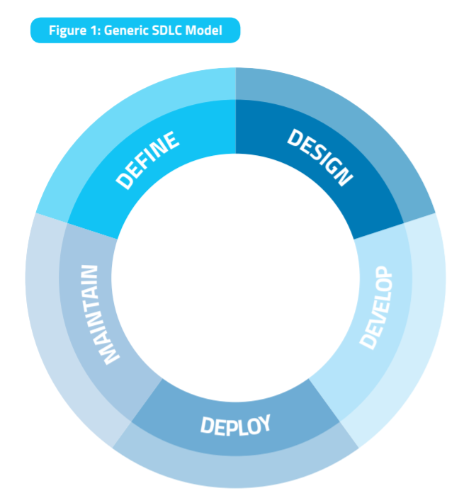
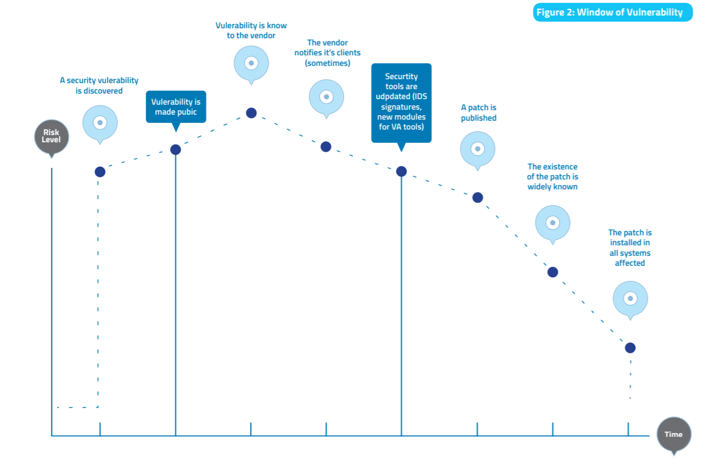
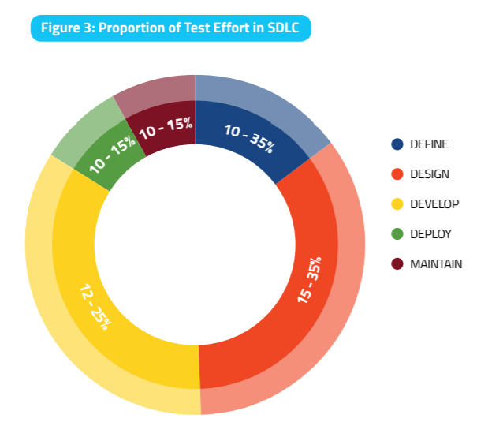
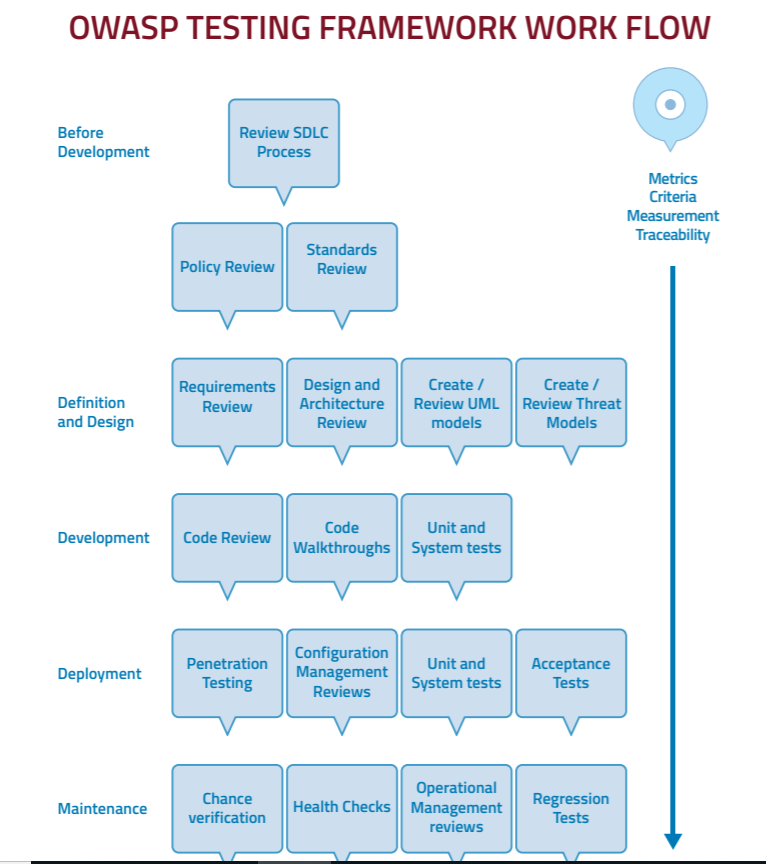

# 第1讲 WEB安全测试基本概念

软件的安全性问题是我们这个时代最大的问题之一。戏剧性增长的Web应用促进了商业、社会进步，但他们中的大多数没有充分考虑安全性问题。

本课程主要参考：
- The OWASP Testing Guide v4.0
- [The OWASP Testing Guide v5.0](https://github.com/OWASP/wstg/tree/master/document)

### OWASP测试指南的意义
- 开发人员可以使用它写出安全的代码。测试指南中包含了标准代码和单元测试过程。
- 软件测试人员可以用它进行测试，发现脆弱性，提高效率。
- 安全专家可以使用该向导并结合别的技术来验证是否有漏掉的安全漏洞。
- 项目管理者可以思考该向导存在的原因，以及代码中、设计中由漏洞表明的安全问题的原因。


- 帮助组织了解测试程序的组成，并确定在web应用程序上构建和操作测试程序所需采取的步骤。
- 提供了一个全面的web应用程序安全程序所需元素的广泛视图。
- 可作为参考指南和方法，帮助确定现有实践和行业最佳实践之间的差距。
- 允许组织将自己与行业同行进行比较，了解测试和维护软件或准备审计所需的资源量。


**在执行安全测试时，最重要的事情是不断地重新确定优先级**。安全问题可能是无限多的，而企业的资源总是有限的，必须不断调整测试的重点，才能满足安全需求。

### 自动化工具的角色

不少组织提供了免费或收费的自动化工具，方便了我们开展测试活动。很多工具是非常诱人的（seductive），因为它们能够发现很多问题，同时还很高效。但要充分了解工具的限制，才能更好的应用它们。自动化工具能够发现很多通用的安全问题，但它们不能对你的应用有充分的认识，不能检查出更多的问题。经验表明，最严重的安全问题是那些不常见的，而是深度纠缠于业务逻辑中和自定义设计中的问题。一些严重问题是需要费时费力去发现和验证的，自动化工具往往不具备这样的能力，而此时就需要结合本书中所列的技术开展工作。

如果你在构建、设计或测试软件，我们强烈建议你熟悉 OWASP 的“安全测试向导”。它是一套很好的测试路线图，虽然它不能穷尽所有问题，但它已经覆盖了绝大多数常见问题。

### 测试基本概念

#### 什么是测试？
Testing is a process of comparing the state of a system or application against a set of criteria. In the security industry people frequently test against a set of mental criteria that are neither well defined nor complete. As a result of this, many outsiders regard security testing as a black art. 

#### 为什么测试？

#### 何时测试？

测试的一条原则是:早测试、多测试。

测试应当伴随着软件开发过程的始终，因为有各种各样的问题存在，且不时出现。



Companies should inspect their overall SDLC to ensure that security
is an integral part of the development process. SDLCs should include
security tests to ensure security is adequately covered and controls
are effective throughout the development process.

#### 测试什么？

An effective testing program should have components that test:
- People – to ensure that there is adequate education and awareness;
- Process – to ensure that there are adequate policies and standards and that people know how to follow these policies;
- Technology – to ensure that the process has been effective in its implementation.

#### 测试基本原则
- There is no Silver Bullet
- Think Strategically, Not Tactically



- The SDLC is King
- Test Early and Test Often
- Understand the Scope of Security
  - 受保护的信息和资产应该进行分类（e.g., confidential, secret, top secret). 
  - 国内可根据等级保护分级分类。
- Develop the Right Mindset
  - 正常思路和异常思路都要有。
- Understand the Subject
- Use the Right Tools
- The Devil is in the Details
- Use Source Code When Available
- Develop Metrics
  -  It is important to track the results of testing engagements, and develop metrics that will reveal the application security trends within the organization.
  -  Good metrics will show:
     -  If more education and training are required;
     -  If there is a particular security mechanism that is not clearly understood by the development team;
     -  If the total number of security related problems being found each month is going down.
- Document the Test Results

### Testing Techniques

This section presents a high-level overview of various testing techniques that can be employed when building a testing program. 

主要包括以下几类：
- 手动检查和复查 Manual Inspections & Reviews
- 威胁建模 Threat Modeling
- 代码检查 Code Review
- 渗透测试 Penetration Testing

#### 手动检查

Advantages:
- Requires no supporting technology
- Can be applied to a variety of situations
- Flexible
- Promotes teamwork
- Early in the SDLC


Disadvantages:
- Can be time consuming
- Supporting material not always available
- Requires significant human thought and skill to be effective

#### 威胁建模

Threat modeling has become a popular technique to help system designers think about the security threats that their systems and applications might face. Therefore, threat modeling can be seen as risk assessment for applications.

为了开发威胁模型，推荐使用一些方法：
- NIST 800-30 风险管理标准。常见步骤/方法有：
  - 解构应用
  - 定义和分类资产
  - 探索潜在脆弱性
  - 探索潜在威胁
  - 生成缓解策略
- 有关风险管理的国家标准

Advantages:
- Practical attacker’s view of the system
- Flexible
- Early in the SDLC


Disadvantages:
- Relatively new technique
- Good threat models don’t automatically mean good software

#### 源代码审查

Advantages:
- Completeness and effectiveness
- Accuracy
- Fast (for competent reviewers)
Disadvantages:
- Requires highly skilled security developers
- Can miss issues in compiled libraries
- Cannot detect run-time errors easily
- The source code actually deployed might differ from the one
being analyzed

#### Penetration Testing
Advantages:
- Can be fast (and therefore cheap)
- Requires a relatively lower skill-set than source code review
- Tests the code that is actually being exposed
Disadvantages:
- Too late in the SDLC
- Front impact testing only

#### 各种方法需要平衡/结合
It can be difficult to understand which techniques to use and when to use them. Experience shows that there is no right or wrong answer to the question of exactly what techniques should be used to build a testing framework. In fact all techniques should probably be used to test all the areas that need to be tested.

很多公司喜欢使用一种方法，那就是渗透测试，但这个方法是"too little , too late" in SDLC。

The correct approach is a balanced approach that includes several
techniques, from manual reviews to technical testing. A balanced
approach should cover testing in all phases of the SDLC. This approach leverages the most appropriate techniques available depending on the current SDLC phase



### 获取安全测试需求 Deriving Security Test Requirements

To have a successful testing program, one must know what the testing objectives are. These objectives are specified by the security requirements. 

如何通过适用标准和规定，提取安全测试需求并文档化？

- 明确测试目标
- 理解业务需求
- 符合安全标准、规定、策略
- 历史事件
- 最佳实践案例和误用案例


### Security Tests Integrated in Development and Testing Workflows


### Security Test Data Analysis and Reporting

---

## OWASP 测试框架

下面介绍一个典型的测试框架，可用于开发一个组织自定义的完整测试框架，它由软件开发生命周期中多种技术和不同阶段的任务共同构成。

To improve the security of applications, the security quality of the software must be improved. That means testing the security at the definition, design, develop, deploy, and maintenance stages, and not relying on the costly strategy of waiting until code is completely built.

OWASP提出了一个基于SDLC的安全测试框架，它不是一个特殊的软件开发方法，而是可与通用软件开发方法相结合的测试方案。这个测试框架由下面一些活动组成：
- Phase 1 开始开发前阶段
- Phase 2 定义与设计阶段
- phase 3 开发阶段
- Phase 4 部署阶段
- Phase 5 维护和运行阶段

### Phase 1: Before Development Begins

#### Define a SDLC

在应用程序开发开始之前，必须定义一个充分的SDLC过程，其中安全性在每个阶段都是固有的。

#### Review policies and standards

在开发前，要确保有正确策略、标准、文档。文档对于开发过程和安全测试来说都非常重要，它为开发团队有法可依、有章可循。

People can only do the right thing if they know what the right thing is.

例如：如果适用Java开发，那么有一份Java安全编码标准就非常重要；如果应用需要加密，那么有一份加密标准就非常重要。

#### 开发度量、度量标准、可追溯性 Develop measurement and metrics criteria and ensure traceability

开发开始前，要规划一个度量方法。通过定义度量标准，为软件过程和产品提供可观察的指标。在开发开始之前定义度量是很重要的，因为可能需要修改流程以捕获数据。

### Phase 2: During Definition and Design
#### 安全需求复查

安全需求从安全角度定义了一个应用软件如何工作。安全需求也必须经过测试、验证，要确定之前定义的安全需求与现实情况相符，没有逻辑上的错误。

为了查找安全需求之间的问题，重点考虑检查以下安全机制：
- User Management
- Authentication
- Authorization
- Data Confidentiality
- Integrity
- Accountability
- Session Management
- Transport Security
- Tiered System Segregation
- Legislative and standards compliance (including Privacy, Government and Industry standards)

#### 复查设计和架构

应用应当有一个文本化的设计和架构，以便审查和交流。

在设计阶段识别安全问题，不仅是最高性价比的阶段，而且可能是改善安全性最有效果的阶段。

#### 生成并复查UML模型

一旦设计和架构被确定，就可以构建Unified Modeling Language models。UML模型用来描述应用如何工作。通过构建这个模型并复查模型，可以发现一些安全问题，以便及时修复或更改设计。

#### 生成和复查威胁模型

有了设计和架构复查、UML模型对系统流程的清晰表述，接下来就要建立一个适当的威胁模型、开发现实的威胁场景。分析设计和体系结构，确保这些威胁已得到缓解、被业务部门接受或分配给第三方，如保险公司。

当发现有威胁没有可用的缓解策略时，那就需要重新修改设计和架构。

### Phase 3: During Development

Theoretically, 开发是实现设计，但现实中许多设计决策是在开发过程中确定的。开发人员在没有规范、策略和详细设计时，面临着众多的选择。其中的一些选择很可能引入安全问题。

#### 代码走查 code walk through

安全团队需要同开发人员一起，对已开发的代码进行走查。即便是概要层面的代码走查也是非常有价值的。代码走查的目的不是代码复查，而是理解较高层面的执行过程、层面、代码结构等，以及了解为什么如此编码实现。

#### 代码复查 code review

之前的代码走查是对代码的工作过程有较好的理解，而代码复查这一步是对重要的代码模块进行分析。

静态代码分析在验证代码是有下列检查列表：
- 业务需求的可用性、完整性、机密性。Business requirements for availability, confidentiality, and integrity.
- OWASP Guide or Top 10 Checklists for technical exposures (depending on the depth of the review).
- Specific issues relating to the language or framework in use, such as the Scarlet paper for PHP or Microsoft Secure Coding checklists for ASP.NET.
- Any industry specific requirements, such as Sarbanes-Oxley 404, COPPA, ISO/IEC 27002, APRA, HIPAA, Visa Merchant guidelines, or other regulatory regimes.
- 国内相关安全编码标准。

### Phase 4: During Deployment

#### 应用渗透测试

渗透测试使用了非常规思维和逆向思维，引入非对称攻击方式，有利于在之前测试工作的基础上进行安全问题的发现。

#### 配置管理测试

当我们认为一个应用程序安全时，用户的某个配置失误，还会使整个系统变得脆弱。

### Phase 5: Maintenance and Operations

#### 执行操作管理复查

需要有一个适当的流程，详细说明如何管理应用程序和基础架构的操作。

#### 执行周期性的健康检查

应每月或每季度对应用程序和基础设施进行健康检查，以确保没有引入新的安全风险，并且安全级别仍然保持不变。

#### 确保变更验证

在QA环境中批准和测试每个变更并部署到生产环境中之后，检查变更以确保安全级别不受变更的影响是至关重要的。这应该整合到变更管理过程中。

### 典型的SDLC测试流 A Typical SDLC Testing Workflow 




---

下面将描述12个web应用渗透测试方法。

## Web应用渗透测试介绍和目标

这部分描述了OWASP WEB APPLICATION 安全测试方法论，并解释如何测试脆弱性证据。

- 什么是Web application 安全测试？
  - 安全测试是检验系统安全状态，验证安全控制是否有效的过程。


- 什么是脆弱性？
  - A vulnerability is a flaw or weakness in a system's design, implementation, operation or management that could be exploited to compromise the system's security objectives.
  

- 什么是威胁？
  - A threat is anything (a malicious external attacker, an internal user, a system instability, etc) that may harm the assets owned by an application (resources of value, such as the data in a database or in the file system) by exploiting a vulnerability.


- 什么是测试？
  - A test is an action to demonstrate that an application meets the security requirements of its stakeholders.


- 什么是OWASP测试方法论？
  - The OWASP Web Application Security Testing method is based on the black box approach. The tester knows nothing or has very little information about the application to be tested.
  - The testing model consists of：
    - Tester: Who performs the testing activities
    - Tools and methodology: The core of this Testing Guide project
    - Application: The black box to test
  - Testing can be categorized as passive or active。

### Passive Testing
被动测试中，测试人员尝试理解应用的逻辑，并作为用户浏览应用。

测试工具主要是信息收集类工具，例如，使用HTTP代理观察HTTP请求和响应。

在被动测试结束时，测试人员应当理解所有的访问点（应用提供的“门”），例如：HTTP headers、parameters、cookies。信息收集工具可以使用google developer tool，burpsuite, ...

例如，测试人员可能发现了一个URL如下的页面：

```https://www.example.com/login/Authentic_Form.html```

其中包含了认证表单信息。

### Active Testing

在主动测试中，测试人员要使用下列方法进行测试，我们将其分为11个子类，共91个控制项：
- 信息收集
- 控制和部署管理测试 Configuration and Deployment Management Testing
- 身份管理测试 Identity Management Testing
- 认证测试 Authentication Testing
- 授权测试 Authorization Testing
- 会话管理测试 Session Management Testing
- 输入验证测试 Input Validation Testing
- 错误控制 Error Handling
- 加密 Cryptography
- 业务逻辑测试 Business Logic Testing
- 客户端测试 Client Side Testing


### Checklist

The following is the list of controls to test during the assessment:

| Ref. No. | Category     | Test Name                  |
|----------|--------------|----------------------------|
| **4.2**  | **WSTG-INFO** | **Information Gathering**  |
| 4.2.1    | WSTG-INFO-001 | Conduct Search Engine Discovery and Reconnaissance for Information Leakage |
| 4.2.2    | WSTG-INFO-002 | Fingerprint Web Server |
| 4.2.3    | WSTG-INFO-003 | Review Webserver Metafiles for Information Leakage |
| 4.2.4    | WSTG-INFO-004 | Enumerate Applications on Webserver |
| 4.2.5    | WSTG-INFO-005 | Review Webpage Comments and Metadata for Information Leakage |
| 4.2.6    | WSTG-INFO-006 | Identify application entry points |
| 4.2.7    | WSTG-INFO-007 | Map execution paths through application |
| 4.2.8    | WSTG-INFO-008 | Fingerprint Web Application Framework |
| 4.2.9    | WSTG-INFO-009 | Fingerprint Web Application |
| 4.2.10   | WSTG-INFO-010 | Map Application Architecture  |
| **4.3**    | **WSTG-CONFIG** | **Configuration and Deploy Management Testing** |
| 4.3.1    | WSTG-CONFIG-001 | Test Network/Infrastructure Configuration |
| 4.3.2    | WSTG-CONFIG-002 | Test Application Platform Configuration |
| 4.3.3    | WSTG-CONFIG-003 | Test File Extensions Handling for Sensitive Information |
| 4.3.4    | WSTG-CONFIG-004 | Backup and Unreferenced Files for Sensitive Information |
| 4.3.5    | WSTG-CONFIG-005 | Enumerate Infrastructure and Application Admin Interfaces  |
| 4.3.6    | WSTG-CONFIG-006 | Test HTTP Methods |
| 4.3.7    | WSTG-CONFIG-007 | Test HTTP Strict Transport Security |
| 4.3.8    | WSTG-CONFIG-008 | Test RIA cross domain policy |
| **4.4**  | **WSTG-IDENT**  | **Identity Management Testing** |
| 4.4.1    | WSTG-IDENT-001  | Test Role Definitions |
| 4.4.2    | WSTG-IDENT-002  | Test User Registration Process |
| 4.4.3    | WSTG-IDENT-003  | Test Account Provisioning Process |
| 4.4.4    | WSTG-IDENT-004  | Testing for Account Enumeration and Guessable User Account |
| 4.4.5    | WSTG-IDENT-005  | Testing for Weak or unenforced username policy |
| 4.4.6    | WSTG-IDENT-006  | Test Permissions of Guest/Training Accounts |
| 4.4.7    | WSTG-IDENT-007  | Test Account Suspension/Resumption Process  |
| **4.5**  | **WSTG-AUTHN**  | **Authentication Testing** |
| 4.5.1    | WSTG-AUTHN-001  | Testing for Credentials Transported over an Encrypted Channel |
| 4.5.2    | WSTG-AUTHN-002  | Testing for default credentials |
| 4.5.3    | WSTG-AUTHN-003  | Testing for Weak lock out mechanism |
| 4.5.4    | WSTG-AUTHN-004  | Testing for bypassing authentication schema |
| 4.5.5    | WSTG-AUTHN-005  | Test remember password functionality |
| 4.5.6    | WSTG-AUTHN-006  | Testing for Browser cache weakness |
| 4.5.7    | WSTG-AUTHN-007  | Testing for Weak password policy |
| 4.5.8    | WSTG-AUTHN-008  | Testing for Weak security question/answer |
| 4.5.9    | WSTG-AUTHN-009  | Testing for weak password change or reset functionalities |
| 4.5.10   | WSTG-AUTHN-010  | Testing for Weaker authentication in alternative channel |
| **4.6**  | **WSTG-AUTHZ** | **Authorization Testing** |
| 4.6.1    | WSTG-AUTHZ-001 | Testing Directory traversal/file include |
| 4.6.2    | WSTG-AUTHZ-002 | Testing for bypassing authorization schema |
| 4.6.3    | WSTG-AUTHZ-003 | Testing for Privilege Escalation |
| 4.6.4    | WSTG-AUTHZ-004 | Testing for Insecure Direct Object References |
| **4.7**  | **WSTG-SESS**  | **Session Management Testing** |
| 4.7.1    | WSTG-SESS-001  | Testing for Bypassing Session Management Schema |
| 4.7.2    | WSTG-SESS-002  | Testing for Cookies attributes |
| 4.7.3    | WSTG-SESS-003  | Testing for Session Fixation |
| 4.7.4    | WSTG-SESS-004  | Testing for Exposed Session Variables |
| 4.7.5    | WSTG-SESS-005  | Testing for Cross Site Request Forgery |
| 4.7.6    | WSTG-SESS-006  | Testing for logout functionality |
| 4.7.7    | WSTG-SESS-007  | Test Session Timeout |
| 4.7.8    | WSTG-SESS-008  | Testing for Session puzzling |
| **4.8**  | **WSTG-INPVAL** | **Data Validation Testing** |
| 4.8.1    | WSTG-INPVAL-001 | Testing for Reflected Cross Site Scripting |
| 4.8.2    | WSTG-INPVAL-002 | Testing for Stored Cross Site Scripting |
| 4.8.3    | WSTG-INPVAL-003 | Testing for HTTP Verb Tampering |
| 4.8.4    | WSTG-INPVAL-004 | Testing for HTTP Parameter pollution |
| 4.8.5    | WSTG-INPVAL-005 | Testing for SQL Injection |
| 4.8.5.1  |                | Oracle Testing |
| 4.8.5.2  |                | MySQL Testing |
| 4.8.5.3  |                | SQL Server Testing |
| 4.8.5.4  |                | Testing PostgreSQL |
| 4.8.5.5  |                | MS Access Testing |
| 4.8.5.6  |                | Testing for NoSQL injection |
| 4.8.6    | WSTG-INPVAL-006 | Testing for LDAP Injection |
| 4.8.7    | WSTG-INPVAL-007 | Testing for ORM Injection |
| 4.8.8    | WSTG-INPVAL-008 | Testing for XML Injection |
| 4.8.9    | WSTG-INPVAL-009 | Testing for SSI Injection |
| 4.8.10   | WSTG-INPVAL-010 | Testing for XPath Injection |
| 4.8.11   | WSTG-INPVAL-011 | IMAP/SMTP Injection |
| 4.8.12   | WSTG-INPVAL-012 | Testing for Code Injection |
| 4.8.12.1 |                | Testing for Local File Inclusion |
| 4.8.12.2 |                | Testing for Remote File Inclusion |
| 4.8.13   | WSTG-INPVAL-013 | Testing for Command Injection |
| 4.8.14   | WSTG-INPVAL-014 | Testing for Buffer overflow |
| 4.8.14.1 |                | Testing for Heap overflow |
| 4.8.14.2 |                | Testing for Stack overflow |
| 4.8.14.3 |                | Testing for Format string |
| 4.8.15   | WSTG-INPVAL-015 | Testing for incubated vulnerabilities |
| 4.8.16   | WSTG-INPVAL-016 | Testing for HTTP Splitting/Smuggling |
| **4.9**  | **WSTG-ERR**    | **Error Handling** |
| 4.9.1    | WSTG-ERR-001    | Analysis of Error Codes |
| 4.9.2    | WSTG-ERR-002    | Analysis of Stack Traces |
| **4.10** | **WSTG-CRYPST** | **Cryptography** |
| 4.10.1   | WSTG-CRYPST-001 | Testing for Weak SSL/TSL Ciphers, Insufficient Transport Layer Protection  |
| 4.10.2   | WSTG-CRYPST-002 | Testing for Padding Oracle |
| 4.10.3   | WSTG-CRYPST-003 | Testing for Sensitive information sent via unencrypted channels |
| **4.11** | **WSTG-BUSLOGIC** | **Business Logic Testing** |
| 4.11.1   | WSTG-BUSLOGIC-001 | Test Business Logic Data Validation |
| 4.11.2   | WSTG-BUSLOGIC-002 | Test Ability to Forge Requests |
| 4.11.3   | WSTG-BUSLOGIC-003 | Test Integrity Checks |
| 4.11.4   | WSTG-BUSLOGIC-004 | Test for Process Timing |
| 4.11.5   | WSTG-BUSLOGIC-005 | Test Number of Times a Function Can be Used Limits |
| 4.11.6   | WSTG-BUSLOGIC-006 | Testing for the Circumvention of Work Flows |
| 4.11.7   | WSTG-BUSLOGIC-007 | Test Defenses Against Application Misuse |
| 4.11.8   | WSTG-BUSLOGIC-008 | Test Upload of Unexpected File Types |
| 4.11.9   | WSTG-BUSLOGIC-009 | Test Upload of Malicious Files |
| **4.12** | **WSTG-CLIENT** | **Client Side Testing** |
| 4.12.1   | WSTG-CLIENT-001 | Testing for DOM based Cross Site Scripting |
| 4.12.2   | WSTG-CLIENT-002 | Testing for JavaScript Execution |
| 4.12.3   | WSTG-CLIENT-003 | Testing for HTML Injection |
| 4.12.4   | WSTG-CLIENT-004 | Testing for Client Side URL Redirect |
| 4.12.5   | WSTG-CLIENT-005 | Testing for CSS Injection |
| 4.12.6   | WSTG-CLIENT-006 | Testing for Client Side Resource Manipulation |
| 4.12.7   | WSTG-CLIENT-007 | Test Cross Origin Resource Sharing |
| 4.12.8   | WSTG-CLIENT-008 | Testing for Cross Site Flashing |
| 4.12.9   | WSTG-CLIENT-009 | Testing for Clickjacking |
| 4.12.10  | WSTG-CLIENT-010 | Testing WebSockets |
| 4.12.11  | WSTG-CLIENT-011 | Test Web Messaging |
| 4.12.12  | WSTG-CLIENT-012 | Test Local Storage |
