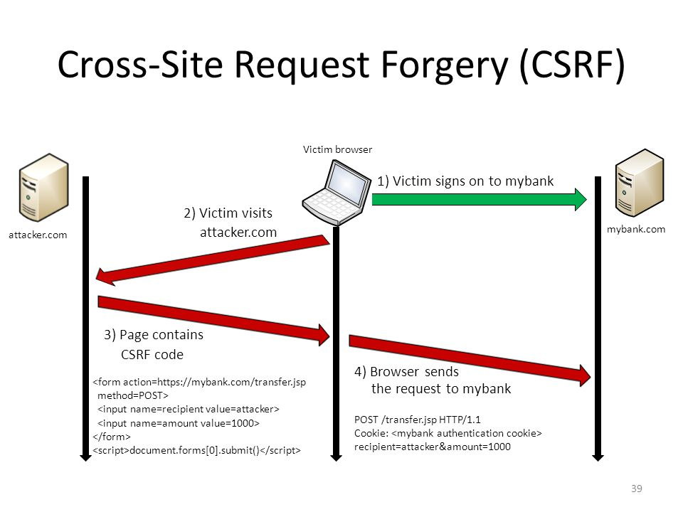

# 第7讲 会话管理类测试

任何基于web的应用程序的核心组件之一是它控制和维护与之交互的用户状态的机制。这称为会话管理。会话管理被定义为控制用户与基于web的应用程序之间的状态完全交互的所有控件集。这涵盖了从如何执行用户身份验证到用户注销时发生的一切。

HTTP是一种无状态协议，这意味着web服务器响应客户机请求时不会将它们相互链接。即使是简单的应用程序逻辑也要求用户的多个请求在“会话”中相互关联。这就需要第三方解决方案——通过现成的（OTS）中间件和web服务器解决方案，或者定制的开发实现。大多数流行的web应用程序环境（如ASP和PHP）为开发人员提供了内置的会话处理例程。通常会发出某种标识令牌，称为“会话ID”或Cookie。

web应用程序可以通过多种方式与用户交互。具体采用哪种取决于站点的性质、应用程序的安全性和可用性要求。虽然有一些公认的应用程序开发最佳实践，如构建安全Web应用程序的OWASP指南中概述的实践，但是在提供者的需求和期望的上下文中考虑应用程序安全性是很重要的。

在本节，有以下子类测试内容：
- 会话管理模式测试 Testing for Session Management Schema
- Cookies属性测试 Testing for Cookies Attributes
- 会话安装测试 Testing for Session Fixation
- 暴露的会话变量测试Testing for Exposed Session Variables
- 跨站请求伪造测试 Testing for Cross Site Request Forgery
- 用户退出功能测试 Testing for Logout Functionality
- 会话超时测试 Testing Session Timeout
- 会话困境测试 Testing for Session Puzzling

## 会话管理模式测试 Testing for Session Management Schema

ID:WSTG-SESS-01

### 概述

为了避免用户访问每个页面时都进行验证，web应用使用了各种机制来存储，并在预定时间内验证身份凭据。

Cookies用于实现会话管理，并在RFC 2965中进行了详细描述。简而言之，当用户访问需要跟踪多个请求中该用户的操作和身份的应用程序时，将使用cookie（或多个cookie）。由服务器生成并发送给客户端。然后，客户端将通过以下所有连接将cookie发送回服务器，直到cookie过期或被破坏为止。Cookie中存储的数据可以向服务器提供有关用户是谁，到目前为止他已执行了哪些操作，他的偏好是什么等的大量信息，因此为无状态协议（如HTTP）提供了状态。

在线购物车提供了一个典型示例。在整个用户会话期间，应用程序必须跟踪其身份，个人资料，选择购买的产品，数量，单个价格，折扣等。Cookie是一种有效的存储和传递信息的方式来回信息（其他方法是URL参数和隐藏字段）。

由于它们存储的数据的重要性，因此cookie对应用程序的整体安全性至关重要。能够篡改cookie可能会导致劫持合法用户的会话，在活动会话中获得更高的特权，并且通常会以未经授权的方式影响应用程序的操作。

在此测试中，测试人员必须检查发布给客户端的cookie是否可以抵抗旨在干扰合法用户会话和应用程序本身的各种攻击。总体目标是能够伪造一个cookie，该cookie将被应用程序视为有效，并且将提供某种未经授权的访问（会话劫持，特权提升等）。

通常，攻击模式的主要步骤如下：
- cookie 收集（Cookie Collection），收集足够数量的cookie样本
- cookie 逆向工程（cookie reverse engineering），cookie生成算法分析
- cookie 操作（cookie manipulation），伪造有效的cookie以执行攻击。这最后一步可能需要进行大量尝试，具体取决于cookie的创建方式。

- 还有一种攻击方式是溢出cookie。目标是使存储区域溢出，从而干扰应用程序的正确行为，并可能注入远程执行恶意代码。

### 测试方法

#### 黑盒测试

客户端和应用程序之间的所有交互，都至少应该进行以下测试：
- 是否所有的 Set-Cookies 标记为 Secure ？
- 是否存在非加密传输 Cookie 操作 ？
- Cookie能否强制经非加密信道传输？
- 如果存在非加密传输，应用如何维护安全性？
- 所有cookies 是持久化的么？
- 怎样的 Expires = times 被使用在持久化cookies上，有什么理由？
- 准备传输的 cookies 是怎样配置的？
- 什么样的 HTTP/1.1 Cache-Control 设置被用于保护 cookie？
- 什么样的 HTTP/1.0 Cache-Control 设置被用于保护 cookie？

##### Cookie Collection

操作cookie的第一步是了解应用程序如何创建和管理cookie。对于此任务，测试人员必须尝试弄清以下问题：
- 该应用程序使用了多少Cookie？
  - 浏览应用程序，注意创建cookie的时间；
  - 列出接收到的cookie，设置它们的页面（使用set-cookie伪指令），cookie有效的域，它们的值及其特征。
- 应用程序的哪些部分生成或修改Cookie？
  - 浏览该应用程序，找出哪些cookie保持不变，哪些被修改。哪些事件会修改Cookie？
- 应用程序的哪些部分需要此cookie才能被访问和利用？
  - 找出应用程序的哪些部分需要Cookie才能访问页面；
  - 然后在没有cookie或没有cookie值的情况下重试。
  - 确定页面与所用cookie的映射关系。

本阶段的重要输出是每个cookie与相关应用部分或页面的关系表格。

##### 会话分析

应该检查会话令牌TOKEN（cookie，sessionid，或某些隐藏字段），从安全角度确保其质量。根据随机性、唯一性、对统计和密码分析的抵抗能力、以及信息泄露的可能性等方面对其进行测试。

###### 令牌结构和信息泄露 Token Structure & Information Leakage

**第一阶段是检查应用使用会话id的结构和内容**。一个常见的错误是在会话令牌中包含特定的数据，而不是在服务器端使用通用值和引用实际数据。

- 如果sessionid是纯文本，则结构和相关数据可能会立即显而易见，如下所示：```192.168.100.1:owaspuser:password:15:58```
- 如果部分或全部令牌看起来像某种编码或散列值，则应将其与各种技术进行比较，检查是否存在明显的混淆。例如：字符串“192.168.100.1:owaspuser:password:15:58” 使用16进制表达，以及使用MD5 hash：
  - Hex 3139322E3136382E3130302E313A6F77617370757365723A70617373776F72643A31353A3538
  - Base64 MTkyLjE2OC4xMDAuMTpvd2FzcHVzZXI6cGFzc3dvcmQ6MTU6NTg=
  - MD5 01c2fc4f0a817afd8366689bd29dd40a

识别出混淆的类型后，尝试解码还原原始数据。但在大多数情况下这不可能的。即使这样，从消息格式中枚举适当的编码可能还是有用的。此外，如果可以推断出格式和混淆技术，则可以设计出自动暴力攻击。

混合令牌可以包括诸如IP地址或用户ID之类的信息以及编码部分，如下所示：```owaspuser:192.168.100.1:a7656fafe94dae72b1e1487670148412```

分析了单个会话令牌后，应检查代表性样本。对令牌的简单分析应立即揭示任何明显的模式。例如，32位令牌可以包括16位静态数据和16位可变数据。这可能表明前16位代表用户的固定属性，例如用户名或IP地址。如果第二个16位块以规则的速率递增，则它可以指示令牌生成的顺序甚至基于时间的元素。参见示例。

**第二阶段是在分析了单一会话令牌后，检查代表性样本**。对令牌的简单分析目标是找出任何明显的模式，例如：32位令牌可以包含16位的静态数据和16位可变数据。这可能表明前16位代表了用户的固定属性，如地址或用户名；第二个16位块以规则的速率增长，则它可能指示了令牌生成的顺序或者是基于时间的元素。

如果能够识别出令牌的静态元素，则应该多收集一些样本，一次改变一个潜在的输入元素。例如，通过不同的用户账户进行登录尝试，或从不同的ip地址登录，有可能发现之前出现的会话id的静态部分。

在单一或多个会话id结构测试中，至少应该理清下面内容：
- Session ID的哪一部分是静态的？
- 在 Session ID 中有哪些明文凭据信息？例如：username、UID、IP address？
- Session ID 中有什么容易解码的凭据信息？
- Session ID 结构中，有哪些可以被去掉？
- 对于相同的登录条件，Session ID  的哪些部分是静态的？
- Session ID整体或单个部分中存在哪些明显的模式？

###### 会话ID的可预测性和随机性

应该对会话ID的可变区域（如果有）进行分析，以确定是否存在任何可识别或可预测的模式。

这些分析可以手动执行，也可以使用定制或OTS统计或密码分析工具来推断出Session ID内容中的任何模式。手动检查应包括针对相同登录条件（例如，相同的用户名，密码和IP地址）发出的会话ID的比较。

时间是必须控制的重要因素。为了在同一时间窗口中收集样本并使该变量保持恒定，应进行大量的同时连接。甚至50ms或更小的时间间隔也可能太粗糙，以这种方式获取的样本可能会显示基于时间的成分，否则这些成分将被遗漏。

应随时间分析可变元素，以确定它们是否本质上是增量的。如果它们是增量的，则应研究与绝对或经过时间有关的模式。许多系统使用时间作为其伪随机元素的种子。在模式看似随机的情况下，应考虑时间的单向散列或其他环境变化。通常，加密哈希的结果是十进制或十六进制数，因此应可识别。

在分析会话ID序列、模式、循环周期时，应将静态元素和客户端依赖都视为应用程序的结构和功能的构成因素。
- Session IDs 是随机的么？能否重新生成这个Session IDs值么？
- 相同输入条件在后续运行中是否产生同样的 session id ？
- Session ID 是否被证明可以抵抗统计或密码分析？
- Session ID 的哪些部分是可预测的？
- Session ID 的哪些部分是与时间相关的？
- 在完全了解生成算法和之前Session ID的情况下，是否可以推断出下一个Session ID？

##### Cookie 逆向工程

测试人员枚举了cookies后，对其有了一定的了解，下面对其进行深入分析。

为了能够提供安全的会话管理，cookies必须具有多个特征，每个特征保护cookie免受不同类别的攻击。

cookies必须的特征包括：
- 不可预测性：Cookie必须包含一些难以猜测的数据。伪造有效的cookie越困难，闯入合法用户的会话就越困难。如果攻击者可以猜测合法用户的活动会话中使用的cookie，则他们将能够完全模拟该用户（会话劫持）。为了使Cookie不可预测，可以使用随机值或密码术。
- 防篡改：cookie必须抵制恶意的修改尝试。如果测试人员收到像IsAdmin = No这样的cookie，则对其进行修改以获取管理权限是微不足道的，除非应用程序执行仔细检查（例如，在cookie后面附加其值的加密哈希值）。
- 到期过期：关键cookie必须仅在适当的时间段内有效，并且之后必须从磁盘或内存中删除，以避免被重播的风险。这不适用于存储需要在各个会话之间记住的非关键数据的Cookie（例如，网站外观）。
- “安全”标志：其值对会话的完整性至关重要的cookie应该启用此标志，以使其仅在加密通道中传输以阻止窃听。

需要有足够多的样本，才能较为全面分析并得到结果。

要特别注意应用程序的工作流程，因为会话的状态可能会对收集到的cookie产生重大影响。在认证之前收集的cookie与认证之后获得的cookie可能有很大的不同。

要考虑的另一个方面是时间。当时间可能在cookie的值中起作用时，请始终记录获得cookie的确切时间（服务器可以将时间戳用作cookie值的一部分）。记录的时间可以是本地时间或HTTP响应中包含的服务器时间戳（或两者）。

在分析收集到的值时，测试人员应尝试找出所有可能影响cookie值的变量，并尝试一次更改它们。将相同Cookie的修改版本传递给服务器，对理解应用程序如何读取和处理Cookie很有帮助。

在此阶段要执行的检查示例包括：
- Cookie中使用什么字符集？cookie有数字值吗？字母数字？十六进制？如果测试人员插入不属于预期字符集的Cookie字符，会发生什么情况？
- cookie是否由包含不同信息的不同子部分组成？各个部分如何分离？使用哪个定界符？Cookie的某些部分可能具有较高的方差，其他部分可能是恒定的，其他部分可能仅假设一组有限的值。将Cookie分解为其基本组成部分是第一步，也是基础步骤。

下面的例子是一个容易识别其结构的cookie示例：```ID=5a0acfc7ffeb919:CR=1:TM=1120514521:LM=1120514521:S=j3am5KzC4v01ba3q```

此示例显示了5个不同的字段，它们携带不同类型的数据：
- ID :十六进制
- CR :小整数
- TM和LM :大整数。（奇怪的是，它们具有相同的值。值得一看的是修改其中之一会发生什么）
- S :字母数字

有的应用所使用的 session id没有分隔符，但收集多了还是能看出一些结构，例如：```0123456789abcdef```

##### 暴力穷举攻击

暴力攻击不可避免地源于与可预测性和随机性有关的问题。必须将会话ID中的差异与应用程序会话持续时间和超时一起考虑。如果会话ID内的变化相对较小，并且会话ID的有效性较长，则成功进行暴力攻击的可能性会更高。

较长的会话ID（或者说是具有很大差异的会话ID）和较短的有效期将使成功进行暴力攻击更加困难。
- 对所有可能的会话ID进行暴力攻击需要多长时间？
- 会话ID空间是否足够大以防止暴力破解？例如，与有效寿命相比，钥匙的长度是否足够？
- 具有不同会话ID的连接尝试之间的延迟是否减轻了这种攻击的风险？

#### 灰盒测试

如果测试人员能够访问有关会话管理模式的源程序，它们可以检查下列情况：
- 随机 session token
  - 发出给客户端的会话ID或Cookie不应轻易预测（不要使用基于可预测变量（例如客户端IP地址）的线性算法）。鼓励使用密钥长度为256位的加密算法（例如AES）。
- token 长度
  - 会话ID至少应包含50个字符。
- session time-out
- cookie configuration
  - 非持久性: 仅保存在内存中
  - 加密性 (set only on HTTPS channel): 例如```Set-Cookie: cookie=data; path=/; domain=.aaa.it; secure```
  - HTTPOnly (not readable by a script): 例如```Set-Cookie: cookie=data; path=/; domain=.aaa.it; HttpOnly```

### 工具

- OWASP Zed Attack Proxy Project (ZAP) - features a session token analysis mechanism.
- Burp Sequencer
- YEHG's JHijack

### 参考

RFC 2965 “HTTP State Management Mechanism”
RFC 1750 “Randomness Recommendations for Security”
Michal Zalewski: “Strange Attractors and TCP/IP Sequence Number Analysis” (2001)
Michal Zalewski: “Strange Attractors and TCP/IP Sequence Number Analysis - One Year Later” (2002)
Correlation Coefficient
ENT
https://seclists.org/lists/fulldisclosure/2005/Jun/0188.html
Gunter Ollmann: “Web Based Session Management”
OWASP Code Review Guide

## Cookies属性测试 Testing for Cookies Attributes

ID : WSTG-SESS-02

### 概述

Cookies是恶意攻击者的关键攻击媒介，应用程序应当始终检查并保护它。浏览器中最常用的会话存储机制是cookie存储。服务器可以通过```Set-Cookie```在HTTP响应中包含标头或通过JavaScript 来设置Cookie 。使用Cookie可以出于多种原因，例如：
- 会话管理
- 个性化
- 追踪

为了保护cookie数据，业界已开发出有助于锁定这些cookie并限制其攻击面的方法。随着时间的流逝，cookie已成为Web应用程序的首选存储机制，因为它们在使用和保护方面具有极大的灵活性。

保护cookie的方法是：
- Cookie属性
- Cookie前缀

### 测试目标
测试人员应检查已设置的所有cookie，并且保证实施了正确的安全配置。

### 测试方法

下面，将讨论每个属性和前缀的描述。测试人员应验证应用程序是否正确使用了它们。可以使用拦截代理来查看Cookie，也可以通过查看浏览器的Cookie罐进行查看。

#### Cookie属性

##### Secure 属性
Secure属性告诉浏览器仅在通过安全通道发送请求时才发送cookie HTTPS。这将有助于防止cookie传递给未加密的请求。如果应用程序可以在两个访问HTTP和HTTPS攻击者可能能够将用户重定向到他们发送的cookie作为非保护请求的一部分。

##### HttpOnly属性
HttpOnly属性用于帮助防止会话泄漏之类的攻击，因为它不允许通过客户端脚本（例如JavaScript）访问cookie。但这并不限制XSS攻击的整个攻击面，因为攻击者仍然可以代替用户发送请求，但是极大地限制了XSS攻击向量的范围。

##### domain属性
Domain属性用于将Cookie的域与对其发出HTTP请求的服务器的域进行比较。如果域匹配或它是子域，则path接下来将检查该属性。

请注意，只有属于指定域的主机才能为该域设置cookie。此外，该domain属性不能是顶级域（例如.gov或.com），以防止服务器为另一个域设置任意cookie（例如为设置cookie owasp.org）。如果未设置domain属性，则将生成cookie的服务器的主机名用作的默认值domain。

例如，如果某个应用在app.mydomain.com未设置任何域属性的情况下设置了cookie，则该cookie将针对app.mydomain.com及其子域（例如hacker.app.mydomain.com）的所有后续请求重新提交，但不针对otherapp.mydomain.com。如果开发人员想要放宽此限制，则可以将domain属性设置为mydomain.com。在这种情况下，Cookie将发送到app.mydomain.com和mydomain.com子域的所有请求，例如和hacker.app.mydomain.com，甚至bank.mydomain.com。如果子域上存在易受攻击的服务器（例如，otherapp.mydomain.com），并且domain属性设置得过于宽松（例如，mydomain.com），则可以使用易受攻击的服务器在的整个范围内收集Cookie（例如会话令牌）mydomain.com。

##### Path 属性

除了domain之外，还可以指定cookie有效的URL path。如果域和路径匹配，则cookie将在请求中发送。与domain属性一样，如果path属性设置得过于宽松，则可能会使应用程序容易受到同一服务器上其他应用程序的攻击。例如，如果path属性设置为Web服务器root /，则应用程序cookie将被发送到同一域内的每个应用程序（如果多个应用程序位于同一服务器下）。同一服务器下多个应用程序的两个示例：
```
path=/bank
path=/private
path=/docs
path=/docs/admin
```

##### Expires 属性

Expires属性用于：
- 设置持久的cookie
- 限制过长的会话生命期
- 通过将Cookie设置为过去的日期，来强制删除Cookie

与 session cookies不同，浏览器将使用 persistent cookies ，直到cookie过期为止。一旦过期日期超过了设置的时间，浏览器将删除cookie。

##### SameSite属性
该SameSite属性用于断言不应将cookie与跨站点请求一起发送。此功能允许服务器减轻跨组织信息泄漏的风险。在某些情况下，它也可以用作降低风险（或纵深防御机制）策略来防止跨站点请求伪造攻击。可以在三种不同的模式下配置此属性：
- Strict
- Lax
- None

###### Strict
该Strict值是的限制性最强的用法SameSite，允许浏览器仅将Cookie发送到第一方上下文，而无需顶级导航。换句话说，与Cookie关联的数据将仅在与浏览器URL栏上显示的当前站点匹配的请求上发送。Cookie不会根据第三方网站生成的请求发送。对于在相同域执行的操作，特别建议使用此值。但是，它可能具有某些局限性，因为某些会话管理系统会对用户导航体验产生负面影响。由于浏览器不会根据第三方域或电子邮件生成的任何请求发送cookie，因此即使用户已经具有经过身份验证的会话，也将要求用户再次登录。

###### Lax
该Lax值的限制不如Strict。如果URL等于cookie的域（第一方），即使链接来自第三方域，也将发送该cookie。大多数浏览器都将此值视为默认行为，因为它提供了比该Strict值更好的用户体验。它不会触发资产（例如图像），在这些资产中可能不需要cookie来访问它们。

###### None
该None值指定浏览器将发送跨站点请求的cookie（实施前的正常行为SamseSite）仅当Secure属性还可以用于，例如 SameSite=None; Secure。这是推荐值，而不是未指定任何SameSite值，因为它会强制使用secureattribute。

##### Cookie前缀

Cookie不具有保证存储在其中的信息的完整性和机密性的功能。这些限制使服务器无法对创建时如何设置给定cookie的属性充满信心。为了以向后兼容的方式为服务器提供此类功能，业界引入了一种概念，Cookie Name Prefixes以促进传递作为cookie名称一部分嵌入的此类详细信息。

###### Host Prefix

该```__Host-```前缀希望cookie满足以下条件：
- Cookie必须使用```Secure```属性设置。
- 必须从用户代理认为安全的URI设置cookie。
- 仅发送给设置cookie的主机，并且不得包含任何 ```Domain``` 属性。
- cookie必须使用值为的```Path```属性设置，```/```以便将其发送给主机的每个请求。

因此，```Set-Cookie: __Host-SID=12345; Secure; Path=/```将接受cookie ，而始终拒绝以下任何cookie ： ```Set-Cookie: __Host-SID=12345 Set-Cookie: __Host-SID=12345; Secure Set-Cookie: __Host-SID=12345; Domain=site.example Set-Cookie: __Host-SID=12345; Domain=site.example; Path=/ Set-Cookie: __Host-SID=12345; Secure; Domain=site.example; Path=/```

###### 安全前缀
的```__Secure-```前缀限制较少，并且可以通过将字符串，区分大小写被引入```__Secure-```到cookie的名称。任何与前缀匹配的cookie ```__Secure-```都应满足以下条件：
- Cookie必须使用```Secure```属性设置。
- 必须从用户代理认为安全的URI设置cookie。

##### 好的做法
根据应用程序的需要以及cookie的功能，必须应用属性和前缀。Cookie锁定/限定的越多越好。

综合所有这些，我们可以将最安全的cookie属性配置定义为：```Set-Cookie: __Host-SID=<session token>; path=/; Secure; HttpOnly; SameSite=Strict```。

### Tools 
- owasp zap
- burpsuite
- Tamper Data for FF Quantum
- “FireSheep” for FireFox
- “EditThisCookie” for Chrome
- “Cookiebro - Cookie Manager” for FireFox

## 会话安装测试 Testing for Session Fixation
ID : WSTG-SESS-03
### 概述

如果Web应用程序在成功进行用户身份验证后未更新其会话cookie，则有可能会发现会话固化的漏洞，并迫使用户利用攻击者已知的cookie。在这种情况下，攻击者可能会窃取用户会话（会话劫持）。

在以下情况下会发生会话固化漏洞：
- Web应用程序对用户进行身份验证时，没有令先前存在的session id无效，从而发生继续使用已经与该用户关联的会话ID的安全问题。
- 攻击者可以在用户身上强加一个已知的会话ID，一旦用户进行身份验证，攻击者就可以访问经过身份验证的会话。


在会话固化漏洞的一般利用中，攻击者在Web应用程序上创建一个新会话并记录相关的会话标识符。然后，攻击者使受害者使用相同的会话标识符针对服务器进行身份验证，从而使攻击者可以通过活动会话访问用户的帐户。

此外，上述问题对于通过HTTP发出会话标识符然后将用户重定向到HTTPS登录表单的站点来说是有问题的。如果在身份验证时未重新发出会话标识符，则攻击者可以窃听和窃取该标识符，然后使用它劫持会话。
### 如何测试

#### 黑盒
##### 会话固化漏洞测试

第一步，向被测web站点发送请求，如果测试人员的请求如下：```GET www.example.com```

他们将获取下列响应：
```
HTTP/1.1 200 OK
Date: Wed, 14 Aug 2008 08:45:11 GMT
Server: IBM_HTTP_Server
Set-Cookie: JSESSIONID=0000d8eyYq3L0z2fgq10m4v-rt4:-1; Path=/; secure
Cache-Control: no-cache="set-cookie,set-cookie2"
Expires: Thu, 01 Dec 1994 16:00:00 GMT
Keep-Alive: timeout=5, max=100
Connection: Keep-Alive
Content-Type: text/html;charset=Cp1254
Content-Language: en-US
```
应用设置了一个会话标识符``` JSESSIONID=0000d8eyYq3L0z2fgq10m4v-rt4:-1```给客户端。

第二步，如果测试人员使用下列POST https请求，成功认证登录了应用：
```
POST https://www.example.com/authentication.php HTTP/1.1
Host: www.example.com
User-Agent: Mozilla/5.0 (Windows; U; Windows NT 5.1; it; rv:1.8.1.16) Gecko/20080702 Firefox/2.0.0.16
Accept: text/xml,application/xml,application/xhtml+xml,text/html;q=0.9,text/plain;q=0.8,image/png,*/*;q=0.5
Accept-Language: it-it,it;q=0.8,en-us;q=0.5,en;q=0.3
Accept-Encoding: gzip,deflate
Accept-Charset: ISO-8859-1,utf-8;q=0.7,*;q=0.7
Keep-Alive: 300
Connection: keep-alive
Referer: http://www.example.com
Cookie: JSESSIONID=0000d8eyYq3L0z2fgq10m4v-rt4:-1
Content-Type: application/x-www-form-urlencoded
Content-length: 57

Name=Meucci&wpPassword=secret!&wpLoginattempt=Log+in
```
测试人员可以观察到从服务发回的下列响应：
```
HTTP/1.1 200 OK
Date: Thu, 14 Aug 2008 14:52:58 GMT
Server: Apache/2.2.2 (Fedora)
X-Powered-By: PHP/5.1.6
Content-language: en
Cache-Control: private, must-revalidate, max-age=0
X-Content-Encoding: gzip
Content-length: 4090
Connection: close
Content-Type: text/html; charset=UTF-8
...
HTML data
...
```

成功认证后没有新的cookie被设置，测试人员就可以猜测这里存在可劫持会话的漏洞。

测试人员可以发送一个有效的session id给用户（社工结果），等待他们进行身份验证，然后验证是否已将特权分配给该cookie。

#### 灰盒测试
与开发人员联系，了解他们在用户成功身份验证之后是否已实现了会话令牌续订。

在对用户进行身份验证之前，应用程序应始终首先使现有会话ID无效，如果身份验证成功，则提供另一个会话ID。
### 工具类

- JHijack - a numeric session hijacking tool
- OWASP ZAP

### 参考
Session Fixation：https://owasp.org/www-community/attacks/Session_fixation
ACROS Security：https://www.acrossecurity.com/papers/session_fixation.pdf
Chris Shiflett: http://shiflett.org/articles/session-fixation

## 暴露的会话变量测试Testing for Exposed Session Variables

ID : WSTG-SESS-04

### 概要

如果暴露了会话令牌（Cookie，SessionID，隐藏字段），通常会使攻击者冒充受害者并非法访问应用程序。重要的是，**必须始终防止它们被窃听，尤其是在客户端浏览器和应用程序服务器之间传输时**。

本节主要内容是关于如何安全传输敏感的session id，而不是一般数据，这时的安全传输机制可能需要比应用于站点提供的数据的缓存和传输策略更严格。

使用http代理，确定每个请求和响应的以下内容：
- 使用的协议（例如HTTP与HTTPS）
- HTTP headers
- 消息 body（例如POST或页面内容）

每次在客户端和服务器之间传递会话ID数据时，都应检查协议，缓存和隐私指令以及主体。这里的传输安全性是指在GET或POST请求，消息正文或通过有效HTTP请求通过其他方式传递的会话ID。
### 如何测试

#### 加密测试和会话令牌重用测试

SSL加密通常提供防止窃听的功能，但可以结合使用其他隧道或加密功能。应当注意，会话ID的加密或加密散列应与传输加密分开考虑，因为会话ID本身受保护，而不是可能由其表示的数据。

如果攻击者可以将会话ID呈现给应用程序以获取访问权限，则在传输过程中必须对其进行保护以减轻这种风险。因此，对于使用会话ID的任何请求或响应，无论使用何种机制（例如，隐藏的表单字段），都应确保加密既是默认的也是强制的。简单的检查，如更换 https:// 用 http:// 与应用程序交互的过程中应当执行，以形式帖子的修改一起，以确定是否安全和非安全网站之间的充分隔离实现的。

请注意，如果网站上还有一个元素，其中使用会话ID跟踪用户但不存在安全性（例如，注意注册用户下载的公共文档），则必须使用其他会话ID。因此，当客户端从安全元素切换到非安全元素时，应监视会话ID，以确保使用其他元素。

每次身份验证成功时，用户应期望收到：
- 不同的会话令牌
- 每次发出HTTP请求时都会通过加密通道发送的令牌

#### 测试代理和缓存漏洞

在审查应用程序安全性时也必须考虑代理。在许多情况下，客户端将通过公司，ISP或其他代理或协议感知网关（例如，防火墙）访问应用程序。HTTP协议提供了控制下游代理行为的指令，并且还应评估这些指令的正确实现。

通常，会话ID永远不要通过未加密的传输发送，也永远不要缓存。应该检查该应用程序，以确保对于会话ID的任何传输，加密通信都是默认的，并且是强制执行的。此外，每当传递会话ID时，都应使用指令以防止中间缓存甚至本地缓存对其进行缓存。

还应将应用程序配置为通过```HTTP / 1.0```和```HTTP / 1.1```来保护高速缓存中的数据安全– RFC 2616讨论了有关HTTP的适当控件。```HTTP / 1.1```提供了许多缓存控制机制。```Cache-Control: no-cache```表示代理不得重复使用任何数据。尽管这```Cache-Control: Private```似乎是一个合适的指令，但这仍然允许非共享代理缓存数据。对于网吧或其他共享系统，这将带来明显的风险。即使使用单用户工作站，也可能通过文件系统或使用网络存储的位置暴露缓存的会话ID。HTTP / 1.0缓存无法识别该```Cache-Control: no-cache```指令。

在```Expires: 0```和```Cache-Control: max-age=0```指令应该用来进一步确保高速缓存不公开数据。应该检查每个请求/响应传递的会话ID数据，以确保正在使用适当的缓存指令。

#### 测试GET和POST漏洞
通常，不应使用GET请求，因为会话ID可能会在代理或防火墙日志中公开。它们也比其他类型的传输更容易操纵，尽管应该注意的是，几乎所有机制都可以由客户使用正确的工具来操纵。此外，通过向受害者发送特制的链接，最容易利用跨站点脚本（XSS）攻击。如果数据是作为POST从客户端发送的，则可能性很小。

从POST请求接收数据的所有服务器端代码都应进行测试，以确保如果它作为GET发送则不接受数据。例如，考虑由登录页面生成的以下POST请求。
```
POST http://owaspapp.com/login.asp HTTP/1.1
Host: owaspapp.com
User-Agent: Mozilla/5.0 (Macintosh; Intel Mac OS X 10.9; rv:25.0) Gecko/20100101 Firefox/25.0
Accept: */*
Accept-Language: en-us, en
Accept-Charset: ISO-8859-1, utf-8;q=0.66, *;q=0.66
Keep-Alive: 300
Cookie: ASPSESSIONIDABCDEFG=ASKLJDLKJRELKHJG
Cache-Control: max-age=0
Content-Type: application/x-www-form-urlencoded
Content-Length: 34

Login=Username&password=Password&SessionID=12345678
```

如果login.asp实现的有问题，可能通过URL（ http://owaspapp.com/login.asp?Login=Username&password=Password&SessionID=12345678 ）登录。通过以这种方式检查每个POST，可以识别出可能不安全的服务器端脚本。

#### 传输漏洞测试
客户端和应用程序之间的所有交互都应该至少根据以下条件进行测试。
- 会话ID如何传输？例如GET，POST，表单字段（包括隐藏字段）
- 默认情况下，是否始终通过加密传输发送会话ID？
- 是否可以操纵应用程序发送未加密的会话ID？例如，通过将HTTP更改为HTTPS？
- 哪些cache-control 指令应用于通过会话ID的请求/响应？
- 这些指令是否始终存在？如果没有，例外在哪里？
- 是否使用了包含会话ID的GET请求？
- 如果使用POST，可以将其与GET互换吗？

### 参考

RFCs 2109 & 2965 – HTTP State Management Mechanism [D. Kristol, L. Montulli]

RFC 2616 – Hypertext Transfer Protocol - HTTP/1.1

## 跨站请求伪造测试 Testing for Cross Site Request Forgery
ID:WSTG-SESS-05

### 概述

跨站点请求伪造（CSRF）是一种攻击，它迫使最终用户在当前已对其进行身份验证的Web应用程序上执行意外动作。在一点社会工程学帮助下（例如通过电子邮件或聊天发送链接），攻击者可能会迫使Web应用程序的用户执行攻击者选择的操作。成功针对CSRF的攻击可以针对最终用户，危害最终用户的数据和操作。如果目标最终用户是管理员帐户，则CSRF攻击可能会破坏整个Web应用程序。

CSRF依赖于：
第1点.存在操作会话相关信息(例如cookies和HTTP认证信息)的web浏览器行为;

第2点.拥有Web应用urls、请求或功能的相关攻击知识

第3点.应用程序会话管理仅依赖于浏览器已知的信息。
  
第4点.HTML标签的存在，其存在会导致立即访问HTTP [S]资源；例如图片标签img。

以上的1、2和3对于证明此漏洞是必不可少的，而点4则有助于实际利用，但并非严格要求。

上述第1点，浏览器会自动发送信息，用于标识某个用户的会话。假设网站是托管Web应用程序的网站，而用户（受害人）已通过了网站身份验证。在用户接收到的响应中，网站发送给用户一个Cookie，它识别出用户发出的请求属于某个已认证会话。基本上，浏览器接收到来自网站服务器设置的任何cookie后，都会在后续的请求中将这些cookie作为请求的一部分，自动地将其发送到这个站点的应用。

上述第2点，如果Web应用程序未使用URL中与会话相关的信息，那么意味着这个应用的urls、参数、合法值可能会被标识。这一点，可以通过代码分析或通过访问应用程序并记下嵌入在HTML或JavaScript中的表单和URL来完成。

上述第3点，“浏览器已知”指的是诸如cookie或基于HTTP的身份验证信息（例如基本身份验证，而不是基于表单的身份验证），这些信息由浏览器存储，并随后出现在指向应用程序区域的每个请求中，接下来讨论的漏洞适用于完全依赖此类信息来标识用户会话的应用程序。

为简单起见，我们假设有个GET可访问的URL（尽管该讨论也适用于POST请求）。如果受害者已经通过了网站的身份验证，则提交另一个请求将导致一些会话凭据相关cookie随其自动发送。下图说明了用户访问上的应用程序www.example.com。



GET请求可以由用户以几种不同的方式发送：
- 由用户使用真实的web应用发起Get请求；
- 由用户直接在浏览器中键入URL；
- 由用户点击某个外部链接，从而跳转到Web应用

这些调用方式，Web应用程序是无法区分的。特别是第三种可能非常危险。有许多技术和漏洞可以掩盖链接的真实属性。该链接可以嵌入到电子邮件中，显示在诱使用户访问的恶意网站中，或显示在第三方托管的内容（例如，另一个网站或HTML电子邮件）中，并指向应用程序的资源。 。如果用户点击该链接，因为它们已经通过在Web应用程序验证网站，浏览器将向Web应用程序发出GET请求，并附带身份验证信息（会话ID cookie）。这导致在Web应用程序上执行用户不希望执行的有效操作。例如，通过网络银行应用程序进行资金转帐。

通过使用标记（例如img，如以上第4点所指定），用户甚至不必跟随特定链接。假设攻击者向用户发送了一封电子邮件，诱使他们访问指向包含以下（过分简化）HTML的页面的URL。
```
<html>
    <body>
...

...
    </body>
</html>
```

当浏览器显示此页面时，它将尝试从中显示这个来自 https://www.company.example 的不可见图像。这将导致请求自动发送到站点上托管的Web应用程序。图像URL能不能指向一个图片并不重要，因为这个链接最终触发action并导致下载图片到本地浏览器缓存。大多数浏览器没有禁用图像下载功能，因为这会破坏大多数Web应用程序的可用性。

这里的问题是由于以下原因造成的：
- 页面上的HTML标记可导致自动执行HTTP请求（img是其中之一）。
- 浏览器无法分辨所引用的资源img不是合法映像。
- 不管所声称的图像源的位置在哪里，都会发生图像加载，即表单和图像本身不必位于同一主机上，甚至不必位于同一域中。

与当前网站Web应用无关的HTML内容可能引用了该应用程序中的组件，而浏览器自动向该应用程序编写了一个有效请求，这一事实允许这种攻击。除非使攻击者无法与应用程序功能进行交互，否则无法禁止这种行为。

自从有了集成邮件和浏览器环境后，情况变得更糟。浏览器自动显示包含图像的电子邮件的行为，将导致浏览器自行某个请求，而同时还会将该浏览器已收到的一些cookie（内含会话id等）附加在请求头中。电子邮件可能引用看似有效的图像URL，例如：
```< img  src = ” https：// [attacker] /picture.gif”  width = “ 0”  height = “ 0” >```

在此示例中，[attacker] 是由攻击者控制的站点。通过利用重定向机制，恶意站点可能用于http://[attacker]/picture.gif 将受害者定向到  http://[thirdparty]/action 并触发action。

Cookies并非是涉及此漏洞的唯一问题。会话信息完全由浏览器提供的Web应用程序也容易受到攻击。这包括仅依赖HTTP身份验证机制的应用程序，因为身份验证信息是浏览器已知的，并根据每个请求自动发送。这不包括基于表单的身份验证，后者仅发生一次并生成某种形式的会话相关信息，通常是cookie。

#### 攻击场景样本

让我们假设受害者已登录到防火墙Web管理控制台。要登录，用户必须进行身份验证，并且会话信息存储在cookie中。假设防火墙Web管理控制台具有一项功能，即允许经过身份验证的用户删除由数字ID指定的某个规则，或者使用“*”删除配置中的所有规则（这实际上是一项危险功能，但管理员喜欢它的简单）。下面显示的是删除所用的URL(为了简单起见，我们假设表单发出GET请求)。要删除第一条规则：
```https://[target]/fwmgt/delete?rule=1```

而删除所有规则：```https://[target]/fwmgt/delete?rule=*```

这个例子是以简化的方式显示了CSRF的危险。如今，并不只有上面的攻击情景。

### 测试目标

确定是否可以代表用户发起不是由用户发起的请求。
### 测试方法

审核应用程序，以确定其会话管理是否易受攻击。如果会话管理仅依赖客户端值（浏览器可用的信息），则该应用程序容易受到攻击。“客户端值”是指Cookie和HTTP身份验证凭据（基本身份验证和其他形式的HTTP身份验证；不是基于表单的身份验证，这是应用程序级身份验证）。

通过HTTP GET请求访问的资源很容易受到攻击，尽管POST请求可以通过JavaScript自动执行，并且也容易受到攻击。因此，仅使用POST不足以纠正CSRF漏洞的发生。

如果是POST，则可以使用以下示例。
- 创建类似于以下内容的HTML页面
- 将HTML托管在恶意网站或第三方网站上
- 将页面链接发送给受害者，并诱使他们单击它。
```
<html>
<body onload='document.CSRF.submit()'>

<form action='http://tagetWebsite/Authenticate.jsp' method='POST' name='CSRF'>
    <input type='hidden' name='name' value='Hacked'>
    <input type='hidden' name='password' value='Hacked'>
</form>

</body>
</html>
```

在开发人员将JSON用于浏览器与服务器通信的Web应用程序中，可能会出现以下问题：不存在JSON格式的查询参数，而这是自提交表单所必需的。为了绕过这种情况，我们可以使用带有JSON负载（包括隐藏输入）的自我提交表单来利用CSRF。我们必须更改编码类型（enctype），text/plain以确保有效载荷按原样传递。该漏洞利用代码如下所示：
```
<html>
 <body>
  <script>history.pushState('', '', '/')</script>
   <form action='http://victimsite.com' method='POST' enctype='text/plain'>
     <input type='hidden' name='{"name":"hacked","password":"hacked","padding":"'value='something"}' />
     <input type='submit' value='Submit request' />
   </form>
 </body>
</html>
```
这个POST请求如下：
```
POST / HTTP/1.1
Host: victimsite.com
Content-Type: text/plain

{"name":"hacked","password":"hacked","padding":"=something"}
```
当数据以POST请求方式送出，服务器将乐于接受这个名字和密码，并忽视不需要的padding部分。

### 补救措施
查看OWASP CSRF Prevention Cheat Sheet 
### 工具
OWASP ZAP
CSRF Tester
Pinata-csrf-tool

### 参考

Peter W: “Cross-Site Request Forgeries”
Thomas Schreiber: “Session Riding”
Oldest known post
Cross-site Request Forgery FAQ
A Most-Neglected Fact About Cross Site Request Forgery (CSRF)
Multi-POST CSRF
SANS Pen Test Webcast: Complete Application pwnage via Multi POST XSRF

## 用户退出功能测试 Testing for Logout Functionality
ID:WSTG-SESS-06

### 概要

会话终止是会话生命周期的重要组成部分。将会话令牌的生存期减少到最低程度，可以降低会话劫持攻击的成功率。。假如某种攻击依赖于经过验证的用户身份，，那么及时使用户退出登录也可以视为防止攻击（例如跨站点脚本和跨站点请求伪造）的一种方法。而没有安全的会话终止机制，会增加web应用的攻击面。

安全会话终止至少需要以下组件：
- 用户界面控件的可用性，允许用户手动注销。
- 用户在给定时间内没有活动，则会话终止（会话超时）。
- 适当地使服务器端会话状态无效。

有多种问题会阻止会话的有效终止。对于理想的安全Web应用程序，用户应该能够通过用户界面随时终止。每个页面的直接可见位置都应包含一个注销按钮。不清楚或不明确的注销功能可能导致用户不信任此类功能。

**会话终止中的另一个常见错误是：在服务器端状态保持活动状态时，客户端会话令牌被设置为新值，并且可以通过将会话cookie设置回先前的值来重复使用**。有的应用仅向用户显示确认消息，而没有执行任何进一步的操作。应该避免这种情况。

某些Web应用程序框架仅依赖会话cookie来识别登录的用户。用户的ID嵌入在（加密的）cookie值中。应用程序服务器不在会话的服务器端进行任何跟踪。注销时，会话cookie从浏览器中删除。但是，由于该应用程序不执行任何跟踪，因此它不知道会话是否注销。因此，通过重用会话cookie，可以访问经过身份验证的会话。众所周知的例子是ASP.NET中的表单身份验证功能。

Web浏览器的用户通常不介意应用程序仍处于登录状态，而只是关闭浏览器或选项卡。Web应用程序应了解此行为，并在定义的时间后在服务器端自动终止会话。

使用单点登录（SSO）系统而不是特定于应用程序的身份验证方案通常会导致必须单独终止的多个会话共存。例如，专用会话的终止不会在SSO系统中终止会话。导航回SSO门户使用户可以重新登录到刚刚执行过注销的应用程序。另一方面，SSO系统中的注销功能不一定会导致连接的应用程序中的会话终止。

### 测试方法

#### 检查用户退出登录界面

在用户界面中，验证退出登录功能的表现和可见效果。从一个用户的角度查看每个页面的退出登录功能。

安全的退出登录功能一般有以下特点：
- web应用的所有页面都有一个退出登录按钮
- 退出登录按钮应该能被用户快速发现
- 退出登录按钮不应该需要滚动页面才能发现
- 理想的退出登录按钮应该放在固定的位置，并不受滚动的影响。

#### 服务器端会话终止测试

首先，检查旧的cookie值是否在会话终止后仍然可用。测试人员要保持用于标识会话的cookie的值。调用注销功能并观察应用程序的行为，尤其是有关会话cookie的行为。尝试导航到仅在身份验证后的会话中可见的页面，例如通过使用浏览器的后退按钮。如果显示页面的缓存版本，请使用重新加载按钮从服务器刷新页面。如果注销功能导致将会话cookie设置为新值，那么测试人员可以尝试还原会话cookie的旧值，然后从应用程序的已验证区域重新加载页面。如果这些测试在特定页面上未显示任何漏洞，请尝试至少应考虑对应用程序至关重要的其他页面，以确保应用程序的这些区域正确识别会话终止。

在执行测试时，在已检查的页面上不应显示已认证用户才能看到的数据。理想情况下，应用程序在会话终止后访问经过身份验证的区域时重定向到公共区域或登录表单。出于应用程序安全性的考虑，这不是必需的，但通常认为注销后，将会话cookie设置为新值是一种好的做法。

#### 会话超时测试
尝试通过对Web应用程序的身份验证区域(登录后才可见的页面)中的页面执行请求的延迟增加来确定会话超时。如果出现注销行为，比较延迟时间于会话超时值是否相同。

> 与前面所述的服务器端会话终止测试的结果相同，但不活动超时导致注销失败。
> 会话超时的适当值取决于应用程序的目的，并且应兼顾安全性和可用性。在银行应用程序中，保持不活动的会话超过15分钟没有任何意义。另一方面，Wiki或论坛中的短暂超时可能会使正在键入冗长文章且带有不必要登录请求的用户烦恼。一个小时以上的超时时间可以接受。

#### 单点登录环境中会话终止（单点注销）测试
在经过测试的应用程序中执行注销。验证是否存在中央门户或应用程序目录，该目录或目录允许用户无需身份验证即可登录回应用程序。测试应用程序是否请求用户进行身份验证，是否请求了应用程序入口点的URL。登录经过测试的应用程序后，请在SSO系统中执行注销。然后尝试访问经过测试的应用程序的身份验证区域。

预期在连接到SSO系统的Web应用程序中或SSO系统本身中注销功能的调用会导致所有会话的全局终止。在SSO系统和连接的应用程序中注销后，应该要求用户认证才能访问该应用程序。

### 工具

Burpsuite-Repeater
###  参考
Cookie replay attacks in ASP.NET when using forms authentication。

## 会话超时测试 Testing Session Timeout

WSTG-SESS-07

### 概述
在这部分，测试人员要检查当Web用户无操作一定时间后，该Web应用程序是否会自动注销该用户，以确保相同的会话凭据不会被重用，同时确保浏览器缓存中不会保留敏感数据。

所有应用程序都应设置会话空闲超时值。此超时时间定义了会话在用户没有活动的情况下将保持活动状态的最长时间，该时间段的起算时间是Web应用程序收到给定会话ID的最后一个HTTP请求。在定义的空闲时间段内，不能关闭会话。最合适的超时应该是安全性（较短的超时）和可用性（较长的超时）之间的平衡，并且在很大程度上取决于应用程序处理的数据的敏感度级别。例如，公共论坛的60分钟注销时间是可以接受的，但是在家庭银行应用程序中，这么长的时间会太长（建议最大超时时间为15分钟）。无论如何，任何不执行基于超时的注销的应用程序都应被视为不安全，

空闲超时限制了攻击者猜测和使用另一个用户的有效会话ID的机会，并且在某些情况下可以保护公用计算机免受会话重用。但是，如果攻击者能够劫持给定的会话，则空闲超时不会限制攻击者的操作，因为他可以定期在该会话上生成活动，以使该会话保持较长时间处于活动状态。

会话超时管理和过期必须在服务器端强制执行。如果使用客户端控制下的某些数据来强制会话超时，例如使用Cookie值或其他客户端参数来跟踪时间参考（例如，自登录时间以来的分钟数），则攻击者可以操纵这些数据来扩展会话持续时间。因此，应用程序必须跟踪服务器端的不活动时间，并且在超时到期后，将自动使当前用户的会话设为无效，并删除客户端上存储的所有数据。

必须谨慎执行这两个操作，以避免引入安全问题。如果用户忘记从应用程序中注销，攻击者可能会利用这些弱点来获得未经授权的访问。更具体地说，对于注销功能，重要的是要确保所有会话令牌（例如cookie）被正确销毁或变得不可用，并确保在服务器端实施适当的控制以防止会话令牌的重用。如果未正确执行此类操作，则攻击者可能会重播这些会话令牌，以“恢复”合法用户的会话并假冒他（她）（此攻击通常称为“ Cookie重播”）。当然，缓解因素是攻击者需要能够访问那些令牌（存储在受害者的PC上），但是在许多情况下，

此类攻击最常见的情况是一台用于访问某些私人信息（例如，Web邮件，在线银行帐户）的公共计算机。如果用户在没有明确注销的情况下离开计算机而没有在应用程序上实现会话超时，则攻击者只需按浏览器的“后退”按钮就可以访问同一帐户。

### 测试方法
#### 黑匣子测试
测量超时注销时，可以应用在“ 测试注销功能”部分中看到的相同方法。测试方法非常相似。首先，测试人员必须检查是否存在超时，例如，通过登录并等待超时退出触发。与注销功能一样，超时后，所有会话令牌都应被销毁或不可用。

然后，如果配置了超时，则测试人员需要了解超时是由客户端还是由服务器（或两者）强制执行。如果会话cookie是非持久性的（或更一般而言，会话cookie不存储有关该时间的任何数据），则测试人员可以假定超时是由服务器强制执行的。如果会话cookie包含一些与时间相关的数据（例如，登录时间，上次访问时间或永久cookie的到期日期），则客户端可能参与超时执行。在这种情况下，测试人员可以尝试修改Cookie（如果它没有受到密码保护），然后查看会话发生了什么。例如，测试人员可以将Cookie的过期日期设置为将来的很长时间，并查看会话是否可以延长。

通常，应该在服务器端检查所有内容，并且应该不可能通过将会话cookie重置为以前的值来再次访问该应用程序。

### 灰盒测试
测试人员需要检查以下内容：
- 注销功能有效地破坏了所有会话令牌，或者至少使它们不可用，
- 服务器对会话状态执行适当的检查，从而使攻击者无法重播以前破坏的会话标识符
- 实施了超时，服务器已正确实施了超时。如果服务器使用从客户端发送的会话令牌中读取的到期时间（但这是不可取的），则必须对令牌进行加密保护以防篡改。

请注意，最重要的是应用程序使服务器端的会话无效。通常，这意味着代码必须调用适当的方法，例如在Java中调用HttpSession.invalidate()和在.NET中调用Session.abandon()。最好从浏览器中清除cookie，但这不是绝对必要的，因为如果会话在服务器上正确地无效了，那么在浏览器中保留cookie不会对攻击者有所帮助。

### 参考文献
[OWASP Session_Management_Cheat_Sheet](https://cheatsheetseries.owasp.org/cheatsheets/Session_Management_Cheat_Sheet.html)

## 会话过载（困境）测试 Testing for Session Puzzling

会话变量过载（Overloading (also known as Session Puzzling) 是一个应用程序级别的漏洞，可使攻击者执行多种恶意操作，包括但不限于：
- 绕过有效的身份验证实施机制，并冒充合法用户。
- 在被认为是万无一失的环境中，提升恶意用户帐户的特权。
- 即使程序过程包括所有通常建议的代码级别限制，也可以跳过多阶段过程中的特定阶段。
- 使用无法预测或无法检测到的间接方法来处理服务器端值。
- 在以前无法到达甚至认为安全的位置执行传统攻击。

当应用程序将同一会话变量用于多个目的时，将发生此漏洞。攻击者可能会以开发人员无法预期的顺序访问页面，从而在一个上下文中设置会话变量，然后在另一个上下文中使用会话变量。

例如，攻击者可以使用会话变量重载来绕过应用程序的身份验证实施机制，该机制通过验证包含身份相关值的会话变量的存在来强制实施身份验证，会话变量通常在成功的身份验证过程后存储在会话中。这意味着攻击者首先访问应用程序中设置会话上下文的位置，然后访问检查此上下文的特权位置。

例如，可以通过基于固定值或基于用户发起的输入，访问以相同会话变量填充会话的公共可访问入口点（例如，密码恢复页面）来执行身份验证绕过攻击向量。

### 测试方法
#### 黑匣子测试
通过枚举应用程序使用的所有会话变量，以及它们在哪种上下文中有效，可以检测和利用此漏洞。特别是可以通过访问一系列入口点，然后检查出口点来实现。在黑盒测试的情况下，此过程很困难并且需要一定的运气，因为每个不同的序列都可能导致不同的结果。

##### 例子
一个非常简单的示例可能是密码重置功能，该功能在入口点可以要求用户提供一些标识信息，例如用户名或电子邮件地址。然后，该页面可能会使用这些标识值填充会话，这些标识值直接从客户端接收，或者根据接收到的输入从查询或计算中获得。此时，应用程序中可能会有一些页面显示基于此会话对象的私有数据。以这种方式，攻击者可以绕过身份验证过程。

#### 灰盒测试
检测这些漏洞的最有效方法是通过源代码审查。

### 参考
https://storage.googleapis.com/google-code-archive-downloads/v2/code.google.com/puzzlemall/Session%20Puzzles%20-%20Indirect%20Application%20Attack%20Vectors%20-%20May%202011%20-%20Whitepaper.pdf

http://sectooladdict.blogspot.com/2011/09/session-puzzling-and-session-race.html

### Remediation
Session variables should only be used for a single consistent purpose.