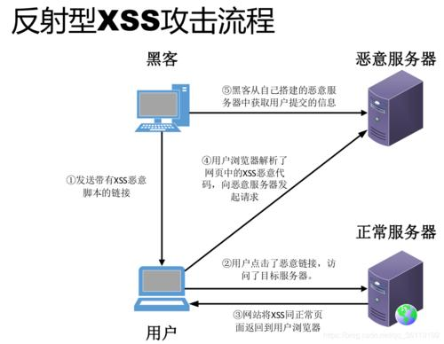

# Cross Site Scripting (XSS)

参考：https://owasp.org/www-community/attacks/xss/

## 概述

跨站点脚本 （XSS） 攻击是一种注入类型，其中恶意脚本被注入到否则良性且受信任的网站中。

XSS攻击者使用某个web应用发送浏览器端脚本形式的恶意代码，给其它的终端用户。终端用户的浏览器无法判断这个脚本是否可信，通常会执行它。这些脚本可能会读取cookie、session token、其它敏感信息，还可能改写页面内容。

## 相关安全活动

### 如何避免XSS漏洞
- See the XSS (Cross Site Scripting) Prevention Cheat Sheet
- See the DOM based XSS Prevention Cheat Sheet
- See the OWASP Development Guide article on Phishing.
- See the OWASP Development Guide article on Data Validation.

### 如何复查代码中有无XSS漏洞

- See the OWASP Code Review Guide article on Reviewing Code for Cross-site scripting Vulnerabilities.

### 如何测试跨站脚本漏洞

See the latest OWASP Testing Guide article on how to test for the various kinds of XSS vulnerabilities.

- Testing_for_Reflected_Cross_site_scripting_(OWASP-DV-001)
- Testing_for_Stored_Cross_site_scripting_(OWASP-DV-002)
- Testing_for_DOM-based_Cross_site_scripting_(OWASP-DV-003)

## 描述

XSS攻击发生在以下情形时：
- 数据由不可信的信源传入 Web 应用，更频繁地，是某个web请求；
- 在发给某个web用户的动态内容中包含了数据，而没有恶意内容验证。

发送给 Web 浏览器的恶意内容经常采用JavaScript片段的形式，但是也可能包含 HTML、Flash、其它类型的浏览器端可执行代码。基于XSS的不同攻击几乎是无所不能的，但它们通常包括传输私有数据、重定向到受攻击者控制的网站，或者在用户机器上执行别的恶意操作。

XSS缺陷可能难以识别，也很难从Web应用程序中删除。找出缺陷的最佳方法是对代码进行安全检查，并搜索HTTP请求输入可能进入HTML输出的所有位置。请注意，可以使用各种不同的HTML标签来传输恶意JavaScript。Nessus，Nikto和其他一些可用的工具可以帮助扫描网站上的这些漏洞，但只能触及表面。如果网站的一部分易受攻击，则很可能还会出现其他问题。

### 存储型和反射型 XSS 攻击

XSS通常分为：存储型（Stored）和反射型（reflected）。还有第三种，即DOM based XSS。

#### 存储型（Stored）XSS

这类XSS的特点：是将注入的脚本永久的存在目标服务器上，例如数据中、消息论坛中、访问日志中、评论中等等。当受害用户请求这个存储信息时，会从服务器上收到恶意脚本。存储型XSS有时也被称为持久型或类型I的XSS（ Persistent or Type-I XSS ）。

#### 反射型XSS

这类XSS的特点：反射型XSS通常不持久保存在服务器上，一般由黑客通过邮件、搜索结果等发送给用户，用户收到包含XSS的URL并点击，通常会向某个合法网站发送请求并获得响应。在响应中包含着原先请求页面时的XSS，此时XSS将作为来自可信任网站的脚本在用户浏览器端执行。此脚本的执行会导致用户向另一恶意网站发送请求，并上传自己的一些隐私数据，例如cookie和用户凭据等。反射型的XSS有时也被称为 Non-Persistent 或 Type-II XSS。

#### DOM based XSS

## 如何保护自己

OWASP XSS PROTECTION CHEATSHEET 介绍了主要防御错误。

