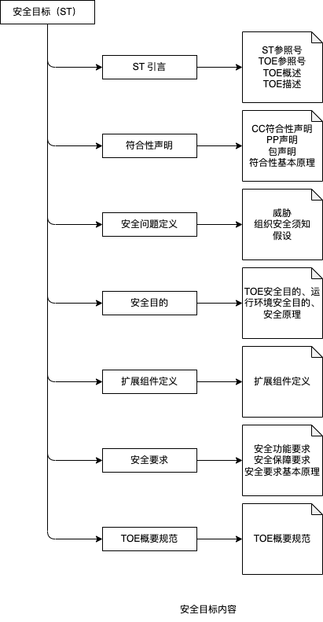

# 智能网联汽车信息安全测评方法论

## 1 信息安全评测方法发展现状

### 1.1 国内外政策法规要求

国内外在围绕智能网联汽车信息安全出台的法律政策方面，总体上呈现出了一种以汽车联网、自动驾驶等复杂应用场景为目标抓手，促进汽车产业链上各环节加强对信息安全保障投入的发展态势，各国均在积极推进汽车信息安全相关法规、标准等制定工作，旨在为行业或企业提供可实施的规范。目前，国际上智能网联汽车信息安全法规、标准大多都停留在最佳实践、指南、关键原则上。
#### 1.1.1 美国《现代汽车信息安全最佳实践》
智能网联汽车信息安全法规政策方面，欧、美、日等世界汽车强国都在积极推动相关政策和标准规范制定工作。美国在谷歌、苹果、微软等互联网巨头以及福特、通用、特斯拉等汽车制造商的大力支持下，政府和行业对汽车信息安全关注较早。2016 年 10月份，美国 NHTSA 发布了《现代汽车信息安全最佳实践》（Cybersecurity Best Practices for Modern Vehicles），针对快速发展的智能网联汽车信息安全及隐私保护等问题推出了最佳实践框架结构。

在产品的网络安全防护方面，NHTSA 建议汽车企业在开发或集成车辆的安全关键系统时，需要优先考虑车辆网络安全并从组织管理上给予保障。明确指出要对智能网联汽车实施广泛的网络安全测试，防止汽车接入未授权的网络，保护关键安全系统和个人数据。

#### 1.1.2 欧洲《智能汽车网络安全与适应力》
2017 年欧洲网络信息安全局（ENISA）发布了《智能汽车网络安全与适应力》的研究报告（简称“ENISA 指南”），目标受众是汽车制造商、供应商和服务商。报告对智能汽车安全架构、当前面临的威胁（攻击面和场景模式）进行了深入研究，并从政策和标准、组织方法、技术三个层面给出了智能网联汽车网络安全的最佳实践建议。为了增强智能网联汽车产业链各方（汽车制造商、供应商和服务商）之间的信任，保证智能网联汽车的安全及健康发展，“ENISA 指南”提出如下建议：
1) 提升智能网联汽车的网络安全：产业链各方必须建立全面的产品安全开发流程，包括现场的设计、开发、测试和安全维护，有效提高产品的安全性；
2) 增强产业链各方间的信息共享：加强产业链间的信息共享，可使产业链各方建立相互信任机制，有利于标准制定和采用、采用公认的方案、建立安全方面的团队、发现安全问题并调解等；
3) 明确产业链参与者之间的责任划分：明确产业链各方的责任，相关责任问题应按照国家相关法律进行处理；
4) 形成统一的技术标准与实践方案；
5) 确定一套独立的第三方安全评估机制；
6) 开发安全分析工具：开发智能网联汽车专用的安全分析工具，以提高安全测试能力，一些已建立的软件工具可以用于智能汽车安全分析，如资产识别、威胁建模等，同时开发一些用于智能网联汽车安全实施、安全测试、安全监控等方面的工具。

#### 1.1.3 英国《智能网联汽车网络安全关键原则》
生产制造供应链上所有参与者，从设计师、工程师到零售商和高级管理人员，都需一份指导这一全球性产业发展的统一指南。因此，英国交通部和国家基础设施保护中心联合制定了贯穿汽车行业、智能网联汽车、智能交通系统（ITS）及其产业链的关键指导原则。2017 年 8 月，英国政府对外发布了《智能网联汽车网络安全关键原则》（The Key Principles of Cyber Security for Connected and Automated Vehicles），该指南细分出 8 大原则，29 个细则。《智能网联汽车网络安全关键原则》将网络安全责任拓展到汽车产业链上的各参与主体，包括第三方承包商，要求在汽车全生命周期内考虑网络安全问题，并在遭受网络攻击时要保证车辆安全运行的基本功能，也就是满足功能安全（Safety）或
韧性（Resilience）的要求。简而言之，汽车网络安全问题是汽车全生命周期的问题，其安全防护工作更是一个不断迭代完善的工作，需要产业链协同完成：
（1) 管理层推动：推进安全计划、安全方案设计等；
（2) 安全风险管理与评估：风险评估与管理、风险识别、分类、优先排序、威胁处理
等；
（3) 产品售后服务与应急响应机制；
（4) 整体安全性：安全分级管理、安全保证、安全可追溯可验证；
（5) 系统设计：纵深防御与分段技术、边界防护、远程终端防护；
（6) 软件安全管理：安全编码、配置管理、审计测试、代码共享；
（7) 数据安全：存储安全、传输安全、个人数据管理、敏感数据；
（8) 韧性设计：功能可用性保证、失效保护、功能恢复与响应。

#### 1.1.4 中国《国家车联网产业标准体系建设指南》
为了加强顶层设计，推动车联网产业技术研发和标准制定，推动整个产业的健康可持续发展，2018 年由工信部、国家标准委共同开始制定《国家车联网产业标准体系建设指南（智能网联汽车）》。计划到 2025 年，系统形成能够支撑高级别自动驾驶的智能网联汽车标准体系。

该指南综合不同的功能要求、产品和技术类型、各子系统间的信息流，将智能网联汽车标准体系框架定义为“基础”、“通用规范”、“产品与技术应用”、“相关标准”四个部分。在该标准体系中，信息安全标准在遵从信息安全通用要求的基础上，以保障车辆安全、稳定、可靠运行为核心，主要针对车辆及车载系统通信、数据、软硬件安全，从整车、系统、关键节点以及车辆与外界接口等方面提出风险评估、安全防护与测试评价要求，防范对车辆的攻击、侵入、干扰、破坏和非法使用以及意外事故。

从国内外智能网联汽车信息安全的实践内容来看，信息安全应贯穿全生命周期，信息安全评测工作是智能网联汽车持续健康发展的重要支撑。国际上发布的汽车信息安全最佳实践、关键原则等均表明需要从开发流程和产品功能两个方面保障智能网联汽车的信息安全，同时其信息安全评测也应该涵盖开发流程和产品功能两个方面的安全性。上述介绍的大多数实践也都提到了风险评估、测试等相关内容，这些都是智能网联汽车信息安全评测工作涉及的重要活动。
### 1.2 智能网联汽车信息安全标准法规
在汽车信息安全工作持续推进的过程中，国际上积极开展相关标准法规的制定工作，在首个针对汽车网络安全而制定的指导性文件 SAE J3061 正式发布后，国际上一直致力于 ISO/SAE 21434、UN/WP29 CS 等多个标准法规的编制。

#### 1.2.1 SAE J3061
2016 年 1 月，美国汽车工程师学会（SAE）率先推出了全球首部汽车信息安全指南SAE J3061《信息物理汽车系统网络安全指南（Cybersecurity Guidebook for Cyber-Physical Vehicle Systems）》，为汽车产业提供了参考和建议，协助整车厂通过实施结构清晰的项目，以保证汽车在全生命周期中都可获得有效的保护。SAE J3061 提供了车辆网络安全的流程框架和指导，旨在帮助企业识别和评估网络安全威胁，将网络安全设计理念渗透到信息物理汽车系统整个生命周期开发过程中。其主要内容包括：定义了完整的生命周期流程框架，企业可以裁剪、利用这个框架，使网络安全设计贯穿车辆的全生命周期，包括概念、开发、生产、运营、维护、报废各个阶段；提供了车辆网络安全相关的工具和方法论，内容涉及汽车信息安全完整性等级、测试方法和工具等，以保证汽车在全生命周期中都可获得有效的信息安全保护。

由于第一版 SAE J3061 的内容并入了 ISO/SAE 21434，美国汽车工程师学会汽车电气系统安全委员会（SAE Vehicle Electrical System Security Committee）开始制定一套比ISO/SAE 21434 更深入或更具技术性的指导文件，旨在为汽车系统的网络安全工程提供额外的指导或支持。SAE J3061 分为三部分，第一部分定义汽车网络安全等级（ACSIL）以及威胁分析和风险评估（TARA）方法用于将威胁分类，对于可能导致功能安全受影响的威胁，还将包括 ACSIL 如何与汽车功能安全等级（ASIL）建立相关联系。第二部分和第三部分着重于安全测试，第二部分重点介绍了供应商对未知硬件和定期更新软件的安全测试方法，第三部分对安全相关工具的制造商及其能力做了概述。

#### 1.2.2 ISO/SAE 21434
ISO/SAE 21434《道路车辆 信息安全（Road vehicles—Cybersecurity engineering）》是基于 SAE J3061 制定的、覆盖车辆整个生命周期的工程管理标准，不涉及具体技术实现细节，目前仍在制定中，计划 2020 年末完成。该标准基于 SAE J3061，参考 V 字模型开发流程，主要从安全风险管理、产品开发、生产、运营/维护、跨产品或者组织层面的保障流程（例如：审核）等四个方面来保障汽车信息安全工程工作的开展。目标是使得依据该标准设计、生产、测试的产品能具备一定的信息安全防护能力，标准内容主要包括：
（1) 信息安全相关的术语和定义；
（2) 信息安全管理：包括企业组织层面和具体项目层面；
（3) TARA（威胁分析和风险评估）；
（4) 信息安全概念阶段开发；
（5) 架构层面和系统层面的威胁消减措施和安全设计；
（6) 软硬件层面的信息安全开发，包括信息安全的设计、集成、验证和确认；
（7) 信息安全系统性的测试及其确认方法；
（8) 信息安全开发过程中的支持流程，包括需求管理、变更管理和配置管理等；
（9) 信息安全事件在生产、运营、维护和报废阶段的识别、防止、探测、响应和恢复等。

本标准介绍的风险评估方法模块包括资产识别、威胁场景识别、影响评估、脆弱性分析、攻击路径分析、攻击可行性评估和风险评估。风险评估方法通常从识别资产和通过损害场景分析相关资产的威胁开始，确定道路使用者的相关影响。随着设计过程的开展，可能会出现脆弱性，并且可以确定潜在的攻击路径来确定相关的攻击可行性，这些是风险计算的输入。风险评估结果用于选择适当的应对方案来处置该风险，推导车辆的信息安全需求。

#### 1.2.2 UN/WP29 CS
联合国世界车辆法规协调论坛（UN/WP29）负责制定有关网络安全（CS）和在线升级（OTA）的法规草案。其中，关于网络安全的建议包含与（a）批准和认证汽车制造商网络安全管理体系的要求和（b）车辆型式认证中网络安全认可相关的法规，将提供有关流程和程序以及最佳实践（威胁和缓解）的指导。网络安全管理体系（Cyber Security Management System，CSMS）是指一种系统的基于风险的方法，用于定义组织流程、责任和治理，以处理对车辆的网络威胁并保护车辆免受网络攻击。在进行车辆型式认证评估之前，车辆制造商应向审批机构或技术服务部门证明其网络安全管理系统具有与被批准的车辆类型相关的有效 CSMS 合规证书。

2018 年 10 月，德国汽车工业联合会质量管理中心（Verband der Automobilindustrie，Qualitats Management Center，VDA-QMC）在车辆型式认证法规和 ISO/SAE 21434 标准的推动下成立了汽车网络安全管理系统工作组，负责制定网络安全审计和评估流程的标准，目的是使 CSMS 可审核和可认证，以满足联合国法规的要求以及其他标准。ISO/SAE 21434 是车辆型式认证的基础，应在国际标准化环境中满足网络安全审计和认证的要求，将 ISO/SAE 21434 实施到公司的规则和流程中，符合联合国对 CSMS 的要求。

### 1.3 信息技术安全测评通用标准

目前，我国已经制定和引进了几十个重要的信息安全标准，其中随着 GB/T 22239-2019《信息安全技术 网络安全等级保护基本要求》的发布，形成了新的网络安全等级保护基本要求标准。而在信
息安全管理方面，ISO 27000 系列已经成为国际上应用最广泛的信息安全管理标准。

在整个信息安全评估准则的发展历程中，国际上有三个非常重要的里程碑式的标准：TCSEC、ITSEC 和 CC 标准。其中，CC 信息技术安全评估准则（Common Criteria for Information Technology Security Evaluation），简称CC标准，是IT产品安全认证的国际标准（ISO / IEC 15408）。它综合了已有的信息安全准则和标准，如美国的TCSEC、欧洲的ITSEC、加拿大的CTCPEC等，形成一个更全面的框架，旨在确保IT产品安全的规范、实施和评估过程以严格、标准和可复制的方式在与其目标使用环境相对应的水平上进行，是第一个信息技术安全评估国际标准。在信息安全标准的制订方面，我国主要采用与国际标准参照引用的方式，将 ISO/IEC 15408:1999 系列标准转化为国家推荐性标准 GB/T 18336-2001《信息技术 安全技术 信息技术安全评估准则》，之后 GB/T 18336-2015 又参照 ISO/IEC 15408-2009进行了更新。最新的ISO/IEC 15408:2022系列，国内尚未进行对比更新。

国际上，把CC 作为评估IT技术安全行的通用尺度和方法。许多政府、企业、组织也把“是否拥有CC认证”作为采购软件或硬件产品的重要评估项甚至必要条件。CC及其配套的信息技术安全评估通用方法（CEM）构成了信息技术安全评估准则互认协议（CCRA）的技术基础。尽管每个国家都有自己的认证流程，但CCRA承认针对协作保护概况（cPP）的评估。这意味着所有成员国都将承认这些认证。

CC 适用于所有IT 产品，不管是硬件、软件、固件，都能在一个框架下评估，还可用于知道产品和系统开发。用户可使用保护配置文件（PP），指定安全功能要求（SFR）和安全功能保证要求（SAR）。企业可以实施和声明其产品的安全属性，并寻求实验室来评估其产品是否符合这些生命，从而获得CC认证。

ISO/IEC 15408主要包括三个部分内容：
- IT安全评估准则 Part1 介绍和通用模型。即 ISO/IEC 15408-1:2022, Information security, cybersecurity and privacy protection — Evaluation criteria for IT security — Part 1: Introduction and general model。
- IT安全评估准则 Part2 安全功能组件。即 ISO/IEC 15408-2:2022, Information security, cybersecurity and privacy protection — Evaluation criteria for IT security — Part 2: Security functional components
- IT安全评估准则 Part3 安全确认组件。即 ISO/IEC 15408-3:2022, Information security, cybersecurity and privacy protection — Evaluation criteria for IT security — Part 3: Security assurance components

为了补充完善，后来又增加了2个部分：
- IT安全评估准则 Part4 评估方法和活动的规范框架。即 ISO/IEC 15408-4, Information security, cybersecurity and privacy protection — Evaluation criteria for IT security — Part 4: Framework for the specification of evaluation methods and activities
- IT安全评估准则 Part5 安全需求的预定义包。即 ISO/IEC 15408-5, Information security, cybersecurity and privacy protection — Evaluation criteria for IT security — Part 5: Pre-defined packages of security requirements

为了指导评估人员开展CC系列信息技术安全测评工作，ISO/IEC还发布了最小活动方法论。即 ISO 18045-2022 Information security, cybersecurity and privacy protection — Evaluation criteria for IT security — Methodology for IT security evaluation 是一个IT安全评估的方法论。该标准定义了测评工作者为了执行 ISO/IEC 15408 系列评估（使用ISO/IEC 15408 系列中提及的评估依据和评估证据）所需进行的最小活动。

国内标准参考ISO/IEC 15408:2009 制定了 GB/T 18336-2015 系列标准：
- GB/T 18336.1-2015 《信息技术 安全技术 信息技术安全评估准则 第1部分：简介和一般模型》
- GB/T 18336.2-2015 《信息技术 安全技术 信息技术安全评估准则 第2部分：安全功能组件》
- GB/T 18336.3-2015 《信息技术 安全技术 信息技术安全评估准则 第3部分：安全保障组件》

GB/T 18336 作为评估信息技术产品及系统安全特性的基础准则，已被部分国内开发者应用于其所开发的相关产品及系统中。

基于CC的信息安全测评，包括三大部分：

（1）基本思路和一般模型。
一般模型定义了评估目标、安全目标、保护轮廓等概念和用法，规定了 ST 和 PP 的格式和要点。

（2）为满足安全功能要求（SFR），可供ST或PP选用的安全功能组件。
这些安全功能组件共分为11个大类，大类下面又分为不同的族、组件、组成要素。11个类型包括：
  - 安全审计
  - 通信
  - 密码支持
  - 用户数据保护
  - 标识与鉴别
  - 安全管理
  - 隐秘
  - TSF保护
  - 资源利用
  - TOE访问
  - 可信路径/信道

CC评估不强迫使用所有功能组件。

（3）可供ST或PP选用的安全保障要求。
安全保障要求（SAR）涵盖：
  - ST的评估准则
  - TOE的开发
  - 生命周期支持
  - 指导性文件
  - 测试
  - 脆弱性评定

在开展SAR测评时，CC标准给出了7个评估保障级（EAL），每个评估保障级都将上面6个方面的要求细节进行了搭配和固化。

### 1.3 面向智能网联汽车的信息安全测评标准

2019 年 3 月 25 日，国家标准委下达第一批推荐性国家标准计划。汽标委智能网联汽车分标委提交的 4 项有关汽车信息安全的推荐性国家标准项目（汽车信息安全通用技术要求、电动汽车远程服务与管理系统信息安全技术要求、车载信息交互系统信息安全技术要求、汽车网关信息安全技术要求）获批立项，其中汽车信息安全通用技术要求中将以最高的防护目标定义共性的原则性技术要求。未来，这些技术要求可以用于汽车领域保护轮廓（类似于 CC 标准中 PP）的构建。

目前，国内汽车信息安全标准的制定工作正在有序推进，除上述基础通用及行业急需标准的制定外，汽车软件升级、汽车信息安全风险评估等应用类标准的制定也在有序开展，此外，汽标委还在系统开展汽车整车及零部件信息安全测试评价体系研究，启动车载硬件环境及操作系统相关标准体系规划及预研。本着“急用先行”的策略，中国智能网联汽车产业创新联盟、中国汽车工程学会等也在积极推进相关团体标准的制定，其中《智能网联汽车车载端信息安全技术要求》针对已经大规模使用的车载端信息安全定制了一套全面系统的技术要求供车厂和供应商借鉴，在提升车载端信息安全水平的同时，填补了我国智能网联汽车领域信息安全标准的空白。

从上述国内外智能网联汽车信息安全标准化工作来看，ISO/SAE 21434 将规范企业组织层面在信息安全管理和风险管理方面的要求，车辆上电子电气系统、系统间的接口交互、系统间的通信在安全生命周期内的信息安全技术要求、威胁分析与风险评估方法、安全策略、信息安全系统性的测试评价方法、信息安全流程开发管控要求。在已发布或即将发布的智能网联汽车信息安全标准中，ISO/SAE 21434 是一个重量级的标准，和 ISO 26262 在功能安全领域一样，是目前汽车信息安全最佳参考标准，可用于产品开发流程的评测，也将支持 WP29 后续的 CSMS 认证工作。因此，中国版 ISO/SAE 21434 —— GB 《整车信息安全技术要求及测试方法》，这一国家强制标准也在研制过程中。

## 2 规范性引用文件

（1）ISO/IEC 15408-1:2022, Information security, cybersecurity and privacy protection — Evaluation criteria for IT security — Part 1: Introduction and general model。

（2）ISO/IEC 15408-2:2022, Information security, cybersecurity and privacy protection — Evaluation criteria for IT security — Part 2: Security functional components

（3）ISO/IEC 15408-3:2022, Information security, cybersecurity and privacy protection — Evaluation criteria for IT security — Part 3: Security assurance components

## 3 术语

- 评估对象（TOE）：如软件、固件和/或硬件的集合，可能附带着指南（信息资料）。
- 资产（assets）：评估对象（TOE）所有者赋予了价值的实体。
- 安全要求（security requirement）：用标准化的语言陈述的要求，旨在达到TOE的安全目的。
- 安全目标（security target；ST）：针对一个特定的已标识的TOE，且与现实相关的安全需求陈述。
- 保护轮廓（protection profile；PP）：针对一类TOE的、与实现无关的安全需求陈述。
- 评估（evaluation）：依据定义的准则对PP、ST或TOE进行的评价。
- TOE安全功能（TSF）：正确执行SFR所依赖的TOE的所有硬件、软件和固件的组合功能。

## 4 缩略语
- TOE：评估对象
- SAR：安全保障要求
- SFR：安全功能要求
- ST：安全目标
- PP：保护轮廓
- TSF：TOE安全功能

## 5 基本概念

### 5.1 TOE
评估对象（TOE）被定义为一组可能包含指南（信息、数据、配置）的软件、固件和/或硬件的集合。常见的TOE例子包括：
- 软件应用
- 操作系统
- 智能卡集成电路
- 密码协处理器（例如HSM）
- 包括所有终端、服务器、网络设备和软件的局域网
- 数据库应用
- 其他

智能网联汽车中的网络产品/组件、数据产品/组件均可认为是安全测评的评估对象。例如：CAN通信系统、车载以太网、T-Box、IVI、车机交互软件、ECUs中的芯片及固件等等。

#### 5.1.1 TOE的表现形式
TOE的表现形式有多种，除了有实体外形的硬件（如域控制器）、网络（如CAN网络线路和网关），还包括各种软件或数据形态，例如：
- 配置管理系统中的文件列表
- 编译后的代码文件
- 准备交付客户的光盘、手册、升级包
- 已经安装和运行的软件版本
- 其他
#### 5.1.2 TOE的不同配置
一般来说，车载信息产品同一般IT产品都可以使用多种方法配置：以不同的方法安装、使用不同的启用或禁用选项，由于在测评期间，它将确定TOE是否满足特定的要求。由于TOE的所有配置必须满足要求，所以这种配置上的灵活性可能会导致很多问题。为了便于开展测评，通常在TOE的指南部分对TOE可能的各种配置进行严格限制，换句话说，TOE的指南不同于车用IT产品的通用指南。

操作系统就是比较常见的例子。车机中安装的Andorid系统，可以多种方法进行配置，例如用户类型、允许/禁止WiFi默认连接、访问口令的设置等等。

如果同一款车用IT产品要成为一个TOE，并且依据一组合理的要求评估，则配置应该受到更加严格的控制，因为许多选项（如允许所有类型的外部链接或系统管理员不需要被鉴别）将导致TOE不能满足要求。

出于这些原因，车用IT产品或智能网联汽车整体的产品指南（允许多种配置）和TOE指南（仅允许一种配置或者在安全相关方面没有不同的配置）通常有所不同。

注意，如果TOE指南仍然允许多种配置，这些配置统称为TOE，其中的每种配置必须满足TOE的指定要求。

### 5.2 信息安全测评的目标读者

有三类群体对TOE安全测评感兴趣，分别是：
- 消费者：评估是为了满足消费着的需求，这是评估过程的基本目的和理由。消费者可以使用评估结果来帮助决定一个TOE是否满足他们的安全需求，这些安全需求通常是风险分析和策略指导的结果。消费者也可以使用评估结果来比较不同的TOE。安全测评/评估为消费者，尤其是消费者群体和行业团体，提供一个独立于实现的结构，即保护轮廓（PP），在其中以一种明确的方式表达他们的安全要求。
- 开发者：安全评估为开发者准备并协助他们对TOE的测试，以及标识TOE满足的安全要求。这些安全要求包含在一个与实现相关的ST中。ST可以基于一个或多个PP，来说明ST符合消费者在这些PP中制定的安全要求。安全评估还可以用于确定责任和行为，以便于提供TOE满足安全要求的必要证据。它也定义了证据的内容和形式。
- 评估者：安全评估包含了用于评判TOE与其安全要求是否相符的原则和结果。

### 5.3 信息安全测评的背景

为了使信息安全测评具有更好的可比性，测评/评估应在权威的评估体制框架内执行，该体制框架负责制定标准、监控评估质量、管理评估机构和评估者必须符合的规章制度。例如：CNAS、CMA体制。

不同的信息安全测评/评估机构的测评框架必须一支，以达到相互认可评估结果的目标。

使评估结果具有更好的可比性的第二种方法是使用通用方法达到这些效果。通用方法的使用主要是确保评估结果的可重复性和客观性，但仅靠评估方法本身是不充分的。许多评估准则需要使用专业的判断和背景知识，而这些较难达到一致。为了增强评估结论的一致性，最终的评估结果可能提交给认证过程来处理。

认证过程是对测评/评估结果的独立审查，并产生最终的证书或正式批文，该证书通常是公开的。

## 6 信息安全评测方法一般模型

### 6.1 简介
本文所讨论的面向智能网联汽车的信息安全测评方法，将依据CC信息安全测评标准（ISO/IEC 15408:2022）作为基本的信息安全测试或评估的方法论，补充其他面向汽车的信息安全技术要求和测试规范来完成评估。

基于CC开展信息安全评估有两个重要的环节：

第一步，对确定的安全目标的评估。安全目标可以遵从某个PP，也可以没有PP而是针对特定产品而编写。提出ST 和 PP的基本准则是根据某个或某类产品需要保护的信息资源的价值、以及此（类）产品使用环境收到敌意攻击的威胁程度，来选取合适的安全功能组件和安全保障级别。如果此（类）产品实现了所要求的安全功能组件，并且这些功能的设计和实现是达到了所要求的安全保障级别的，那么从理论（即CC的理想）上讲此（类）产品有能力抵御来自所处的使用环境的威胁，因而能够有效保护所拥有的信息资产。安全目标的制定应符合CC标准的第一部分一般威胁模型的方法。

第二步，CC评估的是对安全目标中所定义的TOE的评估。这一步的评估要点在于通过对产品的设计文档、代码实现、生产流程、使用安装、功能测试、脆弱性分析等等多个角度和方面来衡量判定此产品是否真正地实现了在其ST中所宣称的安全功能，是否真正地达到了所宣称的安全保障级。这里要强调指出的是，ST中指定的安全保障级中包含的安全保障要求将贯彻覆盖到所选用的全部的安全功能组件。

对于EAL1到EAL4的CC评估，CCRA 还发布了通用标准评估方法论（Common Criteria Evaluation Methodology，简称CEM），并被接纳为国际标准ISO/IEC 18405。

概括来讲，CC评估是基于CC第一部分提出安全威胁模型，该模型根据产品面临的安全问题（假定、威胁和组织安全策略），确定安全目标，并根据CC第二部分的安全功能要求选择产品的安全功能，基于CC第三部分的安全保障要求开展CC评估。

下面介绍其一般模型中的要素和评估要点。

### 6.2 资产与对策

安全与资产保护有关，资产是赋予了价值的实体，智能网联汽车相关资产的例子有：
- 车内用户隐私数据
- 自动驾驶域控制器
- 路径规划算法
- 带有HSM功能的SoC芯片
- CAN车载通信系统
- WiFi 网络
- 蓝牙钥匙
- OTA升级包
- 车机Andorid 系统的镜像文件和配置
- TSP 访问能力
- 远程控制的可用性

为了避免过于主观的估计使任何事物成为资产，通常我们将资产放置的环境成为运行环境，例如：
- 车辆机仓
- 4G移动通信环境

许多资产均以信息的形式由车用IT产品存储、处理和传送，以满足信息所有者的要求。信息所有者为乐信息的可用性，会严格控制信息的传播和修改，并且资产受到保护措施的保护以抵御威胁。下图说明了这些概念和关系。

保护资产是对资产赋予价值的所有者的责任。实际或假想的威胁主体，也可能对资产赋予价值，并试图以危害资产所有者利益的方式滥用资产。威胁主体的例子包括：黑客、恶意用户、非恶意用户的不当操作、计算机进程和事故。

资产所有者可能要对资产负责，因此，应有足够的理由支持资产所有者做出决定，以接受由资产暴露给威胁所带来的风险。为了支持这项决定，应该能够证明下面两方面：
- 对策是充分的：如果对策做了声称要做的事，就能够对抗威胁；
- 对策是正确的：对策做了声称要做的事。

许多资产所有者事缺少必要的知识、专业技术和资源来判断对策的充分性和正确性，他们不希望仅依赖于开发者，因此所有者/消费者会引入评估，以增加对所有或部分对策的充分性和正确性的信心。下图描述了信息安全测评/评估的概念及关系。

#### 6.2.1 对策的充分性

在安全测评/评估中，对策的充分性是通过一个称为安全目标的概念来分析的。安全目标从描述资产和对这些资产的威胁开始，然后安全目标描述对策（以安全目的形式），并证实这些对策对于对抗这些威胁是充分的，如果对策做了声称要做的事情，那么对策就足以对抗威胁。

安全目标将对策划分为两组：
（1）TOE的安全目的：描述了需要在评估中确定其正确的对策；
（2）运行环境的安全目的：描述了不需要在评估中确定其正确性的对策。

这样划分的理由是：
- 信息安全测评仅适合评估信息、网络、数据等IT相关对策的正确性，因此非IT类对策（机械装置、功能安全、企业治理）总是放在运行环境中考虑。
- 对策的正确性评估耗费时间和金钱，因此苹果所有对策的正确性不一定可行。
- 某些对策的正确性可能已经在其他评估中评估过了，因此再次评估无成本效益。

安全目标证实了安全功能要求（SFRs）满足TOE安全目的，TOE安全目的和运行环境安全目的足以对抗威胁，因此SFR和运行环境安全目的足以对抗威胁。这样看来，正确的TOE与正确的运行环境结合起来对抗威胁。

#### 6.2.2 TOE的正确性

TOE的设计和实现可能不正确，可能因此包含着导致脆弱性的错误，攻击者通过利用这些脆弱性，可能破坏和/或滥用资产。这些脆弱性可能由开发时的意外错误、糟糕设计、故意添加的恶意代码和糟糕的测试等引发。为了确定TOE的正确性，可以执行的活动包括：
- 测试TOE
- 检查TOE的各种设计表示
- 检查TOE开发环境的物理安全

安全目标以安全保障要求（SAR）的形式提供了这些活动的结构化描述，以确定正确性。这些安全保障要求用标准化语言来表示，以保证正确性和可比性。

开展信息安全测评的基本方法在于针对给定的测评对象，首先确定其安全目标，然后根据相关标准或行业一致性方法对测试目标进行安全功能和安全保障的测评。如果满足了SAR，那么就可保障TOE的正确性，因此TOE几乎不可能包含可以被攻击者利用的漏洞。在TOE正确性方面的保障程度，由SAR本身确定，“弱”的SAR所能提供保障少，而许多“强”的SAR可提供更安全的保障。

#### 6.2.3 运行环境的安全性

运行环境的设计和实现也可能不正确，因此可能包含导致脆弱性的错误，攻击者通过利用这些脆弱性，仍然可以破坏和/或滥用资产。通常，安全测评无法保障运行环境的正确性，换句话说，运行环境的安全性通常不做评估。就评估过程而言，运行环境被假设为可以100%实现运行环境安全目的。

这并不排除TOE的消费者使用其他方法确定运行环境的正确性，例如：
- 对于一个操作系统，运行环境安全目的生命“运行环境将确保来自不可信网络的尸体只能通过ftp访问TOE”，消费者可以选择一个经过评估的防火墙，配置它为仅允许通过FTP对TOE进行访问。
- 如果运行环境安全目的生命“运行环境将确保所有管理人员没有恶意行为”，消费者可以调整其与管理人员的合同，使其包括对恶意行为的惩罚性制裁，但这不是信息安全测评的一部分。

### 6.3 信息安全测评/评估

基于CC标准，我们认可两种形式的评估：一是下面描述的ST/TOE评估（多数情况）；二是ISO/IEC 15408-3中定义的PP评估。

ST/TOE 评估分为两步进行：
（1）ST评估：确定TOE和运行环境的充分性；
（2）TOE评估：确定TOE的正确性，就像前面所说的，TOE评估不评估运行环境的正确性。

ST评估，应用安全目标评估准则对安全目标进行评估。

TOE评估更为复杂，TOE评估的主要输入是：评估证据，包括TOE和ST，通常也包括来自开发环境的输入，如设计文档或开发者测试结果。TOE评估由适用于SAR（来自安全目标）的评估证据组成。准则应用的SAR的方法，是由所使用的评估方法确定的。应用SAR的结果如何被文档化，需要生成的报告及细节由适用的评估方法及执行评估的评估体制确定。

TOE评估过程产生的结果为下列两种情况之一：
- 并未满足所有SAR，因此评估结果未达到ST中所述的TOE满足SFR的特定保障级别；
- 满足所有SAR，因此评估结果达到了ST中所述的TOE满足SFR的特定保障级别。

TOE评估可以在TOE开发完成之后进行，或者与TOE开发并行。

## 7 安全要求及其裁剪

通常，基于CC的安全确认需要利用安全功能和安全保障实现安全要求。可以严格按照 ISO/IEC 15408-2 和 ISO/IEC 15408-3 中的定义使用，也可以使用允许的操作进行裁剪。当使用这些裁剪操作时，PP/ST的作者应当注意其他要求对此要求的依赖关系应得到满足。允许的操作包括：
（1）反复：允许一个安全功能组件/安全保障组件在不同操作时被使用一次以上；
（2）赋值：允许指定参数；
（3）选择：允许从一个列表中选定一项或多项；
（4）细化：允许增加细节。

复制和选择操作只允许用于组件中明确指定的位置，反复和细化允许用于所有组件。

## 8 安全需求的制定

为了允许消费者群体或公共监管部门表达他们的安全需求并编写ST，有两个特殊的概念需要被掌握：保护轮廓（PP）和包（Package）。

### 8.1 包

包是一个安全要求的命名集合。一个包可以是：
- 只包含安全功能要求（SFR）的功能包；
- 只包含安全保障要求（SAR）的保障包

不允许同时包含SFR和SAR的混合包。

包可以由任何团体定义，意在可重用。为此，他应该包含有用且易于组合的要求。包可以用于构造更大的包，PP和ST。目前没有评估包的准则，因此，任意SFR或SAR的集合都可以成为一个包。保障包的例子是评估保障级EAL。

### 8.2 保护轮廓

虽然ST通常用于描述一个特定的TOE（如某车型特定型号版本的T-Box），PP却意在描述一类TOE（例如一般意义的T-Box）。因此，相同的PP可以作为模版用于构造许多不同评估的ST。

一般来说，ST为一个TOE描述要求，由TOE的开发者编写，而PP为一类TOE描述通用要求，典型的编写者为：
- 为一个给定的TOE类型寻求一致要求的用户；
- TOE的开发者，或者系统为该类型TOE建立最小基线的类似TOE开发群体；
- 为采购过程而详细说明其要求的组织，例如政府或大型公司。

PP确定了允许ST符合（保持一致）PP的方式，即PP生命规定了ST符合的方式是：
（1）如果PP声明需要满足严格的符合性，ST就应严格地与PP符合；
（2）如果PP声明需要满足可论证的符合性，ST就应以严格的或可论证的方式与PP符合；

换言之，如果PP明确允许可论证的符合性，那么仅允许ST以至少可论证的方式与PP符合。

如果ST声明与多个PP符合，它将以PP规定的方式（上述两种）与每个PP符合。注意，ST与PP符合是否存在不一致或可能被质疑。因为基于CC的信息安全测评不认可“部分符合”。因此PP作者的责任是确保PP不会过于繁琐，而妨碍PP/ST作者声明与这样的PP符合。

由于一下认识，ST等同于PP，活着ST比PP约束更多：
（1）所有满足该ST的TOE也满足该PP；
（2）所有满足该PP要求的运行环境也满足该ST的要求。

通常，ST比PP对TOE施加相同或更多的家限制，并对TOE的运行环境施加相同或更少的限制。

### 8.3 使用保护轮廓和包

如果ST声明与一个或多个包和/或保护轮廓相符合，ST的评估将证实ST实际上与他们声明符合的包或PP符合。

这允许出现以下过程：
（1）一个寻求获取特定类型IT安全产品的组织，根据其安全需求开发一个PP，使其通过评估并发布；
（2）开发者采用这个PP，编写ST以声明与其相符合，并使用其通过ST评估；
（3）然后开发者构造TOE（或者使用一个一存在TOE），并使TOE对照该ST进行评估。

结果是开发者能够证明他的TOE与组织的安全需求相符合；组织因此能够购买该TOE。

### 8.4 使用多个保护轮廓

基于CC标准的信息安全测评，运行一个PP与其他PP符合，允许给予以前的PP构造PP链。

例如：可以使用域控制器集成电路的PP和嵌入式OS的PP，构造一个域控制器PP（涵盖了硬件安全和操作系统安全），在域控制器PP中声明与另外两个PP符合，然后可以基于域控制器PP和应用软件PP，编写IVI系统的PP。最后，开发者可以基于这个PP构造一个面向IVI设备的ST。

## 9 评估结果

## 9.1 序言

根据CC标准执行的PP和ST/TOE评估过程，将产生下列结果：
（1）PP评估产生的一评估的PP目录。
（2）TOE评估框架中使用的ST评估的中间结果。
（3）ST/TOE评估产生的已评估的TOE目录。在许多情况下，这些目录指的是TOE所在的IT产品，而不是特定的TOE。因此目录中的IT产品不应解释为整个IT产品已经被评估过，ST/TOE评估的实际范围由ST定义，需要参考相关目录示例的参考手册。

ST 可以基于包、以评估的活未被评估的PP，但是没有强制要求，因为 ST 不必基于任何包或PP。评估应能产生能引为证据的客观的和可重现的结果，即使没有绝对客观的尺度来衡量安全评估结果时也应如此。存在一套评估准则是使评估产生有意义的结果的必要前提条件，这也为不同评估机构之间互认评估结果提供了技术基础。

一个评估结果代表了对TOE安全特性进行专门考察时的结果。这个结果并不自动保证适用于任何特定应用环境。允许一个TOE在特定应用环境下使用的决策，应给予对多个安全因素的考虑，包括评估结果。

### 9.2 PP 评估结果

基于CC的安全测评框架包含了要求评估者参考的评估准则，以便声明 PP 是完备的、一致的和技术合理的，因此适用于在开发ST中。评估结果也应包括“符合性声明”。

### 9.3 ST/TOE 评估结果

基于CC的安全测评框架包含了要求评估者参考的评估准则，以便确定ST中是否存在TOE满足SFR的充分保障。因此，TOE评估将为ST给出通过/失败的结果。如果ST和TOE的评估结果均为通过，其基础产品就是合格的，包含在注册库中。评估结果也应该包括“符合性声明”。

可能有这种情况，评估结果要在随后的认证过程中使用，这个认证过程与评估过程不相同，本文不做讨论。

### 9.4 符合性声明

符合性声明表示要求集合的来源由通过评估的PP或ST来满足，该符合性声明包含了一个基于CC的符合性声明：
（1）PP或ST声明符合的ISO/IEC 15408 的版本的描述。
（2）与ISO/IEC 15408-2（安全功能要求）的符合性描述：
（2.1）ISO/IEC 15408-2 符合：如果PP或ST中所有SFR仅仅基于 ISO/IEC 15408-2 的功能组件，那么该PP或ST与ISO/IEC 15408-2是符合的，或
（2.2）ISO/IEC 15408-2 扩展：如果PP或ST中有一个SFR不是基于 ISO/IEC 15408-2 的功能组件，那么该PP或ST与ISO/IEC 15408-2是扩展的。
（3）与ISO/IEC 15408-3 （安全保障要求）的符合性描述：
（3.1）符合：如果PP或ST中所有SAR仅仅基于 ISO/IEC 15408-3 的保障组件，那么该PP或ST与ISO/IEC 15408-3是符合的，或
（3.2）ISO/IEC 15408-3 扩展：如果PP或ST中有一个SAR不是基于 ISO/IEC 15408-3 的功能组件，那么该PP或ST与ISO/IEC 15408-3是扩展的。

另外，符合性声明也可以包括与包有关的陈述，可以包括如下情况：
（1）包选定符合：一个PP或ST与一个预定义的包符合（如 EAL），如果：
（1.1）PP 或 ST 中的SFR与包中的SFR相同，或
（1.2）PP 或 ST 中的SAR与包中的SAR相同。
（2）包选定增强：一个PP或ST是一个预定义的包的增强，如果：
（2.1）PP或ST中的SFR包含了所有包中的SFR，但至少增加了一个SFR或者有一个SFR级别高于包中的一个SFR；
（2.2）PP或ST中的SAR包含了所有包中的SAR，但至少增加了一个SAR或者有一个SAR级别高于包中的一个SAR。

注意，当一个给定ST的TOE被成功评估了，ST的任何符合性声明TOE也应遵循，因此TOE也可以是如ISO/IEC 15408-2 符合的。

最后，符合性声明也可以包括两个域保护轮廓相关的陈述：
（1）PP符合，一个PP或者TOE满足特定PP，该PP作为符合性结果列出。
（2）符合性陈述（仅对PP）：该陈述描述了PP或ST必须与相关的PP符合的方式；严格的活可论证的。

### 9.5 使用ST/TOE评估结果

一旦ST和TOE经过评估，资产所有者可以获得TOE及其运行环境对抗威胁的保障（在ST中定义的），评估结果可以由资产所有者用于决定是否接受资产暴露给威胁的风险。

然而，资产所有者应该仔细检查是否存在下列情况：
（1）ST中的安全问题定义是否匹配资产所有者的安全问题。
（2）资产所有者的运行环境与ST描述的运行环境安全目的是否相符。
如果上面两种情况不相符，那么TOE可能不适用于资产所有者的目的。

另外，一旦一个已经评估的TOE处于运行中，TOE中以前的未知错误或脆弱性仍然可能出现，这时开发者可以修正TOE（修复漏洞），或者修改ST从评估范围中排除该脆弱性。无论哪种情况，旧的评估结果可能不再有效。

如果需要重新获得信心，需要重新评估。

## A.安全目标规范

### A.1 用意和结构
这一部分用于解释安全目标（ST）的概念，主要有4个主要部分组成：
（1）ST必须包含的内容。这些内容描述了ST的强制性内容及其之间的关系，并提供了示例。
（2）ST的使用方法。这些方法描述了如何使用ST，以及一些ST可以回答的问题。
（3）低保障ST，即指减少了内容的ST。
（4）与标准一致性的声明。这部分描述了ST作者如何声明TOE满足特定标准。例如GB/T 40856-2021。

### A.2 ST的强制性内容

下图描绘了ST的强制性内容，这些内容是基于ISO/IEC 15408-3给出的。这个图也可用作ST的机构性轮廓，但其他的结构也是允许的。例如，如果安全要求基本原理内容特别多，可以放在ST的一个附录中，而不是放在安全要求章条中。

正如上图所示，ST一包包括：
（1）ST引言；
（2）符合性声明；
（3）安全问题定义；
（4）安全目的；
（5）扩展组件定义（可选）；
（6）安全要求；
（7）TOE 概要规范。

### A.3 ST的使用方法

#### A.3.1 ST的两个角色

一个典型的ST承担两个角色：
（1）评估之前及评估期间，ST指出“要评估什么？”。这个任务中，ST作为开发者和评估者之间在TOE确切的安全属性和确切的评估范围上达成一致协议的基础。技术正确性和完备性是这个任务的主要问题。
（2）评估之后，ST指出“被评估了什么？”。在这个任务中，ST作为开发者或销售者和TOE潜在消费者之间达成一致协议的基础。ST以抽象的方法描述了TOE确切的安全属性，潜在消费者能够依赖这个描述，因为TOE已经过评估满足ST。易用和容易理解是这个任务的主要问题。

#### A.3.2 不应使用ST的情况

ST不应承担的两个角色：
（1）详细规范：ST是较高抽象级别的安全规范。一般ST不应包含详细的协议规范、算法或机制的详细描述、具体操作的冗长描述。
（2）完整规范：ST是安全规范而不是通用规范。除非与安全相关，如互联性、物理大小和重量、要求的电压等属性，不应作为ST的组成部分。通常，ST是一个完整规范的一部分，而本身不是一个完整规范。

### A.4 ST 引言（ASE_INT）

ST引言在三个抽象层面上对TOE进行叙述性描述：
（1）ST参照号和TOE参照号，为ST及其相关的TOE提供标识信息。
（2）TOE概述，简要描述TOE；
（3）TOE描述，对TOE进行更详细的描述。

#### A.4.1 ST参照号和TOE参照号

ST包含一个清晰的ST参照号，它标识特定的ST。一个典型的ST参照号由标题、版本、作者和出版日期组成。例如：
> “某T-Box ST，version1.2，xxx开发团队，2010-10-10”。

ST也包含了一个TOE参照号，它标识声明与ST符合的TOE。一个典型的TOE参照号由开发者名称、TOE名称和TOE版本号组成。例如：
> “张三 某T-Box version1.2”。

不同评估过程，可以使用不同的ST参照号和TOE参照号，例如不同消费者进行的评估，可以采用自定义的参照号。

如果TOE由一个或多个已知产品构成，那么允许在TOE参照号中通过引用产品名称进行反映，但不应该用来误导消费者；不允许出现评估中没有考虑的重要部分或安全功能、同样也不允许出现在TOE参照号中没有反映出来的情况。

ST参照号和TOE参照号便于在已评估的TOE或产品列表中检索和识别ST和TOE及其概要结论。

#### A.4.2 TOE 概述
##### A.4.2.1 TOE 的用途和重要安全特征

TOE概述用于帮助TOE的潜在消费者，她们通过查找已评估的TOE或产品列表找到可能满足他们安全需求，且是他们软硬件所支持的TOE。通常，TOE概述用几个段落的长度进行描述。

##### A.4.2.2 TOE 类型

最后，TOE概述简单描述TOE的使用和它的重要安全特征，标识TOE类型，并且标识TOE所需要的非TOE的硬件、软件和固件部分。

TOE概述示例：
> 某T-Box v2.1是一个用于4G移动通信网络环境的车载信息交互系统，它允许汽车驾乘人员通过它连接x通信公司的移动互联网络，允许口令/令牌认证，提供通信安全保护，支持WiFi热点功能，为驾乘人员提供车载WLAN接入，通过特定的加密通信方法保护通信过程不被窃听。

TOE的类型，如防火墙、IDPS、车载信息交互系统、自动驾驶域控制器等等，如果不能容易确定TOE的类型，也可以写“无”。

##### A.4.2.3 需要的非TOE的硬件/软件/固件

很多时候，TOE依赖额外的、非TOE的硬件、软件或固件。这种情况时，要求TOE概述标识出这些非TOE的硬件、软件或固件，尽量在描述时清楚、完整、详尽，以便潜在消费者能够确定TOE需要使用的重要硬件、软件或固件。

例如：假设TOE为某型号T-Box，那么可拆卸的sim卡不属于TOE，可以进行标识：
> “Mini SIM 25mm×15mm 联通 LTE”。

#### A.4.3 TOE 描述

TOE描述是TOE的叙述性描述，可能需要几页纸进行描述。TOE描述应该提供给评估者和潜在消费者对TOE安全能力的一般性理解，比TOE概述中的描述更详细，TOE描述也可用于说明TOE使用的更广泛的应用环境。

TOE描述应论述 TOE 的物理范围:构成TOE的所有硬件、固件、软件及指南部分的一个列表。该列表应该在一定程度上进行详细描述，使读者对这些部分有一般性理解。TOE描述也应该论述TOE的逻辑范围：一定程度上描述TOE提供的安全特征，使读者获得对这些安全特征的一般性理解。该描述应该比TOE概述中描述的重要安全特征更加详细。

物理和逻辑范围的一个重要特性是其以一种无歧义的方式描述TOE,明确哪些部分或特征在TOE之内，哪些部分或特征在TOE之外。当TOE与非TOE实体联系在一起并且不能轻易将它们分离时这显得尤其重要。

TOE 与非 TOE 实体难以界定的示例：
> - TOE是域控制器SoC芯片，它的密码协处理器（负责密码计算的另一块芯片）不是SoC的一部分。
> - TOE是除了密码处理器之外的SoC。 
> - TOE是某车载网关防火墙 v2.5 的网络地址转换部件。

### A.5 符合性声明(ASE_CCL)
这部分描述ST如何符合:
- ISO/EC 15408-2和ISO/IEC 15408-3；
- 保护轮廓(如果有)；
- 包(如果有)。

注意，例如GB/T 40856-2021等信息安全技术要求规范，可以作为保护轮廓或包的内容列入符合性声明。实际上，在开展满足国内外合规准人测试的过程中，我们是以CC为基本方法论，补充其他面向汽车的信息安全技术要求和测试规范来完成评估的。

ST与ISO/IEC 15408符合的描述由两项组成：（1）使用的ISO/IEC15408的版本以及（2）ST是否包含护展的安全要求。

ST与保护轮廓的符合性描述是指 ST 列出了其声称符合的包。 ST 与包的符合性描述是指 ST列出了其声称符合的包。

### A.6 安全问题定义(ASE_SPD)
#### A.6.1 引言
安全问题定义解释了将要处理的安全问题。涉及ISO/IEC15408的安全问题定义是公认的，而安全问题定义的推理过程超出了 ISO/IEC 15408 的范围，也超出了开展安全测评过程本身的范围。

然面，应该注意到，评估结果的有效性对ST依赖性很强，而且ST的有效性对安全问题定义的依赖性很强，因此花费有效资源并使用良好定义的过程分析推导安全问题定义常常是有价值的。

注意，按照ISO/IEC 15408-3,不强制要求所有章条均有陈述，陈述了威胁的ST不必一定陈述组织安全策略，反之亦然，ST也可能会省略假设。

还需要注意，对于物理上是分布式的TOE，可能最好是针对TOE运行环境的不同区域分开讨论相关威胁、组织安全策略和假设。
#### A.6.2 威胁

在这一条中，给出要由 TOE、TOE 运行环境或这两者的一种组合所应对的威胁。威胁由对资产的威胁主体执行的敌对行为组成。
敌对行为是威胁主体对资产执行的行为，这些行为会影响资产的一个或多个属性,而资产正是通过这些属性来体现价值的，威胁主体可以被描述为单个的实体,但某些情况下以实体类或实体群体等方式来描述可能更好。威胁主体的例子如黑客、用户、计算机进程、意外事件等。可以从专业技能、资源、机会和动机等方面进一步描述威胁主体。

威胁示例:
> 黑客(有很强的专业技能、使用标准设备，且以有偿工作的方式)从网络远程窃取车辆开发机密文件或远程控制汽车车门、车窗;
> 蠕虫病毒严重地降低车载移动通信网络的性能；
> 系统管理员侵犯用户隐私;
> 某些人员在互联网上窃听机密电子通信信息。

#### A.6.3 组组安全簧胳(OSP)
在这一条中，给出要由 TOE、TOE运行环境或由这两者的一种组合所执行的组织安全策略。

组织安全策略是由一个实际的(或假想的)组织目前(和/或将来)为运行环境强制(或有可能强制)要求的一些安全规则、规程和指导原则。组织安全策略可能由控制TOE运行环境的组织或立法机关，或者规章制定机构制定。组织安全策略可以应用于 TOE和/或TOE的运行环境。

组织安全策略示例:
> 政府要求道路车辆均需要满足“汽车信息安全技术要求”这一强制性国家标准的要求；
> 只有具有系统管理员权限并获得部门许可的用户才允许访问车辆信息数据服务器。

#### A.6.4 假设
本条说明了为了能够提供安全功能，对运行环境所做的假设。如果TOE被放在不满足这些假设的运行环境中，TOE可能不再能提供它所有的安全功能。假设可以是关于运行环境的物理、人员和连通性方面的。

假设示例:
> 运行环境物理方面的假设:
> - 假设 TOE 放在经过不存在伪基站的移动通信网络环境中; 
> - 假设 TOE 的管理员控制台放在受限访问区域中。
> 运行环境人员方面的最设:
> - 假设为了操作 TOE，TOE的用户经过了充分的培训; 
> - 假设 TOE 的用户被批准进入军事管理区或接触涉密信息; 
> - 假设 TOE 的用户不会写下他们的口令。
> 运行环境连通性方面的假设:
> - 假设 域控制器的 Nand Flash 存储器至少具有 512MB 可用存储空间运行TOE; 
> - 假设 TOE 是该域控制器上运行的唯一的非 OS应用: 
> - 假设 TOE 不会连接到不可信网络。

注意，评估期间这些假设均被认为是真实的：他们不会以任何方式被测试。出于这些理由，只能对运行环境做假设。由于评估是由关于TOE的评估断言组成，而不是通过假设 TOE 断言是真实的来完成的，所以决不能对 TOE 的行为做假设。

### A.7 安全目的(ASE_OBJ)

安全目的是以简明抽象的方式对安全问题定义中所定义问题的预期解决方案进行的陈述。安全目的的作用有三方面:
（1）为安全问题提供高层的、以自然语言描述的解决方案；
（2）将该解决方案划分为两个局部方式的解决方案，以反映出每个不同实体都必须处理一部分问题；
（3）证实这些局部方式的解决方案构成了一个对安全问题的完整解决方案。

####  A.7.1 高层解决方案

安全目的由一组不过度地体现具体细节，且简明清晰的陈述组成，总体形成了一个安全问题的高层解决方案，安全目的的这一抽象层次对于知识丰富的TOE的潜在消费者是清晰的和可理解的。安全目的使用自然语言措述。

####  A.7.2 局部方式的解决方案

在ST中,由安全目的描述的高层解决方案被划分为两部分，分别称为 TOE安全目的和运行环境安全目的，以反映出这两个局部方式的解决方案将分别由 TOE 和运行环境这两个不同实体提供。

##### A.7.2.1 TOE 安全目的

TOE提供安全功能以解决在安全问题定义中提到的某部分问题。这种局部方式的解决方案称为 TOE 安全目的，由一组为解决该部分问题而应该实现的目的组成。

TOE 安全目的示例:
> TOE 应保持在它和TSP服务器之间所传输文件的内容的机密性；
> 在允许用户访问 TOE 提供的传输服务之前,TOE 应该标识和鉴别所有用户；
> TOE 应该根据 ST 附录3中描述的数据访问策略限制用户对数据的访问。

如果 TOE 在物理上是分布式的,最好将 ST 章条中的 TOE 安全目的部分划分为反映这种情况的子章条进行描述。

##### A.7.2.2 运行环境安全目的
TOE的运行环境实现了一些技术和规程方面的措施,以帮助TOE正确提供(由 TOE 安全目的定义的)安全功能。该局部的解决方案被称为运行环境安全目的,由一组运行环境应该达到的目标陈述组成。

运行环境安全目的的示例:
> 运行环境应提供安装了版本为3.01b 的某 OS 的域控制器系统以运行 TOE；
> 在允许操作 TOE 之前，运行环境应确保所有 TOE 人员用户接受适当培训；
> TOE 运行环境应限制管理人员和由管理人员陪同的维护人员对 TOE 的物理访问；
> 在将 TOE 产生的审计日志发送给中央审计服务器之前，运行环境应保证它们的机密性。

如果TOE的运行环境由多个场所组成,每个都有不同特性,最好将包含运行环境安全目的的 ST 章条划分为几个子条来反映这种情况。

#### A.7.3 安全目的和安全问题定义之间的关系

ST也包含安全目的基本原理,包含两部分:
(1)追溯部分，用于描述每个安全目的分别处理哪些威胁、组织安全策略和假设:
(2)证明部分，用于论述所有的威胁、组织安全策略和假设都可以被安全目的有效处理。

##### A.7.3.1 安全目的和安全问题定义之间的追潮

追溯说明了安全目的如何映射到安全问题定义中播述的威胁、组织安全策略和假设。
（1）没有伪造的目的：每个安全目的至少追溯到一个威胁、组织安全策略和假设；
（2）完全覆盖了安全问题定义：每个威胁、组织安全策略和假设至少可由一个安全目的追溯到; 
（3）正确追溯：由于假设总是围绕着运行环境中的 TOE 进行，所以TOE的安全目的不能追溯到假设。ISO/IEC 15408-3允许的迫溯在下图中播述。

多个安全目的可以追溯到相同的威胁,表明这些安全目的共同对抗该威胁。对组织安全策略和假设也是如此。

##### A.7.3.2 提供对追溯的论证

安全目的基本原理也证实了追溯是有效的：如果所有安全目的对特定的威胁，组织安全策略和假设的追溯都已完成，那么所有给定的威胁、组织安全策略和假设均被处理(如：分别被对抗、被实施、被支持)。

该证实分析实现对抗威胁、实施组织安全策略和支持假设的相关安全目的的效果，并且得出确实如此的结论。

在某些情况下，部分安全问题定义与某些安全目的很相似，此时证实可以很简单。如:
> 威胁“T17威胁主体读取了A和B之间的机密信息”, TOE的一个安全目的“OT12TOE应确保A和B之间传输的所有信息保持机密性”，证实“T17 直接由 OT12 与之对抗”。

##### A.7.3.3 对抗威胁
对抗一个威胁不一定意味着要消除那个威胁,也可以意味着充分的减少该威胁或者充分的缓解该威胁。

消除威胁示例;
> - 消除威胁主体执行敌对行为的能力;
> - 移动、改变或保护资产以便敌对行为不再适用于它;
> - 消除威胁主体(如,从CAN网络中移除频繁使该网络崩溃的设备)。

减少威胁示例:
> - 限制威胁主体完成敌对行为的能力;
> - 限制威胁主体执行敌对行为的机会;
> - 减少成功执行敌对行为的可能性;
> - 通过威慑手段减少威胁主体执行敌对行为的动机；
> - 增大威胁主体需要的技能或资源。

缓解威胁的作用示例：
> - 频繁作资产备份;
> - 获取资产的多余拷贝;
> - 给资产上保险;
> - 确保及时检测到成功的敌对行为，以便采取运当行动。

#### A.7.4 安全目的：结束语

根据安全目的和安全目的基本原理，可以得出下列结论：如果所有安全目的都可实现,那么就解决了在ASE SPD(安全问题定义)中定义的安全问题，因为所有的或胁都被应对了，所有的组织安全策略都得到了实施，而所有的假设也都得到了支持。

### A.8 扩展的组件定义(ASE_ECD)

在许多情况下ST中的安全要求基于的是ISO/IEC 15408-2和ISO/1EC15408-3的组件。然而，在某些情况下，特别是在面向智能网联汽车产品或其零部件产品开展信息安全评估时，可能有 ST 中的要求不是基于 ISO/IEC 15408-2和ISO/IEC 15408-3的组件的情况。在这种情况下，新组件(扩展组件)必须被定义，并且该定义应该在扩展组件定义中进行。有关的更多信息参见附录 C.4.

注意,本条将只包含扩展组件,不包括扩展要求(要求基于扩展组件)。扩展要求应该包含在安全要求中(见 A.9),与基于ISO/IEC15408-2和ISO/IEC15408-3组件要求的所有目的相同。

### A.9 安全要求(ASE_REQ）
安全要求由两组要求构成:
(1)安全功能要求(SFR)：将TOE安全目的转化为标准语言; 
(2)安全保障要求(SAR)：TOE 满足 SFR 所要获得的保障描述。

这两组要求在 A.9.1 和 A.9.2 中讨论。

#### A.9.1 安全功能要求(SFRs)
SFR是TOE安全目的的转化。他们通常是以一个较详细且抽象的形式表述,但他们必须是一个完全的转化(安全目的必须被完全对应)并且独立于任何特定的技术解决方案(实现)。ISO/IEC15408要求其转化为一个标准化语言有几个理由:
（1）提供要评估什么的精确描述。因为TOE的安全目的一般用自然语言描述,转化为标准化语言使得 TOE 的功能性描述更加精确;
（2）允许两个 ST 之间比较。不同的 ST作者可能使用不同的术语描述他们的安全目的,标准化的语言使用了相同的术语和概念。这使得容易进行比较。

ISO/IEC 15408 中没有要求对运行环境安全目的进行转化,因为不会评估运行环境,因此不需要针对其评估进行描述。与运行系统安全评估相关的条款见参考书目。

可能出现部分运行环境在另外的评估中被评估的情况,但这超出了当前评估的范围。如:操作系统 TOE 可能要求一款防火墙在其运行环境中。另一个评估可能随后评估该防火墙,但该评估没有做操作系统 TOE 的任何评估。

##### A.9.1.1 ISO/IEC 15408 如何支持转化
ISO/IEC 15408 支持三种方式的转化:
（1）提供预定义的明确的“语言”精确描述要评估什么。该语言由ISO/IEC15408-2中定义的一组组件定义。使用该语言作为将TOE安全目的向SFR进行恰当转化是强制的,虽然有些例外情况会存在(见A.7.3)。
（2) 提供操作：该机制允许 ST作者定义 SFR 以便提供更精确的 TOE 安全目的的转化。ISO/IEC15408的这部分定义了四种允许的操作:赋值、选择、反复、细化。
（3）提供依赖关系：该机制支持更全面的向 SFR 的转换。在ISO/1EC 15408-2语言中,SFR 可以有对其他 SFR 的依赖关系。这表示如果 ST 使用了该SFR,那么,它一般也需要使用另外一些其依赖的 SFR，对于 ST 作者来说需要更大的努力以便全面包含必要的 SFR 从而提高 ST的全面性。依赖关系在 A.7.2 中进一步描述。

##### A.9.1.2 SFR和安全目的之间的关系

ST也可以包含一个安全要求基本原理,由与SFR 相关的两条内容组成:
（1）追潮即是表明SFR与TOE安全目的的对应关系；
（2）论证所有 TOE 安全目的都已由 SFR 做了有效对应。

###### A.9.1.2.1 SFR和 TOE安全目的之间的追溯
说明 SFR如何追溯到 TOE安全目的的映射如下:
（1）没有伪造的 SFR;每个 SFR 至少迫溯到一个安全目的;
（2）完全覆盖 TOE 安全目的;每个 TOE 安全目的至少有一个 SFR 追溯。

多个SFR可以追溯到相同的TOE安全目的,表明那些安全要求共同满足 TOE的该安全目的。

###### A.9.1.2.2 对追潮提供论证

安全要求基本原理证实追溯是有效的:如果追溯到 TOE 的特定安全目的的所有SFR被满足,那么 TOE 的安全目的就达到了。

该证实应该分析满足实现 TOE安全目的的相关SFR的有效性,并且得出情况确实如此的结论。存在 SFR与TOE安全目的表述十分接近的情况，此时证实可以很简单。

#### A.9.2 安全保障要求(SARs)
SAR 是对如何评估 TOE的描述。该描述使用标准语言有两个理由:
（1）提供 TOE 如何被评估的精确描述。使用标准化语言帮助建立精确的描述，避免含糊不清；
（2）允许两个ST之间比较。因为不同的 ST 作者可能使用不同的术语播述评估,标准化的语言使用了相同的术语和概念。这使得容易进行比较，该标准化语言由ISO/IEC15408-3中定义的一组组件定义。该语言的使用是强制的,虽然存在某些例外情况。ISO/IEC 15408 用两种方法增强该语言:
（1）提供操作:该机制允许 ST作者定义 SAR。ISO/IEC 15408有4种操作: 赋值、选择、反复、细化。
（2）提供依赖关系：该机制支持更全面的向 SAR 的转化。在ISO/IEC 15408-3语言中,SAR可以有对其他SAR的依赖关系,这表示如果 ST 使用了该SAR,那么,它一般也需要使用另外一些其他的SAR，对于 ST作者来说需要更大的努力以便全面包含必要的 SAR 从而提高 ST 的全面性。

#### A.9.3 SARs和安全要求基本原理
ST 也包含了一个安全要求基本原理,解释为什么该SAR特定集合是合适的。对该解释没有特定要求。解释的目的是使 ST 的读者理解选择该特定集合的理由。

不一致的例子是安全问题描述中提到威胁代理的能力很强，而SAR 中包含了低(或无)脆弱性分析(AVA VAN).

#### A.9.4 安全要求:结束语
在ST的安全问题定义中,安全问题定义为由威胁、组织安全策略和假设组成。在ST的安全目的一条中,以两个子章条的形式提供了为解决安全问题要实现的安全目的。
（1）TOE安全目的:
（2）运行环境安全目的。

另外，提供了安全目的基本原理以便说明是否达到所有安全目的,安全问题就解决了;所有的威胁被对抗（防护）,所有的组织安全策略被实施、所有的假设被支持。

在ST的安全要求一条中,TOE安全目的被转化成SFR,并且提供了安全要求基本原理表明是否所有 SFR 被满足,所有 TOE 安全目的就达到了，另外,提供了一组 SAR,表明 TOE如何被评估,以及选择这些 SAR的解释。

上述内容可以综合为这样的陈述:如果所有 SFR 和 SAR 被满足并且所有运行环境安全目的被达到,那么存在 ASE_SPD 中定义的安全问题被解决的保障：所有威胁被对抗、所有组织安全策略被实施、所有假设被支持。如下图所示。

获得的保障程度有SAR说明，保障程度是否充分由选择这些SAR的解释说明。

### A.10 TOE 概要规范（ASE_TSS）

TOE概要规范的目的是向 TOE 的潜在消费者提供 TOE 如何满足 SFR 的插述。TOE 概要规范应该提供TOE用于该目的的一般性技术机制。描述的详细程度应该使潜在消费者能够充分理解 TOE的一般形态和实现。

例如:
> 如果TOE 是一个车载信息交互终端,其 SFR 包含 FIA_UAU.I 详细说明了需要鉴别,那么TOE要要规范就应该表明这个要别如何做:口令、令牌等。给出更多的信息，如TOE用于满足SFR的可适用标准，或者也可以提供更多细节措述。

### A.11 ST可解答的问题

评估之后,ST指明“评估什么”。在这个任务中,ST 作为 TOE 开发者或销售者和 TOE 潜在消费者之间达成一致协议的基础。ST 因此可以回答下述问题(或更多);
（1）我如何能够在给出的多个已存在的 ST/TOE 中找出我需要的 ST/TOE? 该问题由 TOE 概述阐述,在那里给出了 TOE 的简要(几个段落)描述。
（2）TOE 适合我现有的 IT 基础设施吗?该问题由 TOE概述阐述,在那里标识出了运行 TOE 所需要的硬件/固件/软件元素。
（3）TOE适合我现有的运行环境吗?这个问题由运行环境安全目的阐述,在那里标识了 TOE 为发挥作用所受到的运行环境所有限制。
（4）TOE 做什么(感兴趣的读者)? 该问题由 TOE 概述阐述,在那里给出了 TOE 的简要(几个疑落)描述。
（5）TOE做什么(潜在消费者)?该问题由TOE描述处理,在那里给出了TOE的简要(几页)描述。
（6）TOE做什么(偏技术)?该问题由 TOE概要规范阐述,在那里提供了TOE使用机制的深层次的描述，
（7）TOE 做什么(专家)?该问题由提供了抽象的高级技术描述的 SFR 以及由提供了附加细节的 TOE 概要规范阐述。
（8）TOE处理政府/组织定义的问题吗?如果政府/组织已经定义了该解决方案的已定义的包或 PP，那么答案可以在ST的符合性声明一条中找到，在那里列出了 ST符合的所有包和PP 。
（9）TOE处理我的安全问题了吗(专家)? 什么是TOE对抗的威胁?它实施的组织安全策略是什么?做了哪些有关运行环境的假设?这些问题由安全问题定义阐述。
（10）我可以信任 TOE 到什么程度?这能够在安全要求一条的 SAR 中找到,那里提供了评估 TOE 使用的保障级别,因此是相关评估提供了对 TOE 正确性的信任。

### A.12 低保障安全目标

写ST不是一件简单的事情,特别是在整个低保障级别的评估中,开发者和评估者的大部分努力都可能要花在这个方面。出于这种原因,也可写一个适用于低保障级别的 ST。

ISO/IEC 15408允许使用低保障 ST 作 EAL1 评估,EAL2 及以上不可以，低保障 ST 只能声明符合一个低保障PP。一个常规的ST(如，有全部内容)可以声明与一个低保障的PP符合。低保障 ST 与常规 ST 相比明显减少了一些内容。如:
（1）不用描述安全问题定义;
（2）不用描述 TOE 安全目的，但运行环境安全目的仍然必须描述;
（3）由于 ST 中没有安全问题定义,所以不用描述安全目的基本原理;
（4）由于 ST 中没有 TOE安全目的,所以安全要求基本原理只需要论证未被满足的依赖关系。

其余内容包括:
（1）TOE 和 ST参照号。 
（2）符合性声明。
（3）各种叙述性描述:
（3.1）TOE概述;
（3.2）TOE描述;
（3.3）TOE 概要规范。
（4）运行环境安全目的。
（5）SFR和SAR(包括扩展组件定义),以及安全要求基本原理(只要求未满足的依赖关系)。低保障 ST 中削减后的内容如下图所示。

### A.13 在ST 中引用其他标准

在某些情况下,ST 作者可能希望引用外部标准,如特定的密码标准或协议。为此,ISO/IEC 15408提供了3种方法:

(1)作为组织安全策略(或者组织安全策略的一部分);

> 例如:如果有一个国标定义如何选择口令,可以将它在 ST中作为组织安全策略声明。这可能会产生一个环境目的(如,如果TOE用户需要因此选择口令),或者如果 TOE生成口令,可能产生 TOE安全目的,进而产生适当的 SFR(可能是FIA类)。在这两种情况下,开发者需要为TOE安全目的和适于实现组织安全策略的SFR作出合理的基本原理。评估者需要检查其事实上是否合理(可能决定因此面查看标准)，是否像在下面解释的那样,组织安全策略由 SFR实现。

(2)作为技术标准(如某密码标准)用于细化 SFR:

在这种情况下，与标准的符合性是TOE的SFR实现的一部分,标准的全文被看作SFR的一部分。随后确定符合性,就像与SFR的任何其他符合性一样;通过在ADV和 ATE评估活动中进行设计分析和测试,来确定 SFR在TOE中已被完全实现。如果仅仅引用了标准中的特定部分,该部分应该明确地在SFR 的细化过程中说明。 

(3)作为技术标准(如某密码标准)在 TOE概要规范中提及;
只能把 TOE 概要规范看作是如何细化SFR 的一个解释,并不像 SFR 或 ADV交付文档那样被完全用于规范严格的实现要求。因此,若TOE概要规范引用了一个技术标准,而在ADV相关的证据文件中又没有反映它,评估者可能会发现其中存在着不一致,但又无法通过例行活动测试与该标准的一致性。

## B 保护轮廓规范

### B.1 目表和结构

本部分的目标是解释保护轮廓(PP)的概念。本部分没有定义 APE 准则;这个定义可以在 ISO/IEC 15408-3找到,并由参考书目中给出的文档提供支持，由于PP和ST有众多重叠,本附录突出了PP和ST之间的不同。ST和PP相同的内容描述在ST规范中。

本部分有4个主要部分:
（1）PP必须包含的内容。这部分内容在 B.2 中给出概要,在 B.4~B.9中给出详细描述。这些章条描述PP的强制内容,这些内容之间的相互关系,并提供示例，
（2）如何使用 PP。在 B3 中给出概要。
（3）低保障 PP。低保障 PP 是指减少了内容的 PP,在 B.11 中有详细描述。 
（4）标准一致性声明。B.12 描述了 PP 作者如何声明 TOE 满足特定标准。

### B.2 PP的强制内容

下图描绘了ISO/IEC15408-3给出的PP的强制内容。下图也可以用作PP的结构性轮廓，虽然允许选择两种结构之一。如,安全要求基本原理特别多,可以放在PP的附录中面不放在安全要求的章条中。

PP的各个章条及这些章条的内容在下面简单总结,并在B.4~B.9中详细介绍。PP一股包含:
（1）PP引言:含有 TOE类型的叙述性描述:
（2）符合性声明:表明PP是否声明与任何PP或包符合,并且如果这样，与哪个PP或包符合; 
（3）安全问题定义:表明威胁、组织安全策略和假设;
（4）安全目的:表明安全问题的分析解决结果是如何划分为 TOE 安全目的和 TOE 运行环境安全目的;
（5）扩晨组件定义:可以定义新组件(如这些组件不包含在 ISO/IEC 15408-2和ISO/1EC 15408-3 中),需要这些新的组件定义扩展功能要求和扩展保障要求;
（6）安全要求:将TOE安全目的转化成标准语言。标准语言以安全功能要求的形式描述，同样该章条也定义了安全保障要求。

也存在减少了内容的低保障PP;在B.11详细描述。除此之外，本部分所有其他内容与以上内容构成了全部 PP 的内容。

### B.3 使用 PP
#### B.3.1 如何使用 PP
一个典型的PP一般是对需求的陈述,由用户群体、管理实体、开发组织定义的通用的安全要求集合。PP给消费者提供了一种引用该集合的参考,以便于以后针对这些需求的评估。

因此，一个PP一般用于:
(1)特定消费者或消费者群体的部分要求规范，这些消费者只考虑购买符合该PP的IT类型的产品;
(2)特定管理实体的部分规章制度，他们只允许使用符合该PP的特定类型的IT产品:
(3))IT开发者对IT产品定义的基线，他们达成协议生产的所有该类 IT 产品将满足该基线要求。当然不排除其他的使用情景。

#### B.3.2 不应使用 PP的情况
PP不适用的三个角色是:
(1)详细规范:PP是较高抽象级别的安全规范。一般PP不应该包含详细的协议规范、详细的算法或机制的描述，其体操作的冗长描述等。
(2)完整规范:PP是安全规范而不是通用规范。除非与安全相关,如互联性、物理大小和重量,要求的电压等属性不应该成为PP的构成部分。一般来说PP可以是一个完整规范的一部分。而其本身不是一个完整规范。
(3)单一产品的规范:与ST不同，PP是描述特定类型的IT，而不是某单一产品。仅仅播述单一产品时,最好使用 ST，

### B.4 PP引言(APE_INT)
PP引言以两种抽象的叙述性方式插述 TOE:
（1）PP标识:为PP提供标识信息; 
（2）TOE 概述:简单描述 TOE。

#### B.4.1 PP标识
PP中包含了一个识别特定PP的清晰的PP标识。一个典型的PP标识由标题、版本、作者和出版日期组成。PP标识的例子:“某加密器PP，版本2b,某机构,2003年4月7日”。这个标识必须是唯一的，以便可以区分不同 PP和相同 PP的不同版本。

PP标识利于编目和PP 引用及其在PP 列表中的内容。

#### B.4.2 TOE概述
TOE概述的目的是帮助潜在消费者从通过被评估的产品列表中找到满足他们安全需求、并通过硬件、软件和固件得到支持的 TOE.

TOE概述也适用于通过使用PP 设计 TOE 的开发者或改进现有已生产的产品。

通常用几个段落的篇长对 TOE 进行概述性描述。

最后,TOE 概述简单抽途了 TOE 的用途和它的重要安全特征,标识 TOE 类型,标识 TOE 可用的主要的非 TOE 硬件、软件和固停。

#### B.4.2.1 TOE 的用途和重要安全特征
TOE用途和重要安全特征的描述用于给出 TOE应该具有的能力和可能的使用方面的一般情况。本条为TOE消费者(潜在的)编写，根据业务操作，使用消费者理都的语言捕述 TOE 的用途和重要安全特征。

示例:
> “某加密器是一个加密设备，允许通过某电缆电话系统进行机密性通信，最终，应该允许至少32个不同用户使用,支持至少100 Mbps 的加密速度，应该允许跨越整个网络的船和电台之间的双边通信”。

#### B.4.2.2 TOE 类型
TOE概述识别了 TOE 的一般类型，如防火墙、VPN防火墙、智能卡、加密调制解调器、企业网、 WEB服务器、数据库、WEB服务器和数据库、LAN包含WEB服务器和数据库的LAN等。

#### B.4.2.3 可用的非 TOE 的硬件/软件/固件
某些TOE不依赖其他IT、而许多TOE(特别是软件TOE)依赖另外的、非TOE的硬件、软件或固件,在后一种情况中,要求 TOE 概述标识出这样的 TOE 硬件、软件或固件。

由于保护轮廓不是为一款特定产品而编写,许多情况下只能给出可用硬件/软件/固件的一般情况，在另一些情况中,可以提供更多特定信息,如,已知平台的特定消费者的要求规范。

硬件/软件/固件标识示例:
> - 无(单机 TOE);
> - 运行在普通 PC 上的某操作系统 3.0;
> - 智能卡 SB2067 集成电路;
> - 运行某智能卡操作系统 V2.0 的智能卡 SB2067 集成电路;
> - 某局域网。

### B.5 符合性声明(APE_CCL)

PP的本章条描述PP如何与其他PP和包符合，除符合性陈述之外,与 ST 的符合性声明章条相同(见 A.5)。

PP 中的符合性陈述说明 ST 或其他 PP必须如何符合该 PP。PP作者需要选择“严格的”或者“可论证的”符合性方式。

### B.6 安全问题定义(APE SPD)
本条与 ST 的安全问题定义一条相同,解释见 A.6。

### B.7 安全目的(APE_OBJ)
本条与 ST 的安全目的一条相同,解释见 A.7。
### B.8 扩展的组件定义(APE_ECD)
本条与ST的扩展的组件定义一条相同,解释见A.8。
### B.9 安全要求(APE_REQ)
本条与ST的安全要求一条相同，解释见A.9。值得注意的是，完成PP中的操作与完成 ST中操作的规则略有不同,详细的解释见7.1.
### B.10 TOE 概要规范
PP 没有 TOE 概要规范。
### B.11 低保障的保护轮廓

像低保障ST与常规ST的关系一样，低保障PP与常规PP(即有全部内容的PP)有同样的关系。就是说低保障PP由下述部分组成:
（1）PP引言,由PP标识和 TOE 概述组成; b) 符合性声明:
（2）运行环境安全目的;
（3）SFR和SAR(包括扩展的组件定义)和安全要求基本原理(只有依赖关系不满足时需要)。低保障PP只能声明与一个低保障 PP符合(见 B.5),常规PP可以声明与低保障PP符合。

### B.12 在PP中引用其他标准
本条与 A.13 中描述的有关 ST的标准相同,不同的是,PP没有TOE概要规范,第三个选择对 PP无效。
提醒 PP作者,在SFR 中引用一个标准可能会强加给开发 TOE 的开发者为满足该 PP 的重大负推(与标准的大小和复杂度以及所需要的保障级别有关),因此这种情况可能更适合于要求二选一(非CC相关)方法评估与该标准的符合性。

## C 操作指南

### C.1 引言

如ISO/IEC15408第一部分中的擂述,保护轮廓和安全目标包含预先定义的安全要求,也提供给 PP和ST作者在某些环境中扩展组件列表的能力。
### C.2 操作示例
7.1给出了4种类型的操作,4种操作示例描述如下:

#### C.2.1 反复操作

如同7中描述的，反复操作可以在每一个组件上执行,PP/ST作者通过包含基于同一个组件的多个要求执行反复操作，组件的每一个反复操作不同于该组件的所有其他操作,这些操作通过用不同的方法完成赋值和选择来实现,或者通过以不同的方法对它进行细化来实现。不同的反复应该被唯一标识,以便提供清晰的基本原理、追潮到这些要求以及从这些要求进行追溯。

一个典型的反复操作的例子是为了要求两种不同加密算法的实现,反复了两次 FCS_COP.1 密码运算操作,被唯一标识的每个反复的示例如下：
（1）密码运算(RSA和 DSA签名)[FCS_COP,1(1)]；
（2）密码运算(TLS/SSL:对称操作)[FCS_COP.1(2)]。

#### C.2.2 赋值操作

如同7摜述的,赋值操作出现在给定组件中,该组件包含着可以由 PP/ST作者设置参数的元素。参数可以是一个无约束变量,或者是一个特定取值范围内缩小变量的规则。

具有赋值元素的例子是:FIA_AFL.1.2“当达到或超过所定义的不成功鉴别尝试次数时,TSF应[赋值:动作列表]”。

#### C.2.3 选择操作

如同7中描述的,选择操作出现在一个包含着选择元素的给定组件中,该选择元素必须由 PP/ ST 作者从几个选项中作出选择。
具有选择元素的例子是;FPT_TST.1.1“TSF应在(选择:在初始化启动期间,正常运行期间周期性的、授权用户请求时、满足[赋值:产生自检的条件]时)运行一套自检以证实..”。

#### C.2.4 细化操作
如同 7.1.4 中描述的,细化操作可以在每一个要求上执行。PP/ST 作者通过修改要求来执行细化。一个有效细化的例子是FIA_UAU.2.1“在允许执行代表该用户的任何其他TSF促成动作前,TSF应要求每个用户都已被成功鉴别。”被细化为“在允许执行代表该用户的任何其他TSF促成动作前， TSF 应要求每个用户都已通过用户名/口令被成功鉴别。"

细化操作的第一条规则是满足细化要求的 TOE 也要满足 PP/ST 中未细化的要求(即细化要求必须比原始要求“更严格”)。这个规则的唯一例外情况是允许 PP/ST 作者细化 SFR 以便应用到部分但非全部主体、客体、操作、安全属性或外部实体。

这个例外的一个例子是FIA_UAU.2.1"在允许执行代表该用户的任何其他TSF促成动作前,TSF应要求每个用户都已被成功鉴别。”被细化为“在允许执行代表该用户的任何其他 TSF促成动作前， TSF 应要求每个来自互联网的用户都已被成功鉴别。”

细化操作的第二条规则是细化应该与原始组件相关。如,细化一个具有防止电磁辐射的附加元素的审计组件是不被允许的，细化的一个特定情况是可编辑细化,在要求中作较小的修改,即,因为语法或者使读者更可理解而改述句子。这种修改不允许以任何方式修改要求的意义。可编辑细化的例子包括：

安全功能要求 FPT_FLS.ITSF 应继续保持一个安全状态,当下述一些失败发生时:“CPU崩溃”可以被细化为FPT_FLS.I当下述一个失败发生时:CPU崩溃,TSF应继续保持一个安全状态。”

## C3 组件的组织
在ISO/IEC 15408-2和ISO/IEC 15408-3中，ISO/IEC 15408使用层次结构组织组件:
（1）类，由族组成;
（2）族，由组件组成;
（3）组件,由元素组成;
（4）元素。

提供类-族-组件-元素的层次组织帮助消费者、开发者和评估者定位特定元素。

ISO/IEC15408用相同的通用层次形式表达功能和保障组件，并且为两者使用了相同的组织结构和术语。
### C.3.1 类
类的例子如:FIA类:用于关注用户的标识、用户的鉴别以及用户和主体的绑定。
### C.3.2族
族的例子如:用户鉴别(FIA_UAU)族:标识和鉴别类的一部分。该族关注用户的鉴别。
### C.3.3 组件
组件的例子如:FIA_UAU.3不可伪造的鉴别,该组件关注不可伪造的鉴别。
### C.3.4 元素
元素的例子如:FIA_UAU.3.2,该元素关注防止使用拷贝的鉴别数据。
## C.4 扩展的组件
### C.4.1 如何定义扩展的组件

无论何时 PP/ST 作者定义一个扩展组件,必须使用类似于已存在ISO/IEC 15408组件的方法：清晰、明确、可以评估(可以系统地证实基于该组件的要求是否为TOE所保持)。扩展组件必须像已有组件一样使用类似的标签、表达方法和详细级别。

PP/ST作者也必须确认,扩展组件的所有可用的依赖关系包含在该扩展组件的定义中,可能的依赖关系的例子是:
（1）如果扩展组件引用了审计,则应该必须包括对FAU:安全审计类的组件的依赖关系; 
（2）如果扩展组件修改或访问数据,则可能必须包括(FDP_ACC)族组件的依赖关系;
（3）如果扩展组件使用特定设计描述,则应该必须包括对适当的ADV:开发族(如功能规范)的依赖关系。

在一个扩展功能组件中，PP/ST作者也必须在该组件的定义中包含类似已存在的ISO/IEC 15408-2组件那样的任何可应用的审计及相关操作信息，在扩展保障组件中，PP/ST作者也必须为该组件提供适当的类似于 ISO/IEC 18045 中提供的评估方法。

扩展组件可以放在已存在族中，这时,PP/ST 作者必须说明这些族如何变化。如果它们不适于放人现有族中,他们应该放在新的族中。新族必须类似于 ISO/IEC 15408 那样定义。

新族可以放入已有类中,这时,PP/ST作者必须说明这些类如何变化。如果它们不适于放人现有类,它们就应该放入一个新类。新类必须像 ISO/IEC 15408 那样定义。

## 参考文献

GB/T 25069-2022	信息安全技术 术语
GB/T 37378-2019	交通运输 信息安全规范
GB/T 40861-2021	汽车信息安全通用技术要求
GB/T 40856-2021	车载信息交互系统信息安全技术要求及试验方
GB/T 41871-2022	信息安全技术 汽车数据处理安全要求
GB/T 40857-2021	汽车网关信息安全技术要求及试验方法
GB/T 40855-2021	电动汽车远程服务与管理系统信息安全技术要求
GB/T 38628-2020	信息安全技术 汽车电子系统网络安全指南
GB/T 41578-2022	电动汽车远程服务与管理系统信息安全技术要求及试验方法
GB/T 38648-2020	信息安全技术 蓝牙安全指南
GB/T 33561-2017	信息安全技术 安全漏洞分类
GB/T 30279-2020	信息安全技术 网络安全漏洞分类分级指南
GB/T 30276-2013	信息安全技术 信息安全漏洞管理规范
GB/Z 24364-2009	信息安全技术 信息安全风险管理指南
GB/T 20984-2007	信息安全技术 信息安全风险评估规范
GB/T 20984-2022	信息安全技术 信息安全风险评估方法
GB/T 33132-2016	信息安全技术 信息安全风险处理实施指南
GB/T 39335-2020	信息安全技术 个人信息安全影响评估指南
GB/T 31509-2015	信息安全技术 信息安全风险评估实施指南
GB/T 39412-2020	信息安全技术 代码安全审计规范
GB/T 37092-2018	信息安全技术 密码模块安全要求
GB/T 35273-2020	信息安全技术 个人信息安全规范
GB/T 20272-2019	信息安全技术 操作系统安全技术要求
GB/T 20008-2005	信息安全技术 操作系统安全评估准则
GB/T 25063-2010	信息安全技术 服务器安全测评要求
GB/T 39680-2020	信息安全技术 服务器安全技术要求和测评准则
GB/T 37027-2018	信息安全技术 网络攻击定义及描述规范
GB/T 36643-2018	信息安全技术 网络安全威胁信息格式规范
GB/T 35278-2017	信息安全技术 移动终端安全保护技术要求
GB/T 40652-2021	信息安全技术 恶意软件事件预防和处理指南
GB/T 39404-2020	工业机器人控制单元的信息安全通用要求
GB/T 35290-2017	信息安全技术 射频识别（RFID）系统通用安全
GB/Z 20283-2006	信息安全技术 保护轮廓和安全目标的产生指南
GB/T 20283-2020	信息安全技术 保护轮廓和安全目标的产生指南
GB/T 20281-2006	信息安全技术 防火墙技术要求和测试评价方法	
GB/T 37980-2019	信息安全技术 工业控制系统安全检查指南
GB/T 37933-2019	信息安全技术 工业控制系统专用防火墙技术要求
GB/T 34978-2017	信息安全技术 移动智能终端个人信息保护技术要求
