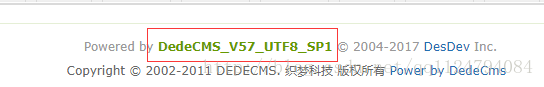

# 第 2 讲 信息收集 与 网络扫描

孙子云：知彼知己者，百战不殆；不知彼而知己，一胜一负；不知彼不知己，每战必殆。

信息收集对于网络攻击、渗透测试非常重要的。只有我们掌握了目标网站或目标主机足够多的信息之后，我们才能更好地对其进行漏洞检测。

信息收集的方式可以分为两种：

- 主动信息收集：
  - 通过直接访问、扫描网站，这种流量将流经网站。
  - 可能获取更多的信息
  - 可能会被记录。
- 被动信息收集：
  - 利用第三方的服务对目标进行访问了解。
  - 例如：Google搜索、Shodan搜索等
  - 收集的信息会相对较少
  - 行动不会被目标主机发现。

信息收集到底要收集哪些信息呢？

- 目标（某个组织）
  - 具体使用的域名
  - 网络地址范围
  - 因特网上可直接访问的IP地址与网络服务
  - 网络拓扑结构
  - 电话号码段
  - 电子邮件列表
  - 信息安全状况
- 目标（某个人）
  - 身份信息
  - 联系方式
  - 职业经历
  - 其它个人隐私信息

下面是一个域名探查示例：


## DNS域名 、 IP地址的收集

信息收集目标：

- 域名
- 对应的 ip
- 域名注册人
- DNS记录、
- 子域名
- 其它相关的信息

### 基本方法

1.使用Google 和 百度等搜索引擎探查目标信息。

2.使用nslookup等工具查找域名以及相对应的IP地址。

一些和域名查询相关的网站：

- DNS查询：https://dnsdb.io/zh-cn/ 
- 微步在线：https://x.threatbook.cn/ 
- 在线域名信息查询：http://toolbar.netcraft.com/site_report?url=
- http://viewdns.info/
- CDN查询IP：https://tools.ipip.net/cdn.php 
- SecurityTrails平台：https://securitytrails.com/domain/www.baidu.com/history/a


使用nslookup有时候不准确，因为大型网站可能会采用复制的网络架构。


3.判断该域名是否存在CDN的情况。

我们可以去在线CDN查询网站：http://ping.chinaz.com

- 如果查询出的IP地址数量大于1个，说明该ip地址不是真实的服务器地址。
- 如果是2~3个IP地址，并且这几个地址是同一地区的不同运营商的话，则很有可能这几个地址是服务器的出口地址，该服务器在内网中，通过不同运营商NAT映射供互联网访问，同时采用几个不同的运营商可以负载均衡和热备份。
- 如果是大于3个IP地址，并且这些ip地址分布在不同地区的话，则基本上可以断定就是采用了CDN了。

验证CDN还可以使用下列测试网站：
- http://ping.chinaz.com/
- http://ping.aizhan.com/
- http://ce.cloud.360.cn/
- ICP备案查询网站（Beianchaxun.net)
- http://www.miitbeian.gov.cn/publish/query/indexFirst.action
- IP2Location

4.绕过CDN查找网站真实IP地址

方法一：查看 IP 与 域名绑定的历史记录，可能会存在使用 CDN 前的记录，除了过去的DNS记录，即使是当前的记录也可能泄漏原始服务器IP。

例如，MX记录是一种常见的查找IP的方式。如果网站在与web相同的服务器和IP上托管自己的邮件服务器，那么原始服务器IP将在MX记录中。

方法二：查询子域名，毕竟 CDN 还是不便宜的，所以很多站长可能只会对主站或者流量大的子站点做了 CDN，而很多小站子站点又跟主站在同一台服务器或者同一个C段内，此时就可以通过查询子域名对应的 IP 来辅助查找网站的真实IP。

### Google Hacking 技术

Google Hacking :使用Google搜索引擎或其他Google应用程序通过特定语法来查找网站配置或代码中的安全漏洞。


#### google 操作符（operator）

**语法： operator:search_term**

> 操作符中以all开头的操作符在一般情况下一个查询中只能使用一次，不能和其他操作符混用。

##### intext:

把网页中的正文内容中的某个字符做为搜索条件(但是只能搜索冒号后接的一个关键字).例如在google里输入:intext:钓鱼(广义的).将返回所有在网页正文部分包含"钓鱼(广义的)"的网页，可以与其他操作符混合使用，可单独使用。

##### allintext:

使用方法和intext类似，能接多个关键字，能与其他操作符混合使用，可单独使用。

##### intitle:
搜索网页标题中是否有所输入字符.例如输入:intitle:五点共圆.将返回所有网页标题中包含"五点共圆"的网页，可以与其他操作符混合使用，可单独使用。

##### allintitle:

和intitle类似，能接多个关键字，但是不能与其他操作符混合使用，可单独使用。

##### cache:
输入URL，搜索特定页面的缓存快照，即使目标页面发生变动甚至不存在了，依然可以看到它的副本。

##### define:
搜索输入关键词或关键词组的定义来源链接,例如搜索:define:script,将返回关于script的定义，该操作符不能与其他操作符及关键字混用。

##### filetype:
搜索指定类型的文件.例如输入:filetype:asp.将返回所有以asp结尾的文件的URL，可以与其他操作符混合使用。

##### ext:

与filetype等价。

##### info:
搜索输入URL的摘要信息和其他相关信息，该操作符不能与其他操作符及关键字混用。

##### inurl:
搜索输入字符是否存在于URL中.可以联合site指定来找后台、fck之类，可以与其他操作符混合使用，可单独使用。

##### allinurl:

类似inurl:,但是可指定多个字符，不能与其他操作符混合使用，可单独使用。

##### link:
搜索链接到所输入URL的页面，该操作符不需要关键字，不能与其他操作符及关键字混用。

##### site: (这个下面Ⅲ也会讲)
将搜索范围缩小到特定的网站，域或子域。

##### related:

冒号后接一个URL，搜索与该URL相关的页面，该操作符不能与其他操作符及关键字混用。

##### numrange:

冒号后接数字范围，用一个减号两边接数字来表示。减号左边为最小值，右边为最大值，从而搜索数字。

##### inanchor:

搜索一个HTML标记中的一个链接的文本表现形式，即在链接文本中搜索冒号后紧接的一个关键字。

至于“链接文本”，比如
```<a href="GNU/Linuxhttp://www.linux.org/">GNU/Linux</a>```
以上代码中的“GNU/Linux”就是链接文本。

##### stocks:

搜索关于指定公司的股票市场信息。

##### insubject:

搜索Google组的标题行。

##### daterange:

搜索某个日期范围内Google做索引的网页。

#### 使用Google hacking 发现网站入口

找各种web入口,当然,这里所指的web入口并非仅限于各种常规网站后台(说到网站后台,一定要手工多尝试几个路径,实在猜不到,再用字典跑,节省时间)

例如一些疑似目标内网的各种web管理系统入口,web端的数据库管理入口,某些设备的web端配置入口,以及一些常见的java控制台入口等等...能上传脚本的地方全部都可以尝试。

##### 搜集各版本tomcat入口（默认在8080端口）

```
intext:$CATALINA_HOME/webapps/ROOT/ intitle:apache tomcat 	#直接这样搜结果肯定会非常多
intext:$CATALINA_HOME/webapps/ROOT/ inurl:8080/  #我们可以带指定端口号去搜,因为有些web并非在默认端口上,这样搜的话,可以尽量防止有漏网之鱼
intext:$CATALINA_HOME/webapps/ROOT/ intitle:Apache Tomcat/5.5.27 site:*.hk      针对特定版本特定国家去搜,比如爆出某个版本有远程执行类的漏洞就可以利用这种方式来批量进行
intext:$CATALINA_HOME/webapps/ROOT/ intitle:Apache Tomcat/7.0.32 site:*.gov.br
intext:$CATALINA_HOME/webapps/ROOT/ intitle:Apache Tomcat/5.0.12 site:*.cn
```

##### 搜集weblogic入口
```
inurl:/console/login/LoginForm.jsp 
inurl:/console/login/LoginForm.jsp intitle:Oracle WebLogic Server
inurl:/console/login/ intitle:"Oracle WebLogic Server 管理控制台"
```
##### 搜集jboss入口
```
inurl:/jmx-console/htmladaptor
inurl:/jmx-console/htmladaptor site:*.edu.*
inurl:/jmx-console/htmladaptor site:*.org.*
inurl:/jmx-console/htmladaptor site:*.tw
```

##### 搜集websphere入口
```
inurl:/ibm/console/logon.jsp
```
##### 搜集phpmyadmin入口

```
inurl:/phpMyAdmin/index.php 
inurl:/phpMyAdmin/index.php db+information_schema   	指定命中数据
inurl:/phpMyAdmin/index.php intext:phpMyAdmin 2.7.0 	直接针对特定版本号去搜索,更加精准
inurl:/phpMyAdmin/index.php site:*.tw
inurl:/phpMyAdmin/index.php site:*.org
inurl:/phpMyAdmin/index.php site:*.hk
```
##### 批量搜集webmin入口

其实就是一个web版的linux系统管理工具,默认情况下工作在web端的10000端口上。

```
intitle:Login to Webmin intext:"login to the Webmin server on"
```

##### 批量搜wordpress程序

关于wp的特征比较多,大家可自行构造。

```
inurl:/wp-login.php  site:*.hk
index of /wp-content/uploads inurl:/wp-login.php
inurl:/wp-content/themes/theagency
```

##### 批量搜joomla程序

```
inurl:/administrator/index.php
inurl:index.php?option=com_advertisementboard  找注入
inurl:index.php?option=com_carocci
inurl:index.php?option=com_product
inurl:/administrator/index.php site:*.hk

```

### 本节实验操作

#### 使用 whois、host、nslookup等命令 查看域名注册信息

Whois命令可以查询域名的注册信息。

1.尝试运行下列命令：
```
whois www.taobao.com
```

2.尝试运行下列命令：
```
host -a taobao.com

```

3.尝试运行下列命令：
```
nslookup taobao.com

```

4.

#### 使用 dmitry 根据域名收集信息

Dmitry 可用于以域名信息为主的综合信息收集。

在Kali 201902中打开一个终端，然后运行命令：
```
dmitry baidu.com
```

此工具的高级功能借助了google.com

#### 有条件的同学尝试使用Google hacking 功能

## 主机类信息收集

- OS类型与版本
  - Linux or Windows
- 应用服务器的类型与版本
- Web服务器端脚本类型
- 数据库类型
- CMS类型
- 网站敏感目录和文件

### OS信息探查

探查方法主要有：

- 使用ping命令

早期，判断是Linux还是Windows最简单就是通过ping来探测。

Windows的TTL值都是一般是128，Linux则是64。所以大于100的肯定是Windows，反之是Linux。

- 使用nmap等扫描器

### 网站服务探查

我们还需要知道目标网站用的web服务器的类型和版本。

常见的Web server是：
- Apache
- Nginx
- Tomcat
- Mircosoft IIS
- Weblogic
- Websphere
- JBoss

探查方法，仍然是使用nmap\whatweb这类扫描器。


### 脚本类型

服务器端程序通常会使用php 、Jsp 、Asp 、Aspx 等语言实现，了解它们可以用于漏洞分析。

判断方法主要有：
- 根据web服务器类型判断
- 根据网站URL来判断
- 根据浏览器开发者工具来判断

### 数据库类型

常见类型的数据库有：
- Mysql
- Oracle
- SqlServer
- Access

Web服务器端常见搭配方式：
- ASP 和 ASPX：ACCESS、SQL Server
- PHP：MySQL、PostgreSQL
- JSP：Oracle、MySQL

### CMS 类型

CMS代表“内容管理系统”，是一种软件工具，允许我们创建，编辑和发布内容。

内容管理系统分为四种不同类型：
- 企业内容管理系统（ECM / ECMS）
- Web内容管理系统
- Web组内容管理系统
- 组件内容管理系统

常见的CMS有（https://github.com/postlight/awesome-cms）：
- Zoomla
- StoryServer3 
- WordPress
- Drupal
- Xoops
- CmsTop等

#### 判断CMS类型的方法

- 1.阅读网站robots.txt，从中可以发现有用信息，然后借助Google 和 百度查询。
  


- 2.通过版权信息（一般在网站底部，由模板生成）



- 3.查看网页源代码


- 4.通过CMS特性目录或文件名来判断

收集某个cms的是否存在默认路径、默认文件，之后与已经掌握的CMS模板路径和文件进行比较。比较方法是计算两者的md5值。

- 5.搜索引擎探测CMS

在google里site:目标站 CMS 或者内容管理系统。还可以使用：
- site:目标.com cms
- site:目标.com 内容管理系统
- site:目标.com 版权
- site:目标.com title:cms
- site:目标.com title:内容管理
- site:目标.com inurl:cms

- 6.其它工具分析

分析探查时可用工具：
- AWVS
- WWWSCAN
- whatweb，http://whatweb.bugscaner.com/look/
- googlehack

### 网站敏感目录和文件

网站目录结构，敏感文件有可能会泄漏信息。

特别要注意的是：
- 后台（管理）目录
可以查看是否存在弱口令，万能密码。

- 安装包
从中获取数据库信息，甚至是网站源码。

- 上传目录
尝试是否可以上传脚本、程序等。如果可以，则极有可能形成漏洞利用。

- mysql管理接口
查看是否有弱口令、万能密码。

- 安装页面
可以尝试二次安装，进而绕过访问控制。

- phpinfo
有可能暴漏各种信息。

- 编辑器：fck、ke、等
可能存在注入漏洞、上传漏洞等。

探测目标网站后台目录的工具有： 
- wwwscan
- 御剑
- dirbuster
- cansina 等


### 本节实验操作：使用 nmap 进行网络扫描

完成本实验，需要安装：
- kali 201902虚拟机，假设其IP地址为：10.10.10.130
- owasp bwa v1.2 虚拟机，假设其IP地址为：10.10.10.135

#### nmap 常用参数速查表
- -sT
TCP connect()扫描，这种方式会在目标主机的日志中记录大批的链接请求以及错误信息。
- -sP     
ping扫描，加上这个参数会使用ping扫描，只有主机存活，nmap才会继续扫描，一般最好不加，因为有的主机会禁止ping，却实际存在。
- -sS     
半开扫描，一般不会记入日志，不过需要root权限。
- -sU     
udp扫描，但是一般不可靠，
- -sA     
用来穿过防火墙的规则集，速度慢。
- -sV     
端口服务及版本
- -A       
包含了-sV，-O，全面系统检测，启动脚本检测，扫描等。
- -P0     
扫描之前不使用ping，适用于防火墙禁止ping，比较有用。
- -v      
显示扫描进程
- -O       
探测目标系统的漏洞，容易误报
- -oN/-oX/-oG     
将报告写入文件，格式分别为正常（自定义.txt）,XML,grepable.
- -iL      
扫描主机列表
- -sC   --script=default   
默认的脚本扫描，主要是搜集各种应用服务的信息

#### Nmap扫描实验 1 识别活跃的主机

使用nmap查看主机是否在线，执行命令如下：

```
# 扫描单个主机IP
nmap -sP 10.10.10.135

# 扫描整个子网 
nmap 10.10.10.0/24

# 扫描多个主机 
namp 10.10.10.135 10.10.10.136

# 扫描一个小范围 
nmap 10.10.10.135-200

# 扫描某个文件（txt）内的ip列表  
nmap -iL text.txt

# 扫描除某个目标外   
nmap 10.10.10.135/24 -exclude 10.10.10.130
# 扫描除某个目标文件外的ip  
nmap 10.10.10.135/24 --exclude targets.txt

# 设置扫描强度，最快为T5 ，最慢为T1
nmap -T5 10.10.10.135/24 
```

#### Nmap扫描实验 2  查看打开端口

常用命令如下：
```
# 使用nmap查看10.10.10.135上常用的1-1000号端口
nmap 10.10.10.135

# 扫描指定扫描端口（指定扫描100-1000范围内的端口）
nmap -p 20-25,80,443 10.10.10.135

# 使用 -F 快速扫描参数，扫描1-100号端口
nmap -F 10.10.10.135

# 扫描特定端口3389
nmap -p 3389 10.10.10.135

# 扫描所有端口
nmap -p 10.10.10.135
```

#### Nmap扫描实验 3 系统指纹信息识别

常用命令如下：
```
# 加-O参数用于识别操作系统,如：
nmap -O 10.10.10.135

# 使用 -A 参数提供更多信息
nmap -A 10.10.10.135
```

#### Nmap扫描实验 4 服务的指纹识别

```
# 使用选项 -sV可以查看端口服务版本信息
nmap -sV 10.10.10.135
```
#### Nmap扫描实验 5 追踪路由信息
```
# 使用 --traceroute，完成路由追踪
nmap --traceroute 某个域名

# 显示主机接口和路由 
nmap --iflist
```
#### Nmap扫描实验 6 保存结果到文件

```
# 保存到文本文件中,使用 -oN 路径 
nmap -oN <path where you want to save file> 某个域名
# 或者用 > (重定向符)
nmap 10.10.10.135 > output.txt 

# 保存到xml文件，使用 -oX 路径
nmap -oX <path where you want to save file> 某个域名
```


#### Nmap扫描实验 7 TCP 扫描与UDP扫描

```
# 使用-sS 表示TCP SYN 扫描、-sU表示 UDP扫描
 nmap -sS -sU -PN 192.168.0.164

# Fin scan 
nmap -sF 192.168.7

```
##### Nmap扫描实验 8 检查是否有防火墙

```
# 使用-sA 即ACK扫描
nmap -sA 192.168.1.254 

# 使用 -PN 
nmap -PN 192.168.1.1 

# 如果有防火墙，阻碍icmp ping探测，可以尝试下列命令
nmap -PS 192.168.1.1 
nmap -PS 80,21,443 192.168.1.1 
nmap -PA 192.168.1.1 
nmap -PA 80,21,200-512 192.168.1.1 

**The following scan types exploit a subtle loophole in the TCP and good for testing security of common attacks: 

## TCP Null Scan to fool a firewall to generate a response ## ## Does not set any bits (TCP flag header is 0) ## 

Command: nmap -sN 192.168.1.254   

## TCP Fin scan to check firewall ## ## Sets just the TCP FIN bit ## 

Command:nmap -sF 192.168.1.254   

## TCP Xmas scan to check firewall ## ## Sets the FIN, PSH, and URG flags, lighting the packet up like a Christmas tree ## 

Command: nmap -sX 192.168.1.254 
```

##### Nmap扫描实验 7 扫描 IPv6


```
# 使用 -6 参数 表示地址为ipv6
nmapp -6 ipv6 address here

```
其中，'-6' 将开启 ipv6 扫描.


##### Nmap扫描实验 8 显示 nmap 端口扫描结果的判断依据

```
# 使用 --reason
nmap --reason 192.168.0.1

# 显示所有发出和收到的数据包
nmap --packet-trace 192.168.1.1
```

#### Nmap扫描实验 9 Nmap的多种扫描方法

```
# Scan a host using ip protocol ping
nmap -PO 192.168.1.1

# Scan a host using UDP ping 
nmap -PU 192.168.1.1 
nmap -PU 2000.2001 192.168.1.1 

# Scan for IP protocol 
nmap -sO 192.168.1.1 

```

#### Nmap扫描更多实例

以下内容可以选作。

```
# 获取远程主机信息（-sS 为TCP SYN扫描，-Po 允许icmp，-sV 服务版本检测，-O 识别os）
nmap -sS -Po -sV -O <target>

# 获取指定且open端口的服务信息
nmap -sT -p 80 -oG – 192.168.1.* | grep open

# 找出192.168.0.网段内所有活跃设备
nmap -sP 192.168.0.*

# 找出给定子网内没使用的ips
nmap -T4 -sP 192.168.2.0/24 && egrep “00:00:00:00:00:00” /proc/net/arp

# 扫描LAN中有 Conficker 病毒的主机
nmap -PN -T4 -p139,445 -n -v –script=smb-check-vulns –script-args safe=1
192.168.0.1-254


# 扫名 Rouge Network可用的服务
nmap -A -p1-85,113,443,8080-8100 -T4 –min-hostgroup 50 –max-rtt-timeout
2000 –initial-rtt-timeout 300 –max-retries 3 –host-timeout 20m
–max-scan-delay 1000 -oA wapscan 10.0.0.0/8

# 使用代理(-D 192.168.0.2)，以隐藏自身
sudo nmap -sS 192.168.0.10 -D 192.168.0.2

# 列出某个子网的反向 DNS records
nmap -R -sL 209.85.229.99/27 | awk ‘{if($3==”not”)print”(“$2″) no PTR”;else print$3″ is “$2}’ | grep ‘(‘


this command perform reverse dns lookup for a subnet It produces a list of
IP addresses with the corresponding PTR record for a given subnet. You can enter the
subnet in CDIR notation (i.e. /24 for a Class C)). You could add “–dns-servers x.x.x.x” after
the “-sL” if you need the lookups to be performed on a specific DNS server. On some
installations nmap needs sudo I believe. Also I hope awk is standard on most distros.


# 显示在你的子网内有多少 Linux And Windows Devices
sudo nmap -F -O 192.168.0.1-255 | grep "Running: " > /tmp/os; echo "$(cat /tmp/os | grep Linux | wc -l) Linux device(s)"; echo "$(cat /tmp/os | grep Windows | wc -l) Window(s) devices"


#  Scan a firewall for packets fragments 
# The -f option causes the requested scan (including ping scans) to use tiny fragmented IP packets. The idea is to split up the TCP header over several packets to make it harder for packet filters, intrusion detection systems, and other annoyances to detect what you are doing. 

nmap -f 192.168.1.1 
 nmap -f fw2.nixcraft.net.in 
nmap -f 15 fw2.nixcraft.net.in
# Set your own offset size with the --mtu option 
nmap --mtu 32 192.168.1.1

# Cloak a scan with decoys 
#The -D option it appear to the remote host that the host(s) you specify as decoys are scanning the target network too. Thus their IDS might report 5-10 port scans from unique IP addresses, but they won’t know which IP was scanning them and which were innocent decoys: 

nmap -n -Ddecoy-ip1,decoy-ip2,your-own-ip,decoy-ip3,decoy-ip4 remote-host-ip 

nmap -n -D192.168.1.5,10.5.1.2,172.1.2.4,3.4.2.1 192.168.1.5 


# Scan a firewall for MAC address spoofing 
nmap --spoof-mac MAC-ADDRESS-HERE 192.168.1.1   


# Add other options ### 
nmap -v -sT -PN --spoof-mac MAC-ADDRESS-HERE 192.168.1.1    


# Use a random MAC address ### ### The number 0, means nmap chooses a completely random MAC address ### 
nmap -v -sT -PN --spoof-mac 0 192.168.1.1 
```

## 参考资料

1. https://www.exploit-db.com/google-hacking-database
2. https://klionsec.github.io/2014/12/14/search-hacking/
3. http://sec-redclub.com/archives/116/
4. https://zhuanlan.zhihu.com/p/22161675
5. https://blog.csdn.net/qq_36119192/article/details/84029809
6. https://medium.com/@iyouport/%E8%B6%85%E7%BA%A7%E6%83%85%E6%8A%A5%E6%94%B6%E9%9B%86%E5%B7%A5%E5%85%B7%E5%BA%93-%E5%BC%80%E6%BA%90%E9%AA%8C%E8%AF%81%E5%92%8C%E8%B0%83%E6%9F%A5%E5%B7%A5%E5%85%B7%E5%8F%8A%E4%BD%BF%E7%94%A8%E6%96%B9%E6%B3%95-aef21bbe3b8b