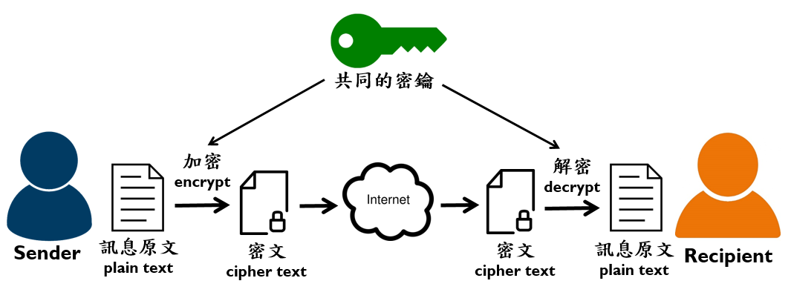
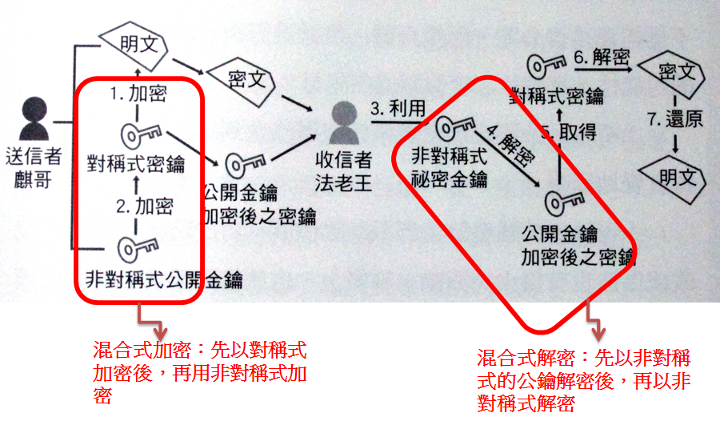
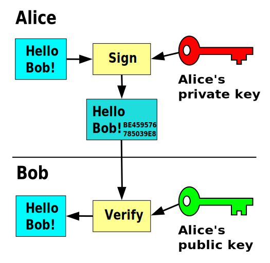

# 第3讲 密码破解

密码学（Cryptography）中，加密（Encryption）是一个过程，它将人类可读的明文（plain text）转变为不可读的密文（cipher text）。而解密，是加密的逆过程。


密码破解，或称密钥攻击，就是在不知晓密钥的情况下，将密文转为明文。

## 密码学简单回顾

### 保证数据机密性的加密

使用对称、非对称加密，可以保证数据的机密性。

#### 对称加密

采用了对称密码编码技术，它的特点是文件加密和解密使用相同的密钥，即加密密钥也可以用作解密密钥



常用算法：
- DES
- 3DES
- AES
- PBE

优点:
- 算法公开
- 计算量小
- 加密速度快，加密效率高

缺点:
- 加解密双方需要使用相同的秘钥
- 秘钥管理很不方便，如果用户很多，那么秘钥的管理成几何性增长
- 任何一方秘钥泄露，数据都不安全

#### 非对称加密

需要两个密钥：公开密钥（publickey）和私有密 （privatekey）。公开密钥与私有密钥是一对，如果用公开密钥对数据进行加密，只有用对应的私有密钥才能解密；如果用私有密钥对数据进行加密，那么只有用对应的公开密钥才能解密。


常用算法：
- RSA
- Elgamal
- DH
- ECC

优点:
- 一对公私钥，安全性更高
- 秘钥管理很方便

缺点:
- 计算量大
- 加密速度慢，比对称加密算法慢1000倍左右
- 不适合大数据量加密

#### 混合加密

对称加密 + 非对称加密



### 保证数据完整性的消息验证码（消息认证码）、哈希码（hash）

#### 消息认证码

密码学中，通信实体双方使用的一种验证机制，保证消息数据完整性的一种工具。
构造方法由M.Bellare提出，安全性依赖于Hash函数，故也称带密钥的Hash函数。消息认证码是基于密钥和消息摘要所获得的一个值，可用于数据源发认证和完整性校验。


### 防止抵赖的数字签名

密钥生成：


加密过程：


签名过程：



## 密码破解方法论

### 破解原则

破解时采取先易后难的原则，建议如下：

- 利用收集的公开字典进行破解

- 使用1-8位数字进行破解。

- 使用1-8位小写字母进行破解

- 使用1-8位大写字母进行破解

- 使用1-8位混合大小写+数字+特殊字符进行破解

### 实用建议

- 首先试试常用的弱口令字典
- 组合密码，如：zhang1999，用姓氏和出生年组合
- 把常用的掩码组合整理起来放在masks中的.hcmask文件中，然后让它自动加载破解
- 如果实在不行，你可以尝试低位数的所有组合去跑，不建议太高位数的组合去破解，若密码很复杂则花费更多时间也不行。
  
## 使用 HashCat 破解/恢复密码

hashcat号称世界上最快的密码破解工具。

特性：
- 世界上第一个和唯一的基于GPGPU规则引擎；
- 支持使用GPU、CPU、APU、DSP、FPGA、Coprocessor来进行密码破解；
- 免费支持多GPU（高达128个GPU）；
- 支持多哈希算法
- 支持多操作系统（Linux和Windows本地二进制文件）
- 支持多平台（OpenCL和CUDA支持）
- 支持多加密算法（目前247类）
- 资源利用率低
- 破解方法全面：基于字典攻击，暴力珀耳疾，融合方法；
- 支持分布式破解等等

### Hashcat使用方法（Usage）

hashcat [options]… hash|hashfile|hccapxfile [dictionary|mask|directory]…

例如：

```
hashcat 8743b52063cd84097a65d1633f5c74f5

hashcat --force -a 0 -m 0 hash.txt /home/weak_wordlist/pass/weakpass.txt -o res.txt
```
### 常见选项（options）

- -a  
指定要使用的破解模式，其值参考后面对参数。“-a 0”字典攻击，“-a 1” 组合攻击；“-a 3”掩码攻击。
- -m  
指定要破解的hash类型，如果不指定类型，则默认是MD5。
- -o  
指定破解成功后的hash及所对应的明文密码的存放位置,可以用它把破解成功的hash写到指定的文件中。
- --outfile-format 
指定破解结果的输出格式id,默认是3。
- --force 
忽略破解过程中的警告信息,跑单条hash可能需要加上此选项。
- --show  
显示已经破解的hash及该hash所对应的明文。
- --increment  
启用增量破解模式,你可以利用此模式让hashcat在指定的密码长度范围内执行破解过程。
- --increment-min  
密码最小长度,后面直接等于一个整数即可,配置increment模式一起使用。
- --increment-max  
密码最大长度,同上。

- --username   
忽略hash文件中的指定的用户名,在破解linux系统用户密码hash可能会用到。
- --remove     
删除已被破解成功的hash。
- -r       
使用自定义破解规则。

更多选项/参数使用下列命令获取：
```
hashcat --help
```

### hashcat 破解模式

即-a 选项后可选用的内容。


- 0，即Straight（字段破解）
- 1，即Combination（组合破解）
- 3，即Brute-force（掩码暴力破解）
- 6，即Hybrid Wordlist + Mask（字典+掩码破解）
- 7，即Hybrid Mask + Wordlist（掩码+字典破解）

### Hash mode 对照表

即选项-m  后可以选用的内容。

Hash mode（id）对照表内容非常多，使用hashcat --help可以看到，这里列举部分。

|编号|mode|类型（category)|
|-|-|-|
| 900 | MD4| Raw Hash|
| 0 | MD5| Raw Hash|
|  5100 | Half MD5| Raw Hash|
| 100 | SHA1    | Raw Hash|
| 1300 | SHA2-224| Raw Hash|
| 1400 | SHA2-256| Raw Hash|
| 10800 | SHA2-384| Raw Hash|
| 1700 | SHA2-512| Raw Hash|
| 17300 | SHA3-224| Raw Hash|
| 17400 | SHA3-256| Raw Hash|
| 17500 | SHA3-384| Raw Hash|
| 17600 | SHA3-512| Raw Hash|
| 10 | md5($pass.$salt)|                            | Raw Hash, Salted and/or Iterated
| 20 | md5($salt.$pass)|  


### 输出格式

即选项--outfile-format  后可以选用的内容。

1 = hash[:salt]
2 = plain
3 = hash[:salt]:plain
4 = hex_plain
5 = hash[:salt]:hex_plain
6 = plain:hex_plain
7 = hash[:salt]:plain:hex_plain
8 = crackpos
9 = hash[:salt]:crackpos
10 = plain:crackpos
11 = hash[:salt]:plain:crackpos
12 = hex_plain:crackpos
13 = hash[:salt]:hex_plain:crackpos
14 = plain:hex_plain:crackpos
15 = hash[:salt]:plain:hex_plain:crackpos

### 掩码（mask）设置

掩码的作用就像正则表达式，按一定规则代表一组文本。

|掩码| 可表达字符|说明|
|-|-|-|
| l | abcdefghijklmnopqrstuvwxyz|  纯小写字母|
| u | ABCDEFGHIJKLMNOPQRSTUVWXYZ |  纯大写字母|
| d | 0123456789| 纯数字|
| h | 0123456789abcdef| 常见小写子目录和数字|
| H | 0123456789ABCDEF| 常见大写字母和数字|
| s |  !"#$%&'()*+,-./:;<=>?@[\]^_`{\|}~ | 特殊字符|
| a | ?l?u?d?s| 键盘上所有可见的字符|
| b | 0x00 - 0xff| 可能是用来匹配像空格这种密码的 |

举几个简单的例子来了解一下掩码的设置：
```
八位数字密码：?d?d?d?d?d?d?d?d
八位未知密码：?a?a?a?a?a?a?a?a
前四位为大写字母，后面四位为数字：?u?u?u?u?d?d?d?d
前四位为数字或者是小写字母，后四位为大写字母或者数字：?h?h?h?h?H?H?H?H
前三个字符未知，中间为admin，后三位未知：?a?a?aadmin?a?a?a
6-8位数字密码：--increment --increment-min 6 --increment-max 8 ?l?l?l?l?l?l?l?l
6-8位数字+小写字母密码：--increment --increment-min 6 --increment-max 8 ?h?h?h?h?h?h?h?h
```

如果我们想设置字符集为：abcd123456!@-+，那该怎么做呢。这就需要用到自定义字符集这个参数了，hashcat支持用户最多定义4组字符集。

```
--custom-charset1 [chars]等价于 -1
--custom-charset2 [chars]等价于 -2
--custom-charset3 [chars]等价于 -3
--custom-charset4 [chars]等价于 -4
在掩码中用?1、?2、?3、?4来表示。
```

再来举几个例子：

```
--custom-charset1 abcd123456!@-+。然后我们就可以用"?1"去表示这个字符集了
--custom-charset2 ?l?d，这里和?2就等价于?h
-1 ?d?l?u，?1就表示数字+小写字母+大写字母
-3 abcdef -4 123456 那么?3?3?3?3?4?4?4?4就表示为前四位可能是“abcdef”，后四位可能是“123456”
```


### 其它

- 对于破解过的hash值，用hashcat64.exe hash --show查看结果
- 所有的hash破解结果都在hashcat.potfile文件中
- 如果破解的时间太长，可以按s键可以查看破解的状态，p键暂停，r键继续破解，q键退出破解。
- 在使用GPU模式进行破解时，可以使用-O参数自动进行优化

### hashcat 性能调优

考虑到hashcat的破解速度以及资源的分配，我们可以对一些参数进行配置

1. Workload tuning 负载调优。
该参数支持的值有1,8,40,80,160
--gpu-accel 160 可以让GPU发挥最大性能。

1. Gpu loops 负载微调
该参数支持的值的范围是8-1024（有些算法只支持到1000）。
--gpu-loops 1024 可以让GPU发挥最大性能。

3. Segment size 字典缓存大小
该参数是设置内存缓存的大小，作用是将字典放入内存缓存以加快字典破解速度，默认为32MB，可以根据自身内存情况进行设置，当然是越大越块了。
--segment-size 512 可以提高大字典破解的速度。
