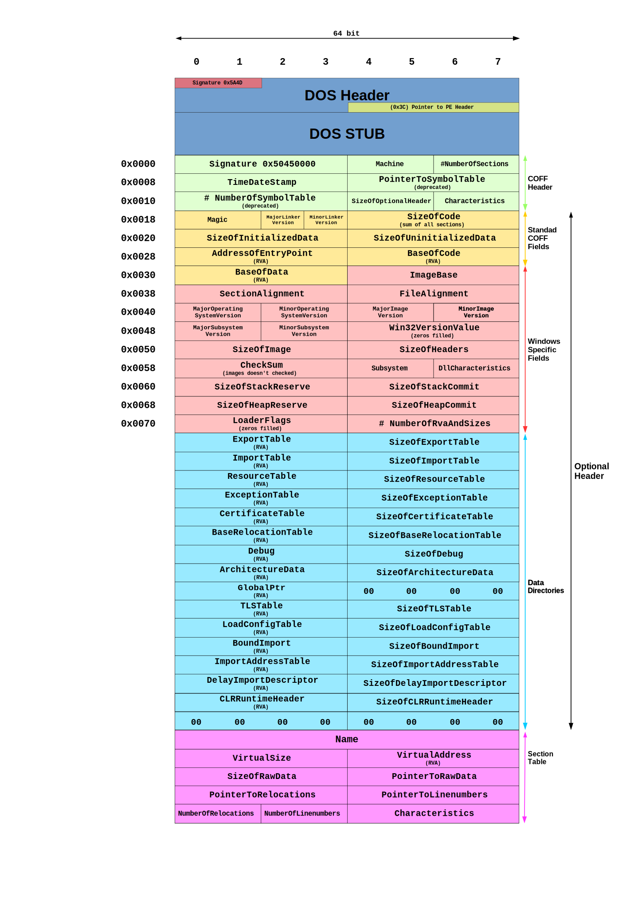

# 第4讲 恶意代码分析概要与静态分析

## 基础入门

### 恶意代码类型

- 后门
- 僵尸网络
- 下载器
- 间谍软件
- 启动器
- 内核套件rookit
- 勒索软件
- 蠕虫
- 病毒

### 恶意代码分析的目标

- 为一起网络入侵事件的响应提供所需信息
- 确定发生了什么？
- 找出所有感染的主机和文件
- 确定某个可疑二进制文件到底做了什么？
- 如何在网络上检测出它？它的特征码是怎样的？
- 如何衡量并消除它带来的影响？

恶意代码的识别主要依据两种方法：
- 恶意代码的特征码
- 恶意代码的行为特征

### 特征码

特征码，可以理解为恶意代码区别于非恶意代码的特征字节序列。通常以二进制或十六进制表示。

过去在某一种电脑病毒大爆发时，一些反病毒公司可能会采取计算整个病毒文件的MD5或SHA-256作为特征码的方法来加快查杀效率。 而在平时，会采用以静态分析文件的结构为主并结合动态的分析的方法，通过反汇编来寻找病毒的内容代码段、入口点代码段、机械码段等等信息。一般提取2个以上的代码段，有时会直接采用入口点的代码段来制作特征码。

---

遗憾的是，实际上典型特征码已经有20年左右未被使用了。

如今，单利用”特征码”是无法检测出恶意文件的。恶意软件作者可利用各种技术对”特征码”模糊处理，从而隐匿无踪。这也是为什么现代反病毒产品必须使用更加高级的检测方法的原因。反病毒数据库内仍含有”特征码”（占数据库的一半以上条目），同时也包含了更加复杂的条目。

#### 特征码的分类

##### 主机特征码

主机特征码，也称感染迹象，用于在受感染主机上检测出恶意代码。

这些迹象通常是恶意代码所创建或修改的文件，或是他们对注册表的特定修改。

##### 病毒特征码

也称恶意代码感染迹象，指的是对系统做了什么，而不是恶意代码本身的特征。

##### 网络特征码

通过检测网络流量，来检查恶意代码的迹象。

#### 特征码的提取

主要有下列一些技术：
- 全文生成
- 人工提取
- 自动提取

例如下列提取算法：
- 1.获取一个病毒程序的长度，根据长度可以将文件分为几份，份数根据样本长度而定，可以是3~5份，也可以更多。
- 2.每份中选取通常为16或32个字节长的特征串。这里一般要用到查重算法，从大量的恶意代码样本中提取相同的部分，这部分自然应该是特征串。
- 3.如果选出来的信息是通用信息，即很多文件该位置都是一样的信息，那么舍弃，调整偏移量后重新选取。
- 4.如果选取出来的信息是全零的字节。那么也要调整偏移后重新选取。当然调整的偏移量多少可以人为事先规定，也可以自动随机调节。
- 5.最后将选取出来的几段特征码及它们的偏移量存入病毒库，标示出病毒的名称即可。

病毒会以下列技术对抗特征码提取，以防止被检查出来：
- 模糊变换
- 等价指令替换
- 加壳
- 花指令

### 恶意代码的行为分析

一般来说，我们监控的行为包括以下几个部分：
- 修改注册表启动项（RUN、GINA）
- 修改关键文件（PE文件、系统配置文件）
- 控制进程（启动、关闭、修改进程）
- 访问网络资源（创建socket、对外发起连接）
- 修改系统服务（创建、修改、关闭系统服务）
- 控制窗口（隐藏窗口、截取指定窗口消息）

### 恶意代码分析方法

主要有两类：
- 静态分析
- 动态分析

#### 静态分析技术

静态分析是研究代码的第一步。

它通过分析程序指令和结构来了解程序的功能和过程。

静态分析技术，包括：

- 检查可执行文件的基本信息，但不执行程序；
- 反编译可执行文件，查看程序指令序列，分析代码意图。

#### 动态分析技术

动态分析技术包括：

- 建立安全运行环境，观察代码运行行为；
- 使用调试器检查程序运行时的状态。

#### 通用分析规则

- 不要过于陷入细节，紧紧围绕核心关键部分分析；
- 不同的工作任务，使用不同的方法和工具；
- 不断学习新技术。

### 参考文章：
1.https://bindog.github.io/blog/2015/08/20/microsoft-malware-classification/

2.https://zhuanlan.zhihu.com/p/32251097

## 静态分析技术基础

静态分析是研究代码的第一步。

它通过分析程序指令和结构来了解程序的功能和过程。

静态分析技术，包括：

- 检查可执行文件的基本信息，但不执行程序；
- 反编译可执行文件，查看程序指令序列，分析代码意图。

### 本节主要内容：

- 使用反病毒软件确定样本的恶意性
- 使用哈希来识别恶意代码
- 从文件的字符串列表、函数和文件头信息中发掘有用信息。

### 反病毒软件/引擎扫描

了解杀毒软件的杀毒过程，是学习恶意代码分析技术非常实用的第一步。

很多杀软是商业软件，但有5款知名的开源杀毒软件：
- OpenAntiVirus Project
- Armadito Antivirus
- ClamAV Open Source
- ClamWin Open Source
- Moon Secure Antivirus

如果你没有本地的反病毒软件，可以使用在线的，例如：

- https://www.virustotal.com/
- http://www.virscan.org/

### 哈希值：恶意代码的指纹

哈希是一种摘要算法，可以用来确定恶意代码的标识。常用哈希算法有：

- MD5
- SHA-1
- SHA-128
- SHA-256

### 查找字符串

程序中的字符串就是一串可打印的字符序列。一个程序总会包含一些可打印的消息、URL、文件名或路径。

可以使用Strings程序，查看一个程序中可打印字符串，以此了解程序内的一些情况。

这个程序可疑从：https://docs.microsoft.com/zh-cn/sysinternals/downloads/strings 下载。

在微软的windows中，对于unicode编码，采用的是双字节；而单字节字符串一般是ASCII码字符。

Strings工具有时也会判断错误，将不是字符的的字节翻译为字符，这需要用户确定它的正确性。

### 加壳与混淆恶意代码

恶意代码经常使用加壳或混淆技术，让他们的文件更难被检测和分析。

混淆程序是恶意代码是尝试隐藏其执行过程的代码。

加壳程序是混淆程序的一类。加壳后的恶意程序会被压缩，难以分析。

混淆后的恶意代码，往往有很少的可打印字符，这与正常程序不同。

混淆后的程序，往往包含LoadLibrary和GetProcAddress函数，用来加载其它程序或函数。

#### 文件加壳

已加壳的程序在运行时，会首先运行一段脱壳程序，解压加壳的文件；然后在运行脱壳后的文件。

加壳程序的字符串列表、导入表、其他信息都被压缩，大多数静态分析工具都看不到这些信息了。

#### 使用PEiD检查加壳

检查加壳程序的一种工具是PEiD。

PEiD虽然再2011年就不再更新和支持了，但仍然是很好用的工具。

注意，PEiD的插件会在没有警告的情况下运行恶意代码的可执行文件，一定要建立安全环境后再运行。

#### 其它壳工具

- UPX

https://github.com/upx/upx

### PE文件

可移植性可执行文件（英语：Portable Executable，缩写为PE）是一种用于可执行文件、目标文件和动态链接库的文件格式，主要使用在32位和64位的Windows操作系统上。

“可移植的”是指该文件格式的通用性，可用于许多种不同的操作系统和体系结构中。PE文件格式封装了Windows操作系统加载可执行程序代码时所必需的一些信息。这些信息包括动态链接库、API导入和导出表、资源管理数据和线程局部存储数据。在Windows NT操作系统中，PE文件格式主要用于EXE文件、DLL文件、.sys（驱动程序）和其他文件类型。可扩展固件接口（EFI）技术规范书中说明PE格式是EFI环境中的标准可执行文件格式。

PE文件格式其实是一种数据结构，包含Windows系统加载器管理可执行代码所必要的信息。几乎每个在Windows中加载的可执行代码都采用了PE文件格式。

PE文件以一个文件头开始，其中包含代码信息、应用程序类型、所需要的库函数与空间要求。PE文件头中的信息对于代码分析而言很有意义。

PE格式是由Unix中的COFF格式修改而来的。在Windows开发环境中，PE格式也称为PE/COFF格式。PE格式目前支持IA-32、IA-64和x86-64（AMD64/Intel64）的指令系统，还支持MIPS、Alpha和PowerPC的指令系统。由于Windows CE也在使用PE文件格式，因此PE仍然支持几种不同型号的MIPS、ARM（包括Thumb）和SuperH指令系统。

PE文件格式的主要竞争对手是可执行与可链接格式（ELF）（使用于Linux和大多数Unix版本中）和Mach-O（使用于Mac OS X中）。

参考：https://docs.microsoft.com/en-us/windows/win32/debug/pe-format

#### PE头概述

##### 导入函数

该PE文件包含了哪些windows库，以及哪些函数。
##### 导出函数

该PE文件，期望被其它程序或库所调用的函数。

##### 时间戳

该PE文件何时被编译。

##### 分节

文件分节的名称，所占空间大小

##### 子系统

指明程序类型。

##### 资源

该PE文件包含的图片、图标、菜单等等。

在PE文件头后，会跟随一系列的节，这些节包含了有用信息。

#### PE文件中常见的节

##### .text

包含了CPU执行命令、所有其它节存储数据和支持性信息。

一般来说，这是唯一可以执行的节，也应该是唯一包含代码的节。

##### .rdata

包含导入与导出函数信息，与Dependecy Walker和PEview工具看到的信息是相同的。

这个节还可以存储程序所使用的其它只读数据。

有些程序还包含.idata和.edata节，分别来存储导入导出信息。

##### .data

包含了程序的全局数据，可以从程序的任何地方访问到。

本地数据并不存储在此节中，而是PE文件某个其它位置上。

##### .rsrc

包含了由可执行文件所使用的资源，而这些内容并不是可执行的，比如图标、图片、菜单项、字符串等等。

字符串可以存在.rsrc节或主程序里，在这个节里经常存储的字符串是为了多语言支持使用。

##### .pdata

只在64位可执行文件中存在，存储异常处理信息。

##### .reloc

包含用来重定位库文件的信息。

##### 注意

不同编译器编译出的可执行文件节名称可能是不同的，但相同编译器编译的名称是相同的。

- visual studio 使用.text作为可执行代码节；
- Borland delphi则使用CODE作为可执行代码节。

windows不关心节名，PE中的其它信息确定了如何使用节。节名有时也会被混淆，使其难于分析。

#### 使用PEview来分析PE文件

使用这个工具可以分析PE文件。

##### IMAGE_NT_HEADERS

显示了NT文件头， 特征签名都是相同的，意义不大。

- IMAGE_FILE_HEADERS，包含了关于文件的基本信息。
- IMAGE_OPTIONAL_HEADERS，包含了几个重要信息：
  - 子系统subsystem，指出是一个控制台（即 WINDOWS_CUI） or 图形程序(即 WINDOWS_GUI)；还有Native 或 xbox 等不太常见。

##### 分节头部信息

这部分信息很有用。存储在IMAGE_SECTION_HEADER中 ，用于描述各个分节。

编译器通常负责创建和命名可执行文件的各个分节，而程序员往往无法控制这些名字，所以可执行文件的这些分节名称通常都是一致的。而任何偏差都是值得怀疑的。

下图中，可以看到Virtual size告诉我们加载过程中需要分配多少空间给一个分节；Size of Raw Data告诉我们磁盘上这个分节的大小。这两个值应该是相等的，即内存中占的字节和磁盘上的字节应该一样多，小的差别也有可能，但大的差别就有问题了。

> 分节大小，在检查加壳可执行程序时很有用。例如，若virtual size比size of raw data 大很多，你应该知道这个节在内存占用了过多的空间，意味着加壳代码的存在，特别是.text分节。

.data 分节的virtual size比size of raw data 大很多往往是正常的。

.text 分节的virtual size比size of raw data 基本一致，并不能说明这个程序是可信的，只能说明没有加壳，这个PE文件头是编译器产生的。

#### 使用 Resource Hacker工具检查资源节（.rsrc）

这个工具可以查看资源节.rsrc

下图查看calc.exe的资源使用：

可以查看：
- 图标icon
- 菜单menu
- 对话框dialog
- 字符串
- 版本信息

恶意代码，常把一个嵌入的程序或驱动放在资源节里，在程序运行前，他们将嵌入的可执行文件或驱动提取出来，Resource Hacker工具可以帮你分析他们。

#### 其它PE文件工具

##### PEBrowse Professional

##### PE Explorer

### Windows 链接库与函数

对于一个可执行程序，我们可以收集到的最有用信息之一，就是它的导入表。

导入函数是一个程序所使用的，但存在另一个程序中的函数，例如一些通用的函数。

代码库可以被静态链接，也可以在运行时链接，或称为动态链接。了解代码库如何被链接，这对于代码分析很重要。

PE头中可以找到的信息取决于链接了哪些代码库。

#### 静态链接

这是windows中最不经常使用的方法。但在Linux和Unix中常见。

此时，所有代码都被复制到可执行程序中，使得程序变大。在分析时，很难将它们区别开，因为PE文件头中没有表明这个文件包含哪些代码。

#### 运行时链接

运行时链接方式，在恶意代码中用的比较多。特别是在加壳、混淆后，只有在运行函数时才被加载。

一些Windows API允许程序员导入并没有在程序的文件头中列出的链接函数。其中最为常见的是：
- LoadLibrary
- GetProcAddress
- LdrGetProcAddress
- LdrLoadDll

前两个函数允许程序访问系统上任何库中的任何函数，这意味着当这些函数被使用时，你无法静态分析出可疑样本程序中会链接哪些函数。

#### 动态链接

动态链接是最常用的方法。也是代码分析最该注意的方法。

程序所使用的库与调用的函数，经常是一个程序中最重要的部分，识别他们尤为重要，通过这些信息可以猜测这个恶意代码样本到底做了些什么。例如，某程序使用了URLDownloadToFile函数，你就可以猜他下载了某个文件。

#### 使用 Dependency Walker工具探索动态链接函数

Dependency Walker是一个免费的实用程序，可以扫描任何32位或64位Windows模块（exe，dll，ocx，sys等），并构建所有相关模块的分层树形图。对于找到的每个模块，它列出了该模块导出的所有函数，以及其他模块实际调用了哪些函数。另一个视图显示所需文件的最小集合，以及每个文件的详细信息，包括文件的完整路径，基本地址，版本号，机器类型，调试信息等。

Dependency Walker对于解决与加载和执行模块相关的系统错误也非常有用。Dependency Walker检测到许多常见的应用程序问题，例如缺少模块，模块无效，导入/导出不匹配，循环依赖性错误，模块的机器类型不匹配以及模块初始化失败。

Dependency Walker可在Windows 95,98，Me，NT，2000，XP，2003，Vista，7和8上运行。它可以处理任何32位或64位Windows模块，包括专为Windows CE设计的模块。它可以作为图形应用程序或控制台应用程序运行。Dependency Walker处理所有类型的模块依赖项，包括隐式，显式（动态/运行时），转发，延迟加载和注入。包括详细的帮助。

Dependency Walker完全免费使用。但是，您可能无法从其分发中获利，也不会将其与其他产品捆绑在一起。

参考：http://www.dependencywalker.com/

下图是使用dw打开了project1.ext

下图是使用dw打开了calc.exe

如下图所示，单击图1中的KERNEL32.DLL，可以在右上角的窗格中显示出导入表。其中的CreateRemoteThread很有趣，表示该函数会使用这个函数生成远程线程。注意右侧上下两个窗口中列出了函数的名称和序号（ordinal）。可执行文件可以根据序号，而不是名称来导入函数，适用序号导入函数时，名称就不会在可执行文件中显示。这会造成分析的困难。此时，可以根据右侧下方的ordinal来判断到底导入了哪个函数。

上图中，底部的两个窗口，会分别显示运行程序时装载的DLL版本额外信息，以及报告错误。

#### 常见DLL的功能

##### Kernel32.dll

常用，包含系统核心功能，访问系统内存、文件、硬件等。

##### Advapi32.dll

提供了对核心Windows组件的访问，比如服务管理器和注册表。

##### User32.dll

包含了所有用户界面组件，如按钮，滚动条，控制和响应用户操作的组件。

##### Gdi32.dll

包含了图形显示和操作的函数。

#### Ntdll.dll

这是Windows内核的接口。可执行文件通常不直接导入这个函数，而是由Kernel32.dll间接导入，如果一个可执行文件导入了这个文件，意味着它企图使用那些不是正常提供给Windows程序使用的函数。例如：隐藏功能、操作进程等等会使用这个dll。

##### Wsock32.dll 和 Ws2_32.dll

这两个是联网dll，访问其中任何一个dll的程序可能是要连接网络，执行网络相关任务。

##### Wininet.dll

包含了更高层的网络函数，实现了如FTP、HTTP和NTP等协议。

#### 函数名约定

对一些不熟悉的Windows函数，一些命名规则值得考虑。

- 函数名后缀有“Ex"

这表示，该函数与另一个名字中无Ex后缀的函数不兼容。属于后来微软补充的函数。

- 以字符串为参数，且名字后面含一个“A”或一个“W”的函数

以A为结尾，表示接受的字符串参数是ASCII字符串；

以W为结尾，表示接受的是双字节的UNICODE字符串。

- 其它，有待总结...

- 对于导入表中的函数，也许只有少数是特别有意义的。对于不清楚的函数，最好到微软MSDN上弄清楚。恶意代码分析，往往会浏览很多函数，但要特别关注关键信息。

### 静态分析实践

了解了一些基本知识后，我们来对真实恶意代码进行初步静态分析。

下面将分析一个可疑的键盘记录器样本，然后再分析一个加壳程序。
