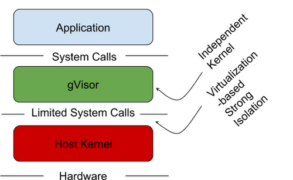

# 第7讲代码动态分析

动态分析就是在运行恶意代码之后进行检查的过程。

一般在静态分析不能解决问题时使用。例如，程序进行了混淆或无法理解程序时。

本节将介绍以下内容
- 沙箱
- 运行恶意代码的方法
- 进程监视器
- 进程浏览器（process explorer）查看进程

## 沙箱

比较简单的动态分析技术之一，是使用沙箱。

沙箱是一种在安全环境里运行不可信程序的安全机制，即一个虚拟环境，模拟网络和系统服务，使得被测试的软件可以正常运行。

有许多分析恶意代码的沙箱（前两个比较常用）：

- Norman沙箱
- GFI沙箱
- Anubis
- Joe沙箱
- ThreatExpert
- BitBlaze
- Comdo
- gvisor
- sandboxie


---
vm与容器的结合



---

虽然沙箱为我们提供了虚拟安全环境，但是恶意程序可以检测出沙箱环境的存在，从而不激活特定功能，这样沙箱中的动态分析就失去意义了。

此外，沙箱的能力是有限的，只能做基础的动态分析检查。

## 运行恶意代码

如果不运行恶意程序，动态分析基础技术就意义不大。运行一个EXE式的恶意代码很容易，但运行一个DLL式的恶意代码就不容易了。

如果启动一个DLL文件？

### 使用rundll32.exe

所有Windows中都包含了rundll32.exe程序，它提供了运行DLL的平台，用下面命令格式可以加载DLL：

```
c:\>rundll32.exe DLLname , Export arguments(参数)
```

Export值必须是一个DLL文件导出表中的函数名或者序号。可以使用Dependency Walker查看导出函数表。

例如，文件sqlite3.dll有如下导出表：


如果像运行 sqlite_db_status 函数，有两种方法：

```
c:\>rundll32.exe  sqlite3.dll, sqlite_db_status
```
或使用序号

```
c:\>rundll32.exe  sqlite3.dll, #64
```

恶意的DLL文件通常在DLLMain（称作DLL函数入口点）执行它们的代码，因为无论DLL什么时候被加载，DLLMain函数总会被执行，这样就总能通过rundll32.exe加载DLL，而动态地获取信息。

### 修改PE头部

除此之外，你甚至可以通过修改PE头部，改变它的扩展名，使得windows以一种可执行文件的方式来加载DLL。我们可以使用如下方法来修改PE头部，即从IMAGE_FILE_HEADER的特征域里擦除IMAGE_FILE_DLL(0x2000)标记。

尽管这样的修改不会执行任何输入函数，但他会调用DLLMain方法，而且有可能造成恶意代码意想不到的崩溃或者终止。然而，只要修改使恶意代码执行它的恶意部分，你就能收集到信息，这有时就足够了。

### 将DLL安装为一个服务

如果，DLL形态的恶意代码需要被安装为一个服务，那么可以用如下命令安装：

```
c:\> rundll32.ex3 ipr32x.dll , InstallService ServiceName

c:\> net start ServiceName
```

这里的ServiceName参数必须提供给恶意代码，让她能被安装运行起来。而在windows系统中启动指定的服务可用net start命令。

注意，如果你在可疑代码中看见一个ServiceMain函数，没有像Install或InstallService这样的导出函数，那你需要手动安装服务。可以使用windows系统下的sc命令，或者修改注册表为一个未使用服务进行手动安装，然后使用net start启动服务。Windows服务的注册表项位于HKLM\SYSTEM\CurrentControlSet\Services.

## 进程监视器

进程监视器（process monitor）是Windows系统下的高级监视工具，它可以监控注册表、文件系统、网络、进程、线程行为。

它结合了两种工具：

- 文件监视器FileMon
- 注册表监视器RegMon

它不能完成以下任务：

- 监控网络行为
- 用户态组件通过设备IO控制与内核套件进行通信的设备驱动行为；
- 一些特定的图形界面调用，如SetWindowsHookEx等。

一旦启用这个工具，他就会开始监测，每秒钟会有上万个事件被捕捉，这可能会耗尽内存。所以，在监控一段时间后就要Edit-capture来抓取当前已检测到的进程（停止监测）。

监视前，要选择Edit-Clear Display清除掉不相关的数据。


要找到信息，往往需要过滤器（Filter-filter)进行过滤。过滤器设置后，仅影响显示，不影响监测过程。

## 进程浏览器（process explorer）查看进程

这个工具是微软提供的，它是一个强大的任务管理器，是进行动态分析时必备的工具。

可以使用它来列出所有活跃的进程、被进程载入的DLL、各种进程属性和整体系统信息。

也可以使用它杀死一个进程、退出用户登录、启动和激活进程。


进程浏览器上显示了5栏信息：

- Process进程名
- PID进程号
- CPU使用率
- Description描述
- Company Name软件公司名

视图每秒更新一次，其着色规则默认为：
- 服务以粉色高亮显示；
- 进程以蓝色显示；
- 新进程以绿色显示；
- 被终止的进程以红色显示。

双击一个进程，会打开一个属性窗口：


进程浏览器显示了进程相当多的细节。例如，当点机Project1进程，在菜单“view-show lower pane“时，DLL信息窗口被激活时，可以查看到该进程调用的所有DLL。如下图：


当把dll视图切换到句柄视图后，它显示了该进程所有的句柄，包括：文件句柄、互斥量、事件等等。


### 使用验证（verify）功能

微软自己的程序都有数字签名，使用验证功能能够发现假冒的程序。这一功能在磁盘上windows文件没有被破坏时特别有用，恶意程序经常替换windows认证文件，使其签名合法，隐藏自己。

验证功能验证的是磁盘上的镜像文件，而不是内存中的，因此他可能会失败。如果一个攻击者使用进程替换技术process replacement，包括在系统上执行进程并用恶意代码重写内存空间，这时候验证功能就没有用了。

> 进程替换技术使得恶意代码和合法代码一样，具有同样的特权和签名，但他在内存中的镜像和磁盘上的不一样。


这个功能在双击进程后，展开的属性窗口中有相同的“image-verify”。

### 比较字符串

一种识别进程替换的方法——是使用进程属性窗口的字符串（strings）标签，通过比较包含在磁盘上可执行文件的字符串与内存中同一个可执行文件的字符串，来看两者是否相同。点击左下角的image或memory，比较程序中的字符串是否存在大量的不同，若存在则说明这个程序使用了进程替换方法。很可疑。


### 使用以赖遍历器（Dependency Walkers）

进程浏览器可疑在运行进程上启动depends.exe（Dependency Walker），通过右键点击进程名并选择”Launch-Depends“。（这个功能在当前版本中没有了）。

可以通过选择”find-find handle or dll“找到一个句柄或dll。

Fide Dll选项有时特别有用，比如当我们尝试在磁盘上发现一个恶意的DLL，并想知道是否有运行进程使用这个DLL时。

为了判断一个DLL是否被加载到进程，可以比较进程浏览器中的DLL列表与在Dependency walker中显示的导入DLL列表。

### 分析恶意文档

我们还能够用进程浏览器查看恶意文件，例如恶意的PDF或word。

方法是：打开进程浏览器，然后打开可疑文档；若文档启动后随即启动了某个进程，你可疑在进程浏览器中看到它，并通过查看这个进程的属性窗口的Image页面来定位恶意代码在磁盘上的位置。

## 使用Regshot 来比较注册表快照

Regshot 是个开源的注册表比较工具，能够让你比较两个注册表的快照，发现差异。

启动Regshot后，只需要简单的单击“1st shot”，建立第一次注册表快照后，在运行恶意代码，等待他对系统做出改变，然后点击“2nd shot”建立第二次快照，最后单击“compare”比较这两次快照。


Regshot可以txt或html格式输出比较结果。


可以在文件尾部看到总共有多少出修改。

如果某个恶意代码在注册表项“HKLM\SOFTWARE\Microsoft\Windows\CurrentVersion\Run”的位置创建了一个值，作为一种持久化机制，就很可疑。

当然也有可能出现一些随机的干扰，即在注册表中建立一些会更新的随机数，这些意义可能不大。

## 模拟网络

恶意代码经常会连接网络，连接远程的控制端。我们需要模拟一些网络行为，来快速获得网络资源，而不需要真实连接互联网。这些资源包括：

- DNS域名系统
- IP地址
- 数据包记录器
  
为了能够成功模拟网络，必须防止恶意代码探测到自己正处在一个虚拟环境中。下面使用的工具有助于我们建立一个虚拟网络，提供分析成功率。

### 使用 ApateDNS

ApateDNS是一款免费的用来查看恶意代码发出DNS请求的软件。

- apatedns是一种控制DNS响应的GUI工具。它将响应DNS请求设置为任何你指定的IP地址。
- 可以指定一些不存在的域（NXDOMAIN）响应返回之前有效的响应发送。
- 默认情况下，它将可以使用DNS或默认网关设置为一个IP地址用于DNS响应。在退出后，还原本地DNS设置。

这个软件在本机上通过监听UDP的53号端口，对用户制定的IP地址给出虚假的DNS响应。他用你指定的IP地址去响应DNS查询请求。ApateDNS可以使用十六进制和ASCii码显示所有接收到的请求。


启动Start Server按钮，这将自动启动DNS服务，并修改DNS设置到localhost上。

此后，可以运行要分析的恶意代码，可以看到恶意代码发出的DNS请求。

如果你不想将DNS服务器重定向到127.0.0.1，那么在start server之前就要设置IP地址。还可以通过使用不存在的域名NXDOMAIN选项，来捕获恶意代码使用的其它域名。恶意代码常会在连接的第一个或第二个域名无法发现时，依次尝试其它的域名。使用NXDOMAIN选项可以欺骗恶意代码为你提供配置中保存的其它域名信息。

### 使用Netcat进行监视

Netcat被称为“tcp/ip协议栈瑞士军刀”，可以支持：

- 端口扫描
- 建立隧道
- 代理
- 端口转发

在监听模式下，Netcat充当一个服务器，而在连接模式下作为一个客户端。

Netcat从标准输入得到数据进行网络传输，而它得到的数据，又可以通过标准输出显示到屏幕上。

使用Netcat可以监控网络端口使用情况。

恶意代码常使用80端口、443端口，以防止被发现。

### 使用wireshark监控网络

...

### 使用INetSim

INetSim时一款基于Linux模拟常见网络服务的免费软件。

如果我们现在用的时windows宿主机，那么可以将它布置到一台linux虚拟机里，然后将它配置到恶意代码分析虚拟机所连接的同一虚拟网络中。

INetSim是一款提供模拟服务最好的免费工具，它通过模拟服务（如HTTP,HTTPS,FTP,IRC,DNS,SMTP等），允许你分析未知恶意代码的网络行为。

## 实践