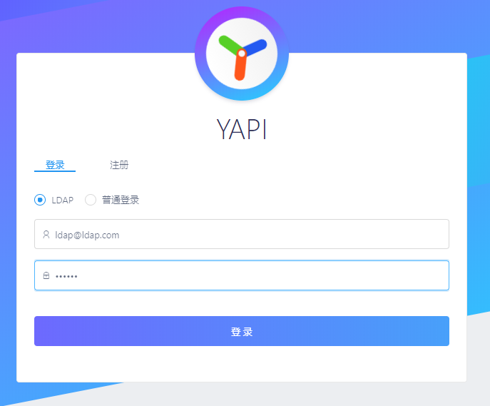
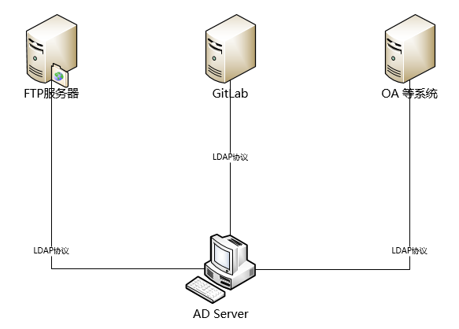

# 第 9 讲 Linux 网络认证

本讲主要介绍以下内容：
- LDAP 统一认证
- SAMBA 与 LDAP 结合性统一认证
- kerberos 统一认证


## kerberos 统一认证


Kerberos是一种在不可信网络环境中使用的安全认证协议，它使用安全密钥实现加密认证和建立与第三方的信任关系。它基于对称密钥和可信的第三方实现安全认证。

### 基本原理

客户端向服务器（AS）进行身份验证，该服务器将用户名转发到密钥分发中心 （KDC）。KDC发行带有时间戳的票证授予票证（TGT），并使用票证授予服务（TGS）的密钥对其加密，然后将加密结果返回给用户的工作站。


下面详细描述该协议：

一.用过登录（User Client-based Login）
- 1.用户在客户端计算机上输入用户名和密码。
- 2.客户端将密码转换为对称密码的密钥。根据使用的密码软件，它要么使用内置的密钥调度，要么使用单向哈希。

二.客户端认证（Client Authentication）
- 1.客户端向认证服务器AS发送的**用户ID（client ID）明文**，表达自己请求认证服务。（注意：密钥和密码均不会发送到 AS。）
- 2.认证服务器AS检查用户是否在其数据库中（例如：Windows Server中的Active Directory）。如果在，则AS将对数据库留存的用户密码进行哈希，并由此生成密钥。同时，将以下两条消息发送回客户端：
	- 消息A：使用用户密钥加密的**Client/TGS Session Key**。
	- 消息B：使用TGS的密钥加密的 **Ticket-Granting-Ticket(即TGT)**。TGT中包含了用户ID（client ID），客户端网络地址，票据有效期和 Client/TGS Session Key。
- 3.一旦客户端收到消息A和B，它将使用用户键入密码生成的密钥来解密消息A。如果用户输入的密码与AS数据库中记录的用户密码不匹配，则客户端生成的密钥也将与AS生成的不同，因此无法解密消息A。反之，有效的用户密码及其生成的密钥，可以解密消息A，获得**Client/TGS Session Key**（客户端/ TGS会话密钥）。该会话密钥之后会用于与TGS的进一步通信。（注意：客户端无法解密消息B，因为它是使用TGS的密钥加密的。）此时，客户端具有足够的信息可以向TGS认证自身。

三.客户端服务授权（Client Service Authorization）
- 1.在请求服务时，客户端将以下消息发送到 TGS：
  - 消息C：**由消息B的TGT和所请求服务的ID组成**。
  - 消息D：使用Client/TGS Session Key加密的**身份验证凭证**（即Authenticator ，由客户端ID和时间戳组成）。
- 2.一旦收到消息C和D，TGS就会从消息C中检索消息B，并使用TGS密钥解密消息B。消息B提供了Client/TGS Session Key。TGS使用此密钥解密消息D（身份验证凭证），并比较消息C和D中的客户端ID（如果它们匹配），服务器将以下两个消息发送给客户端：
  - 消息E：使用服务的密钥加密的**Client-to-server ticket**（客户端-服务器票据），票据中包括客户端ID，客户端网络地址，有效期 和 Client/Server Session Key。
  - 消息F：使用 Client/Server Session Key 加密的**Client/Server Session Key**（客户端/服务器会话密钥）。

四.客户服务请求
- 1.从TGS收到消息E和F后，客户端将具有足够的信息向服务服务器（Service Server，SS）进行身份验证。客户端连接到SS，并发送以下两条消息：
  - 消息E：即上一步的E（使用 client-to-server ticket 加密）。
  - 消息G：一个使用Client/Server Session Key加密的**新身份验证凭证**（Authenticator ），其中包括客户端ID，时间戳。
- 2.服务服务器（SS）使用自己的密钥来解密票据（即消息E），以获得Client/Server Session Key。使用这个会话密钥，SS解密认证凭证（Authenticator ）并比较消息E和D中的客户ID。如果两ID匹配，服务器会向客户端送出下列消息，以确认它的正确id和向客户端提供服务的意愿：
  - 消息H：使用Client/Server Session Key加密的**时间戳**，这个时间戳是在客户端的身份验证凭证中找到的。（消息H在版本4中加入，但在版本5中不是必需的）。
- 3.客户端使用Client/Server Session Key解密消息H，并检查时间戳是否正确。如果正确，则客户端可以信任服务器并可以开始向服务器发出服务请求。
- 4.服务器将请求的服务提供给客户端。


### 缺点和局限性
- 单点故障：它要求中央服务器具有连续可用性。当Kerberos服务器关闭时，新用户无法登录。这可以通过使用多个Kerberos服务器和后备身份验证机制来缓解。
- Kerberos具有严格的时间要求，这意味着所涉及主机的时钟必须在配置的限制内同步。票证具有时间可用性期限，并且如果主机时钟未与Kerberos服务器时钟同步，则身份验证将失败。MIT的默认配置要求时钟时间间隔不得超过五分钟。在实践中网络时间协议守护程序通常用于保持主机时钟同步.
- 管理协议未标准化，并且在服务器实现之间有所不同。密码更改在RFC 3244中描述。
- 在采用对称加密的情况下（Kerberos可以使用对称或非对称（公钥）加密工作），由于所有身份验证均由集中式密钥分发中心（KDC）控制，因此这种身份验证基础结构的破坏将使攻击者可以假冒任何用户。
- 每个需要不同主机名的网络服务都将需要其自己的Kerberos密钥集。这使虚拟主机和群集变得复杂。
- Kerberos要求用户帐户，用户客户端和服务器上的服务都必须与Kerberos令牌服务器具有可信关系（所有必须位于同一Kerberos域中或彼此之间具有信任关系的域中）。Kerberos无法用于用户想要从未知/不受信任的客户端连接到服务的场景，如典型的Internet或云计算机场景，其中身份验证提供程序通常不了解用户客户端系统。
- 所需的客户端信任使创建分阶段环境（例如，用于测试环境，预生产环境和生产环境的单独域）变得困难：需要创建防止严格隔离环境域的域信任关系，或者需要其他用户客户端。为每个环境提供。

### 在ubuntu上建立Kerberos 服务器

为了演示Kerberos的安装和运行，我们需要3个Ubuntu Linux。它们之间要能相互通信，并且要有精确的系统时钟。这3个Linux系统的主机名（hostname）分别命名为（主机名的修改可以通过编辑/etc/hostname文件实现）：
- Kerberos服务器：mykerberos.com
- SSH服务器：sshserver.com
- 客户端：sshclient.com

具体操作过程参考实验手册。

## LDAP 统一认证

### 什么是LDAP ?
LDAP（Light Directory Access Portocol），它是基于X.500标准的轻量级目录访问协议。

目录是一个为查询、浏览和搜索而优化的数据库，它成树状结构组织数据，类似文件目录一样。

目录数据库和关系数据库不同，它有优异的读性能，但写性能差，并且没有事务处理、回滚等复杂功能，不适于存储修改频繁的数据。所以目录天生是用来查询的，就好象它的名字一样。

LDAP目录服务是由目录数据库和一套访问协议组成的系统。

### 为什么要使用LDAP ?

- LDAP是开放的Internet标准，支持跨平台的Internet协议，在业界中得到广泛认可的。
- 通过LDAP做简单的配置就可以与服务器做认证交互。
- 可以大大降低重复开发和对接的成本。

下面的例子是开源系统（YAPI）只需做一下简单的几步配置就可以基于LDAP实现单点登录认证。
```
{
"ldapLogin": {
    	"enable": true,
      	"server": "ldap://l-ldapt1.ops.dev.cn0.qunar.com",
      	"baseDn": "CN=Admin,CN=Users,DC=test,DC=com",
      	"bindPassword": "password123",
      	"searchDn": "OU=UserContainer,DC=test,DC=com",
      	"searchStandard": "mail"
   }
}
```


### LDAP 常见产品

|厂商|产品|介绍|
|-|-|-|
|SUN|SUNONE Directory Server|基于文本数据库的存储，速度快 。|
|IBM|IBM Directory Server|基于DB2 的的数据库，速度一般。|
|Novell|Novell Directory Server|基于文本数据库的存储，速度快,不常用到。|
|Microsoft |Microsoft Active Directory|基于WINDOWS系统用户，对大数据量处理速度一般，但维护容易，生态圈大，管理相对简单。|
|Opensource|Opensource|OpenLDAP 开源的项目，速度很快，但是非主 流应用。|

### LDAP的基本模型

每一个系统、协议都会有属于自己的模型，LDAP也不例外，在了解LDAP的基本模型之前我们需要先了解几个LDAP的目录树概念：

#### 目录树概念

- 目录树：在一个目录服务系统中，整个目录信息集可以表示为一个目录信息树，树中的每个节点是一个条目。

- 条目：每个条目就是一条记录，每个条目有自己的唯一可区别的名称（DN）。

- 对象类：与某个实体类型对应的一组属性，对象类是可以继承的，这样父类的必须属性也会被继承下来。

- 属性：描述条目的某个方面的信息，一个属性由一个属性类型和一个或多个属性值组成，属性有必须属性和非必须属性。

|关键字|英文全称|含义|
|-|-|-|
|dc|Domain Component|域名部分，其格式是将完整的域名分成几部分，如域名为example.com变成dc=example,dc=com（一条记录的所属位置）|
|uid|User Id|用户ID songtao.xu（一条记录的ID）|
|ou|Organization Unit|组织单位，组织单位可以包含其他各种对象（包括其他组织单元），如“oa组”（一条记录的所属组织）|
|cn|Common Name|公共名称，如“Thomas Johansson”（一条记录的名称）|
|sn|Surname|姓，如“许”|
|dn|Distinguished Name|“uid=songtao.xu,ou=oa组,dc=example,dc=com”，一条记录的位置（唯一）|
|rdn|Relative dn|相对辨别名，类似于文件系统中的相对路径，它是与目录树结构无关的部分，如“uid=tom”或“cn= Thomas Johansson”|


下面的例子，显示了一个由11个属性组成的条目（entry）：
```
dn: cn=John Doe,dc=example,dc=com
cn: John Doe
givenName: John
sn: Doe
telephoneNumber: +1 888 555 6789
telephoneNumber: +1 888 555 1232
mail: john@example.com
manager: cn=Larry Smith,dc=example,dc=com
objectClass: inetOrgPerson
objectClass: organizationalPerson
objectClass: person
objectClass: top
```
#### LDAP的使用

如何访问LDAP的数据库服务器? 又如何使用LDAP实现认证呢?

统一身份认证主要是改变原有的认证策略，使需要认证的软件都通过LDAP进行认证，在统一身份认证之后，用户的所有信息都存储在AD Server中。终端用户在需要使用公司内部服务的时候，都需要通过AD服务器的认证。



那么程序中是如何访问的呢？ 一般经过下列步骤：
- 1.Connect：连接到LDAP服务器
- 2.Bind：绑定到LDAP服务器
- 3.Execute：执行某项操作
- 4.Close：关闭与LDAP的连接

#### LDAP在ubuntu linux中的认证应用


## SAMBA + LDAP 统一认证