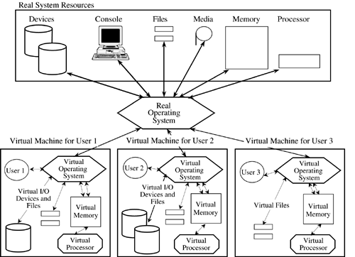
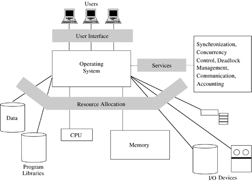

# 第1讲 操作系统安全概述

主要内容：

- 操作系统（OS）知识回顾
- OS的安全问题
- OS的安全机制

---

## 操作系统知识回顾

### 什么是操作系统？

操作系统是一种软件，管理着计算机硬件和软件资源，为计算机程序提供基础、通用的服务。

---

### 操作系统的分类

OS类型多，通常我们从以下方面对其进行分类：
- 单、多任务
- 单、多用户
- 分布式
- 模板式（例如虚拟化的）
- 嵌入式
- 实时型

---

具体地，常见OS有：

- Unix 或类Unix系统
- BSD 及其后代
- MacOS
- Linux
- Microsoft Windows
- Other

---

下图显示了目前云计算常见的操作系统架构：

---

### 操作系统的组成

通常可以分为以下部分：

- 内核
- 用户接口

---

#### 内核（kernel）

操作系统中最基本的组件，负责管理内存、访问硬件资源、设置计算机系统状态、组织数据输入输出。

内核程序位于特权模式下，可以执行任何资源的访问与控制，内核必须受到严格的保护。

##### 进程管理

应用程序以进程方式（被操作系统管理）使用内存、访问硬件资源、完成计算。

进程的管理只能由内核程序负责，应用程序不应越权。

##### 中断管理

中断是操作系统进行调度的主要机制，它是实现OS与环境（用户、程序、硬件）交互和反馈的便捷方式。

中断的优先级、中断的调用方式必须受到保护，不能被恶意程序肆意修改。

##### 管理模型

现代微处理器支持多种操作模型，至少也支持两种模型：
- 用户模型
- 特权模型（内核模型）

更多的模型设置是为了以“知其所需、最小特权”为原则，来区分不同角色的特权。

##### 内存管理

内存管理不仅影响着OS性能，也与OS安全息息相关。

某个应用程序越权访问其它应用程序所用内存、或非法访问OS内核内存都是要被严格禁止的。

下图显示了操作系统管理虚拟内存的模型：

##### 磁盘访问和文件系统

OS负责IO数据设备的访问，管理文件格式（内容的存储形式）。

磁盘与文件系统的访问，必须建立在一致、严格的访问控制策略之下。

##### 设备驱动

不同的IO设备需要不同的驱动程序，这些程序应视为内核的一部分受到保护。

##### 网络

基础网络服务程序也是内核的一部分。

---

#### 用户接口

- 应用程序
- 安全工具
- 用户界面

##### 应用程序

- 访问型工具
- 图形化工具
- 文本类工具
- 设置类工具
- 安全类工具
- 网络类工具

##### 安全工具

用于支持OS实现访问控制、加密、网络入侵防护、日志、审计等功能。

##### 用户界面

- 命令行
- 图形化

---

## OS的安全问题

由于操作系统的差异性，不同操作系统的脆弱性偏重点是不同的。共同的脆弱性主要表现在以下几个方面：

- 自身技术缺陷脆弱性
- 用户设置引起的脆弱性
- 环境或硬件引发的脆弱性
- 网络引发的脆弱性
- 应用程序引发的脆弱性
- 管理引发的脆弱性

---

## 操作系统的安全机制

无论何种主流OS，均采用了下面这些安全机制和技术：
- 硬件安全机制
- 标识、鉴别等身份管理（区分用户角色）
- 访问权限管理（实现零信任管理）、最小特权管理
- 威胁防护（防止破坏性攻击）
- 信息保护（对信息进行定位、分类、加密、签名、验证）
- 安全管理（优化安全管理方法）

### 硬件安全机制

计算机硬件安全的目标是保证其自身的可靠性和为系统提供基本安全机制。其中，基本安全机制包括：

- 存储保护，保护用户在存储器中的数据，并保证系统各任务之间互不干扰。
- 运行保护，隔离操作系统程序与用户程序，保证进程在运行时免受同等级运行域内其他进程的破坏。
- I/O保护，I/O是仅由操作系统完成的一个特权操作，用户不需要控制I/O操作的细节。

---

### 标识与鉴别技术

标识与鉴别是涉及系统和用户的一个过程。

标识是系统标志用户的身份，并为每个用户取一个系统可以识别、唯一且无法伪造的内部名称——用户标识符。

将用户标识符与用户联系的过程称为鉴别，鉴别过程主要用于识别用户的真实身份，鉴别操作要求用户具备证明其身份的特殊信息，并且这个信息是秘密的，其他用户无法获得。

较安全操作系统应采用强化管理的口令鉴别、基于令牌的动态口令鉴别、生物特征鉴别、数字证书鉴别等机制进行身份鉴别，在每次用户登录系统时进行鉴别，并以一定的时间间隔进行改变。

---

### 访问控制技术

访问控制为操作系统内的常用防护技术，常见的有两类：
- 自主访问控制
- 强制访问控制

#### 自主访问控制（DAC, Discretionary Access Control）

在该机制下，客体（例如：某个文件）的拥有者可以按照自己的意愿精确指定系统中的其他用户对其文件的访问权。

自主访问控制是基于用户的，具有很高的灵活性，这使这种策略适合于各类操作系统和应用程序，特别是在商业和工业领域。

---

### 强制访问控制（MAC, Mandatory Access Control）

在此机制下，系统中的每个进程、文件、IPC客体（消息队列、信号量集合和共享存储区）都被赋予了相应的安全属性，它由管理部门（如安全管理员）或由操作系统自动地按照严格的规定来设置，不能直接或间接地修改。

它是基于安全标识和信息分级等信息敏感性的访问控制，通过比较资源的敏感性与主体的级别来确定是否允许访问。

系统将所有主体和客体分成不同的安全等级，给予客体的安全等级能反映出客体本身的敏感程度；主体的安全等级标志着用户不会将信息透露给未经授权的用户。通常安全等级可分为4个级别：最高秘密级、秘密级、机密级和无级别级。这些安全级别可以支配同一级别或低一级别的对象。

--- 

一般强制访问控制采用以下几种方法:

- 过程控制

在通常的计算机系统中，只要系统允许用户自己编程，一般就很难杜绝木马。但可以对其过程采取某些措施，这种方法称为过程控制。

- 限制访问控制
  
由于自主控制方式允许用户程序来修改其文件的访问控制表，因此，给非法者带来可乘之机。系统可以不提供这一方便，在这类系统中，用户要修改访问控制表的唯一途径是请求一个特权系统调用。

- 系统限制
  
最好实施的限制是由系统自动完成。要对系统的功能实施一些限制，比如限制共享文件，但共享文件是计算机系统的优点，是不可能加以完全限制的。再者，就是限制用户编程。

---

强制访问控制的安全性比自主访问控制的安全性有所提高，但灵活性要差一些。

强制访问控制包括:
- 规则型（Rule-based）访问控制
- 管理指定型（Administratively-based）访问控制。
 
MAC模型中比较主要的几个模型：
- Lattice模型
- Bell-LaPadula模型（BLP model）
- Biba模型（Biba model）。

---

### 最小特权管理

最小特权的管理思想是系统不应给用户（含管理员）超过执行任务所需特权以外的特权。

为了保障系统的安全性，可以设置如下管理员，并赋予相应职责。如果有需要，可以进行改变和增加，但必须考虑改变带来的安全性变动。

- 系统安全管理员：对用户、系统资源和应用等定义或赋予安全级。
- 审计员：设置审计参数并修改、控制审计内容和参数。
- 操作员：对系统进行操作，并设置终端参数、改变口令、用户安全级等。
- 安全操作员：完成操作员的职责，例行备份和恢复，安装和拆卸可安装介质。
- 网络管理员：负责所有网络通信的管理。

---

### 文件系统加密技术

为了防止因信息载体落入他人手中而导致的信息泄露问题，可以采取对信息进行加密的措施。在操作系统中实现信息加密的方法很多，可以对单个文件进行加密，也可以对整个磁盘进行加密。

---

### 安全审计

一个系统的安全审计就是对系统中有关安全的活动进行记录、检查及审核。

它的主要目的就是检测和阻止非法用户对计算机系统的入侵，并显示合法用户的误操作。

审计作为一种追查手段来保证系统安全，将涉及系统安全的操作做一个完整的记录。审计为系统进行事故原因的查询、定位，事故发生前的预测、报警以及事故发生后的实时处理提供详细、可靠的依据和支持，以备有违反系统安全规则的事件发生时能够有效地追查事件发生的地点、过程以及责任人。

要将审计和报警功能结合起来，审计过程一般是一个独立的过程，应与系统其他功能相隔离。同时要求操作系统能够生成、维护及保护审计过程，使其免遭修改、非法访问及毁坏，特别要保护审计数据，要严格限制未经授权用户的访问。

---

### 系统可信检查机制

可信计算基（Trusted computing base, TCB）：为实现计算机系统安全保护的所有安全保护机制的集合。

通过建立安全操作系统构建可信计算基（TCB），建立动态、完整的安全体系，实现系统的完整性保护，能够很大程度上提升系统的安全性。

---

