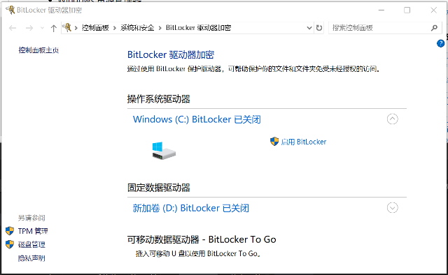
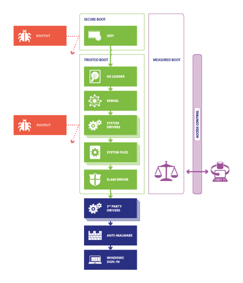

# 第3讲 Windows中的信息保护

本讲主要介绍Windows如何保护文档和其他数据。

主要内容有：
- BitLocker，是一个Windows内置的加密工具，防止数据被泄露。
- 加密硬盘
- 为Thunderbolt™ 3提供的核心DMA保护
- 使用WIP（Windows Information Protection）保护企业数据
- Windows 10 启动过程安全加固
- 可信的平台模块

## BitLocker

BitLocker 是Windows提供的一种数据保护程序，可以保证数据的机密性。

BitLocker 可以单独使用，也可与可信平台模块（TPM)v1.2或更高版本一起使用时，安全性更高。

### 使用 BitLocker 加密卷

> 卷是系统管理存储磁盘的一种方式，一个硬盘包括好多卷，一卷也可以跨越许多磁盘 。

可以使用以下方法执行 BitLocker 加密：

- BitLocker 控制面板
- Windows 资源管理器
- manage-bde 命令行界面
- BitLocker Windows PowerShell cmdlet

#### 使用 BitLocker 控制面板加密卷

1.打开windows系统的"开始"，键入 " BitLocker"，单击 "管理 bitlocker"。

支持加密:
- 操作系统卷
- 固定数据卷
- 可移动数据卷

注意：
- 只有已分配驱动器号的已格式化卷才会正确显示在 BitLocker 控制面板小程序中。

2.若要开始对卷进行加密，请选择 "为相应驱动器启用 bitlocker " 以初始化 Bitlocker 驱动器加密向导。 

3.根据卷类型（操作系统卷或数据量），BitLocker 驱动器加密向导选项有所不同。

## NTFS 文件系统与安全

文件系统是OS用于明确磁盘或分区上的文件的方法和数据结构，即在磁盘上组织文件的方法。

文件系统由三部分组成：
- 相关管理软件
- 被管理的文件
- 管理文件所需的数据结构

文件系统是对文件存储器空间进行组织和分配，负责文件存储并对存入的文件进行保护和检索的系统。它负责为用户：
- 建立文件
- 写入文件
- 读取文件
- 修改文件
- 转储文件
- 控制文件访问

在Windows的文件系统中，NTFS磁盘提供了相当多的安全功能。

### NTFS文件安全

在NTFS中，每个文件或文件夹具有一个安全描述符，用于说明其所有者，并包含两个安全控制列表（ACL）。

第一个列表被称为自主访问控制列表（DACL），用于描述是否允许或禁止特定的用户或用户组进行特定的操作（如读取、写入、执行或删除）。例如，“C:\Program Files”文件夹可能被设定为允许所有用户读取并执行，但只有具有管理员权限的用户才能修改其内容。Windows Vista为DACL增加了强制访问控制功能。DACL是Windows Vista及后续操作系统的用户账户控制功能的主要检查点。

第二个列表被称为系统访问控制列表（SACL），用于描述对文件或文件夹的特定行为是否应当被审核，以及在操作成功后是否应当记录操作。例如，企业可能会对高度敏感的文件开启审核功能，这样管理员就可以了解到是否有人尝试删除或复制这些文件，以及他们的操作是否成功完成。

## Windows启动过程保护

### 威胁：Rootkit

Rootkit 是一种复杂且危险的恶意软件，它们以内核模式运行，并且与操作系统使用相同的权限。 因为 rootkit 与操作系统具有相同的权限并且在操作系统之前启动，所以它们可以完全隐藏自己和其他应用程序。 通常，rootkit 是整套恶意软件的一部分，可以绕过本地登录、记录密码和按键、传输私有文件以及捕获加密数据。

不同类型的 rootkit 在启动过程的不同阶段中进行加载：

- 固件 rootkit。 这些套件会覆盖电脑的基本输入/输出系统或其他硬件的固件，以便 rootkit 可以在 Windows 之前启动。
- Bootkit。 这些套件将替换操作系统的启动加载程序（启动操作系统的软件的一小部分），以便电脑在加载操作系统之前加载 bootkit。
- 内核 rootkit。 这些套件将替换一部分操作系统内核，以便在加载操作系统时，rootkit 可以自动启动。
- 驱动程序 rootkit。 这些套件假装成 Windows 与电脑硬件进行通信所使用的其中一款受信任的驱动程序。

### 基本对策

Windows10 支持四种功能来帮助防止在启动过程中发生 rootkit 和 bootkits 加载：

- 安全启动。 具有 UEFI （统一可扩展固件接口）固件和受信任的平台模块 (TPM) 的电脑可以配置为仅加载受信任的操作系统启动加载程序。
- 受信任启动。 Windows 先检查启动过程的每个组件的完整性，然后再加载组件。
- 开机初期启动的反恶意软件 (ELAM)。 ELAM 先测试所有驱动程序然后再进行加载，并且会阻止加载未经批准的驱动程序。
- 测量的启动。 电脑的固件记录启动过程，Windows 可以将记录发送到受信任的服务器，此服务器能够客观地评估电脑的运行状况。

下图显示了Windows10 的启动过程。安全启动、受信任启动和测量的启动功能可在每个阶段阻止恶意软件

只有在使用 UEFI 2.3.1 和 TPM 芯片的电脑上，才可以安全启动和测量启动。满足 Windows 硬件兼容性计划要求的所有 Windows 10 电脑都具有这些组件，并且许多为早期版本的 Windows 设计的电脑也具有这些组件。

