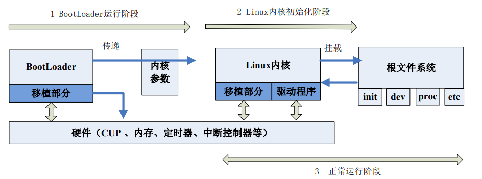
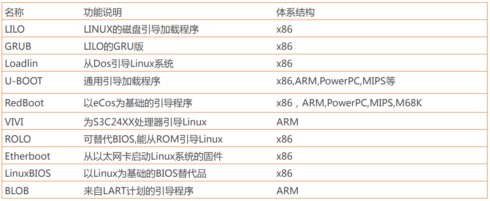

# 第 5 讲 Linux 安全概述

## 威胁分析

为了清晰的分析系统面对的威胁，人们建立了很多分析模型，微软的STRIDE威胁分析模型就是其中之一。

STRIDE分别代表：
- 身份欺骗（Spoofing identity）
- 篡改数据（Tampering with data）
- 否认性（Repudiation）
- 信息泄露（Information disclosure）
- 拒绝服务（Denial of service）
- 提权（Elevation of privilege）

信息安全原则与对应的安全威胁

|安全原则|威胁|定义|例子|
|-|-|-|-|
|认证|身份欺骗|冒充他人或者他物|A 用户使用 B 用户的账号和密码登录使用系统|
|完整性|篡改数据|修改数据或者代码|未授权的情况下，恶意修改了数据库中的字段数值|
|不可否认性|否认性|抵赖，声称没有做|我没有发送那封邮件|
|机密性|信息泄露|把信息展示给未授权去看的人|航空旅客的身份信息被传播在互联网上|
|可用性|拒绝服务|使服务对已授权的用户不可用|使网站瘫痪，让已授权用户无法进行线上交易|
|授权|提权|在未授权的情况下，把自己的权限提升到更高的水平|Linux 普通用户利用系统漏洞变成了 root 用户|

## Linux/win 系统安全的10项原则

### 纵深防御体系

任何单一的安全措施都是可以绕过的。

### PDCA 模型

PDCA，指Plan–Do–Check–Act，计划—执行—检查—改进。

需要不断的检查策略的有效性，细致分析其中潜在的问题，调查研究新的威胁，从而不断的改进和完善。

### 最小权限法则

最小权限法则（Principle of Least Privilege，PoLP）是指仅仅给予人员、程序、系统最小化的、恰恰能完成其功能的权限。

### 白名单机制

白名单机制（Whitelisting）明确定义什么是被允许的，而拒绝所有其他情况。

黑名单机制（Blacklisting）明确定义了什么是不被允许的，而允许所有其他情况。但这种方法难以穷举所有威胁。

### 安全失效处理

安全的失效（Fail Safely）是指安全的处理错误。安全的处理错误是安全编程的一个重要方面。

### 避免通过隐藏来实现安全

在信息安全领域，通过隐藏来实现安全也是不可取的。

### 入侵检测

为网络入侵和主机入侵进行检测。

### 不要信任基础设施

完全依赖这些基础设施提供的安全措施是不可取的。

### 不要信任服务

服务是指任何外部或者内部提供的系统、平台、接口、功能，也包括自研客户端和作为客户端功能的软件，例如浏览器、FTP 上传下载工具等。

外部第三方提供的服务不可全信。

### 默认配置应为安全的配置

要保证默认情况下的设置是安全的。


## Linux 安全策略

安全策略是保证安全的规则和实际措施。主要包括以下内容：

- 系统用户和密码管理
- Linux网络安全
- 文件系统的安全
- 系统日志的保存
- 内核更新及安全补丁安装

## 用户管理与安全防护

主要包括两大部分：
- 账户管理基础
- 账户和登录安全运维

### 账户管理基础

这部分主要内容有：
- 添加新的用户账号
- 删除帐号
- 修改帐号
- 用户口令的管理
- 
####  添加新的用户账号

增加用户账号就是在/etc/passwd文件中为新用户增加一条记录，同时更新其他系统文件如/etc/shadow, /etc/group等。

命令格式：
```
useradd 选项 用户名
```

选项:
- -c comment 指定一段注释性描述。
- -d 目录 指定用户主目录，如果此目录不存在，则同时使用-m选项，可以创建主目录。
- -g 用户组 指定用户所属的用户组。
- -G 用户组，用户组 指定用户所属的附加组。
- -s Shell文件 指定用户的登录Shell。
- -u 用户号 指定用户的用户号，如果同时有-o选项，则可以重复使用其他用户的标识号。

Linux提供了集成的系统管理工具userconf，它可以用来对用户账号进行统一管理。

#### 删除帐号

删除用户账号就是要将/etc/passwd等系统文件中的该用户记录删除，必要时还删除用户的主目录。

删除一个已有的用户账号使用userdel命令，其格式如下：
```
userdel 选项 用户名
```

常用的选项是 -r，它的作用是把用户的主目录一起删除。

#### 修改帐号

修改用户账号就是根据实际情况更改用户的有关属性，如用户号、主目录、用户组、登录Shell等。

修改已有用户的信息使用usermod命令，其格式如下：
```usermod 选项 用户名```

常用的选项包括-c, -d, -m, -g, -G, -s, -u以及-o等，这些选项的意义与useradd命令中的选项一样，可以为用户指定新的资源值。

另外，有些系统可以使用选项：```-l 新用户名```, 这个选项指定一个新的账号，即将原来的用户名改为新的用户名。

#### 用户口令的管理

用户管理的一项重要内容是用户口令的管理。用户账号刚创建时没有口令，但是被系统锁定，无法使用，必须为其指定口令后才可以使用，即使是指定空口令。

指定和修改用户口令的Shell命令是passwd。超级用户可以为自己和其他用户指定口令，普通用户只能用它修改自己的口令。命令的格式为：
```
passwd 选项 用户名
```

可使用的选项：

- -l 锁定口令，即禁用账号。
- -u 口令解锁。
- -d 使账号无口令。
- -f 强迫用户下次登录时修改口令。
- 
如果默认用户名，则修改当前用户的口令。

如果是超级用户，可以用下列形式指定任何用户的口令：

```
passwd sam 
New password:******* 
Re-enter new password:*******
```

普通用户修改自己的口令时，passwd命令会先询问原口令，验证后再要求用户输入两遍新口令，如果两次输入的口令一致，则将这个口令指定给用户；而超级用户为用户指定口令时，就不需要知道原口令。

为了系统安全起见，用户应该选择比较复杂的口令，例如最好使用8位长的口令，口令中包含有大写、小写字母和数字，并且应该与姓名、生日等不相同。


### Linux系统用户组的管理

每个用户都有一个用户组，系统可以对一个用户组中的所有用户进行集中管理。不同Linux 系统对用户组的规定有所不同，如Linux下的用户属于与它同名的用户组，这个用户组在创建用户时同时创建。

用户组的管理涉及用户组的添加、删除和修改。组的增加、删除和修改实际上就是对/etc/group文件的更新。

#### 增加一个新的用户组

使用groupadd命令。其格式如下：```groupadd 选项 用户组```。

可以使用的选项有：
- -g GID 指定新用户组的组标识号（GID）。
- -o 一般与-g选项同时使用，表示新用户组的GID可以与系统已有用户组的GID相同。

#### 删除一个已有的用户组

使用groupdel命令，其格式如下：```groupdel 用户组```


#### 修改用户组的属性

使用groupmod命令。其语法如下：```groupmod 选项 用户组```

常用的选项有：
- -g GID 为用户组指定新的组标识号。
- -o 与-g选项同时使用，用户组的新GID可以与系统已有用户组的GID相同。
- -n新用户组 将用户组的名字改为新名字


#### 用户在用户组之间切换

如果一个用户同时属于多个用户组，那么可以执行用户组切换。

用户可以在登录后，使用命令```newgrp```切换到其他用户组，这个命令的参数就是目的用户组。


### 与用户账号有关的系统文件

完成用户管理的工作有许多种方法，但是每一种方法实际上都是对有关的系统文件进行修改。

与用户和用户组相关的信息都存放在一些系统文件中，这些文件包括: /etc/passwd, /etc/shadow, /etc/group等。

#### /etc/passwd 文件

/etc/passwd文件是用户管理工作涉及的最重要的一个文件。Linux系统中的每个用户都在/etc/passwd文件中有一个对应的记录行，它记录了这个用户的一些基本属性。


这个文件对所有用户都是可读的。/etc/passwd中一行记录对应着一个用户，每行记录又被冒号(:)分隔为7个字段，其格式和具体含义如下：

```用户名:口令:用户标识号:组标识号:注释性描述:主目录:登录Shell```

说明：
- "用户名"是代表用户账号的字符串。通常长度不超过8个字符，并且由大小写字母和/或数字组成。
- “口令”在一些系统中，存放着加密后的用户口令字。只是用户口令的加密串，不是明文。
- “用户标识号”是一个整数，系统内部用它来标识用户。通常用户标识号的取值范围是0～65 535。0是超级用户root的标识号，1～99由系统保留，作为管理账号，普通用户的标识号从100开始。在Linux系统中，这个界限是500。
- “组标识号”字段记录的是用户所属的用户组。它对应着/etc/group文件中的一条记录。
- “注释性描述”字段记录着用户的一些个人情况。可用做finger命令的输出。
- “主目录”，也就是用户的起始工作目录。
- 用户登录后，要启动一个进程，负责将用户的操作传给内核，这个进程是用户登录到系统后运行的命令解释器或某个特定的程序，即Shell。常用的有sh(Bourne Shell), csh(C Shell), ksh(Korn Shell), tcsh(TENEX/TOPS-20 type C Shell), bash(Bourne Again Shell)等。利用这一特点，我们可以限制用户只能运行指定的应用程序，在该应用程序运行结束后，用户就自动退出了系统。
- 系统中有一类用户称为伪用户（pseudo users），这些用户在/etc/passwd文件中也占有一条记录，但是不能登录，因为它们的登录Shell为空。它们的存在主要是方便系统管理，满足相应的系统进程对文件属主的要求。
  
#### /etc/shadow 文件

由于/etc/passwd文件是所有用户都可读的，如果用户的密码太简单或规律比较明显的话，一台普通的计算机就能够很容易地将它破解，因此对安全性要求较高的Linux系统都把加密后的口令字分离出来，单独存放在一个文件中，这个文件是/etc/shadow文件。 有超级用户才拥有该文件读权限，这就保证了用户密码的安全性。


/etc/shadow中的记录行与/etc/passwd中的一一对应，它由pwconv命令根据/etc/passwd中的数据自动产生。

它的文件格式与/etc/passwd类似，由若干个字段组成，字段之间用":"隔开。这些字段是：

```登录名:加密口令:最后一次修改时间:最小时间间隔:最大时间间隔:警告时间:不活动时间:失效时间:标志```

说明：
- "登录名"是与/etc/passwd文件中的登录名相一致的用户账号
- "口令"字段存放的是加密后的用户口令字，长度为13个字符。如果为空，则对应用户没有口令，登录时不需要口令；如果含有不属于集合 { ./0-9A-Za-z }中的字符，则对应的用户不能登录。
- "最后一次修改时间"表示的是从某个时刻起，到用户最后一次修改口令时的天数。时间起点对不同的系统可能不一样。例如在SCO Linux 中，这个时间起点是1970年1月1日。
- "最小时间间隔"指的是两次修改口令之间所需的最小天数。
- "最大时间间隔"指的是口令保持有效的最大天数。
- "警告时间"字段表示的是从系统开始警告用户到用户密码正式失效之间的天数。
- "不活动时间"表示的是用户没有登录活动但账号仍能保持有效的最大天数。
- "失效时间"字段给出的是一个绝对的天数，如果使用了这个字段，那么就给出相应账号的生存期。期满后，该账号就不再是一个合法的账号，也就不能再用来登录了。

#### /etc/group文件

用户组的所有信息都存放在/etc/group文件中.

每个用户都属于某个用户组；一个组中可以有多个用户，一个用户也可以属于不同的组。

当一个用户同时是多个组中的成员时，在/etc/passwd文件中记录的是用户所属的主组，也就是登录时所属的默认组，而其他组称为附加组。

用户要访问属于附加组的文件时，必须首先使用newgrp命令使自己成为所要访问的组中的成员。

用户组的所有信息都存放在/etc/group文件中。此文件的格式也类似于/etc/passwd文件，由冒号(:)隔开若干个字段，这些字段有：

```组名:口令:组标识号:组内用户列表```

- "组名"是用户组的名称，由字母或数字构成。与/etc/passwd中的登录名一样，组名不应重复。
- "口令"字段存放的是用户组加密后的口令字。一般Linux 系统的用户组都没有口令，即这个字段一般为空，或者是*。
- "组标识号"与用户标识号类似，也是一个整数，被系统内部用来标识组。
- "组内用户列表"是属于这个组的所有用户的列表/b]，不同用户之间用逗号(,)分隔。这个用户组可能是用户的主组，也可能是附加组。


#### 添加批量用户

比较棘手的是如果要添加几十个、上百个甚至上千个用户时，我们不太可能还使用useradd一个一个地添加，必然要找一种简便的创建大量用户的方法。

1.先编辑一个文本用户文件。每一列按照/etc/passwd密码文件的格式书写，要注意每个用户的用户名、UID、宿主目录都不可以相同，其中密码栏可以留做空白或输入x号。


2.以root身份执行命令 /usr/sbin/newusers，从刚创建的用户文件user.txt中导入数据，创建用户：
```newusers < user.txt```

3.执行命令/usr/sbin/pwunconv。
将 /etc/shadow 产生的 shadow 密码解码，然后回写到 /etc/passwd 中，并将/etc/shadow的shadow密码栏删掉。这是为了方便下一步的密码转换工作，即先取消 shadow password 功能。
```pwunconv```

4.编辑每个用户的密码对照文件。


5.以root身份执行命令/usr/sbin/chpasswd
创建用户密码，chpasswd 会将经过 /usr/bin/passwd 命令编码过的密码写入 /etc/passwd 的密码栏。

```chpasswd < passwd.txt```

6.确定密码经编码写入/etc/passwd的密码栏后。
执行命令 /usr/sbin/pwconv 将密码编码为 shadow password，并将结果写入 /etc/shadow。

```pwconv```

这样就完成了大量用户的创建了，之后您可以到/home下检查这些用户宿主目录的权限设置是否都正确，并登录验证用户密码是否正确。

#### 本节实验

参考：实验7 Linux中的用户管理


### 账户和登录安全运维

账户安全是系统安全的第一道屏障，也是一项核心安全工作。

下面介绍一些在Linux server上常用到的加强账户安全的做法，主要包括：
- 删除特殊的用户和用户组
- 关闭系统不需要的服务
- 密码安全策略
- 合理使用su，sudo命令
- 删减系统登录欢迎信息
- 禁止 Control-Alt-Delete 键盘关闭命令

#### 删除特殊的用户和用户组

Linux 系统安装完毕后，默认有很多不必要的用户和用户组。

如果不需要某些用户或用户组，应立即删除它们，以免被利用。

Linux系统中可以删除的默认用户和用户组大致如下：

##### 可删除的用户：
- adm
- lp
- sync
- shutdown
- halt
- news
- uucp
- operator
- games
- gopher

删除命令格式：```sudo userdel  <某个用户名>```

##### 可删除的用户组

- adm
- lp
- news
- uucp
- games
- dip
- pppusers
- popusers
- slipusers

删除命令格式：```sudo groupdel <某个用户组名>```

有时，某些用户仅仅作为进程调用或用户组调用，并不需要登录功能，此时可以禁止其登录功能。执行下列命令：

```usermod -s /sbin/nologin <某个用户名（例如nagios）>```

#### 关闭不必要的服务

Linux Server 默认安装后会有一些不必要的服务，这些服务是自启动的。

从安全角度讲，开放的服务越多就越不安全，所以除非必要服务都应将其关闭。

具体关闭哪些服务，这需要考虑服务器的用途。

**下面列出的服务往往是服务器运行所必须的，建议启动他们，保证系统正常运行。**
- acpid
  - 电源管理服务
- apmd
  - 高级电源管理服务，监控电池性能
- kudzu
  - 检查硬件变更服务
- crond
  - linux 进程服务
- atd
  - 类似crond，类似windows计划任务
- keytables
  - 用于装载镜像键盘，视需而定
- iptables
  - 内置防火墙
- xinetd
  - 支持多种网络服务的核心守候进程
- xfs
  - x window桌面系统必要服务
- netword
  - 启动网络服务
- sshd
  - 远程加密访问
- syslog
  - 系统日志服务


**而下面举出一些常见的无用服务，可以考虑关闭。**
- anacron
  - 用来保证在系统关机时错过的定时任务可以在系统开机之后在执行
- auditd
  - 审计工具 ，常用来对文件修改进行监听
- autofs
  - 实现光驱，软盘等的动态自动挂载
- avahi-daemon
  - 运行在客户机上实施查找基于网络的Zeroconf service的服务守护进程。 
  - 该服务可以为Zeroconf网络实现DNS服务发现及DNS组播规范。 
- avahi-dnsconfd
  - 在没有 DNS 服务的局域网里发现基于 zeroconf 协议的设备和服务，与Bonjour类似
- bluetooth
- cpuspeed
- firstboot
  - Fedora系统的特有的调度任务
  - Fedora系统第一次启动时，执行一次特定任务
- gpm
  - 终端鼠标指针支持（无图形界面）
- haldaemon
  - 维护连接到系统的设备的数据库
- hidd
  - 管理所有可见的蓝牙设备
  - 维护键盘/鼠标等蓝牙输入设备
- ip6tables
  - IPv6软件防火墙
- ipsec
  - IPSec虚拟专用网络
- isdn
  - 专用数字线路，一种互联网的接入方式
- lpd
  - 打印机管理程序
- mcstrans
  - SELinux内核安全套件
- messagebus
  - 进程间通讯服务，与 DBUS 交互
- netfs
  - 自动挂载网络中的共享文件空间
- nfs
  - 标准文件共享方式
- nfslock
- nscd
  - 用户/用户组/DNS解析缓存服务
- pcscd portmap
  - 提供智能卡读卡器支持
- readahead_early
  - 预先加载特定的应用到内存中以提供性能
- restorecond
  - 给 SELinux 监测和重新加载正确的文件上下文
- rpcgssd
  - NFS v4
- rpcidmapd
  - NFS v4
- rstatd
  - 系统内核性能统计
- sendmail
  - IMAP/POP3邮件工具
- setroubleshoot
  - 服务器安全审计工具，从CentOS 6.x开始合并入auditd
- yppasswdd ypserv
  - 用于NIS用户修改服务器端的密码

关闭服务的操作命令为：
```chkconfig --level 345 <服务名> off ```

执行完成后重启服务器。

##### chkconfig 命令说明

chkconfig命令检查、设置系统的各种服务。这是Red Hat公司遵循GPL规则所开发的程序，它可查询操作系统在每一个执行等级中会执行哪些系统服务，其中包括各类常驻服务。

注意：chkconfig不是立即自动禁止或激活一个服务，它只是简单的改变了符号连接。

选项：
- --add：增加所指定的系统服务，让chkconfig指令得以管理它，并同时在系统启动的叙述文件内增加相关数据；
- --del：删除所指定的系统服务，不再由chkconfig指令管理，并同时在系统启动的叙述文件内删除相关数据；
- --level<等级代号>：指定读系统服务要在哪一个执行等级中开启或关毕。
  - level选项可以指定要查看的运行级而不一定是当前运行级。对于每个运行级，只能有一个启动脚本或者停止脚本。
  - 当切换运行级时，init不会重新启动已经启动的服务，也不会再次去停止已经停止的服务。

level等级代号列表：
- 等级0表示：表示关机
- 等级1表示：单用户模式
- 等级2表示：无网络连接的多用户命令行模式
- 等级3表示：有网络连接的多用户命令行模式
- 等级4表示：不可用
- 等级5表示：带图形界面的多用户模式
- 等级6表示：重新启动

##### 如何增加一个服务？

- 1.服务脚本必须存放在/etc/ini.d/目录下；
- 2.```chkconfig --add servicename```在chkconfig工具服务列表中增加此服务，此时服务会被在/etc/rc.d/rcN.d中赋予K/S入口了；
- 3.```chkconfig --level 35 mysqld on```修改服务的默认启动等级。


#### Linux 口令保护

在任何系统中，口令对安全性都起着非常重要的作用。不好的口令可能会导致组织的资源受到损害。为此，组织中的每个人，无论是普通用户还是管理员，都应该遵守口令保护策略。

下面给出一些在选择口令或加固口令时必须遵循的规则：


##### 口令的创建策略

应遵循如下规则：
- 一个用户在组织中的所有账号不能使用相同的口令。
- 所有与访问相关的口令都应该互不相同。
- 当同一个用户既有系统级账号又有普通账号时，系统级账号的口令一定与其他账号的口令不同。


##### 口令的保护策略

应遵循如下规则：
- 口令应该被看做敏感的和机密的信息，因此不能与任何人分享。
- 不应该通过任何电子通讯工具，如电子邮件，来共享口令。
- 永远不要在手机上或者调查问卷中透露口令。
- 不要使用能向攻击者提供线索的口令提示。
- 不要与任何人分享公司的口令，包括行政人员、管理者、同事、甚至家庭成员。
- 不要将口令以书面形式存储在办公室的任何地方。如果将口令存储在移动设备上，那么一定要进行加密。
- 不要使用应用程序的记忆口令功能。
- 如果怀疑口令可能被泄露，那么要尽早上报安全事件并更改口令。


#### 口令的更改策略

应遵循以下规则：
- 所有用户和管理员必须定期更改其口令，至少每季度修改一次。
- 组织的安全审计人员必须进行随机检查，检查任何用户的口令是否能够被猜出或者被破解。

#### 合理使用su、sudo命令

su命令是一个用户切换命令，完成普通用户与超级用户之间的切换。

为了保证服务器安全，几乎所有的服务器都**禁止**了超级用户直接登录系统。而是使用普通用户登录，需要提权时使用su命令。

但如果有多个普通用户均使用su，也存在安全隐患，这将泄露root口令。

替代方法就是使用sudo命令，可以行使一定的特权，但又不需要知道root口令。**所以sudo比su命令安全，我们推荐使用sudo。**

普通用户如果想运行sudo命令，必须在/etc/sudoers中进行配置以下内容：

```
# 运行某个用户账户以特权身份访问 /bin/more /etc/shadow
用户账户名  ALL = /bin/more /etc/shadow

# 设置某个用户可以不输入密码执行特权程序（有利于自动执行某些进程）
用户账户名  ALL = NOPASSWORD : /etc/init.d/nagios restart 

# 如果不限制user账户的访问范围，可以使用下面语句
用户账户名  ALL = (ALL)

# 不需要输入密码的特权设置
用户账户名  ALL =  (ALL) NOPASSWD : ALL
```

#### 删减系统登录欢迎信息

为了防止系统欢迎信息不泄露信息给别有用心的人，通常要修改欢迎信息。

这些信息存放在4个文件中：
- /etc/issue
  - 记录了OS名称和版本号
  - 本地终端登录、本地虚拟控制台登录时会显示信息
- /etc/issue.net
  - 记录了OS名称和版本号
  - 通过ssh、telnet登录时会显示信息。
  - 默认情况下不显示，需要显示可以修改/etc/ssh/sshd_config，添加```Banner /etc/issue.net```
- /etc/redhat-release
- /etc/motd
  - 系统公告信息，用户登录时显示。
  - 管理员可用于发布一些软硬件更新信息、警告信息。黑客常用此发表震慑信息。


issue 内各代码意义：
- \d 本地端时间日期； 
- \l 显示第几个终端机接口； 
- \m 显示硬件等级 (i386/i486/i586/i686...)； 
- \n 显示主机网络名称； 
- \o 显示 domain name； 
- \r 操作系统版本 (相当于 uname -r) 
- \t 显示本地端时间； 
- \s 操作系统名称； 
- \v 操作系统版本。

注：ubuntu与别的linux不同，直接修改/etc/motd文件重登录后无效。因为这里/etc/motd是一个符号链接，指向/var/run/motd，应该是一个启动后在生成的文件。在版本10.04中，找到生成的脚本在目录/etc/update-motd.d/中。修改后用：sudo run-parts /etc/update-motd.d  去执行就会立即见到效果，而不用反复注销登录。

#### 禁止 Control-Alt-Delete 键盘关闭命令

Linux默认配置下，同时按下 Control-Alt-Delete 系统将自动重启，这个策略很不安全。

在 Centos 5.x以下禁止的方法是：
```
vi /etc/inittab

# 找到如下内容，在前面加上#，注释掉。
ca::ctrlaltdel:/sbin/shutdown -t3 -r now

# 然后执行
telinit -q
```

在 Centos 6 以下禁止的方法是：修改/etc/init/control-alt-delete.conf文件，找到以下内容，然后注释掉：
```
exec /sbin/shutdown -r now "Control-Alt-Delete pressed"
```


## Linux Bootloader

引导加载程序（Bootloader）是系统加电后运行的第一段软件代码。

Bootloader是与系统硬件环境高度相关的初始化软件，它担负着初始化硬件和引导
操作系统的双重责任。

Bootloader分为：
- Boot：启动、上电 
- Loader：加载系统

了解Bootloader，对了解系统底层运行机制、优化和快速启动的研究都有重要的意义。

### Bootloader特点

- 功能上
  - 初始化硬件设备
  - 建立内存空间的映射图
  - 调整系统的软硬件环境，以便操作系统内核启动
  
- 平台上
  - 不通用
  - 依赖于硬件CPU
  - 依赖于主板board
  - 不同的CPU有不同的BootLoader

### Linux 系统启动过程

Linux系统的启动过程，可分为3个阶段：
- BootLoader运行阶段 
- Linux初始化阶段 
- 系统的正常运行阶段



### BootLoader支持的体系结构 



### BootLoader的安装

系统加电或复位后，所有的CPU通常都从某个由CPU制造商预先安排的地址上取指令。比如，基于ARM7TDMI的CPU在复位时通常都从地址 0x00000000取它的第一条指令。

基于CPU 构建的系统通常都有某种类型的固态存储设备被映射到这个预先安排的地址上。比如：ROM、EEPROM 或 FLASH 等。

因此在系统加电后，CPU将首先执行Bootloader 程序。


### BootLoader的启动过程 

Boot Loader的启动过程可以是：
- 单阶段（Single Stage）
  - 一些只需完成很简单功能的boot loader可能是单阶段的

- 多阶段（Multi-Stage）
  - 通常多阶段的 Boot Loader 能提供更为复杂的功能，以及更好的可移植性。从固态存储设备上启动的 Boot Loader 大多都是 2 阶段的启动过程，也即启动过程可以分为 stage1 和 stage2 两部分。

## Linux 内核

Linux是一个用C语言写成、符合POSIX标准的类Unix操作系统, 是最受欢迎的免费操作系统内核。“内核”指的是一个提供硬件抽象层、磁盘及文件系统控制、多任务等功能的系统软件。

一个内核并不是一套完整的操作系统，一套基于Linux内核的完整操作系统叫作Linux操作系统（GNU/Linux）。

cd 

### 动手实践

参考：实验8Linux内核配置编译安装实验


