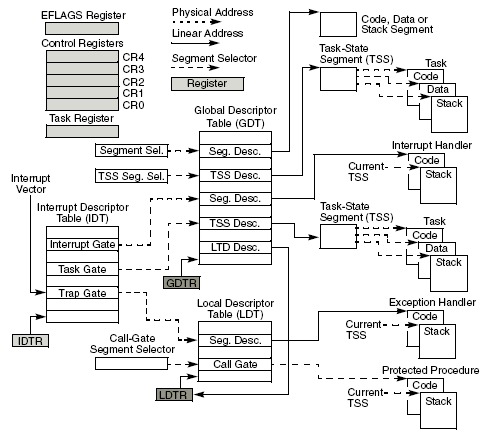
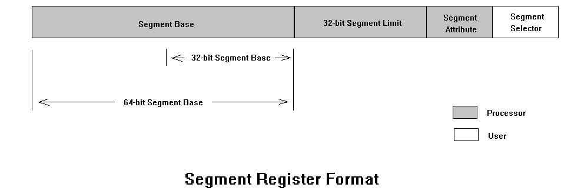

# Windows Kernel 01

## Intel CPU

## 寄存器

寄存器分类介绍
- 通用寄存器：8个，分别为EAX,EBX,ECX,EDX,- ESP,EBP,ESI,EDI
- 标志寄存器：1个，EFLAGS
- 控制寄存器：5个，分别为CR0-CR4
- 调试寄存器：8个，分别为DR0-DR7
- 系统地址寄存器:4个，GDTR、IDTR、LDTR和TR
- 16位段寄存器：6个，分别为CS,DS,ES,FS,GS,SS
- 其他寄存器：EIP、TSC等
 
###  段寄存器

Intel CPU中段寄存器有：
- CS
- DS
- ES
- SS
- FS
- GS

段寄存器有两部分构成，前一部分由编程可见的选择器寄存器(s: selector)，为6个16位寄存器；后一部分由6个64位的描述符寄存器(dl: descriptor low  和 dh: descriptor high)，后一部分是编程不可见的。

在实地址方式或虚拟8086方式，描述符寄存器不起作用，选择器寄存器退化成16位CPU的段寄存器功能，存放内存段的段基址——段首地址的高16位，其中CS对应于代码段、SS对应于堆栈段，DS对应于数据段，ES对应于附加数据段，在串操作时，DS和ES分别对应于源数据段和目的数据段。FS和GS没有定义。

段选择子

段描述符