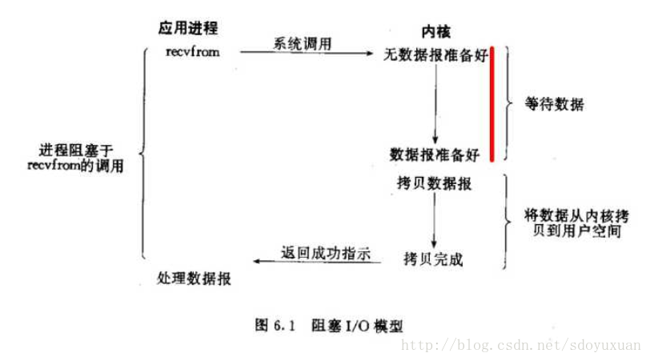
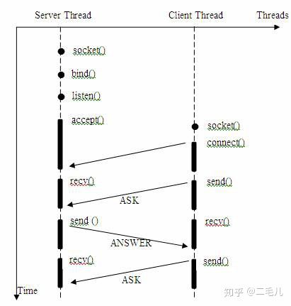
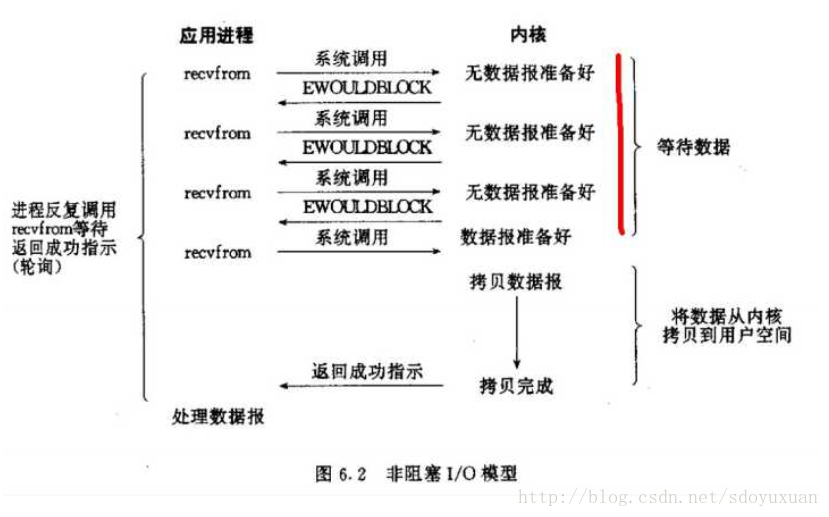
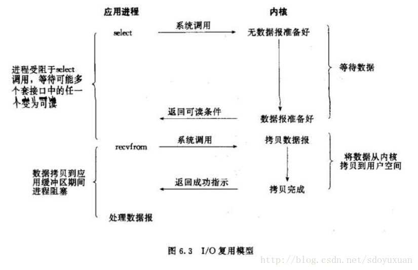
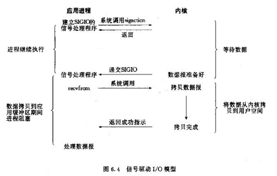
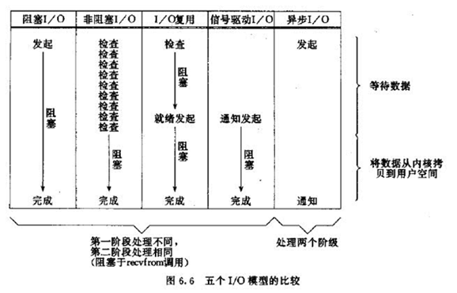

# 几种I/O模型的辨析

我们通常说的I/O指内存与外设、网络间的输入输出。

I/O操作通常有两个阶段组成：
- 用户进程访问内核程序
- 内核程序访问设备驱动（磁盘、网络）

《Unix网络编程》书中（其它系统类似）列举了5种类型的I/O模型：
- 阻塞IO模型
- 非阻塞IO模型
- IO复用模型
- 信号驱动的IO模型
- 异步IO模型

前面4种属于同步IO，最后一种属于异步IO。

## 阻塞IO模型

进程发起IO系统调用后，进程被阻塞，转到内核空间处理，整个IO处理完毕后返回进程。操作成功则进程获取到数据。

当用户进程调用了recvfrom这个系统调用，kernel就开始了IO的第一个阶段：准备数据。对于network io来说，很多时候数据在一开始还没有到达（比如，还没有收到一个完整的UDP包），这个时候kernel就要等待足够的数据到来。而在用户进程这边，整个进程会被阻塞。当kernel一直等到数据准备好了，它就会将数据从kernel中拷贝到用户内存，然后kernel返回结果，用户进程才解除block的状态，重新运行起来。
所以，blocking IO的特点就是在IO执行的两个阶段（等待数据和拷贝数据两个阶段）都被block了。

几乎所有的程序员第一次接触到的网络编程都是从listen()、send()、recv() 等接口开始的，这些接口都是阻塞型的。使用这些接口可以很方便的构建服务器/客户机的模型。下面是一个简单地“一问一答”的服务器。

典型应用：
- 阻塞socket
- Java BIO；

优点：
- 进程阻塞挂起不消耗CPU资源，及时响应每个操作；
- 实现难度低、开发应用较容易；
- 适用并发量小的网络应用开发；

缺点：
- 不适用并发量大的应用。
  - 因为一个请求IO会阻塞进程，所以，得为每请求分配一个处理进程（线程）以及时响应，系统开销大。

## 非阻塞型IO模型

进程发起IO系统调用后，如果内核缓冲区没有数据，需要到IO设备中读取，进程返回一个错误而不再等待内核（以使得进程不被阻塞）；进程发起IO系统调用后，如果内核缓冲区有数据，内核就会把数据返回进程。

非阻塞I/O,调用进程并不会被阻塞，当I/O条件不就绪的情况下，它会一直轮询，返回报错EAGAIN，当数据到达后，进行实际的数据I/O。

典型应用：
- socket是非阻塞的方式（设置为NONBLOCK）

特点：
- 进程轮询（重复）调用，消耗CPU的资源；

- 实现难度低、开发应用相对阻塞IO模式较难；

- 适用并发量较小、且不需要及时响应的网络应用开发；

## 多路复用I/O模型

多个的进程的IO可以注册到一个复用器（select）上，然后用一个进程调用该select， select会监听所有注册进来的IO；

如果复用器监听的IO在内核缓冲区都没有可读数据，select调用进程会被阻塞；而当任一IO在内核缓冲区中有可数据时，select调用就会返回；而后select调用进程可以自己或通知另外的进程（注册进程）来再次发起读取IO，读取内核中准备好的数据。

可以看到，多个进程注册IO后，只有另一个select调用进程被阻塞。

Linux中IO复用的实现方式主要有select、poll和epoll：
- Select：注册IO、阻塞扫描，监听的IO最大连接数不能多于FD_SIZE；
- Poll：原理和Select相似，没有数量限制，但IO数量大时，扫描线性性能下降；
- Epoll ：事件驱动不阻塞，mmap实现内核与用户空间的消息传递，数量很大，Linux2.6后内核支持；

典型应用：
- 有select、poll、epoll三种方案
- nginx都可以选择使用这三个方案;
- Java NIO;

特点：
- 专一进程解决多个进程IO的阻塞问题，性能好；
- 实现、开发应用难度较大；
- 适用高并发服务应用开发：一个进程（线程）响应多个请求；

## 信号驱动IO模型

当进程发起一个IO操作，会向内核注册一个信号处理函数，然后进程返回不阻塞；当内核数据就绪时会发送一个信号给进程，进程便在信号处理函数中调用IO读取数据。

特点：
- 回调机制
- 实现、开发应用难度大；

## 异步IO模型

当进程发起一个IO操作，进程返回（不阻塞），但也不能返回果结；内核把整个IO处理完后，会通知进程结果。如果IO操作成功则进程直接获取到数据。

典型应用：JAVA7 AIO、高性能服务器应用

特点：

- 不阻塞，数据一步到位；Proactor模式；
- 需要操作系统的底层支持，LINUX 2.5 版本内核首现，2.6 版本产品的内核标准特性；
- 实现、开发应用难度大；
- 非常适合高性能高并发应用；

## IO模型对比

参考：https://zhuanlan.zhihu.com/p/54580385
